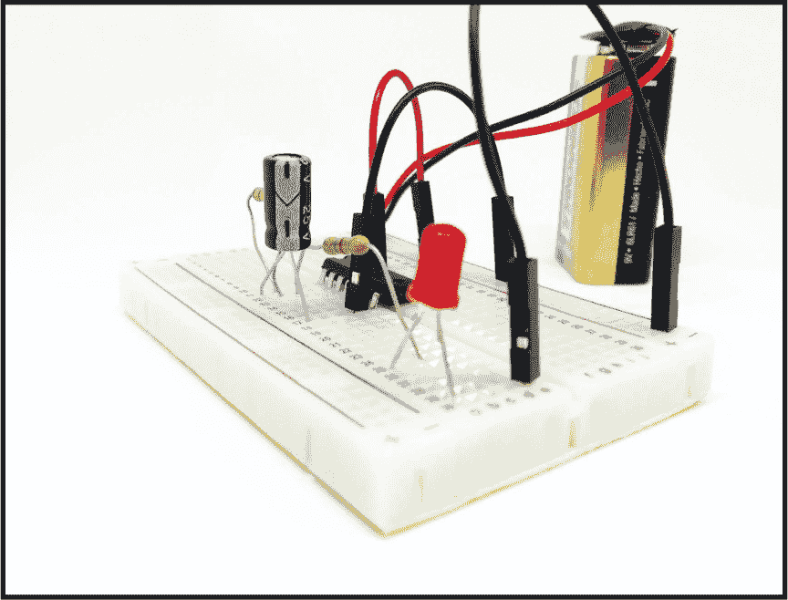
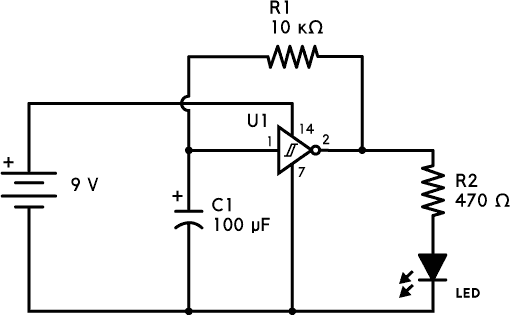
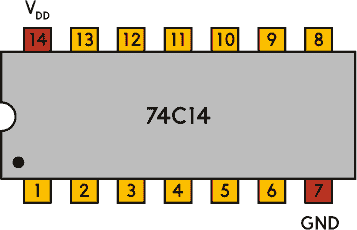
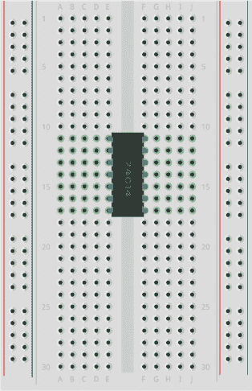
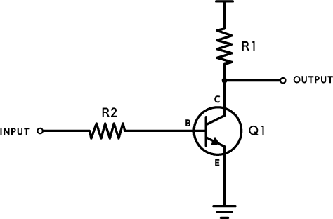
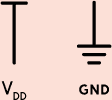
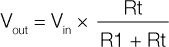
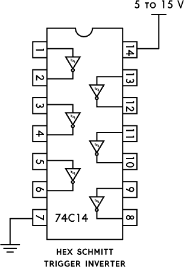

## 第六章：**闪烁的 LED**

该电路使 LED 闪烁开关。

### 电路图

### 元件清单

| **元件** | **数值** | **描述** |
| --- | --- | --- |
| U1 | 74C14 | 十六进制施密特触发器反相器 |
| C1 | 100 μF | 极性电容 |
| R1 | 10 kΩ | 标准电阻 |
| R2 | 470 Ω | 标准电阻 |
| LED |  | 标准输出发光二极管 |

### 关于电路

我小时候想学的第一件电子技术就是如何让灯闪烁。你可以通过几种方式实现这一点，但这个电路可能是最简单的方法，尤其是它只需要非常少的元件。事实上，你只需要五个元件，包括电阻和 LED。

该电路围绕一个*反相器*工作，反相器是一个输出与输入电压相反的元件。如果它接收到*高*电压输入，它会输出*低*电压，反之亦然。高电压是接近正电源电压（此处为 9 V），低电压是接近 0 V 的电压。

反相器（U1）的输出通过电阻连接回输入，这会导致*振荡*，即在高电压和低电压之间来回跳动。如果反相器输入为高电压，那么输出将为低电压。你将低电压输出连接回反相器的输入，因输入为低电压，输出将变为高电压。然后将高电压输出再次连接回反相器输入，如此循环。

为了将振荡速度减慢到足以看到 LED 闪烁的程度，你需要在反相器的输入端使用一个电容器。*电容器*用于存储和释放能量；该电路中的电容器（C1）的充放电将增加输入从低电压到高电压、从高电压到低电压的时间。电阻（R1）控制电流来回流动以充放电电容器，因此 R1 和 C1 的大小决定了振荡的速度。

你应该使用一个 74C14 IC *施密特触发器*反相器；它的高电压到低电压切换的阈值与低电压到高电压切换的阈值不同。这确保了反相器不会卡在高电压和低电压之间的某个状态。

施密特触发器反相器是一个 14 脚的*集成电路（IC）*，它是一颗具有自己内部电路的单片芯片。电路图中每个引脚旁边的数字表示该引脚在集成电路上的编号。图 5-1 展示了 74C14 IC 施密特触发器反相器引脚的排列方式。

**图 5-1** 74C14 施密特触发器反相器的引脚图

要将一个 IC 连接到面包板上，你需要将它跨接在两个元件区之间，如图 5-2 所示。

**图 5-2** 连接反相器 IC 至两个元件区

这将为你提供左侧组件区域引脚 1 到 7 的连接以及右侧组件区域引脚 8 到 14 的连接。请注意，引脚 1 在反相器的一角有一个圆形凹槽，或者它的引脚 1 端有一个缺口。

### 常见错误

如果你的电路没有正常工作，你可能犯了以下这些常见错误：

+   忘记将 V[DD]（引脚 14）连接到电池的正极

+   忘记将 GND（引脚 7）连接到电池的负极

+   错误读取集成电路的引脚排列

+   将 LED 的正极引脚误认为负极引脚

要减慢闪烁速度，增加电容值或 R1 的电阻值（或两者同时增加）。要加快闪烁速度，则减少这些值。

如果你仍然在这个电路上遇到困难，可以通过本书网站上的资源来获取更多帮助，网址是*[`nostarch.com/circuits/`](https://nostarch.com/circuits/)*。

### 电路工作原理

反相器是一种将输入信号反转的设备。因此，低输入会变成高输出，反之亦然。你可以使用一个晶体管和几个电阻器来构建一个简单的反相器，如图 5-3 所示。

**图 5-3** 使用晶体管构建的反相器

当输入端有*低*电压（0 伏特）时，晶体管处于关闭状态；当输入端有高电压（9 伏特）时，晶体管处于开启状态。

**使用 V[DD]和 GND 符号简化电路图**

图 5-3 顶部和底部的符号在电路图中是常见的。对于本书中的电池驱动电路，V[DD]是连接电池正极的地方，GND 是连接电池负极的地方。

你可以使用这两个符号来简化电路图，因为它们让你省略电池符号和连接电池与电路的线路。

当晶体管关闭时，你可以把它看作是一个集电极与发射极之间具有非常高电阻的电阻器（图中的 Rt）；当晶体管开启时，它就变成了一个电阻为零的电阻器。你可以通过忽略输入，单独看输出电路来更容易理解这一点，就像在图 5-4 中看到的那样。你可能会注意到，这实际上形成了一个电压分压器。

**图 5-4** 晶体管关闭时的简单电阻器

在项目 3 中，你学会了如何通过电压分压器计算电压。对于图 5-4 中的 R1 和 Rt，计算输出电压的公式是：

当你有高输入时，可以把晶体管看作是一个电阻（Rt），其电阻为零（或者看作一根导线）。如果你在这个公式中将 Rt 替换为零，无论其他值是什么，你都将得到 0 伏特作为输出电压，因此输出就是低电压。

当输入低电平时，你可以将晶体管看作是一个具有非常高电阻的电阻器——比如，数十亿欧姆。R1 的正常值为 1,000 Ω，所以如果你将 9 V 作为 V[in]，并且尝试将 10 亿欧姆代入公式作为 Rt，结果是 9 V——即高电平输出。

施密特触发器反相器的工作方式类似，但它在集成电路中增加了一些额外的组件，使得电路能够在不同的输入电压下从高电平切换到低电平，或者从低电平切换到高电平。

你在本项目中使用的 74C14 芯片是一种集成电路，包含六个反相器，这就是它拥有如此多引脚的原因。你可以在图 5-5 中看到该电路的引脚图和内部反相器。

**图 5-5** 74C14 芯片包含六个反相器

由于其小巧的体积，使用像 74C14 这样的集成电路相比于从头开始构建反相器可以节省大量空间。
