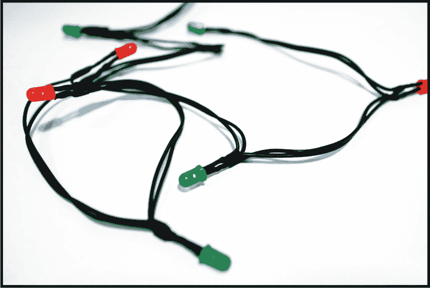
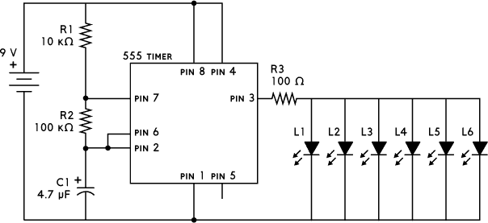
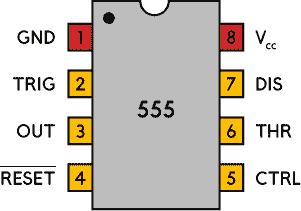
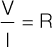
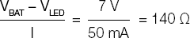
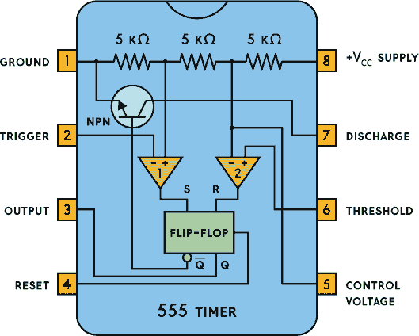

## 第八章：聚会灯光

该电路将多个闪烁的 LED 连接起来，制作成串灯。

### 电路图

### 零件清单

| **部分** | **数值** | **描述** |
| --- | --- | --- |
| R1 | 10 kΩ | 标准电阻 |
| R2 | 100 kΩ | 标准电阻 |
| R3 | 100 Ω | 标准电阻 |
| C1 | 4.7 μF | 极性电容 |
| L1 到 L6 | 红色、黄色或绿色 | 标准 LED；所有 LED 的正向电压（Vf）必须大致相同 |
| U1 | NE555 | 555 定时器 IC |

### 关于电路

如果你想为聚会做点酷炫的东西，这个电路就是为你设计的。这是一个简单的方式，让多个 LED 同时闪烁。通过将所有的灯通过一根长线连接在一起，你可以把它们挂在窗户上，或者用它们来装饰一棵树。

电路使用了一个*555 定时器*，它是一个经典的集成电路，用来让事物反复开关；你可以在图 7-1 中看到定时器的引脚图。

**图 7-1** 555 定时器引脚图

两个电阻（R1 和 R2）和一个极性电容（C1）设置了闪烁的速度，而第三个电阻（R3）决定了流向 LED 的电流。

### 常见错误

如果电路无法正常工作，可能是你犯了以下一些常见错误：

+   将一个或多个 LED 连接错误方向

+   将 555 定时器接错

+   将电容器接反

+   将集成电路（IC）的引脚编号弄混，导致连接到错误的引脚

你可以通过改变电阻（R3）的数值来添加或移除 LED。如果每个 LED 需要 10 毫安电流，且你想使用五个 LED，那么你需要 50 毫安电流通过电阻。你可以使用*欧姆定律*来计算正确的电阻值：

欧姆定律表明，电阻等于电阻器两端的电压除以流过它的电流。在你五个 LED 的例子中，这转化为以下方程：

在这种情况下，你使用的是 9 伏电池，LED 之间约有 2 伏电压，所以得到 7 伏作为分子。然后将其除以先前计算的 50 毫安，得到 140 欧姆的电阻。请注意，随着你添加更多的 LED，电路需要的电阻会减少，而随着你移除 LED，所需的电阻会增加。

如果你在使用这个电路时遇到困难，可以通过本书的官方网站提问和留言，网址是 *[`nostarch.com/circuits/`](https://nostarch.com/circuits/)*。

**注意**

*555 定时器总共只能输出 100 到 200 毫安的电流。请查看芯片的数据手册，获取确切的数值。*

### 电路如何工作

图 7-2 展示了 555 定时器的内部结构。绿色框中标记为“触发器”的部分是一个简单的记忆装置，具有两种状态：输出高电平（翻转）和输出低电平（翻摆）。它有两个输入，设定（S）和重置（R），它们分别将输出（Q）设置为高电平或重置为低电平。Q 始终与相反。

你看到的两个三角形是*比较器*。如果标记为 + 的比较器输入电压高于标记为 – 的输入电压，则输出为高电平；否则，输出为低电平。

**图 7-2** 555 定时器内部结构

V[CC] 和地面之间的三个 5 kΩ 电阻是“555”这个名字的由来。它们将 V[CC] 电压分为三等分，为每个比较器设置固定电压：V[CC] 的三分之一电压送到比较器 1 的正 (+) 输入端，V[CC] 的三分之二电压送到比较器 2 的负 (–) 输入端。

如果你查看图 7-2 中的输出（引脚 3），你会看到它连接到触发器的输出。这意味着如果触发器被“设置”了，输出为高电平；否则，输出为低电平。如果你查看触发器的输入，你会看到两个比较器负责设置和重置触发器。这意味着负责控制输出开关的引脚是引脚 2 和 6。

引脚 2 标记为*触发端*，负责将输出设为高电平。当引脚 2 的电压低于 V[CC] 的三分之一时，比较器 1 输出高电平并设置触发器，进而将输出设为高电平。引脚 6 标记为*阈值*；当其电压超过 V[CC] 的三分之二时，负责将输出重置为低电平。

请参考本项目开始时的电路图。对于本项目的电路，引脚 2 和 6 相互连接，因此当这些引脚上的电压升高时，输出为低电平。当这些引脚上的电压降低时，输出为高电平。这意味着你需要在这些引脚上切换电压的高低，以切换输出的高低电平。

引脚 7 对于实现这个功能非常重要。它标记为*放电*。在芯片内部，引脚 7 连接到一个晶体管，如图所示。该晶体管由控制，即输出的反向值。这意味着当输出为低电平时，晶体管接收到高电平并导通，将引脚 7 连接到地面。否则，晶体管关闭，引脚 7 与任何东西都不连接。

当我们给电路通电的瞬间，电容器 C1 完全放电。这意味着引脚 2（触发端）为低电平，意味着引脚 3（输出端）为高电平。这也意味着引脚 7（放电端）在内部没有连接到任何东西。

由于 C1 通过 R1 和 R2 连接到 9V 电源，C1 将开始充电，其正极引脚上的电压将开始上升。这意味着引脚 6（阈值引脚）上的电压也在增加。当阈值电压足够高时，输出从高电平变为低电平，并且引脚 7（放电引脚）会内部连接到地面。

在这种情况下，当引脚 7 连接到地面时，电容器将通过 R2 开始放电（因此引脚的名称为放电引脚），一直放电到引脚 7 的地面。因此，电容器两端的电压会降低，并且会持续下降，直到引脚 2 上的电压低到足以“触发”为止。当触发时，输出从低电平切换到高电平，引脚 7 会再次与地面断开连接。

现在我们回到与开始时相同的情况，电容器正在充电，以至于电容器两端的电压逐渐升高。这个过程会无限重复。

以下是 555 定时器每个引脚的简要概述：

+   **引脚 1 地面** 该引脚连接到电池的负极。

+   **引脚 2 触发** 当该引脚电平变低（小于 V[CC] 的三分之一）时，输出变为高电平。

+   **引脚 3 输出** 当输出为高电平时，芯片的输出电压约为 V[CC] 低 1.5 V，而输出为低电平时，电压接近 0 V。

+   **引脚 4 复位** 该引脚用于复位整个电路。它是一个“反向”引脚，这意味着当引脚电平变低时，会复位。也就是说，通常引脚需要保持高电平，以避免芯片处于“复位”状态。

+   **引脚 5 控制电压** 该引脚用于控制阈值引脚的阈值电压。当你想调整电路的频率而不改变 R1、R2 和 C1 的值时，这个引脚非常有用。对于这个电路，你可以将其不连接。有时你会看到这个引脚通过一个电容与地面连接；这种方式是为了防止其上的噪声影响频率。

+   **引脚 6 阈值** 当电压升高（超过 V[CC] 的三分之二）时，该引脚将输出恢复为低电平。

+   **引脚 7 放电** 当输出为高电平时，该引脚未连接；当输出为低电平时，它连接到地面。

+   **引脚 8 V[CC] 电源** 这是正电源引脚，能够承受 5V 到 15V 之间的电压。
