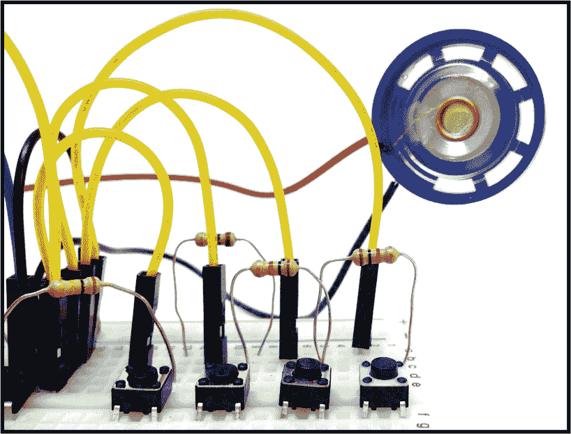
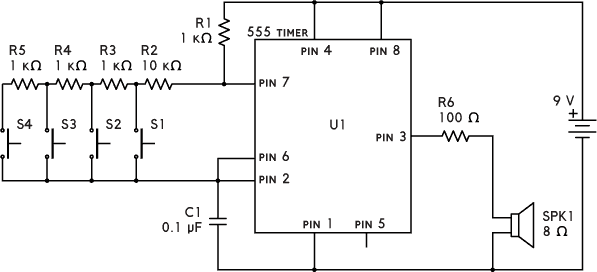
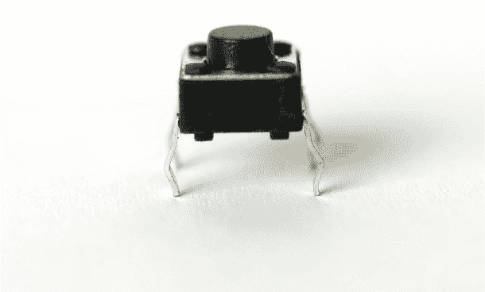
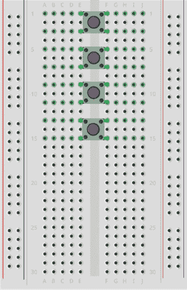
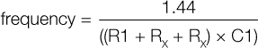
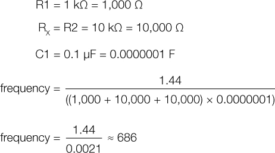
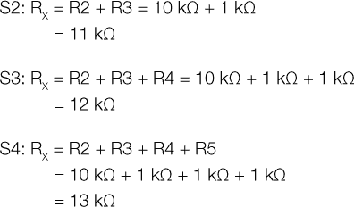

## 第九章：数字钢琴

这个项目的四个按钮会播放四种独特的音调。

### 电路图

### 部件清单

| **部件** | **数值** | **描述** |
| --- | --- | --- |
| R1 | 1 kΩ | 标准电阻 |
| R2 | 10 kΩ | 标准电阻 |
| R3–5 | 1 kΩ | 三个标准电阻 |
| R6 | 100 Ω | 标准电阻 |
| C1 | 0.1 μF | 非极性电容 |
| U1 | NE555 | 555 定时器 IC |
| S1–S4 | 瞬时开关 | 四个触感微型按钮 |
| SPK1 | 8 Ω | 微型扬声器 |

### 关于电路

在这个电路中，你将制作一个有四个按钮的乐器，每个按钮播放一种不同的音调。

为了产生声音，你需要向扬声器发送一个振荡电压。因此，你将使用 555 定时器生成一个快速开关的电压——每秒几百次！

电容 C1 的数值、电阻 R5 的数值以及引脚 6 和 7 之间的电阻将决定声音的音调。你将把电阻器放在每个按钮之间，因此按下按钮会影响电路的电阻。这意味着引脚 6 和 7 之间的电阻会根据你按下的按钮而不同，从而产生不同的音调。

按钮有四个引脚。当你从图 8-1 所示的角度查看它时，前面的两个引脚总是连接在一起，后面的两个引脚也是如此。当你按下按钮时，前面的引脚会连接到后面的引脚。

**图 8-1** 按钮有四个引脚。

我偏好的按钮连接方式是将按钮横跨板子的中间间隙，如图 8-2 所示。这可以为你连接电阻和必要的电线提供足够的空间。不要担心旋转问题，因为按钮只有一个方向可以安装。

**图 8-2** 连接按钮，使它们跨越间隙。

最好先只用一个按钮来构建电路。先连接按钮 S1，然后当第一个按钮正常工作后，再添加其他三个按钮。

**警告**

*确保电阻 R6 与扬声器串联有两个原因：（1）限制流向扬声器的电流，这样即使是非常小的扬声器也不会烧坏；（2）确保你不会通过施加超过 IC 承受范围的电流而损坏 IC。*

### 常见错误

如果你遇到电路无法正常工作的问题，请检查是否犯了这些常见错误：

+   错误连接 555 定时器

+   将 IC 的引脚编号搞错并连接到错误的引脚上

+   忘记连接一根电线（由于连接太多，很容易搞错！）

如果你想在键盘上添加超过四个按钮，可以增加更多的按钮和电阻。

如果你在这个电路上遇到困难，可以通过书籍网站提出问题和发表评论，网址是 *[`nostarch.com/circuits/`](https://nostarch.com/circuits/)*。

### 电路的工作原理

在上一章中，你了解了 555 定时器的工作原理。这个电路的工作方式相同，只是第 7 项目中的输出是缓慢开关的，可能是每秒一次。而在这个电路中，输出每秒钟切换数百次！

电容器 C1 和电阻器 R1 到 R5 决定了输出（引脚 3）在高电压和低电压之间切换的频率。要计算你听到的声音的准确频率，你将使用 555 定时器的切换频率公式：

R[X]的数值是引脚 6 和引脚 7 之间的电阻值，因此它将取决于你按下哪个按钮。让我们看看按下 S1 时你得到的频率：

如果你将这些数值输入计算器，你会得到 686。这意味着第一个按钮的频率是 686 Hz。

对于其他按钮，以下是你需要输入频率公式的 R[X]值：

如果你在计算器上计算这些数字，你应该得到：

S2: 626 Hz

S3: 576 Hz

S4: 533 Hz

如果你想改变每个按钮的频率（或音调），你需要改变电阻器 R2 到 R5 的数值。首先尝试以 100 Ω的增量进行调整，然后再通过更小的增量来微调音调。将两个电阻串联起来会得到它们的总电阻，等于它们的和。
