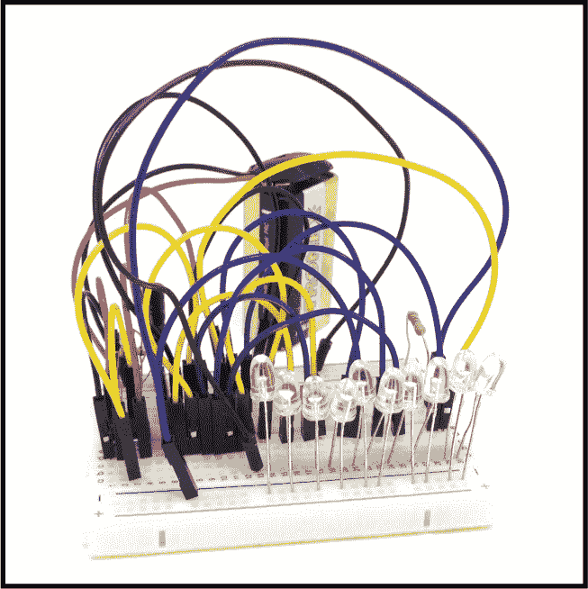
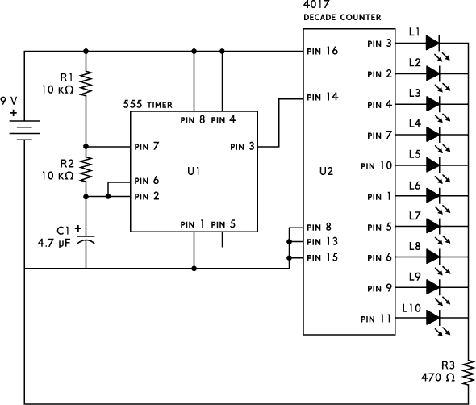
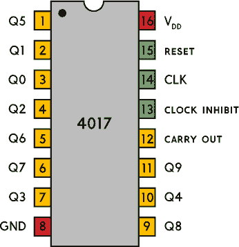

## 第十章：LED 霓虹灯

该电路创建一个跑马灯效果，像旧式的电影院霓虹灯招牌一样。

### 电路图

### 零件清单

| **元件** | **数值** | **描述** |
| --- | --- | --- |
| R1, R2 | 10 kΩ | 两个标准电阻 |
| R3 | 470 Ω | 标准电阻 |
| C1 | 4.7 μF | 极性电容 |
| L1 到 L10 | LED | 标准发光二极管 |
| U1 | NE555 | 555 定时器集成电路 |
| U2 | CD4017B | 4017 十进制计数器集成电路 |

### 关于电路

该电路使用了 555 定时器和 4017 十进制计数器，都是集成电路。555 定时器的 3 号引脚的电压会在高低之间反复切换，正如你在项目 8 中看到的那样。你将这个信号连接到 4017 集成电路的 14 号引脚，4017 会计数 14 号引脚的电压从低到高的次数。4017 有 10 个输出—标记为 Q0 到 Q9—代表这个计数。例如，经过三次计数后，Q3 输出为高电平，其他输出为低电平。到第 10 次计数时，计数器会重新从 Q0 开始。图 9-1 显示了 4017 集成电路的引脚排列。

**图 9-1** 4017 集成电路的引脚排列

运行速度由 R1、R2 和 C1 设置。改变其中一个值，灯光的运行速度将发生变化。较大的值会减慢速度，较小的值会加快速度。

这是一个大型电路，因此很容易将导线或元件连接到错误的位置。我建议你先连接 555 定时器部分。然后，将一个 470 Ω 电阻与 LED 串联，连接在 555 输出的 3 号引脚和电池的负极之间。你应该能看到 LED 快速闪烁。这样，你可以断开 LED 和电阻，继续连接其余的电路。

这个电路包含了很多连接在一个小区域内，因此你需要灵活使用空间。我建议你使用左侧电源区的其中一列来连接 LED 的负极。这将节省一些空间。

### 常见错误

如果你的电路无法正常工作，请检查你是否犯了以下常见错误：

+   将一个或两个集成电路连接错误

+   将集成电路的引脚号搞错，并将元件连接到错误的引脚

+   将一个或多个 LED 连接错误

+   将电容器连接反向

+   将导线或元件连接到应该连接位置的上方或下方一行

如果你在使用这个电路时遇到困难，可以通过本书的网站获得更多资源，网址是 *[`nostarch.com/circuits/`](https://nostarch.com/circuits/)*。

### 电路如何工作

该电路使用 555 定时器生成连续的脉冲序列（称为*时钟脉冲*），并使用 4017 十进制计数器来计数它接收到的脉冲数。Q0 到 Q9 的输出 LED 指示当前计数。当计数器达到 10 时，它会自动从 0 重新开始。这样，LED 看起来像是从一边跑到另一边，且没有停止。

4017 集成电路非常易于使用。要让它工作，只需将 V[DD]和 GND 引脚连接到电源。通常，5 V 到 15 V 之间的电压即可正常工作。连接好电压后，芯片开始运行，并会对其 CLK（时钟）输入引脚上的低电平到高电平的每一次过渡进行计数。

请注意，每个输出只能提供大约 10 mA 的电流。如果尝试从每个输出获取更多的电流——例如，通过使用较小的 R3 电阻——可能会导致奇怪的行为，甚至损坏芯片。

以下表格提供了每个引脚功能的概览。

| **PIN #** | **名称** | **描述** |
| --- | --- | --- |
| 1 | Q5 | 当计数为 5 时为高电平 |
| 2 | Q1 | 当计数为 1 时为高电平 |
| 3 | Q0 | 当计数为 0 时为高电平 |
| 4 | Q2 | 当计数为 2 时为高电平 |
| 5 | Q6 | 当计数为 6 时为高电平 |
| 6 | Q7 | 当计数为 7 时为高电平 |
| 7 | Q3 | 当计数为 3 时为高电平 |
| 8 | GND | 地（0 V）连接 |
| 9 | Q8 | 当计数为 8 时为高电平 |
| 10 | Q4 | 当计数为 4 时为高电平 |
| 11 | Q9 | 当计数为 9 时为高电平 |
| 12 | 进位输出 | 计数为 0 到 4 时输出高电平 |
| 13 | 时钟禁止 | 当此输入为高电平时，计数器不会计数任何时钟脉冲 |
| 14 | CLK | 用于计数的脉冲输入 |
| 15 | 复位 | 当复位引脚为高电平时，将计数重置为 0；必须为低电平才能计数 |
| 16 | V[DD] | 正电压供应 |
