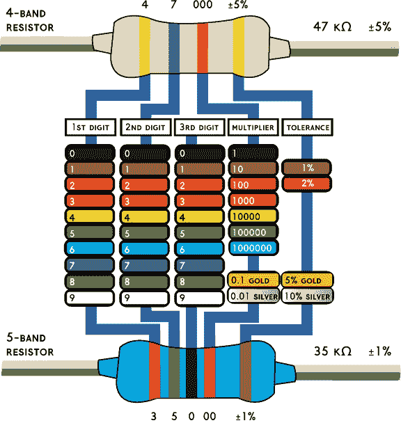
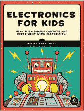
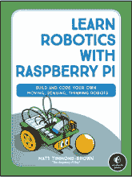
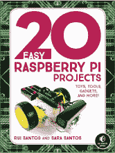
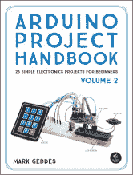
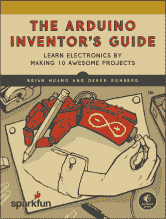

## 第十二章：电阻颜色代码

[www.build-electronic-circuits.com](http://www.build-electronic-circuits.com)

*《电路入门指南》* 使用了 Helvetica Neue、Montserrat 和 True North 字体。

**资源**

访问 *[`nostarch.com/circuits/`](https://nostarch.com/circuits/)* 获取更新、勘误和其他信息。

更多实用的书籍来自  **NO STARCH PRESS**

**《儿童电子学》**

玩转简单电路，体验电力实验！

*作者* ØYVIND NYDAL DAHL

2016 年 7 月，328 页，24.95 美元

ISBN 978-1-59327-725-3

*全彩*

**《与树莓派一起学习机器人技术》**

构建和编程你自己的移动、感应、思考型机器人

*作者* MATT TIMMONS-BROWN

2018 年秋季，200 页，24.95 美元

ISBN 978-1-59327-920-2

*全彩*

**《20 个简单的树莓派项目》**

玩具、工具、配件及更多！

*作者* RUI SANTOS *和* SARA SANTOS

2018 年 4 月，288 页，24.95 美元

ISBN 978-1-59327-843-4

*全彩*

**《Arduino 项目手册，第 2 卷》**

25 个适合初学者的简单电子项目

*作者* MARK GEDDES

2017 年 8 月，272 页，24.95 美元

ISBN 978-1-59327-818-2

*全彩*

**《Arduino 发明家指南》**

通过制作 10 个精彩的项目学习电子学

*作者* BRIAN HUANG *和* DEREK RUNBERG

2017 年 6 月，336 页，29.95 美元

ISBN 978-1-59327-652-2

*全彩*

**《电力漫画指南》**

*作者* KAZUHIRO FUJITAKI, MATSUDA, *和* TREND-PRO CO, LTD.

2009 年 3 月，224 页，19.95 美元

ISBN 978-1-59327-197-8

**1.800.420.7240 或 1.415.863.9900 | sales@nostarch.com | [www.nostarch.com](http://www.nostarch.com)**

## 适合 10 岁以上

你能做到！

*《电路入门指南》* 是每一个准备进入电子学和电路设计世界的人的完美第一步。

首先，你将学习如何阅读电路图并使用面包板，这样你就可以连接电子元件，而不需要使用热烙铁！接下来，你将使用一些简单的、易于获得的元件，如电阻器、晶体管、电容器和其他零件，搭建九个简单的项目。在动手过程中，你将了解每个元件的作用、工作原理，以及如何将元件组合起来，创造出新的有趣效果。

到书的最后，你将能够构建自己的电子创作。通过易于跟随的指导，任何人都可以借助*《电路入门指南》*成为发明家！

### 构建这 9 个简单电路！

 **稳手游戏：** 使用电线和蜂鸣器，打造一款像《动手术》游戏一样的测试神经耐力的游戏！

 **触摸感应灯：** 用你的手指点亮灯！

 **曲奇罐警报器：** 用这个装置抓住偷吃曲奇的小偷。

 **夜灯：** 当天色变暗时，自动打开灯光。

 **闪烁的 LED：** 这个经典电路使 LED 闪烁。

 **铁路道口灯：** 危险！如果这个电路的两盏灯在闪烁，千万不要穿越铁轨。

 **派对灯光：** 使用这些迷人的串灯举办一场派对。

 **数字钢琴：** 用这个简单的合成器演奏一首曲子，了解扬声器的工作原理。

 **LED 广告牌：** 上演一场灯光秀，用这个炫酷的结局给朋友们留下深刻印象。

**Øyvind Nydal Dahl** 在 14 岁时制作了他的第一个电路，并从那时起一直在不断构建。Øyvind 拥有奥斯陆大学的电子学硕士学位，帮助公司开发新产品，并在世界各地教授电子学工作坊。他还是《*儿童电子学*》（No Starch Press，2016）的作者。更多关于 Øyvind 的信息， 请访问 *[`www.build-electronic-circuits.com/`](http://www.build-electronic-circuits.com/)*。

***极致极客娱乐™***

[www.nostarch.com](http://www.nostarch.com)
