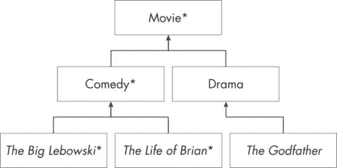

## 第三十二章：32 面向对象设计


在前面的章节中，我探讨了许多通常与 Batch 无关的主题，从布尔值到哈希表，还有很多其他内容。在这一章中，我将处理 Batch 用户自建工具的圣杯：面向对象设计。

在解释了过程式编码和面向对象编码的区别后，我将介绍面向对象编程的四大支柱。接着，我会展示一个完整功能的 Batch 面向对象设计模型，其中包含代表父对象、中间对象和子对象的 bat 文件。在你学会如何调用面向对象的代码后，我将分享许多建议并分析这个模型如何满足面向对象设计的基本原则。

### 过程式与面向对象编程

在计算机的早期，所有的编码都是*过程式的*——也就是说，所有程序由一系列计算步骤组成。这个方法论至今仍然存在，可能有超过一万亿行这样的代码仍在使用，每天还有更多新的代码被编写出来。在过程式代码中，变量默认是全局访问的。有时，程序开头的一部分会定义数百个变量，而在其他时候，比如在批处理程序中，变量是在首次引用时创建的。即使调用了一个内部例程或过程，活动和可用的变量集合也不会改变。通常可以采取一些措施来限制作用域，比如第三章中讨论的 setlocal，但在过程式编码中，变量通常可以在程序文件的任何地方被设置或重置，这些文件通常非常庞大。

很快，一些聪明的人提出了*面向对象编程（OOP）*的概念，在这种方法中，代码被分解成小的、易于管理的*对象*，每个对象包含变量形式的数据和方法形式的可执行代码。*方法*类似于批处理中的内部例程；它可以被调用，当它完成执行时，控制权会返回到调用点，但方法也可以被外部调用；即，其他程序文件中的代码可以直接调用该方法。不管调用的来源是什么，方法都接受明确定义的输入并返回同样明确定义的输出。然而，方法内部的大多数数据通常无法从程序文件的其他地方访问，尤其是从其他程序文件中。

代码的模块化将其分解为独立的对象，从而简化了逻辑并防止了代码某一部分对其他部分产生不良影响。此外，如果其中一个对象在不同的上下文中有用，它可以在不修改或重复的情况下被两个进程轻松使用。一个等效有用的过程式程序部分可能最终被复制并粘贴到另一个程序中。

如果我要列出一些个人的重大烦恼——为了简洁起见，我将把范围限制在与工作/编码相关的烦心事——在我愤懑的清单上，排在最前的是伪装成面向对象代码的过程式代码。某些语言和框架是专门为支持每种编码范式设计的。Java 和 C#是面向对象语言；COBOL 和 Batch 是过程式语言。但与许多人的看法相反，事情并没有那么简单；过程式代码可以很容易地在 Java 中编写，而经过一些努力，面向对象的原则也可以在 Batch 中实现。

### 四大支柱

任何声称是面向对象的编程语言，都必须完全支持面向对象编程的四大支柱。被认为是面向对象的语言以不同的方式实现这些支柱，但它们都有内置的机制，引导程序员编写具有这四个特征的代码。

第一大支柱是*抽象*，它简化了代码与外部世界的接口。它只向用户展示必要或相关的特性，同时屏蔽实现细节和任何与功能使用无关的信息。

这引出了第二大支柱——*封装*，它限制了对对象中某些方法和变量的访问，将数据和代码封装成多个小单元。数据隐藏，或者将某些变量和方法视为私有，是这一支柱的重要组成部分。另一个重要部分就是创建紧凑、易读且可重用模块的行为。

*继承*，第三大支柱，允许创建基础或父对象。然后，派生对象可以在扩展父对象以满足子对象的更具体需求时使用它。经典的例子是一个“动物”作为基础或父对象，定义了整个动物王国中共同的特征。然后，作为“爬行动物”和“哺乳动物”的中介对象可以从“动物”对象继承数据和程序，并在此基础上添加各自的生物学分类信息。接着，“猫”、“鼠标”甚至“蝙蝠”对象可以从“哺乳动物”对象继承，而“哺乳动物”对象又继承自“动物”对象。然后，地球上每一种蝙蝠物种都可以从“蝙蝠”对象继承。最终，每个继承的对象都可以使用其父对象中的数据和代码。

第四大支柱，*多态*，意味着以多种不同形式出现的状态，字面上源自希腊语，意为*多种形式*。这使得调用一个例程在不同情况下表现得不同。可重用的代码总是很棒的，但这一支柱将重用的概念推向了巅峰。父对象中的方法可能会被多个子对象调用，而每次调用对每个子对象来说都是独特的。

在接下来的页面中，我将尝试模仿这四大支柱：抽象、封装、继承和多态。

### Batch 面向对象设计

本章讲解的是 Batch 面向对象设计，而不是 Batch 面向对象编程，原因有两个。首先，更琐碎的一点是，BOOP 是一个糟糕的缩写，让人联想到在亲切地戳宝宝鼻子时发出的声音。BOOD 也不怎么样，但我确实有一个“辉煌缩写团队”（Brilliant Acronym Team，简称 BAT）正在努力做一些更好的……抱歉，是更棒的事情。

更为重要的是，Batch 没有实现面向对象编程（OOP）所固有的内建特性，这些特性在更现代的编程语言中得到了实现。我将展示如何模拟其四个支柱，并且创建面向对象的批处理文件的成功程度可能会让许多人感到惊讶，但我会比其他功能更完整地构建一些其功能。真正的面向对象编程在 Batch 中是不可能实现的，但我鼓励你在 Batch 代码的设计中，完全或部分地融入这些设计元素。

在 Batch 中，变量不能被定义为公有或私有；事实上，变量根本无法定义。没有像“extends”或“implements”这样的关键字来调用继承。面向对象编程（OOP）中，子对象可以覆盖父对象的方法；你很快就会看到如何在 Batch 中执行这些任务，但它们不会自动完成。请记住，这是一个没有布尔值、浮动值、while 和 do...while 命令、以及 and 和 or 运算符、数组和哈希表的语言。我已经演示了如何利用手头的工具构建所有这些功能（并且在第三十三章中我将以同样的方式演示堆栈和队列的构建），所以应该不会让人感到惊讶，Batch 并没有现成的面向对象编程功能。

然而，面向对象的原则是可以使用的，而且应该被使用，不论提供了什么样的工具集。在“面向对象语言”中编程的人，往往会轻易地定义过多的类级别变量，将所有数据项设置为公有，并将大部分代码放入一个“上帝对象”（一个做得太多且太大，无法高效管理的单一对象）中。但无论是什么编程语言，这种设计模式——大模块和过多的全局变量——本质上还是过程式编程。更现代的语言提供了面向对象的护栏，但这些护栏是可以突破的。

相反，许多人认为批处理程序员应该只创建大型、无趣的模块。但尽管批处理过程式代码是标准做法，却没有“批处理警察”强制要求它。当面向对象编程或设计被视为一种技术，而不是仅与某些语言相关的特征时，你会恍若顿悟，仿佛走在前往大马士革的路上。批处理并没有其他语言所提供的坚固护栏，但你可以使用任何编程语言来打造面向对象的技术，就像即使在悬崖峭壁的山路上开车也完全有可能到达山顶。批处理中可能没有基础设施或管道，也不是所有事情都能实现，但批处理中的面向对象设计的优雅性提供了与其他语言相同的好处。

### 类与对象

面向对象编程与批处理面向对象设计之间的一个区别是，传统上每个模块或文件被定义为一个 *class*，而 *object* 是该类的一个实例化。实例化一个对象就像定义一个变量一样。就像在许多语言中，变量可以定义为字符串或整数，实例化对象就是将其定义为类的一个具体实例。

举例来说，假设定义了一个类 *Bat*，表示所有飞行的夜行哺乳动物，其中每个蝙蝠物种都有自己的类，从 *Bat* 类继承。其中一个物种是马达加斯加果蝠，其类可能定义为 *MadFruitBat*。这个类表示所有属于该物种的蝙蝠，并且它可以被实例化多次，每次代表一个特定的个体。一个包含 500 只马达加斯加果蝠的洞穴可以被填充为 500 个对象，每一个都是 *MadFruitBat* 类的一个实例，且每个实例会为特定的蝙蝠命名。

这就是批处理（Batch）首次遇到面向对象限制的地方。记住，这是一种无法定义变量为字符串或整数的语言。显然，因此，变量不能被定义或实例化为与类模块相对应的数据类型。在批处理中，类与对象之间的区别是不存在的。模块或批处理文件本身就是一个对象。它不需要实例化，也无法实例化。

出于这个原因，*class* 这个词并不是批处理面向对象设计术语的一部分。我很快会分享一些完全构成对象的批处理文件，每一个都可以被调用，我将把它们称作 *objects*。在面向对象编程（OOP）中定义的马达加斯加果蝠类（*MadFruitBat*）将会是批处理中的 *MadFruitBat.bat* 对象批处理文件。为了实现 500 只马达加斯加果蝠，你需要为每只果蝠创建一个小的批处理文件，每个文件都继承自 *MadFruitBat.bat*。

事实上，*oMadFruitBat.bat* 是对象 bat 文件的更好名称。为了区分对象 bat 文件与其他常见的 bat 文件，我总是在它的名字前加上小写字母 *o* 作为视觉提示。*obj* 文字也可以使用。

### 批处理面向对象设计模型

描述面向对象设计的最佳方式是通过示例或模型。接下来我将简要介绍本章中展示的批处理面向对象设计的示例。然后，我将展示父对象，并附上中间对象和子对象的示例，同时解释每个模块中实现的面向对象概念。在接下来的部分“执行面向对象的批处理”中，我将详细讨论如何调用这个模型，而在后续部分“批处理中的四大支柱”中，我将探讨这个模型如何紧密模仿面向对象原则的核心概念。

在金字塔的顶部是基类或父对象。其他对象从它继承，但它是这个模型中唯一一个不从其他对象继承的对象。在父对象下方是直接继承自父对象的中间对象。其他中间对象可以从第一级中间对象继承，最终在金字塔底部形成子对象。中间对象和子对象都被称为 *派生对象*，因为它们继承或来源于其他对象。（从技术上讲，中间对象也是一个子对象，因为它是另一个对象的子对象，但我使用“子对象”一词来描述那些可能更准确地称为“无子对象”的对象。）

在本章的批处理面向对象设计模型中，电影是父对象，派生出了许多不同的电影类型对象，如科幻片、浪漫喜剧和动作片，虽然这里只展示了喜剧和剧情两种类型。每部电影都是一个特定的对象，每部电影从某个特定的类型对象继承而来。全球发布的电影超过两百万部，但在这里我只展示了三部，其中两部是有史以来最伟大的电影，*教父* 也是一部伟大的电影。我将在本章中展示的对象，在图 32-1 中已用星号标注。



图 32-1：父对象、中间对象和子对象

电影对象包含所有电影共有的数据和方法，或者至少是所有电影的默认数据和方法。（借用面向对象编程的术语，从这一点起我将使用 *方法* 来代替 *例程* 一词。）喜剧和剧情对象各自继承自电影对象，并对其进行扩展，定义了与每个类型特有的数据和方法。个别电影对象继承自类型对象，因此间接地继承自电影对象，并包含有关其特定电影的详细数据。（每条箭头表示从派生对象到其父对象的继承关系。）

但这不是一个严格的层次结构。像 StarTrek 这样的电影系列对象可以继承自科幻类型对象（两者都未显示），而个别的 *Star Trek* 电影则可以作为电影系列对象的子对象。

更重要的是，所有对象都是 bat 文件。Movie 对象最具体的形式是 *oMovie.bat* bat 文件，而 Comedy 对象是 *oComedy.bat* bat 文件。同样，子对象之一将是 *oBigLebowski.bat*。

一些面向对象的语言提供多重继承；也就是说，一个派生对象可以继承自两个或更多不同的对象。例如，Dramedy 对象可能同时继承自 Comedy 和 Drama 对象。虽然即使在 Batch 中从理论上讲也是可能的，但我将此模型限制为单一继承，因此 Dramedy 对象只是继承自 Movie 对象的另一种类型对象，个别的 dramedy 将继承自 Dramedy 对象。

#### 父对象

一旦这些概念变得清晰，你就会想看看一切是如何运作的。从基本或父对象开始，列表 32-1 显示了 *oMovie.bat* 的内容。请注意，这个和其他对象的 bat 文件不会以 setlocal 命令开头，因为它们总是从包含该命令的其他 bat 文件中调用。

```
 set meth=%~1
❶ for %%m in (Constructor DispInfo Set Get) do (
    if "%%m" equ "%meth%" (
     ❷ call :%meth% "%~2" "%~3" "%~4"
     ❸ goto :eof
 )  )
❹  > con echo ABORT - Invalid Method Invoked: %meth%
 pause & exit

❺ :Constructor
 set gauge{%~1}=35mm
 set clrOrBW{%~1}=color
 goto :eof

❻ :Set
 set %~1{%~3}=%~2
 goto :eof

❼ :Get
 set %~2=!%~1{%~3}!
 goto :eof

❽ :DispInfo
 > con echo "%~1" is a !year{%~1}! !clrOrBW{%~1}! !gauge{%~1}! film.
 > con echo      Genre: !genre{%~1}!
 > con echo      Plot: !plot{%~1}!
 > con echo   Starring: !star{%~1}!
 > con echo       Cast: !cast{%~1}!
 > con echo    Country: !cntry{%~1}!
 > con echo   Language: !lang{%~1}!
 > con echo.
 goto :eof

❾ :PrivateMeth
 rem - some private method code goes here
 goto :eof 
```

列表 32-1：基本或父对象，oMovie.bat

这个对象有很多有趣的部分。

##### 隐藏方法

封装，面向对象编程（OOP）的支柱之一，包括隐藏方法。默认情况下，bat 文件的所有方法都是隐藏的，因为没有内置的方式可以创建多个入口点进入 bat 文件；当 bat 文件执行时，每次都会从顶部开始。因此，这里的任务不是隐藏某些方法，而是使某些方法公开可访问，同时保持其他方法隐藏。

for 命令 ❶ 充当“交通警察”；它包含了 bat 文件的公共方法列表作为输入：构造函数（Constructor）、显示信息（DispInfo）、设置（Set）和获取（Get）。它代码块中的 if 命令将收到的第一个参数 meth 与此列表进行比较。如果它与列表中的某个方法匹配，则该参数（在前面加上冒号）将成为调用命令 ❷ 的参数，剩余的参数将作为附加参数传递。

在调用方法完成后，控制通过 goto :eof 命令 ❸ 立即返回到调用的 bat 文件，该命令位于 for 循环的末尾。注意，最后一个方法 ❾ 不在列表中。顾名思义，它是一个私有方法，只能从对象内部的方法中调用。如果一个调用的 bat 文件尝试调用任何不在列表中的其他方法，或者是一些根本不是方法的文本，代码将输出一个中止消息 ❹ 并在暂停后退出整个进程。（更强大的错误处理会更好，但这足以作为演示。）

##### 构造函数

在有面向对象约束的编程语言中，实例化一个对象时会自动调用该类所属的构造方法。事实上，甚至在调用构造方法之前，无法调用其他公共方法。构造方法可能会设置一些变量或打开一些文件，但其一般目的是设置对象，以便你可以在后续使用它。这个模型通过每个批处理对象顶部的 :Constructor 方法❺模拟了这一行为。

这个父对象的构造方法只是将两个变量设置为默认值，这样大多数单独的电影对象就不需要再次设置它们。过去几十年发布的大多数电影都是彩色拍摄并使用 35 毫米胶片拍摄的。这个构造方法只接受一个参数，即电影标题，所以对于一部特定的电影，两个设置命令分别将 35mm 和 color 的值赋给分别定义为 gauge{The Big Lebowski} 和 clrOrBW{The Big Lebowski} 的变量。这些变量名有空格，如果因为某些原因这造成了问题，你可以使用替换语法去掉空格，只要这样做时保持一致。

我们还需要为情节、上映年份以及其他特性设置变量，但这些显然没有默认值，因此我们会在其他地方设置它们。不过，你很快会看到，70 毫米黑白电影的对象将能够覆盖在父对象构造方法中设置的默认值。

##### 设置器和获取器

在严格的面向对象编程中，类通常会有许多 setter 和 getter 方法；也就是说，对于每个定义的数据项，一个方法设置它，另一个方法获取它的值。例如，可能会有一对方法用于获取和设置计量仪表，还有一对方法用于情节，等等。但由于延迟扩展和批处理缺乏定义的数据类型，我们可以将所有的 setter 方法合并成一个单一的 :Set 方法❻，并且我们可以通过一个单独的 :Get 方法❼来处理所有的 getter 方法。

:Set 方法包含一行有趣的代码，调用的批处理文件可以用来为对象设置任何变量。这是一个使用三个参数的设置命令：被设置的特性是 %~1，赋值的内容是 %~2，而电影标题是 %~3。要设置的变量名是第一个和最后一个参数的组合：%~1{%~3}。

为了演示这个是如何工作的，你可以通过以下调用命令来调用 :Set 方法：

```
call :Set plot "A day repeats ad infinitum" "Groundhog Day"
```

这次调用的结果将把第二个参数中的情节值设置为 plot{Groundhog Day} 变量，但注意在这个批处理文件中并没有显式地调用 :Set 方法。我稍后会展示如何从这个父级批处理文件外部进行此调用。

:Get 方法将赋值操作反转，返回值代替赋值操作。setter 和 getter 方法的参数相同，唯一值得注意的区别是 getter 的第二个参数是我们赋值给 plot 的变量名，而不是 plot 本身。方便的是，在感叹号内解析其他两个参数时，将提取 plot 的值作为赋值的一部分：!%~1{%~3}!。

下面是该方法的一种可能调用：

```
call :Get plot plotVar "Groundhog Day"
```

这将返回将 plotVar 变量设置为值 A 的结果，表示一天重复无穷或我们之前传递给:Set 方法的相同字符串。

很容易忽视这背后真正的微妙之处。再一次，延迟扩展为我们提供了一个在大多数语言中都无法获得的有用且优雅的解决方案。令人吃惊的是，一个拥有数十个变量的对象只需要一个 setter 和一个 getter 方法。在至少某个小的方面，Batch 比传统的面向对象语言提供了更好的解决方案。

##### 应用程序特定的公共方法

在传统的面向对象编程中，构造函数是必需的，setter 和 getter 是无处不在的，但通常还有其他应用程序特定的公共方法，我在*oMovie.bat*对象中就包含了一个这样的例子。:DispInfo 方法❽将电影的详细信息显示到控制台。该方法中的一系列 echo 命令将电影标题和其他几项数据写入控制台。例如，它的第一行提到电影本身，并详细介绍了上映年份、是否为彩色或黑白影片以及胶片规格。

这两个最后的变量是在构造函数中设置的，但年份变量和其他变量并没有设置。事实上，它们在父 bat 文件中唯一的提及就在这里。（我很快会分享它们的来源，但这与继承有关。）无论这些数据来自何处，这个方法可以为任何直接或间接派生自该对象的电影对象显示信息。这就是多态性。

> 注意

*如果像 plot{Groundhog Day}这样的变量让你想起哈希表元素，那是因为它们实际上就是哈希表的元素（见第二十九章）。你不需要理解数据结构就能理解这个模型，但在执行逻辑以为 17 部不同电影构建 17 个情节之后，plot 哈希表包含了 17 个元素。*

#### 中间对象

在这个模型中，所有的类型对象都是中间对象，*oComedy.bat*对象就是其中一个例子。它是*oMovie.bat*的子类，但它也有自己的子对象，其中两个在图 32-1 中显示。

列表 32-2 展示了完整的 bat 文件对象，*oComedy.bat*即为其中之一。

```
❶ set extends=C:\Batch\oMovie.bat
 set meth=%~1
❷ for %%m in (Constructor PublicMeth) do (
    if "%%m" equ "%meth%" (
     ❸ call :%meth% "%~2" "%~3"
       goto :eof
 )  )
❹ call %extends% %*
 goto :eof

❺ :Constructor
 call %extends% %meth% %*
❻ set genre{%~1}=Comedy
 goto :eof

❼ :PublicMeth
 :: some public method code
❽ call :PrivateMeth
 goto :eof

❾ :PrivateMeth
 :: some private method code
 goto :eof 
```

列表 32-2：中间对象，oComedy.bat

一眼看去，这看起来和父对象的结构很相似，但也有不同之处。第一行定义了另一个批处理文件，紧接着交通警察之后的是一个调用命令，而不是中止命令。构造函数还调用了另一个批处理文件，并且设置器和获取器方法都缺失了，还有用于显示电影信息的方法也不存在。

严格的面向对象语言有保留字和语法，允许一个对象无缝地继承另一个对象。与 Batch 不同，这就是子类如何使用 extends 关键字来继承 Java 中父类的方法：

```
public class oComedy extends oMovie {}
```

在 Batch 中，没有类似的内建语法，我们的做法是完全不同的。*oComedy.bat* 对象中的第一条语句定义了它继承的父对象批处理文件，即 *oMovie.bat* ❶，它也是它扩展的对象。然后，交通警察看起来和父对象中的差不多，维护着自己在 for 命令中的公共方法列表❷。如果第一个参数与列表中的两个公共方法匹配，调用命令就会调用它❸。但在父类中，如果要调用的方法不是公共的，它会中止，而子对象则会调用通过 extends 定义的父类，传递相同的参数❹。这就是继承。

中介（和子）对象可以定义父对象中尚未定义的方法。它还可以通过执行我已经展示的操作，继承父对象的方法。如果第一个参数不在公共方法列表中，这个批处理文件就成为一个简单的透传，因为它会做相同的调用传递给父对象❹。%* 语法确保了这个批处理文件接收到的参数列表就是传递给父对象的参数列表。

我们很快就能通过刚才描述的批处理继承方法调用父对象中的重要方法（:DispInfo、:Set 和 :Get）。优雅的是，所有的类型对象及其子对象都可以轻松地使用这些方法。中介对象不仅不需要重现这些方法，甚至无需提及它们。如果有人错误地将一个未在此处或父对象中公开的方法传递给这个对象，会发生什么呢？中介对象会将其传递下去，父对象会在一个地方处理所有子对象的错误。

这个对象不仅继承了父对象的方法。构造函数展示了如何*扩展*父对象中已经定义的方法。父对象中有一个 :Constructor 方法，但是通过交通警察设置的继承方式并不会调用它。相反，中介对象的 :Constructor 方法❺ 会覆盖它，但这并不意味着我们永远不会调用父对象的构造函数逻辑。

:Constructor 方法的第一行调用父对象以调用其同名的方法，即构造函数。这是传统面向对象语言的另一个内置特性，我们必须模仿。在调用父类构造函数之后，派生对象的构造函数对数据进行处理。记住，*oMovie.bat*对象在其构造函数中将电影定义为色彩和 35mm 格式。这里，*oComedy.bat*对象接受这两个值，并将类型定义为喜剧❻。正如我们将很快看到的，它的子对象将进一步扩展这一点。

最后，注意两个恰如其名的方法，一个是公共的❼，另一个是私有的❾。私有方法没有列出在交通警察中，因此我们只能在此 bat 文件内部的某个地方显式调用它，例如从公共方法❽内部。

#### 子对象

最后，我们来到了每部电影的对象。清单 32-3 是一个电影对象的完整 bat 文件，*oBigLebowski.bat*。

```
❶ set extends=C:\Batch\oComedy.bat
 set meth=%~1
❷ set title=The Big Lebowski

❸ for %%m in (Constructor) do (
    if "%%m" equ "%meth%" (
       call :%meth% "%~2" "%~3"
       goto :eof
 )  )
❹ call %extends% %* "%title%"
 goto :eof

❺ :Constructor
❻ call %extends% %meth% "%title%"
❼ set plot=The Dude seeks recompense for a valued rug micturated upon.
 set star=Jeff Bridges
 set cast=John Goodman, Julianne Moore, Steve Buscemi
 set lang=English
 set year=1998
 set cntry=United States
 goto :eof 
```

清单 32-3：子对象，oBigLebowski.bat

这个子对象中的交通警察❸看起来很像中间对象中的交通警察，但它现在扩展了*oComedy.bat*对象❶，并且新的标题变量❷定义了电影。我们将标题作为最终参数❹传递给其父对象，在那里它被用来设置变量，例如在*oMovie.bat*中的 gauge{The Big Lebowski}和在*oComedy.bat*中的 genre{The Big Lebowski}。

这个子对象只有一个公共方法，没有私有方法，但它可以很容易地有多个任何类型的方法。（由于公共方法列表中只有一个条目，我们可以去掉 for 命令，只保留 if 命令。）

:Constructor 方法❺比中间对象中的构造函数更有趣。它首先调用其父类的构造函数，即*oComedy.bat*❻，而我们已经看到中间对象中的构造函数将依次调用其父类的构造函数，即*oMovie.bat*。两个父类在返回控制权给单个电影对象的构造函数之前，都会设置一个或两个变量，在该构造函数中，设置与实际电影相关的所有内容，例如剧情、明星和演员阵容❼。

现在我们可以为其他电影设置类似的对象 bat 文件。请注意之前的对象与以下对象之间的异同，*oLifeOfBrian.bat*，它包含了另一部伟大电影的数据和构造方法，见清单 32-4。

```
 set extends=C:\Batch\oComedy.bat
 set meth=%~1
 set title=The Life of Brian

 for %%m in (Constructor) do (
    if "%%m" equ "%meth%" (
       call :%meth% "%~2" "%~3"
       goto :eof
 )  )
 call %extends% %* "%title%"
 goto :eof

:Constructor
 call %extends% %meth% "%title%"
 set plot=A very naughty boy is taken for the Messiah in old Judea.
 set star=Graham Chapman
 set cast=John Cleese, Eric Idle, Michael Palin
 set lang=English
 set year=1979
 set cntry=United Kingdom
❶ set troupe=Monty Python
 goto :eof 
```

清单 32-4：子对象，oLifeOfBrian.bat

两个构造函数都在设置剧情、明星、演员阵容、语言、上映年份和国家，但这个还在设置 troupe❶。*The Life of Brian*是由一个喜剧团体创作的，但这个变量不适用于大多数其他喜剧。每个构造函数对于特定的电影和 bat 文件都是独特的；虽然它应该在这个模型中定义一组特定的变量，但它可以包含与其电影相关的额外逻辑，正如该对象所展示的。

我之前已经暗示过，你可以在子类中重写父类构造函数中定义的变量，而这一操作发生在子类的构造函数中。例如，*oRagingBull.bat* 中的构造函数会将`clrOrBW{Raging Bull}`变量重置为黑白。类似地，对于采用非 35mm 格式拍摄的电影，比如数字格式，我们可以在子类的构造函数中重置该参数。

面向对象设计的另一个特性是子对象能够重写父类中定义的方法。你已经看到了方法的继承和扩展。刚才讨论的构造函数就是扩展方法的一个很好的例子。现在想象一下，如果没有调用父类中同名的方法，这就是一个*方法重写*。子对象永远不会调用父类中的公共方法，因为子类已经用自己的方法重写了它。

为了演示，我们最后考虑一个子对象，它的标题变量如下：

```
set title=Star Wars: Episode I - The Phantom Menace
```

如果`DispInfo`在此特定子对象的公共方法列表中，编写此对象的程序员可以将以下方法添加到批处理文件中：

```
rem – Override Method 
 :DispInfo
  > con echo "%title%" is the worst movie ever released. Members of an
  > con echo accomplished cast are reduced to one-dimensional characters
  > con echo upstaged by the uniquely annoying Jar Jar Binks in a plot so
  > con echo tortured it evokes war crimes. It's little more than a big budget
  > con echo excuse to unveil the technology to meld animated characters into
  > con echo live action. Only the most ardent Star Wars apologists and young 
  > con echo children found it enjoyable, but the racist tropes made it
  > con echo unsuitable for viewing by anyone of any age.
  > con echo.
  goto :eof 
```

声明该方法是重写的方法并不是必需的，但这样做是良好的编码习惯。

注意，该方法并没有调用其父类中对应的方法。它只是写了几行注释，接着是一个空行，什么也没有做。它完全取代或重写了父类中同名的方法。与其他电影不同，这个标题不会像我们在使用`:DispInfo`方法的其他电影中看到的那样，将情节、演员阵容和其他信息输出到控制台中。这个批处理文件的作者显然觉得，为如此独特的电影的显示信息需要一些特别的处理。（请不要发恨信；原版三部曲很好，甚至比好还要好。）

### 执行面向对象批处理

我们已经创建了`*oMovie.bat*`父对象和`*oComedy.bat*`中介对象，后者扩展或继承自父对象。理论上，我们可以创建更多的中介（或类型）对象，以及超过两百万个子对象用于个别电影，但眼前我们只有两个子对象的批处理文件，分别代表两部喜剧片，每部都扩展了`*oComedy.bat*`对象。最后，我们可以执行这段面向对象的代码。如果没有其他方法，你可以使用第三十一章中提到的`*Test.bat*`文件，但你需要将所有调用这段代码的操作放入一个不在模型中的批处理文件。

实现代码只调用子对象；父类和中介类对象仅通过其子类来调用。让我们从这四个命令开始：

```
call C:\Batch\oBigLebowski.bat Constructor
call C:\Batch\oLifeOfBrian.bat Constructor
call C:\Batch\oBigLebowski.bat DispInfo
call C:\Batch\oLifeOfBrian.bat DispInfo 
```

记住，必须先调用构造函数，才能调用对象中的其他方法。这前两个命令是批处理中实例化对象的等效操作。

我们首先调用*oBigLebowski.bat*，它的交通警察调用了其:Constructor 方法；正如我们已经看到的，那个构造函数又调用了其父对象*oComedy.bat*中的构造方法，再由*oComedy.bat*调用其父对象*oMovie.bat*中的相应方法。每个 bat 文件都为描述这部电影的九个变量的创建做出了贡献。接着，我们对*oLifeOfBrian.bat*执行相同的操作，创建第二组电影变量。

构造函数不会生成任何输出，但最后两个调用命令会将示例 32-5 中显示的信息输出到控制台。

```
"The Big Lebowski" is a 1998 color 35mm film.
     Genre: Comedy
      Plot: The Dude seeks recompense for a valued rug micturated upon.
  Starring: Jeff Bridges
      Cast: John Goodman, Julianne Moore, Steve Buscemi
   Country: United States
  Language: English

"The Life of Brian" is a 1979 color 35mm film.
     Genre: Comedy
      Plot: A very naughty boy is taken for the Messiah in old Judea.
  Starring: Graham Chapman
      Cast: John Cleese, Eric Idle, Michael Palin
   Country: United Kingdom
  Language: English 
```

示例 32-5：使用两个不同子对象的两个 DispInfo 调用的输出

第三个命令调用了*oBigLebowski.bat*，并将 DispInfo 作为唯一参数传入。这个子对象没有找到名为:DispInfo 的公共方法，因此继承机制启动，调用它的父对象*oComedy.bat*，但该方法在*oComedy.bat*中也不存在。由于继承，再次调用基类对象*oMovie.bat*，最终找到了并执行了该公共方法。它会将关于*The Big Lebowski*的简要信息，以七行文本的形式显示在控制台上。

最后的命令也提供了大量信息，但关于的是另一部电影，因为它调用了*oLifeOfBrian.bat*对象。我们最终调用的是完全相同的方法:DispInfo，且在完全相同的对象*oMovie.bat*中，但请注意输出结果的显著差异。输出描述了两部完全不同的电影。这就是多态性。

批处理具有一个至关重要且相当独特的特性，有助于实现多态性：延迟展开。在大多数编程语言中，解析变量是直接的，但批处理允许你解析一个或多个变量，以创建一个变量名，然后该变量名本身也可以被解析。

两组输出都来自父对象*oMovie.bat*中的:DispInfo 方法（示例 32-1）。以一个变量为例，延迟展开首先将嵌入的参数!plot{%~1}!解析为电影标题。在第一次调用中，这会得到!plot{The Big Lebowski}!，然后解析为该电影的情节。第二次调用时，完全相同的代码会得到!plot{The Life of Brian}!，这时解析为完全不同的情节。这就是批处理的多态性表现。

编写*oBigLebowski.bat*对象的人在演员名单中遗漏了一位奥斯卡获奖演员。已故的菲利普·塞默·霍夫曼在电影中扮演了一个相对较小的角色，他是标题角色的傲慢私人助理 Brandt，但他以精湛的演技和细腻的表现力预示着未来更大的角色。以下两个命令将他加入当前的演员名单：

```
call C:\Batch\oBigLebowski.bat Get cast lebowCast
call C:\Batch\oBigLebowski.bat Set cast "%lebowCast%, Philip Seymour Hoffman" 
```

两个调用命令的第一个参数是要调用的方法名称，第二个参数是与调用相关的变量类型，并且在这两种情况下都会进行类型转换。第一个命令会获取当前的演员阵容，并将其作为 lebowCast 变量的内容返回。第二个命令会将当前演员阵容的列表设置（或重置）为刚刚返回的值，并附加上霍夫曼先生的全名。如果你再次调用*oBigLebowski.bat*对象，并传入 DispInfo 参数，你将看到演员阵容中包含四位演员，而不是示例 32-5 中列出的三位。

### 推荐

为了让这个复杂的例子尽可能易于理解，我一直没有提到一些可能的调整，直到现在。

我曾分享过严格的 OOP 要求在使用对象之前必须先调用构造函数。这个模型将这一限制留给了自律系统，但你可以通过一个“实例化”开关来解决这个问题。首先，子对象的构造函数在执行时会设置这个开关。然后，在尝试调用公共方法之前，你可以检查这个开关，如果它还没有被设置，则抛出一个中止错误。这几乎肯定是大材小用，但实现起来既不困难也不优雅。我更倾向于这里使用自律系统。

我从未在《蒙提·派森》电影中使用过喜剧团体的变量集，但你可以在*oLifeOfBrian.bat*对象中定义一个:DispInfo 方法，以扩展来自*oMovie.bat*的同名方法。子对象在调用以继承父对象（或父对象的父对象）执行的显示方法后，它可以为喜剧团体附加类似的行。更好的是，由于喜剧团体只适用于某些喜剧类，新的方法可以放入*oComedy.bat*对象中，在那里只有在团体存在时才会显示。

在 OOP 中最重要的元素是我们未能在 Batch 中成功复制的数据隐藏。当设置一个变量时，它会在环境中存在，直到重新赋值或进程终止，而且没有现实的手段来防止它被其他代码重新赋值。我们可以使用 setlocal 和 endlocal 命令来隐藏变量，但在执行 endlocal 命令后，这些变量会消失。正如我在第十六章中提到的，变量可以在 endlocal 命令后存活，但这样做会使它们变为全局变量，这就违背了“数据隐藏”的原则。我们可以将变量隐藏在临时文件中，并在下一次通过代码时恢复它们，但这无疑是大材小用。

无法声明私有变量是一个限制，这使得 Batch 对象无法像其他语言那样广泛适用于众多用户。但是，让我们退一步来看一下整体情况。将一个对象普遍提供给大众并不是我所设计的目标；这是 Batch 语言，并且无论如何也没有实际的基础设施来支持那种规模的应用。

我建议构建面向自己使用的对象，可能是与少数朋友或同事在同一网络上合作时使用。这并不是你希望从 Web 服务中调用的东西。因此，无法隐藏数据的唯一实际后果是，少数开发人员必须意识到他们不应该干扰某些对象中使用的变量。

批量面向对象设计是一种我强烈推荐的方法论。你可能不会像我在这里展示的模型那样广泛地实现它，也不应该这样做。（更多内容将在下一章和最后一章讨论。）即使只采用该方法论的一部分，对你来说也可能非常有用。即便没有使用继承，你也可以编写一个具有多态性的模块，它会根据调用者的不同而表现出不同的行为。继承的简化版本可能依赖于一个中央的批处理文件来执行一些重要任务。仅仅编写小型且可重用的模块，就能带有面向对象设计的气息，且是一个巨大的进步。

### 批量中的四大支柱

你已经看到了，在这个批量模型中，我们能够出奇地好地模拟面向对象编程（OOP）的许多特征。让我们再仔细看看四个支柱，详细说明我们实际上距离目标有多近。

抽象，作为第一个支柱，简化了代码的接口，只展示必要或相关的特性，并且隐藏了实现细节。再看一下列表 32-3 和 32-4 中的两个完整的子对象。获取和设置变量的方法，以及显示电影信息的方法，都已经被抽象化了。除了每个对象顶部列出公共方法并处理继承的逻辑外，实际上只有一个方法，即构造函数，且其中的所有内容都与该对象相关。批量面向对象设计中的抽象获得了很高的评价。

更小、更丰富的模块呈现了更优的设计，无论使用什么语言或编码方法。每个文件都有明确的目的，代码更加易于维护和扩展。我在本章中展示的模型有助于编写简短、紧凑且可重用的代码模块，这也是定义第二个支柱——封装的三个组成部分之一，另外两个组成部分是数据和方法隐藏。在批量中，方法隐藏是微不足道的；实际上，我们不得不做一些工作来暴露公共方法。然而，在这个模型中，数据隐藏根本不被支持。所有为不同电影设置的变量都在环境中浮动，任何人都可以随时修改它们。三项中的两项已经及格。

继承的示例，第三个支柱，散布在前面的页面中。子对象继承了中介对象的构造函数，而中介对象又继承了父对象的构造函数。显示信息到控制台的方法，以及设置器和获取器方法，都是继承的典型例子。我们在父对象中编写了一次这些方法，供多达两百万个子对象使用。我甚至展示了如何在子对象中重写一个方法。为了使其工作，我们在每个 bat 文件的顶部需要一些冗余代码，但在继承方面，这个模型显然在同类中名列前茅。

第四个支柱，多态，允许代码在不同情况下表现出不同的行为，显示电影信息的方法就是这一功能的一个典型示例。我们在一个单一的 bat 文件中使用单一的方法，写入几百万部电影的独特信息——其中显示的两个变量最初是在父对象的多态构造函数中设置的。设置器和获取器方法更进一步推动了这一过程。传统的面向对象编程（OOP）要求为每个已定义的变量提供一对这样的设置器和获取器方法。在这个模型中，一个设置器和一个获取器处理每个电影对象的所有变量。批处理的多态性是许多学生称之为*曲线破坏者*的东西。

我将把最终评分留给你，读者。我承认，由于缺乏数据隐藏，A 的分数是无法达到的，但我希望它并不太遥不可及。

### 总结

批处理语言是作为面向对象的语言设计的吗？绝对不是。那么，是否可以在 bat 文件中构建面向对象设计的大部分内容——即抽象、封装、继承和多态？完全可以。批处理的面向对象设计能否达到其他语言的效率和规模？不能。在阅读完本章之后，多少批处理程序员会向他们的雇主提出一个全公司的面向对象项目？不多。如果这个数字大于零，那么有多少人能在三个月后继续留在公司？毫无疑问，没人能留下来。多少程序员会尝试将批处理面向对象设计的元素融入他们的代码中？很难说，但我希望能有不少人。

面向对象设计是本书的结局部分，那么为什么它仅仅是本书的倒数第二章呢？在接下来的最后一章，我将介绍两种数据结构：栈和队列。但我也将利用这些数据结构作为进一步展示面向对象设计的机会，因为这部分讨论远未完成。我在本章中详细描述的模型实现了所有可能的面向对象设计原则，但它并不是我通常编写批处理对象的方式。最好只使用所需的内容，而不是不需要的内容。在下一章构建栈和队列时，你将看到每种数据结构对应的实际对象，我还会分享一些关于批处理面向对象设计的最终想法。
