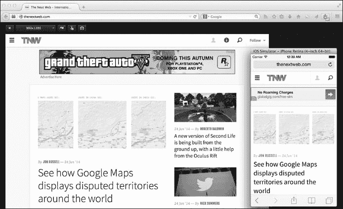
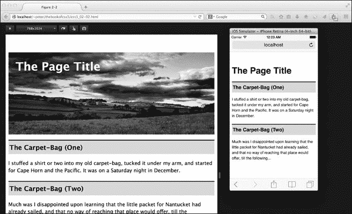
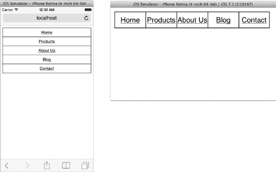

## **2**

**媒体查询**


在万维网仅能通过桌面或笔记本电脑上的浏览器访问的时代，编写 CSS 相对简单。尽管你必须考虑跨浏览器和跨平台的问题，但至少你可以合理地确定每个人使用的是功能上相似的设备来查看你的网站。然而，在过去的几年里，我们见证了访问网络的新设备爆炸式增长——从游戏主机到智能手机和平板电脑等移动设备。当用户可能通过宽屏桌面显示器或窄小的手持屏幕查看你的网站时，以相同方式展示内容已不再合理。

CSS 已经有了一种方法，通过`link`元素的`media`属性为不同的媒体类型提供不同的样式：

```
<link href="style.css" rel="stylesheet" media="screen">
```

但这种方法存在一些缺陷——其中之一就是，当屏幕尺寸介于 3.5 英寸到 32 英寸之间时，使用这种方法就像拿着一把相当钝的工具。类型列表过于宽泛，许多设备无法支持其目标类型——例如，我不知道有哪一款支持`tv`类型的网络电视。正因如此，W3C 已经开始逐步弃用媒体类型的使用。

解决这个问题的 CSS3 方法是使用*媒体查询*，它在媒体查询模块中有所定义（*[`www.w3.org/TR/css3-mediaqueries/`](http://www.w3.org/TR/css3-mediaqueries/)*）。这些查询通过提供查询语法来扩展媒体类型，使你能够为用户的设备提供更加具体的样式，给用户带来量身定制的体验。这个描述可能听起来相当枯燥，但这个特性实际上是整个 CSS3 规范中最具革命性的一项。媒体查询让你能够自由地制作真正独立于设备的网站，无论用户如何访问你的网站，都能为他们提供最佳的体验。

媒体查询模块已经获得了 W3C 推荐状态，因此被视为标准。该模块在所有主流浏览器中得到了良好的实现，包括从版本 9 开始的 Internet Explorer。

### **媒体查询的优势**

作为媒体查询强大灵活性的快速展示，我将展示一个如何优化网站以适应移动浏览器的示例，而不需要额外大量开发。

访问你网站的用户在移动设备上可能会遇到使用困难：文本可能显示得太小，放大后需要大量滚动才能找到导航元素；这些导航元素可能涉及下拉功能，通常需要通过鼠标悬停来触发，而这种操作在移动设备上常常不存在；大图像可能在弱数据连接下需要较长时间下载，并且会占用用户每月带宽的较大一部分。一些网站通过提供适配移动设备的版本来应对这些问题，但这通常需要大量开发工作。必须设置一个子域名，并为其提供与母站不同的样式表和 HTML 模板；图像需要调整大小以更好地适应小屏幕；还必须创建一个脚本来检测是否正在使用移动浏览器，并据此重定向到移动站点。这种方法可能会引发问题：你的脚本必须与所有移动浏览器版本保持同步，维护时往往需要复制工作，以确保移动版和桌面版同步更新。

媒体查询解决了许多问题。首先，它们基于设备的属性来检测设备，因此不需要使用浏览器嗅探脚本。它们允许你直接根据设备的功能来指定样式表，因此如果检测到一个小屏幕设备，CSS 规则将针对该屏幕大小进行调整，移除多余的元素，提供更小的图片，并使文本更加清晰。

例如，看看技术网站 The Next Web (*[`thenextweb.com/`](http://thenextweb.com/)*)，如图 2-1 所示。



*图 2-1：The Next Web 网站在桌面浏览器和移动浏览器（内嵌图）中的显示效果*

当在桌面浏览器中查看时，网站具有长的水平顶部导航栏，页面左侧是相关内容，主要内容则以网格布局显示。通过媒体查询的强大功能，当你在一个更窄的浏览器中查看同一网站时——例如 iPhone 使用的浏览器——导航栏变得更紧凑，分享选项被隐藏，相关内容被移出了屏幕，页面上的主要内容则移入了单列布局，这对于向下滚动来说是理想的。

当然，现在不仅仅是桌面和智能手机设备在浏览网页，我们真的需要朝着一个共同目标努力——即使网站能够在任何设备上进行优化。有关此方面的更多信息，请参见第 10 页中的“响应式网页设计”。

如果你想看看其他人如何使用媒体查询，你可以在网上找到一个很棒的画廊，地址是 *[`www.mediaqueri.es/`](http://www.mediaqueri.es/)*，它展示了一些媒体查询的优秀应用案例。

### **语法**

媒体查询设置了一个参数（或一系列参数），当用于查看页面的设备具有匹配该参数的属性时，相关的样式规则将被启用。你可以通过三种方式使用媒体查询，所有这些方法都与 CSS 应用于文档的不同方式相对应。第一种方式是使用 `link` 元素来调用外部样式表：

```
<link href="file" rel="stylesheet" media="logic media and (expression)">
```

**响应式网页设计**

2010 年，Ethan Marcotte 写了一篇名为“响应式网页设计”的文章（* [`www.alistapart.com/articles/responsive-web-design/`](http://www.alistapart.com/articles/responsive-web-design/)*），在文中他巧妙地整合了当代的思考，提出了通过媒体查询的力量，让网站能够适应不同设备的使用需求。以下是他所说的内容：

现在，比以往任何时候都更加重要的是，我们正在设计那些旨在适应不同体验梯度的作品。响应式网页设计为我们提供了一条前进的道路，最终让我们能够“为事物的潮起潮落设计”。

从那时起，响应式设计迅速成为了主流；大多数开发者都采用这种思路，每年都会有越来越多的网站使用或重新推出响应式设计方法。虽然这种设计并非没有挑战——特别是设计流式、响应式网站时必须重新思考，因为大多数设计工具无法胜任这一任务——但我们可以肯定地说，我们正在朝着打造一个任何人、任何地方都能访问的网络前进，而且这种设计已经经过精心考虑，能够与任何设备兼容。

第二种方法是使用 `@import` 指令来调用外部样式表：

```
@import url('file') logic media and (expression);
```

第三种方式是使用媒体查询在嵌入式样式元素中或在样式表本身中，通过扩展的 `@media` 规则进行：

```
@media logic media and (expression) { rules }
```

这个方法是我在本章余下部分将使用的方法，因为它在演示时更为清晰。你选择哪种方法主要取决于你个人的偏好和现有样式表结构的需求。

现在我已经介绍了声明方法，接下来我们来探讨一下语法。你应该已经熟悉 `media` 属性——它声明了样式应用的媒体类型，就像 HTML 中的 `link` 标签一样：

```
<link href="style.css" rel="stylesheet" media="screen">
```

最常见的媒体类型值是 `screen` 和 `print`，和当前的语法一样，你可以使用逗号分隔的列表来选择多个媒体查询（尽管随着其他媒体类型逐渐被淘汰，这种做法变得不太必要）。如果省略，媒体类型默认为 `all`，因此如果你编写的规则适用于所有媒体类型，你就不需要在媒体查询构造函数中指定它们；在这种情况下，这些示例在功能上是相同的：

```
@media all and (expression) { rules }
@media (expression) { rules }
```

**注意**

*为了使本书其余部分的代码示例更加简洁，我会省略那些不重要的媒体类型。*

`@media` 规则的第一个新属性是 `*logic*`。这个可选关键字的值可以是 `only` 或 `not`：

```
@media only media and (expression) { rules }
@media not media and (expression) { rules }
```

`only`值主要在你想隐藏规则以防止旧浏览器不支持该语法时使用；对于支持该语法的浏览器，`only`会被有效地忽略。`not`值用于否定查询；如果你设置的参数*不*满足条件，你就使用`not`来应用样式。

如果你在查询中使用了`*逻辑*`或`*媒体*`，还需要像前面的示例一样使用`and`运算符，将它们与所需的`*表达式*`属性结合使用。这个属性用于设置提供超越媒体类型功能的参数。这些参数被称为*媒体特性*，它们是媒体查询功能强大的关键。既然如此，让我们详细探讨一下它们。

### **媒体特性**

*媒体特性*是关于用于显示网页的设备的信息：它的尺寸、分辨率等等。这些信息用于评估`*表达式*`，其结果决定应用哪些样式规则。这个`*表达式*`可以是，例如，“仅在宽度超过 480 像素的设备上应用这些样式”或“仅在设备横屏时应用这些样式”。

在媒体查询中，大多数媒体特性表达式都要求提供一个值：

```
@media (feature: value) { rules }
```

这个值是构建我刚才提到的示例表达式所需要的。然而，在一些情况下，你可以省略值，只需测试媒体特性本身是否存在于表达式中：

```
@media (feature) { rules }
```

随着我逐步讲解不同的媒体特性并解释何时需要或可选值，表达式会变得更加清晰。

了解了语法之后，让我们来认识一些更重要的媒体特性。接下来我介绍的这些是最适用于用于访问网页的彩色显示屏的特性，也是你日常使用中最可能用到的。其他媒体特性也有，但你更可能在替代设备（如电视或固定网格终端）上使用它们（前提是这些设备上支持这些特性）。

#### ***宽度和高度***

`width`媒体特性描述了指定媒体类型的渲染视口的宽度，实际上通常指的是桌面操作系统中当前浏览器的宽度（包括滚动条）。基本语法要求一个长度值：

```
@media (width: 600px) { rules }
```

在这种情况下，规则仅应用于宽度恰好为 600px 的浏览器，这可能过于具体。`width`还接受两个前缀中的一个，`max-`和`min-`，这使得你可以测试最小或最大宽度：

```
@media (max-width: 480px) { rules }
@media (min-width: 640px) { rules }
```

第一个查询适用于宽度不超过 480px 的浏览器，第二个适用于宽度至少为 640px 的浏览器。

让我们来看一个实际的例子。在这里，我将利用浏览器窗口的尺寸为更宽的窗口提供一个装饰性的标题（为清晰起见，一些规则被省略了）：

```
@media (min-width: 400px) {
    h1 { background: url('landscape.jpg'); }
}
```

这个媒体查询测试的是至少 400px 宽的浏览器视口，并在这种情况下将背景图片应用于 `h1` 元素。

如果我的浏览器窗口宽度至少为 400px，我就能看到图片；如果我将窗口缩小，则只会显示文本标题。你可以在图 2-2 中看到这个例子。



*图 2-2：在桌面浏览器和移动端（插图）中应用不同的样式规则，使用 `*width*` 媒体特性*

`height` 媒体特性与 `width` 相同，只不过它是根据浏览器的高度而不是宽度进行判定。其语法与 `width` 相同，也允许使用 `max-` 和 `min-` 前缀：

```
@media (height: value) { rules }
@media (max-height: value) { rules }
@media (min-height: value) { rules }
```

然而，由于垂直滚动的普遍性，`height` 的使用频率远低于 `width`。

#### ***像素比***

一般来说，CSS 像素单位（px）是计算机屏幕上单个像素的测量单位——如果你的浏览器视口宽度为 1024 像素，并且你给元素设置宽度为 1024px，那么你期望它能够填满视口的水平长度。然而，许多新设备，尤其是智能手机和平板电脑，拥有超高分辨率的屏幕，这会导致一个宽度为 1024 像素的元素在显示时看起来非常小，并且难以阅读。

为了应对这一问题，这些较新的设备通常拥有一个虚拟的 CSS 像素，独立于设备的物理像素，使得可以对内容进行放大和缩小，并且在小屏幕上保持高图形清晰度。物理像素与 CSS 像素的比率被称为*设备像素比（DPR）*。例如，iPhone 5S 的 DPR 为 2，这意味着一个 CSS 像素等于 4 个物理像素——水平和垂直各 2 个。

你可以在图 2-3 中看到这一点。左边的例子展示了在一个“正常”屏幕上的 CSS 像素，像素比为 1:1。中间的例子展示了在一个具有 DPR 为 2 的屏幕上的相同 CSS 像素，类似于 iPhone；在同一空间内有 4 个物理像素。最后，右边的例子展示了在一个 DPR 为 3 的屏幕上的效果，类似于 Nexus 5；现在在一个 CSS 像素的空间内有 9 个物理像素。


*图 2-3：一个像素比为 1:1 的 CSS 像素（左），DPR 为 2（中），和 3（右）*

实际上，这意味着，虽然 iPhone 5S（例如）具有 640×1136 的物理分辨率，但它的 CSS 分辨率为 320×568——正好是物理分辨率的一半，因为每个 CSS 像素等于两个物理像素，水平和垂直方向上都是如此（但仅在设备处于“移动模式”时有效；关于这一点，请参见 “设备宽度和高度” 在 第 15 页 的解释）。

尽管这种高 DPR 使得可缩放内容（例如文本和矢量图形）在高分辨率屏幕上清晰锐利，但位图图像在高分辨率屏幕上查看时可能会因质量丧失而受到严重影响。为了解决这个问题，可以使用一种新的媒体特性 `resolution`，它允许你根据设备的 DPR 来进行目标定位：

```
@media media and (resolution: value) { rules }
```

`resolution` 的值是一个分辨率单位的数字：*每英寸点数（DPI）*、*每厘米点数（DPCM）*，或者最适合我们的 *每像素点数（DPPX）*。DPPX 单位映射到设备的 DPR，因此要应用一个规则到 DPR 值为 1.5 的设备，你可以使用如下规则：

```
@media (resolution: 1.5dppx) { rules }
```

与其他媒体特性一样，你还可以检测最大和最小像素比：

```
@media (max-resolution: number) { rules }
@media (min-resolution: number) { rules }
```

这种灵活性使得为具有更高像素密度的浏览器提供更高分辨率的背景图像变得更加容易，正如你在这段代码中所看到的：

```
➊ E { background-image: url('image-lores.png'); }
➋ @media (min-resolution: 1.5dppx) {
       background-image: url('image-hires.png');
➌      background-size: 100% 100%;
  }
```

第一条规则（➊）意味着，具有“标准”（或低分辨率）像素比的设备上的浏览器将使用标准图像（*image-lores.png*），而至少具有 1.5 DPR 的设备将使用高分辨率图像（*image-hires.png*）（➋）。注意这里使用了不太常见的 `background-size` 属性（➌）；此属性应与高分辨率图像一起使用，以确保它们不会显示得比应用它们的元素更大（我在第八章中详细介绍了 `background-size`）。

Chrome、Firefox 和 Internet Explorer 10 以上版本都支持 `resolution` 媒体特性，尽管 IE 不幸没有实现 DPPX 值；为了兼容 IE，你应该使用 DPI，将所需的 DPR 值乘以 96（标准屏幕的 DPI 值）。这里有一个示例：

```
@media (resolution: 1.5dppx), (resolution: 144dpi) { rules }
```

Safari 不支持 `resolution`，而是使用一个名为 `-webkit-device-pixel-ratio` 的专有媒体特性（同时有 `max-` 和 `min-` 变体），它的值是一个没有单位的数字，表示目标 DPR。因此，为了兼容所有现代浏览器，可以使用以下规则：

```
@media (resolution: 1.5dppx), (resolution: 144dpi), (-webkit-device-pixel-ratio: 2) { rules }
```

`resolution` 规则是在 2012 年底由 WebKit 引擎实现的，因此我对它在撰写本文时（近两年后）仍未在 Safari 中发布感到失望。希望这个疏忽能够尽快得到纠正。

#### ***设备宽度和高度***

`width` 和 `height` 媒体特性与浏览器视口的尺寸有关，但该视口并不总是与显示它的屏幕一样大。如果你需要针对物理屏幕大小而不是视口大小，可以使用 `device-width` 和 `device-height` 属性以及它们相关的 `min-` 和 `max-` 变体。你不会太常用到这些，但为了说明原因，我需要稍作偏离。

在上一节中，我解释了 CSS 像素和物理像素之间的区别。`width` 媒体特性是以 CSS 像素为单位测量的，而 `device-width` 以物理像素为单位。为了让内容在小屏幕上可读并呈现“自然大小”，两个维度需要匹配。你可以通过将 *viewport meta 标签* 添加到文档的头部来实现，像这样：

```
<meta name="viewport" content="width=device-width">
```

当页面的`head`部分存在带有这些值的视口元标签时，移动浏览器会进入“移动模式”，此时视口的大小会调整为适合该设备的理想尺寸。结果是，内容以更合适的尺寸显示在设备上。

**注意**

*有关移动视口和像素的更深入解释，请参阅荷兰开发者* *PPK 的《像素不是像素》*（[`www.quirksmode.org/blog/archives/2010/04/a_pixel_is_not.html`](http://www.quirksmode.org/blog/archives/2010/04/a_pixel_is_not.html)）。

移动设备浏览器的视口通常和屏幕本身一样大，因此它们基本上是等效的；而在桌面浏览器上，你通常希望使内容相对于视口的宽度，而不是屏幕的宽度进行调整。由于这些原因，`device-width`媒体特性相比`width`变得不那么有用了，实际上你可能不会经常使用它。

视口元标签正在被 CSS 标准化为`@viewport`规则；请参阅第 252 页的“设备适配”简要介绍。

#### ***方向***

如果你不太关心查看设备的实际尺寸，但希望优化页面以适应横向（如典型的桌面/笔记本浏览器）或纵向（如手机或电子书阅读器）的查看方式，你需要使用的媒体特性是`orientation`。其语法如下：

```
@media (orientation: value) { rules }
```

`*value*`可以是两个关键字选项之一：`landscape`或`portrait`。当浏览器的宽度大于高度时，使用`landscape`值；当高度大于宽度时，使用`portrait`值。尽管`orientation`当然也可以应用于桌面浏览器，但你会发现它在处理用户可以轻松旋转的手持设备时最为有用，例如智能手机和平板电脑。

例如，你可以使用`orientation`根据访问者浏览器的方向来横向或纵向显示导航菜单。代码如下：

```
ul { overflow: hidden; }
li { float: left; }
@media (orientation: portrait) {
  li { float: none; }
}
```

默认情况下，`li`元素的浮动值是`left`，使它们在页面上横向排列。如果相同的页面在`portrait`方向下查看——无论是通过将浏览器调整为比宽度更高，还是通过在设备上查看页面时设备处于纵向模式——浮动将被移除，`li`元素将垂直堆叠。你可以在图 2-4 中看到这个结果。



*图 2-4：在移动浏览器中使用的`*orientation*`媒体特性：*`*portrait*`*（左）和`*landscape*`*（右）*

由于`orientation`特性只有两个值，如果你使用一个值应用区分规则，那么另一个值自然就成为了对立面。在这个示例中，我只使用了`portrait`值，因此，默认情况下，所有不在该功能内的规则适用于`landscape`方向。

#### ***纵横比***

你还可以创建查询，当达到特定的宽高比时应用这些查询。使用`aspect-ratio`来测试浏览器的宽高比，或者使用`device-aspect-ratio`来测试设备的宽高比。以下是这两个特性的语法：

```
@media (aspect-ratio: horizontal/vertical) { rules }
@media (device-aspect-ratio: horizontal/vertical) { rules }
```

`*horizontal*` 和 `*vertical*` 值是正整数，表示显示设备屏幕宽度和高度的比例，因此一个方形显示屏的比例是 1/1，而一个影院宽屏显示屏的比例是 16/9。

**注意**

*一些设备——尤其是 iPhone——总是报告设备的竖屏方向的宽高比，即使在横屏显示时也是如此。*

按比例选择可能存在一些陷阱。例如，一些设备制造商将宽屏定义为 16/9，一些定义为 16/10，还有一些定义为 15/10。并且设备可能没有准确的声明的比例；例如，iPhone 5S 宣称其比例为 16/9，但实际上显示的是稍大的 40/71 比例（竖屏方向）。使用`max-`和`min-`变体的`aspect-ratio`和`device-aspect-ratio`来应用规则可能更为可取。考虑以下代码，在其中查询的规则应用于任何具有大于 16/9 的宽高比的元素：

```
@media (min-device-aspect-ratio: 16/9) {…}
```

### **多个媒体特性**

你也可以通过添加带有 `and` 操作符的表达式，将多个查询链在同一媒体类型上：

```
@media logic media and (expression) and (expression) { rules }
```

该语法测试这两个表达式是否匹配，然后再应用选定的规则。例如，要测试一个宽高比不大于 15/10 的设备上的窄屏，你可以使用此查询：

```
@media (max-device-aspect-ratio: 15/10) and (max-width: 800px) {…}
```

你还可以通过在以逗号分隔的列表中添加额外的查询，使用条件“或”表达式：

```
@media logic media and (expression), logic media and (expression) { rules }
```

当任何声明的情况为真时，应用这些规则；在以下示例中，规则应用于横屏方向的屏幕或竖屏方向的打印文档：

```
@media screen and (orientation: landscape), print and (orientation: portrait) {…}
```

当然，你还可以创建这些语法的任何组合。

### **移动优先网页开发**

当今构建网站的常见最佳实践方法是采用一种被称为*移动优先开发*的方法，在这种方法中，我们首先为较小的屏幕开发，然后再为访问网站的较大设备的用户添加更大的资源和更多的复杂性。

采用这种方法的原因是因为某些浏览器加载页面资源（例如样式表中包含的图像）方式的问题。问题出现的原因是，一些早期采用媒体查询的开发者会，例如，给元素应用较大的背景图像，然后写规则将其从移动设备上隐藏：

```
E { background-image: url('huge-image.jpg'); }
@media (max-width: 600px) {
    E { display: none; }
}
```

但这些背景图像，尽管被隐藏，仍然被浏览器下载并保存在缓存中，即使它们没有显示出来。这种方法增加了页面的加载时间，并消耗带宽配额——这些对于没有无线连接的移动设备用户来说都不好。

移动优先的页面创建方式是首先制定一个基础样式表，这个样式表会应用于所有浏览器，包括移动设备，然后逐步为具有更大屏幕的用户添加资源和功能，通过使用带有`min-width`特性的媒体查询来加载这些内容：

```
@media (min-width: 600px) {
    E { background-image: url('huge-image.jpg'); }
}
```

这一变化意味着背景图像在小屏幕设备上永远不会被加载。这种方法可以推广到加载整个样式表：

```
<link href="basic.css" rel="stylesheet">
<link href="desktop.css" rel="stylesheet" media="(min-width: 600px)">
```

当样式表以这种方式分开时，某些浏览器会优化样式表的加载方式；例如，在 Chrome 中，由于文件*desktop.css*不适用于屏幕宽度小于 600px 的设备，其加载会被延迟，直到其他更高优先级的资源被下载完成——这是一种非常有用的优化。

这种移动优先的方法适用于过去几年中的绝大多数浏览器；对于一些非常老旧的浏览器，它们将只能获取基本样式表，这对它们来说可能更好，因为它们无法处理我将在本书的其余部分教授的高级功能。

### **总结**

它们的语法可能很简单，但媒体查询具有非凡的强大功能。随着近几年移动互联网的爆发，设计师和开发者们开始意识到，他们可以在不使用传统的浏览器探测或为移动设备创建完全不同的版本的情况下，根据用户需求量身定制内容。

响应式网页设计运动在过去几年中的崛起得益于媒体查询的强大功能，在短短的时间里，它们已成为网页开发者手中最强大的工具之一。通过仔细考虑和巧妙使用媒体查询，你可以创建完美适应用户需求的网页，无论用户通过何种方式访问互联网。

### **媒体查询：浏览器支持**

|  | **Chrome** | **Firefox** | **Safari** | **IE** |
| --- | --- | --- | --- | --- |
| 媒体查询 | 是 | 是 | 是 | 是 |
