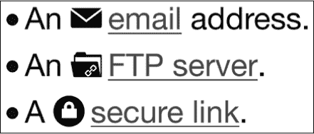
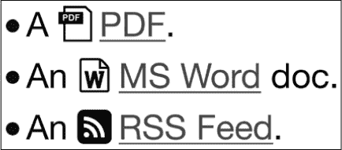
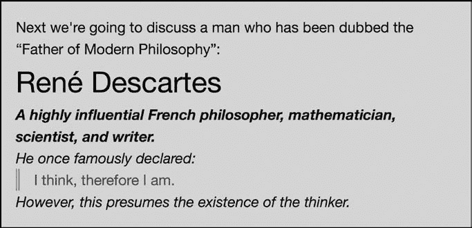

## 3

**选择器**


选择器是 CSS 的核心，尽管原始的 CSS1 规范只有 5 到 6 个，CSS2 通过增加 12 个进一步扩展了选择器的范围。CSS3 更进一步，几乎将可用的选择器数量翻倍。

选择器可以大致分为两类。第一类是直接作用于文档树中定义的元素（例如`p`元素和`href`属性）；这一类包括*类*、*类型*和*属性*选择器。为了方便起见，我将这些归类为*DOM 选择器*。第二类包括*伪选择器*，作用于文档树外部的元素或信息（例如段落的第一个字母或父元素的最后一个子元素）。我在第四章中介绍了伪选择器—在这里我讨论的是 DOM 选择器。

CSS3 提供了三种新的属性选择器和一个新的*组合器*，即将其他选择器连接在一起的选择器，比如 CSS2 中的子选择器（`>`）。这些选择器在选择器级别 3 模块中定义（* [`www.w3.org/TR/css3-selectors/`](http://www.w3.org/TR/css3-selectors/)*），它是*W3C 推荐*并在浏览器中有广泛且稳定的实现。除非你特别需要支持 IE6，否则你可以立即开始使用这些 CSS3 选择器—许多网站已经在使用了。

### 属性选择器

属性选择器是在 CSS2 中引入的，正如你从名字中可以预期的那样，它们允许你基于元素的属性（如`href`或`title`）及其值来指定匹配的规则。CSS2 中定义的四个选择器是：

```
E[attr] {…} /* Simple Attribute Selector */
E[attr='value'] {…} /* Exact Attribute Value Selector */
E[attr~='value'] {…} /* Partial Attribute Value Selector */
E[attr|='value'] {…} /* Language Attribute Selector */
```

在继续讨论 CSS3 中的新选择器之前，快速回顾一下如何使用每个选择器是很有价值的。为此，我将使用以下标记，这是一个（非常简短的）联系人列表：

```
  <ul>
➊ <li><a href="" lang="en-GB" rel="friend met">Peter</a></li>
➋ <li><a href="" lang="es-ES" rel="friend">Pedro</a></li>
➌ <li><a href="" lang="es-MX" rel="contact">Pancho</a></li>
  </ul>
```

*简单属性选择器*将规则应用于定义了指定属性的元素，无论该属性的值是什么。因此，给定以下代码：

```
a[rel] { color: red; }
```

我的标记中的所有`a`元素都有`rel`属性，尽管它们具有不同的值。因此，在这种情况下，所有元素都会应用该规则。如果你想更具体一些，可以使用*精确属性值选择器*来定义一个值：

```
a[rel='friend'] { color: red; }
```

这段代码仅将规则应用于标记中的第二个`a`元素（➋），因为它只选择具有`friend`确切值的元素。如果你想选择两个具有该值的元素，你可以使用*部分属性值选择器*：

```
a[rel~='friend'] { color: red; }
```

这段代码查找`rel`属性中作为空格分隔的列表（在大多数情况下是一个单词）中的`friend`值，因此它将规则应用于元素➊和➋。

最后的选择器，即*语言属性选择器*，将规则应用于具有与选择器中的第一个参数匹配的属性的元素，而该属性的值是选择器中的第二个参数，并紧接着一个连字符。如果这听起来有些奇怪的具体要求，那是因为这个选择器实际上只用于匹配语言子代码。示例标记中有两个西班牙语名字，每个名字的`lang`属性都以`es-`开头，尽管一个是西班牙（`es-ES`），另一个是墨西哥（`es-MX`）。要选择这两个元素，可以使用以下代码：

```
a[lang|='es'] { color: red; }
```

这个选择器会选择所有`lang`属性值以*es*开头的元素，不论它们的国家值是什么——也就是说，元素➋和➌。你可以将这个选择器用于任何具有连字符分隔值的属性，但在绝大多数情况下，这些值将是语言代码。

**注意**

*这里使用的属性名称并不是从规范中取的，而是来自 Eric Meyer 的书《CSS 口袋参考》（O’Reilly Media, 2011）。*

### CSS3 中的新属性选择器

你已经看到属性选择器在查找精确或部分值时有多么有用，但如果你需要更多的灵活性呢？CSS3 的新选择器提供了通过匹配属性值中的子字符串来实现灵活性的功能。这个特性使得它们特别适合用于应用规则到 XML 文档，因为 XML 的属性值通常比 HTML 更为多样化——尽管它们对 HTML 开发者也同样非常有用。

#### *开始子字符串属性值选择器*

第一个新的属性选择器——为了避免重复这么长的标题，我将其称为*开始选择器*——查找其所选属性以传递给它的字符串为开头的元素。它使用插入符号（`^`）来修改选择器中的等号。以下是完整的语法：

```
E[attr^='value'] {…}
```

这段代码在指定属性的开头查找提供的值。为了说明这一点，考虑下面的示例标记，它展示了一个包含三个项目的列表，每个项目都包含一个具有不同（虽然相似）`title`属性值的超链接：

```
<li><a href="http://example.com/" title="Image Library">Example</a></li>
<li><a href="http://example.com/" title="Free Image Library">Example</a></li>
<li><a href="http://example.com/" title="Free Sound Library">Example</a></li>
```

我将把这个选择器应用到示例标记中：

```
a[title^='image'] {…}
```

在这个例子中，规则将应用于第一个列表项中的`a`元素，因为`title`属性字符串以*image*这个词开头。然而，规则不会应用于第二个项目中的`a`元素，尽管它的`title`属性包含了这个字符串，但它并不是以这个字符串开头。同样，第三个字符串也不会应用，因为这个字符串不匹配。

**注意**

*在 HTML 文档中，属性选择器的值不区分大小写；然而，在 XML 文档中，值是区分大小写的。*

开始选择器在你想要为超链接添加视觉信息时特别有用。这里是一个典型的指向外部网站的超链接示例：

```
<p>This is a <a href="http://example.com/">hyperlink</a>.</p>
```

当你在浏览器中看到这个链接时，你无法立刻判断它是指向同一网站的页面还是外部 URI。然而，使用这个新属性后，你可以将协议（*http*）作为参数传递，并添加一个图标来清晰地标示外部链接：

```
a[href^='http'] {
    background: url('link.svg') no-repeat left center;
    display: inline-block;
    padding-left: 20px;
}
```

结果如图 3-1 所示。


*图 3-1：使用开始选择器应用的图标*

你可以将这个扩展到涵盖更多的 Web 协议，其中一些—*mailto*、*ftp*和*https*—在以下示例中有所展示，并在图 3-2 中进行了说明。

```
a[href^='mailto'] { background-image: url('email.svg'); }
a[href^='ftp'] { background-image: url('folder.svg'); }
a[href^='https'] { background-image: url('lock.svg'); }
```



*图 3-2：使用开始选择器应用的更多链接图标示例*

当然，开始选择器也有很多应用，适用于`alt`、`cite`和`title`等接受更多详细值的属性。随着 HTML5 的引入和一系列新表单元素与属性的出现，这个选择器及其即将推出的兄弟选择器将变得更加有用。

例如，考虑提议中的`datetime`属性，它接受类似`2015-03-14`的日期字符串值：

```
<time datetime="2015-03-14">March 14/time>
```

这意味着你可以使用开始选择器来为所有满足给定年份值的元素应用样式，这在日历或归档应用中非常有用：

```
[datetime^='2015'] {…}
```

#### *结束子字符串属性值选择器*

我称之为*结束选择器*，它的工作原理与开始选择器完全相同——只是反过来！也就是说，你用它来选择以给定值*结尾*的属性。语法只不同一个字符：这次你使用美元符号（`$`）来替换等号（`=`）。这里是完整的语法：

```
E[attr$='value'] {…}
```

让我们再看一下前一节中的标记示例，只不过这次我们应用了结束选择器并使用了一个新值：

```
a[title$='library'] {…}
```

这次规则适用于所有列表项，因为它们的`title`属性值都以字符串`library`结尾。

就像开始选择器一样，你可以使用这个选择器为超链接提供视觉清晰度。不过这次，你不再使用`href`属性开头的协议，而是使用文件类型后缀。下面的代码展示了许多流行文件类型扩展的规则：

```
a[href$='.pdf'] { background-image: url('pdf.svg'); }
a[href$='.doc'] { background-image: url('word.svg'); }
a[href$='.rss'] { background-image: url('feed.svg'); }
```

图 3-3 展示了这些规则的应用实例。



*图 3-3：使用结束选择器应用的链接图标*

若要使用 CSS2 实现这个效果，你必须为标记应用设置`class`值（例如`class="pdf"`）。使用结束选择器的优点是，文件链接可以自动检测到，而不需要你应用特定的类。缺点是，有时文件类型的后缀并不在 URI 的末尾。但下一个新选择器帮助我们解决了这个问题。

#### *任意子字符串属性值选择器*

最后的新属性选择器——我称之为*任意选择器*——与前两个选择器的工作方式相同，但它会在指定的属性字符串内的*任何位置*搜索提供的子字符串值。这个选择器使用星号（`*`）字符。以下是新的语法：

```
E[attr*='value'] {…}
```

为了演示这个选择器，我将再次使用与开始和结束选择器相同的标记，只不过这次应用的是任意选择器：

```
a[title*='image'] {…}
```

这个规则应用于第一个和第二个列表项，因为它们的`title`属性中都包含文本字符串`image`，尽管该字符串在每个示例中的位置不同。

你可能会注意到，这个选择器与 CSS2 中的部分属性值选择器有些相似，事实上，在这个例子中，它们是可以互换的：

```
a[title~='image'] {…}
```

但是这两个选择器在一个重要方面有所不同。在示例标记中，使用 CSS3，你可以仅通过子字符串匹配此元素：

```
a[title*='im'] {…}
```

然而，部分属性值选择器要求输入一个匹配空格分隔列表中完整项的值——在示例中，这将是`free`、`image`或`library`——因此，使用 CSS2 选择器时，`im`值不会在标记中的任何地方匹配。

继续使用前两个属性选择器的示例，任意选择器对于在 URI 末尾带有参数的文件类型图标也非常有用。考虑这个相当典型的 URI：

```
<a href="http://example.com/example.pdf?foo=bar">Example</a>
```

如果你使用结束选择器并设置值为`pdf`，即使文件类型是 PDF，该元素也不会被识别为有效目标，因为该值并未出现在字符串的末尾。然而，使用任意选择器提供相同的值就能实现预期效果；`.pdf`子字符串值出现在指定的属性中，因此图标被应用。

```
a[href*='.pdf'] { background-image: url('pdf.svg'); }
```

这个选择器是三种新属性选择器中最灵活的，因为它可以匹配子字符串，无论它们在字符串中的位置在哪里。但这种额外的灵活性意味着在定义提供给选择器的值时必须更加小心；当你可以在字符串中的任何位置进行匹配时，简单的字母组合更容易出现——这也是我用它来搜索`.pdf`（文件扩展名）而不是`pdf`（常见缩写）的原因。

#### *多个属性选择器*

你还可以将多个选择器串联在一起，这让你可以非常具体。通过使用多个选择器，你可以创建规则来应用于具有为开始、结束和任何位置定义的值的属性。举个例子，假设你有指向两个文件的链接，这两个文件的名字完全相同，但位于不同的文件夹中：

```
<p><a href="http://example.com/folder1/file.pdf">Example</a></p>
<p><a href="http://example.com/folder2/file.pdf">Example</a></p>
```

如果你只想为第二个`p`元素指定一个规则，可以将一些选择器串联在一起：

```
a[href^='http://'][href*='/folder2/'][href$='.pdf'] {…}
```

这段代码寻找具有以`http://`开头、以`.pdf`结尾，并且其中包含`/folder2/`的`a`元素。这样很具体！

### 通用兄弟组合器

我们在 CSS3 中的最后一个新的 DOM 选择器是组合器，你会记得它意味着将多个选择器结合在一起。一般兄弟组合器是相邻兄弟组合器的扩展，后者在 CSS2 中就已引入。两者的语法只相差一个字符：

```
E + F {…} /* Adjacent Sibling Combinator */
E ~ F {…} /* General Sibling Combinator */
```

这两者的区别微妙但重要：相邻兄弟选择器选择在同一层级的文档树中，紧接着元素（`*E*`）后的任何元素（`*F*`），而一般兄弟选择器选择同一层级中任何被元素（`*E*`）之前的元素（`*F*`），无论它们是否紧邻。

如果你仍然感到困惑，我会通过一个例子来解释。让我们从这段 CSS 开始：

```
h2 + p { font-weight: bolder; } /* Adjacent Sibling */
h2 ~ p { font-style: italic; } /* General Sibling */
```

并将其应用到以下标记（为了清晰起见，已截断）：

```
➊ <p>Next we're going to discuss…</p>
  <h2>Ren&eacute; Descartes</h2>
➋ <p>A highly influential French philosopher…</p>
➌ <p>He once famously declared:</p>
  <blockquote>
➍    <p>I think, therefore I am.</p>
  </blockquote>
➎ <p>However, this presumes the existence of the thinker.</p>
```

你可以在图 3-4 中看到结果。在 CSS 中，我使用相邻兄弟组合器将紧接着`h2`元素的`p`元素加粗——即元素➋。我还使用一般兄弟组合器将所有紧随`h2`元素的`p`元素设置为斜体，这适用于元素➋、➌和➎。



*图 3-4：相邻兄弟和一般兄弟组合器的区别*

段落元素➊和➍没有应用粗体或斜体规则。为什么呢？因为元素➊位于`h2`之前，而元素➍位于`blockquote`内，因此它们在文档树中的层级不同（低一层），所以都不受规则的影响。

为了在没有一般兄弟组合器的情况下仅在 CSS2 中将与`h2`元素处于同一层级的段落设置为斜体，你需要将所有`p`元素设置为斜体显示，然后为`blockquote`内的`p`元素添加额外的规则来覆盖继承：

```
p { font-style: italic; }
blockquote p { font-style: normal; }
```

你可能不会经常使用一般兄弟组合器，因为它的许多功能与基本的 DOM 选择器重叠。尽管如此，你仍然会发现有很多场合可以利用这个组合器节省一些代码（和时间）。

### 总结

尽管属性是 HTML4 的一个关键特性，但它们大多数只接受有限范围的值，因此许多属性其实并不需要我在本章中介绍的属性选择器。除了`href`属性，只有少数属性接受更为详细的值（如`alt`、`class`、`id`、`rel`和`title`等属性）。不过，正如我之前提到的，HTML5 引入了像`datetime`和`pubdate`这样的属性，使得你可以在选择器中更加灵活创意。

本章介绍的新选择器，以及之前版本的 CSS 中的选择器，提供了根据定义的元素和属性应用样式规则的方法。当然，有时仅通过样式化元素和属性并不足以满足需求。这时，你需要添加类或非语义元素，作为挂载样式的钩子。在第四章中，你将发现 CSS3 如何消除这种需求。

### 选择器：浏览器支持

|  | **Chrome** | **Firefox** | **Safari** | **IE** |
| --- | --- | --- | --- | --- |
| 新的属性选择器 | 是 | 是 | 是 | 是 |
| 通用兄弟组合符 | 是 | 是 | 是 | 是 |
