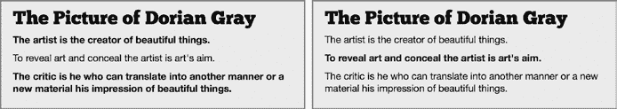
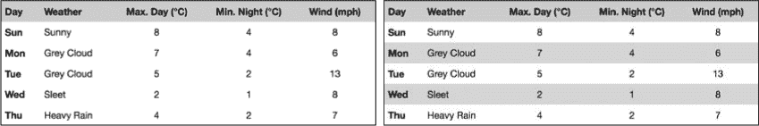
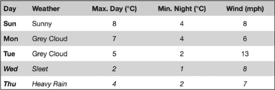
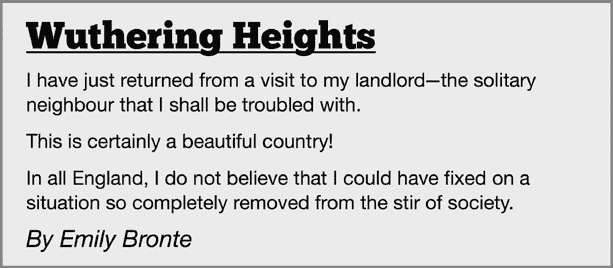
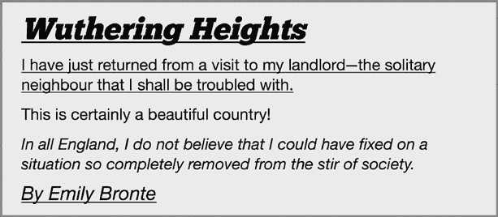
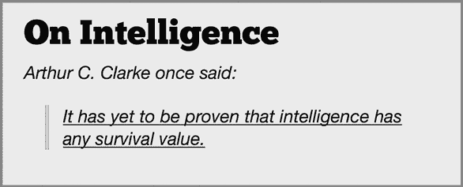
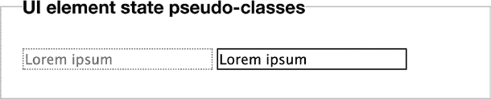
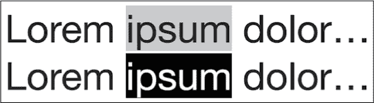

## 第四章：4

**伪类和伪元素**


第一版 CSS 规范（CSS1）引入了 *伪类* 和 *伪元素* 的概念。这些选择器作用于扩展（或超出）文档树的信息。伪类用于区分元素的不同状态或类型；这些状态包括——但不限于——提供链接状态信息的伪类：`:hover`、`:visited`、`:active` 等等。伪元素则提供了访问元素子部分的能力，包括那些选择文本节点部分的伪元素；例如，`:first-line` 和 `:first-letter`。

上述选择器自第一版 CSS 规范以来就存在，但在 CSS2.1 中加入了更多选择器——尽管伪元素的支持直到最近才得到较好的实现。CSS3 在这些基础上进行了扩展，增加了更多的伪类选择器，并且对语法做了（轻微的）调整，以区分伪元素。

拥有更多遍历文档的方法的优势应该很明显：需要的样式挂钩更少。你可能已经熟悉这样的标记：

```
<ul>
   <li class="➊first ➋odd">➌<span>L</span>orem ipsum</li>
   <li>Lorem ipsum</li>
   <li class="odd">Lorem ipsum</li>
   <li class="➍last">Lorem ipsum</li> </ul>
```

该标记包含类名，用于描述每个元素在文档树中的位置：`first` (➊) 和 `last` (➍) 显示 `li` 元素是 `ul` 元素的第一个和最后一个子元素，`odd` (➋) 用于标记编号为奇数的 `li` 元素。第一个 `li` 元素的首字母周围包含了一个额外的 `span` (➌)。

当你想为交替元素添加样式、为第一个和最后一个元素设置不同的值，或者为文本节点的首字母添加特殊格式时，可以使用这样的标记。这种标记可能会削弱代码的清晰度和语义性，但在许多情况下，你需要它来为样式提供挂钩。

CSS3 的新方法允许你在不使用多余类和非语义元素污染标记的情况下，达到相同的视觉效果，从而使代码更加简洁和可维护：

```
<ul>
    <li>Lorem ipsum</li>
    <li>Lorem ipsum</li>
    <li>Lorem ipsum</li>
    <li>Lorem ipsum</li> </ul>
```

新选择器的另一个主要优势是，如果添加了新元素到标记中，类名无需更新以适应这些新元素，同时仍能保持顺序。这一变化使得 CSS 更接近其目标：内容与表现的分离。

### 结构性伪类

正如我在本章引言中所述，伪类提供了一种根据文档树中未指定的信息选择元素的方法。有各种子类型，其中最常见的是 *结构性伪类*。这些子类型用于选择那些无法通过简单选择器访问的元素。

例如，考虑以下标记：

```
<div>
    <p>Lorem ipsum.</p>
    <p>Dolor sit amet.</p>
</div>
```

两个`p`元素中的第一个是`div`元素的第一个子元素。从文档树中可以明显看出这一点，但文档树并没有提供任何可以仅对该元素应用规则的信息。正因如此，CSS2 引入了`:first-child`伪类：

```
E:first-child {…}
```

这个伪类允许你根据存在但未作为元素属性提供的信息进行选择——这正是伪类的作用。自从` :first-child`在 CSS2 中引入以来，它一直是唯一一个这种类型的伪类。但是，CSS3 通过引入 11 个新的结构性伪类大大扩展了这一范围。

#### *:nth-* 伪类*

新的四个伪类是基于一个计数值，用于查找元素在文档树中的位置；对于这个计数，你可以使用语法`:nth-*`。注意，我在这里使用了星号代替多个不同的值，我将在本章的其余部分逐一介绍这些值。

`:nth-*`伪类的基本语法非常简单。默认情况下，`n`表示从 0 开始并按 1 递增的数字（1、2、3 等）。另一个整数可以作为乘数传递给它。例如，`2n`表示每个 2 的倍数（2、4、6 等），`3n`表示每个 3 的倍数（3、6、9 等），依此类推：

```
E:nth-*(n) {…}
E:nth-*(2n) {…}
E:nth-*(3n) {…}
```

第一个示例使用默认值`n`，因此将选择所有类型为`*E*`的元素；在实际应用中，这与使用简单的元素选择器相同。下一个示例选择每隔一个的`*E*`元素，最后一个示例选择每隔三个的`*E*`元素。

你还可以使用加法（+）和减法（−）的数学运算符。因此，`2n+1`选择每隔两个加一个的元素（1、3、5 等），而`3n-1`选择每隔三个减一个的元素（2、5、8 等）：

```
E:nth-*(n+1) {…}
E:nth-*(2n+1) {…}
E:nth-*(3n-1) {…}
```

第一个示例选择除了第一个实例之外的所有`*E*`元素；这些计数将是 2、3、4、5，依此类推。下一个示例选择每个奇数编号的`*E*`元素（1、3、5 等）。最后一个示例，如前所述，选择序列中的元素：2、5、8 等。

还有两个特殊的关键字值，`even`和`odd`，你可以用它们分别替换`2n`和`2n+1`：

```
E:nth-*(even) {…}
E:nth-*(odd) {…}
```

最后，使用`0n`（即零）作为值也是可以的。它本身没有用途，但与数学运算符结合使用时非常有用，因为它允许你精确定位一个没有重复的单一元素。事实上，为了简洁起见，你只需要在数学运算符后提供值。例如，若要仅选择选择器列表中的第三个元素，以下两个值都是有效的：

```
E:nth-*(0n+3) {…}
E:nth-*(3) {…}
```

在基本语法讲解完毕后，让我们继续讨论这些伪类本身。

##### :nth-child() 和 :nth-of-type()

大多数新的结构伪类允许你根据元素在文档树中的位置（相对于其父元素的 `-child`）或其分类（`-of-type`）来选择元素。这些定义经常会有重叠，但它们之间也存在至关重要的区别。

这些伪类的最简单示例是 `:nth-child()` 和 `:nth-of-type()`。第一个，`:nth-child()`，根据元素在其父元素中所有子元素的总数中的位置来选择元素；`:nth-of-type()` 的计数则不基于所有子元素，而仅基于指定类型的元素。

```
➊ E:nth-child(n) {…}
➋ E:nth-of-type(n) {…}
➌ E:nth-child(2n) {…}
➍ E:nth-of-type(2n) {…}
```

在这个例子中，规则 ➊ 和 ➋ 是等效的，因为计数值（`n`）保持为默认值；这两者都仅选择类型为 `*E*` 的所有子元素。差异在后面的示例中得以显现：在 ➌ 中，`:nth-child(2n)` 选择所有类型为 `*E*` 的元素，计数包括所有同级元素，但仅限于那些偶数编号的元素。而在 ➍ 中，相比之下，`:nth-of-type(2n)` 仅从那些元素中选择偶数编号的类型为 `*E*` 的元素。

这些规则比起解释来，演示起来要容易得多。我将通过以下示例演示它们之间的区别（为了清晰起见，文本已被截断）：

```
<div>
    <h2>The Picture of Dorian Gray</h2>
    <p>The artist is the creator…</p>
    <p>To reveal art and conceal the artist…</p>
    <p>The critic is he who can translate…</p>
</div>
```

在我的样式表中，我将使用这两条规则：

```
➊ p:nth-child(2n) { font-weight: bolder ; }
➋ p:nth-of-type(2n) { font-weight: bolder; }
```

你可以在图 4-1 中看到这两条规则的不同结果。在示例标记中，`div` 元素总共有四个子元素：一个 `h2` 和三个 `p`。规则 ➊ 中的 `:nth-child(2n)` 选择器将每第二个子元素（第一个和第三个段落）设为粗体，正如左边的框中所看到的那样。与右侧框中的规则 ➋ 应用效果进行比较；`:nth-of-type(2n)` 选择器忽略 `h2` 元素，并仅对三个类型为 `p` 的元素中的每第二个实例应用粗体样式——即，仅对第二个段落生效。



*图 4-1：比较使用* `*:nth-child()*` *选择器（左）与* `*:nth-of-type()*` *(右)的效果*

如我之前所提到的，且你无疑能从之前的例子中推测出，`:nth-child()` 和 `:nth-of-type()` 有不少重叠之处，通常可以互换使用，正如我在下面的示例中所做的那样。

图 4-2 左侧的表格显示了伦敦的五天天气预报（温度单位为摄氏度—0°C 等于 32°F）。这些数据是在一月采集的—这里并非 *总是* 这么冷！我想传达的所有信息都在表格中，但如果没有行的定义，我发现表格很难读取。

现在，将这个表格与右侧的表格进行比较，见同一图 4-2。在这里，我使用了被称为 *斑马条纹* 的技巧来帮助眼睛沿着行移动，这使得数据对我来说更易读。



*图 4-2：天气预报表（左）和优化格式化以提高可读性（右）。天气数据来自* [`bbc.co.uk/weather/`](http://bbc.co.uk/weather/)

我通过一个简单的 CSS3 声明实现了这个技巧：

```
tbody tr:nth-of-type(even) { background-color: #DDD; }
```

在这个例子中，我本可以使用 `:nth-child()`，因为在标记中，`tbody` 的所有子元素都是相同类型的：`tr`。当每个子元素都是相同类型时，`:nth-child()` 和 `:nth-of-type()` 是可以互换使用的。

##### :nth-last-child() 和 :nth-last-of-type()

`:nth-last-child()` 和 `:nth-last-of-type()` 伪类接受与 `:nth-child()` 和 `:nth-of-type()` 相同的参数，只不过它们是从最后一个元素开始倒着计数，起到了反向计数的作用。例如，假设我想使用一些视觉简写，在我的天气表格中显示出第四天和第五天的预报比前几天更不确定。你可以在 图 4-3 中看到这种效果。



*图 4-3：使用 `*:nth-last-child()*` 进行额外格式化*

我在最后两行的字符上使用了 `:nth-last-child()` 伪类进行斜体处理（尽管再次强调，`:nth-last-of-type()` 在这个例子中同样适用），并传递了 `-n+2` 作为参数：

```
tbody tr:nth-last-child(-n+2) { font-style: italic; }
```

我使用了负值（`-n`）来递减计数，这样就能实现反向操作。由于 `:nth-last-child()` 和 `:nth-last-of-type()` 是从树的末端开始倒着计数，所以在这里使用负值使得计数向前进行！计数从表格中的最后一个 `tr` 元素开始，按倒序进行，因此倒数第一和倒数第二行是首先被计数的，因此被设置为斜体。这个过程可能看起来不太直观，但随着你深入遍历文档树，便会逐渐习惯。

##### *:first-of-type, :last-child 和 :last-of-type*

如果你查看 图 4-2 中的表格，你会注意到天气列的文本是左对齐的，而其他列是居中对齐的。我是通过使用 `:first-of-type` 伪类实现的，它类似于 CSS2 中引入的 `:first-child` 选择器，但在本章中你已经看到，它的类型和子元素的区别。

如你所知，`:first-child` 伪类是一个选择器，用来应用规则到其父元素的第一个子元素。然而，与 `:nth-of-type()` 一样，`:first-of-type` 更为具体，它仅应用于父元素中属于特定类型的第一个子元素。还有一对对应的伪类，`:last-child` 和 `:last-of-type`，正如你可能猜到的，它们分别选择父元素中的最后一个子元素或该类型的最后一个子元素。

在上一节的天气表格示例中，表格主体中每一行的标记结构如下所示：

```
<tr>
    <th>Sun</th>
    <td>Sunny</td>
    <td>8</td>
    <td>4</td>
    <td>8</td>
</tr>
```

我想将第二列的内容左对齐，因此不能在这里使用 `:first-child`，因为第一个子元素是一个 `th`。相反，我使用 `:first-of-type` 选择器：

```
tbody td:first-of-type { text-align: left; }
```

我将展示两个额外的例子，以清楚地说明它们之间的区别。我将这两个例子应用到相同的标记片段（为了清晰起见，我已截断文本）：

```
<div>
    <h2>Wuthering Heights</h2>
    <p>I have just returned…</p>
    <p>This is certainly…</p>
    <p>In all England…</p>
    <h3>By Emily Bronte</h3>
</div>
```

在第一个例子中，我使用了 `:first-child` 和 `:last-child`，如下所示：

```
:first-child { text-decoration: underline; }
:last-child { font-style: italic; }
```

结果如图 4-4 所示。`h2` 元素是 `div` 的第一个子元素，因此应用了下划线样式。`div` 的最后一个子元素是 `h3` 元素，因此它被斜体化。所有这一切都很直接。



*图 4-4：应用* `*:first-child*` *和* `*:last-child*` *选择器*

现在让我们看看使用 `:first-of-type` 和 `:last-of-type` 选择器时的区别：

```
:first-of-type { text-decoration: underline; }
:last-of-type { font-style: italic; }
```

看一下图 4-5 中的结果。你会注意到三个元素——`h2`、`h3` 和第一个 `p`——都带有下划线。这是因为它们是该元素类型的第一个实例。同样，`h2`、`h3` 和最后一个 `p` 都被斜体化。这是因为它们都是该类型的最后一个元素；`h2` 和 `h3` 都是其类型的第一个和最后一个，因此两个规则都适用于它们。



*图 4-5：应用* `*:first-of-type*` *和* `*:last-of-type*` *选择器*

与所有 `*-type` 和 `*-child` 伪类一样，它们之间的区别是微妙的，有时最后一个子元素也可能是其类型的最后一个，因此这些选择器可以互换使用。但正如我刚才所示，它们有时会有不同的应用场景。

##### *:only-child 和 :only-of-type*

这两个伪类用于选择文档树中具有父元素但没有兄弟元素（`:only-child`）或没有相同类型兄弟元素（`:only-of-type`）的元素。与许多之前的伪类一样，这两个伪类的功能有很多重叠，但下面这个例子说明了它们之间的区别。请看以下样式规则：

```
p:only-of-type { font-style: italic; }
p:only-child { text-decoration: underline; }
```

然后将它们应用到这个标记中：

```
<h2>On Intelligence</h2>
<p>Arthur C. Clarke once said:</p>
<blockquote>
    <p>It has yet to be proven that intelligence has any survival value.</p>
</blockquote>
```

你可以在图 4-6 中看到结果。



*图 4-6：比较* `*:only-child*` *和* `*:only-of-type*`

两个 `p` 元素是其类型在文档树中的唯一元素，因此 `:only-of-type` 规则选择它们并将其斜体化。然而，`blockquote` 内的 `p` 元素也是其层级中的唯一子元素，因此它也适用于 `:only-child` 规则，应用了下划线样式。

使用 `:only-of-type` 允许你从其他元素中挑选出一个元素，而 `:only-child` 则要求该元素是孤立的。

### 其他伪类

除了本章中讨论的结构性伪类外，CSS3 还引入了许多伪类，允许你根据其他标准选择元素。这些包括链接目标、用户界面元素，甚至是一个逆选择器，允许你根据元素“不是”什么来选择它！

#### *:target*

在 Web 上，站点不仅仅是页面之间的链接，还提供指向特定元素的内部链接。一个 URI 可以包含对唯一 ID 或命名锚点的引用。例如，如果你在页面中有如下标记：

```
<h4 id="my_id">Lorem ipsum</h4>
```

你可以通过这个链接引用它：

```
<a href="page.html#my_id">Lorem</a>
```

`:target`伪类允许你在引用的 URI 被跟随时应用样式。在这个例子中，如果你想在 URI 被跟随时对`h4`元素应用样式，你可以使用：

```
#my_id:target {…}
```

一种流行的做法是直观地高亮显示内部链接的主题，以便为用户提供明确的提示。例如，考虑一下博客评论的标准模式，其简化的标记大致如下：

```
<div class="comment" id="comment-01">
    <p>Thanks for this scintillating example!</p>
    <p class="author">N.E. Boddy, April 13</p>
</div>
```

另一个相当常见的模式是包括指向单个评论的链接：

```
<p><a href="#comment-02">Latest comment</a></p>
```

使用`:target`伪类，你可以轻松高亮用户希望阅读的评论：

```
.comment:target { background-color: #DDD; }
```

图 4-7 显示了评论的两种状态：左侧是点击引用链接之前的显示状态，右侧是点击链接后的显示状态——链接所指向的元素由于`:target`选择器而显示不同的背景颜色。


*图 4-7：使用`*:target*`伪类应用的高亮效果*

#### *:empty*

`:empty`伪类选择没有子元素的元素，包括文本节点。考虑这个标记：

```
<tr>
<td></td>
<td>Lorem ipsum</td>
<td><span></span></td>
</tr>
```

如果你应用这个 CSS 规则：

```
td:empty { background-color: red; }
```

规则仅应用于第一个`td`元素，因为另外两个分别包含文本节点和子元素。

#### *:root*

`:root`伪类选择文档树中的第一个元素，这只有在你为 XML 文档添加样式表时才特别有用——在 HTML 中，根元素将始终是`html`元素。使用`:root`在 HTML 中的一个小优点是，你可以通过它赋予`html`元素更高的特异性，这在你需要覆盖简单类型选择器时可能会很有用：

```
html {…} /* Specificity: 1; */
html:root {…} /* Specificity: 2; */
```

假设你正在创建一个基础样式表，并希望在`html`元素上设置一个不应被修改的属性。在这种情况下，你可以使用类似如下的代码：

```
html:root { background-color: black; }
```

更高的特异性使得这条规则优先于应用于`html`元素的其他规则，意味着以下规则将被忽略：

```
html { background-color: white; }
```

但在大多数情况下，你不太可能需要在大多数情况下使用这个。

#### *:not()*

否定伪类`:not()`选择所有元素，*除了*那些作为参数值提供的元素：

```
E :not(F) {…}
```

这个规则选择元素`*E*`的所有子元素，除了类型为`*F*`的元素。例如，要为`div`的所有直接子元素上色，除了`p`元素，你可以使用：

```
div > :not(p) { color: red; }
```

为了查看 `:not()` 的有用性，假设你有以下标记：

```
<div>
    <p>Lorem ipsum dolor sit amet…</p>
    <p>Nunc consectetur tempor justo…</p>
    <p>Nunc porttitor malesuada cursus…</p>
</div>
```

现在假设你想让所有子 `p` 元素都呈斜体，除了第一个。

要使用 CSS2 实现这一点，你将样式应用于所有的 `p` 元素，然后再应用一个额外的样式将第一个元素重置回其先前的状态：

```
p { font-style: italic; }
p:first-child { font-style: normal; }
```

使用 `:not()`，你可以将其简化为一个规则：

```
p:not(:first-child) { font-style: italic; }
```

传递给 `:not()` 的参数必须是简单选择器——因此，组合符（如 `+` 和 `>`）和伪元素（我在 “伪元素” 中讨论过，它出现在第 45 页）不是有效值。

##### *UI 元素状态*

与表单和用户输入相关的元素可以具有不同的状态；例如，它们可以被禁用或选中，可以通过设置属性值来实现：

```
<textarea disabled="disabled"></textarea>
<input checked="checked" type="checkbox">
```

CSS3 有三个 UI 状态伪类选择器，可以让你根据元素的当前状态应用规则：

```
:checked {…}
:disabled {…}
:enabled {…}
```

**注意**

*HTML 没有* `*enabled*` *属性；未被禁用的元素按定义是启用的。*

为了查看这些伪类选择器的效果，考虑以下样式规则：

```
input[type='text']:disabled { border: 1px dotted gray; }
input[type='text']:enabled { border: 1px solid black; }
```

我将这些规则应用于一个包含两个文本 `input` 元素的表单，其中一个有 `disabled` 属性（表单结构不太规范，因为没有为输入框添加标签，但为了清晰起见，我将标签省略了）：

```
<form action="">
<fieldset>
<legend>UI element state pseudo-classes</legend>
<input type="text" value="Lorem ipsum" disabled>
<input type="text" value="Lorem ipsum">
</fieldset>
</form>
```

你可以在图 4-8 中看到结果。



*图 4-8：禁用和启用元素状态*

如你所见，禁用的表单元素具有灰色文本（这是浏览器自动完成的）和灰色虚线边框（这是我在样式表中设置的）。我为启用的元素设置了一个实心黑色边框。

我这里没有演示 `checked` 状态，因为大多数浏览器对 `checkbox` 输入框可以应用的样式规则有不同的解释。关于跨浏览器表单元素样式的全面概述，我强烈推荐来自 456 Berea Street 博客的《使用 CSS 样式化表单控件》(*[`www.456bereastreet.com/lab/styling-form-controls-revisited/`](http://www.456bereastreet.com/lab/styling-form-controls-revisited/)*)

还有一个第四种 UI 元素状态，`indeterminate`，它在某些情况下使用；例如，一个单选按钮输入框所在的组中，如果没有选择任何输入项，它就会被视为不确定状态，`progress` 元素如果没有值也会被视为不确定状态。尽管某些浏览器已实现这一功能，但它尚未完全定义，其状态依然是不确定的（哈！）。

#### *约束验证伪类*

HTML5 引入了一个新的客户端验证表单的 API，称为 *约束验证 API*，它可以在表单内容提交到服务器之前，确定是否满足某些要求。约束验证 API 带来了与之相关的一系列新伪类。

**注意**

*Mozilla 开发者网络 (MDN) 提供了一个关于约束验证 API 的优秀介绍，链接为* [`developer.mozilla.org/docs/Web/Guide/HTML/HTML5/Constraint_validation/`](https://developer.mozilla.org/docs/Web/Guide/HTML/HTML5/Constraint_validation/)。

在约束验证下，可以通过使用新的 `required` 属性将表单字段设置为必填：

```
<input type="text" required>
```

你可以根据表单字段是否为必填或可选，使用它们的伪类来设置样式：

```
:required {…}
:optional {…}
```

每个表单字段可以处于两种验证状态之一：有效或无效。如果没有应用任何特定的约束（无论是浏览器还是作者设定的），则表单字段默认为有效。如前所述，每个状态都有一个相应的伪类：

```
:valid {…}
:invalid {…}
```

**警告**

*在用户尚未与表单互动的情况下，未满足约束条件的字段——例如，必填字段——将已经应用* `*:invalid*` *伪类规则。*

最后，一些 HTML5 元素可以设置允许的值范围，可以通过使用 `min` 和 `max` 属性来实现。你可以根据当前值是否在范围内来设置这些元素的样式，使用的仍然是成对的伪类：

```
:in-range {…}
:out-of-range {…}
```

### 伪元素

像伪类一样，伪元素提供了文档树中未指定的信息。但与伪类使用像元素在树中的位置或状态这样的“虚拟”条件不同，伪元素更进一步，允许你对文档树中根本不存在的元素应用样式。

在 CSS2 中，四个伪元素是 `:first-line` 和 `:first-letter`，它们用于选择文本节点中的子元素，以及 `:after` 和 `:before`，它们允许你在现有元素的开始和结束位置应用样式。CSS3 并没有引入新的伪元素，但它稍微调整了定义，并引入了一种新的语法，以便将它们与伪类区分开来。在 CSS3 中，伪元素的前缀是双冒号 (`::`)，如下所示：

```
::first-line {…}
::first-letter {…}
::after {…}
::before {…}
```

**注意**

*单冒号语法仍然被接受，原因是为了向后兼容，尽管它已被弃用，今后不应该再使用。*

#### *::selection 伪元素*

CSS3 选择器模块的早期版本包括了 `::selection` 伪元素的定义。尽管它已被正式从该模块中移除，但它在桌面浏览器中得到了很好的实现（在移动浏览器中则较少实现）。`::selection` 用于对用户在浏览器中选择的元素应用规则（例如，选择文本节点的一部分）：

```
::selection {…}
```

只有有限数量的属性可以通过 `::selection` 应用：`color`、`background-color` 和 `background` 简写（但不能使用 `background-image`）。使用 `::selection`，你可以像这样进行样式设置：

```
p::selection {
    background-color: black;
    color: white;
}
```

图 4-9 显示了系统本地的 `::selection` 颜色（上方）与我使用 `::selection` 伪元素应用的颜色（下方）的对比。



*图 4-9：通过* `*::selection*` *伪元素应用的自定义颜色*

`::selection` 伪元素在 Chrome、Safari 和 IE9+ 中实现，无需前缀，在 Firefox 中则需要使用 `-moz-` 前缀——因此，尽管它不再是 CSS3 规范的一部分，你依然可以放心使用它。

### 总结

新一系列的伪类（以及未来可能定义的任何伪元素）使得通过 CSS3 进行文档遍历比以往任何时候都更加灵活和强大，而且可以实现更加简洁和易于维护的标记。

基于 UI 状态和表单验证的伪类数量的增加，极大地扩展了用户反馈的范围，无需依赖 JavaScript。这对于 HTML5 来说尤为重要，因为它更加关注 Web 应用程序。

### DOM 和属性选择器：浏览器支持情况

|  | **Chrome** | **Firefox** | **Safari** | **IE** |
| --- | --- | --- | --- | --- |
| 结构伪类 | 是 | 是 | 是 | 是 |
| `:target` | 是 | 是 | 是 | 是 |
| `:empty` | 是 | 是 | 是 | 是 |
| `:root` | 是 | 是 | 是 | 是 |
| `:not()` | 是 | 是 | 是 | 是 |
| 伪元素（`::` 语法） | 是 | 是 | 是 | 是 |
| UI 元素状态 | 是 | 是 | 是 | 是 |
| 约束验证 | 是 | 是 | 是 | IE10^(*) |
| `::selection` | 是 | 是 | 是 | 是 |

* 不支持 :in-range, :out-of-range
