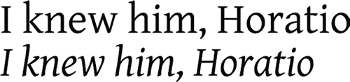
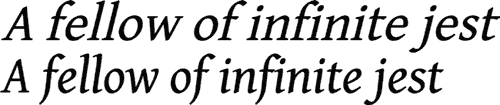
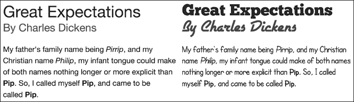
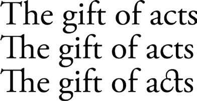
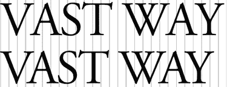

## **5**

**WEB 字体**


本章介绍的特性是本书中最古老的，早在多年前的 CSS2 中就已引入——但由于浏览器厂商未实现，后来从 2.1 规范中被删除。如今，新一代浏览器重新激起了对改善网页设计师可用排版选项的兴趣，我个人也欢迎这些特性在 CSS3 中的回归。最重要的是能够指定用户系统中不存在的字体——通过使用 `@font-face` 方法——这使得设计师摆脱了多年来使用的“网页安全”系统字体的束缚。令人惊讶的是，这项功能自 1997 年起就在 Internet Explorer 中可用！

IE4 是第一个允许使用网页字体的浏览器，但它使用了专有格式，这使得其他浏览器无法效仿。微软后来将其格式提交给 W3C，提议作为标准，但与此同时，Firefox、Safari 和 Chrome 都支持不同的格式集（见 “字体格式” 在 第 52 页），因此后来版本的 Internet Explorer 最终也跟随了这一做法。

CSS 字体模块 Level 3 (*[`www.w3.org/TR/css3-fonts/`](http://www.w3.org/TR/css3-fonts/)*）已被列为候选推荐状态，大多数规范已在现代浏览器中实现（有一些例外，我稍后会提到），因此你可以认为这些特性是安全可用的。

### **@font-face 规则**

要在页面上显示网页字体，首先需要使用 `@font-face` 规则来定义它们。此规则设置字体的名称和类型，并为浏览器提供字体文件的位置。以下是基本语法：

```
  @font-face {
➊     font-family: FontName;
➋     src: ➌local('fontname'), ➍url('/path/filename.otf') ➎format('opentype');
  }
```

我将稍微拆解一下这个语法。首先，我使用 `font-family` 属性（➊）为字体命名。这个属性你应该很熟悉，尽管在规则内部它的作用与在常规选择器的声明块中有所不同；在这里，它用于声明一个字体名称，而不是引用一个字体名称。就像在 CSS2.1 中的 `font-family` 属性一样，你可以使用多个以空格分隔的单词，只要将它们用单引号括起来。

**注意**

*当你使用* `*font-family*` *定义字体名称时，你可以多次使用相同的名称——事实上，有时候你需要这么做。我稍后将在 “定义不同的字体” 中讨论原因，见 第 49 页。*

接下来是 `src` 属性（➋），它告诉浏览器字体文件的位置。该属性接受几种不同的值：`local`（➌）使用源字体的名称来检查字体是否已经安装在用户的机器上；`url`（➍）提供字体的路径，如果该字体在本地不可用的话。我还包括了可选的 `format`（➎）提示，用于指定字体类型；在这个例子中，我使用了 OpenType，但还有更多类型，我将在 “字体格式” 中讨论，位于第 52 页。

我可以为 `src` 属性提供许多不同的值，使用逗号分隔这些值，正如我在代码示例中所做的那样。这利用了级联的优势，允许不同的后备值，这在后续的例子中会派上用场。

**注意**

*记住，在字体栈中，浏览器将使用它遇到的第一个可加载的文件，而不是逐个读取所有文件并选择最新的文件。*

要使用我刚定义的字体，我只需要像平常一样在字体栈中调用它的名称：

```
E { font-family: FontName; }
```

为了说明一个现实世界的例子，我将使用 Chunk 字体（可以从 *[`www.theleagueofmoveabletype.com/fonts/4-chunk/`](http://www.theleagueofmoveabletype.com/fonts/4-chunk/)* 免费下载）应用到一个 `h1` 元素上，使用 `@font-face` 规则。以下是我将在样式表中使用的代码：

```
  @font-face {
➊     font-family: ChunkFive;
      src: ➋local('ChunkFive'), ➌url('ChunkFive.woff') ➍format('woff');
  }
➎      h1.webfont { font-family: ChunkFive, sans-serif; }
```

第一步是给我的字体命名；我选择了 `ChunkFive`（➊），因为我容易记住它，但我可以使用任何名称。接下来，我为 `src` 属性提供值：`local`（➋）使用字体的真实名称 `ChunkFive` 来检查它是否已安装在我的系统上。随后，我输入我想要使用的字体文件的相对路径（➌），最后，我将 `woff` 作为 `format` 的值（➍）。我将在 “字体格式” 中解释 WOFF 格式，见第 52 页。

**注意**

*通常可以通过使用字体管理应用程序或右键点击字体文件查看字体信息，来找到字体的真实名称。*

在最后一行（➎），我使用在 `@font-face` 规则中定义的名称值，将新定义的字体加入字体栈，并将其应用到所有 `h1` 元素，且这些元素具有 `webfont` 类。为了查看显示效果，这里有一个快速对比，使用以下标记：

```
<h1>Alas, poor Yorick!</h1>
<h1 class="webfont">Alas, poor Yorick!</h1>
```

你可以在 图 5-1 中看到输出结果。


*图 5-1：ChunkFive 字体（底部行），通过`*@font-face*`规则调用，与页面默认字体（顶部行）进行对比*

#### ***定义不同的字体样式***

你在本章看到的 `@font-face` 语法非常简单，但它只定义了一个字体样式——也就是一种权重、倾斜等的排列方式。如果你想使用不同的样式，比如加粗的权重或斜体类型，你必须为每个字体样式单独定义。为此，你可以重复使用相同的名称并在 `@font-face` 规则中添加额外的描述：

```
  @font-face {
➊     font-family: 'Gentium Basic';
      src: url('➋GenBasR.woff') format('woff');
  }
  @font-face {
➌     font-family: 'Gentium Basic';
➍     font-style: italic;
      src: url(' ➎GenBasI.woff') format('woff');
  }
  h1 { font-family: 'Gentium Basic', sans-serif; }
```

在这里，你可以看到第一个`@font-face`规则将字体名称定义为`Gentium Basic`（➊），并给出了常规字体的 URL（➋）。第二个`@font-face`规则使用相同的字体名称（➌），但添加了`font-style`属性并将其值设置为`italic`（➍），URL 指向该字体的斜体字形（➎）。斜体样式会自动并恰当地应用，而不需要像此示例标记那样在 CSS 中额外定义：

```
<h1>I knew him, Horatio</h1>
<h1><em>I knew him, Horatio</em></h1>
```

第二个`h1`元素使用了之前规则中定义的斜体字形（你可以在图 5-2 中看到结果）。



*图 5-2：使用`@font-face`应用的 Gentium Basic 常规字体（上）和斜体字体（下）*

你可以通过在`@font-face`规则中使用不同的字体属性来定义字体的多个变体：`font-weight`用于设置不同的字重，`font-variant`用于小型大写字形，等等。

#### ***真正的字体与人工字体***

使用网页字体时要注意的一点是，必须为你希望使用的每个不同字体字形定义一个适当文件的链接。如果没有，浏览器会尝试人为地重新创建字体字形，通常会产生难看的效果。

例如，如果你打算在页面中使用斜体样式，你必须确保在`@font-face`中也定义了斜体样式。下面是一个如何*不*定义斜体权重的示例：

```
@font-face {
    font-family: 'Gentium Basic';
    src: url('GenBasR.woff') format('woff');
}
h1 {
    font-family: 'Gentium Basic', sans-serif;
    font-style: italic;
}
```

你可以看到，我的`@font-face`规则使用了 Gentium Basic 字体的常规字形，但`h1`元素声明了一个斜体样式。你可以在图 5-3 中看到该效果，该图将这种方法与上一节中正确定义的方法进行了比较。



*图 5-3：比较人工斜体（上）和真正的斜体字体（下）*

如你所见，这两个示例差异很大。第一个是将选定的 Gentium Basic 字体倾斜，伪造斜体样式（使用第一个代码示例）；字符更大，稍微变形，并且间距不一致。第二个是正确的斜体字体（使用正确的方法），它使用专门为此目的设计的字符。

同样的原则适用于所有不同的字体：粗体、斜体、粗斜体、小型大写字母、压缩字体等等。

### **“防弹”@font-face 语法**

我在本章开头解释过，`@font-face`规则已经存在相当长时间，从 1997 年起便在 Internet Explorer 中实现。这意味着它带有一些不幸的遗留问题，特别是在旧版本的 IE 中。此外，一些与字体格式相关的历史性问题也可能在旧版本的其他浏览器中引起兼容性问题。

由于这些问题，你需要找到一种解决方法，确保`@font-face`在所有浏览器中都能正确工作。在介绍完全跨浏览器的“防弹”`@font-face`语法之前，让我简要讨论一下它解决的一些问题。

#### ***使用本地字体***

`src` 属性中的 `local()` 值用于检查用户的系统中是否已经安装了指定的字体——如果用户已经安装了该字体，则可以应用本地副本，而无需重新下载。`local()` 是一个不错的想法，但它也有一些缺点。第一个缺点，也是最重要的，就是`local()`在任何低于 9 版本的 Internet Explorer 中都不被支持！

另一个缺点是，在某些情况下，`@font-face` 规则与字体管理软件兼容性差，可能会显示错误字符，或者弹出对话框请求权限使用字体。

由于这些原因，通常省略 `local()` 值会更安全。

#### ***字体格式***

下一个问题是不同且互相竞争的格式。当`@font-face`最初被实现时，它只支持微软的专有*嵌入式开放类型（EOT）*格式，并且这是 IE8 及以下版本唯一支持的字体格式。更复杂的是，当浏览器进入兼容模式时，IE9 会导致`@font-face`规则失效；这个问题非常特殊，且随着时间的推移变得越来越不相关，但值得注意的是，我们可以通过在防弹语法中简单修复它。

对网页字体的兴趣重新激增，原因是现代浏览器——最初是 Safari，然后是 Firefox，再后来是其他浏览器——允许使用更常见的*TrueType*和*OpenType*格式。不幸的是，许多商业字体厂商不允许以这种方式使用他们的字体，因为这会让他们的字体被非法复制变得更容易（详见 “网页字体授权” 在第 53 页）。因此，Mozilla 与一些字体制造商进行了咨询，创建了*Web Open Font Format (WOFF)*，现在所有主流浏览器（包括 IE9 及以上版本）都支持此格式，除了旧版的安卓系统浏览器（4.3 及以下）。

一些浏览器还支持*可缩放矢量图形（SVG）*字体类型。这种字体类型是字体的矢量重建，文件大小大大减小，非常适合移动设备使用。然而，这种格式只有在你需要支持旧版 iPhone Safari（4.1 及以下版本）时才真的有用。

#### ***最终的“防弹”语法***

为了确保你选择的字体在所有浏览器和平台中显示一致，你应该使用以下格式的代码：

```
  @font-face {
      font-family: 'Gentium Basic';
➊     src: url('GenBkBasR.eot');
➋     src: url('GenBasR.eot?#iefix') format('embedded-opentype'),
➌     url('GenBkBasR.woff') format('woff'),
➍     url('GenBkBasR.ttf') format('truetype');
  }
```

让我来解释一下这里发生了什么。第一个指定的字体是为 Internet Explorer 8 及以下版本准备的 EOT 字体（➊）。这个字体有自己的规则，因为接下来的规则包含了可选的`format()`提示；这个提示对老版的 IE8 来说是陌生的，因此整个规则会被忽略。但是，为了处理 IE9 的兼容性问题，仍然需要再次包含 EOT 字体（➋）。接下来，定义了 WOFF 格式（➌），这是大多数浏览器使用的格式，之后是 TTF 格式（➍），用于较旧的浏览器，包括 Android 4.3 及以下版本（请记住，浏览器会忽略它们无法识别的格式，因此无法加载这些格式）。

由于 IE9 的兼容性问题变得不再那么重要，你可以根据自己的判断省略第二行（➋）。

为了让这个方法有效，主要的要求是你选择的字体必须有三种不同的格式。为了简化这一过程，我强烈建议使用 Font Squirrel 的`@font-face`生成器（*[`www.fontsquirrel.com/fontface/generator/`](http://www.fontsquirrel.com/fontface/generator/)*）。只需上传你想使用的字体文件，`@font-face`生成器会将其转换为所有相关格式，并生成你在页面中需要使用的 CSS 代码。这个工具非常有用。Font Squirrel 还提供了一个可以直接用于`@font-face`嵌入的字体库，省去了你转换字体的麻烦。

**注意**

*如果你想了解为什么需要使用 IE 技巧以及它是如何工作的，请阅读* [`www.fontspring.com/blog/the-new-bulletproof-font-face-syntax/`](http://www.fontspring.com/blog/the-new-bulletproof-font-face-syntax/)。

### **网页字体使用许可**

如前所述，在第 52 页的“字体格式”一节中，许多字体厂商明确禁止使用`@font-face`将他们的网页字体嵌入到你的页面中。他们之所以禁止，是因为链接的 OpenType 或 TrueType 字体容易被找到并下载，然后在在线和离线应用中非法使用。为此，创建了 WOFF 文件格式；WOFF 是一种仅限网页使用的格式，并且可以包含许可信息，帮助追踪版权侵权者。许多字体厂商已经开始销售这种格式，我希望未来会有更多厂商跟进。

一般来说，最好的做法是检查你选择的字体是否有明确的许可证，允许你将其用于网页嵌入；不要假设某个字体是免费的下载，就意味着它可以免费在线使用。话虽如此，许多允许嵌入的高质量免费字体在线可用；一些资源在附录 B 中给出。

虽然字体许可的情况仍在变化，但许多网页字体服务提供商已经创建了合法嵌入字体的机制。通过在你的页面中添加 JavaScript，提供商就被授权从他们的网络提供字体文件，这样你就可以在你的字体栈中调用这些字体。这个方法被称为*字体即服务（FaaS）*。

大多数 FaaS 提供商是商业性的，允许免费使用有限的一组字体，但大多数字体需要支付月费或年费。这个领域中的两大主要玩家可能是 Fontdeck (*[`fontdeck.com/`](http://fontdeck.com/)*）和 Typekit (*[`typekit.com/`](https://typekit.com/)*）。其他提供商只提供免费字体——Google Fonts (*[`www.google.com/fonts/`](http://www.google.com/fonts/)*）是一个显著的例子。每个提供商都有自己的方式将授权字体包含到你的网站中，通常是通过引入外部的 CSS 或 JS 文件，或者两者都用。

### **一个真实世界的网页字体示例**

在讨论了字体的复杂性、许可和多种语法之后，让我们来看一个`@font-face`的实际示例。我将使用一个比较标准无衬线字体（Arial）和三种不同字体家族（均来自 Font Squirrel）显示的相同文本的示例。

这是这个示例的 CSS。请记住，为了清晰起见，我简化了这个代码片段，仅展示了单一的字体格式（WOFF），虽然附带的示例文件包含了完整的代码：

```
@font-face {
    font-family: 'CartoonistHand';
    src: url('CartoonistHand.woff') format('woff');
}
@font-face {
    font-family: 'CartoonistHand';
    font-style: italic;
    src: url('CartoonistHand-Italic.woff') format('woff');
}
@font-face {
    font-family: 'CartoonistHand';
    font-weight: bold;
    src: url('CartoonistHand-Bold.woff') format('woff');
}
@font-face {
    font-family: 'ChunkFiveRegular';
    src: url('Chunkfive.woff') format('woff');
}
@font-face {
    font-family: 'AirstreamRegular';
    src: url('Airstream.woff') format('woff');
}
.font-face h1 { font-family: ChunkFiveRegular, sans-serif; }
.font-face h2 { font-family: AirstreamRegular, cursive; }
.font-face p { font-family: CartoonistHand, sans-serif; }
```

我还省略了一些颜色和大小的调整，以使代码尽可能易读。以下是我使用的标记：

```
<h1>Great Expectations</h1>
<h2>By Charles Dickens</h2>
<p>My father's family name being <em>Pirrip</em>, and my Christian name
<em>Philip</em>, my infant tongue could make of both names nothing longer or
more explicit than <strong>Pip</strong>. So, I called myself <strong>Pip
</strong>, and came to be called <strong>Pip</strong>.</p>
```

你可以在图 5-4 中看到这个输出。



*图 5-4：使用“网页安全”字体（左）和使用不同网页字体（右）的文本*

在右侧的示例中，我混合了三种相当独特的字体家族——许多设计师可能会告诉你，在生产站点中混合字体并不是一个好主意，但这在此示例中能很好地阐明我的观点。不论你对我的字体选择有何看法，我希望你至少能同意，在应用了这些字体选择后，文本看起来更加生动和诱人。

尽管我们为了获得跨浏览器语法走了很长的弯路，但使用`@font-face`并不复杂；你会在声明所需的字体面和变体时花费一些额外的设置时间，但之后你可以像使用系统字体一样在字体堆栈中调用它们并进行样式化。

### **控制字体加载**

网页字体作为外部资源加载，必须先由浏览器下载，才能显示。在文件加载之前，应用字体的元素上将看不到任何字体。你可能会看到在字体加载并应用时出现轻微的“闪烁”现象。这就是所谓的*未样式化文本的闪烁（FoUT）*。

许多 FaaS 提供商提供了使用配置文件解决这个问题的方法，但如果你自己托管字体，你可能会想要研究 Web Font Loader 库 (*[`github.com/typekit/webfontloader/`](https://github.com/typekit/webfontloader/)*)，它提供了一个事件系统，允许你在字体加载时动态控制页面的显示。

### **更多字体属性**

CSS3 Web 字体模块不仅重新引入了 `@font-face` 规则；它还恢复了两个最早为 CSS2 提出的字体属性。这些属性对于让你精确控制字体非常有用——我之所以说 *有用*，是因为截至目前，它们并未广泛实现。

#### ***font-size-adjust***

使用字体堆栈（font stacks）在 CSS 中的唯一缺点是字体的大小差异可能非常大；你选择的第一种字体在 16px 下可能看起来很好，但如果该字体不可用，下一个备选字体可能会显得更小，或者有不同的比例，使得在相同的大小下更难阅读。为了解决这个问题，`font-size-adjust` 属性允许你动态地调整 `font-size` 属性，以确保无论使用哪种字体，外观始终保持一致。`font-size-adjust` 属性接受一个小数值；以下是语法：

```
E { font-size-adjust: number; }
```

`*number*` 值是由小写 *x* 字符（即 *x-height*）所占的字体总高度的比例。换句话说，一种字体的总高度可能为 16px，但小写 *x* 的高度可能只有一半（8px），这就给出了一个 x-height 比例为 0.5（8 除以 16）：

```
p { font-size-adjust: 0.5; }
```

通过使用 `font-size-adjust`，你可以确保无论显示哪种字体，x-height 始终保持相同的值，且可读性不受影响。为说明这一点，请考虑以下代码：

```
h1.adjusted { font-size-adjust: 0.517; }
h1.impact { font-family: Impact, serif; }
```

然后，在接下来的三个 `h1` 元素中，所有的 `font-size` 值相同，我通过它们的类名应用了不同的值，你可以在这段标记中看到：

```
<h1>Of most excellent fancy</h1>
<h1 class="impact">Of most excellent fancy</h1>
<h1 class="adjusted impact">Of most excellent fancy</h1>
```

第一个 `h1` 使用默认的 Helvetica Neue 字体渲染，第二个使用 Impact，第三个也使用 Impact，但应用了 `font-size-adjust` 属性，值为 `0.517`，即 Helvetica Neue 的 x-height。你可以在图 5-5 中查看效果。


*图 5-5：* `*font-size-adjust*` *对 Impact 字体的影响（第三行）*

你可以清楚地看到在前两个 `h1` 元素中，Helvetica Neue（第一行）和 Impact（第二行）字体之间的差异。（当然，你不太可能在同一个字体堆栈中同时使用这两种字体，但由于它们的 x-height 差异很大，因此它们非常适合用于说明。）如我所提到的，Helvetica Neue 的 x-height 比例为 0.517，这意味着小写的 *x* 大约是字体高度的一半。相比之下，Impact 的 x-height 比例为 0.7，这意味着大写字母和小写字母之间的高度对比较小。

示例中的前两行没有做任何调整，因此第二行的 Impact 小写字母比第一行的 Helvetica Neue 要高得多——字体大小相同，但它们的度量标准不同。然而，在第三行，我将 `font-size-adjust` 的值设置为 `0.517`，以匹配 Helvetica Neue 的 x-height 比例：

```
h1.adjusted { font-size-adjust: 0.517; }
```

这调整了字体大小，使得 Impact 字体显示为更小的尺寸——略高于 18.6px，约为 `font-size` 设置的 36px 高度的一半。通过直接比较这两个元素，你可以更清楚地看到这一点，如图 5-6 所示。在这里，调整后的 Impact 字体中没有 *上升部分*（即超出 x 高度的部分）的字符——也就是说，*e*、*x*、*c* 和 *n*——与 Helvetica Neue 字体的字符高度完全相同。


*图 5-6：左边为 Helvetica Neue 字体的字符，右边为使用 `*font-size-adjust*` 调整后的 Impact 字体的字符。*

不幸的是，字体的 x 高度比例并不容易获得；你可以使用图形软件手动测量，或者尝试找到一个在线资源。（我找到了一款由在线字体服务 Fontdeck 制作的计算器，它与系统中安装的字体兼容：*[`fontdeck.com/support/fontsizeadjust/`](http://fontdeck.com/support/fontsizeadjust/)*。）

这个属性的主要缺点是，截至目前，Firefox 是唯一支持它的浏览器。

#### ***font-stretch***

一些字体家族包含压缩或扩展的变体，`font-stretch` 属性可以让你访问这些变体。语法如下：

```
E { font-stretch: keyword; }
```

根据规范，关键字值可以是以下之一：`normal`（默认值）、`ultra-condensed`、`extra-condensed`、`condensed`、`semi-condensed`、`semi-expanded`、`expanded`、`extra-expanded` 和 `ultra-expanded`。每个关键字都与字体家族中的某个变体相关，如 Frutiger Condensed 或 Nova Ultra Expanded。

在以下示例中，我使用 `font-stretch` 显示了两种不同的 PT Sans 字体样式，使用的代码如下：

```
h1 { font-family: 'PT Sans', sans-serif; }
h1.narrow { font-stretch: condensed; }
```

`h1` 元素显示了两次，每次使用 PT Sans 字体。在第二次中，我使用了 `font-stretch` 属性，值为 `condensed`，这告诉浏览器显示 PT Sans Condensed 字体。你可以在图 5-7 中看到结果。


*图 5-7：第二个示例由于 `*font-stretch*` 属性的影响，使用了狭窄的字体样式。*

`font-stretch` 属性已在 Firefox 和 IE9 及以上版本中实现，但你也可以通过使用 `@font-face` 规则（在本章开始时介绍）来复现这一效果，指定字体堆栈中的压缩或扩展样式：

```
@font-face {
    font-family: 'PT Sans Condensed';
    src: url('PT-Sans-Narrow.woff') format('woff');
}
```

### **OpenType 特性**

尽管 CSS3 在网页排版上取得了巨大的进步，但它仍然仅仅触及了字体可能性的表面。如果你将浏览器中可用的选项与桌面出版应用程序（如 Adobe InDesign）中的选项进行比较，你会发现后者比前者要丰富得多。

OpenType 字体格式不仅支持字体或粗细变化，还具有多种连字、修饰、特殊数字字符等功能。（如果这些术语对你来说没有意义，我推荐你阅读 Magnet Studio 的《OpenType 初学者指南》，链接地址为 *[`www.magnetstudio.com/words/2010/opentype-guide/`](http://www.magnetstudio.com/words/2010/opentype-guide/)*）。

#### ***启用字体特性***

许多浏览器已经实现了一项功能，允许你探索 OpenType 和其他类似格式提供的额外特性。这个新属性叫做 `font-feature-settings`，下面是它的语法：

```
E { font-feature-settings: "parameters"; }
```

`*parameters*` 值是一个字符串序列，包含每个字体特性的简写代码，还可以加上一个可选的二进制值来启用或禁用该特性。下面是一个示例：

```
E { font-feature-settings: "dlig" on; }
```

第一个参数是 `dlig`，是可选连字的简写代码，值为 `on` 表示启用它——默认状态是启用的，因此在这个示例中，你可以安全地省略这个值。

如果你想禁用某个特性，可以使用替代的二进制值 `off`；在以下示例中，我禁用了 OpenType 的小型大写字母特性：

```
E { font-feature-settings: "smcp" off; }
```

如我所提到的，你可以使用多个参数——只需创建一个逗号分隔的列表。下面的示例启用了常见的连字，并禁用了表格数字：

```
E { font-feature-settings: "liga", "tnum" off; }
```

让我们来看一些示例，展示使用 OpenType 特性的优势。在《真正的字体与人工字体》的 第 50 页中，我展示了为什么你应该始终使用真正的斜体字体，而不是让浏览器人为地创建斜体。在这个示例中，你会看到同样的原则适用于使用小型大写字体变体。以下是相关的样式规则：

```
.smallcaps { font-variant: small-caps; }
.ot-smallcaps { font-feature-settings: "smcp"; }
```

这里，我使用了两个 `h1` 元素：第一个应用了带有 `small-caps` 值的 `font-variant` 属性；第二个使用了 `font-feature-settings`，并使用参数来切换小型大写字母（`smcp`）。你可以在 图 5-8 中看到差异。


*图 5-8：下方示例使用了 OpenType 的小型大写字母特性*

在第一个 `h1` 元素中，使用了模拟的小型大写字母，其比例不对；大写字母和小写字母之间的差异几乎无法察觉。与第二个 `h1` 元素相比，后者的比例更明显，视觉效果更加悦目。

现在，我将演示连字的使用，连字用于将某些字符对连接在一起，使其看起来更和谐。和字距调整一样，大多数浏览器会自动使用常见的连字，除非被特别指示不使用，所以在这个示例中，我将对比没有连字、常见连字和可选——也就是更多装饰性的——连字的文本。

下面是代码：

```
.lig-none { font-feature-settings: "liga" off; }
.lig-common { font-feature-settings: "liga"; }
.lig-disc { font-feature-settings: "dlig"; }
```

这段代码应用于三个`h1`元素。第一个使用参数字符串`"liga" off`，因此禁用了常见连字。第二个使用相同的参数字符串，只是不带`off`值，因此启用了常见连字。第三个使用字符串`"dlig"`，启用了任意连字。图 5-9 对这三者进行了比较。



*图 5-9：比较 OpenType 连字：（从上到下）无连字、常见连字和任意连字*

请注意字符对*Th*和*ct*。在第一个`h1`元素中，没有连字，它们作为独立字符呈现。在第二个元素中，启用了常见连字，*Th*字符对在字符几乎接触的地方被连接起来。在第三个`h1`元素中，连字是任意的，因此*ct*字符对也被连在一起，并且有着夸张的装饰。

在撰写本文时，`font-feature-settings`已在 IE10+、Chrome 和 Firefox 中实现，并带有适当的厂商前缀。你也可以在 Safari 中访问这些属性，但方式稍有不同；继续阅读，了解如何实现。

**注意**

*这些特性都是对浏览器的建议，而不是命令；一些浏览器会根据平台和潜在性能选择如何渲染字体，这些特性建议可能会被忽略。*

#### ***字体特性属性***

`font-feature-settings`启用或禁用的各个特性也被指定为作为单独的属性实现，这些属性被称为`font-variant-*`属性。例如，要处理连字，使用`font-variant-ligatures`属性，并设置代表所需连字的关键字值；以下代码禁用了任意连字：

```
E { font-variant-ligatures: no-discretionary-ligatures; }
```

你还可以使用`font-variant-position`来设置上标或下标，使用`font-variant-caps`来设置标题大写，使用`font-variant-numeric`来设置数字样式，使用`font-variant-alternates`来设置连笔、装饰等。

目前，只有 Chrome 和 Safari 浏览器支持`font-variant-*`属性，并带有`-webkit-`前缀，图 5-7、5-8 和 5-9 中的示例应当在 Safari 中使用这些属性，而不是`font-feature-settings`。

另一个相关的属性是`font-kerning`，它（显而易见）控制字体的字距调整。它接受`normal`值，表示应用字距调整；`none`值，表示禁用字距调整；以及`auto`（默认值），允许浏览器决定是否进行字距调整。

```
E { font-kerning: normal; }
```

在图 5-10 中，你可以看到这个属性的实际效果。上方的标题禁用了字距调整，而下方的启用了字距调整。我添加了一些背景线条以便更容易看到。



*图 5-10：使用`*font-kerning*`属性禁用（上）和启用（下）字距调整*

### **总结**

尽管`font-size-adjust`和`font-stretch`未来肯定会派上用场，但目前`@font-face`是 Web 字体模块的杀手级功能。然而，`@font-face`也并非没有缺点，尤其是每使用一种额外的字体都会增加页面加载时间。此外，要注意，错误使用或过度使用不同的字体可能导致可读性下降。你的网站的成败取决于其内容，因此请确保你的访客能轻松阅读，通过仔细选择字体并在不同浏览器上仔细检查。

尽管有这些警告，你仍然可以使用这个简单的规则来达到惊人的效果。在第六章中，我将展示一些进一步增强排版的技巧。

### **Web 字体：浏览器支持**

|  | **Chrome** | **Firefox** | **Safari** | **IE** |
| --- | --- | --- | --- | --- |
| `@font-face` | 是 | 是 | 是 | 是 |
| `font-size-adjust` | 否 | 是 | 否 | 否 |
| `font-stretch` | 否 | 是 | 否 | 是 |
| `font-feature-settings` | 是 | 是 | 否 | IE10 |
| `font-variant-^(*)` | 是* | 否 | 是* | 否 |

* 需要厂商前缀
