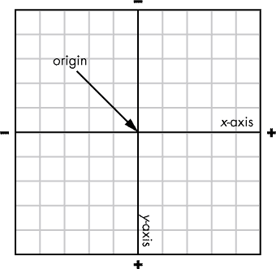
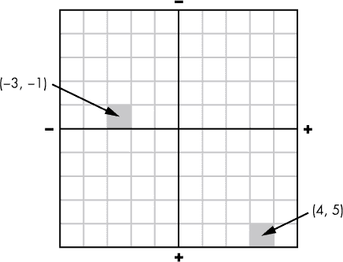
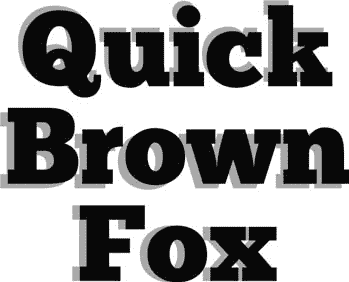
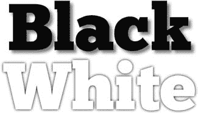
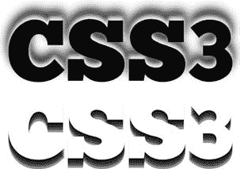
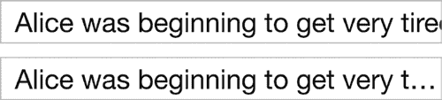
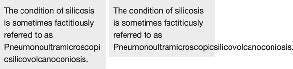
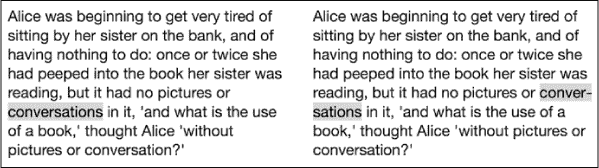
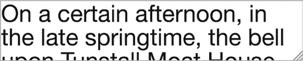

## **6**

**文本效果和排版样式**


自互联网诞生以来，文本内容一直是其支柱，然而多年来，我们只能依赖一套有限的工具。CSS3 通过在文本模块中引入一系列新的和更新的特性，极大地扩展了其排版工具集。

这些新特性中最重要的是能够为文本添加阴影。虽然这个功能听起来并不特别具有革命性——印刷排版师早已使用阴影——但新的语法足够灵活，可以实现一些非常漂亮的效果。另一个类似的功能是文本轮廓（或文本描边），尽管它并没有被广泛实现，但它确实增加了在创建装饰性标题时的选择多样性。除此之外，还有一些不那么引人注目的效果，但对于提升文本可读性却能发挥巨大的作用。

CSS 文本 3 级模块（*[`www.w3.org/TR/css3-text/`](http://www.w3.org/TR/css3-text/)）*目前处于最终草案工作版本状态；然而，一些元素已经得到了很好的实现，可以立即使用。

在我介绍这个模块中的第一个新属性之前，我将简要介绍坐标和轴的概念。如果你已经熟悉这些概念，可以跳过这一部分；否则，请继续阅读。

### **理解轴和坐标系**

CSS3 中新引入的一个语法概念是*轴*（当你有多个时称为*轴*）。如果你还记得数学课，可能已经知道什么是轴，但如果你正在阅读这一部分内容，我假设你需要一些复习。

CSS 使用*笛卡尔坐标系*，它由两条线组成，一条是水平线，另一条是垂直线，两条线在直角处相交。这些线中的每一条都是一个轴：水平线称为*x 轴*，垂直线称为*y 轴*。这两条线交汇的点叫做*原点*。你可以在图 6-1 中看到这一点的示意。



*图 6-1：x 轴* *和* y 轴*以及原点*

对于屏幕上的项目，你可以以像素为单位测量这些轴的长度。在图 6-1 中，你可以看到轴和原点覆盖在一个网格上。假设每个方格对应一个像素。你还会注意到在每个轴的两端都有正（+）和负（−）标签；这些标签告诉你，从原点起的距离将沿着这个方向以正值或负值进行测量。

现在你理解了这个概念，你可以找到任何点相对于原点的坐标。*坐标*是一对数值——每个轴一个——表示从原点的距离。原点的坐标是 (0, 0)。例如，给定坐标 (3, 4)，你可以通过在 *x* 轴上移动 3 像素，在 *y* 轴上移动 4 像素来找到这个点（记住，每个轴上的第一条线是 0，不计算在内）。同样，坐标 (−3, −1) 表示一个点在 *x* 轴上远离原点 3 像素，且在 *y* 轴上远离原点 1 像素。你可以在图 6-2 的图表上看到这两个值。



*图 6-2：两组坐标*

如果这些听起来非常复杂，不用担心——你已经在使用笛卡尔坐标系了，比如`background-position`这样的属性；只是你没有意识到而已。

在 CSS 中，所有元素都有高度和宽度，每个都表示为一个像素的数值（即使使用其他长度单位如 em 或百分比）。高度和宽度一起创建了一个*像素网格*；例如，一个大小为 10px × 10px 的元素，其像素网格为 100px。如果你认为元素的原点位于左上角，那么像`background-position`这样的属性的两个位置值就完全对应于 *x* 和 *y* 坐标。

**注意**

*在 CSS 中，默认的原点是元素的左上角，但这并不是固定不变的；某些 CSS 属性允许你更改原点的位置。例如，你可以将原点设置在元素的正中心、右下角或任何你希望的位置。我们将在本书后面看到这一点，例如在第十二章处理 2D 转换时。*

### **应用维度效果：text-shadow**

使用 `text-shadow` 属性为文本添加阴影的功能已经存在很长时间了；Safari 首次在 1.1 版本中实现了该功能，并在 2005 年发布。所以你可能会好奇，为什么我在一本关于 CSS3 的书中讨论它。和第五章中的字体属性一样，`text-shadow` 在 CSS2.1 中由于缺乏实现而被删除，但这个属性已经在 CSS3 规范中重新加入，并且如今在浏览器中得到了良好的实现。

阴影的位置是通过我刚才介绍的 *x* 和 *y* 坐标来设置的。最简单的语法形式接受两个值：*x* 用于设置文本的水平距离（称为 *x-offset*），*y* 用于设置垂直距离（即 *y-offset*）：

```
E { text-shadow: x y; }
```

默认情况下，阴影将继承自父元素的颜色（通常是黑色），因此如果你想指定不同的颜色，你需要为其提供一个值，例如：

```
E { text-shadow: x y color; }
```

这是一个示例，展示了一个灰色（十六进制代码 #BBB）阴影，位于原始文本的右侧 3px 和下方 3px：

```
h1 { text-shadow: 3px 3px #BBB; }
```

你可以在图 6-3 中看到此代码的输出。


*图 6-3：简单的`*text-shadow*`*

偏移值不仅限于正整数；你还可以使用 0（零）和负数来获得不同的效果。以下是一些示例：

```
➊ .one { text-shadow: -3px -3px #BBB; }
➋ .two { text-shadow: -5px 3px #BBB; }
➌ .three { text-shadow: -5px 0 #BBB; }
```

你可以在图 6-4 中看到这些示例的输出。



*图 6-4：`*text-shadow*` 的不同轴偏移值*

第一个示例（➊）使用了两个轴的负值，因此阴影渲染在文本的上方和左侧。下一个示例（➋）对 *x* 轴使用负值，对 *y* 轴使用正值，因此阴影渲染在文本的下方和左侧。最后一个示例（➌）对 *x* 轴使用负值，对 *y* 轴使用 0 值，因此阴影渲染在文本的左侧，并且位于同一基线。

`text-shadow` 属性还具有第四个选项：`*blur-radius*`。此选项设置阴影模糊效果的范围，必须在偏移值之后使用：

```
E { text-shadow: x y blur-radius color; }
```

模糊半径值与两个偏移值一样，也是带有长度单位的整数；值越大，模糊效果越宽（且越浅）。如果没有提供值（如图 6-4 中所示的示例），则默认模糊半径为 0。以下是几个示例：

```
.one { text-shadow: 3px 3px 3px #BBB; }
.two { text-shadow: 0 0 3px #000; }
```

你可以在图 6-5 中看到这些示例的输出。



*图 6-5：`*text-shadow*` 的不同模糊值*

在第一个示例中，我设置了与图 6-4 中相同的偏移值，但模糊半径为 3px。结果是一个更柔和、更“自然”的阴影。在第二个示例中，我设置了偏移值为 0，模糊半径为 3px，使文本与背景匹配，产生文本被提升的错觉。

#### ***多个阴影***

你不必局限于单一阴影——`text-shadow` 的语法支持为文本节点添加多个阴影。只需为属性提供额外的值，并使用逗号分隔它们，如下所示：

```
E { text-shadow: value, value, value; }
```

阴影按照你提供的值顺序应用。图 6-6 展示了多个阴影效果的两个示例。



*图 6-6：使用多个值的`*text-shadow*`*

这些示例的 CSS 如下所示。第一个示例有一个类 `one`，第二个示例有一个类 `two`。请注意，我已将它们缩进以便于理解。

```
.one {
    text-shadow:
    0 -2px 3px #FFF,
    0 -4px 3px #AAA,
    0 -6px 6px #666,
    0 -8px 9px #000;
}
.two {
    color: #FFF;
    text-shadow:
    0 2px rgba(0,0,0,0.4),
    0 4px rgba(0,0,0,0.4),
    0 6px rgba(0,0,0,0.4),
    0 8px 0 rgba(0,0,0,0.4);
}
```

在第一个示例中，我将 x 偏移保持为 0，同时将 y 偏移的负值从 −2px 增加到 −8px。模糊半径从 3px 增加到 9px，颜色逐渐变暗，形成文本后面幽灵般的淡轮廓，随着远离文本，阴影变得更暗。

在第二个示例中，x 偏移量仍然保持一致，但这次 y 偏移量的值增加了。由于没有指定 `*blur-radius*` 值，它保持为 0。在这里，我使用了 `rgba()` 颜色函数（在 第十章 中有解释），所以颜色保持不变但部分透明，创建了重叠效果。尽管值的变化相对较小，但这两个元素之间的视觉差异非常显著。

如我之前所说，`text-shadow` 在浏览器中实现得很好，IE10+ 和所有其他主流浏览器，包括移动端，都支持该功能。

### **限制溢出**

在某些情况下——例如在屏幕空间有限的移动设备上——你可能希望将文本限制为单行且固定宽度，尤其是在展示链接列表时，这样你不希望链接文本换行。如果文本超出其容器并被中断，可能会非常令人沮丧。

在 CSS3 中，为了应对这种情况，新增了一个名为 `text-overflow` 的属性。它的语法如下：

```
E { text-overflow: keyword; }
```

允许的关键字值是 `clip` 和 `ellipsis`。默认值是 `clip`，它的作用如我之前所描述的：文本在溢出容器元素的地方被截断。但新的值——`ellipsis`——非常有趣，它会在溢出之前的最后一个完整或部分字符处用一个省略号字符（…）代替。

让我们通过以下 CSS 示例来演示：

```
p {
    overflow: hidden;
    text-overflow: ellipsis;
    white-space: nowrap;
}
```

在这个 `p` 元素中，我将 `overflow` 的值设置为 `hidden`，以防止内容显示在边框外，`white-space` 属性的值设置为 `nowrap`，以防止文本换行，并且将 `text-overflow` 属性的值设置为 `ellipsis`。你可以在 图 6-7 中查看与默认行为相比的效果。



*图 6-7：带有 `*text-overflow*` 属性值为 `*ellipsis*` 的效果（底部）*

句子中的最后一个词被截断，并且用省略号代替了被移除的字符，表示该行已经被截断。

`text-overflow` 属性最初是在文本模块中定义的，但后来被移到了基本用户界面模块中（* [`www.w3.org/TR/css3-ui/`](http://www.w3.org/TR/css3-ui/)*）。该属性已在所有主流浏览器中实现。

该规范还以两种方式扩展了基本语法。首先，你可以为该属性提供两个值——一个是行尾的溢出值，另一个是行首的溢出值。例如，如果你给文本设置了负缩进并且文本超出了容器，你可以在两端加上省略号：

```
E { text-overflow: ellipsis ellipsis; }
```

第二个扩展提供了一个第三个可能的关键字值，这个值是一个字符串，可以替代省略号，就像这个示例中我用波浪号来展示溢出效果：

```
E { text-overflow: '~'; }
```

这些扩展目前仅在 Firefox 中实现，并在规范中标记为可能在以后被移除。

### **文本对齐**

`text-align`属性已经存在很长时间，但 CSS3 为它新增了两个值：`start`和`end`。对于从左到右阅读的人来说，它们分别等同于`left`和`right`。然而，它们的真正用途是在国际化网站中，特别是那些可能使用从右到左的文本的站点。你可以在大多数现代浏览器中使用这些新值，但 Internet Explorer 除外。

CSS3 新增了`text-align-last`属性，允许你设置对齐方式，以便对齐文本块中的最后一行（或唯一一行）文本。此属性接受与`text-align`相同的值：

```
E { text-align-last: keyword; }
```

所以，如果你想让一块文本对齐，但也希望最后一行对齐到右边，你可以使用：

```
p {
    text-align: justify;
    text-align-last: right;
}
```

截至写作时，这个扩展已在 Internet Explorer 中实现（不过，仍没有`start`和`end`关键字值），在 Firefox 中以`-moz-`前缀实现，并且在 Chrome 中也有实现。

### **控制行换行**

在处理动态文本时，常常遇到的一个问题是行在不合适的位置换行。例如，当你提供一个事件的详细信息时，你希望开始时间和结束时间显示在同一行，但如果出现动态换行，结束时间可能会被推到下一行。CSS3 通过一对属性，让你能更清晰地定义如何让内容换行，从而让你对这些问题有更多的控制权。

#### ***拆分单词***

第一个属性是`word-wrap`，它指定浏览器是否可以拆分长单词以使其适应父元素。它的语法非常简单：

```
E { word-wrap: keyword; }
```

此属性允许使用`normal`或`break-word`的关键字值。前者只允许在单词之间换行（除非在标记中另有指定），后者则允许单词在必要时被拆分，以防止父元素溢出。

所以，举个例子，如果我想允许长单词换行，而不是让它们溢出其包含元素，我可以使用：

```

p.break { word-wrap: break-word; }
```

图 6-8 展示了这个效果。左边的块没有使用单词换行，而右边的块则使用了。



*图 6-8：带有（左）和不带（右）`*break-word*`值的`*word-wrap*`的文本示例*

`word-wrap`属性在所有主流浏览器中得到广泛支持，包括 Internet Explorer。最近的文本模块版本已将`word-wrap`重命名为`overflow-wrap`，不过一些浏览器——例如 Chrome 和 Safari——已经实现了新的名称，尽管出于兼容性原因，旧名称也将继续得到支持。

#### ***单词连字符***

如果你更喜欢有一个额外的选项来将单词分隔到多行，可以使用连字符。连字符在印刷中长期作为标准，指示单词断开的位置。你可以在 HTML 中使用软连字符符号实体 `&shy;` 来对文本进行连字符——尽管这要求你标记所有内容，这在某些情况下并不可行。

CSS3 通过 `hyphens` 属性使这一点变得稍微简单一些：

```
E { hyphens: keyword; }
```

`hyphens` 有三个可能的关键字值：`manual` 仅在标记中存在连字符建议时进行单词断开——也就是使用上一段中提到的软连字符符号；`auto` 即使没有连字符建议，也会在适当的位置断开单词；而 `none` 永远不会断开单词，即使存在建议。

**警告**

*自动连字符仅在指定文档语言且浏览器能够访问该语言的连字符词典时才会发生。*

你可以在 图 6-9 中看到连字符的例子。左侧的段落没有应用连字符，而右侧的段落则应用了 `auto` 值；单词“conversations”（高亮显示）已被浏览器进行连字符，并分断到两行。



*图 6-9：右侧的段落启用了自动连字符*

`hyphens` 属性目前的实现比较零散：它在 IE10+、Firefox 和 Safari 中都有实现，并且每个浏览器都有相应的厂商前缀，但最近已从 Chrome 中移除（因为 Chrome 本来就不支持自动连字符）。它也出现在 iOS 的 Safari 中。

### **调整元素大小**

另一个对于内容宽度大于其容器的元素非常有用的新属性是 `resize` 属性。这个属性允许你通过提供一个控制柄来控制元素的尺寸，使你可以拖动元素调整到不同的大小。

该属性的语法如下：

```
E { resize: keyword; }
```

关键字值指定了元素可以被拖动的方向：`horizontal`（水平）、`vertical`（垂直）、`both`（两者）或 `none`（无）。在以下示例中，我将展示一个 `p` 元素，`resize` 属性的值为 `both`，使用以下代码：

```
p {
    overflow: hidden;
    resize: both;
}
```

图 6-10 展示了在 Mac 上 Firefox 中如何显示可调整大小的元素。



*图 6-10：一个可调整大小的文本框在右下角有一个条纹状的控制柄*

`resize` 属性在 Chrome、Firefox 和 Safari 中得到支持——尽管在移动浏览器中实现可能不太稳定，因为它们的输入控制较为粗糙。还需注意，调整元素大小可能无法通过键盘进行，因此不要把调整大小设为必须的操作。

### **总结**

过去几年，网页排版质量有了显著提升，尽管有限的 CSS 文本属性使得这一点并不容易。但我相信浏览器厂商已经注意到对更好实现的需求，并且，尽管缓慢，但排版控制正逐步掌握在我们手中。

在第五章中，我探讨了如何增加字体的种类和范围，而在本章中，我讨论了如何让这些字体更具装饰性、灵活性，并且——最重要的是——易于阅读。第七章将通过介绍一种全新的文本布局方式，完成关于字体和排版的三章内容。嗯，对网页来说是新的；不过印刷商已经使用这种方式好几个世纪了。

### **文本效果和排版样式：浏览器支持情况**

|  | **Chrome** | **Firefox** | **Safari** | **IE** |
| --- | --- | --- | --- | --- |
| `text-shadow` | 支持 | 支持 | 支持 | IE10 |
| `text-overflow` | 支持 | 支持 | 支持 | 支持 |
| `text-align` (新值) | 支持 | 支持 | 支持 | 不支持 |
| `text-align-last` | 支持 | 支持^(*) | 不支持 | 支持^(†) |
| `overflow-wrap` | 支持 | 支持^(‡) | 支持 | 支持^‡ |
| `hyphens` | 不支持 | 支持* | 支持* | IE10* |
| `resize` | 支持^(§) | 支持 | 支持^§ | 不支持 |

* 带有厂商前缀

† 没有起始和结束值

‡ 类似于 word-wrap

§ 不支持移动浏览器
