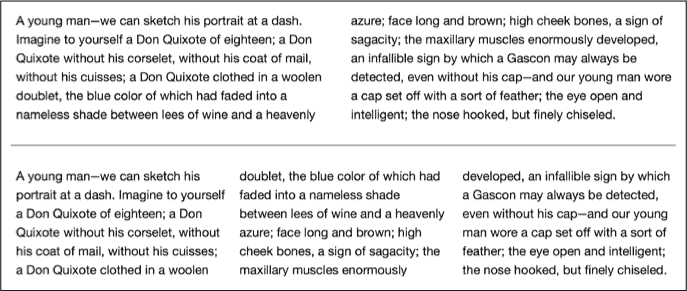
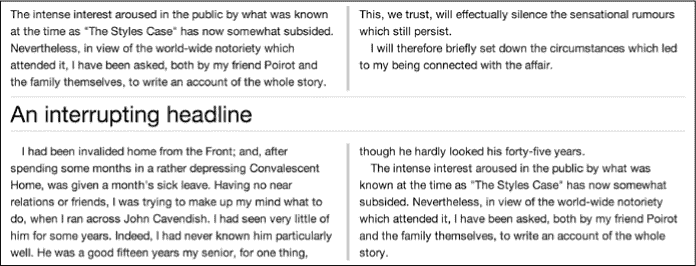

## **7**

**多列**


尽管近年来桌面和笔记本电脑屏幕变得更宽，但研究仍然表明人们在阅读长行文本时感到困难。（通常认为每行大约 65 到 75 个字符是比较舒适的阅读长度。）这种惯例导致了限制性的布局和未能充分利用更宽屏幕所带来的机会的网站。

多年来，杂志和报纸一直使用多列布局来流式化内容——解决了长文本行的问题，以及如何在有限的空间内容纳大量文案的问题。现在，随着 CSS3 中多列布局模块的出现（* [`www.w3.org/TR/css3-multicol/`](http://www.w3.org/TR/css3-multicol/)*），网站也能利用多列布局了。

多列布局模块目前已达到候选推荐状态，这意味着该模块被认为基本完成，并且在 IE10+ 和其他现代浏览器中得到了良好的实现（尽管有一些小的限制），因此你有充足的机会来尝试使用多列布局。

### **列布局方法**

你可以使用两种方法将内容分成列：一种是预设列数，另一种是动态设置列宽，让浏览器自动计算适合父元素宽度的列数。

请注意，尽管在撰写本文时，Chrome、Firefox、Safari 和 IE10+ 都支持本章中的属性，但后者是唯一一个不需要厂商前缀即可实现的浏览器。不同的浏览器在实现上也有一些小差异，我会在接下来的内容中指出这些问题。

#### ***预设列：column-count***

将内容均匀分配到多个列中的最简单方法是使用 `column-count` 属性：

```
E { column-count: columns; }
```

元素 `*E*` 是你想要分列的内容的父元素，`*columns*` 值是一个整数，用来设置列数。例如，要将内容流式化到 `div` 元素的两列中，你可以使用：

```
div { column-count: 2; }
```

让我们来看一个实际的例子。我将演示几段文本，第一次展示为两列，第二次展示为三列。这里是我将使用的代码：

```
div[class*='-2'] { column-count: 2; }
div[class*='-3'] { column-count: 3; }
```

**注意**

*在这些例子中，我使用了任意子字符串属性值选择器，* *这是我在第三章中介绍的。*

你可以在图 7-1 中看到此代码的效果。



*图 7-1：文本分成两列，再分成三列*

这是我为示例 图 7-1 所使用的标记（已编辑以简化内容）：

```
<div class="columns-2">
    <p>A young man…</p>
</div>
<div class="columns-3">
    <p>A young man…</p>
</div>
```

语法非常简单，浏览器会负责均匀分配内容。

#### ***动态列：column-width***

划分内容为列的第二种方法可能更适合灵活的布局。它不是指定列数，而是使用`column-width`属性指定每列的宽度，浏览器会根据父元素的宽度填充尽可能多的列。语法也非常简单：

```
E { column-width: length; }
```

与`column-count`一样，`*E*`是你想要划分为列的内容的父元素。但`column-width`的不同之处在于，它需要一个`*length*`值：可以是一个长度单位（例如 px 或 em）或一个百分比。以下是一个例子：

```
div { column-width: 150px; }
```

这段代码将`div`的子元素分成宽度为 150px 的列，并沿`div`的宽度重复这些列。我们来看一下它是如何工作的，使用以下样式规则：

```
.columns {
    column-width: 150px;
    width: 710px;
}
```

这里，我有一个名为`columns`的元素，宽度为 710px；其中的内容将被分布到宽度为 150px 的列中。你可以在图 7-2 中看到它的渲染效果。

将`column-width`设置为 150px 时，浏览器已创建四列来填充父元素。但情况并非看起来的那样。记住，父元素的宽度是 710px，即使每列之间有 12px 的间隙（稍后会讲到），总宽度也只有 636px，那多出来的空白空间去哪了呢？


*图 7-2：文本跨越动态创建的、间距相等的列*

创建列的算法其实非常智能，它会自动调整列的大小，使它们更好地适应父元素。它使用 150px 作为*最小*值，直到每列的宽度足够，直到总宽度与父元素相匹配——在这个例子中，每列的宽度被调整为 168.5px。

#### ***内容在列中的不同分布***

默认情况下，流入多列的内容会尽可能均衡地分布在列中，以使每列的长度相同。如果浏览器无法均匀安排内容，最后一列会被缩短。这可能比解释更容易理解，因此图 7-3 展示了使用默认布局方法将文本分布在三列上的效果。


*图 7-3：文本动态分布在三列上*

你可以看到所有三列的行数相同。如果你想更改这个默认行为，可以使用`column-fill`属性来实现：

```
E { column-fill: keyword; }
```

这个属性有两个可能的关键字值：默认值是`balance`，它试图使所有列的长度相等，如图 7-3 所示；另一种选择是`auto`，它按顺序填充列。

`auto`值仅在父元素具有固定高度时生效。内容首先流入第一列以填充高度，然后流入下一列，直到该列填满，以此类推。

**警告**

*当使用`*auto*`值时，可能看起来你有比`*column-count*`属性指定的列数少，但实际情况并非如此；只是有些列会是空的。*

你可以在图 7-4 中看到`column-fill`的`auto`值示例；前两列有相等数量的行，第三列少了三行，因为文本仅仅流入列中，浏览器并没有尝试平衡它们。


*图 7-4：使用`*auto*`值将内容流入列中，作为`*column-fill*`属性的值*

目前，只有 Firefox 和 IE10+浏览器实现了这个属性，尽管 Chrome 和 Safari 在父元素设置固定高度时，自动表现得像应用了`auto`值一样。

#### ***结合 column-count 和 column-width***

你可以在一个元素上同时设置`column-count`和`column-width`属性，尽管一开始你可能认为这样做会产生冲突。然而，这种可能性已经被考虑在内：如果两个属性都应用于同一元素，`column-count`的值作为最大值。为了说明这一点，让我们参考图 7-2，但将 CSS 更改为同时包括`column-count`属性：

```
.columns {
    column-count: 3;
    column-width: 150px;
}
```

这是其背后的逻辑：将文本分成每列 150px，除非这样会创建三列或更多列，在这种情况下，创建三列，最小宽度为 150px。

如果你回顾一下图 7-2 中显示的示例，你会记得，考虑到父元素的宽度为 710px，`column-width`属性生成了四列。然而，当你在同一元素上应用这两个属性时，`column-count`属性优先，结果只会分配三列，它们的宽度会动态调整以最好地适应父元素。你可以在图 7-5 中看到结果。


*图 7-5：当结合列属性时，* `*column-count*` *作为最大值。*

如果你希望一起使用这两个属性，提供了一个简写属性：

```
E { columns: column-width column-count; }
```

所以，如果你使用图 7-5 中的值与这个简写属性，它看起来会是这样：

```
div { columns: 150px 3; }
```

### **列间距和规则**

在使用规定的多列布局时，浏览器应在每列之间设置默认的 1em 间距。然而，你可以通过使用两个新属性：`column-gap` 和 `column-rule`，来更改默认值并指定自己的间距。

第一个属性，`column-gap`，设置列与列之间的间距，它的语法很简单：

```
E { column-gap: length; }
```

`*length*`值是任何带有标准 CSS 长度单位的数字。以下是一个示例，在生成的每列之间设置 2em 的间距（不过不会在第一列或最后一列的外侧添加间距）：

```
div { column-gap: 2em; }
```

第二个属性，`column-rule`，画一条线，类似于边框，等距离地分隔列。`column-rule`的语法实际上是三个子属性的简写：`column-rule-width`、`column-rule-style`和`column-rule-color`。这些子属性的值与它们在 CSS2 中的等效`border-*`属性完全相同。以下是语法：

```
E {
   column-rule-width: length;
   column-rule-style: border-style;
   column-rule-color: color;
   column-rule: length border-style color;
}
```

如果你添加了实际值，结果会是这样的：

```
div {
    column-rule-color: silver;
    column-rule-style: double;
    column-rule-width: 0.3em;
}
```

然后，你可以使用`column-rule`简写一次性设置所有三个子属性：

```
div { column-rule: 0.3em double silver; }
```

让我们看看`column-gap`和`column-rule`属性的实际效果。以下示例将它们与`column-count`结合使用：

```
.columns {
    column-count: 3;
    column-gap: 2em;
    column-rule: 0.3em double silver;
}
```

这个示例将元素的子元素分成三列，每列之间有 2em 的间隙，并且有一个 0.3em 的分隔线。分隔线的厚度对布局没有影响——无论你把分隔线做得多厚，间隙的宽度始终保持不变。你可以在图 7-6 中看到这个示例的结果。


*图 7-6：列间间隙和规则*

### **列内包含元素**

到目前为止，在这些示例中我只使用了文本块，这些文本块整齐地流入列中。但对于像图像这样可能宽于所包含列的较大元素，会发生什么呢？让我们看看当我在列布局中添加一个比单列更宽的图像时会发生什么，使用`img`元素。结果显示在图 7-7 中。


*图 7-7：一个比列宽的`*img*`元素^(1)*

如你所见，图像显示在第二列中，但溢出部分在`column-gap`的中间位置被剪切。到目前为止，唯一与此行为不同的浏览器是 Firefox，它（不幸的是）保持图像的宽度，但将后续列的内容流过它，如图 7-8 所示。


*图 7-8：Firefox 在显示宽元素时与其他所有浏览器不同。*

希望这个问题将在未来的版本中修复（也许在你读到这篇文档时就已经修复了）。

为了完全解决这个问题，我可以将图像的`max-width`属性设置为`100%`，因为宽度是根据包含列的宽度计算的，而不是父元素的宽度。

### **跨越多列的元素**

有时，你可能希望某些元素跨越多个列——例如，一个子标题，用来分隔故事的各个部分。为了处理这些元素，该模块引入了`column-span`元素。以下是语法：

```
E { column-span: value; }
```

在这种情况下，`*value*`只能是两种可能值之一：`all` 或 `none`。默认值是 `none`，这将使元素保持在列流中。另一种可能的值是 `all`，这会打断列流——元素之前的所有内容会分配到各列中，元素之后的所有内容也会分配到各列中，但元素本身——被称为 *跨越元素*——则不会。

在以下示例中，`h2` 元素的 `column-span` 值为 `all`，因此它跨越了多个列，导致文本流断开。你可以在图 7-9 中看到效果。

```
h2 { column-span: all; }
```



*图 7-9：一个* `*h2*` *元素跨越了两列*

到目前为止，Firefox 是唯一不支持此属性的浏览器。

### **总结**

尽管 CSS3 让你的内容流入列中变得很容易，但它所带来的挑战不在于技术性问题，而在于实际应用问题：如果你想使用比列宽更宽的图片，或者你想在狭窄的列中使用长标题，怎么办？

尽管在某些情况下使用多列布局肯定是合适的，但在使用之前请三思是否适合你的内容。确保在使用这些属性之前，你完全掌控了你的内容，并且如果你的客户没有专门且认真负责的网络内容团队，最好不要设计依赖多列布局的网站。

同时，请记住，屏幕分辨率可能会有很大差异，对你而言看起来可读的内容可能对网站访客来说并不可读。如果他们必须频繁地上下滚动，这可能会引起很多困惑，甚至可能导致他们完全不再访问你的网站。不过，话虽如此，巧妙地使用多列布局可以让你的内容更具可读性。

在最后三章中，我描述了 CSS3 如何提供格式化和呈现文本副本的方法，帮助你更好地控制排版和布局。接下来，我将介绍如何改善网站的整体视觉效果，首先从新的背景和边框效果开始。

### **多列布局：浏览器支持**

|  | **Chrome** | **Firefox** | **Safari** | **IE** |
| --- | --- | --- | --- | --- |
| `column-count` | 是^(*) | 是* | 是* | IE10 |
| `column-width` | 是* | 是* | 是* | IE10 |
| `columns` | 是* | 是* | 是* | IE10 |
| `column-fill` | 否 | 是* | 否 | IE10 |
| `column-gap` | 是* | 是* | 是* | IE10 |
| `column-rule` | 是* | 是* | 是* | IE10 |
| `column-span` | 是* | 否 | 是* | IE10 |

* 使用厂商前缀
