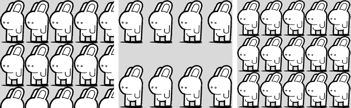
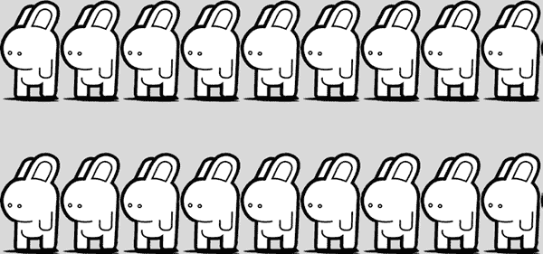
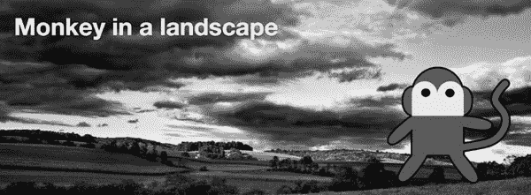
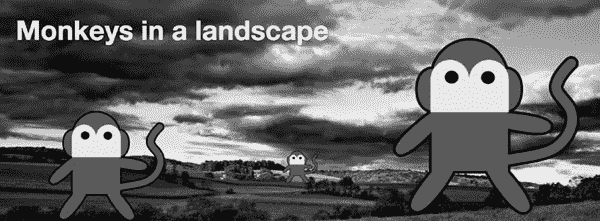
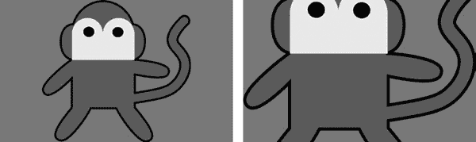
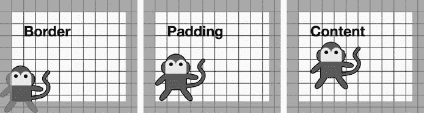

## **8**

**背景图片**


为了让我们的网站更具视觉吸引力，往网页添加装饰元素曾经是一个非常消耗资源和时间的过程。即便是看似简单的图形效果，比如在同一个元素上使用两个背景图片，也需要大量不必要的标记，这反过来使得页面渲染变慢，维护也变得更加困难。

CSS3 引入了许多新的和扩展的属性，旨在使元素装饰变得更加简单，浏览器厂商也迅速实现了这些特性，并且加入了许多自家的实现。在接下来的几章中，我们将一一探讨新的功能特性，从背景图片到装饰性边框，再到新的颜色效果。

我将首先带你走一遍背景与边框模块（* [`www.w3.org/TR/css3-background/`](http://www.w3.org/TR/css3-background/)*）。由于网页开发者的需求很大，它所带来的新属性已经得到了浏览器的广泛实现。Internet Explorer 9 完全实现了本章列出的属性和变化，其他主流现代浏览器也都实现了这些特性，因此，除非文中另有说明，你可以假设这些属性得到广泛支持。

由于背景与边框模块相当庞大，我将其分为两章进行讲解，首先从背景图片属性开始。背景图片已经是 CSS 的一部分多年，但与之前的版本不同，在 CSS3 中，你可以对元素应用多个图片，并且可以动态调整这些图片的大小。仅这两个新特性就足以让我们大多数人感到高兴，但该规范更进一步，提供了对图片位置和平铺方式的更多控制。

### **现有背景属性的更新**

许多其他的 CSS3 模块引入了新的属性，甚至是全新的概念，但背景与边框模块的强大之处在于它扩展了现有的属性，使其更强大且更有用。虽然这个模块并非没有创新—它当然有，而且我很快就会介绍—但其中的细微变化才是亮点，在这一节中，我将讲解你在 CSS2.1 中熟悉的属性的扩展和变动。

#### ***background-position***

在 CSS2.1 中，`background-position` 属性接受两个值：每个盒子边缘的关键字（如 `top`、`right` 等），或者设置相对于应用该属性的元素左上角的长度或百分比值。虽然这对于许多任务来说已经足够，但当我们进行页面布局时，它并没有提供我们所期望的精细控制。

在 CSS3 中，该属性现在最多接受四个值：你可以使用关键字指定一侧，然后使用长度或百分比值来表示相对该侧的距离。来看一下这个示例代码：

```
.foo { background-position: right 10em bottom 50%; }
```

元素`*.foo*`上的背景图像将位于从右边 10em 的位置和从底部 50%的位置。这种定位在 CSS2.1 中非常困难；你必须知道所有涉及元素的宽度，并且这些宽度不能变化。

#### ***background-attachment***

背景图像在视口中滚动的方式由`background-attachment`属性决定。CSS2.1 中允许的值有`scroll`（默认值），意味着图像不会与应用该属性的元素一起滚动，而是与视口一起滚动；`fixed`，意味着图像既不与元素滚动，也不与视口滚动。

在 CSS3 中引入了一个新的值`local`；这个值允许图像同时与其元素和视口一起滚动。这在静态书籍中几乎无法演示，所以我建议你查看书籍附带网站上的示例文件 8-a（*[`thebookofcss3.com/`](http://thebookofcss3.com/)*）。

新的值在 IE9+及所有其他主要现代桌面浏览器中得到支持。然而，移动浏览器往往使用不同的视口布局机制，在这些机制中，固定元素并不真正起作用，因此你可能会在这些浏览器中遇到意外的（或根本没有）行为。

#### ***background-repeat***

在 CSS2.1 中，`background-repeat`属性接受四个可能的值之一：`no-repeat`、`repeat`、`repeat-x`和`repeat-y`。使用这些值，你可以在元素上水平或垂直（或两者）平铺图像，但它们并不提供比这更细致的控制。然而，CSS3 通过两种方式扩展了这个属性的功能：一对新的属性和语法上的一个调整。

新的属性之一是`space`，它设置背景图像在其包含元素中尽可能多地重复，而不剪裁图像。所有重复的图像（除了第一个和最后一个）之间的间隔是均等的，因此图像是均匀分布的。

第二个是`round`，它同样将背景图像设置为尽可能多地重复而不剪裁，但与均匀间隔重复不同，图像会缩放，以便完整的图像数填充包含元素。

为了比较这两者之间的区别，我准备了一个示例，其中将不同的`background-repeat`值应用于两个元素，使用以下代码：

```
.space { background-repeat: space; }
.round { background-repeat: round; }
```

图 8-1 展示了结果。左侧的元素作为参考，具有默认的`background-repeat`值`repeat`，并展示了你当前期望的行为。中间的元素的值为`space`，显示出在不剪裁或缩放的情况下，可以重复的最大图像数量，并且它们之间有空隙。最后，右侧的元素的值为`round`，它计算出可以在水平和垂直方向上适应包含元素的最大整数，并根据需要缩放图像。

目前，只有 Internet Explorer 9+ 和 Chrome 正确实现了这些关键词。Safari 识别它们，但会使它们表现不正确，就像应用了 `no-repeat` 一样。Firefox 会忽略它们，并使用之前的级联或继承值。



*图 8-1：`*background-repeat*` *的值：`*repeat*` *(左边)，`*space*` *(中间)，和 `*round*` *(右边)*^(1)*

我还提到了一些语法的变化。现在，你可以分别控制两个轴上的平铺，因为该属性现在接受两个值。第一个值控制水平轴上的平铺，第二个值控制垂直轴上的平铺。所以，如果你希望背景图像在垂直方向上重复并带有圆角，而在水平方向上具有间距，可以使用以下代码：

```
.foo { background-repeat: round space; }
```

结果如图 8-2 所示。



*图 8-2：应用于水平和垂直方向的不同 `*background-repeat*` 值*

### **多个背景图像**

背景和边框模块中的第一个新特性不是新属性，而是对现有属性的扩展——或者说，是对多个现有属性的扩展。使用 CSS2.1 时，你只能为元素应用单一的背景图像，但在 CSS3 中，（几乎所有的）`background-*` 属性现在接受多个值，因此你可以为一个元素添加多个背景图像。

要做到这一点，你只需要将各个值用逗号分隔。例如，这是使用 `background-image` 的语法：

```
E { background-image: value, value; }
```

对于你创建的每个背景图层，你可以为所有相关的 `background-*` 属性添加适当的值。以下是一个实际的例子：

```
h2 {
    background-image: url('monkey.svg'), url('landscape.jpg');
    background-position: 95% 85%, 50% 50%;
    background-repeat: no-repeat; }
```

你可以在图 8-3 中看到它的效果。图层是按相反的顺序创建的——也就是说，列表中的第一个图层变成最上面的图层，依此类推。在我的示例代码中，*monkey.svg* 是位于 *landscape.jpg* 上方的图层。`background-position` 属性遵循相同的顺序：风景图像位于其容器元素的水平和垂直中心，即 `50%` 左和 `50%` 上，而猴子图像位于 `95%` 左和 `85%` 上。



*图 8-3：同一元素上的两个背景图像^(2)*

请注意，我只给了 `background-repeat` 一个值；如果一个属性的值比背景图层少，那么这些值会重复。在这个例子中，这意味着 `no-repeat` 会应用于所有背景图层。

你可以使用 `background` 简写属性来设置多个值；与单独的属性一样，你只需要提供一个用逗号分隔的值列表。为了得到与图 8-3 中相同的效果，我也可以使用以下代码：

```
h2 {
    background:
    url('monkey.svg') no-repeat 95% 85%,
    url('landscape.jpg') no-repeat 50% 50%;
}
```

我在本节开始时提到，几乎所有的背景属性都可以有多个值。然而，`background-color`是个例外，因为颜色层始终会堆叠在所有其他背景层下方。如果你想在使用简写属性时指定背景颜色，必须将其放在逗号分隔列表中的最后一个实例中。以我的示例代码为例，它将位于包含风景图片的那个实例中：

```
h2 {
    background:
    url('monkey.svg') no-repeat 95% 85%,
    url('landscape.jpg') no-repeat 50% 50% #000;
}
```

### **动态缩放背景图片**

CSS3 中的新属性是`background-size`。顾名思义，这个属性允许你设置背景图像的大小。其语法如下：

```
E { background-size: value; }
```

该属性的值可以是两个长度或百分比的组合，一个长度或百分比，或者一个关键字。如果使用一对值，语法如下：

```
E { background-size: width height; }
```

要将背景图像调整为宽 100px、高 200px，可以使用：

```
div { background-size: 100px 200px; }
```

长度可以是任何标准的测量单位。如果使用百分比，尺寸是基于包含元素的，*而不是*背景图像。因此，`100%`的宽度和高度，例如，将会把背景图像拉伸以填满容器。要使图像按自然尺寸显示，请使用`auto`关键字。

如果只指定一个值，该值将被视为宽度，且高度将被赋予默认值`auto`。因此，以下这两个示例是完全等效的：

```
div { background-size: 100px auto; }
div { background-size: 100px; }
```

你可以使用你新学到的多重背景方法与`background-size`一起使用。例如，让我们重新查看图 8-3，但重复猴子图像几次，并为`background-position`和`background-size`属性添加不同的值。下面是代码：

```
h2 {
background:
    url('monkey.svg') no-repeat 95% 85%,
    url('monkey.svg') no-repeat 50% 80%,
    url('monkey.svg') no-repeat 10% 100%,
    url('landscape.jpg') no-repeat 50% 50%;
    background-size: auto 80%, auto 15%, auto 50%, auto;
}
```

图 8-4 展示了这种方法的应用。第一只猴子的`background-size`是 80%，第二只猴子是 15%，最后一只猴子是 50%；在所有情况下，水平大小都被设置为`auto`，以保持图像的比例。



*图 8-4：多重缩放背景图像的示例*

除了长度值之外，还可以使用两个关键字：`contain`和`cover`。`contain`关键字使图像按比例缩放到尽可能大，但不超过包含元素的高度或宽度；`cover`使图像缩放到包含元素的高度或宽度，取较大的值。

看一下以下代码，看看我的意思：

```
.monkey-1, .monkey-2 {
    background-image: url('monkey.svg');
    background-position: 50% 50%;
}
.monkey-1 { background-size: contain; }
.monkey-2 { background-size: cover; }
```

我使用了两个元素，分别设置了类`monkey-1`和`monkey-2`，并为每个元素的`background-size`设置了不同的关键字值。结果如图 8-5 所示。



*图 8-5:* `*background-size*` *关键字：* `*contain*` *(左) 和* `*cover*` *(右)*

左侧的盒子使用了`contain`关键字值，因此背景图片垂直填充盒子（最短的长度）；右侧的盒子使用了`cover`关键字值，因此背景图片水平填充盒子（最长的长度），并在顶部和底部被裁剪。

### **背景裁剪与起始点**

在 CSS2 中，背景图像的位置是相对于其包含元素的外部填充边界来定义的，任何溢出都会延伸到边框下方。CSS3 引入了两个新的属性，可以更细致地控制这种位置。

第一个属性是`background-clip`，它设置了盒子模型的某个部分，成为背景（无论是颜色还是图像）显示的限制区域。下面是语法：

```
E { background-clip: box; }
```

`*box*`值可以是三个关键字之一：`border-box`、`content-box`或`padding-box`。`border-box`是默认值，背景显示在边框后面（如果使用透明或半透明边框颜色，你可以看到它）。`padding-box`值使背景仅显示到边框前，不能显示在边框后。`content-box`意味着背景仅在元素的填充区域内显示。

我将使用以下代码来说明不同的区别：

```
h2 {
    background: url('landscape.jpg') no-repeat 50% 50% #EFEFEF;
    border-width: 20px;
    padding: 20px;
}
h2.brdr { background-clip: border-box; }
h2.pddng { background-clip: padding-box; }
h2.cntnt { background-clip: content-box; }
```

我使用了三个`h2`元素，分别具有`brdr`、`pdding`和`cntnt`类。图 8-6 展示了不同值之间的差异。


*图 8-6：展示不同值对`*background-clip*`属性的影响：*`*border-box*`*（左）、`*padding-box*`*（中）、和`*content-box*`*（右）*

我使用了半透明的边框（我将在第十章中解释如何做到这一点），因此你可以在左侧的盒子中看到背景图像涂抹在边框下方，该盒子使用的是`border-box`值。中间的盒子使用的是`padding-box`值，正如你所见，背景在填充的边界处停止。在右侧的盒子中，值为`content-box`，因此背景不会显示在填充区域后面。

第二个可以让你更细致控制的属性是`background-origin`。使用`background-origin`，你可以设置背景开始计算的位置。正如我之前提到的，CSS2 中的背景位置是相对于填充的边界计算的，但`background-origin`允许你改变这一点。下面是语法：

```
E { background-origin: box; }
```

`*box*`值接受与`background-clip`中相同的关键字：`border-box`、`content-box`和`padding-box`。我将使用以下代码解释不同的结果：

```
h2 { background: url('monkey.svg') no-repeat 0 100%;}
h2.brdr { background-origin: border-box; }
h2.cntnt { background-origin: content-box; }
h2.pddng { background-origin: padding-box; }
```

不同值的效果如图 8-7 所示。如你所见，由于`background-position`是相对于每个盒子的不同点计算的，猴子在每个盒子中的位置不同（我已添加背景网格，使其更容易查看）。

`background-position` 总是设置为 `0 100%`，即左下角。然而，左下角的测量点会根据 `background-origin` 的值而变化。在第一个框中，背景从边框的极限开始；在第二个框中，从填充区域的极限开始；在第三个框中，从内容框的极限开始。



*图 8-7：* `*background-origin*` *属性，具有* `*border-box*` *(左)，* `*padding-box*` *(中)，和* `*content-box*` *(右)的值*

需要记住的几点：首先，如果 `background-position` 设置为 `fixed`，此属性将无效。其次，`background-clip` 和 `background-origin` 都接受多个值，采用与“多重背景图像”中相同的语法，该内容位于 第 88 页。

### **更新的背景快捷方式**

`background` 快捷属性已更新，包含 `background-size`、`background-clip` 和 `background-origin` 属性的值。`background-size` 的值应紧跟在 `background-position` 后，并用斜杠分隔，如下所示：

```
E { background: url('bar.png') no-repeat 50% 50% / 50% auto; }
```

在这种情况下，背景图像，*bar.png*，将被定位在元素的正中央，宽度设置为元素的 50%，高度自动调整。

对于 `background-clip` 和 `background-origin`，如果只提供一个框值（`border-box`、`padding-box` 或 `content-box`），则这两个属性都将设置为该值。如果提供两个框值，第一个将设置为 `background-origin`，第二个将设置为 `background-clip`。举个例子，看看这个简写代码：

```
E { background: url('bar.png') no-repeat padding-box content-box; }
```

在这种情况下，背景图像的原点将是填充框，图像将被裁剪到内容框。

### **总结**

本章介绍的新功能是实现 CSS 既定目标的一大步：将页面的内容与展示分离。背景图像的更多灵活性意味着创建我们想要的效果所需的元素更少，而我们从文档中移除的非必要标记越多，页面的维护就越轻松，语义性也会更好。

本章只介绍了背景和边框模块的一半内容，所以下一章我将介绍剩下的一部分——你可以从章节标题“边框和框效果”中猜到，这部分内容与边框有关。

### **背景图像：浏览器支持**

|  | **Chrome** | **Firefox** | **Safari** | **IE** |
| --- | --- | --- | --- | --- |
| `background-position` (边缘值) | 是 | 是 | 是 | 是 |
| `background-attachment` | 是 | 是 | 是 | IE10 |
| `background-repeat` (新值) | 是 | 否 | 否^(*) | 是 |
| `background-repeat` (两个值) | 是 | 是 | 是 | 是 |
| 多重背景图像 | 是 | 是 | 是 | 是 |
| `background-size` | 是 | 是 | 是 | 是 |
| 更新的 `background` 属性 | 是 | 是 | 是 | 是 |
| `background-clip` | 是 | 是 | 是 | 是 |
| `background-origin` | 是 | 是 | 是 | 是 |

* 这些值被识别，但未正确显示。
