## 第九章：9

**边框和盒子效果**


自 CSS1 时代以来，向页面元素添加边框的功能几乎没有变化。然而，开发者*想要*在边框上做的事，早在多年前就超出了他们*能够*做到的范围。添加像圆角或阴影这样的边框效果，可能已经导致了比几乎任何其他东西更多不必要的空白标记元素。这些本应简单的事情，往往需要一些非常复杂的解决方案。

我们对背景和边框模块的第二部分探索了不需要额外标记的新方法来装饰元素。你将学习如何制作圆角，使用图片作为边框，以及添加阴影。

### 给元素的边框添加圆角

自互联网诞生以来，设计师们一直在为页面元素添加圆角。没有办法不使用图片就创建圆角，简直是不可思议。要创建一个具有四个圆角的灵活宽度框，需要制作四张图片并添加至少两个额外的非语义元素，这使得维护一个网站变得比必要的要困难得多。

但现在不需要再这样做了。背景和边框模块引入了一种仅使用 CSS 就能给元素的角落添加圆角的方法。每个角落都被视为四分之一椭圆，其曲线是通过* x *轴上的一个点和* y *轴上的一个点之间画出来的（你可能记得这些来自第六章）。图 9-1 更清楚地说明了这一点。

四分之一椭圆可以是*规则的*，即两个轴的长度相同；也可以是*不规则的*，即每个轴上的长度不同。图 9-2 展示了两者的例子。

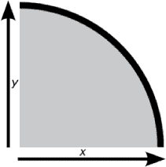

*图 9-1：由* x-*轴和* y-*轴之间的曲线形成的四分之一椭圆*

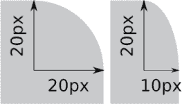

*图 9-2：一个规则的曲线（左）在两个轴上的值相同；一个不规则的曲线在每个轴上的值不同。*

CSS3 使用 `border-radius` 属性定义这些曲线。使用此属性，你可以通过以下语法简单地定义四分之一椭圆的半径：

```
E { border-v-h-radius: x y; }
```

在这个语法中，`*v*` 是 `top` 或 `bottom` 的关键字值；`*h*` 是 `left` 或 `right` 的关键字值；`*x*` 和 `*y*` 值是定义四分之一椭圆曲线的轴向长度。这听起来有点复杂，但下面的示例应该能让你更清楚：

```
div { border-top-right-radius: 20px 20px; }
```

这个语法会将 `div` 元素的右上角圆角半径设置为 20px，水平和垂直方向上都是规则曲线。

实际上，对于规则的曲线，`border-radius` 让你可以进一步简化，省略 `*x*` 或 `*y*` 的值；如果没有指定一个值，默认两个值相等。所以，如果你想将这个半径应用到元素的每个角落，你可以使用以下代码：

```
div {
    border-top-left-radius: 20px;
    border-top-right-radius: 20px;
    border-bottom-right-radius: 20px;
    border-bottom-left-radius: 20px; }
```

要创建具有不规则圆角的形状，你只需对各个属性使用不同的值：

```
div {
    border-top-left-radius: 10px 20px;
    border-top-right-radius: 10px 20px;
    border-bottom-right-radius: 10px 20px;
    border-bottom-left-radius: 10px 20px;
}
```

你可以在图 9-3 中比较这两个不同的代码示例：左边的形状使用第一个代码片段，具有四个常规圆角，而右边则是第二个代码片段的结果，具有四个（相等的）不规则圆角。

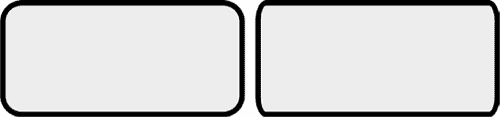

*图 9-3：两个元素，一个具有常规圆角（左），一个具有不规则圆角（右）*

#### *border-radius 简写*

如果每个角都写不同的属性让你觉得很重复，你会很高兴地发现有一种简写属性可用。像`border-width`、`margin`和`padding`一样，你可以指定一个、两个、三个或四个值。不过，虽然这些值在边缘上有特定的指代，但`border-radius`的值是指角，顺序从左上角开始：

```
E { border-radius: [top-left] [top-right] [bottom-right] [bottom-left]; }
E { border-radius: [top-left] [top-right & bottom-left] [bottom-right]; }
E { border-radius: [top-left & bottom-right] [top-right & bottom-left]; }
E { border-radius: [top-left & top-right & bottom-right & bottom-left]; }
```

所以，如果我想对一个`div`的左上角和右上角应用 20px 的值，对右下角和左下角应用 10px 的值，以下是我使用的代码：

```
div { border-radius: 20px 20px 10px 10px; }
```

**注意**

*使用这种简写语法只会创建常规的圆角；稍后我会介绍不规则圆角的简写方式。*

为了演示简写属性的实际应用，我将对三个元素应用规则，每次使用不同的一组值：

```
.radius-1 { border-radius: 0 20px; }
.radius-2 { border-radius: 0 10px 20px; }
.radius-3 { border-radius: 0 0 20px 20px; }
```

你可以在图 9-4 中查看结果。第一个（左）框有两个`border-radius`值：左上角和右下角的值为 0，因此是方形的，而右上角和左下角则有 20px 的圆角。第二个（中）框有三个值：左上角依然是方形的，但现在右上角和左下角有 10px 的圆角，而右下角的半径为 20px。最后，第三个（右）框有四个值：左上角和右上角的值为 0，因此是方形的，而右下角和左下角有 20px 的圆角。

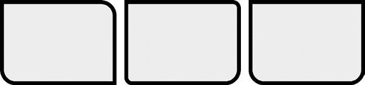

*图 9-4：不同值对* `*border-radius*` *简写属性的影响*

你还可以使用简写语法来处理不规则的曲线。为了实现这一效果，你需要用斜杠（`/`）分隔不同的值：

```
border-radius: { horizontal-radius / vertical-radius; }
```

每个斜杠的两侧可以包含一个到四个值，就像常规圆角的简写一样。这意味着，举例来说，你可以为水平半径指定一个值，并为垂直半径指定四个不同的值。接下来，我将通过一些示例来展示这是什么样子：

```
.radius-1 { border-radius: 20px / 10px; }
.radius-2 { border-radius: 20px / 10px 20px; }
.radius-3 { border-radius: 10px 20px 20px / 20px 10px; }
```

图 9-5 显示了结果。第一个（左）框有四个相等的角，水平半径为 20px，垂直半径为 10px。第二个（中）框有两个角的半径为 20px/10px，另外两个角的半径为 20px/20px。第三个（右）框的左上角为 10px/20px，右上角和左下角为 20px/10px，右下角为 20px/20px。

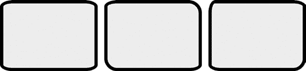

*图 9-5：通过`*border-radius*`简写属性生成的不规则圆角*

#### *使用百分比值*

本章中的示例使用了长度单位，但你也可以使用百分比值来定义`border-radius`，即它应用于元素一边的长度百分比。如果你想在 CSS 中制作一个完美的圆形，这将特别有用：一个具有四个相等曲率的正方形元素，每个曲率都是边长的一半，能创造一个完美的圆形元素。

下一个示例展示了两个元素，它们在每个角上都应用了相同的百分比`borderradius`值（50%）。这两个元素的高度相同，但一个的宽度是另一个的两倍：

```
div {
    border-radius: 50%;
    height: 100px;
    }
.ellipse { width: 200px; }
.circle { width: 100px; }
```

结果如图 9-6 所示。左边的元素长度较宽，因此角落的圆角形成了一个椭圆。右边的元素具有相等的高度和宽度，结果是一个完美的球形。

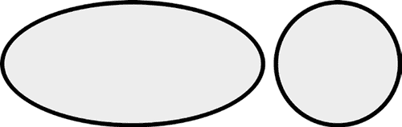

*图 9-6：在`*border-radius*`上使用百分比值生成椭圆（左）和圆形（右）。*

### 使用图像作为边框

另一种常见的元素样式化方法是使用背景图像作为装饰性边框。然而，在 CSS2 中，你无法实现这一点，你不得不使用大量额外的标记来实现期望的效果，导致语义和可维护性方面的损失。CSS3 引入了一系列属性，提供了一种简洁的语法来应用装饰性边框。

#### *border-image-source*

第一个属性`border-image-source`设置将用于边框的图像来源——不过你可能已经猜到了。它接受一个值，该值是图像数据类型；对于大多数浏览器，这个值通常是`url()`函数。以下是`border-image-source`的一个示例：

```
E { border-image-source: url('foo.png'); }
```

**注意**

*该属性还应该接受渐变函数（参见第十一章）作为值，但目前只有 Chrome 和 Firefox 支持这种用法。*

#### *border-image-slice*

一旦你确定了用于边框的图像来源，你就需要对其进行切片。`border-image-slice`属性接受一个到四个值，每个值对应元素的一个边，类似于`margin`、`padding`、`border-radius`等。这些值用于设置从图像每个边缘到“框住”元素的距离。

我知道这可能有点让人困惑，所以我会用一个示例来解释。看看这段代码：

```
E { border-image-slice: 34; }
```

注意，这里没有使用单位值。这个数字有两个用途：对于位图图像（如 JPG 或 PNG），单位是像素值；但对于矢量图像（如 SVG），它们是坐标值。你也可以使用百分比值作为替代。

在我的示例代码中，我只提供了一个单一的值，设置了我想要切割的区域：顶部、右侧、底部和左侧各 34px。请看图 9-7，它展示了这个值如何将源图像分成九个部分：四个角落（c1、c2 等），四个边（称为*切片*—slice1、slice2 等），以及中央的填充部分。每个切片将被放置到目标元素的边框上，位于相应的位置。

定义了源图像和切片之后，现在我只需要给元素设置一个边框来应用边框图像。图像将应用于边框所创建的区域，因此在下面的代码示例中，我定义了上下边框为 34px，左右边框为 10px。

```
E {
   border: 34px 10px;
   border-image-slice: 34;
   border-image-source: url('foo.png');
}
```

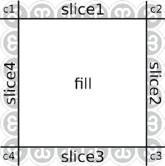

*图 9-7：在`*border-image*`中指定的值将如何切割图像*

你可以在图 9-8 中看到这段代码是如何应用的：上下的图像切片与上下边框的高度相同，因此图像按其自然高度应用，而左右切片则应用于宽度不到其一半的边框，因此图像会被压缩以适应。角落的切片则会扭曲以适应两个不同的尺寸。

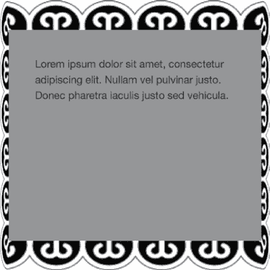

*图 9-8：这里，34px 的图像切片应用于 34px 宽、10px 高的边框。*

边框图像的默认行为是仅使用边框上的切片和角落，将元素的中心留空，显示其背景属性。`border-image-slice`属性有一个可选的关键字值`fill`，如果包含`fill`关键字，图像切片内的区域将应用于元素背景的适当位置。

```
E { border-image-slice: value fill; }
```

图 9-9 展示了一个带有边框图像的元素的比较，分别是带有和不带有`fill`关键字的情况。

**注意**

*使用`*border-image-slice*`填充元素意味着你无法控制填充的大小，可能会导致其被严重扭曲，因此在选择使用这种方式而不是`*background-image*`时，需要仔细考虑。*

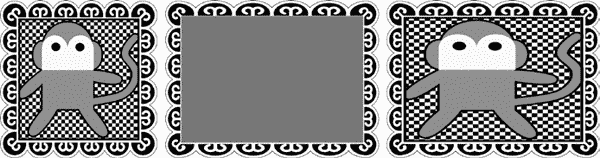

*图 9-9：从左到右：源图像，作为边框图像应用，及带有*`*fill*`*关键字值的效果*

#### *border-image-width*

正如你在图 9-8 中看到的，边框图像的切片会根据元素边框的宽度进行拉伸或压缩；例如，如果元素的边框宽度为 10px，但你的切片宽度为 40px，每个切片将被压缩到其高度或宽度的四分之一，以适应。你可以通过使用`border-image-width`属性来控制这一点：

```
E { border-image-width: value; }
```

像`border-width`或`border-image-slice`一样，这里的*值*实际上可以有最多四个值，以匹配元素的四个边，每个值可以是长度、百分比或无单位的数字。

`*value*`创建了一个“虚拟”边框，意思是它对页面布局或流动没有影响；与`border-width`不同，`*value*`创建的边框仅仅是视觉效果，对盒子模型没有影响。为了说明区别，请看这段代码：

```
E { border-width: 34px; }
F {
  border-width: 1px;
  border-image-width: 34px; }
E, F {
  border-image-slice: 34;
  border-image-source: url('foo.png'); }
```

你可以在图 9-10 中看到这个比较：左侧的元素每边有 34px 的边框，并且没有显式的`border-image-width`值，因此文本内容从边框内侧开始显示；然而右侧的元素只有 1px 的边框，但其`border-image-width`值为 34px。尽管图像片段的应用方式相同，右侧的文本内容却位于“虚拟”边框的顶部。

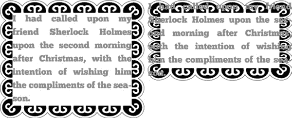

*图 9-10：比较`*border-width*`值为 34px（左）与`*border-image-width*`值为 34px（右）的情况*

如果你使用一个无单位的数字，它会作为现有`border-width`值的乘数；在以下代码中，`border-image-width`将等于 20px：

```
E {
  border-width: 10px;
  border-image-width: 2;
}
```

#### *border-image-outset*

默认情况下，边框图像从边框盒子的外侧开始显示，逐渐向内容盒子内部移动；但是你可以通过外扩图像，让它从边框盒子的外部开始。你可以使用`border-image-outset`属性来改变这种默认行为，它接受（现在通常使用的）四个可能的长度值，每个值对应边的一个方向。例如，要将边框图像从上下各外扩 10px，从左右各外扩 5px，你可以使用以下规则：

```
E { border-image-outset: 15px 30px; }
```

你可以在图 9-11 中看到这个比较；左侧的元素使用了默认的`border-image-outset`值 0，而右侧的元素使用了代码示例中显示的值；尽管它们的盒子大小相同，右侧的边框图像明显外扩，甚至覆盖了左侧的元素。

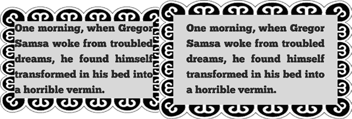

*图 9-11：右侧的元素有一个外扩的边框图像。*

#### *border-image-repeat*

另一个与边框图像相关的属性是：`border-image-repeat`。此属性控制图像如何适配每个边框的长度：

```
E { border-image-repeat: keyword; }
```

它接受三种关键字值中的一个：`stretch`（默认值）、`repeat`和`round`。本章迄今为止所有的示例插图都使用了默认值（`stretch`），即图像片段被拉伸以填满边框的长度。使用`repeat`时，图像片段按其自然长度进行应用，并重复直到填满所应用的边框的长度；因此，如果图像片段不能正好适配边框的长度，可能会被切掉。最后一个值`round`，表现得像`repeat`，只不过它会根据需要将图像片段缩放，以最适合边框的长度，而不会被切掉。

这比说起来更容易理解，所以你可以在图 9-12 中看到这三个值的不同。这三个元素应用了所有`border-image`属性相同的值，除了`border-image-repeat`。对于这个属性，第一个元素使用默认值`stretch`，第二个元素使用`repeat`，最后一个元素使用`round`。


*图 9-12：不同的* `*border-image-repeat*` *值：（从左到右）* `*stretch*`，`*repeat*`，`*round*`

我在前几段中提到过，`border-image-repeat`接受三种关键字值之一，但那并不完全准确；我只是为了让后续的解释更清晰才这么说的。希望你能原谅我误导了你。事实上，你可以在这个属性上使用三个关键字值中的两个；第一个控制水平重复，第二个控制垂直重复。所以，如果你希望在上下边框上拉伸元素，并在左右边框上使其圆角，你可以使用如下规则：

```
E { border-image-repeat: stretch round; }
```

#### *border-image 简写属性*

为了节省时间和减少键入，你可以使用`border-image`简写来设置前面描述的所有属性。语法如下所示：

```
E { border-image: source slice / width / outset repeat; }
```

以下代码示例展示了所有单独的属性应用于一个元素的效果，然后使用简写属性将相同的属性应用于另一个元素：

```
E {
  border-image-source: url('foo.png');
  border-image-slice: 25 10 fill;
  border-image-width: 25px 10px;
  border-image-outset: 5px;
  border-image-repeat: round; }
F { border-image: url('foo.png') 25 10 fill / 25px 10px / 5px round; }
```

这样可以节省不少空间。

#### *浏览器支持*

本节中的所有`border-image`属性在 Chrome、Firefox、Safari 6+和 Internet Explorer 11+中都得到支持。一些较老的浏览器——特别是移动版 Safari 5.1 及以下版本，以及 Android 4.3 及以下版本的默认浏览器——支持边框图像，但仅支持使用`border-image`简写，并且在这种情况下，`border-image-width`和`border-image-outset`属性不被支持。

### 投影阴影

在第六章中，我们探讨了使用`text-shadow`属性为文本添加投影阴影的方法，但 CSS3 也有一种为盒子元素添加阴影的方法。你可以使用`box-shadow`属性；其语法与`text-shadow`类似：

```
E { box-shadow: inset horizontal vertical blur-radius spread color; }
```

第一个值，`inset`，是一个可选的关键字，用于设置阴影是在元素内部还是外部。我会在下一节中更详细地解释这个概念；目前你只需要知道，如果没有指定`inset`，阴影将位于元素的外部。接下来的两个值，与`text-shadow`一样，是设置阴影相对于盒子在`*水平*`和`*垂直*`方向上的距离；如果你希望有阴影，这些值是必需的。

下一个值设置`*模糊半径*`，它是另一个长度值，同样，和`text-shadow`的作用完全相同。接下来是`*扩展*`，它是另一个长度值，用于设置阴影的扩展距离。正的长度使阴影比元素本身更大，而负的长度则使阴影更小。`*模糊半径*`和`*扩展*`都是可选的。

最后，你有`*color*`值，这也是可选的，如果未指定，则默认继承颜色（通常为黑色）。

现在，我将通过一个示例将这些内容结合起来。接下来的代码片段创建了一个深灰色的阴影，位于元素的外部，水平和垂直距离为 4px，模糊半径为 3px：

```
div { box-shadow: 4px 4px 3px #666; }
```

在下一个代码片段中，我将演示不同值对`box-shadow`属性的进一步影响。效果显示在图 9-13 中。

```
.shadow-one { box-shadow: 4px 4px; }
.shadow-two { box-shadow: 4px 4px 3px; }
.shadow-three { box-shadow: 12px 12px 2px -6px; }
.shadow-four { box-shadow: #999 4px -4px 2px 0; }
.shadow-five { box-shadow:
    #999 4px -4px 2px 0,
    -4px 4px 2px;
}
```

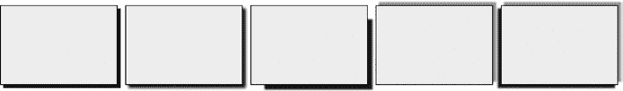

*图 9-13：使用不同的`*box-shadow*`属性值的效果*

代码中的元素对应于图 9-13 中的框，按从左到右的顺序排列。第一个是最简单的阴影，距离元素水平和垂直 4px，使用继承的颜色。第二个与第一个的距离值相同，但还添加了 3px 的模糊半径，以柔化阴影的边缘。第三个的水平和垂直距离为 12px，但具有负的扩展值（-6px），使得阴影比框体小。第四个示例具有中等灰色的阴影，并且垂直距离为负值，这意味着阴影出现在元素的上方，而不是下方。

第五个框应用了两个阴影，每组值用逗号分隔。第一组值与第四个框相同，第二组值创建了一个黑色（或继承的颜色）阴影，水平距离为负值，导致阴影出现在框的左侧。

### 内凹阴影

我在前一节开始时简要提到了可选的`inset`关键字。如果存在该关键字，它会在框的内部绘制阴影，但它也会产生“翻转”阴影到框的另一侧的效果。我的意思是，常规的—即 *外部*—阴影，具有正的 *x* 和 *y* 值时，会出现在框的右下角，而内凹阴影则会出现在框的左上角。

为了说明这一点，我将使用与之前示例相同的代码，但在每个例子中都添加`inset`关键字：

```
.shadow-one { box-shadow: inset 4px 4px; }
.shadow-two { box-shadow: inset 4px 4px 3px; }
.shadow-three { box-shadow: inset 12px 12px 2px -6px; }
.shadow-four { box-shadow: inset #999 4px -4px 2px 0; }
.shadow-five { box-shadow:
    inset #999 4px -4px 2px 0,
    inset -4px 4px 2px;
}
```

结果显示在图 9-14 中，正如你所看到的，它几乎是图 9-13 的反向效果；所有的偏移、模糊半径和颜色值都相同，但阴影现在出现在框的内部，并且位于相反的角落。

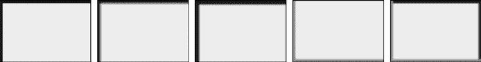

*图 9-14：内凹阴影*

`box-shadow`属性得到了广泛实现，在 IE9+ 及所有其他现代浏览器中无需前缀支持。旧版本的 iOS Safari 和 Android 默认浏览器需要使用`-webkit-`前缀。

### 总结

我在前一章的开头提到，背景和边框模块之所以成为 W3C 的优先事项，是因为网页开发者的强烈呼声。它引入的新属性对于移除仅用于视觉样式的容器元素非常有用，这些容器元素通常在标记中多余，给开发者提供了更精细的页面呈现控制。随着我们可以使用许多新的背景和边框属性，创建能够在多种尺寸和分辨率下查看的网站将变得更加容易，我们的网站也将更加符合跨平台的理想。

在下一章中，我将继续讲解页面装饰主题，重点介绍 CSS3 提供的新颜色和透明度控制。

### 边框和盒子效果：浏览器支持

|  | **Chrome** | **Firefox** | **Safari** | **IE** |
| --- | --- | --- | --- | --- |
| `border-radius` | 是 | 是 | 是 | 是 |
| `border-image` | 是 | 是 | 是 | IE11 |
| `box-shadow` | 是 | 是 | 是 | 是 |
