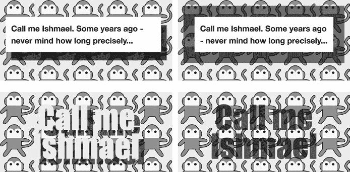

## 第十章：10

**颜色与不透明度**


在 CSS2 中，颜色基于*红色*、*绿色*、*蓝色（RGB）*模型；无论你使用的是十六进制值还是`rgb()`函数值，都需要将这三种颜色混合在一起为页面添加颜色。当然，设计师通常使用色调和色泽的术语：当设计师说要使用某种颜色的“50%色泽”时，开发人员必须使用 RGB 模型来匹配该颜色，这通常涉及到使用图形软件来精确找到所需的色调。

CSS 色彩模块 (*[`www.w3.org/TR/css3-color/`](http://www.w3.org/TR/css3-color/))* 提供了解决这一问题的方法——还有更多的解决方案。首先，它通过`opacity`属性和*Alpha*颜色通道引入了*不透明度*的概念。此外，CSS 色彩模块还添加了一个全新的颜色模型，这个模型更加直观，也更容易调整以找到完美的色调。

色彩模块是 W3C 的推荐标准，并在 IE9 及以上版本以及其他主流浏览器中得到了很好的实现，因此，通过一些小心的编码为旧版 IE 提供备用方案，你可以立即开始使用其属性和值。

### 不透明度属性

严格来说，不透明度是衡量物体对光的阻力——物体越不透明，它透过的光就越少。没有不透明度的物体是完全透明的。

在 CSS 中，不透明度是通过`opacity`属性来测量的。实际上，使用`opacity`时，你设置的是指定元素中可以透过背景看到多少内容。`opacity`属性的语法如下：

```
E { opacity: number; }
```

`*number*`值是一个十进制小数——即一个介于 0.0 和 1.0 之间的数字，0.0 表示完全透明，1.0 表示完全不透明，介于这两者之间的任何值则表示不透明度和透明度的混合。例如，要将一个元素设置为 50%不透明（或者说 50%透明，取决于你的玻璃是半空还是半满），你可以使用以下规则：

```
E { opacity: 0.5; }
```

为了进一步演示，我将展示一组元素——一个父`div`，里面有一个子`div`，而该子`div`里又有一个子`p`——重复三次：

```
<div class="parent">
    <div class="child">
        <p>…</p>
    </div>
</div>
```

我将对每组元素应用相同的规则，唯一的变化是`opacity`值的不同。以下是本示例的相关规则：

```
.parent { background-color: black; }
.child { background-color: white; }
.child.semi-opaque-1 { opacity: 0.66; }
.child.semi-opaque-2 { opacity: 0.33; }
```

你可以在图 10-1 中查看输出。第一个（左侧）`.child`元素没有显式设置`opacity`值，因此默认值为 1.0，即完全不透明——它的背景是白色。接下来（中间）的`.child`设置了`0.66`，因此其不透明度减少了三分之一，导致白色背景看起来像浅灰色（这是父元素的黑色背景色和元素本身的白色背景色的混合，透过了元素的透明部分）。最后一个（右侧）的`.child`设置了`opacity`值为`0.33`，因此可以认为它是三分之二透明的，使得盒子的颜色变得更暗。


*图 10-1：不同`*opacity*`值对三个相同元素的影响*

现在，这里有一点非常重要的内容需要记住：不透明度不仅会影响应用该属性的元素，还会影响该元素的所有子元素。如果我为一个元素设置了`opacity`值为 0.5，那么它的子元素的透明度永远不能比它更不透明。这个设置无法通过其他属性覆盖——换句话说，你永远无法让子元素比父元素更不透明，但你*可以*让它更透明。

这可能会让`opacity`属性看起来有些有限，因为你不能单独应用它于有子元素的元素而不影响它们的子元素。然而，CSS3 提供了一种新的方法来解决这个限制，它叫做 Alpha 通道，我将在下一节中进行解释。

### 新的和扩展的颜色值

CSS2.1 允许通过三种方法指定颜色值：关键字（`black`）、十六进制表示法（`#000000`）和 RGB（`0`,`0`,`0`）。在 CSS3 中，新增了一种完全不同的颜色指定方法（参见“色相、饱和度、亮度”在第 116 页），并通过 Alpha 通道引入了不透明度。

#### *Alpha 通道*

*Alpha 通道*（简称*Alpha*）是颜色的不透明度度量——与`opacity`属性不同，后者是元素的不透明度度量。所以，尽管使用 Alpha 的颜色值可以像任何其他颜色值一样被子元素继承，元素的整体不透明度不会受到影响。

CSS3 将 Alpha 作为*RGBA*颜色模型中的一个值引入。RGBA 代表*红色*、*绿色*、*蓝色*、*Alpha*，并通过`rgba()`函数应用。语法与 CSS2 中使用的`rgb()`函数值相同，但 Alpha 值是通过末尾的额外逗号分隔的参数指定的：

```
E { color: rgba(red, green, blue, alpha); }
```

`*alpha*`参数的值与`opacity`提供的值相同：一个从 0.0 到 1.0 的十进制分数，再次表示从完全透明（0.0）到完全不透明（1.0）之间的度量。如果你想让元素的前景色为黑色，且不透明度为 50%，你可以使用以下代码：

```
E { color: rgba(0,0,0,0.5); }
```

如前所述，`rgba()`与`opacity`属性有两个不同之处：首先，`rgba()`是一个颜色值，因此你不能例如用它来改变图像（或带有背景图像的元素）的透明度。其次，尽管`rgba()`函数的值可以被继承，子元素可以通过自己的`rgba()`值覆盖它。

为了更精确地说明这两者之间的区别，我将使用以下标记创建两个相同的代码块：

```
<div class="box">
    <div class="text">
        <h1>…</h1>
    </div>
</div>
```

我将对这个标记应用以下 CSS 规则：这两个元素将会获得相同的规则，唯一的区别是我会为其中一个设置`opacity`，并为另一个的`background-color`设置`rgba()`值，两个值的十进制分数都是`0.5`：

```
.box { background-image: url('monkey.svg'); }
.text { background-color: white; }
.opacity { opacity: 0.5; }
.rgba { background-color: rgba(255,255,255,0.5); }
```

结果显示在图 10-2 中，差异非常明显。两个框的透明度相同，但在第一个框中，`opacity` 值已经被子元素 `p` 继承，这也使得文本变得半透明。在第二个框中，`rgba()` 值严格应用于 `.text` 元素的 `background-color`，因此 `p` 元素保持完全不透明的黑色 `color`。


*图 10-2：比较透明度（左）和 RGBA（右）*

确定 `rgba()` 不等于 `opacity` 后，让我们来看看它是如何工作的。作为一种颜色值，它显然可以用于背景、边框、阴影等。以下代码展示了 `rgba` 应用于不同属性的示例：

```
➊ .shadow .text { box-shadow: 10px 10px 4px rgba(0,0,0,0.7); }
➋ .border .text { border: 10px solid rgba(0,0,0,0.5); }
➌ .text-semi p { color: rgba(0,0,0,0.6); }
➍ .text-shadow p { text-shadow: 5px 5px 1px rgba(0,0,0,0.6); }
```

图 10-3 展示了这些属性的实际效果。从左上角顺时针移动，在第一个框中，`rgba` 降低了 `box-shadow` 的不透明度；将 Alpha 值设置为 `0.7` ➊ 使得部分背景透过阴影显示出来，使阴影看起来更加“真实”。下一个示例展示了一个 50% 不透明的黑色 `border` ➋（这是我在图 8-6 中使用的示例，见第 93 页）。接下来的示例中，`color` 属性的 Alpha 值被设置为 `0.6` ➌，这使得文本看起来半透明。最后一个示例展示了另一个阴影效果，这次应用于 `text-shadow` 属性。Alpha 值设置为 `0.6` ➍，同样使得阴影更加真实。



*图 10-3：RGBA 应用于不同属性*

##### RGBA 和优雅降级

不支持 RGBA 值的旧版浏览器（尤其是 IE8）会忽略使用这些值的规则，并回退到之前指定或继承的值。为了解决这个问题，你应该将颜色指定两次——首先指定没有 Alpha 值的颜色，然后指定带有 Alpha 值的颜色——利用层叠规则确保正确的颜色被实现：

```
p {
    color: #F00;
    color: rgba(255,0,0,0.75);
}
```

在这个例子中，不支持 RGBA 值的浏览器会忽略第二个 `color` 属性，并应用第一个 `color` 属性。当然，这意味着会使用一个完全不透明的颜色，而不是半透明的颜色，因此要彻底检查你的设计，确保它不会受到负面影响。

其余章节中引入的所有新颜色值也适用相同的原则。

#### *色相、饱和度、亮度*

我在本章早些时候提到过，CSS3 引入了一种新的颜色表示法系统，这种系统被称为 HSL。准确总结 HSL 是什么而不提供一门颜色理论课程是很困难的，但我会尽力解释：*HSL*——代表*色相*（Hue）、*饱和度*（Saturation）、*亮度*（Lightness， 有时称为 *明度*）——是一种颜色空间的圆柱坐标表示法。如果还是不清楚的话，可以看看图 10-4。


*图 10-4：HSL 颜色表示法 ^(1)*

所有可能的颜色都被排列在一个有中心轴的圆柱体中。轴周围的角度表示*色相*；从轴的距离表示*饱和度*；沿轴的距离表示*亮度*。这三者的组合创造了独特的颜色。

*色相*代表主要颜色，从红色（0 或 360）开始和结束，并包括之间的所有主要颜色。可以将你在学校学习过的可见光谱的颜色（或彩虹的颜色）想象成排列在圆周上——红色、橙色、黄色、绿色、蓝色、靛蓝色和紫色——色相值就是指向特定颜色的圆周上的角度。

*饱和度*是颜色的强度或浓度：0%代表没有强度，使颜色呈灰色，而 100%是完全强度，即该颜色最强烈的版本。

*亮度*是颜色的明暗程度：50%是原色，0%是黑色，100%是白色。

如果你以前没有接触过 HSL，而我的解释仍然让你感到困惑，不要担心——对于我们的用途，你只需要理解 HSL 是通过`hsl()`颜色值函数应用的。它接受三个参数，语法类似于`rgb()`：

```
E { color: hsl(hue,saturation,lightness); }
```

`*色相*`值是一个介于 0 和 360 之间的数字（代表色轮上的角度），而`*饱和度*`和`*亮度*`则接受从 0%到 100%之间的值。以下是一些简单的颜色示例及其十六进制和 RGB 等效值，见表 10-1。

**表 10-1**：四种颜色值的常见等效色

| **HSL** | **RGB** | **十六进制** | **关键词** |
| --- | --- | --- | --- |
| 0,0%,0% | 0,0,0 | #000000 | `黑色` |
| 360,0%,100% | 255,255,255 | #FFFFFF | `白色` |
| 0,100%,50% | 255,0,0 | #FF0000 | `红色` |
| 120,100%,25% | 0,128,0 | #008000 | `绿色` |
| 240,100%,50% | 0,0,255 | #0000FF | `蓝色` |

**注意**

*即使你使用的是饱和度和亮度值为 0（零）的情况，你仍然需要将该值指定为百分比。*

表 10-1 实际上并没有讲述完整的故事——例如，许多不同的值组合可以让你创造纯白色。实际上，了解更多关于 HSL 的最佳方式是使用一个支持 HSL 的颜色选择器，并玩一玩。Photoshop 和大多数其他图形软件都有 HSL 颜色选择器，你也应该能在线找到颜色转换工具。然而，注意不要将 HSL 与*色相、饱和度、明度（HSV）*混淆——虽然它们使用相同的语法，但颜色值的映射方式不同，因此你不会得到相同的结果。

HSL 相比 RGB（或十六进制）的优势在于，它允许你更快速地尝试不同的颜色变体，例如让某种颜色变浅/变暗或更/更少强烈。HSL 的灵活性使它对网页设计师更为有用。然而，如果你是从他人的设计中进行开发，你可能仍然希望继续使用 RGB。HSL 仅仅是一个可以考虑的新选项。

#### *HSLA*

如果你已经决定 HSL 是适合你的颜色方法，那么你也可以使用 `hsla()` 颜色值函数来利用 Alpha 通道实现透明度。和它的对应函数 `rgba()` 一样，`hsla()` 只是通过在函数中添加一个额外的参数来扩展颜色方案：

```
E { color: hsl(hue,saturation,lightness,alpha); }
```

所以，例如，如果你想要一个颜色值为红色并且具有 50% 不透明度的元素，你可以使用以下规则：

```
E { color: hsl(0,100%,50%,0.5); }
```

#### *颜色变量：currentColor*

除了我刚才描述的新的颜色方法外，CSS3 还引入了一个新的 `color` 值关键字：`currentColor`。这个关键字作为当前颜色的变量：一个元素的 `currentColor` 值就是它自己的 `color` 属性的值。所以，当一个元素的 `color` 值是例如 `red` 时，它的 `currentColor` 值也是 `red`。你可以利用这一点，在不同的属性上设置颜色值，而无需再次指定 `red`。

以下示例应该能阐明 `currentColor` 的有用性。首先，我使用以下的标记：

```
<h2>The Central Intelligence Agency (<abbr>CIA</abbr>). </h2>
<h2 class="ccolor">The Federal Bureau of Investigation (<abbr>FBI</abbr>)</h2>
```

然后我为它应用这个 CSS：

```
h2 { color: black; }
.ccolor {
    background-color: black;
    color: white;
}
h2 abbr { border-bottom: 6px double currentColor; }
```

一个 `h2` 元素在默认（`white`）背景上显示黑色（`black`）文本，另一个则在黑色（`black`）背景上显示白色（`white`）文本。接下来，我使用 `currentColor` 关键字作为 `abbr` 元素的 `border-bottom` 属性的值。你可以在图 10-5 中看到结果。


*图 10-5：`*currentColor*` 颜色值关键字的演示*

因为第一个 `h2` 元素的 `color` 值是 `black`，所以 `abbr` 元素的 `border-bottom` 属性颜色也是 `black`。因为第二个 `h2` 元素的 `color` 值是 `white`，所以 `abbr` 元素的 `border-bottom` 属性也具有相同的颜色。这些值已经继承了它们父元素的 `color` 属性。

`currentColor` 关键字意味着我不需要为每个 `abbr` 元素实例指定边框颜色。在这个示例中，我不需要使用额外的规则——如果没有它，我必须像这样使用：

```
h2 abbr { border-bottom: 6px double black; }
.ccolor abbr { border-bottom-color: white; }
```

虽然这看起来可能不算是一个大节省，但 `currentColor` 的引入意味着我可以更新父元素的颜色，而不必担心为任何相关的子元素设置颜色。在一个拥有许多不同颜色组合的大型网站上，你可以看到 `currentColor` 将会非常方便。

### 概述

`opacity` 属性和 Alpha 通道的引入对 CSS3 来说可能看似微不足道，但透明度为页面设计带来了显著的变化；重叠的颜色长期以来是印刷设计的常见元素，但由于实现难度大，这种风格从未真正进入网页设计领域。

尽管 HSL 色彩模型并不会影响访客浏览网站的体验，但它使得你作为作者，在设计过程中能更轻松地进行色彩实验。

在下一章中，我将通过探讨渐变背景，完成关于元素装饰的四部曲。

### 颜色与透明度：浏览器支持

|  | **Chrome** | **Firefox** | **Safari** | **IE** |
| --- | --- | --- | --- | --- |
| `opacity` | 是 | 是 | 是 | 是 |
| RGBA 值 | 是 | 是 | 是 | 是 |
| HSL 值 | 是 | 是 | 是 | 是 |
| HSLA 值 | 是 | 是 | 是 | 是 |
| `currentColor` 值 | 是 | 是 | 是 | 是 |
