## 11

**渐变**


在本章中，作为关于装饰属性四部曲的最后一章，我将介绍 CSS 渐变。在这个上下文中，*渐变*是指两种或更多颜色之间的逐渐过渡——这是多年来的设计标准，虽然你可能认为它在 CSS 中实现会比较简单，但它在 Web 上的历史却长且曲折。

CSS 渐变首次在 2008 年由 WebKit 引入，并出现在 Safari 4 中。然而，它们使用的语法与本章其余部分展示的完全不同，并且被其他浏览器供应商认为过于复杂。接下来几年中提出了多种其他建议（并且甚至得到了实现），直到 2011 年底最终达成了一种语法。这种最终的语法被所有浏览器迅速采纳，并且就是我将在本章中介绍的语法。（请阅读 “浏览器支持与遗留语法” 在 第 131 页了解如何在遗留浏览器中支持旧版本。）

**警告** *图形效果如渐变可能会对计算资源产生较大负担，尤其在移动浏览器中，会降低页面的渲染速度和性能。这并不是说你应该避免使用渐变，而是要在构建网站时，始终在性能和外观之间进行权衡。*

### 线性渐变

*线性渐变*是指在连接两点的直线的长度上，颜色逐渐过渡的渐变。在最简单的情况下，线性渐变在整条线的长度上按比例地从两种颜色之间过渡。

我将从展示线性渐变的最简语法开始，线性渐变通过在`background-image`属性中使用`linear-gradient()`值函数来定义：

```
E { background-image: linear-gradient(black, white); }
```

图 11-1 显示了结果。

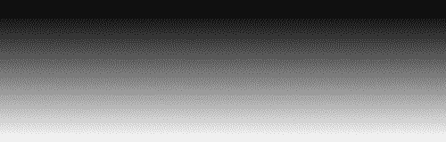

*图 11-1：一个简单的上下两色线性渐变*

每个你希望渐变经过的颜色被称为*color-stop*，并以逗号分隔的参数列表形式传递给函数。如你所见，渐变至少需要两个 color-stop：一个开始色和一个结束色。在这个例子中，渐变从黑色开始，到白色结束，逐渐经过两个值之间的所有中间色调。

#### *设置渐变方向*

第一个和最后一个 color-stop 之间的轴线被称为*渐变线*。在前面的例子中，渐变线从盒子的顶部开始，垂直向下延伸。这是默认的方向。要设置不同的渐变线，可以在颜色停止列表之前，通过传递一个新的参数来指定盒子的目标边或角。这个参数是一个包含关键词的字符串，关键词以`to`开头，后跟一个或两个方向关键词。例如，要定义一个从下到上的黑白渐变，可以使用以下值：

```
E { background-image: linear-gradient(to top, black, white); }
```

要将相同的渐变改为从左上角到右下角对角线的方向，你需要使用两个方向关键词：

```
E { background-image: linear-gradient(to right bottom, black, white); }
```

若要更精细地控制渐变线的方向，可以使用角度参数代替方向关键词。角度可以使用多种单位进行声明——在本章中，我将坚持使用度数（`deg`），因为它是最常见的单位，但有关其他单位的更多信息，请参见第 124 页的“角度单位”部分。

角度值设置渐变线的角度：`0deg`（或`360deg`）从下到上，`45deg`从左下到右上，`90deg`从左到右，依此类推。负值使渐变逆时针方向：`-45deg`与`315deg`相同，`-315deg`与`45deg`相同，依此类推。你明白了。

例如，要创建与前一个代码示例中相同的从左上到右下的渐变，但使用角度值，你可以使用以下代码：

```
E { background-image: linear-gradient(135deg, black, white); }
```

下一个代码片段展示了三个不同方向值的效果示例：第一个从右到左，第二个从左下到右上，最后一个是 120 度的角度（大致，虽然不完全是，从左上到右下）。

```
E { background-image: linear-gradient(to left, black, white); }
E { background-image: linear-gradient(to top right, black, white); }
E { background-image: linear-gradient(120deg, black, white); }
```

图 11-2 展示了结果。


*图 11-2：三个不同的方向值：从左到右，从左下到右上，以及 120 度*

#### *添加额外的颜色停止值*

到目前为止，我使用的是一个简单的渐变，只有两个颜色停止值，但你可以使用更多的颜色停止值。（因为本书是黑白印刷的，所以我只能选择有限的色板！）每个添加的颜色都通过在逗号分隔的列表中添加一个新的颜色停止值来声明，正如这个示例中，我添加了第三个黑色停止值：

```
E { background-image: linear-gradient(black, white, black); }
```

**角度单位**

一种用于表示角度测量的角度单位在 CSS3 值和单位模块中定义（*[`www.w3.org/TR/css3-values/#angle/`](http://www.w3.org/TR/css3-values/#angle/)*）。我们大多数人在学校学到的单位是度数（`deg`），其中一整圈有 360 度，这也是我在本章中使用的单位。其他单位之一是梯度（`grad`），其测量范围是以圆周一圈为 400 梯度为标准。另一个是弧度（`rad`），其基于 π（pi），一整圈是 2π 弧度，约为 6.2832rad。还有一个单位是`turn`，表示一整圈等于 1 圈，尽管截至本文写作时，只有 Firefox 和 Internet Explorer 9+ 支持此单位。

表 11-1 显示了不同角度单位的一些等效值。

**表 11-1：** 角度值的等效单位

| **度数** | **梯度** | **弧度** | **圈数** |
| --- | --- | --- | --- |
| 60 | 66.66667 | 1.04720 | 0.16667 |
| 90 | 100 | 1.5708 | 0.25 |
| 240 | 266.66667 | 4.18879 | 0.66667 |

如你所见，度数通常提供最简洁且最熟悉的值，因此，除非你在进行某些非常特定的数学计算，如微积分，否则通常会使用度数。

颜色停顿点会按照列出的顺序处理，因此这个示例创建了一个从黑色到白色再回到黑色的渐变。图 11-3 展示了结果。

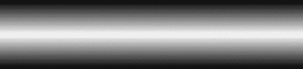

*图 11-3：一个包含三个颜色停顿点的渐变*

颜色停顿点沿渐变的长度均匀分布，因此，在这种情况下，白色的颜色停顿点正好位于两个黑色停顿点之间，即渐变的中间位置。你可以通过在每个颜色停顿点后添加长度或百分比值，来调整颜色停顿点在渐变线上的位置。例如，以下代码将白色颜色停顿点放置在渐变线的 75% 位置：

```
E { background-image: linear-gradient(black, white 75%, black); }
```

图 11-4 展示了结果。与图 11-3 中未定义位置的情况相比，你会看到白色的颜色停顿点已经沿渐变线向元素底部进一步移动。

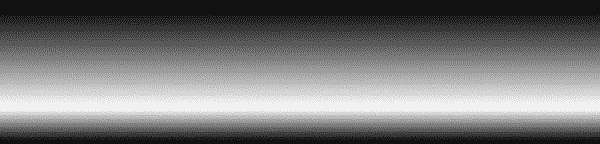

*图 11-4：第二个颜色停顿点出现在渐变长度的四分之三（或 75%）处。*

你不仅可以在颜色停顿点上使用百分比值，也可以使用长度值。接下来的代码片段展示了三种使用长度和百分比值的方法，结果见图 11-5。我将在代码之后逐一讲解。

```
➊ div { background-image: linear-gradient(to right, black, white 75%); }
➋ div { background-image: linear-gradient(to right, black 50%, white); }
➌ div { background-image: linear-gradient(to right, black, white 50%, black 1px); }
```


*图 11-5：在颜色停顿点中使用不同的定位值*

在➊中，最后一个颜色停顿点的参数位置为 75%，因此该颜色停顿点从该位置开始，并继续以纯色直到结束。在➋中，第一个颜色停顿点具有位置值，因此继承的颜色（黑色）会显示为一个固态块，直到渐变线的 50%位置，届时渐变将过渡到最终的颜色停顿点值。

最后，➌包含三个颜色停顿点。第二个颜色停顿点从 50%位置开始，因此第一个和第二个颜色停顿点会过渡到该位置。最后的颜色停顿点则仅比前一个停顿点沿渐变线多出一个像素，因此该颜色会突然切换（没有过渡），并继续到达渐变的终点。

#### *重复线性渐变*

与其仅创建一个从元素一侧到另一侧的渐变，你还可以使用`repeating-linear-gradient()`函数，重复相同的渐变，直到填满整个元素。该函数接受与`linear-gradient`相同的基本值集，不同之处在于，最后一个颜色停顿点需要指定一个长度或百分比值。下面是一个示例：

```
E { background-image: repeating-linear-gradient(white, black 25%); }
```

最后的颜色停靠点值设置了渐变结束的点，并从该点开始重复。此代码创建了一个上下渐变（默认）在白色和黑色之间，覆盖了框体高度的 25%，意味着它重复了四次，如图 11-6 所示。

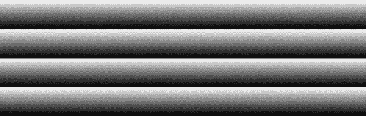

*图 11-6：从白到黑的重复渐变*

接下来的代码示例使用了不同的值；图 11-7 展示了结果，我会在你查看完代码后逐一解释每个。

```
➊ .gradient-1 {
      background-image: repeating-linear-gradient(to left, black, white, black 25%);
  }
➋ .gradient-2 {
      background-image: repeating-linear-gradient(45deg, black, white 2px, black 10px);
  }
➌ .gradient-3 {
      background-image: repeating-linear-gradient(315deg, black, black 2px, white 2px, white 4px);
  }
```

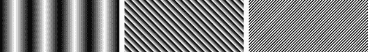

*图 11-7：不同的重复线性渐变*

• 第一个示例（➊）使用了三个颜色停靠点并设置了方向，使渐变从右向左。渐变覆盖了元素的 25%，因此黑白黑的模式重复了四次。

• 第二个示例（➋）使用了`45deg`的角度值，使渐变呈对角线方向，并且颜色停靠点使用了像素单位。同样，渐变为黑白黑，但它们的不均匀分布使得黑白部分覆盖 2px，而白黑部分覆盖 8px。

• 最后的示例（➌）使用了四个颜色停靠点：黑色-黑色覆盖 2px，然后白色-白色覆盖 2px。较小的长度值阻止了两种颜色之间的渐变过渡，形成了你在这里看到的硬直线。

### 径向渐变

*径向渐变*是颜色之间的渐变过渡，它从中心点向所有方向扩展。最简单的径向渐变在圆形或椭圆形状中逐渐改变两种颜色。径向渐变通过`radial-gradient()`值函数来定义，和线性渐变一样，创建径向渐变的最简单方法是将两个颜色值作为参数传递：

```
E { background-image: radial-gradient(white, black); }
```

结果是一个简单的双色白黑渐变，呈椭圆形，延伸至其父元素的最远角落，如图 11-8 所示。

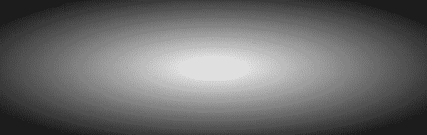

*图 11-8：一个简单的双色径向渐变*

#### *使用径向渐变*

你可以通过在颜色停靠点前添加一个关键字来设置径向渐变的形状。默认值是`ellipse`，但你可以像这样使用替代的`circle`：

```
E { background-image: radial-gradient(circle, white, black); }
```

如图 11-9 所示的结果比图 11-8 更接近圆形，尽管缺乏清晰定义的边缘。（你将很快学到如何设置径向渐变的范围。）

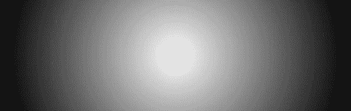

*图 11-9：一个圆形的径向渐变*

放射性渐变的默认中心（渐变的辐射起点）位于应用该渐变的元素的中心。你可以通过向 `radial-gradient()` 函数添加位置参数来改变这个点。用于设置该位置的值与 `background-position` 中使用的完全相同——即长度、百分比或关键字。位置参数加在形状关键字（这里示例中是 `circle`）后面，前面加上 `at` 关键字。位置设置为元素的右中心：

```
E { background-image: radial-gradient(circle at 100% 50%, white, black); }
```

你还可以设置渐变的*范围*——即渐变结束的点——使用长度或位置值，或者四个范围关键字之一。范围参数紧跟在形状关键字后面。例如，这段代码创建了一个圆形渐变，范围为 50px，意味着它在距中心点 50px 处结束：

```
E { background-image: radial-gradient(circle 50px, black, white); }
```

设置范围时可以使用的四个关键字是 `closest-corner`、`closest-side`、`farthest-corner`（默认）和 `farthest-side`。下一个示例展示了这些关键字之间的差异，每一行的结果都显示在图 11-10 中。我将依次讨论每条规则。

```
➊ .ext1 { background-image: radial-gradient(closest-corner circle at 10% 60%, white, black); }
➋ .ext2 { background-image: radial-gradient(closest-side circle at 10% 60%, white, black); }
➌ .ext3 { background-image: radial-gradient(farthest-corner circle at 0% 100%, white, black,
  white, black); }
➍ .ext4 { background-image: radial-gradient(farthest-side circle at 0% 100%, white, black,
  white, black); }
```

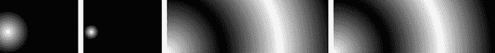

*图 11-10：比较放射性渐变的范围关键字*

所有四个渐变都产生相同的圆形效果。在示例 ➊ 和 ➋ 中，两个渐变具有相同的中心位置和颜色停止值，但 ➊ 的范围通过 `closest-corner` 关键字设置，使渐变的范围是最靠近的角落（左下角），而 ➋ 的范围是最靠近的边（左边，通过 `closest-side` 设置），因此第二个圆要比第一个小得多。

示例 ➌ 和 ➍ 中的渐变具有相同的中心位置（元素的左下角），每个都有四个颜色停止值（交替的黑白）。示例 ➌ 的范围是最远的角落（右上角，通过 `farthest-corner` 设置），而示例 ➍ 的范围是最远的边（右边，你现在可能已经猜到，它是通过 `farthest-side` 设置的）。虽然差别微妙，但你应该能看出，➍ 的范围比 ➌ 更为有限。

#### *使用多个颜色停止值*

与线性渐变一样，放射性渐变也可以接受多个颜色停止值以及用于定位控制的长度或百分比值。这些限定符以逗号分隔的列表形式输入。以下示例中的四个示例展示了一些有趣的变化。图 11-11 展示了每一行的结果。

```
➊ .gradient-1 { background-image: radial-gradient(farthest-side circle, black, white, black); }
➋ .gradient-2 { background-image: radial-gradient(farthest-side circle, black, white 25%,
  Because gradients are applied wiblack); }
➌ .gradient-3 { background-image: radial-gradient(farthest-side circle at left, white,
  black 25%, white 75%, black); }
➍ .gradient-4 { background-image: radial-gradient(circle closest-side circle at 40% 50%,
  white, white 25%, black 50%, white 75%, black); }
```


*图 11-11：不同颜色停止值的放射性渐变*

在示例 ➊ 中，我创建了一个包含三个颜色停止值（黑白黑）的渐变，它从盒子的中心辐射到最远的边。示例 ➋ 与之相似，不同之处在于颜色停止值从半径长度的 25% 处开始。

在 ➌ 示例中，渐变从框的左侧开始，到右侧结束，颜色停靠点分别位于长度的 25% 和 75%。在 ➍ 示例中使用了五种颜色，但通过将第一个和第二个颜色停靠点设置为相同颜色，我在中心创建了一个实心白色圆圈。

#### *重复径向渐变*

就像 `linear-gradient()` 函数有 `repeating-linear-gradient()` 一样，`repeating-radial-gradient()` 可以用于重复给定的参数，直到最终颜色停靠点所指定的限制为止。例如，以下代码创建了一个圆形渐变，每 20% 重复一次黑色-白色，直到达到其范围。结果显示在图 11-12 中。

```
E { background-image: repeating-radial-gradient(circle, black, white 20%); }
```

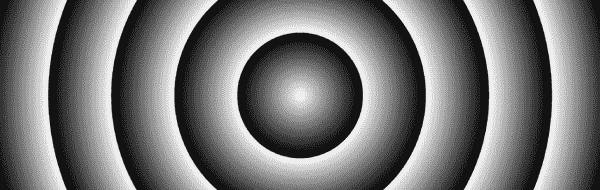

*图 11-12：一个重复的径向渐变*

如需更多关于如何使用重复径向渐变的示范，请查看下一段代码。结果显示在图 11-13 中。

```
➊ .gradient-1 { background-image: repeating-radial-gradient(circle farthest-corner at right top,
  black, white 10%, black 15%); }
➋ .gradient-2 { background-image: repeating-radial-gradient(circle farthest-corner at left,
  white, white 10px, black 15px); }
➌ .gradient-3 { background-image: repeating-radial-gradient(circle farthest-corner, white,
  black 1px, white 2px); }
```

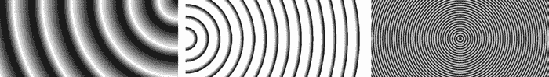

*图 11-13：使用重复径向渐变创建的图案*

➊ 示例从右上角发散，并通过 15% 宽度的三个颜色停靠点，限制由 `farthest-corner` 关键字设定。在 ➋ 示例中，我将渐变的中心设置为框的左侧，限制设定为最远角，使用白色-白色（实心）渐变 10px，然后使用白色-黑色渐变 5px。最后，在 ➌ 示例中，我似乎创造了一件艺术作品！白色-黑色-白色渐变在 2px 的非常小半径上重复，形成了你看到的干涉图案。

**浏览器支持与旧语法**

尽管渐变历史曲折，但好消息是最终语法已经被各大浏览器很好地实现。Chrome、Firefox、IE10+、Safari 7+（包括移动版）和 Android 4.4+ 都不需要厂商前缀，支持所有相关属性。

WebKit 的旧版本（包括 Safari 5 到 6.1 和 Android 4.0 到 4.3）支持线性渐变的过渡语法，其中渐变的方向由其*起始*位置定义，而不是*结束*位置。此规则使用 `-webkit-` 前缀。以下列表对比了旧的过渡语法与最终语法；两者的输出结果相同。

```
.old { background-image: -webkit-linear-gradient(left center, black,
white); }
.new { background-image: linear-gradient(to right center, black, white); }
```

如果你需要支持更早版本的 WebKit（Android 3.0 和 iOS 4.3 及更早版本），你将遇到原始语法，该语法因过于复杂而被其他浏览器厂商拒绝。在这个原始语法中，线性和径向渐变都使用 `gradient()` 值函数定义，并且参数不同。以下列表展示了使用这种旧语法可能的最简单的线性和径向渐变：

```
E { background-image: -webkit-gradient(linear, 50% 0, 50% 100%,
from(black), to(white)); }
E { background-image: -webkit-gradient(radial, 50% 50%, 0, 50% 50%, 100,
from(black), to(white)); }
```

说实话，解释这里发生的事情需要花费很长时间，尤其是对于径向渐变的语法。我的最佳建议是，根本不考虑使用这种原始语法，而是为元素提供一个优雅的后备方案，比如使用单一的背景色或图片。这样你能避免很多麻烦。

### 多个渐变

由于渐变是通过`background-image`属性应用的，你可以使用 CSS3 的多重背景值语法（参见第八章）来使用逗号分隔的值为元素应用多个渐变。接下来的示例展示了两个例子，第一个使用线性渐变，第二个使用径向渐变。图 11-14 展示了每个例子的结果。

```
.linears {
  background-image:
  linear-gradient(to right bottom, black, white 50%, transparent 50%),
  linear-gradient(to left bottom, black, white 50%, black 50%);
}
.radials {
  background-image:
  radial-gradient(closest-side circle at 20% 50%, white, black 95%, transparent),
  radial-gradient(closest-side circle at 50% 50%, white, black 95%, transparent),
  radial-gradient(closest-side circle at 80% 50%, white, black 95%, transparent);
}
```

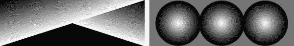

*图 11-14：多个渐变背景值*

左侧的示例展示了两个线性渐变应用于一个元素：从左上角到右下角，以及从右上角到左下角。最后的颜色停靠点的值为`transparent`，以便第二个渐变能穿透并显示在其下方。（记住，如果不设置透明度，渐变会填充整个框并遮住下面的层。）右侧的示例展示了三个径向渐变，每个渐变都延伸到最近的边，且每个渐变的中心位于不同的位置。与第一个示例一样，最后的颜色停靠点的值为`transparent`，以便让下面的层显示出来。

### 总结

尽管 CSS 渐变有很多历史问题，但最终的语法相当优雅，能够提供一系列美丽的背景效果。想要了解更多可能性，请访问 Lea Verou 的 CSS3 Patterns Gallery，网址是* [`lea.verou.me/css3patterns/`](http://lea.verou.me/css3patterns/)*，这里展示了一些真正突破极限的效果——不过，请记住本章开始时关于性能的警告，因为这些示例可能会对你的移动浏览器造成较大负担。

此外，在我写这段文字时，计划正在进行中，旨在通过一种新的渐变类型`conic`扩展可能性，这将带来更加令人兴奋的效果。

现在我们已经完成了这一小段讲解页面元素装饰的章节，接下来的章节将进入一个全新的领域：页面元素的转换与动画。

### 渐变：浏览器支持

|  | **Chrome** | **Firefox** | **Safari** | **IE** |
| --- | --- | --- | --- | --- |
| 线性渐变 | 是 | 是 | 是 | IE10 |
| 重复线性渐变 | 是 | 是 | 是 | IE10 |
| 径向渐变 | 是 | 是 | 是 | IE10 |
| 重复径向渐变 | 是 | 是 | 是 | IE10 |
