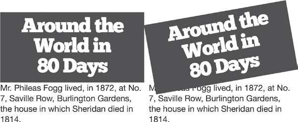
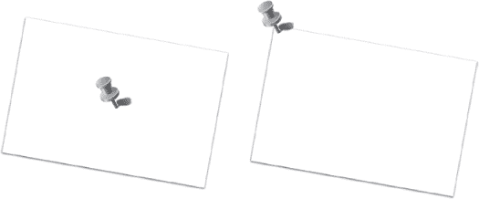
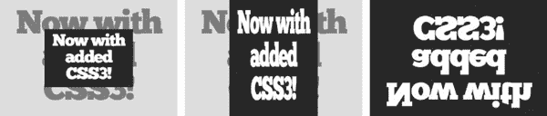
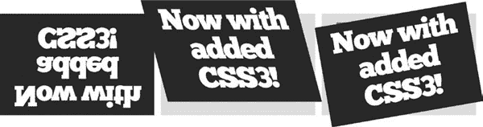

## 12

**2D 变换**


由于 HTML 的工作方式，每个元素都是由矩形块和直角构成的，网页通常显得很方正，有很多直的水平和垂直线，唯一能打破这种规则的方法就是使用图片。但早在 2008 年，WebKit 团队提出了一个新模块，允许元素进行旋转、缩放、倾斜等各种操作。该模块被 W3C 采纳并正式化为 2D 变换模块（*[`www.w3.org/TR/css3-2d-transforms/`](http://www.w3.org/TR/css3-2d-transforms/)*）。

变换元素的大部分过程是从*可缩放矢量图形（SVG）*语言中的函数借鉴而来的，SVG 用于绘制二维矢量图像。大多数现代浏览器都支持 SVG，因此 Firefox 和 Opera 迅速在自己的产品中实现了 2D 变换，IE9 也很快跟进。

CSS 和 SVG 的变换属性非常相似，事实上，W3C 决定将它们合并为一个共同的规范——CSS 变换（*[`dev.w3.org/csswg/css-transforms/`](http://dev.w3.org/csswg/css-transforms/)*），这就是该模块今天仍在继续工作的地方。简而言之，尽管 CSS 变换模块仍然只是一个工作草案，但其中的属性已经得到很好的实现，您可以立即开始使用这些新特性。

在我介绍语法之前，有一点需要注意：在本章结束时，我将介绍一些相当复杂的函数，因此您可能需要复习一下三角学。你紧张吗？别担心，我会尽量让它变得简单易懂。

### transform 属性

可以应用各种不同的变换，但所有变换都作为`transform`属性中的函数声明。以下是基本语法：

```
E { transform: function(value); }
```

有许多可用的函数；我将在本章的其余部分依次介绍每个函数。每个函数都接受一个单独的值或一个用逗号分隔的值列表。当我分别讨论每个函数时，我也会解释这意味着什么。

您可以通过在`transform`属性中简单地列出多个函数（以空格分隔）来应用多个变换到单个元素：

```
E { transform: function(value) function(value); }
```

在使用`transform`属性时，您需要注意一个非常重要的警告，但在我谈论这个之前，我需要介绍各种函数。然而，我强烈建议您不要跳过在第 144 页上的“关于变换函数的重要说明”。

#### *rotate*

所有函数中可能最简单的就是`rotate()`，它做的正如字面意思所示：它围绕某一点旋转元素。以下是语法：

```
E { transform: rotate(value); }
```

这里的`*value*`是一个单一的角度值，就像你在第十一章中使用 CSS 渐变时一样。而且，像在那一章中一样，我的示例仍然采用通常理解的角度单位（`deg`）。

为了向你展示`rotate()`的效果，我将使用这个规则将`h2`元素旋转-15 度（或 345 度）：

```
h2 { transform: rotate(-15deg); }
```

**浏览器对 2D 变换的支持**

正如我在本章开始时提到的，浏览器对 2D 变换的支持已经相当普及，尽管并非所有浏览器都支持没有厂商前缀的`transform`属性。IE9、Safari 和较老版本的 Android 浏览器都需要前缀，这意味着目前要使用这个属性，你必须指定三次：

```
E {
   -ms-transform: function(value); /* IE9 */
   -webkit-transform: function(value); /* WebKit */
   transform: function(value);
}
```

你可以在图 12-1 中看到这个示例的展示效果。请注意，我将另一个背景为浅灰色的`h2`元素放置在与第一个元素相同的位置，这样你可以比较旋转后的元素和默认（未旋转）元素。我将在本章的大多数示例中使用相同的方法。


*图 12-1：一个旋转了-15 度的元素*

##### 文档流中的位置

在我继续之前，有一个重要的点需要说明：变换后的元素仅影响页面的视觉呈现，而不影响文档布局。该元素本身仍然保留在文档流中，因此所有后续的元素都会受到它的影响，包括它的边距和内边距。变换后的元素不会影响页面布局，但看起来像是置于页面其他部分之上的新层，这意味着它可能会覆盖随后的元素。

为了说明我的意思，我将再旋转一个元素，这次在其下方加上一些文本，方便你看到变换效果。这里是旋转元素的代码：

```
h2 { transform: rotate(-10deg); }
```

图 12-2 展示了这个变换的结果，以及一个未变换的参考。两个示例是完全相同的，只是应用了`rotate()`函数。你可以清楚地看到，旋转后的元素覆盖了其下方的文本，而这些文本紧随未变换的元素之后出现在布局中。这个规则适用于任何应用了`transform`属性的元素，因此在继续操作时要注意这一点。



*图 12-2：变换元素对文档流的影响*

##### transform-origin

变换的*原点*是元素上进行变换的那个点。这个概念最容易通过`rotate()`来说明，尽管你可以将其应用到本章后面介绍的任何变换函数。

对于`rotate()`，你可以通过想象你有一张纸（元素）和一个针（元素的原点）来直观地理解原点。如果你用针把纸固定在一个平面上，你就可以围绕针旋转纸张。通过将针固定在纸上的不同位置，你可以改变旋转的方式——如果针固定在纸的中心，旋转半径较短，纸张两侧的移动相等；如果针固定在纸的边缘，整个纸张会围绕针旋转。图 12-3 展示了这种情况。



*图 12-3：围绕针旋转纸张：移动针的位置会改变旋转点。*

CSS `transform`属性的默认原点是元素的水平和垂直中心。你可以通过`transform-origin`属性来更改它：

```
E { transform-origin: value; }
```

此属性的`*value*`可以是一个或两个长度、百分比或关键字值。长度可以是任何接受的 CSS 单位（em、px 等）。关键字有`left`、`right`、`top`、`bottom`和`center`。如果提供两个值，第一个设置水平点，第二个设置垂直点；如果只提供一个值，该点设置为水平点，垂直点默认为`center`（或 50%）。

所以，如果你想将原点更改为左上角，可以使用以下任意值：

```
E { transform-origin: 0 0; }
E { transform-origin: left top; }
```

如果你想将原点设置为右下角，可以使用这些值（假设元素的`height`为 50px，宽度为 200px）：

```
E { transform-origin: 200px 50px; }
E { transform-origin: 100% 100%; }
E { transform-origin: right bottom; }
```

让我展示一下改变变换原点的效果。这个例子展示了三个相同的元素，每个元素都有相同的`transform`属性，但`transform-origin`值不同：

```
h2 { transform: rotate(-10deg); }
h2.example-1 { transform-origin: left center; }
h2.example-2 { transform-origin: 100% 50%; }
```

你可以在图 12-4 中看到这三种例子的效果。第一个例子使用默认值（`center center`），因此元素围绕绝对中心旋转。第二个例子使用`left center`的值，因此元素围绕左侧的垂直中心旋转。第三个例子使用`100% 50%`的值，因此元素围绕右侧的垂直中心旋转。


*图 12-4：不同的* `*transform-origin*` *值对旋转元素的影响*

#### *translate*

接下来我们要讲解的函数是`translate`，它将元素从默认位置沿水平或垂直轴移动（如果你需要复习，请参考第六章“理解轴和坐标”，第 64 页）。沿水平轴的移动由`translateX()`函数控制，沿垂直轴的移动由`translateY()`函数控制：

```
E { transform: translateX(value) translateY(value); }
```

这两个函数`translateX()`和`translateY()`分别沿着指定的轴移动元素，并且根据你指定的长度进行移动。你可以在这里使用任何长度单位或百分比值，例如，你可以使用：

```
E { transform: translateX(20px) translateY(15%); }
```

这段代码将元素向右移动 20px（沿* x *轴）并将其自身高度的 15%向下移动（沿* y *轴）。你可以在图 12-5 中看到这个结果。


*图 12-5：元素沿两个轴正向平移*

你也可以在`translate`函数中使用负值，这会使元素沿着轴的相反方向移动——也就是说，向上或向左。

**注意**

*你可能认为平移元素与使用相对定位以及`*left*`和`*top*`属性类似，但请记住，转换后的元素仍然保留在文档流中，只是*看起来*像是移动了；元素的视觉渲染被转换了，而不是元素本身。*

##### translate()简写函数

更方便地沿两个轴移动元素的方法是使用简写函数`translate()`。该函数接受一个以逗号分隔的最多两个值：

```
E { transform: translate(translateX(),translateY()); }
```

鉴于此，你可以使用简写函数和两个参数来复制图 12-5 中所示的转换：

```
E { transform: translate(20px,15%); }
```

你还可以只使用一个值来使用`translate()`简写：

```
E { transform: translate(20px); }
```

在这种情况下，提供的值被认为是`translateX()`的值，而`translateY()`则使用`0`（零）。因此，以下两种声明是等价的：

```
E { transform: translate(20px,0); }
E { transform: translate(20px); }
```

##### 使用 translate()函数

为了说明`translate()`简写函数的工作原理，下面是两个示例：

```
h2.translate-1 { transform: translate(-20px,20px); }
h2.translate-2 { transform: translate(20px,-20px); }
```

你可以在图 12-6 中看到这段代码的结果，元素以浅灰色显示，表示原始位置。


*图 12-6：元素显示`*translate()*`函数不同值的效果*

在第一个示例中，`translate()`函数的第一个参数是−20px，第二个参数是 20px，因此元素在水平方向上负向平移 20px（向左），在垂直方向上正向平移 20px（向下）。第二个示例的参数相反，因此元素在水平方向上正向平移（向右），在垂直方向上负向平移（向上）。

#### *缩放*

你可以使用`scale`函数将元素的大小调整为比原始尺寸更大或更小。与`translate`函数一样，水平方向和垂直方向各自有一个函数，分别称为`scaleX()`和`scaleY()`：

```
E { transform: scaleX(value) scaleY(value); }
```

`scaleX()`和`scaleY()`的`value`是无单位的数字，表示大小比率。默认大小为 1；两倍于默认值为 2，默认值的一半为 0.5，依此类推。你还可以使用负数——我将很快解释负数的效果。

要将元素的原始尺寸在两个轴上都加倍，可以使用：

```
E { transform: scaleX(2) scaleY(2); }
```

也可以使用简写函数`scale()`。但请注意，不同于`translate()`简写函数的是，如果只提供一个数值，另一个数值会被假定为相同。根据之前的示例，你可以选择简写如下：

```
E { transform: scale(2); }
```

我将通过几个示例演示`scale`的作用。以下是代码：

```
h2.transform-1 { transform: scale(0.5); }
h2.transform-2 { transform: scaleX(0.5); }
h2.transform-3 { transform: scale(1,-1); }
```

结果如图 12-7 所示。第一个示例中`scale`值为 0.5，所以变换后的元素大小是原始尺寸的一半——记住，我在简写中只指定了一个值，因此另一个值被假定为相同。在第二个示例中，我使用了 0.5 作为`scaleX()`函数的值，意味着变换后的元素高度与原始元素相同，但宽度是原始的一半。



*图 12-7：不同数值在*`*scale*`*函数中的效果*

在最后一个示例中，我为`scale()`简写提供了两个值：第一个是`1`（单位），表示水平尺寸与原始尺寸相同，而第二个是`–1`（负一）。使用负值会使元素在垂直方向上翻转，创建出一个与原元素等比例的“镜像”。

#### *skew*

*skew*一个元素是改变其水平或垂直轴（或两个轴）的角度。像`translate()`和`scale()`一样，每个轴都有一个单独的函数——这次是`skewX()`和`skewY()`。

```
E { transform: skewX(value) skewY(value);}
```

`skew`函数的参数是角度值；在我的示例中使用的是度数。负数值也是允许的。我将通过三次演示，使用以下代码向你展示它们的工作原理：

```
h2.transform-1 { transform: skewX(15deg); }
h2.transform-2 { transform: skewY(5deg); }
h2.transform-3 { transform: skewX(15deg) skewY(-15deg); }
```

结果如图 12-8 所示。


*图 12-8：不同数值作用下元素的变换效果*`*skew*`*函数*

在第一个示例中，元素沿其*X*轴倾斜了 15 度，导致垂直边缘呈斜角。第二个示例中，元素在*Y*轴上倾斜了 5 度，因此水平边缘呈斜角，而垂直边缘保持不变。最后一个示例展示了应用两个数值的效果：*X*轴 15 度，*Y*轴−15 度，导致元素在两个轴上都发生倾斜。

##### 通过 skew 进行旋转

通过查看前一个代码块中的最后一个示例，你可以看到使用`skew`是可以复制`rotate()`函数的。为此，你希望旋转元素的角度被作为`skewX()`的值，而`skewY()`则是该角度的逆值；也就是说，如果`skewX()`是 15 度，那么`skewY()`应该是−15 度，反之亦然。因此，下面这个代码示例中的两个函数完成的是相同的操作：

```
E {
    transform: rotate(15deg);
    transform: skewX(15deg) skewY(-15deg);
}
```

当我在本章稍后介绍`matrix()`函数时，你会发现这些信息非常有用。

##### skew()简写函数

CSS 变换模块和各种在线资源也列出了一个简写`skew()`函数，它接受两个单独的`skew`函数作为值（就像`translate()`接受`translate`函数一样）：

```
E { transform: skew(skewX(),skewY()); }
```

然而，我强烈建议你不要使用这个函数，因为出于某些我不理解的数学原因，它被认为是多余的。它仅为向后兼容而定义；在冗余被发现之前，一些旧版浏览器实现了该简写函数。如果你需要对两个轴进行倾斜，请使用`skewX()`和`skewY()`。

### 关于变换函数的重要说明

当你设置`transform`属性的值时，任何未列出的函数将被假定重置为其默认值。为了说明这一点，看看这个 CSS 代码片段，其中一个规则应用于`div`选择器来旋转和缩放它，另一个规则应用于`*.foo*`选择器，以不同的值参数旋转它：

```
div { transform: rotate(5deg) scale(2); }
.foo { transform: rotate(10deg); }
```

如果这些规则应用于一个类名为`.*foo*`的`div`元素，则该元素只会旋转 10 度，而不会缩放；因为没有指定`scale()`函数，所以它的值参数被视为默认值`0deg`。要应用这两个属性，你必须更新代码，在应用于`*.foo*`的规则中包含`scale()`函数：

```
div { transform: rotate(5deg) scale(2); }
.foo { transform: rotate(10deg) scale(2); }
```

### 使用矩阵变换元素

本章迄今为止使用的每个变换函数也可以表示为*变换矩阵*。我不会解释变换矩阵背后的理论（因为它相当复杂，足以单独成章），我只是展示如何通过`matrix()`函数将其应用于 CSS 中的元素。

我会尽量保持解释简单，只提供实用的基础知识。如果你真想深入了解理论，建议阅读 W3C 在 SVG 1.1 模块中的解释（*[`www.w3.org/TR/SVG/coords.html#TransformMatrixDefined/`](http://www.w3.org/TR/SVG/coords.html#TransformMatrixDefined/)*）。

2D 变换矩阵和`matrix()`函数接受六个值，它们的组合可以用来创建本章已介绍的变换函数。其语法如下：

```
E { transform: matrix(a,b,c,d,X,Y); }
```

所有默认值都是 0（零），并且它们的行为会根据提供的值有所不同——我会在后续中解释这意味着什么。我说过，你可以通过`matrix()`执行本章介绍的所有函数，但过程并不那么简单——你首先需要了解一些三角学知识。

在处理复杂内容之前，我会从一个简单的内容开始，它不需要任何三角函数：缩放。如果你想缩放一个元素，可以使用`*a*`和`*d*`来等同于`scaleX()`和`scaleY()`并设置相应的值，同时将`*b*`和`*c*`设为 0。因此，要将元素的大小加倍，你可以使用：

```
E { transform: matrix(2,0,0,2,0,0); }
```

你还可以通过为`*X*`和`*Y*`（分别是水平方向和垂直方向）提供偏移值，使用`matrix()`来转换一个元素。这些值是无单位的数字，表示像素值（在 HTML 元素中是像素值，在 SVG 中则是向量点值）。因此，如果要将一个元素的大小加倍并同时将其垂直和水平方向偏移 15px，可以使用以下代码：

```
E { transform: matrix(2,0,0,2,15,15); }
```

如果你想使用`matrix()`来倾斜一个元素，那么这里就变得更加复杂了——在这里我需要引入三角函数。你可以在维基百科上阅读这些函数的完整解释（* [`en.wikipedia.org/wiki/Trigonometric_functions#Sine.2C_cosine_and_tangent/`](http://en.wikipedia.org/wiki/Trigonometric_functions#Sine.2C_cosine_and_tangent/)*），但下面是一个快速而简略的总结：三角函数是用于计算三角形角度的比值。

我将使用的第一个三角函数是*tan（正切）*，它用于沿*x*-轴或*y*-轴倾斜一个元素。参照原始的`matrix`语法，*x*-轴作为值传递给`*b*`，*y*轴作为值传递给`*c*`。以下是每个的语法：

```
E { transform: matrix(1,tan(angle),0,1, X,Y); } /* X Axis */
E { transform: matrix(1,0,tan(angle),1, X,Y); } /* Y Axis */
```

`*angle*`指的是你希望倾斜的角度（逆时针方向），单位是度。如果你想将元素倾斜 15 度，那么你需要的值就是 15 度的正切值。因此，拿出你的科学计算器——如果没有，可以使用操作系统自带的科学计算器——计算出`tan(15)`的结果为 0.27。这个结果就是你需要传递给`matrix`函数的值。例如，如果你希望倾斜是沿着*x*-轴的，那么你可以使用以下语法：

```
E { transform: matrix(1,0.27,0,1,0,0); }
```

**注意** *由于我在示例中使用的是度数，请确保你的计算器的三角函数模式设置为度数，如果你想要跟着示例走。如果你更喜欢使用弧度或格拉度，可以相应地调整这些示例。*

如前所述，倾斜函数也可以用来旋转元素——你也可以用`matrix()`来实现这一点。这一次，你需要使用*sin（正弦）*和*cos（余弦）*三角函数。旋转元素的`matrix()`语法是：

```
E { transform: matrix(cos(angle),sin(angle),-sin(angle),cos(angle),X,Y); }
```

请注意，`*a*`和`*d*`的值相同，而`*b*`和`*c*`则取相反值（如果`*b*`是正值，则`*c*`是相同值的负值，反之亦然）。再次说明，`*angle*`指的是你希望旋转元素的角度。如果要旋转 60 度，回到你的科学计算器，计算 60 度的余弦和正弦。我的计算器显示`cos(60) = 0.5`和`sin(60) = 0.87`，所以所需的代码是：

```
E { transform: matrix(0.5,0.87,-0.87,0.5,0,0); }
```

现在让我们看几个示例。这是我将使用的代码：

```
h2.transform-1 { transform: matrix(1,0,0,-1,0,0); }
h2.transform-2 { transform: matrix(1,0,0.268,1,-10,-20); }
h2.transform-3 { transform: matrix(0.98,-0.17,0.17,0.98,0,0); }
```

输出结果如图 12-9 所示。



*图 12-9：使用`*matrix*`函数进行变换的示例*

在第一个例子中，我将元素垂直翻转，正如之前使用 `scale()` 在 图 12-7 中做的那样。在下一个例子中，我沿 *y* 轴将元素倾斜了 15 度（通过计算 `tan(15) = 0.268`），并沿两个轴平移它。最后一个例子展示了将元素旋转了 10 度；这些值是我之前给你展示过的计算结果：`cos(10) = 0.98` 和 `sin(10) = 0.17`。如前所述，`sin` 值在位置 `*b*` 为负，在位置 `*c*` 为正，这样旋转效果就保持一致。

我知道这些内容都相当复杂，但希望我已经简化到足够让你理解的程度，同时又不至于显得太简单，以至于你看不到其中极大的灵活性——只要你随时携带科学计算器！如果觉得这些内容过于复杂，理解起来有困难，记住，你可以使用各个独立的函数来执行所有这些变换，所以如果你愿意，完全可以忽略 `matrix` 和三角函数。

### 总结

本章介绍了迄今为止最复杂的属性：`matrix()` 函数。虽然有些人可能会觉得，想要执行复杂操作就必须应对复杂的语法，但我认为本章中的其他函数做得很好，将复杂性转化为简单的内容。只要记住，如果你厌烦了 `matrix()`，总有更简单的选项可以选择。

本章还介绍了一些至今为止最具革命性的属性——几年前，元素可以旋转、倾斜和缩放的概念还只是空想，但如今你可以轻松做到这些。如果你觉得本章所展示的内容已经令人印象深刻，那就等着下一章吧。我将向你展示如何将一个额外的维度——字面意义上的——添加到你的变换效果中。

### 二维变换：浏览器支持

|  | **Chrome** | **Firefox** | **Safari** | **IE** |
| --- | --- | --- | --- | --- |
| 二维变换 | 是 | 是 | 是^(*) | IE9*，IE10 |

* 使用厂商前缀
