## 13

**3D 变换**


到目前为止，我在本书中讨论的所有功能和特性都涉及了二维；每个元素都有高度和宽度，所有的计算仅涉及 *x* 轴和 *y* 轴。但随着 CSS 变换模块中引入 *z* 轴，CSS3 提供了一种革命性的方法来对元素进行三维变换（你可以在 *[`www.w3.org/TR/css-transforms-1/`](http://www.w3.org/TR/css-transforms-1/)* 上了解更多）。

当我写这本书的第一版时，只有 Safari（适用于 Mac 和 iOS）支持 3D 转换，但现在仅仅几年后，所有主流浏览器都已稳定实现了这一功能，包括 IE10 及以上版本——这是一个极为快速的采用速度。写这篇文章时，在 Safari 中，你需要对所有属性添加 `-webkit-` 前缀，但其他浏览器没有要求使用厂商前缀。

在三维空间中移动物体的工作可能非常消耗处理器资源，但大多数（如果不是所有的话）浏览器已经实现了所谓的 *硬件加速*，直接在设备的图形芯片上进行所需的计算，而不是在浏览器的软件中或主处理器上进行。这意味着，3D 变换的元素通常比仅使用 JavaScript 动画的其他元素更平滑、性能更好。鉴于此，你可以放心地在页面中使用 3D 变换，而不必太过担心。

### CSS 中的 3D 元素

CSS 中的三维对象基于 *笛卡尔坐标系*，如 图 13-1 所示。你可以在 Wikipedia 上了解更多 (*[`en.wikipedia.org/wiki/Cartesian_coordinate_system/`](http://en.wikipedia.org/wiki/Cartesian_coordinate_system/)*)。我在 第六章 中讨论了该系统的二维版本。

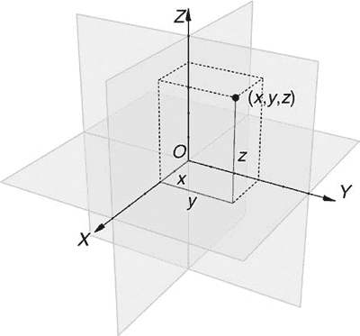

*图 13-1：笛卡尔坐标系，包含轴* x、y* 和 *z*^(1)*

**注意**

*如果你有使用三维计算机图形程序的经验，你应该熟悉本章中使用的计算方法和术语。如果没有，不用担心；我会尽力在过程中解释清楚所有内容。*

在 CSS 中，*z* 轴是基于观察者的：如果你把 *x* 轴想象为左右，*y* 轴想象为上下，那么 *z* 轴就是朝向或远离观察者。当你通过正值沿 *z* 轴移动一个元素时，元素会向你靠近；同样，使用负值则会将其推离你。你可以通过使用不同的视角来稍微改变这一点，稍后我会详细解释。

我必须指出，尽管本章会讲很多关于 3D 的内容，但我所指的仅仅是三维坐标。元素本身仍然是二维的，它们只有高度和宽度。然而，它们在三维空间中被移动，就像把一张纸在空气中移动一样。

在印刷页面上展示三维变换概念相当困难，因此我强烈建议你查看本书附带的网站上的示例（*[http:/www.thebookofcss3.com/](http://www.thebookofcss3.com/)*）；我已经为其中一些示例添加了过渡规则，让它们在交互时自动动画，从而更清晰地展示那些在二维书籍中难以呈现的三维效果。这些示例应该有助于你理解本章中使用的一些技巧。我还推荐由 Westciv 团队整理的测试页面（*[`www.westciv.com/tools/3Dtransforms/`](http://www.westciv.com/tools/3Dtransforms/)*）。这个网站允许你尝试不同的变换值组合，看看它们对元素的影响。

在我介绍新的和扩展的变换属性之前，先简要说明一下本章使用的示例。尽管每个示例可能使用不同的类来应用独特的样式规则，但所有示例都使用相同的基本标记：

```
<div class="d3-parent">
    <div class="d3-child">
        <h2>The Book Of</h2>
        <h1>CSS3</h1>
    </div>
</div>
```

大部分变换工作是在*.d3-child*元素上执行的，尽管有些属性必须应用于父元素，这就是为什么我还需要*.d3-parent*元素。我会在本章讲解时明确说明哪些属性应用于父元素，哪些应用于子元素。

### 变换函数

在第十二章中，我介绍了`transform`属性及其相关函数，用于二维变换。三维变换使用相同的属性和许多相同的函数，但也扩展了一些现有函数，并增加了一些全新的函数。我将逐一解释每个变换函数，并指出它们是全新的，还是扩展了我已经讨论过的二维变换属性。请注意，`transform`属性始终应用于子元素（在示例标记中为*.d3-child*）。

#### *围绕轴的旋转*

我将像解释二维函数一样解释三维变换函数——从旋转开始。二维空间只有一个轴来旋转，因此`rotate()`函数只需要一个值。但是当你处理三维空间时，你有三个轴可以旋转，因此需要控制三个属性来实现旋转。

```
E {
    transform: rotateX(angle);
    transform: rotateY(angle);
    transform: rotateZ(angle);
}
```

像`rotate()`函数一样，每个函数接受一个单一的角度值（允许负值）。我在示例中使用`deg`（度）单位，并通过以下代码展示如何在每个轴上使用相同的旋转角度：

```
➊ .trans-x { transform: rotateX(45deg); }
➋ .trans-y { transform: rotateY(45deg); }
➌ .trans-z { transform: rotateZ(45deg); }
```

你可以在 图 13-2 中看到结果。第一个示例（➊）展示了围绕 *x* 轴旋转的元素。为了理解这里发生了什么，想象有一条横向穿过元素中心的线；元素上半部分相对于这条线倾斜 45 度远离你，下半部分则相对于这条线倾斜 45 度朝向你。下一个示例（➋）是在 *y* 轴上进行旋转。想象有一条纵向穿过盒子中心的线；线左侧的元素部分向你倾斜 45 度，右侧部分则远离你倾斜 45 度。最后一个示例（➌）则是在 *z* 轴上进行旋转，这与二维的 `rotate()` 函数效果相同。

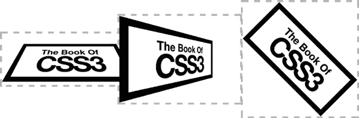

*图 13-2：围绕三个轴各旋转 45 度*

如果你想让一个元素围绕多个轴进行旋转，可以对元素应用多个函数：

```
E { transform: rotateX(angle) rotateY(angle) rotateZ(angle); }
```

另一个新功能——`rotate3d()`——也允许你围绕多个轴旋转一个元素；然而，它并不是一个简写函数。下面是语法：

```
E { transform: rotate3d(x,y,z,angle); }
```

`*angle*` 值比较简单，但 `*x*`、`*y*` 和 `*z*` 值就没有那么简单了。每个值都需要一个数字，用来计算一个方向向量（其完整解释超出了本书的范围；你可以访问 *[`mathworld.wolfram.com/CartesianCoordinates.html`](http://mathworld.wolfram.com/CartesianCoordinates.html)* 了解相关概述）。向量的原点是所有轴交汇的点——默认为元素的中心——用 `0,0,0` 表示。方向向量是三维空间中的一条线，从原点到由 `*x, y, z*` 值指定的坐标。元素将围绕这条线进行旋转，旋转的角度由 `*angle*` 值指定。

这个主题比较复杂，所以我将通过几个简单的示例来解释，再次使用相同的 45 度旋转，代码如下：

```
➊ .trans-x { transform: rotate3d(1,1,0,45deg); }
➋ .trans-y { transform: rotate3d(1,0,1,45deg); }
➌ .trans-z { transform: rotate3d(0,10,10,45deg); }
```

你可以在 图 13-3 中看到输出。第一个（左侧）示例（➊）的值为 `1,1,0`，意味着假想的线段指向 *x* 轴和 *y* 轴上各 1px 的位置。（实际上，“线”会沿着这个方向继续延伸；如果值是 `10,10,0` 或 `1000,1000,0`，也会产生相同的效果。）该元素围绕这条线旋转了 45 度。第二个（中间）示例（➋）的值为 `1,0,1`，在 *x* 轴和 *y* 轴上创建了一个 1px 的点，并围绕这条线旋转了 45 度。最后一个示例（➌），位于右侧，值为 `0,10,10`，因此元素围绕原点和 *y* 轴与 *z* 轴交点之间的线旋转了 15 度。记住，任何两个相同的值都会产生相同的效果。

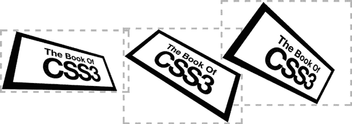

*图 13-3：使用方向向量与* `*rotate3d*` *函数进行旋转*

在编写纯 CSS 变换时，你可能不会频繁使用`rotate3d()`函数，因为涉及的计算相当复杂。但当结合 JavaScript 的数学处理能力时，这种方法的灵活性确实可以展现其强大作用。

#### *透视*

下一个函数，`perspective()`，实际上是最重要的之一，因为它从一个人工的视角创建你从三维空间中查看对象的效果，提供深度的错觉。如果没有指定，元素会对观众看起来“平坦”，无论应用了其他什么变换函数（除非从父元素继承了透视；详情请见第十三章的“`perspective`和`perspective-origin`属性”，参见 159 页）。以下是语法：

```
E { transform: perspective(depth); }
```

值`*depth*`是一个长度单位或者默认关键字`none`。这个长度设置一个“视点”，该视点沿着*z*轴与元素原点（`*z*` = 0）保持一定距离。一个较小的深度值——比如 50px——会让元素看起来非常接近观众，尺寸被夸大；而大约 1000px 的值可以被认为是“正常”的。

`perspective()`函数可能更容易展示而不是描述。在下一个示例中，我使用不同的值来展示该函数，向你展示各种值如何改变视角……呃，视距。以下是代码：

```
➊ .trans-1 { transform: perspective(1000px) rotateX(30deg) rotateY(45deg); }
➋ .trans-2 { transform: perspective(250px) rotateX(30deg) rotateY(45deg); }
➌ .trans-3 { transform: perspective(150px) rotateX(30deg) rotateY(45deg); }
```

**警告** *当在* `*transform*` *属性上使用多个函数时，`*perspective()*`函数必须始终列在第一个；如果列在其他函数之后，它将被忽略。*

你可以在图 13-4 中看到代码的结果。在左侧示例（➊）中，元素从`perspective()`的 1000px 距离观看。正如我所说，这是“正常”的距离；元素围绕两个轴旋转，但看起来尺寸比例正确。在中间的示例（➋）中，`perspective()`值降至 250px，使元素看起来在比例上被夸大，因为我将视点靠近了元素。最后（右侧）示例（➌）显示了一个`perspective()`值为 150px 的元素，这意味着你实际上从 150px 的位置沿*z*轴查看它，使得元素看起来相当夸张。

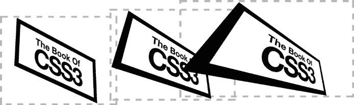

*图 13-4：不同的* `*perspective()*` *函数值的效果*

在继续之前，我想稍微偏离一下话题。你可能会想，为什么代码里有这么多重复？为什么我不能像这样做呢？

```
.d3-child { transform: rotateX(30deg) rotateY(45deg); }
.trans-1 { transform: perspective(20px); }
.trans-2 { transform: perspective(50px); }
.trans-3 { transform: perspective(1000px); }
```

原因是，如果我没有指定一个函数，它的值会被默认假定为默认值，因此我在`h1`元素上的函数设置会被后续样式中（没有函数的）值所覆盖。我在第十二章的“关于变换函数的重要说明”部分解释了这一点。

#### *沿轴平移*

`translateX()`和`translateY()`函数（及其简写形式`translate()`）用于在二维平面上按指定长度移动元素，但进入三维后需要一个新函数：`translateZ()`。其语法与兄弟属性相同：

```
E { transform: translateZ(length); }
```

`*length*`值是带有长度单位的任意数值。例如，要将元素沿*z*-轴移动 30px（向观察者方向），可以使用以下代码：

```
E { transform: translateZ(30px); }
```

现在你已经了解了新函数，让我们来看它们的实际应用。在下面的示例中，我展示了两个样式相同的元素，只是`translateZ()`函数的值不同：

```
➊ .trans-z1 { transform: translateZ(-40px); }
➋ .trans-z2 { transform: translateZ(40px); }
```

你可以在图 13-5 中查看结果——请注意，我稍微调整了父元素的角度，并使元素透明，这样你就可以更容易地看到效果。在第一个例子（➊，左侧）中，`translateZ()`函数的值为−40px，使其沿*z*-轴负方向移动，显得比父元素小。接下来（➋，右侧）`translateZ()`的值为 40px，沿*z*-轴正方向移动，并显得比父元素大。

**注意**

*当你看到元素动画效果时，这个概念会变得更容易理解，所以我再次鼓励你查看随附的示例文件，以便更好地感受这些函数的行为。*

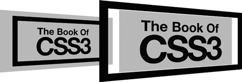

*图 13-5：沿*z*-轴不同方向的平移*

还有一个简写函数`translate3d()`，它也可以使用。这个简写形式允许你同时设置三个值。其语法是`translate()`函数的逻辑扩展：

```
E { transform: translate3d(translateX,translateY,translateZ); }
```

每个参数相当于命名函数，因此每个参数都接受一个数值，可以是正数或负数，带有 CSS 长度单位或百分比，示例如下：

```
E { transform: translate3d(0,100%,1em); }
```

#### *缩放*

我在第十二章中还介绍了`scale()`函数，以及子函数`scaleX()`和`scaleY()`。三维的引入增加了一个新的子函数`scaleZ()`，其语法如下：

```
E { transform: scaleZ(number); }
```

与其兄弟函数一样，`*number*`值为元素提供一个缩放因子，因此值为 2 时，元素在*z*-轴上的大小会加倍。然而，结果可能不是你预期的那样；如你所记得，元素本身没有深度，因此单独增加`scaleZ()`并不会改变元素。实际发生的情况是，它作为`translateZ()`所提供的任何值的乘数。例如，考虑以下代码：

```
E { transform: scaleZ(3) translateZ(10px); }
```

`scaleZ()`函数的值为 3，乘以`translateZ`函数的值 10px，因此元素沿*z*-轴显示为 30px（3 × 10px）。

除了`scaleZ()`，还新增了一个简写函数`scale3d()`。其语法如下：

```
E { transform: scale3d(scaleX,scaleY,scaleZ); }
```

如你所见，这个简写形式仅接受每个值的数字，作为相关轴上的缩放因子。以下是两个例子，展示 3D 缩放效果：

```
➊ .trans-z1 { transform: scaleZ(2.5) translateZ(-10px); }
➋ .trans-z2 { transform: scale3d(1.25,1.25,4) translateZ(10px); }
```

结果显示在图 13-6 中。第一个（左边）示例（➊）展示了一个`translateZ()`值为−10px 且`scaleZ()`值为 2.5 的元素；如我所提到的，`scaleZ()`是`translateZ()`的倍数，因此该元素沿*z*轴负向移动了 25px。在第二个示例（➋）中，我使用了`scale3d`函数将*x*轴和*y*轴的值设置为 1.25，将*z*轴的值设置为 4。结果的元素如右图所示，在二维轴上大了 25％，而`scaleZ()`值则将`translateZ()`的 10px 值放大，导致元素沿*z*轴移动了 40px。

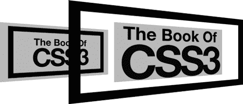

*图 13-6：在不同和多个轴上的缩放*

#### *变换矩阵*

我在第十二章中介绍了 2D 变换的一些较为深奥的方面，其中之一就是`matrix()`函数。这个函数允许你使用六个值（基于网格模式）和一些三角函数计算来应用复杂的变换。你还可以使用`matrix3d()`函数应用 3D 变换。但如果你觉得 2D 矩阵难以理解，可能需要跳过这个—`matrix3d()`有多达 16 个值！以下是语法：

```
E { transform: matrix3d(
    m01,m02,m03,m04,
    m05,m06,m07,m08,
    m09,m10,m11,m12,
    m13,m14,m15,m16
); }
```

**注意**

*这里显示了换行符以便于理解；实际使用中你不需要使用它们。*

每一个`*m*`值都是一个数字，但我甚至无法开始解释它们每个的作用！我建议你先阅读相关的入门介绍（*比如[`dev.opera.com/articles/understanding-the-css-transforms-matrix/`](http://dev.opera.com/articles/understanding-the-css-transforms-matrix/)*是一个不错的起点），然后决定这是否是你想深入了解的内容。

这里，我提供了一些简单的示例，使用这些代码来展示其功能：

```
➊ .trans-1 { transform: matrix3d(1,0,0,0,0,1,0,0,0,0,1,0,10,10,10,1); }
➋ .trans-2 { transform: matrix3d(1.5,0,0,0,0,1.5,0,0,0,0,2,0,0,0,10,1); }
➌ .trans-3 { transform: matrix3d(0.96,-0.26,0,0,0.26,0.96,0,0,0,0,1,0,-10, 0,20,1); }
```

你可以在图 13-7 中看到结果。第一个（左边）示例（➊）展示了元素在每个轴上移动了 10px，相当于`translate3d()`函数的效果——矩阵中的`*m13*`、`*m14*`和`*m15*`值分别代表`translateX()`、`translateY()`和`translateZ()`。在第二个示例（➋）中，我将图像在*x*轴和*y*轴上按 1.5 倍放大（`*m1*`和`*m6*`值），在*z*轴上按 2 倍放大（`*m11*`值），这会将`translateZ()`的值（`*m15*`）放大，导致元素沿*z*轴移动 20px，如中间示例所示。最后一个示例（➌）需要使用科学计算器来处理一些三角函数，因为我将元素在*z*轴上旋转了 15 度。要创建旋转，你需要给`*m1*`和`*m6*`赋值为 cos(15)，即 0.96，然后将 sin(15)，即 0.26，赋给`*m5*`，负的 sin(15)赋给`*m2*`。我还通过在`*m13*`中使用值将元素沿*x*轴平移了 10px。你可以在右侧的图中查看结果。

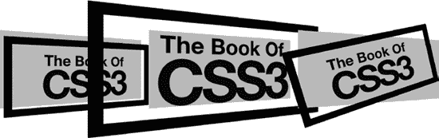

*图 13-7：使用`*matrix3d()*`函数应用的变换*

如你所见，这个函数功能非常强大——也相当复杂。你是否想深入了解`matrix3d()`的全部潜力，很大程度上取决于你和你的项目，但我认为这超出了本书的范围。别忘了，你可以通过单独的函数执行所有这些变换；虽然最终代码会更多，但它会更容易理解——不仅对你自己，对后续维护你网站的任何人也更容易理解！

### perspective 和 perspective-origin 属性

在本章早些时候，我介绍了`perspective()`变换函数，但`perspective`属性也是可用的。其语法相当简单：

```
E { perspective: depth; }
```

该属性的操作方式与函数相同：`*depth*`值是一个长度单位，用于设置元素原点与*z* = 0 之间的距离。实际上，函数与属性之间唯一的区别是，属性所提供的值仅适用于其子元素，而不适用于元素本身。

`perspective`的伴随属性是`perspective-origin`。该属性设置在 3D 空间中查看元素的点。以下是语法：

```
E { perspective-origin: x-position y-position; }
```

`*x-position*`值可以是`left`、`right`或`center`中的任何一个，`*y-position*`值可以是`top`、`bottom`或`center`。也可以使用百分比或长度值。你应该熟悉这些值对，尤其是在使用其他属性时，例如`background-position`或`transform-origin`。

默认值是`center center`（或`50% 50%`），这意味着你正在从元素的绝对中心开始查看透视线。改变`perspective-origin`的值会改变透视线的起点。

这可能听起来有点让人费解；不过，再次强调，展示比解释更容易。在接下来的例子中，我从不同的视角原点展示相同的变换元素。以下是代码：

```
  .d3-parent { perspective: 200px; }
  .d3-child { transform: rotateX(45deg) rotateZ(90deg); }
➊ .trans-1 { perspective-origin: left center; }
➋ .trans-2 { perspective-origin: 100% 100%; }
➌ .trans-3 { perspective-origin: 75% 25%; }
```

这些示例在图 13-8 中有说明。首先展示一个参考示例（最左侧）；这是一个从`center center`默认原点查看的变换元素。第二个示例（➊）是相同的元素，但其`perspective-origin`位于元素左侧的中心。你查看该元素的角度已经发生变化，视点似乎位于元素的左侧。第三个示例（➋）使用了`100% 100%`的长度值，这将原点更改为右侧底部。视点似乎位于元素的右侧，并且是向上看的。最后一个示例（最右侧）（➌）则是从`x`轴 75%的位置和`y`轴 25%的位置进行查看；这个示例与参考示例相似，但视点略微偏移，位于元素的右侧且稍微高于元素。

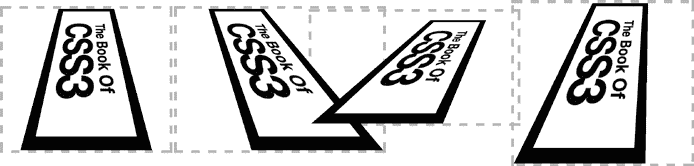

*图 13-8：不同的`*perspective-origin*`属性值*

### 变换原点

在第十二章解释 2D 变换时，我谈到了每个元素的原点——所有变换应用的点——以及如何使用`transform-origin`属性设置其位置。这个相同的属性也用于设置 3D 变换的原点，但由于三维坐标系有三个轴（*x*-轴，*y*-轴和*z*-轴），因此该属性还接受三个值：

```
E { transform-origin: x y z; }
```

前两个值，`*x*` 和 `*y*`，与 2D 元素的`transform-origin`属性相同；也就是说，它们接受关键字（`left`，`right`，`center`用于`*x*`，`top`，`bottom`，`center`用于`*y*`）、长度单位或百分比作为值。默认值为`center center`，或`50% 50%`。第三个值，`*z*`，是一个长度值，用来设置变换发生的*z*-轴上的距离。这个值看起来可能有些反直觉，因为它似乎是倒转的；如果给定一个负值，变换原点就会位于元素的背后，这使得元素出现在其父元素的前面；同样，正值则将原点放置在元素的前面，使得元素出现在其父元素的后面。

我将通过一个演示来说明这一点，演示中有三个元素，除了`transform-origin`值外，其它所有值都相同。以下是这些示例的相关代码：

```
  .d3-child { transform: rotateX(45deg) rotateZ(90deg); }
➊ .trans-1 { transform-origin: 50% 0 0; }
➋ .trans-2 { transform-origin: 50% 100% 0; }
➌ .trans-3 { transform-origin: center bottom -50px; }
```

你可以在图 13-9 中看到输出。从左到右，第一个例子再次是一个参考元素，原点位于其默认位置，即正中心。接下来的例子（➊）展示了相同的元素，`transform-origin`值设置为顶部中心，并且原始位置（未改变）的*z*-轴上。第三个例子（➋）将变换原点设置为元素的底部中心，而最后一个（最右侧）例子（➌）具有相同的变换原点（在*x*-轴和*y*-轴上使用关键字而不是百分比设置），但是在*z*-轴上是 50px——也就是说，朝向观察者（如图所示）。

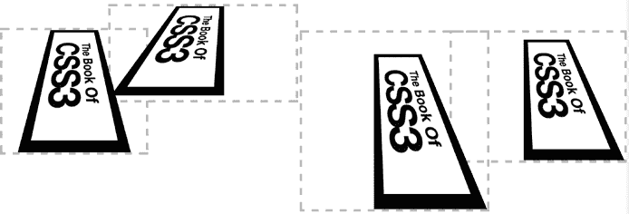

*图 13-9：变换元素上不同的`*transform-origin*`值*

如前所述，如果你查看示例文件，你将能更清楚地看到这些差异，因为你可以看到元素实际上围绕其变换原点旋转。

### transform-style 属性

当 3D 变换的元素嵌套时，默认行为是所有子元素都会被压平到父元素的平面上——也就是说，任何应用于子元素的变换函数都会被忽略。你可以通过一个名为`transform-style`的属性来更改这一行为；下面是语法：

```
E { transform-style: keyword; }
```

关键字值可以是`flat`（默认值）或`preserve-3d`。如果从一个例子开始解释这个差异会更容易：在这里，我有两个元素应用了相同的规则，唯一的区别是给`transform-style`属性赋的值：

```
.trans-1 { transform-style: flat; }
.trans-2 { transform-style: preserve-3d; }
```

如图 13-10 所示，差异非常明显：左侧示例使用了默认值 `flat`，因此内部元素与父元素保持在同一维度平面上；你可以清楚地看到与右侧第二个示例的对比，后者的 `transform-style` 值为 `preserve-3d`，内部元素位于一个独立的平面上，并且在父元素的 *z* 轴方向上进一步延伸。

**警告** *Internet Explorer 10 和 11 不支持此属性的 `*preserve-3d*` 值。*

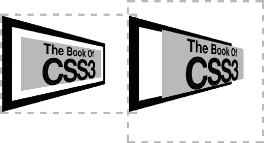

*图 13-10：比较不同 `*transform-style*` 属性值的效果*

### 显示或隐藏背面

有时你会遇到这种情况，元素已被旋转到一定角度，背对着你，你看到的是它的“背面”（称为 *backface*）。默认情况下，元素表现得像是透明的，因此你会看到前面显示的反面内容。你可以通过使用 `backface-visibility` 属性来改变这种行为，其语法如下：

```
E { backface-visibility: state; }
```

`*state*` 值是两个关键字之一：`hidden` 或 `visible`。默认值是 `visible`，它的行为如我刚才所描述；而 `hidden` 显示的是空白。它们的工作方式与 `visibility` 属性相同，你应该对这个属性在 CSS2 中有所了解。

以下是一个简短示例，通过展示两个元素来说明这两个 `*state*` 之间的差异，除了它们的 `backface-visibility` 值不同。代码如下：

```
.d3-child {
    backface-visibility: visible;
    transform: rotateY(180deg);
}
.bf-hidden { backface-visibility: hidden; }
```

你可以在图 13-11 中看到结果。两个示例元素围绕 *y* 轴旋转，背对你。左侧的示例中，元素的 `backface-visibility` 属性值为 `visible`，因此你可以清楚地看到元素的背面。在右侧示例中，你什么也看不见。`backface-visibility` 属性值为 `hidden`，因此什么都不显示——没有 `border`，没有 `background-color`，什么都没有。为了确认元素确实存在，你可以访问本书附带的网站，查看动画代码示例，这样你就能更清楚地看到它们是如何工作的。

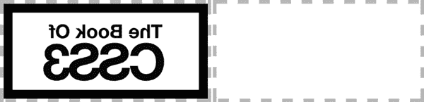

*图 13-11：演示 `*backface-visibility*` 属性*

### 总结

第三维度的引入使 CSS 进入了一个充满潜力的领域——有许多演示展示了巧妙使用 3D 转换来构建物体或环境的示例。但对我而言，额外维度的最佳用途是在较小的、微妙的细节中；为鼠标悬停效果添加深度，或者制作可以翻转显示反面信息的双面“卡片”。

和所有事物一样，CSS 3D 转换最好适当使用，这样它们可以提升网站的用户体验，而不是通过不必要的技巧让体验变差。

### 3D 转换：浏览器支持

|  | **Chrome** | **Firefox** | **Safari** | **IE** |
| --- | --- | --- | --- | --- |
| 3D 变换 | 是 | 是 | 是^(*) | IE10^(†) |

* 带供应商前缀

† 不支持 `transform-style` 的 `preserve-3d` 值
