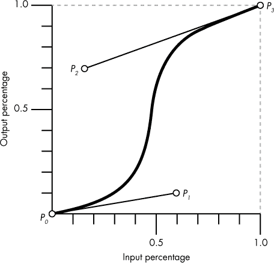
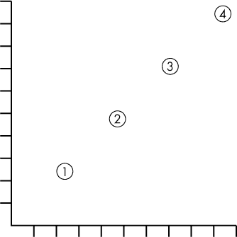
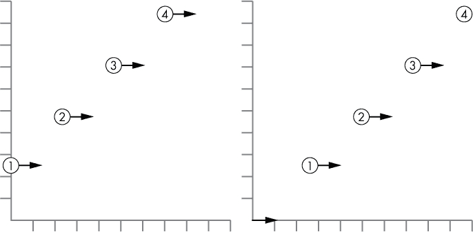
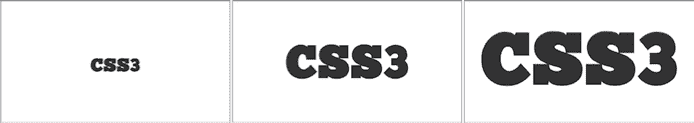
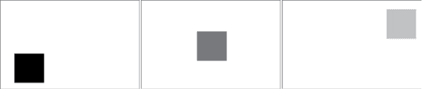
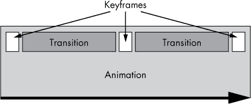
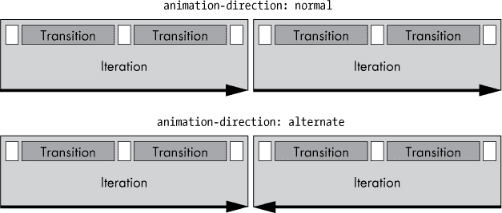
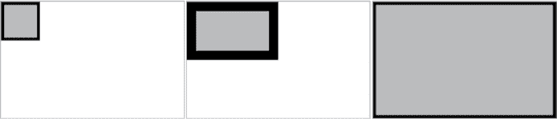

## 14

**过渡与动画（TRANSITIONS AND ANIMATIONS）**


我们通常认为网页有三个层次：内容（HTML）、展示（CSS）和行为（JavaScript），通常理解是这三层应当完全分开——也就是说，不要在内容层使用展示或行为规则（换句话说，HTML 标记中不能有内联 CSS 或 JavaScript）。然而，这种分离并不像看起来那么明确——首先，CSS 一直包含一些行为方面的内容（例如，`:hover`伪类就是一个典型的例子）。

当 WebKit 开发者引入了两个新的行为模块并将其作为 CSS3 组件采纳时，展示和行为之间的界限变得更加模糊了：过渡和动画。这些模块允许对元素的属性进行动画处理，为原本静态的页面增添了动态效果，即使在没有 JavaScript 的情况下也能实现。

有些人曾经争论过——也许现在仍然在争论——过渡和动画模块是否应当纳入 CSS，因为它们完全属于行为层。但由于 W3C 决定将它们作为 CSS3 的“官方”部分进行讨论，我们不再需要辩论它们的伦理问题——我们可以直接享受它们带来的乐趣了！

过渡（transitions）和动画（animations）之间的区别在于，前者是*隐式的*，而后者是*显式声明的*。这意味着过渡只有在应用的属性值发生变化时才会生效，而动画则是在应用于元素时显式执行。

我将从过渡模块开始讲解，因为它是两个模块中更简单的一个；然而，这两个模块有许多相似的语法，因此从一个模块学到的很多内容可以直接应用到另一个模块上。

### 过渡（Transitions）

CSS2.1 没有中间状态：当属性值变化时，变化是突然发生的。考虑一个宽度为 10em 的元素，当你将鼠标悬停在其上时，宽度变为 20em。你会注意到元素在这两种状态之间并没有平滑过渡，而是直接跳跃过去。CSS3 通过引入过渡模块（*[`www.w3.org/TR/css3-transitions/`](http://www.w3.org/TR/css3-transitions/)*）改变了这一行为。在 CSS 中，*过渡*是一种将属性在两种状态之间平滑过渡的动画效果。

正如我在本章开头提到的，过渡是一种*隐式*动画，这意味着它们只有在为 CSS 属性设置新值时才会触发——这可以是在鼠标悬停时应用新值或通过 JavaScript 进行操作时触发。为了使过渡发生，必须满足四个条件：初始值、结束值、过渡本身以及触发条件。

这里是一个简单过渡中那四个条件的示例（暂时不用担心我使用的属性；稍后我会逐一解释）：

```
div {
    background-color: black;
    transition: background-color 2s;
}
div:hover { background-color: silver; }
```

`div` 元素提供了初始值（`background-color: black`）和过渡效果（`background-color 2s`）。触发条件是 `:hover` 伪类，它为 `background-color` 属性设置了结束值（`silver`）。

所以这里有一个 `div` 元素，初始背景为黑色，当鼠标悬停时，它的背景平滑过渡为银色。当触发条件不再活跃时，所有的过渡效果都会反向执行，因此当鼠标移开 `div` 时，背景将平滑过渡回黑色。

现在你已经大致了解了过渡效果如何工作，我将依次介绍每个过渡属性。

**注意**

*过渡属性在所有现代浏览器中都已实现，包括移动设备浏览器，无需厂商前缀。然而，为了兼容较老版本的基于 WebKit 的浏览器——特别是 Safari 和 Android 4.4 之前的版本——你应当在规则中添加带有 `*-webkit-*` 前缀的复制版本。*

#### *过渡属性*

第一个新属性，`transition-property`，指定了元素的哪个属性（或哪些属性）将会被动画化（这是我在一句话中提到的最多次的 *属性*）。以下是其语法：

```
E { transition-property: keyword; }
```

一个可接受的关键字值是 `all`、`none` 或有效的 CSS 属性。默认值是 `all`，这意味着所有有效的属性都会被动画化。我强调 *有效* 的 CSS 属性，因为并不是所有属性都可以进行过渡；规范中列出了可以过渡的属性，详见 *[`www.w3.org/TR/css3-transitions/#properties-from-css-/`](http://www.w3.org/TR/css3-transitions/#properties-from-css-/)*。

这是一个 `transition-property` 的示例：

```
h1 {
    font-size: 150%;
    transition-property: font-size;
}
```

这段代码为 `font-size` 属性设置了初始值 `150%`，并声明该属性将在触发条件（尚未指定）激活时发生过渡。请注意，在本节剩余部分我将逐步添加更多的属性，在 “完整过渡示例” 中展示完整的例子，见 第 173 页。

#### *过渡持续时间*

下一个属性是 `transition-duration`，它定义了过渡完成所需的时间。以下是其语法：

```
E { transition-duration: time; }
```

`*时间*` 值是一个带有单位 *ms*（*毫秒*）或 *s*（*秒*）的数字。因为 1000 毫秒等于 1 秒，所以 `1.25s` 等同于 `1250ms`。默认值是 `0`（零），意味着这是创建过渡所需的唯一属性。如果你声明了 `transition-duration` 而没有声明 `transition-property`（因为默认值是 `all`，因此所有有效属性都会被动画化），则过渡仍然可以发生，但反之则不行。

为了使前一节中的示例过渡在两秒钟内完成，你需要添加以下代码：

```
h1 {
    font-size: 150%;
    transition-property: font-size;
    transition-duration: 2s;
}
```

尽管你可以为此属性提供负值，但它们会被解释为默认值 `0`。

#### *过渡计时函数*

为了控制元素在状态之间过渡的方式，你可以使用`transition-timing-function`属性。这个属性允许你在过渡的持续时间内调整速度，从而控制动画的节奏。该属性有三种不同的值类型：关键字、`cubic-bezier()`函数或者`steps()`函数。我会详细讨论这两个函数，但首先，我将重点讲解关键字。

##### 时间函数关键字

当使用关键字时，`transition-timing-function`属性的语法相当简单明了：

```
E { transition-timing-function: keyword; }
```

可用的关键字值有`ease`、`linear`、`ease-in`、`ease-out`和`ease-in-out`。默认值是`ease`，它开始时较慢，加速较快，最后再慢下来。`linear`值则是从过渡开始到结束的过程中，速度均匀，没有变化。`ease-in`值使动画开始时较慢，接着加速，直到结束，而`ease-out`值则正好相反。最后，`ease-in-out`从开始时较慢，经过中间加速，再到结束时减速，类似于——但比`ease`值不那么戏剧性的——`ease`值。

解释完这一点后，让我们为示例过渡添加一个简单的时间函数：

```
h1 {
    font-size: 150%;
    transition-property: font-size;
    transition-duration: 2s;
    transition-timing-function: ease-out;
}
```

##### 三次贝塞尔曲线

如果你想对`transition-timing-function`属性进行更精细的控制，应该使用`cubic-bezier()`函数。如果你对三次贝塞尔曲线不太熟悉——其实，为什么会熟悉呢？——让我来为你解释。首先，这里是语法：

```
E { transition-timing-function: cubic-bezier(x1, y1, x2, y2); }
```

三次贝塞尔曲线是一条平滑的连续曲线，它穿过四个点，这些点在一个从 0 到 1 的网格上绘制，横纵坐标轴都是从 0 到 1。四个点分别叫做*P[0]*、*P[1]*、*P[2]*和*P[3]*。它们定义了曲线的弯曲度，并通过一对对的(*x*, *y*)坐标绘制，其中第一个点(*P[0]*)总是在(0, 0)，最后一个点(*P[3]*)总是在(1, 1)。另外两个点在函数中定义：(*x1*, *y1*) 和 (*x2*, *y2*)。一个例子，如图 14-1 所示，能最好地说明这一点。



*图 14-1：三次贝塞尔曲线的示例*

图 14-1 展示了这四个点如何映射到网格上，从而绘制出贝塞尔曲线。每个点的坐标列在表 14-1 中。

**表 14-1：用于绘制贝塞尔曲线的坐标点**

| **点** | **坐标 (x, y)** |
| --- | --- |
| *P[0]* | (0, 0) |
| *P[1]* | (0.6, 0.1) |
| *P[2]* | (0.15, 0.7) |
| *P[3]* | (1.0, 1.0) |

你可以使用以下 CSS 来表示这条曲线（记住，你不需要定义*P[0]*和*P[3]*，因为它们的值始终是固定的）：

```
E { transition-timing-function: cubic-bezier(0.6, 0.1, 0.15, 0.7); }
```

线性动画从 (0, 0) 到 (1, 1) 按直线进展，但这个示例动画是在设定的持续时间内，遵循曲线的进展，直到达到最终点。如果你想象持续时间为 1 秒，你可以看到开始时速度逐渐增加，在 0 到（大约）0.5 秒之间，然后在 0.7 秒左右急剧加速，接着直到动画结束时，速度逐渐变慢。

之前描述的所有 `transition-timing-function` 关键字都是通过立方贝塞尔曲线生成的。表 14-2 显示了每个关键字及其对应的 `cubic-bezier()` 函数值。

**表 14-2：** 比较 `transition-timing-function` 关键字与其对应的立方贝塞尔值

| **关键字值** | **立方贝塞尔值** |
| --- | --- |
| `ease` | 0.25, 0.1, 0.25, 1 |
| `linear` | 0, 0, 1, 1 |
| `ease-in` | 0.42, 0, 1, 1 |
| `ease-out` | 0, 0, 0.58, 1 |
| `ease-in-out` | 0.42, 0, 0.58, 1 |

就像我在第十三章中介绍的变换矩阵一样，`cubic-bezier()` 函数如果你不习惯数学，可能会让人感觉有些棘手。但别担心——你总是可以使用关键字值，这在大多数情况下已经足够了。

一个使立方贝塞尔曲线稍微容易理解的好工具是 Lea Verou 的 *[`cubic-bezier.com/`](http://cubic-bezier.com/)*。这个工具允许你使用可视化界面创建自己的曲线，将其与关键字别名实时比较，并将它们导出为 `cubic-bezier()` 函数——这是理解曲线的一个非常有用的辅助工具。

##### steps() 函数

`steps()` 函数是平滑过渡的替代方案，它通过一系列错开的间隔来运行动画。该函数的语法如下所示：

```
E { transition-timing-function: steps(count, direction); }
```

`*count*` 值是一个整数，表示动画应该运行的间隔次数，且可选的 `*direction*` 是两个关键字之一——`start` 或 `end`（默认为 `end`），它设置每个间隔中变化发生的点。现在这可能还不太容易理解，但请耐心等待。

让我们来看一个 `steps()` 如何工作的简单例子。看看下面的规则，其中 `steps()` 函数的步数参数为 `4`，并通过省略可选的方向关键字，使用该函数的简单形式：

```
E { transition-timing-function: steps(4); }
```

在用于 `cubic-bezier()` 函数的定时功能网格上，它看起来像 图 14-2。因此，`steps` 并不像单一的过渡线，而是像是在看到动画的每一帧快照。



*图 14-2：四个步进间隔的过渡*

当动画以步进方式显示时，使用 `*direction*` 关键字来选择每个步进变化发生的时机：默认的 `end` 关键字表示变化发生在步进的结束时（暂停，然后变化），而替代的 `start` 则表示变化发生在步进的开始时（变化，然后暂停）。

这个过程在时间函数网格上也更容易可视化；在下面的代码中，同样的步骤数显示了不同的方向关键字：

```
E { transition-timing-function: steps(4, start); }
E { transition-timing-function: steps(4, end); }
```

你可以在图 14-3 中看到它们之间的区别，如果可以的话，我强烈建议你查看随附的示例文件（可以从 *[`thebookofcss3.com/`](http://thebookofcss3.com/)* 获得）——看到这两者的实际效果是理解区别的最佳方式。



*图 14-3：比较方向关键字：* `*start*` *(左边) 和* `*end*` *(右边)*

#### *transition-delay*

`transition-*` 系列中的最后一个属性是 `transition-delay`，它设置过渡开始的时间。以下是语法：

```
E { transition-delay: time; }
```

和 `transition-duration` 一样，`*time*` 值是一个带单位的数字，单位可以是毫秒（`ms`）或秒（`s`）。默认值为 `0`（零），意味着过渡会在触发时立即发生。任何其他正值则会在指定时间过后开始过渡。

例如，如果你想在示例过渡的开始处设置一个四分之一秒的延迟，以下是你会使用的代码：

```
h1 {
    font-size: 150%;
    transition-property: font-size;
    transition-duration: 2s;
    transition-timing-function: ease-out;
    transition-delay: 250ms;
}
```

你还可以为 `transition-delay` 使用负值，这会产生一个有趣的效果：过渡立即开始，但会跳过负值的时间量。为了说明我的意思，我们考虑一个持续时间为 `4s` 的过渡，但延迟为 `-2s`：

```
E {
    transition-duration: 4s;
    transition-delay: -2s;
}
```

当触发时，过渡立即开始，但就像两秒钟已经过去一样（两秒钟为持续时间减去延迟）。在这种情况下，动画会从过渡的中途开始。

#### *过渡简写属性*

在这一部分中，我通过一个属性一个属性地构建了一个示例过渡。目前，代码看起来是这样的：

```
h1 {
    transition-property: font-size;
    transition-duration: 2s;
    transition-timing-function: ease-out;
    transition-delay: 250ms;
}
```

这段代码似乎每个过渡都需要写很多。但和所有其他属于同一“系列”的 CSS 属性一样（例如`background-*`、`border-*`等等），`transition-*`系列也有简写方式。以下是语法：

```
E { transition: property duration timing-function delay; }
```

这里有一个重要的注意事项，那就是有两个时间值：`transition-duration` 和 `transition-delay`，它们必须按此顺序声明。如果只声明了其中一个，语法会假定它是 `transition-duration`，而 `transition-delay` 会被设置为默认值（或继承值）。

如果你使用来自示例过渡的值并应用简写属性，结果如下：

```
h1 { transition: font-size 2s ease-out 250ms; }
```

很明显，编写的代码少了很多。

#### *完整的过渡示例*

现在我已经解释了所有组件属性，让我们看看实际的示例过渡效果。完整的代码如下：

```
h1 {
    font-size: 150%;
    transition: font-size 2s ease-out 250ms;
}
h1:hover { font-size: 600%; }
```

图 14-4 显示了当我将鼠标移到 `h1` 元素上时发生的情况。



*图 14-4：`*font-size*` 属性上动画过渡的三个阶段*

显然，我无法在打印页面上展示完整的动画，但插图展示了过渡的三个阶段：初始的过渡前阶段（左侧），字体大小为 150%；中间的过渡中阶段（中间），动画进行到不到两秒时字体大小已增大；以及最后的过渡后阶段（右侧），字体大小为 600%。

如我之前所提到的，当触发条件不再满足时，过渡会反向执行，因此当你把鼠标从 `h1` 元素上移开时，可以从右到左阅读此示例，查看会发生什么。

#### *多个过渡*

您可以通过为单个或缩写属性提供逗号分隔的值列表，轻松地为一个元素添加多个过渡。这样的话，以下两个代码示例都是有效的：

```
E {
    transition-property: border-width, height, padding;
    transition-duration: 4s, 500ms, 4s;
}
E { transition: border-width 4s, height 500ms, padding 4s; }
```

请注意，如果某个属性的值比其他属性少，那么该值列表会被循环使用。考虑到这一点，您可以稍微修改这个代码示例：

```
E {
    transition-property: border-width, height, padding;
    transition-duration: 4s, 500ms;
}
```

在这里，`transition-property` 有三个值，而 `transition-duration` 只有两个值。这意味着前者的第三个值（`padding`）与后者的第一个值（`4s`）匹配，符合第一个示例中提供的内容。

这是一个实际示例：

```
.widget {
    background-color: black;
    left: 10%;
    top: 60%;
    transition: background-color 4s linear, left 2s ease-in-out, top 2s ease-in-out;
}
div:hover .widget {
    background-color: silver;
    left: 75%;
    top: 10%;
}
```

在这里，我使用了 `transition` 缩写来应用三个过渡。第一个过渡将 `background-color` 从 `black` 变为 `silver`，采用 `linear` 时间函数，接下来的两个过渡分别使用 `ease-in-out` 时间函数改变 `left` 和 `top` 属性。`background-color` 过渡的持续时间为四秒，其他两个过渡则是两秒。

图 14-5 展示了过渡的三个阶段：第一阶段（左侧）显示元素在过渡前，背景为黑色，位于父元素的左下角；接下来的阶段（中间）是过渡中的阶段，元素正在改变颜色并移动到父元素的右上角；最后的阶段（右侧）显示元素在过渡后，背景为银色，并处于最终位置。



*图 14-5：关于* `*background-color*`、`*left*` *和* `*top*` *属性的动画过渡三个阶段*

### 动画

过渡效果很好，但自然是有限的；它们仅在属性值发生变化时应用。CSS3 动画模块 (*[`www.w3.org/TR/css3-animations/`](http://www.w3.org/TR/css3-animations/)*) 超越了过渡的可能性，允许直接对元素应用动画，语法更加灵活，并且提供了更精细的控制。动画和过渡有很多相似的语法，但创建动画的过程非常不同：首先，定义属性和时间设置，然后将动画控制应用于将要动画化的元素。

**注意**

*CSS 动画在 IE10 及以上版本和所有其他现代浏览器中得到实现，但截至撰写时，你仍然需要为 Chrome 和 Safari（包括桌面和移动端）使用`*-webkit-*`供应商前缀。*

#### *关键帧*

你可以把 CSS 动画看作是一系列过渡，串联成一个序列。创建你自己的动画的第一步是定义你的*关键帧*，这些关键帧是设置过渡的开始和结束的节点。最简单的动画有两个关键帧——一个在开始，一个在结束——而更复杂的动画则有多个中间关键帧。图 14-6 展示了一个包含三个关键帧的动画效果。

在 CSS 中，关键帧是在`@keyframes`规则中声明的，其语法如下：

```
@keyframes name {
    selector { property : value; }
}
```



*图 14-6：一个包含三个关键帧的动画及其之间的过渡*

**注意**

*记住，你还需要重复你的关键帧规则集，以适应基于 WebKit 的浏览器。使用 WebKit 前缀：* `*@-webkit-keyframes*`。

`@keyframes`规则的第一个值是`*name*`；这个唯一的标识符用于调用动画，我将在后面讨论。你可以在这里使用几乎任何值（如果你想要一个包含多个单词的名称，使用连字符分隔而不是空格），但我建议使用与动画描述内容相关的单词或术语——如果这样做，你的样式表会更容易理解。

下一个值`*selector*`设置了关键帧发生的动画时间点。通常这里使用百分比值；例如，如果你希望关键帧发生在动画的中间，可以使用`50%`。你也可以使用关键字`from`或`to`，它们分别相当于 0%和 100%。

在每个关键帧选择器中，都有一个 CSS 声明或一系列声明，这些声明会在动画的指定阶段应用于选定的元素。如果这让你感到困惑，让我通过一个例子来解释。以下代码描述了一个简单的动画，我将其命名为*expand*，并包含三个关键帧：

```
  @keyframes expand {
➊ from { border-width: 4px; }
➋ 50% { border-width: 12px; }
➌ to {
➍     border-width: 4px;
          height: 100%;
          width: 100%;
      }
  }
```

在动画开始时（➊），选定的元素有一个宽度为`4px`的边框；在动画进行到一半时（➋），边框的宽度增加到`12px`；在动画结束时（➌），边框宽度恢复为`4px`，并且高度和宽度都为`100%`。在每个关键帧之间，元素会逐渐过渡，所以在开始和中途的动画之间，边框的宽度会平滑地从`4px`变化为`12px`。

请注意，继承在单个关键帧上起作用，因此如果你希望某个变化在帧之间持续存在，你需要在每一帧中都指定它。如果我没有在`to`关键帧（➍）中再次指定`border-width`，它将默认为应用于动画的元素的继承值，这样动画的效果就会有所不同。

关键帧选择器可以像其他 CSS 选择器一样链式使用，因此我可以像这样编写之前的代码示例：

```
@keyframes expand {
    from, to { border-width: 4px; }
    50% { border-width: 12px; }
    to {
        height: 100%;
        width: 100%;
    }
}
```

同样，你并不需要按时间顺序列出关键帧选择器；将`to`放在`from`之前也是完全可以接受的（尽管我敢打赌这样会更难维护），任何声明冲突都通过使用级联来解决：后声明的规则优先。例如，看看以下关键帧规则集，其中两个关键帧在同一时间点定义：

```
@keyframes example {
    10% { background-color: red; }
    10% { background: green; }
}
```

当动画应用时，元素的背景色将在`10%`的时刻变为`green`，因为后面声明的规则将会生效。

一旦你定义了关键帧，下一步就是将动画控制属性应用到你想要动画化的元素上。正如我在本节的介绍中提到的，许多动画属性与`transition-*`系列中的相应属性共享相同的语法，因此你应该已经非常熟悉它们了。

#### *animation-name*

`animation-name`属性指的是通过`@keyframes`规则定义的动画，因此，语法相当简单：

```
E { animation-name: name; }
```

你可以看到，它只需要一个值，这个值是已经定义好的动画的名称。要调用在上一节中创建的动画，你可以使用以下代码：

```
div { animation-name: expand; }
```

唯一允许的其他值（也是默认值）是`none`，它会阻止该元素上发生任何动画。

#### *animation-duration*

动画的持续时间由`animation-duration`属性设置，它的功能与本章前面介绍的`transition-duration`属性完全相同：

```
E { animation-duration: time; }
```

和`transition-duration`一样，`*time*`值是一个带单位的数字，可以是 ms 或 s，或者是`0`（零），它会阻止动画运行。（负值也会被实现为`0`。）为了将示例动画的持续时间延长为六秒，你需要添加这一行：

```
div { animation-duration: 6s; }
```

#### *animation-timing-function*

另一个应该很熟悉的属性是`animation-timing-function`，它的功能上与对应的`transition-timing-function`属性完全相同：

```
E { animation-timing-function: value; }
```

允许的值包括计时函数关键字（`ease`，`linear`，`ease-in`，`ease-out`和`ease-in-out`），`cubic-bezier()`函数（在第 168 页的“Cubic Bézier 曲线”中解释）或`steps()`函数（在第 170 页的“steps()函数”中解释）。因此，如果你希望动画在开始时“缓入”，你可以添加以下代码：

```
div { animation-timing-function: ease-in; }
```

#### *animation-delay*

另一个熟悉的属性是`animation-delay`，它的功能与其对应的`transition-delay`属性完全相同：

```
E { animation-delay: time; }
```

和 `animation-duration`（以及两个对应的 `transition-*` 属性）一样，时间值是一个带有单位的数字，可以是 ms 或 s，它设置动画开始之前的延迟时间。`0`（零）意味着没有延迟。与 `transition-duration` 类似，负值会导致动画按该值“跳过”。

要让示例动画延迟两秒钟，可以包含以下代码：

```
div { animation-delay: 2s; }
```

#### *animation-iteration-count*

与只会发生一次的过渡不同（如果算上反向，可能会有两次），动画可以重复任意次数。重复次数由 `animation-iteration-count` 属性设置，语法如下：

```
E { animation-iteration-count: count; }
```

该语法中的 `*count*` 值可以是一个整数或者关键字 `infinite`。数字值设置动画重复的次数。默认值是 `1`（一次），意味着动画从头到尾播放一次，然后停止。`infinite` 值意味着动画无限循环，或者至少直到满足另一个条件来改变该值。`0`（零）或任何负数会阻止动画播放。

要继续我在本节中构建的示例，如果我想让动画重复 10 次，我需要添加以下声明：

```
div { animation-iteration-count: 10; }
```

#### *animation-direction*

动画从开始播放到结束，但它也可以反向播放。你可以设置动画是否始终在一个方向播放，或者交替正向和反向播放。要做到这一点，可以使用 `animation-direction` 属性：

```
E { animation-direction: keyword; }
```

关键字值有两个选项：`normal` 或 `alternate`。默认值是 `normal`，表示动画始终向前播放：动画从开始到结束播放，然后，如果设置为重复，它将从头开始重新播放。如果使用 `alternate` 值，动画先正向播放，再反向播放，然后重新开始。如果将每次动画的循环视为一个“周期”，奇数周期正向播放，偶数周期反向播放。你可以在 图 14-7 中看到这种差异。

为了完成示例动画，让我们设置动画为 `alternate` 正向和反向播放：

```
div { animation-direction: alternate; }
```



*图 14-7：一个以* `*normal*` *方向播放的动画从头到尾重复；使用* `*alternate*` *播放时，每个第二个周期从结束到开始播放。*

#### *animation-fill-mode*

如果你的动画是有限的——也就是说，如果它的 `animation-iteration-count` 属性没有设置为无限值——那么你可以使用 `animation-fill-mode` 属性来设置元素在动画周期之外的显示方式。为了向你展示我的意思，让我们来看以下样式规则：

```
@keyframes example {
    from { background-color: red; }
    to { background-color: blue; }
}
E {
    animation-delay: 1s;
    animation-duration: 1s;
    animation-iteration-count: 2;
    animation-name: example;
    background-color: green;
}
```

在这个规则中，元素 `*E*` 在动画触发之前延迟 `1s`，然后立即变为 `red`，接着过渡到 `blue`，重复两次（`2`），最后恢复到初始的 `green`。

你可以使用`animation-fill-mode`来更改这种行为。语法如下所示：

```
E { animation-fill-mode: keyword; }
```

允许的关键字有`none`（默认值）、`backwards`、`forwards`或`both`。如果使用`backwards`，在动画开始之前，`0%`（或`from`）关键帧中指定的声明将应用于元素；如果使用`forwards`，在动画结束时，`100%`（或`to`）关键帧中的声明将应用；如果使用`both`，`0%`的声明将在动画之前应用，`100%`的声明将在动画之后应用。

所以回到之前的示例代码，如果你添加以下规则：

```
E { animation-fill-mode: both ; }
```

然后元素`*E*`将从`red`开始，过渡到`blue`，并在动画结束时保持这个颜色；它原本的`green`颜色在任何时候都不会被应用。

#### *animation-play-state*

`animation-play-state`属性设置动画是否处于活动状态。语法如下：

```
E { animation-play-state: keyword; }
```

关键字值有两个选项：`running`表示动画正在播放，`paused`表示动画没有播放。你可以使用这个属性来执行播放/暂停操作：

```
E:hover { animation-play-state: paused; }
```

在这个示例中，如果假设元素`*E*`应用了动画，鼠标悬停在元素上时，动画会暂停，直到鼠标移开，动画才会继续。

#### *动画简写*

在本节中，我一次一个属性地组装了一个动画示例。以下是所有属性结合在一起后的效果：

```
div {
    animation-name: expand;
    animation-duration: 6s;
    animation-timing-function: ease-in;
    animation-delay: 2s;
    animation-iteration-count: 10;
    animation-direction: alternate;
    animation-fill-mode: forwards;
    animation-play-state: running;
}
```

对于每个动画来说，声明这么多属性有点繁琐。然而，你可以利用一个叫做`animation`的简写属性，语法如下：

```
E { animation: name duration timing-function delay iteration-count direction
fill-mode play-state; }
```

和`transition`简写一样，`animation-duration`和`animation-delay`必须按顺序指定。如果漏掉其中一个，语法默认认为是`animation-delay`，并给它一个默认值`0`。

为了使我在本章中构建的示例更加简洁，我可以使用这段简写代码：

```
div { animation: expand 6s ease-in 2s 10 alternate both running; }
```

这看起来可能仍然比较冗长，但在最简单的情况下，`animation`属性只需要两个值：关键帧的名称和持续时间：

```
div { animation: expand 6s; }
```

#### *完整的动画示例*

解释了所有属性之后，让我们来看一下完整的动画示例实际效果。以下是 CSS 代码（为了简洁起见，部分规则已被省略；完整代码请参见示例文件）：

```
  @keyframes expand {
➊ 0% { border-width: 4px; }
➋ 50% { border-width: 12px; }
➌ 100% {
           border-width: 4px;
           height: 100%;
           width: 100%;
      }
  }
  div {
      …
      animation: expand 6s ease 0 infinite alternate;
  }
```

不幸的是，我无法在这本书中展示动画，所以我将用文字描述它。图 14-8 展示了元素在动画的三个关键帧状态：`0%`（➊）关键帧显示元素的`border-width`为`4px`，并且继承了`height`和`width`（每个是`100px`，这里未显示）；在`50%`关键帧（➋）中，`border-width`增加到`12px`；在最终的`100%`关键帧（➌）中，`border-width`恢复为`4px`，`height`和`width`都变化为`100%`。



*图 14-8：影响`*border-width*`、`*height*`和`*width*`属性的动画的三个阶段*

因为我的 `animation-direction` 值是 `alternate`，所以动画会反向播放，缩回到原始尺寸，然后由于 `animation-iteration-count` 的值，它会继续无限地增长和缩小。

#### *多重动画*

你可以通过使用逗号分隔的列表向一个元素添加多个动画。这种方法适用于每个子属性和简写属性，因此这两个例子都是有效的：

```
E {
    animation-name: first-anim, second-anim;
    animation-duration: 6s, 1.25ms;
    animation-delay: 0, 750ms;
}
E { animation: first-anim 6s, second-anim 1.25ms 750ms; }
```

在这里，通过循环值列表来确保所有属性应用相同数量的值，方式与《多重过渡》一节中第 174 页所描述的完全一致。

### 总结

向 CSS 中添加动画最初被认为是一个有争议的举动，但我认为这些模块编写者使用的语法相当优雅，增加了许多灵活性而不显得过于复杂。

开发者曾担心过渡和动画会被滥用，导致我们看到大量华而不实、无法使用的网站。尽管这是一个真实的担忧，但现在已有的 CSS 属性其实也无法阻止人们这样做（实际上，许多人就是这么做的！）。不过，若能适度且恰当地使用，这些强大的新工具确实能够为网页增添活力。

### 过渡和动画：浏览器支持

|  | **Chrome** | **Firefox** | **Safari** | **IE** |
| --- | --- | --- | --- | --- |
| 过渡 | 是 | 是 | 是 | IE10 |
| 动画 | 是^(*) | 是 | 是^(*) | IE10 |

* 带供应商前缀
