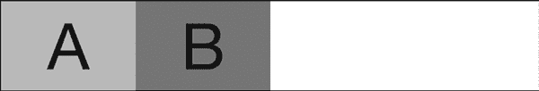
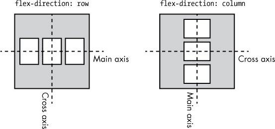
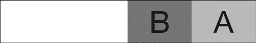
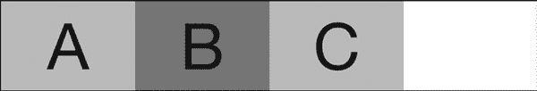
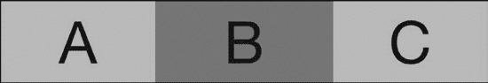
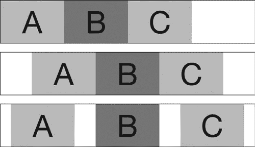
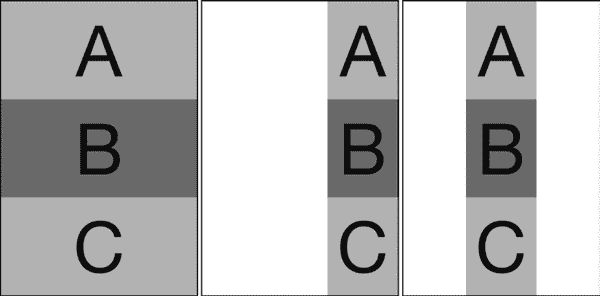
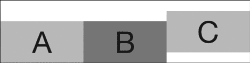
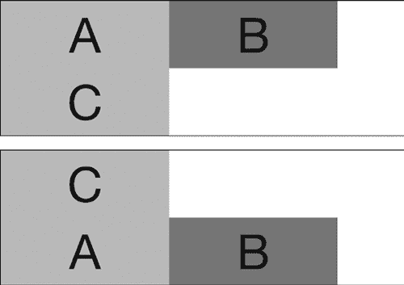
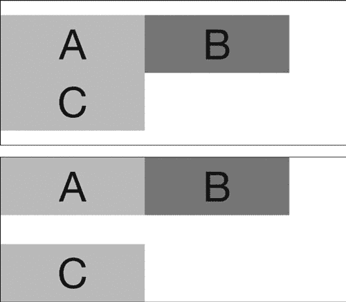

## **15**

**弹性盒布局**


网页看起来如此美观，可以说是一种小小的奇迹（当然，相对而言！）。自从从基于表格的布局转向纯 CSS 布局以来，开发人员经常不得不使用简单的工具，如 `float`、`margin` 和 `position`，来创建复杂的页面结构——这些工具在最初设计时可能并非为了这个目的。随着 CSS 的成熟和浏览器功能的增强，提出了一系列新的替代布局方法。

最广泛实现的方法被称为弹性盒布局（或 *Flexbox*）。这种方法定义在弹性盒布局模块（*[`www.w3.org/TR/css-flexbox-1/`](http://www.w3.org/TR/css-flexbox-1/)*）中，它使得元素能够灵活调整大小，更好地适应可用空间，而无需使用浮动、定位或复杂的计算。

尽管你完全可以使用 Flexbox 创建整个页面布局，但它更适用于处理界面元素和较小的组件。在处理整个页面布局时，建议使用网格布局模块（Grid Layout Module），我将在第十七章中介绍它。但如果你正在构建用户界面或应用程序（尤其是包含许多按钮、表单元素或交互区域的应用），你会发现 Flexbox 非常有用。

### **声明弹性盒模型**

使用 Flexbox 的第一步是创建*弹性容器*——这个父元素将为其内容创建一个新的格式化上下文。要声明一个弹性容器，你只需为 `display` 属性使用一个新值：

```
E { display: flex; }
```

这会创建一个块级弹性容器；如果你更喜欢内联级容器，可以使用 `inline-flex` 值。

现在，你可以将*弹性项目*添加到弹性容器中。弹性项目是弹性容器的任何子项，它会受到容器创建的格式化上下文的影响。例如，在以下代码中，如果 `#container` 被设置为弹性容器，那么这两个子项将成为弹性项目：

```
<div id="container">
  <div id="a">…</div>
  <div id="b">…</div>
</div>
```

这种标记和 CSS 的组合如图 15-1 所示。请注意，这两个元素的宽度相等并且并排排列，无需使用浮动或定位属性。默认情况下，弹性项目会按照文档文本的方向排列——即，对于英语等语言，从左到右排列；对于阿拉伯语等语言，从右到左排列（可以通过 `dir` HTML 属性或 `direction` CSS 属性来指定）；对于日语等语言，从上到下排列（通过 `text-direction` CSS 属性设置，但尚未广泛支持）。



*图 15-1：弹性容器的子项默认水平排列。*

**注意**

*本章其余部分的所有示例都使用从左到右的方向，除非另有说明。*

要更改默认的布局方向，您可以在容器上使用`flex-direction`属性。默认值`row`会将项目排列成一行，而`column`值则会将项目从上到下排列成一列。

```
E {
  display: flex;
  flex-direction: column;
}
```

### **Flexbox 对齐方式**

Flexbox 使用两条轴线进行对齐。如图 15-2 所示，*主轴*沿着项目排列的方向，横向或纵向排列。当`flex-direction`的值为`row`时，主轴是水平的；当它是`column`时，主轴是垂直的。*交叉轴*是与主轴垂直的线：当方向为`row`时，交叉轴是垂直的；当方向为`column`时，交叉轴是水平的。



*图 15-2：主轴和交叉轴取决于 flex 子项的布局方向。*

在处理 flex 容器和项目时，您经常会看到所谓的轴的起点和终点。因为 flex 轴可以被反转（从上到下或从下到上，从左到右或从右到左），所以使用起点和终点，而不是相对方向，以避免混淆。例如，当主轴是水平的且方向是从左到右时，主轴的起点是左侧，终点是右侧；但如果主轴是垂直的，则主轴的起点是在顶部，终点在底部（如果反转则相反）。

### **反转内容顺序**

Flexbox 的一个强大功能是，您可以快速更改项目的显示顺序，而不管它们在 DOM 中的顺序。例如，图 15-1 显示了两个项目按它们在 DOM 中声明的顺序排列成一行。如果您想更改它们的顺序，让`#b`排在`#a`之前，该怎么办呢？

您可以通过`flex-direction`属性快速做到这一点，使用`row-reverse`值来反转 flex 项目的显示顺序，如图所示。（`column-reverse`属性值会反转垂直排列的 flex 项目的顺序。）

```
E { flex-direction: row-reverse; }
```

结果如图 15-3 所示。



*图 15-3：*`*row-reverse*`*值快速反转 flex 项目的顺序。*

由于像这样的方向反转也会反转轴的方向，因此在`row-reverse`的情况下，轴的起点在左侧，终点在右侧；在`column-reverse`的情况下，起点在底部，终点在顶部。

### **完全重新排列内容**

你可以使用`order`属性创建自定义的排序模式。`order`属性应用于 flex 项目（而不是它们的容器）。该属性的值是一个数字，用于创建一个*顺序组*，该组将具有相同值的项目分组，并按顺序组的顺序排列它们：最低编号的顺序组中的所有项目排在最前面，然后是第二低编号顺序组的所有项目，依此类推。任何没有声明值的项目会首先显示，因为它们的默认值为 0。

拥有相同顺序组编号的项目按它们在 DOM 中出现的顺序进行分组。例如，考虑四个 flex 项目，`#a`到`#d`：

```
<div id="container">
  <div id="a">…</div>
  <div id="b">…</div>
  <div id="c">…</div>
  <div id="d">…</div>
</div>
```

如果没有设置显式的值，并且如果`flex-direction`没有被反转，那么子项将按照它们在 DOM 中出现的顺序显示：`#a`、`#b`、`#c`、`#d`。但是，接下来我们通过使用不同的`order`属性值来重新排列它们：

```
#a { order: 2; }
#b, #d { order: 3; }
#c { order: 1; }
```

应用这些规则后，项目的排列顺序变为：`#c`、`#a`、`#b`、`#d`。项目`#c`排在最前面，因为它属于最低编号的顺序组，接着是编号次低的`#a`，然后是`#b`和`#d`——这两者都属于顺序组 3。项目`#d`排在最后，因为它在 DOM 顺序中排得较晚。

图 15-4 显示了结果。


*图 15-4：使用顺序组重新排列的 flex 项目*

注意，`#c`和`#a`共享相同的背景颜色，`#b`和`#d`也是如此。背景颜色应该交替显示，因为我使用了在第四章中讨论的`:nth-child()`伪类：

```
.flex-item:nth-child(even) { background-color: gray; }
```

但请记住，项目只是视觉上改变了顺序；它们在标记中的顺序保持不变，这就是为什么`:nth-child()`将灰色背景应用于应为偶数编号的元素——即`#b`和`#d`。

### **添加灵活性**

使用 Flexbox 时，你几乎肯定会遇到这种情况：沿主轴的 flex 项目的总长度大于或小于 flex 容器的宽度。当这种情况发生时，Flexbox 的“灵活”特性就会发挥作用。几个属性允许 flex 项目根据需要增长或缩小以填充它们的容器。我将在本节中带你了解这些属性。

#### ***`flex-grow`属性***

假设你有一个宽度为 600px 的 flex 容器，里面包含三个 flex 项目。每个项目的宽度是 150px，总宽度为 450px。容器的宽度和项目的总宽度之间的差异留出了 150px 的空白区域（即 600 − 450），如图 15-5 所示。



*图 15-5：三个 flex 项目的总宽度小于其容器的宽度，导致右侧留有空白区域。*

要扩展项目以填充容器，你可以使用`flex-grow`属性：

```
.flex-item { flex-grow: 1; }
```

`flex-grow`属性的值基本上是一个比率，用于在 flex 项目之间分配空余空间，以便它们扩展。在这个例子中，我使用了 1:1:1 的比例，将空余的 150px 均等地分配给三个 flex 项目。因为 150 除以 3 等于 50，每个项目扩展了 50px，使得它们的总宽度等于容器的宽度，如图 15-6 所示。


*图 15-6：这三个 flex 项目现在填充了它们容器的宽度。*

你也可以提供不同的值来调整分配比例。例如，若要使`#b`占据比其他两个项目更多的容器宽度，你可以为`#b`设置一个值为 3：

```
#b { flex-grow: 3; }
```

现在，150px 将按 1:3:1 的比例重新分配，因此对于每一个分配给`#a`和`#c`的像素，`#b`将分配到三个像素。结果是`#a`和`#c`的宽度各自扩展到 180px，而`#b`的宽度将变为 240px，如图 15-7 所示。


*图 15-7：因为* `*#b*` *的`*flex-grow*` *值更高，当调整大小时，它比其他兄弟项更宽。*

因为`flex-grow`的默认值是 0（零），所以 flex 项目会保持它们的宽度，并不会扩展来填充容器，除非明确指示这样做。

#### ***flex-shrink 属性***

就像`flex-grow`用于扩展 flex 项目以填充容器一样，`flex-shrink`用于缩小项目。例如，让我们回到前一节的 flex 容器，包含`#a`、`#b`和`#c`项目；只不过这次我们将每个项目的宽度设为 300px。现在，三个项目的总宽度是 900px，超过了父容器 600px 的宽度，超出部分为 300px。

为了将这些元素缩小到适应容器的宽度，你可以使用`flex-shrink`属性：

```
.flex-item { flex-shrink: 1; }
```

`flex-shrink`属性的作用类似于`flex-grow`，但方向相反。例如，值为 1（默认值）时，每个项目的宽度会按相同比例缩小——每个项目缩小 100px（300 除以 3）。结果是每个项目的宽度为 200px，总宽度为 600px，与容器宽度一致。

像`flex-grow`一样，不同的值会改变分配比例。例如，如果你为项目`#b`使用值为 3，它的宽度将在每次其他两个项目缩小 1px 时，减少 3px。

```
#b { flex-shrink: 3; }
```

较高的数字会更大比例地缩小元素。在这个例子中，`#a`和`#c`的宽度每减少 1px，`#b`的宽度就会减少 3px。正如你在图 15-8 中看到的，`#a`和`#c`的宽度为 240px，而`#b`只有 120px，比它原本的宽度更窄。


*图 15-8：Flex 项目* `*#b*` *的`*flex-shrink*` *值比它的兄弟项更高，因此它被按比例缩小以适应容器。*

#### ***flex-basis 属性***

Flex 项目的宽度可以通过它们包含的内容或明确的 `width` 值来设置，任何扩展或收缩都是基于这个基准宽度来计算的。要改变宽度调整的计算方式，可以在元素上设置 `flex-basis` 值。这个属性的值可以是一个长度单位。以下是一个示例：

```
.flex-item { flex-basis: 100px; }
```

当应用 `flex-basis` 时，任何现有的 `width` 值将被忽略，而你为 `flex-basis` 指定的值将用于计算调整。例如，在前两节中，150px 的 `width` 值被忽略，所有的扩展或收缩都是基于 `flex-basis` 值 100px 来进行的。你可以在 图 15-7 中将 `#b` 的 `flex-basis` 值设置为 100px，如下所示：

```
.child-item {
    flex-grow: 1;
    width: 150px;
}
#b {
    flex-basis: 100px;
    flex-grow: 3;
}
```

现在容器中的空白区域将按照 1:3:1 的比例重新分配，这意味着根据 `width` 值，`#a` 和 `#c` 各自会扩展 30px，而 `#b` 会扩展 90px。然而，由于 `flex-basis` 值的存在，这种空间分配的方式就像 `#b` 的宽度是 100px，而不是指定的 150px 宽度。

起初，似乎不合逻辑，尽管 `#b` 的 `flex-basis` 值设置得较小，最终它的宽度却大于兄弟项。原因是现在有 200px 的空闲宽度（flex 项目的总宽度为 400px，而父容器为 600px）。这 200px 将按 1:3:1 的比例在三个盒子之间重新分配。虽然 `#b` 起始时宽度为 100px，但它获得了 120px 的空余空间，而 `#a` 和 `#c` 各自获得了 40px。

结果是，`#a` 和 `#c` 最终宽度为 190px，而 `#b` 的宽度为 220px。将 图 15-9 中的结果与 图 15-7 进行比较，你可以看到它们之间的区别。



*图 15-9: 因为* `*#b*` *应用了* `*flex-basis*` *值，它的尺寸被调整得比兄弟项更大。*

#### ***Flex 简写属性***

与许多属性一样，`flex-*` 系列也有一个简写属性，叫做 `flex`。它的值依次是 `flex-grow`、`flex-shrink` 和 `flex-basis`。考虑以下示例：

```
E { flex: 1 2 150px; }
```

在这里，元素 `*E*` 的 `flex-grow` 值为 1，`flex-shrink` 值为 2。使用的值是根据 flex 项目与它们的 flex 容器的宽度进行选择的；当 flex 项目没有填满容器时，使用 `flex-grow` 值，而当 flex 项目超出容器时，则使用 `flex-shrink` 值。最终的值 150px 是 `flex-basis` 值。

### **容器内的对齐**

当你在一个 flex 容器中有固定尺寸的项目时，通常会在一个或两个轴上留下空白区域。例如，在 图 15-5 中，三个每个宽度为 150px 的 flex 项目并没有填满它们的 600px 容器。当出现这种情况时，你可以在容器内对项目进行对齐，以更好地利用可用空间。

#### ***水平对齐与 justify-content***

幸运的是，Flexbox 提供了对对齐和定位的精确控制，允许你使用`justify-content`属性重新分配未使用的空间。此属性应用于弹性容器，并接受一系列关键字值，根据弹性父容器的方向（如行、列、反转行等）以不同方式应用：

```
.flex-container { justify-content: keyword; }
```

默认值是`flex-start`，这将所有弹性项对齐到父容器的左侧，未使用的空间占据剩余的右侧宽度。图 15-5 展示了这一效果。其他可选值包括：

• `flex-end`，将项目对齐到容器的右侧，未使用的空间位于左侧

• `center`，将未使用的空间分配到所有项目两侧，使项目居中

• `space-between`，在每个项目之间添加相等的空间，但第一个和最后一个项目之间没有空间

• `space-around`，在每个项目的两侧留有相等的空白

以下代码展示了一些不同的值供比较，结果见图 15-10。

```
.container-a { justify-content: flex-start; }
.container-b { justify-content: center; }
.container-c { justify-content: space-around; }
```



*图 15-10：`*justify-content*`属性的不同值：* `*flex-start*` *(顶部)，* `*center*` *(中间)，和* `*space-around*` *(底部)*

#### ***使用 align-items 进行垂直对齐***

当你的弹性项高度小于弹性容器的高度时，可以使用`align-items`属性来调整容器内的项目：

```
.flex-container { align-items: keyword; }
```

此属性的主要关键字值包括：

• `stretch`，使项目与父容器高度相同

• `flex-start`，将项目对齐到容器的顶部

• `flex-end`，将项目对齐到容器的底部

• `center`，将项目对齐到容器的垂直中心，上下方留有相等的空白

如果项目没有明确指定高度，则默认值为`stretch`，如果有则为`flex-start`。

在下面的代码示例中，我将弹性容器的`flex-direction`值设置为`column`，因此主轴是垂直的，交叉轴是水平的。图 15-11 展示了结果。

```
.container-a { align-items: stretch; }
.container-b { align-items: flex-end; }
.container-c { align-items: center; }
```



*图 15-11：交叉轴对齐通过不同的`*align-items*`值进行控制：* `*stretch*` *(左)，* `*flex-end*` *(中)，和* `*center*` *(右)*。*

注意，在未设置明确宽度的情况下，第二列和第三列中的弹性项仅根据其内容的宽度来设置大小，然后根据容器的`align-items`值进行对齐。

#### ***使用 align-self 进行交叉轴对齐***

要控制单个项目在交叉轴上的对齐方式，请使用`align-self`属性。此属性适用于项目，而不是容器。其值与`align-items`相同，且仅对选中的项目产生影响；兄弟项目不受影响。

例如，在以下代码中，元素`#c`的值与其兄弟元素不同：

```
.container { align-items: flex-end; }
#c { align-self: flex-start; }
```

效果（使用默认的行方向）如图 15-12 所示。



*图 15-12：弹性项* `*#c*` *由于* `*align-self*` *属性的作用，与其兄弟元素的对齐方式不同。*

#### ***换行与流动***

当容器中的项太多，无法舒适地放入一行（或一列）时，你可以使用`flex-wrap`属性将它们分布到多行中。`nowrap`的默认值将所有项保持在同一行，而`wrap`的值则会在需要时将它们分到第一行下方的额外行中（或在列视图中向右分布）。

```
.flex-container { flex-wrap: wrap; }
```

`wrap-reverse`的值会改变交叉轴的方向，使新的行出现在上方（或左侧）。图 15-13 对比了这两个不同值的效果。



*图 15-13：对比不同`*flex-wrap*`属性值的效果。顶部示例的值为`*wrap*`，因此元素`*#c*`出现在下方的新行中，而底部示例的值为`*wrap-reverse*`，因此元素`*#c*`出现在上方的新行中。*

#### ***flex-flow 简写***

你可以将`flex-wrap`与`flex-direction`结合，使用`flex-flow`属性的简写形式。例如，要设置一个带有多行并且交叉轴反转的列，可以使用以下代码：

```
E { flex-flow: column wrap-reverse; }
```

#### ***使用 align-content 对齐多行***

当项目在多行中换行时，你可以通过`align-content`属性控制它们的对齐方式。此属性的作用类似于`justify-content`，但应用于交叉轴。它具有相同的可能值——`flex-start`、`flex-end`、`center`、`space-between`和`space-around`——并且还添加了`stretch`，它会调整项的大小以填充所有未使用的空间。图 15-14 对比了`center`和`space-between`值的效果。



*图 15-14：当弹性项被换行时，交叉轴上的对齐由*`*align-content*`*控制：*`*center*`*（顶部）和*`*space-between*`*（底部）。*

### **浏览器支持和遗留语法**

在写这篇文章时，Flexbox 已经在所有主流现代浏览器中得到了很好的实现，但它有着长时间的语法变更历史，支持一些较旧的浏览器可能会比较麻烦。例如，Internet Explorer 10 实现了该规范的早期版本，所有属性都使用 `-ms-` 前缀。IE10 实现与现代规范有一些关键区别：IE10 使用 `-ms-flexbox` 作为 `display` 属性的值名称，而不是 `flex`；并且使用 `-ms-flex-align` 和 `-ms-flex-pack`，而不是 `align-items` 和 `justify-content`（它们的值也略有不同）。IE10 还没有实现 `flex-wrap` 或 `flex-flow` 简写。如果你需要支持 IE10，建议阅读关于该规范差异的 IE10 开发者指南 (*[`msdn.microsoft.com/en-us/library/ie/hh673531%28v=vs.85%29.aspx`](http://msdn.microsoft.com/en-us/library/ie/hh673531%28v=vs.85%29.aspx)*)。

旧版本的 WebKit 核心浏览器，特别是 Safari 6 及以下版本，使用了更为过时的语法。如果你真的需要完全支持这些旧浏览器，可以查看 Stephen Hay 2009 年的介绍文章 (*[`www.the-haystack.com/2010/01/23/css3-flexbox-part-1/`](http://www.the-haystack.com/2010/01/23/css3-flexbox-part-1/)*).

但不要让这些问题阻止你使用 Flexbox。只有少数几个浏览器需要这些较旧的属性，只需稍加努力，你就能利用 Flexbox 带来的布局优势。

### **总结**

尽管它为 CSS 引入了许多不熟悉的新术语和概念，但 Flexbox 是一个优雅且合乎逻辑的提案，解决了网站布局中几个常见的问题。Flexbox 比起写作，亲自实践学习要容易得多！

花时间完全理解 Flexbox 是非常值得的，因为它引入的许多新概念和关键字现在在其他布局模块中也至关重要，这使得它成为 Web 上丰富布局未来的核心。

### **Flexbox: 浏览器支持**

|  | **Chrome** | **Firefox** | **Safari** | **IE** |
| --- | --- | --- | --- | --- |
| 弹性盒布局 | 是 | 是 | 是^(*) | IE10^(†), IE11 |

* 带有厂商前缀

† 支持旧的语法，并带有厂商前缀
