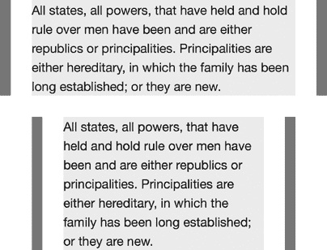

## 16

**值和尺寸**


CSS3 的许多新特性，从新的选择器到布局和字体属性，都是为了给你比 CSS2.1 提供更多的展示控制。这种控制将在本章中更加明显，我将介绍新的值函数和单位，以及自动计算尺寸的方法。

### 相对长度单位

在 CSS 中，*相对长度单位* 是指其值相对于其他属性的单位。CSS2.1 中的两个相对单位是 `em`，它是根据元素的 `font-size` 属性计算的，和 `ex`，它是根据元素字体的 x-height（参见 “`font-size-adjust`” 在 第 56 页）计算的。

CSS3 扩展了相对单位的范围，这些单位不再仅仅相对于元素的字体大小。新单位定义在“值和单位模块”（*[`www.w3.org/TR/css-values/`](http://www.w3.org/TR/css-values/)*）中。

#### *根相对单位*

CSS3 中引入的第一个新单位是 `rem`，或称 *根 em*。它的行为类似于 CSS2.1 中的 `em` 单位，但不同的是，它不是相对于当前元素的 `font-size` 值，而是相对于文档根元素（`html` 元素）的 `font-size` 值。

尽管 `em` 很有用，但也不是没有缺点，尤其是在嵌套元素时，这些缺点会变得更加明显。为了说明这个问题，我将使用以下标记：

```
<ul>
    <li>Western gorilla
        <ul>
            <li>Western lowland gorilla</li>
            <li>Cross River gorilla</li>
        </ul>
    </li>
</ul>
```

以及这个简单的样式规则：

```
li { font-size: 2em; }
```

如果假设文档的根`font-size`是常见的浏览器默认值 16px，那么第一个 `li` 元素的计算`font-size`将是 32px（16 乘以 2）。但嵌套在第一个 `li` 内的 `li` 元素的 `font-size` 将相对于继承的值计算，使得它们的字体大小为 64px（32 乘以 2）。

这时，`rem` 单位变得至关重要。这里是与前一个示例相同的代码，只不过这次使用了 `rem` 替代了 `em` 单位：

```
li { font-size: 2rem; }
```

同样假设根 `font-size` 为 16px，第一个 `li` 的计算 `font-size` 为 32px。然而，这时嵌套的 `li` 元素的 `font-size` 也相对于根值计算，与它们的父元素相同。无论嵌套层级如何，这个值始终相对于根元素。

#### *视口相对单位*

在构建响应式设计时，开发人员往往使用百分比值来进行布局，因为它们可以在不同屏幕尺寸的范围内流畅缩放，以适应各种网站需求。百分比在顶层非常有用，但正如你刚才看到的，使用 `em` 单位时，在嵌套元素中使用百分比可能会遇到困难。

这段代码说明了问题：

```
<div class="parent">
    <div class="child">…</div>
</div>
```

现在，假设 `.parent` 占视口宽度的 75％，你希望 `.child` 占视口宽度的 65％——而不是它父元素的宽度。要做到这一点，你需要将 65 除以 75，得到 86.666（百分比）。这个计算相对简单，但嵌套层次越深，计算就会变得越复杂。

一个更好的解决方案是使用 CSS3 的视口相对单位——`vh` 和 `vw`，它们分别表示视口的高度和宽度。每个单位的值代表适当视口维度的 1％：1vh 是视口高度的 1％，1vw 是视口宽度的 1％。例如，以下代码使元素占视口宽度的 75％，高度的 50％：

```
E {
    height: 50vh;
    width: 75vw;
}
```

使用这些单位的好处是，当元素嵌套时，这些单位仍然相对视口。因此，在我之前的例子中，要让 `.child` 占视口总宽度的 65％，只需这样做：

```
.child { width: 65vw; }
```

不需要计算！

还有一对补充单位可用：`vmax` 等于 `vh` 和 `vw` 中较大的一个值，`vmin` 等于较小的值。例如，如果视口为 480×640，视口高度较大，那么 `vmax` 等于 `vh`，而 `vmin` 等于 `vw`。如果交换视口的尺寸（640×480），那么 `vmax` 和 `vmin` 的值就会互换。

假设视口为 480×640，在以下代码片段中，元素`*E*`的宽度为 640px，元素`*F*`的宽度为 480px：

```
E { width: 100vmax; }
F { width: 100vmin; }
```

`vmax` 和 `vmin` 的作用是确保元素在任何方向下都能保持与视口的比例关系——当方向可能轻松变化时非常有用，比如在移动设备或平板上。

Internet Explorer 9 实现了 `vmin` 作为 `vm` 单位，但它和 IE10 都不支持 `vmax`（在 IE11 中才开始支持）。许多旧版智能手机浏览器不支持这些属性，尽管较新版本（如 iOS 6.0 和 Android 4.4 及以上版本）支持它们（尽管通常不支持 `vmax`，特别是在 iOS 中，截至目前为止）。

### 计算值

CSS3 的最大变化之一在于长度声明的方式。在 CSS2.1 中，长度总是一个数值加上一个单位，如果需要计算（例如，减去边框宽度以得到总宽度），开发者必须手动计算。但在 CSS3 中，浏览器会自动进行计算。

CSS 计算通过 `calc()` 函数进行。你可以在使用常见值单位（如长度、角度、数字等）的任何地方使用此函数。它的参数是使用这些常见值单位和四个基本运算符（`+`（加法）、`-`（减法）、`*`（乘法）和 `/`（除法））的任何数学表达式。

`calc()` 函数在混合单位时特别有用。例如，你可以创建一个表达式来计算元素的宽度（作为百分比），减去它的边框（作为 `em` 单位），像这样：

```
E {
    border: 10px;
    width: calc(75% - 2em);
}
```

加法和减法可以使用任何单位进行运算，但在进行乘法时，操作数两侧至少有一个参数必须是无单位的数字。对于除法，*操作数之后*的参数必须是无单位的数字。以下是如何进行乘法和除法的示例：

```
E {
    left: calc(5 * 10em);
    width: (80% / 4);
}
```

你可以在表达式中使用括号来显示计算顺序。例如，以下代码展示了一个进行三次计算的表达式：

```
E { height: calc(10% * 5 + 15% * 2); }
```

该表达式首先将 10% 乘以 5，然后将其加到 15% 乘以 2 的结果上。这个设置很好，但乍一看并不容易理解，考虑到复杂的计算，可能确实难以立即明白。将其写成带有括号的形式后，表达式就容易理解了：

```
E { height: calc((10% * 5) + (15% * 2)); }
```

你还可以使用嵌套的`calc()`函数来实现相同的结果。

在表达式中使用乘法或除法时，你必须在操作数周围插入一个空格字符——如果没有这样做，表达式将无效，属性也会被忽略。以下代码展示了两次写出的表达式：第一个是无效的，因为操作数周围没有空格；第二个是格式正确的，因此有效。

```
E { border-width: calc(1em*10); } /* Invalid */
E { border-width: calc(1em * 10); } /* Valid */
```

### 元素尺寸

元素的大小通常通过`width`或`height`属性来设置，或者通过它们的`max*-*`和`min*-*`变体，结合绝对值（`px`）、相对值（`em`）或百分比值。虽然这些选项对于大多数日常使用来说已经足够，但我常常发现有时候我希望盒模型能更灵活一些，或者能更好地感知周围的元素。CSS3 引入了新的属性和值，旨在通过盒模型切换和新的内容感知尺寸方法提供这种额外的灵活性。

#### *盒模型尺寸*

多年来，Internet Explorer 实现的盒模型违反了 W3C 规范。W3C 模型规定 `width` 值表示内容框的宽度，任何填充和边框都是额外的。而在 IE 的模型中，`width` 值等于元素的总宽度，包括任何填充和边框。请看以下样式规则：

```
E {
    border: 5px;
    padding: 10px;
    width: 100px;
}
```

在 IE 模型中，内容框的宽度为 70px，而在 W3C 模型中，它则是完整的 100px。

虽然标准模型更为逻辑，但有时 IE 模型更方便使用。在 CSS3 中，你可以选择使用 IE 模型，方法是使用 `box-sizing` 属性，详细说明可以参考 CSS3 基本用户界面模块（*[`www.w3.org/TR/css3-ui/`](http://www.w3.org/TR/css3-ui/)*）。其语法如下：

```
E { box-sizing: keyword; }
```

默认关键字是`content-box`，这意味着只将指定的`width`或`height`应用于内容框，就像在 W3C 模型中一样。相比之下，替代值`border-box`意味着任何指定的长度都应包括任何填充和边框框。

图 16-1 显示了两者的区别。顶部示例使用了 W3C 盒模型，而底部示例应用了 `border-box` 值。正如你所看到的，底部示例的总宽度等于顶部示例的内容框宽度。



*图 16-1：比较 `*box-sizing*` 值：默认的 `*content-box*` *(顶部) 和 `*border-box*` *(底部)*

**注意**

*有些人喜欢设置一个全局样式规则，将* `*border-box*` *应用于所有元素。我更倾向于根据需要才应用这个规则。*

#### *内在与外在尺寸*

在网页布局中，一个挑战是元素对其内容以及使用上下文毫无感知——换句话说，若没有 JavaScript，元素无法感知其子元素或父元素的尺寸。CSS3 引入了一个新概念，通过添加*内在*和*外在*尺寸，稍微改变了这个局面。内在尺寸基于元素的子元素，而外在尺寸基于父元素的尺寸。这些尺寸模型在 CSS3 内在与外在尺寸模块中有所定义（*[`dev.w3.org/csswg/css-sizing/`](http://dev.w3.org/csswg/css-sizing/)*）。

所有内在和外在尺寸模型都通过在 `width` 或 `height` 属性上使用关键词值来应用（以及它们的 `min-` 和 `max-` 变体）。例如，以下列表展示了如何将新尺寸模型应用于 `width`：

```
E { width: keyword; }
```

##### max-content 和 min-content

第一个新关键词值，`max-content` 和 `min-content`，是内在值，它们让元素的宽度或高度与其包含的内容中最大（`max-content`）或最小（`min-content`）项的大小相同（对于文本来说，就是最长单词的宽度）。考虑以下包含 `img` 和 `p` 元素的 `div` 元素标记：

```
<div>
    
    <p>…</p>
</div>
```

假设 `img` 元素的宽度为 200px，`p` 的宽度为 300px。如果 `div` 元素的 `width` 值为 `max-content`，它将刚好足够宽以容纳 `p`，而如果其值为 `min-content`，它将刚好足够宽以容纳 `img`，且 `p` 中的文本会换行。

比较 图 16-2 中显示的结果。左侧的容器元素应用了 `max-content` 值，这使它的宽度与最宽的子元素（`p`）相同，而右侧的容器元素应用了 `min-content`，使它的宽度与最窄的子元素（`img`）相同。


*图 16-2：* `*max-content*` *值（左）使元素宽度与其最宽的子元素相同，而* `*min-content*` *(右) 使元素宽度与其最窄的子元素相同。*

**注意**

*截至目前，当前的桌面和移动版本的 Chrome、Firefox 和 Safari 支持这些关键词，尽管每个浏览器需要厂商前缀（即 `*-moz-min-content*` 和 `*-webkit-min-content*`）。目前，Internet Explorer 和旧版智能手机不支持这些关键词。*

##### fit-content

下一个内在关键字值可能是最有用的。它叫做 `fit-content`，它让元素像浮动元素或表格单元格一样调整大小：元素将扩展，刚好足够容纳其内容，除非元素的最大宽度已达到，此时，内容将换行。

图 16-3 比较了 `fit-content` 与 `max-content` 和 `min-content` 的效果。左上方的框使用了 `fit-content`，当内容达到父容器的限制时，内容会换行。相反，右上方的框使用了 `max-content`，因此它会扩展以适应内容——然而，该框现在超出了父容器的宽度，父容器的 `overflow` 属性值为 `hidden`，意味着该框被裁剪了。

左下角的框也应用了 `fit-content`，因此容器会调整大小以适应内容的宽度；右下角的框应用了 `min-content`，因此容器的宽度仅与 `img` 元素一样，文本内容会换行。


*图 16-3：* `*fit-content*` *值，与* `*max-content*` *和* `*min-content*` *进行比较*

##### fill

规范中的最后一个关键字叫做 `fill`。（但在 Firefox 中是 `available`，在 Chrome 中是 `fill-available`！）这个外部值使元素填充其父容器的可用高度或宽度。

假设你想让一个带有边框和内边距的内联块级 `p` 元素，扩展到和它的父元素一样宽。通常，你会应用以下规则：

```
p {
    border-width: 0 0.5em;
    display: inline-block;
    padding: 0 1em;
    width: 100%;
}
```

然而，正如你所知，一个元素的“真实”宽度还包括内边距和边框，因此，在这种情况下，`p` 元素会超出其父容器的范围。一种解决方案是使用 `box-sizing` 属性（请参见 “Box Sizing” 在 第 203 页），但你可能有充分的理由保持标准的盒模型，所以更好的替代方案是使用内在尺寸：

```
p { width: fill; }
```

结果如 图 16-4 所示；带有边框和内边距的内联块元素被调整大小以填充其父容器中的可用空间。


*图 16-4：使用* `*fill*` *值来设置* `*width*` *使得如图所示的内联块标题填充其父容器的可用宽度。*

### 总结

在本章中，我讨论了与根字体大小和视口相关的值单位、动态计算值以及基于内容和上下文对元素进行尺寸调整的 CSS3 方法。我还讨论了 CSS3 对不同盒模型的切换。

虽然单位和尺寸方法可能看起来是 CSS 中不太引人注目的部分，但它们能为你提供对布局的精细控制，这是非常值得欢迎的。由于网站会在各种不同的设备上查看，能让元素感知其视口、内容和上下文，并以最合适的方式呈现内容，是极其有价值的。

### 值和尺寸：浏览器支持

|  | **Chrome** | **Firefox** | **Safari** | **IE** |
| --- | --- | --- | --- | --- |
| 根元素相对单位 | 是 | 是 | 是 | 是 |
| 视口相对单位 | 是 | 是 | 是^(*) | IE9^(†)，IE10^(‡) |
| 计算值 | 是 | 是 | 是 | 是 |
| 盒子模型尺寸 | 是 | 是 | 是 | 是 |
| 内部/外部尺寸 | 是^(§) | 是^(§) | 是^(§) | 否 |

* iOS 中的`vh`支持有问题

† 支持`vm`代替`vmin`，不支持`vmax`

‡ 不支持`vmax`

§ 带有供应商前缀
