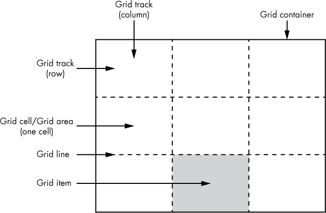
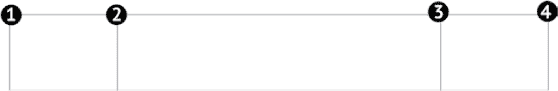
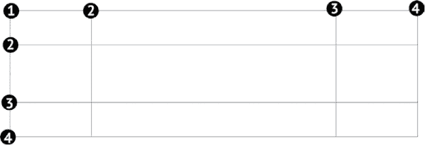
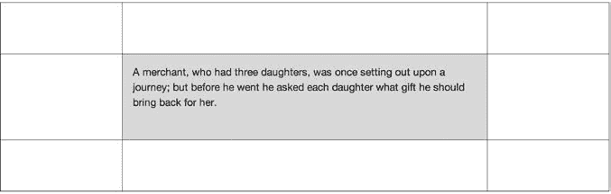
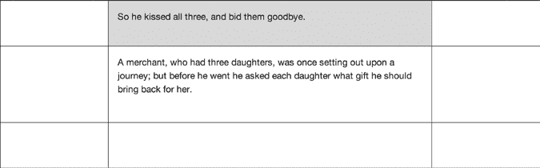
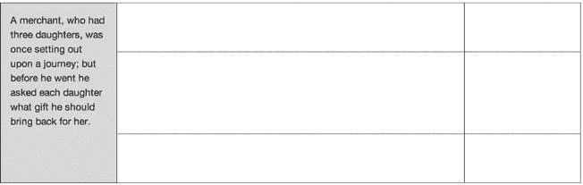
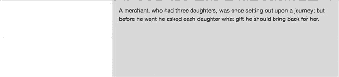
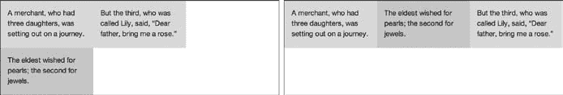
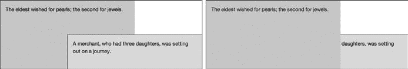
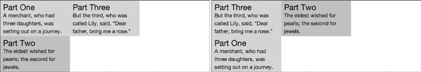

## 第十七章：17

**GRIDLAYOUT**


网格是一个基本的设计技巧。自中世纪以来，书法家就使用简单的网格，而现代排版网格自 20 世纪下半叶开始使用。近年来，已经有一些努力将基于网格的设计引入到网页中，许多框架使用浮动、内边距和外边距来模拟印刷的可能性，尽管这些努力总是显得有些脆弱的临时解决方案。

然而，最近浏览器开始实现原生的 CSS 网格布局系统，具体内容可以参考网格布局模块 (*[`www.w3.org/TR/css-grid-1/`](http://www.w3.org/TR/css-grid-1/)*)。该模块提供了一系列专门设计用于在屏幕上创建网格的属性，这意味着开发者不再需要将它们从现有的属性和行为中拼凑出来。

网格布局模块中的属性范围非常广泛，因此我将重点讲解最直接有用的部分，而不会陷入那些可能会造成混淆的细节中。在合适的地方，我会标明我省略了一些细节。

### 网格术语

在介绍新的 CSS 网格语法之前，我将解释一下在网格布局模块中使用的一些术语。即使你认为自己对排版网格已经很熟悉，也请花时间阅读这些定义，因为 CSS 网格中使用的术语与传统排版网格有很大不同。

以下是网格布局模块中使用的关键术语：

**网格容器** 作为边界的容器元素，定义网格的维度。

**网格线** 行和列之间的分隔线。这些线是概念性的，而非实际存在的。

**网格轨道** 行和列的简写名称。网格中创建的每一列或行都被称为 *轨道*。轨道是线条之间的空间。

**网格单元格** 每一列和行的交点都创建一个 *单元格*，它们就像表格中的单元格一样。

**网格区域** 一个单元格或多个单元格，标记了 *网格项* 将要放置的区域。

**网格项** 每一个放置在网格中的子元素。

网格是通过首先在网格容器上设置若干线条来创建的一系列轨道。然后，网格项通过将线条作为坐标来定位在轨道上，从而创建区域，具体如 图 17-1 所示。



*图 17-1：一个简单的 3×3 网格，展示了 CSS 网格布局语法中使用的核心术语*

网格线是单元格之间的线条。它们定义了一系列行和列，并为坐标定位编号。（我会在本章中逐步解释这个概念。）

### 声明和定义网格

创建网格的第一步是声明 *网格容器*，即作为网格基础的元素。网格容器的尺寸是网格的边界，网格的所有属性都应用于它。要声明网格容器，可以使用 `display` 属性，并将新值设置为 `grid`，如下所示：

```
E { display: grid; }
```

这条声明创建了一个块级的网格容器。下一步是定义其轨道（行和列）。你可以在 *显式网格* 中定义轨道，设置精确数量的列和行，或者在 *隐式网格* 中定义轨道，这个网格是根据其内容自动生成的。你也可以将显式网格和隐式网格结合使用，我将依次解释这两者。

#### *通过设置轨道大小来创建显式网格*

在显式网格中，你可以通过设置一对属性：`grid-template-columns` 和 `grid-template-rows` 来定义特定数量的网格轨道及其大小。每个属性的值是一个由空格分隔的长度列表，用于设置列的宽度或行的高度。例如，以下代码片段创建了一个三列的网格，其中第一列和最后一列设置为网格容器宽度的 20%，第二列设置为 60% 的宽度：

```
E { grid-template-columns: 20% 60% 20%; }
```

你可以使用百分比或任何长度单位，包括称为 *分数（fr）* 的特殊网格长度单位。1fr 等于网格中任何未分配长度的等份。让我来解释一下我的意思。看看这段代码，其中网格容器的宽度为 600px，三个列的宽度各自已定义：

```
E {
    display: grid;
    grid-template-columns: 100px 100px 200px;
    width: 600px; }
```

列的总宽度是 400px，比容器的宽度少了 200px。在这种情况下，添加一个宽度为 1fr 的列将使该列的宽度与剩余空间相等，即 200px：

```
E { grid-template-columns: 100px 100px 200px 1fr; }
```

再添加一个相同宽度的列，使得两个列的宽度各自为 100px：

```
E { grid-template-columns: 100px 100px 200px 1fr 1fr; }
```

将其中一列设置为 3fr 的宽度意味着剩余的宽度将被分为四等份，每份 50px，这样 1fr 等于 50px，3fr 等于 150px：

```
E { grid-template-columns: 100px 100px 200px 1fr 3fr; }
```

回到本节的第一个示例，你可以将百分比替换为 fr 单位，以实现相同的效果：

```
E { grid-template-columns: 1fr 3fr 1fr; }
```

**注意**

*关于使用分数布局网格的优势，请参见 第 213 页的“分数与百分比”部分。*

这段代码实际上定义了三个网格线，另外一个网格线会自动在书写方向的开始位置（对于从左到右书写的语言来说就是左边）创建。这些网格线创建了三个垂直的网格轨道或列，如 图 17-2 所示。



*图 17-2：一个简单的三列网格，比例为 1:3:1（为清晰起见添加了网格线和编号）*

添加行的方式与此相同。例如，要创建三个行，第一行高度为 60px，第二行的值为 `auto`，使其根据内容高度自动调整，第三行高度为 5em，你可以使用以下代码：

```
E { grid-template-rows: 60px auto 5em; }
```

结合这些属性可以让你完全定义你的网格。例如，这段代码创建了一个基本的 3 列 3 行的网格，共计九个单元格：

```
E {
  display: grid;
  grid-template-columns: 1fr 3fr 1fr;
  grid-template-rows: 60px auto 5em;
}
```

这个网格的列按 1:3:1 的比例分布，行的高度是：顶部为 60px，底部为 5em，中间行的高度设置为自动，以适应其内容。最终生成的网格大致如图 17-3 所示。



*图 17-3：一个 3×3 的显式网格（为清晰起见添加了线条和数字）*

**分数与百分比**

当单独使用时，百分比和分数是可以互换的。例如，在这段代码中，这两个规则产生相同的结果：

```
E { width: 50% 50%; }
F { width: 1fr 1fr; }
```

它们的区别在于，当与 `px` 或 `em` 等长度单位混合使用时。假设你有一个包含 15em 列的网格，并且你希望用两个相同大小的列填充剩余的空间。使用百分比，你实际上无法做到这一点，除非你知道容器的宽度，并且愿意进行一些复杂的计算。你可能会想使用 `calc()`（参见第十六章）来实现这一点：

```
E { grid-template-columns: 15em calc(50% - 7.5em) calc(50% - 7.5em); }
```

但规范并未明确 `calc()` 是否被允许，而且当前的网格实现（截至本文编写时）并不允许这样做。

在这些情况下，分数比百分比更有用。回想一下，网格的分数（fr）会为任何尚未分配的空间留出一个相等的份额，因此你为这个示例编写的基于分数的代码就清晰了：

```
E { grid-template-columns: 15em 1fr 1fr; }
```

在这里，网格中任何未分配的宽度将被平分成两个相同大小的列。

尽管如此，尽管你有时可能能在网格中轻松使用百分比，但分数更简单。

#### *在显式网格中放置项目*

每个网格容器的直接子元素都会成为一个网格项，并应当放置在网格中。为此，你需要通过一组放置属性来为该项目分配一个单元格坐标。其中第一个属性是 `grid-column-start` 和 `grid-row-start`，每个属性的值都是一个整数。这个数字指代网格轨道的起始线（无论是列还是行），多个轨道引用组合起来就形成了单元格的坐标。

例如，要将一个项目放置在第二行第二列的单元格中，你可以使用这段代码（图 17-4 显示了结果）：

```
F {
  grid-column-start: 2;
  grid-row-start: 2;
}
```



*图 17-4：一个项目被放置在网格中的第二行第二列（为清晰起见添加了线条）*

`grid-column-start` 和 `grid-row-start` 属性的默认值都是 1，因此省略其中一个值会将项目放置在第一行或第一列。例如，以下代码将项目放置在第一行第二列的单元格中，如图 17-5 所示：

```
G { grid-column-start: 2; }
```



*图 17-5：第二个项目被放置在网格中的第一行第二列（为清晰起见添加了线条）*

默认情况下，项目只会适配到指定的单元格，如果内容超出单元格，则会垂直溢出。你可以通过使用`grid-column-end`和`grid-row-end`属性，让项目扩大尺寸，创建一个覆盖多行或多列的区域。就像它们的对等属性一样，这些属性接受一个单一的整数值，指定单元格应结束的线条。例如，要让项目跨越三行，从第 1 行开始，到第 4 行结束，代码如下：

```
F {
    grid-row-start: 1;
    grid-row-end: 4;
}
```

默认情况下，项目会放置在第一列；它从第 1 行开始，到第 4 行结束，意味着它跨越三行，如图 17-6 所示。



*图 17-6：一个位于网格中，跨越第一列三行的项目（为清晰起见添加了线条）*

作为刚才展示方法的替代方案，你可以使用`span`关键字，后面跟着项目跨越的轨道数量。重写后的规则如下：

```
F { grid-row-end: span 3; }
```

当你想对网格项目的起始行保持不确定性，但始终希望它跨越相同数量的列时，`span`关键字就变得非常有用。

#### *网格放置简写属性*

写四个单独的属性来将元素放置在网格中似乎有些冗长，实际上，简写属性将使你的代码更加简洁。相关的属性是`grid-column`和`grid-row`，每个属性的语法相同。第一个，`grid-column`是`grid-column-start`和`grid-column-end`的简写，中间用斜杠分隔；`grid-row`同理，它是`grid-row-start`和`grid-row-end`的简写。

我将演示如何使用它们。看一下应用于同一元素的所有单独属性：

```
F {
    grid-column-start: 2;
    grid-column-end: 3;
    grid-row-start: 1;
    grid-row-end: span 3;
}
```

使用简写属性，你可以用更简洁的方式编写这些规则：

```
F {
    grid-column: 2 / 3;
    grid-row: 1 / span 3;
}
```

如果即使是两个属性对你来说也太复杂了，实际上你可以将所有这些指令合并为一个简写规则`grid-area`，它涵盖了所有四个属性。基本语法如下：

```
F { grid-area: row-start / column-start / row-end / column-end; }
```

插入适当的值会得到这个非常简洁——尽管可以说，阅读起来可能更难——的规则：

```
F { grid-area: 1 / 2 / span 3 / 3; }
```

#### *重复网格线*

尽管简单的网格适用于一些实际情况，但更复杂的网格能够提供对内容的更精细控制。在大型排版网格中，拥有超过 12 列是很常见的，每列之间通常有一个*空隙*（空白区域）。使用网格布局语法定义 12 列网格可能会显得重复，正如你在这段代码中看到的，我已经映射出了 12 列，每列宽度为 1fr，它们之间有 10px 的空隙：

```
E { grid-template-columns: 1fr 10px 1fr 10px 1fr 10px 1fr
10px 1fr 10px 1fr 10px 1fr 10px 1fr 10px 1fr 10px 1fr 10px 1fr 10px 1fr; }
```

你可以使用`repeat()`函数来避免在使用更大网格时重复这种类型的操作。该函数接受两个参数：一个整数，用于设置重复的次数，后跟一个逗号分隔符，以及要重复的网格线值。例如，以下规则创建了与前一个示例相同的网格，但更简洁；它定义了一个 1fr 宽的轨道，然后使用`repeat()`创建一个模式，其中包含一个 10px 的间隙，后跟一个 1fr 列，重复十一次，总共创建了 12 列，每列宽度为 1fr。

```
E { grid-template-columns: 1fr repeat(11, 10px 1fr); }
```

#### *命名的网格区域*

除了基于坐标将项目放置到网格中外，你还可以使用`grid-template-areas`属性将项目放置到*命名区域*中。使用此属性，你可以通过一系列唯一的标识符在文本字符串中为网格区域命名。这里，我将展示我的意思：

```
  E {
➊    display: grid;
➋    grid-template-areas: 'a b c';
➌    grid-template-columns: repeat(3, 1fr);
  }
```

这两条规则现在应该很熟悉了：第➊行将元素设置为网格容器，第➌行创建三个宽度为 1fr 的列。第➋行使用`grid-template-areas`属性为每一列命名：在这个由空格分隔的字符串中，每个标识符（*a*，*b*，*c*）依次与列匹配。该输出如图 17-7 所示。


*图 17-7：用命名区域制作的三列*

要使用命名区域放置项目，你需要将该区域的标识符作为`grid-area`属性的值。例如，要将项目放置到我的示例网格的中间(*b*)列，我使用以下代码：

```
F { grid-area: b; }
```

你不必像我在这里所做的那样使用单个字符来命名区域；你可以使用任何字符串，只要它们不包含空格。例如，为了让你的内容更加易读，你可能希望描述每个区域的用途。下面是一个例子：

```
E { grid-template-areas: 'nav main side'; }
F { grid-area: main; }
```

每一串标识符代表一个网格的行，因此要添加新的一行，只需添加一个新字符串。如果你在同一字符串中多次使用相同的标识符，该区域将跨越相应数量的列。如果你在不同的行的相同位置使用相同的标识符，该区域将跨越相应数量的行。你可以通过以下代码理解我的意思；在第一行中，有一列被称为*nav*，两列被称为*head*，所以*head*区域将跨越两列；第二行也有一个名为*nav*的第一列，因此*nav*区域将跨越第一列的两行：

```
E {
    display: grid;
    grid-template-areas:
      'nav head head'
      'nav main side';
    grid-template-columns: repeat(3, 1fr);
    grid-template-rows: 80px auto;
}
```

使用此代码，你可以将网格项放置到跨越多个轨道的区域中。在以下代码片段中，元素`*F*`被放置到*head*区域，这意味着它跨越第一行的第二列和第三列，而元素`*G*`将被放置到*nav*区域，使其跨越第一列的第一行和第二行。这在图 17-8 中有所展示。

```
F { grid-area: head; }
G { grid-area: nav; }
```


*图 17-8：放置在命名区域中的网格项（为清晰起见添加了线条）*

**警告**

*如果你使用多个字符串标识符，必须在每个网格中使用相同数量的列；否则，规则将被声明为无效并被忽略。*

#### *grid-template 简写*

为了避免写三个单独的规则来定义网格（`grid-template-columns`、`grid-template-rows` 和 `grid-template-areas`），你可以使用 `grid-template` 简写。这个简写让你在没有命名区域的情况下定义列和行变得简单。以下是一个示例：

```
E { grid-template: grid-template-columns / grid-template-rows; }
```

要与命名网格区域一起使用该属性，你需要在斜杠后添加标识符，如这个示例所示：

```
E { grid-template: repeat(3, 1fr) / 'nav head head'; }
```

如果你还想为行定义高度，可以在每个标识符字符串后面添加行的长度值。让我们回顾一下上一节中定义的完整网格：

```
E {
    grid-template-areas:
      'nav head head'
      'nav main side';
    grid-template-columns: repeat(3, 1fr);
    grid-template-rows: 80px auto;
}
```

如果使用 `grid-template` 简写书写，这个网格的样子如下：

```
E {
grid-template: repeat(3, 1fr) / 'nav head head' 80px 'nav main side';
}
```

**注意**

*我没有在第二个命名区域字符串后声明行高，因为它默认为* `*auto*`。

#### *隐式网格*

隐式网格是由其内容定义的，而不是由显式网格的指定长度值定义。当你不关心网格中有多少行或列，只关心网格中的每个项目都有位置时，你可以使用 `grid-auto-columns` 和 `grid-auto-rows` 属性。每个属性接受一个单一的值来指定行或列的宽度。例如，这段代码表示任何创建的列应该宽 1fr，任何新行应该高 80px：

```
E {
    display: grid;
    grid-auto-columns: 1fr;
    grid-auto-rows: 80px;
}
```

现在任何具有 `grid-column` 或 `grid-row` 值的项目都将被放置到网格中，网格会自动调整其大小以适应这些项目，同时保持所有列和行的固定大小。例如，以下代码显示了一个网格项目，它被设置为从第一行的第二列开始，并跨越两行两列。网格将扩展以适应这个项目，正如你在图 17-9 中看到的那样。

```
F {
    grid-column: 2 / 4;
    grid-row: 1 / span 2;
}
```



*图 17-9：由其中包含的项目创建的隐式网格（添加了线条以便更清晰）*

#### *没有声明位置的网格项目*

如果网格容器中的子元素没有声明 `grid-column` 或 `grid-row` 值，它们将会发生什么？它们会回退到默认值 1，并堆叠在第一行、第一列的同一单元格中。

你可以通过 `grid-auto-flow` 属性改变这种默认行为，它确保没有指定位置的项目会被插入到网格中有空余位置的地方。你还可以控制它们的放置位置。以下是这个规则的基本形式：

```
E { grid-auto-flow: keyword; }
```

关键字可以是`column`或`row`。如果使用`column`，项目将填充列中的空白单元格，向下移动；如果使用`row`，项目将填充行中的空白单元格，横向移动。例如，在图 17-10 中，左侧的容器的`grid-auto-flow`值为`column`，因此未被放置的项目将填充每列中的空白单元格，直到当前列填满，然后跳到下一列。而右侧的容器的值为`row`，因此项目将横向填充行，直到该行填满，然后移动到第二行。



*图 17-10：比较自动流动：（左）项目流入列，（右）项目流入行*

### 显式网格与隐式网格的结合

当你创建显式网格时，可能会发现可用的网格轨道数量少于你所需的项目数。假设你有一个三列的网格，但某个网格项应该跨越四列：

```
E { grid-template-columns: repeat(3, 1fr); }
F { grid-column: 1 / 5; }
```

在这种情况下，网格将扩展以容纳项目创建的轨道；一个额外的列将被添加到网格中，总共有四列。你可以通过`grid-auto-columns`和`grid-auto-rows`属性来设置这些额外轨道的大小。

以下代码创建了一个三列两行的显式网格，并通过添加隐式网格来允许任何超出该显式网格的项目。隐式网格中的额外列被定义为宽度为 1fr，额外行的高度为 80px：

```
E {
    grid-template-columns: repeat(3, 1fr);
    grid-template-rows: repeat(2, 80px);
    grid-auto-columns: 1fr;
    grid-auto-rows: 80px;
}
```

现在，任何放置在该网格中的项目将填充一个与显式网格的维度匹配的区域。

#### *网格简写*

定义一个同时具有显式和隐式属性的网格可能会导致规则列表非常庞大。例如，以下代码显示了一个元素，规则创建了一个带有命名区域的显式网格，并且添加了隐式网格属性，以便容纳可能扩展网格的任何项目，总共有六条规则：

```
E {
    grid-template-areas: 'a b b' 'a c d';
    grid-template-columns: repeat(3, 1fr);
    grid-template-rows: 80px auto;
    grid-auto-flow: row;
    grid-auto-columns: 1fr;
    grid-auto-rows: 80px;
}
```

幸运的是，针对这一系列规则，有一个简写属性可以使用。这个简写叫做`grid`——然而，你只能使用它来设置显式网格或隐式网格，而不能同时设置两者。要用它来设置隐式网格，可以使用以下语法：

```
E { grid: grid-auto-flow grid-auto-columns / grid-auto-rows; }
```

所以，以下是之前代码中显示的隐式网格规则的简写：

```
E { grid: row 1fr / 80px; }
```

设置显式网格的`grid`语法与本章之前看到的`grid-template`属性完全相同。既然如此，以下是该节开始时所示的显式网格规则的简写：

```
E { grid: repeat(3, 1fr) / 'a b b' 80px 'a c d'; }
```

你可能会觉得奇怪，两个简写属性竟然做的是完全一样的事情。我只能同意你的看法。

### 网格项堆叠顺序

在将项目放置到网格中时，区域有时会发生重叠。为了处理这种情况，你可以创建堆叠顺序来定义项目在网格中的堆叠方式。例如，你可以指定，第三行开始的项目应该堆叠在第一行开始的项目之上，无论它们在 DOM 中的顺序如何。

你可以使用`z-index`属性来改变堆叠顺序。`z-index`值最高的项目将堆叠在所有其他项目之上。例如，下面的标记显示了两个将成为网格项的`div`元素：

```
<div class="grid-item item-one">…</div>
<div class="grid-item item-two">…</div>
```

我将两个项目都放入网格中，但通过添加以下代码，我确保`*item-one*`会堆叠在`*item-two*`之上，因为它的起始列和行比`*item-two*`的更大：

```
.item-one {
    grid-column: 2 / 4;
    grid-row: 2;
}
.item-two {
    grid-column: 1 / 3;
    grid-row: 1 / 3;
}
```

你可以在图 17-11 左侧的示例中看到结果：`*item-one*`堆叠在`*item-two*`上方。但如果你像这样增加`*item-two*`的`z-index`值：

```
.item-two { z-index: 2; }
```

你会看到`*item-two*`现在堆叠在`*item-one*`上方，如图 17-11 右侧所示。



*图 17-11：比较堆叠顺序：（左）堆叠跟随位置，（右）通过`*z-index*`设置堆叠顺序*

另一种方法是使用`order`属性，它作为 Flexbox 模块的一部分被引入（参见第十五章）。在显式网格中，这个属性的作用与`z-index`完全相同，改变堆叠顺序；然而，在隐式网格中，它也改变了项目在网格中的放置顺序。

你可以在图 17-12 中看到这个效果，在这里我将三个网格项（`*item-one*`、`*item-two*`和`*item-three*`）放入一个`grid-auto-flow`值为`column`的网格中。在左边的网格中，项目按它们在 DOM 中的出现顺序流入网格，但在右边的网格中，两个项目的顺序发生了变化，如图 17-12 所示。

```
.item-one { order: 2; }
.item-two { order: 3; }
```



*图 17-12：在隐式网格中使用`*order*`属性进行堆叠：（左）按照 DOM 顺序，（右）通过`*order*`属性设置顺序*

### Internet Explorer 的 Grid Layout 语法

Internet Explorer 10 是第一个实现 Grid Layout 属性的浏览器，尽管它使用的语法已经过时。所以，如果你小心使用，仍然可以在 IE10 和 IE11 中复制某些网格布局，但有非常严格的限制——最显著的是你只能创建显式网格。

所有 IE 网格属性都使用`-ms-`前缀，`display`属性的值也是如此：

```
E { display: -ms-grid; }
```

你可以使用`-ms-grid-columns`和`-ms-grid-rows`属性来创建轨道，这些属性类似于`grid-template-columns`和`grid-template-rows`。区别在于重复轨道线的方式：在为 IE 设计时，你需要将宽度值放在括号中，并在后面加上方括号中的重复次数：

```
E {
    -ms-grid-columns: (1fr)[3];
    -ms-grid-rows: (80px)[2];
}
```

网格项目通过 `-ms-grid-column` 和 `-ms-grid-row` 属性进行定位，这些属性类似于 `grid-column` 和 `grid-row`，但仅允许使用单一的数值。要跨多个单元格放置项目，必须使用 `-ms-grid-column-span` 和 `-ms-grid-row-span` 来设置项目应跨越的轨道数量（类似于 `span` 关键字）。

在这种情况下，代码块中应用于元素 `*E*` 和 `*F*` 的规则在功能上是相同的：

```
E {
    -ms-grid-column: 1;
    -ms-grid-column-span: 2;
    -ms-grid-row: 2;
    -ms-grid-row-span: 3;
}
F {
    grid-column: 1 / span 2;
    grid-row: 2 / span 3;
}
```

截至本文写作时，IE 的语法没有命名区域，也没有与 `grid-column-end` 或 `grid-row-end` 等效的属性。

### 总结

网格布局是迈向全新网页内容布局方式的第一步。网格布局、弹性盒子布局（Flexbox）和媒体查询的结合，使得可以实现丰富的布局，并能够适应不同的设备和视口，开创了一个摆脱浮动技巧和限制性标记的新网页设计世界。

### 网格布局：浏览器支持

|  | **Chrome** | **Firefox** | **Safari** | **IE** |
| --- | --- | --- | --- | --- |
| 网格布局 | 不支持^(*) | 不支持 | 不支持 | IE10^(†) |

* 已实现，但默认关闭

† 语法与规范不同；带有厂商前缀
