## 第十八章：18

**混合模式、滤镜效果与遮罩**


目前大多数浏览器——桌面版和移动版——都支持*可缩放矢量图形（SVG）*格式。与 GIF、JPEG 和 PNG 等图像格式（即位图图像）不同，SVG 是由一种标记语言构成的

（类似 HTML）它描述的是点或矢量，而不是构成位图图像的像素网格。SVG 相较于位图图像的一个优势是，作为一种矢量格式，它能很好地适配各种分辨率的屏幕。除此之外，SVG 格式提供了一套丰富的图形效果，这些效果以前仅在 Photoshop、GIMP 和 Sketch 等图像编辑软件中才有。

然而，直到最近，在浏览器中使用这些图形效果并不实际；实时图像效果计算密集，使用它们会对 Web 性能产生负面影响。然而，如今浏览器的速度和能力大大提升，几乎所有图形渲染都直接在设备的 GPU 上进行。这一进展使得硬件加速的变换和动画显示成为可能，也释放了使用 SVG 丰富图形效果的潜力。

随着浏览器实现了 SVG 图形效果，允许其他 Web 技术也能够访问这些效果变得非常自然。因此，在本章中，你将了解三个使 SVG 图形潜力可用于 CSS 的特性：*混合模式*、*滤镜效果*和*遮罩*。这些非破坏性效果只会改变图像在页面上的显示方式；它们不会修改源图像。

**注意**

*许多 SVG 效果涉及颜色的变化，这些变化在黑白显示中很难呈现。我强烈建议你亲自查看这些效果的示例，访问* [`thebookofcss3.com/`](http://thebookofcss3.com/)。

### 混合模式

如果你使用过专业级的图像编辑软件，比如 Photoshop 或 GIMP，你可能已经熟悉混合模式。混合模式是一种将图像与纯色或其他图像混合的方式，让两者看起来融合或混合在一起。

提供了多种混合模式，每种模式根据不同的算法以不同的方式混合图像。CSS 中可用的模式定义在《合成与混合模块》(*[`www.w3.org/TR/compositing-1/`](http://www.w3.org/TR/compositing-1/)*)。由于篇幅限制，我无法详细介绍所有模式，因此将集中讲解三种：

**屏幕** 在此模式下，白色保持白色，而黑色则让背景色透过。因此，应用此模式后，图像通常会变得更亮。

**叠加** 该模式在“屏幕”与“叠加”模式之间找到平衡。高光和阴影得以保留，增强了对比度。

**覆盖** 该模式在“屏幕”和“叠加”模式之间取得了平衡。高光和阴影被保留下来，从而增强了对比度。

剩余的混合模式通常是这三种的变体。你可以在规格文档中阅读每种模式的详细说明，或者查看一个很好的视觉介绍，链接地址为 *[`dev.opera.com/articles/getting-to-know-css-blend-modes/`](http://dev.opera.com/articles/getting-to-know-css-blend-modes/)*。

#### *background-blend-mode*

`background-blend-mode` 属性用于混合元素的背景层；例如，你可以用它将背景颜色与背景图片混合。此属性仅在元素的上下文中工作：只有背景层会被混合；元素本身不会与其下方的页面部分混合。该属性的值需要是你想要使用的混合模式的关键词，如 `screen`、`multiply` 或 `overlay`。例如，下面是如何应用 Multiply 混合模式：

```
E { background-blend-mode: multiply; }
```

`background-blend-mode` 的默认值是 `normal`，这意味着背景层不会进行混合。

##### 混合图片与颜色

展示背景混合模式如何工作的最简单方法是将背景图片与背景颜色混合。下面的代码展示了一个元素，应用了背景图片和颜色，并设置为使用 Screen 混合模式：

```
E {
    background: url('foo.png') #f00;
    background-blend-mode: screen;
}
```

图 18-1 显示了此效果和其他混合模式的结果。左上角的图像（A）没有应用任何混合模式，作为参考提供。其他图像分别应用了不同的混合模式关键词，即 `screen`（B）、`multiply`（C）和 `overlay`（D）。（注意，在这种情况下，Overlay 模式只是将纯色覆盖在图像上，效果远不如预期；Overlay 混合模式在混合两张图片时要更有用。）

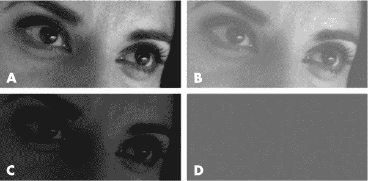

*图 18-1：比较应用不同混合模式的源图像*

##### 混合两张图片

除了将背景图片层与颜色层混合外，你还可以将背景图片层与其他背景图片层混合。要做到这一点，首先应用多个背景图片（如 第八章 所讨论的），然后像之前一样设置混合模式：

```
E {
    background-color: transparent;
    background-image: url('foo.png'), url('bar.png');
    background-blend-mode: multiply;
}
```

图 18-2 显示了混合两张图片的示例。每张图片应用了不同的混合模式关键词。从左到右，分别是 `screen`、`multiply` 和 `overlay`。（如果你在桌面浏览器中查看示例文件，鼠标悬停在元素上，可以看到我使用的两张不同背景图片。）

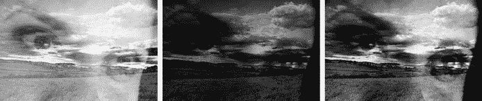

*图 18-2：多背景图片层的混合*

请注意，我已在元素上设置了透明的背景颜色。如果没有这样做，`multiply` 关键词会让下层背景图片与背景颜色混合，然后再与其他图片层混合，从而产生与我原本想要的效果不同的结果。

##### 多种混合模式

由于你可以为一个元素添加多个背景图像，因此你可以为每一层应用混合模式。为此，你只需在一个逗号分隔的值列表中列出所需的混合模式。

在下面的代码中，该元素有三个背景层：两张图像和一种颜色。我已经应用了两个混合模式关键词：Multiply 模式将用于将背景颜色与 *foo.png* 混合；结果将与 *bar.png* 使用 Screen 混合模式混合。

```
E {
    background-color: #f00;
    background-image: url('foo.png'), url('bar.png');
    background-blend-mode: multiply, screen;
}
```

**注意**

*与其他多个背景属性一样，如果 `*background-blend-mode*` 属性的值比背景层数少，则该值列表会循环。*

改变混合模式可以产生截然不同的效果。例如，图 18-3 显示了多种组合应用于不同元素，背景层相同。左侧的元素在顶部图像层使用 Screen 模式，在底部使用 Multiply 模式；中间的元素在顶部图像层使用 Multiply 模式，在底部使用 Overlay 模式；右侧的元素在顶部使用 Overlay 模式，在底部使用 Screen 模式。正如你所看到的，结果差异显著。

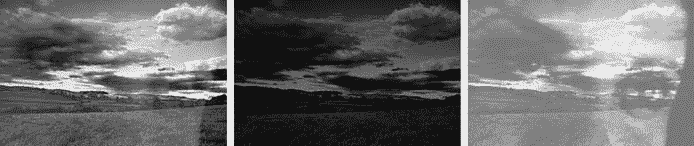

*图 18-3：以不同的组合应用多个混合模式*

#### *mix-blend-mode*

尽管混合背景图层无疑是有用的，但真正的强大之处在于将一个元素与另一个元素进行混合。在 CSS3 中，你可以通过 `mix-blend-mode` 属性来实现这一点。应用于元素时，该属性会将元素的内容与屏幕上直接位于其后方的任何元素的内容和背景混合。

为了理解这与 `background-blend-mode` 的区别，让我们看一个简单的例子。在下面的代码中，我为元素 `*E*` 应用一个背景图像，并为嵌套在 `*E*` 内的元素 `*F*` 应用 Multiply 混合模式：

```
E { background-image: url('foo.png'); }
F { mix-blend-mode: multiply; }
```

图 18-4 显示了结果，并进行其他混合模式的比较。左上角的元素（A）没有应用混合模式，用作参考；其余三个分别应用了混合模式关键词：`screen`（B）、`multiply`（C）和 `overlay`（D）。

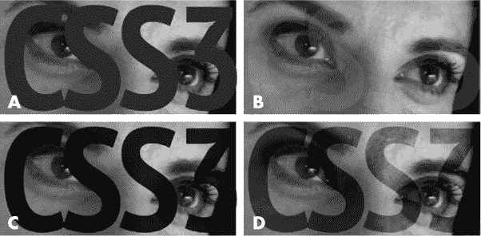

*图 18-4：应用于文本元素的不同混合模式，与其父元素的背景混合*

##### *隔离*

使用 `mix-blend-mode` 时，请注意，它会与屏幕上绘制在其后面的 *每个* 可视元素进行混合，这可能会导致意外的后果。例如，假设你有以下标记结构，其中 `img` 元素嵌套在 `div` 内，而 `div` 又嵌套在 `body` 内：

```
<body>
    <div>
        
    </div>
</body>
```

现在，你在 `body` 上设置一个背景图像，并在 `img` 上设置 `mix-blend-mode` 属性：

```
body { background-image: url('bunny.png'); }
img { mix-blend-mode: screen; }
```

在这种情况下，`img` 将与 `body` 混合，因为 `div` 是透明的，如 图 18-5 左侧的示例所示。

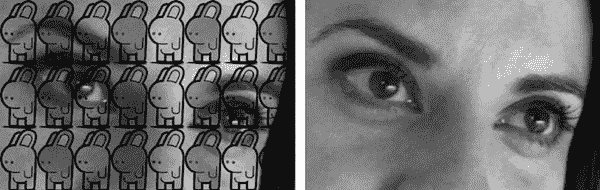

*图 18-5：隔离一个元素以设置新的堆叠上下文*

如果结果不是你想要的，你可以使一个元素创建一个新的堆叠上下文，^(1)，类似于将 `position: relative` 设置在元素上时会重置绝对定位的坐标。混合时，这一过程称为 *隔离* 元素，你需要使用 `isolation` 属性：

```
E { isolation: isolation-mode; }
```

默认值是 `auto`，但要创建新的堆叠上下文，你必须使用另一个值 `isolate`：

```
div { isolation: isolate; }
```

你可以在 图 18-5 右侧的示例中看到差异。`div` 被隔离，并创建了一个新的堆叠上下文，因此 `img` 只与透明的父元素进行混合。因此，你不会像左侧示例中那样看到 `body` 的背景图像。

### 滤镜效果

像混合模式一样，滤镜是专业图像编辑软件中的常见部分。滤镜用于在元素到达页面之前改变其外观，并且与混合模式不同，它们不依赖于两个组件的交互。CSS 滤镜在 CSS 滤镜效果模块中定义 (*[`www.w3.org/TR/filter-effects-1/`](http://www.w3.org/TR/filter-effects-1/)*)，并通过 `filter` 属性应用，如下所示：

```
E { filter: function; }
```

`*function*` 值至少是九种滤镜效果函数中的一种。每个函数接受一个参数，除非需要一系列参数（以空格分隔的列表）。我在这里讨论每一个函数。

#### *blur()*

对元素应用模糊效果。`blur()` 函数的参数是一个长度单位，用于控制模糊的半径。该效果被称为 *高斯模糊*——一种图像平滑效果，可以减少图像中的噪点。半径值越大，模糊效果越明显。例如，要创建半径为 10px 的模糊效果，你可以使用以下代码：

```
E { filter: blur(10px); }
```

你可以在 图 18-6 中看到模糊效果的实际应用。左侧是未经过滤的图像；右侧是应用了 `blur()` 滤镜的图像。


*图 18-6：应用高斯模糊滤镜*

#### *brightness() 和 contrast()*

`brightness()` 函数改变元素的亮度，而 `contrast()` 函数增加或减少元素的明暗对比度。这两个函数都接受百分比作为参数。以下是一个示例：

```
E { filter: brightness(50%); }
E { filter: contrast(50%); }
```

在这两种情况下，`100%` 的参数使元素保持不变。`brightness()` 的 `0%` 参数使元素完全黑色，而 `contrast()` 的 `0%` 参数使元素完全灰色。你可以使用超过 `100%` 的值来增加亮度和对比度。

**注意**

*你也可以为这个函数使用一个数字，其中* `*1*` *相当于* `*100%*`，`*1.5*` *相当于* `*150%*`*，以此类推。所有其他接受百分比值的函数也适用此规则。*

图 18-7 展示了两个函数的示例。第一张图片没有应用任何滤镜，作为参考展示。中间的图片应用了 `brightness()` 函数，右侧的图片应用了 `contrast()` 函数—每个函数的参数都是 `50%`。

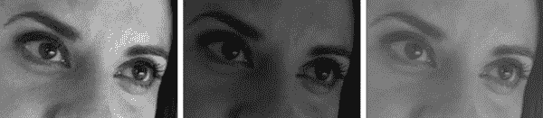

*图 18-7：使用 CSS 滤镜效果调整亮度和对比度*

#### *grayscale(), sepia(), 和 saturate()*

接下来的三个函数都与颜色处理有关。`grayscale()` 函数提供了一种将颜色替换为灰度的方式，帮助你将图像转换为黑白图像。`sepia()` 着色函数与 `grayscale()` 类似，只不过它使用金色调来产生复古照片效果。最后，`saturate()` 函数控制颜色的强度。

每个函数都接受一个百分比值作为参数：

```
E { filter: grayscale(100%); }
E { filter: sepia(100%); }
E { filter: saturate(200%); }
```

`grayscale()` 函数的 `100%` 值使图像完全黑白。将 `100%` 传递给 `sepia()` 函数会使图像完全呈现褐色调。在这两个函数中，`0%` 会保持图像不变，而大于 `100%` 的值将被当作 `100%` 处理。

`saturate()` 函数也接受一个百分比值作为参数，但它的工作原理与 `grayscale()` 和 `sepia()` 不同。`0%` 会让图像完全去饱和—也就是灰度图像，而大于 `100%` 的值会使图像过度饱和。

**注意**

*要查看这些函数的实际效果，请访问本书配套网站上的示例文件 18-a* ([`thebookofcss3.com/`](http://thebookofcss3.com/))。

#### *hue-rotate()*

`hue-rotate()` 函数名虽然平凡，但它用于旋转元素的色调。回想一下在 “色相、饱和度、亮度” 中提到的内容，在 第 116 页，色相是通过围绕色轮轴的角度来计算的。因此，`hue-rotate()` 函数所需的参数是一个度数，像这样：

```
E { filter: hue-rotate(45deg); }
```

应用 `hue-rotate()` 函数实际上是将元素中所有颜色的色调按相同的角度围绕色轮进行旋转。要查看该函数的实际效果，请访问本书网站上的示例文件 18-b。

#### *opacity()*

`opacity()` 函数的工作方式与 第十章 中介绍的 `opacity` 属性相同。该函数接受一个百分比值作为参数，其中 `0%` 代表完全透明，`100%` 代表完全不透明：

```
E { filter: opacity(25%); }
```

大于 `100%` 的值将被当作 `100%` 处理。

如果 `opacity()` 函数的结果与 `opacity` 属性完全相同，那为什么还要使用它呢？因为你可以将它与其他滤镜效果函数结合使用，正如你将在 “多个滤镜效果函数” 中看到的，详见 第 234 页。

#### *drop-shadow()*

起初，`drop-shadow()` 函数可能看起来与第九章 中介绍的 `box-shadow` 属性相同。实际上，它接受与 `box-shadow` 相同的值作为参数：x 偏移量、y 偏移量、模糊半径和阴影颜色。以下是一个示例：

```
E { filter: drop-shadow(5px 5px 3px gray); }
```

这两者之间最大的区别是 `drop-shadow()` 函数会识别目标元素的任何 alpha 值（透明度）。你可以在 图 18-8 中清晰地看到这种区别。目标图像具有透明背景，因此在应用了 `drop-shadow()` 函数的左侧图像中，阴影框跟随图像的轮廓。而右侧的图像则应用了 `box-shadow` 属性。由于 `box-shadow` 属性不考虑 alpha 透明度，阴影只跟随盒子的轮廓。

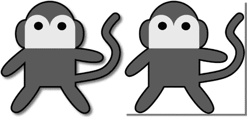

*图 18-8：比较* `*drop-shadow()*` *滤镜（左）与* `*box-shadow*` *属性（右）*

#### *多个滤镜效果函数*

你可以通过将多个滤镜效果函数按空格分隔列出，来应用多个滤镜效果函数。例如，你可以同时向元素添加模糊和投影效果：

```
E { filter: blur(5px) drop-shadow(5px 5px 3px gray); }
```

函数列出的顺序很重要，因为它们将按照此顺序应用。例如，在接下来的示例中，应用了两个滤镜效果，但我更改了顺序：在第一个示例中，`gray-scale()` 函数先于 `sepia()` 应用，而在第二个示例中，我将其顺序颠倒了：

```
E { filter: sepia(100%) gray-scale(100%); }
E { filter: gray-scale(100%) sepia(100%); }
```

在第一个示例中，`sepia()` 函数将先应用，然后是 `grayscale()`，因此 `sepia()` 滤镜效果的所有颜色都会转换为灰度。第二个示例中，`grayscale()` 函数先应用，再是 `sepia()`，所以 `sepia()` 滤镜效果的颜色会显示。此书网站上的示例文件 18-c 显示了这种效果。

就像 CSS 变换（在 第十二章 中介绍）一样，当你在 `filter` 属性中列出多个函数时，列表中未列出的任何函数将返回默认值。例如，在以下示例中，当元素悬停时，它失去了 `sepia()` 滤镜效果：

```
E { filter: sepia(100%) blur(2px); }
E:hover { filter: blur(5px); }
```

#### *SVG 中的滤镜*

回想一下，CSS 滤镜效果实际上是 SVG 滤镜预设的简写。滤镜效果模块显示了所有 CSS 函数的标记等价物。例如，`blur()` 滤镜的 SVG 标记如下所示（`*blur-radius*` 值是无单位的数字）：

```
<filter>
    <feGaussianBlur stdDeviation="blur-radius" />
</filter>
```

你可以在 SVG 中创建自己的滤镜，并通过使用 ID 引用在 CSS 中应用它们。第一步是为你的滤镜添加一个 ID 值：

```
<filter id="blur">…</filter>
```

然后，在你的 CSS 中使用 `url()` 表示法，包含 ID 引用，作为 `filter` 属性的值。如果你的 SVG 与文档中的标记 inline，则只需要 ID 引用：

```
E { filter: url('#blur'); }
```

如果你的 SVG 在外部资产文件中（例如，*filters.svg*），则需要指定该文件的路径，并跟上 ID 引用：

```
E { filter: url('filters.svg#blur'); }
```

与 CSS 滤镜效果不同，这种技术只适用于单个滤镜。要将多个滤镜应用到一个元素，必须先在 SVG 标记中将它们组合起来。

### 遮罩

遮罩是一种技术，其中元素的某些部分被隐藏。遮罩有两种方法：剪切，隐藏区域由一个覆盖在元素上的多边形形状设置，以及图像遮罩，使用图像的 alpha 通道来设置隐藏区域。

#### *剪切*

剪切是最简单的遮罩形式。在剪切时，一个形状覆盖在图像上，任何位于形状后面的元素部分会被显示，而任何超出形状边界的部分则会被隐藏。形状的边界被称为*剪切路径*，可以通过`clip-path`属性来创建：

```
E { clip-path: shape; }
```

`*shape*`可以是四种基本类型中的一种，每种类型通过一个函数来表示：`circle()`、`ellipse()`、`inset()`（用于矩形）和`polygon()`。每个函数接受多个参数，用于定义剪切路径。例如，要创建一个圆形，您需要为`circle()`函数提供三个参数，使用类似径向渐变的语法（参见第十一章）：

```
E { clip-path: circle(r at cx cy); }
```

`*r*`表示圆形的半径，而`*cx*`和`*cy*`是圆心的坐标。因此，要将元素裁剪为位于目标中心的 100px 圆形，您需要使用以下值：

```
E { clip-path: circle(100px at 50% 50%); }
```

`ellipse()`函数非常相似，只需要额外一个参数来设置椭圆的半径：

```
E { clip-path: ellipse(rx ry at cx cy); }
```

这里`*rx*`用来表示半径的* x *轴，`*ry*`表示* y *轴。要创建一个半径为 50px 和 100px 的椭圆，并且将其放置在目标的中心位置，您需要使用这些值：

```
E { clip-path: ellipse(50px 100px at 50% 50%); }
```

要查看这些在实际中的效果，请参见图 18-9。左侧的示例使用`circle()`函数，采用前面使用的值，右侧则使用`ellipse()`，同样采用前面使用的值。

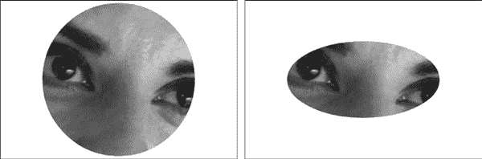

*图 18-9：`*clip-path*`属性的函数值：* `*circle()*` *（左）和* `*ellipse()*` *（右）*

如前所述，`inset()`函数用于创建一个从应用它的元素边框内缩的矩形。它可以接受最多 12 个参数！前四个参数设置矩形每一边的偏移距离——就像`border-image-slice`属性一样（参见第九章）。因此，单个值会在所有边上设置相等的偏移距离；如果提供两个值，第一个设置上下偏移，第二个设置左右偏移；以此类推。

如果我们使用所有四个值，语法将如下所示：

```
E { clip-path: inset(o1 o2 o3 o4); }
```

每个`*o**`表示一个偏移值（分别对应上、右、下、左）。

在最简单的格式下，单个值会创建四个相等的偏移量，如此例所示，每个偏移量值为 2em：

```
E { clip-path: inset(2em); }
```

你还可以圆化剪切路径的角落，这时剩下的参数就派上用场了。在 `round` 关键字之后，你可以使用与 `border-radius` 属性相同的语法（请参见第九章）来定义每个角的半径——最多可以设置八个值来进行精细控制。为了避免在这里重复解释 `border-radius` 的简写语法，本例展示了如何为之前定义的内嵌矩形的每个角设置 20px 的半径：

```
E { clip-path: inset(2em round 20px); }
```

查看图 18-10 中的结果。左侧示例显示的是一个有直角的矩形，右侧则是一个有圆角的矩形。

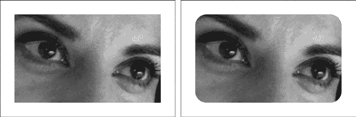

*图 18-10：没有（左）和有（右）边框圆角值的* `*inset()*` *函数*

你可以使用 `polygon()` 函数来创建更复杂的剪切路径。该函数接受任意数量的参数，成对出现，以逗号分隔的列表形式传递。每一对参数代表一个坐标值，所有坐标值组合起来用于绘制所需的剪切形状。举个简单的例子，这个语法定义了一个三角形的三个点：

```
E { clip-path: polygon(0% 100%, 100% 0%, 0% 0%); }
```

三角形的三个顶点位于目标元素的左上角、左下角和右上角。你可以在图 18-11 中看到剪切效果。

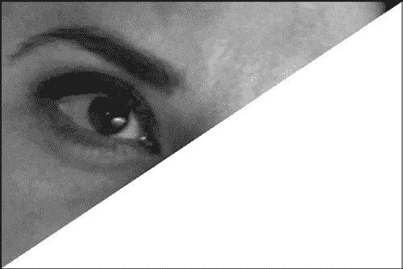

*图 18-11：使用* `*polygon()*` *函数创建的三角形剪切路径*

**注意**

*剪切元素仅改变其视觉外观——被剪切元素的尺寸和盒模型不会被修改。有关此功能未来可能变化的建议，请参见 “Shapes” 第 246 页（page 246）。*

##### Safari 中 clip-path 的实现

`clip-path` 属性在 Safari 7 中首次实现，并带有厂商前缀，但使用的是现在已过时的语法版本（更新的语法在 Safari 8 中得以实现）。`polygon()` 函数的工作方式保持不变，但其他函数稍有不同；例如，`circle()` 函数的语法略有不同，要求三个用逗号分隔的参数：

```
E { -webkit-clip-path: circle(cx, cy, r); }
```

类似地，`ellipse()` 函数接受四个参数：

```
E { -webkit-clip-path: circle(cx, cy, rx, ry); }
```

`inset()` 函数被称为 `inset-rectangle()`，它至少需要四个用逗号分隔的值来表示偏移距离：

```
E { -webkit-clip-path: inset-rectangle(o1, o2, o3, o4); }
```

你可以圆化角落，但每个角的值必须相同——不能为每个角设置不同的值。然而，你可以设置 *x* 轴和 *y* 轴的值来创建不规则的圆角半径：

```
E { -webkit-clip-path: inset-rectangle(o1, o2, o3, o4, rx, ry); }
```

与标准的最大区别在于 `rectangle()` 函数；这个函数最初在规范中定义，但后来被推迟到未来版本中。`rectangle()` 函数也可以创建矩形剪切形状，但使用坐标而不是偏移值。它最多接受六个参数：

```
E { -webkit-clip-path: rectangle(x, y, w, h, rx, ry); }
```

前四个参数是必需的：`*x*` 和 `*y*` 设置形状的左上角的 *x* 和 *y* 坐标，相对于目标元素的左上角；`*w*` 和 `*h*` 分别设置形状的宽度和高度。可选的 `*rx*` 和 `*ry*` 参数用于设置剪切路径所有角落的圆角半径。（你可以使用一个值来设定相等的半径，但不能单独设置每个角落。）

图 18-12 显示了这六个值如何设置图像的剪切区域。

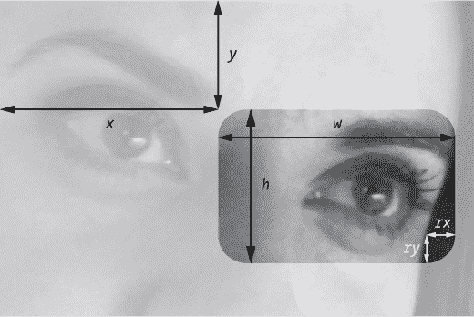

*图 18-12：设置剪切区域的 `*rectangle()*` 形状函数的六个值*

如果我们按照以下代码组合这些选项，我们将创建一个剪切路径，该路径距离元素的左上角 10px，宽度为 50%，高度为 100px，角落的半径在两个轴上均为 20px。图 18-13 显示了这将是什么样子。

```
E { -webkit-clip-path: rectangle(10px, 10px, 50%, 100px, 20px); }
```

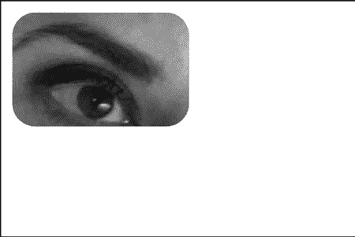

*图 18-13：使用 `*rectangle()*` 函数和 `*-webkit-clip-path*` 制作的矩形*

##### 剪切路径动画

由于剪切路径是通过坐标定义的，因此动画化它们以创造令人印象深刻的效果变得非常简单。例如，你可以拿前一节中定义的三角形多边形，在鼠标悬停时进行过渡：

```
E {
   clip-path: polygon(0% 0%, 0% 100%, 100% 0%);
   transition: clip-path 1s;
}
E:hover { clip-path: polygon(100% 100%, 0% 100%, 100% 0%); }
```

在这个动画中，三角形的两个点保持在相同的位置，而第三个点切换到对角线的另一角落。这通过过渡动画实现，产生了你在示例文件 18-d 中看到的效果。

##### SVG 中的剪切路径

你还可以在 SVG 中创建剪切路径，并通过 CSS 将其应用于元素。为此，你首先定义剪切路径的标记，然后赋予它一个唯一的 ID。例如，以下代码创建了一个圆形剪切路径，该路径使用 `clipPath` 元素定义，位于元素的中心，半径为宽度和高度的一半。它的 ID 为 `clipping`。

```
<defs>
    <clipPath id="clipping">
        <circle cx="0.5" cy="0.5" r="0.5" />
    </clipPath>
</defs>
```

一旦定义好，我会通过 `clip-path` 属性将这个剪切路径应用于我的元素，属性值等于包含剪切路径 ID 的 `url()` 语法：

```
E { clip-path: url('#clipping'); }
```

不幸的是，这种方法有一些缺点。首先，截止到目前，它仅在 Firefox 中有效。此外，你不能在不使用 JavaScript 的情况下对这些形状进行动画效果处理。

#### *图像遮罩*

除了使用几何形状剪切元素外，你还可以使用另一张图像作为遮罩，利用遮罩的 alpha 值来确定目标中有多少部分是可见的。（这个过程类似于混合模式的工作方式，只是它使用 alpha 值而不是黑白色。）遮罩是通过 `mask` 属性应用的，它接受以下值：

```
E { mask: image position / size; }
```

`*image*`值是`url()`表示法，指向用作遮罩的图像路径。属性`*position*`和`*size*`的工作方式与`background-position`和`background-size`属性相同（见第八章）。例如，以下代码会将一个名为*mask.png*的图像放置在元素的中心，遮罩填充父元素的宽度，同时保持原始的纵横比：

```
E { mask: url('mask.png') 50% 50% / 100% auto; }
```

图 18-14 展示了遮罩的三个步骤。目标图像在左边；用作遮罩的图像在中间；应用到目标上的遮罩在右边。

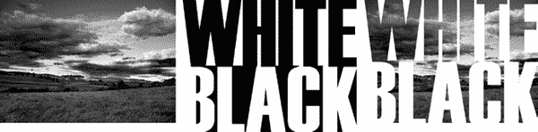

*图 18-14：图像遮罩的三个步骤*

**注意**

*这是一个简单的遮罩。语法比这更加灵活，尽管在本书中无法详细探讨，因为它有些复杂。*

`mask`属性是许多子属性的简写，包括`mask-image`、`mask-position`和`mask-size`。除了这些属性外，你还可以使用更多属性，完整的`mask`简写如下：

```
E { mask: image mode position / size repeat origin clip composite; }
```

让我们简单回顾一下这些不太熟悉的属性。`mask-mode`属性决定遮罩是基于默认的 alpha 通道工作，还是通过*亮度*（光亮度）工作；`mask-repeat`像`background-repeat`一样平铺遮罩图像；`mask-origin`和`mask-clip`也像它们的背景等价物（`background-origin`和`background-clip`在第八章中讨论过）；而`mask-composite`控制多个`mask-image`值在重叠时的交互方式。

#### *边框遮罩*

在第九章中，我介绍了`border-image`属性，用于将图像应用到元素的边框上。你可以使用我们在该章节中讨论的相同方法，通过切片图像来将遮罩应用到元素的边框。

与边框遮罩相关的属性有`mask-border-source`、`mask-border-slice`、`mask-border-repeat`、`mask-border-width`和`mask-border-output`。每个属性都可以包含在`mask-border`简写中，并且它们的功能与`border-image-*`对应属性相同。例如，要设置一个名为*mask.png*的图像，切片为每个 40px，并沿元素的每一边重复，使用以下语法：

```
E { mask-border: url('mask.png') 40px repeat; }
```

不幸的是，截止目前，没有浏览器完全按照规范支持这一功能（虽然 Chrome 和 Safari 支持一个类似但过时的属性，叫做`-webkit-mask-box-image`），因此我不会再花时间讨论边框遮罩。

#### *SVG 中的遮罩*

你可以使用 SVG 来遮罩图像，就像你可能裁剪它们一样。为此，你需要在标记中定义遮罩，然后使用 CSS 属性（`mask`）应用它。例如，以下代码创建了一个黑色方框的遮罩，中间有一个白色椭圆：

```
<defs>
    <mask id="masking">
        <rect y="0.3" width="1" height=".7" fill="black" />
        <circle cx=".5" cy=".5" r=".35" fill="white" />
    </mask>
</defs>
```

下一步是将遮罩应用到目标元素，使用`mask`属性，并通过`url()`表示法包含`mask`元素（`masking`）的 ID：

```
E { mask: url('#masking'); }
```

**注意**

*想深入了解 SVG 和 CSS 中的蒙版，请参见 Dirk Schulze 的《CSS* *蒙版》*（[`www.html5rocks.com/en/tutorials/masking/adobe/`](http://www.html5rocks.com/en/tutorials/masking/adobe/)）。

### 结合滤镜效果和蒙版

如果你想将滤镜效果与同一元素的蒙版结合使用，重要的是要知道它们会按特定顺序应用：首先应用滤镜效果，然后是剪裁，接着是蒙版，最后是不透明度。为了看到这个顺序的后果，可以考虑以下代码，它对元素应用了一个阴影滤镜和圆形剪裁路径：

```
E {
    clip-path: circle(50% at 50% 50%);
    filter: drop-shadow(5px 5px black);
}
```

在这段代码中，效果按照以下顺序应用到图像上：首先应用阴影效果；然后将应用了阴影的图像剪裁成圆形。为了避免剪裁掉阴影，你可以将滤镜效果应用到父元素上：

```
D { filter: drop-shadow(5px 5px black); } /* parent */ 
E { clip-path: circle(50% at 50% 50%); } /* child */ 
```

之所以能这样工作，是因为浏览器解析 DOM 渲染的方式。子元素的剪裁会在从父元素继承的滤镜效果之前发生。（图 18-15 比较了这两种方法。）

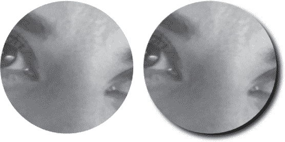

*图 18-15：比较图形 CSS 效果的渲染顺序*

### 总结

混合模式、滤镜效果和蒙版为 Web 浏览器提供了以前只有在专业照片处理软件中才能找到的功能。每一种效果单独使用都很有用，但将它们结合起来，设计师和开发者就能以全新的方式进行 Web 上的视觉设计。

使用这些图形效果的能力得益于 SVG 的广泛应用。描述 SVG 图像的标记与 HTML 紧密相连（可以嵌入 HTML 中，并作为文档的一部分解析），未来你会看到 SVG 和 CSS 的结合更加紧密——我们已经在本章中的图形效果中看到了这一点，当前正在开发的模块也描述了在第十四章中提到的动画属性的共享实现。

### 混合模式、滤镜效果和蒙版：浏览器支持

|  | **Chrome** | **Firefox** | **Safari** | **IE** |
| --- | --- | --- | --- | --- |
| `background-blend-mode` | 支持 | 支持 | Safari 8 | 不支持 |
| `mix-blend-mode` | 不支持^(*) | 支持 | Safari 8 | 不支持 |
| `isolation` | 不支持* | 不支持 | Safari 8 | 不支持 |
| `filter` | 支持^(†) | 不支持^(‡) | 支持^(†) | 不支持 |
| `clip-path` | 支持* | 不支持 | Safari 8^(§) | 不支持 |
| `mask` | 支持^(†) | 不支持 | 支持^(†) | 不支持 |

* 已实现，但默认关闭

† 带有厂商前缀

‡ 可以使用 SVG 中定义的滤镜

§ 带有厂商前缀；在 Safari 7 中使用过时的语法实现
