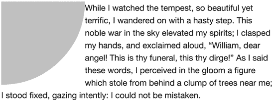
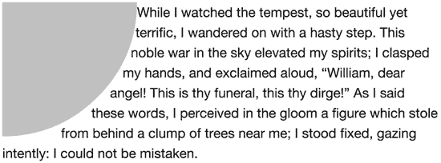
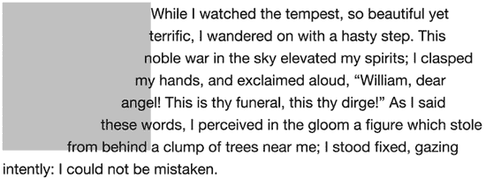
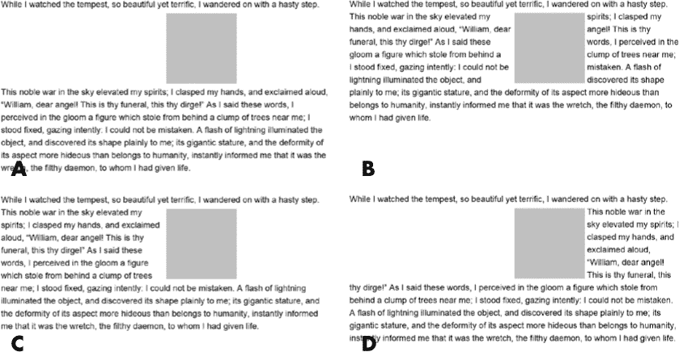
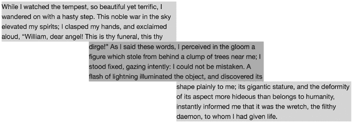

## **19**

**CSS 的未来**


在本章的最后，我们将介绍一些更具实验性的 CSS3 特性。正如你将看到的，这些特性涵盖了从大大扩展你页面布局能力（可以与印刷杂志相媲美）到为你带来其他编程语言中强大方法和功能的特性。

我必须首先说明，这些特性目前的实现有限，并且在我写这篇文章时，这些特性仍然在模块中定义，尚未完成 W3C 推荐周期；这两个事实意味着本章中的特性未来尚不确定。由于这些特性处于不断变化的状态，我将在此简要讨论每个特性，而不如本书其他部分那样详细。

### **形状**

CSS 的一个限制是所有元素都是矩形的。即使你使用圆角或裁剪元素（如第十八章所讨论），底层的框依然是矩形的。因此，举例来说，围绕圆形或裁剪元素浮动的内容会遵循该元素矩形的轮廓框，正如你在图 19-1 中看到的那样。



*图 19-1：尽管元素这里有圆角，但围绕它浮动的内容依然遵循其矩形边界框。*

CSS 形状模块（*[`www.w3.org/TR/css-shapes/`](http://www.w3.org/TR/css-shapes/)）解决了这个问题，它允许你将几何形状应用到元素上，使得内联内容可以围绕这些形状的轮廓流动，而不是原本的边界框。`shape-outside` 属性定义了要应用于元素的形状：

```
E { shape-outside: shape-function; }
```

`*shape-function*` 值可以是 `clip-shape` 属性（在“裁剪”一节中介绍，见第 235 页）上允许的任何函数：`inset()`、`circle()`、`ellipse()` 或 `polygon()`。例如，这段代码创建了一个半径为 100px、中心位于应用该属性元素的左上角的圆形：

```
E { shape-outside: circle(100px at left top); }
```

当该元素被浮动时，围绕它的任何内联内容都会围绕圆形的轮廓流动，正如图 19-2 所示。

请注意，形状仅适用于元素的浮动轮廓；背景色、图像和边框仍然会遵循元素的边框框。正如你在图 19-3 中看到的，我已经去掉了浮动元素的 `border-radius` 值，导致文本与元素的边框重叠。为避免此问题，你可以考虑使用与定义形状匹配的裁剪路径（参见第 235 页的“裁剪”一节）。



*图 19-2：应用了 CSS 形状的元素。内容围绕定义的圆形轮廓流动，而不是围绕边界框。*



*图 19-3：如果没有匹配的* `*border-radius*` *值，浮动文本会与形状元素的背景颜色重叠。*

为了在浮动形状的边缘与环绕其内容之间创建额外的空间，您可以使用`shape-margin`属性。此属性接受任何长度值。例如，这段代码为形状周围添加了额外的 0.5em 空间：

```
E { shape-margin: 0.5em; }
```

请注意，与`margin`属性不同，您只能添加一个单一的边距值，这个值会均匀地应用于形状的所有边。

### **排除**

截至目前，要让内容围绕一个元素流动，您必须使该元素浮动。缺点是元素只能浮动到左侧或右侧；您不能将其定位在文本的中间，也没有太多精细控制。

CSS 排除模块 (*[`www.w3.org/TR/css3-exclusions/`](http://www.w3.org/TR/css3-exclusions/)*）解决了这个问题。CSS 排除定义了一种文本环绕任意元素的方式，无论该元素本身是否浮动。图 19-4 展示了一个元素定位在一些文本上方。在左侧的示例中，元素与文本没有交互，而在右侧，它充当了一个*排除元素*——它的表现就像是浮动了，文本在其两侧流动。


*图 19-4：左侧是元素定位在文本上方；右侧是一个浮动的排除元素，文本围绕它流动。*

您可以使用`wrap-flow`属性创建一个排除元素，该属性接受一个关键字值：

```
E { wrap-flow: flow-direction; }
```

`*flow-direction*`关键字设置了元素周围任何内联内容流动的侧面。您可以通过多个值来控制流动；这些值在图 19-5 中有显示：

• `clear`值意味着内容不会围绕排除元素的任何一侧流动（A）。

• `both`值使内联内容围绕元素的两侧流动（B）。

• `start`值意味着内联内容会围绕元素的左侧流动（如果文档或元素的书写方向是从左到右），并留出右侧空白（C）。

• `end`值则与`start`相反：内联内容会围绕元素的右侧流动，留出左侧空白（D）。

`minimum`和`maximum`关键字会使内容围绕元素的一侧流动，距离该侧与其包含元素的最近边缘分别为较小或较大的距离。使用图 19-5 中的示例，`maximum`等同于`start`（C），`minimum`等同于`end`（D）。

默认的关键字值是`auto`，意味着不会创建排除——内容会流动到元素下方，如图 19-4 左侧所示。

在我写这段文字时，Internet Explorer 10 和 11 支持 CSS 排除，使用`-ms-wrap-flow`属性，并且没有`minimum`关键字值。



*图 19-5：内容根据使用不同的关键字值围绕排除元素流动。*

### **区域**

第七章解释了 CSS 列，这是跨多个连续列流动内容的方法。CSS 区域模块 (*[`dev.w3.org/csswg/css-regions/`](http://dev.w3.org/csswg/css-regions/))* 扩展了这一理念，允许内容流入多个区域，这些区域在布局顺序中不必是连续的，且不受页面位置的限制。可以想象一个长篇杂志文章，内容跨越多个页面，尽管这些页面不一定是连续的。

CSS 区域通过定义一个内容区域并为其分配一个唯一标识符（称为*命名流*），以及使用`flow-into`属性，使这一切成为可能：

```
E { flow-into: foo; }
```

一旦该标识符被分配，元素`*E*`的内容就可以流入多个区域。为此，使用命名流作为`flow-from`属性的值；例如，如果你想将`*foo*`的内容流入元素`*F*`和`*G*`，你可以使用如下代码：

```
F, G { flow-from: foo; }
```

`*E*`的内容首先流入`*F*`，因为它在代码中排在前面。如果内容溢出`*F*`，溢出的部分将流入`*G*`。图 19-6 展示了内容流入三个独立区域。（我添加了背景阴影以便更容易识别每个区域。）



*图 19-6：文本流入第一个框，溢出到第二个框，然后再溢出到第三个框。*

元素`*F*`和`*G*`可以放置在页面上的任何位置；它们不需要是连续的（尽管你应该确保内容的视觉流程易于用户跟随）。

截至本文写作时，CSS 区域已在 Safari 6.1 及以上版本中实现，并使用`-webkit-`前缀。CSS 区域也在 Internet Explorer 10 和 11 中实现，使用`-ms-`前缀，并附带要求：内容流动的元素必须是`iframe`。

### **变量**

几乎每种编程语言都可以定义*变量*——符号名称，可以为其分配值，且可以在后续引用或更新。CSS 预处理器（如 Sass）的广泛流行部分原因在于它们允许在 CSS 中使用变量。这种流行直接促成了*自定义属性*的创建——这是一种在原生 CSS 语言中类似变量的有限功能。这些功能在 CSS 自定义属性级联变量模块中介绍 (*[`www.w3.org/TR/css-variables-1/`](http://www.w3.org/TR/css-variables-1/))。

你通过三步定义一个自定义属性：设置其*作用域*（可以应用的值的范围），创建一个唯一标识符，然后为该标识符分配一个值。以下是代码的表现方式：

```
➊ :root {
➋     --fooColor: #f00;
  }
```

暂且不论➊，看一下➋，在这里我使用唯一标识符`*--fooColor*`定义了自定义属性。（CSS 变量名必须是没有空格的字符字符串，并以双短横线作为前缀，以避免与其他已定义的值冲突。）我已经将颜色值`#f00`赋给了自定义属性，但任何有效的 CSS 属性值都是允许的。

一旦定义并赋值了自定义属性，你可以将其作为任何其他属性的值使用。赋给自定义属性的值将作为引用该属性的属性的值，通过在`var()`函数中使用唯一标识符作为参数。例如，要将该值应用于`border-color`和`color`，你可以这样写：

```
E {
    border-color: var(--fooColor);
    color: var(--fooColor);
}
```

在这里，自定义属性`*--fooColor*`的值（即`#f00`）将作为`*E*`的`border-color`和`color`属性的值。当然，当应用自定义属性时，属性值必须有效：比如用颜色值设置`width`属性就没有意义。如果你在规则中使用了无效的自定义属性，该规则将被忽略。

现在，让我们回到之前代码中的➊。这一行设置了变量的作用范围。在我的例子中，作用范围是`:root`选择器，这意味着变量具有*全局作用域*，可以应用于任何元素，无论其在 DOM 中的位置。如果你希望自定义属性仅在应用于某些元素时有效，你可以限制这个范围。例如，要使自定义属性仅在应用于`h1`元素时有效，你可以像这样设置它的范围：

```
h1 { --fooColor: #f00; }
```

通过这种方式限制范围，任何来自`h1`选择器的对自定义属性的引用都会以`#f00`的`color`值显示：

```
h1 { color: var(--fooColor); }
```

但是，如果你从超出范围的元素（如`h2`）中引用自定义属性，由于该自定义属性是未知的，所以下面的规则将被忽略：

```
h2 { color: var(--fooColor); }
```

截至本文写作时，自定义属性已在 Firefox 31 及以上版本中可用，并且在 Chrome 中通过标志实现，但由于存在某些性能问题，可能没有启用。因此，自定义属性的未来充满不确定性。

### **功能查询**

媒体查询，在第二章中介绍，已经改变了我们使网站在不同屏幕尺寸和分辨率下响应式工作的方法。它们的强大之处部分在于其逻辑的简洁性：如果查询条件满足，则查询声明块中定义的规则将被应用。这个思想在 CSS 条件规则模块中得到了进一步发展（* [`www.w3.org/TR/css3-conditional/`](http://www.w3.org/TR/css3-conditional/)*），该模块扩展了查询，不仅使用基于设备/用户代理属性（如尺寸和分辨率）的条件，还允许定义仅在支持特定 CSS 特性的情况下才应用的 CSS 规则。

这些新的条件规则，称为 *特性查询*，通过新的 `@supports` 规则定义。`@supports` 语法类似于 `@media`，不同之处在于它需要一个 CSS 属性-值对（或多个）作为参数。如果浏览器支持该属性-值对，定义的规则将会应用。

例如，要测试浏览器是否支持 Flexbox，测试条件是浏览器是否识别值为 `flex` 的 `display` 属性：

```
@supports (display: flex) {…}
```

在已实现 Flexbox 的现代浏览器中（当然也实现了 `@supports`），属性-值对会被识别，花括号内的规则会被应用。没有 Flexbox 支持的旧版浏览器将无法识别该属性-值组合，并会跳过这些规则。

与媒体查询一样，你可以在特性查询中使用逻辑运算符——`and`、`or` 和 `not`。例如，要查看浏览器是否同时支持 Flexbox 和 Transitions，可以使用 `and`：

```
@supports (display: flex) and (transition: 1s) {…}
```

如果一个属性有多个使用厂商前缀的实现，而你想测试浏览器是否支持其中的任意一个实现，可以使用 `or`：

```
@supports (animation-duration: 1s) or (-webkit-animation-duration: 1s) {…}
```

如果你想查看浏览器是否不支持某个特定属性，可以使用 `not`：

```
@supports not (display: flex) {…}
```

截至本文撰写时，`@supports` 规则已在 Chrome 和 Firefox 中实现，并列为“开发中”状态，Internet Explorer 也已列出该规则。Webkit 已经实验性地实现了该规则，但截至目前，它在 Safari 8 中尚未发布。在这些浏览器中，`@supports` 声明块中的规则将被忽略。

### **设备适配**

实现响应式设计时，使用媒体查询的一个关键部分是能够设置视口属性，方法是使用视口 meta 标签（请参见“设备宽度和高度”，第 15 页）。不幸的是，视口 meta 标签并非没有问题，其中最严重的问题是最初的实现没有文档化，这意味着其他浏览器厂商不得不对其进行逆向工程，从而导致了小的互操作性问题。CSS 设备适配模块（*[`www.w3.org/TR/css-device-adapt/`](http://www.w3.org/TR/css-device-adapt/)）试图通过将视口 meta 标签属性转换为原生 CSS，并对功能进行文档化和标准化，同时添加新的功能来解决这些互操作性问题。

设备适配模块通过新的 at-rule `@viewport` 重新实现了视口 meta 标签：

```
@viewport {…}
```

`@viewport` 规则接受多个属性-值对或 *视口描述符*，它们设置视口的参数。其中一些描述符是现有的 CSS 属性，而其他的则是 `@viewport` 特有的。

在许多情况下，这些描述符与视口 meta 标签中使用的参数不同，但它们执行相同的角色。例如，要在 meta 标签中将宽度设置为设备宽度，可以写成这样：

```
<meta name="viewport" content="width=device-width">
```

为了使用`@viewport`规则执行相同的操作，您可以使用`width`属性，值为`100vw`——即视口的完整宽度（`vw`单位在第十六章中有讨论）：

```
@viewport {
    width: 100vw; }
```

`@viewport`规则的最佳部分是，您可以将其与媒体查询结合使用，为不同的设备配置创建自定义视口。例如，您可以仅在小屏幕上将宽度设置为设备宽度：

```
@media (max-width: 480px) {
  @viewport {
      width: 100vw;
  }
}
```

截至本文写作时，`@viewport`规则在 Internet Explorer 10 和 11 中作为`@-ms-viewport`规则实现。同时它也在 Chrome 中实现，但当前默认未启用。

### **粘性定位**

一种相当常见的网页设计模式是让元素变得*粘性*，这样当页面滚动时，它们会固定在视口的顶部或底部。粘性通常是通过在`position`属性上设置`fixed`值，并结合 JavaScript 中的滚动事件来实现的，但 CSS3 的定位布局模块（*[`dev.w3.org/csswg/css-position-3/`](http://dev.w3.org/csswg/css-position-3/)）引入了一个原生的`sticky`值来实现同样的功能。

粘性定位是一种相对定位和固定定位的混合体。元素的定位是相对的，直到它达到*粘性阈值*，这个阈值是视口的预设滚动位置。例如，在下面的代码中，元素`*E*`在视口从顶部向下滚动 20px 时变为粘性：

```
E {
    position: sticky;
    top: 20px;
}
```

截至本文写作时，粘性定位在 Safari 6.1 及以上版本中已实现，使用`-webkit-sticky`值，在 Firefox 中没有前缀。预计 Chrome 将实现粘性定位，且在 Internet Explorer 中被列为“正在考虑中”。

### **更多更多功能**

CSS 是一个不断发展的标准，无论是由 W3C、浏览器厂商、像 Adobe 这样的相关方，还是由 Web 开发社区推动，都在持续开发。除了本章讨论的新特性之外，还有许多令人兴奋的 CSS 发展正在被提议、讨论和开发。其中一些包括但不限于以下内容：

• 设置不同形状的角落，并允许剪裁或部分线条作为边框

• 能够将来自 Flexbox 的定位关键字（第十五章）应用于任何元素，从而引起元素定位方式的重大变化

• 允许颜色轻松着色或着色的颜色函数，并提供更简单的灰度操作

• 扩展自定义属性的概念，包括自定义选择器或函数

• 基于文本行的网格设计，旨在更好地放置内容中的元素，具有垂直节奏

• 包括精灵和后备图像的图像值，及可以使用元素作为背景的图像

这些功能大多仍处于理论阶段，但它们应该能让你了解 CSS 未来发展的思维水平。而且，网页行业变化的速度如此之快，几个月后你阅读这些内容时，肯定会有更多的新特性被提出。

### **结论**

CSS 显然在不断发展。从最初作为文本文件简单装饰的方式开始，CSS 正朝着一个未来发展，几乎成为一种语言，能够适应我们将来用于访问网页的各种设备。

在我多年的 CSS 工作、写作和讨论经验中，我发现变革往往来自意想不到的方向。某些看似有用的模块或属性由于各种原因将长期没有实现——无论是因为商业决策、资源问题，还是纯粹的政治原因。而变革的驱动力来自不同的源头：从 W3C 和浏览器厂商到像 Adobe 这样的公司，它们希望按自己的方式塑造网络，再到开发社区，它们开发工具以满足网页开发的需求。你永远不知道下一次重大变革将从哪里来。

我在本书中没有涵盖 CSS3 模块的所有内容，但希望我已经涵盖了足够的内容，至少能够激起你对一些你今天就可以开始使用的新技术的好奇心，以及 CSS 未来的发展方向。我鼓励你保持对网页样式元素讨论的关注，下载浏览器的预览版本，进行自己的实验，并将实验结果反馈给浏览器开发者和 W3C。CSS3（大多数情况下）是围绕网页开发者的需求塑造的，你的意见和反馈至关重要。

### **未来的 CSS：浏览器支持**

|  | **Chrome** | **Firefox** | **Safari** | **IE** |
| --- | --- | --- | --- | --- |
| 形状 | 是 | 否 | Safari 8^(*) | 否 |
| 排除项 | 否 | 否 | 否 | IE10^(†) |
| 区域 | 否 | 否 | 是* | IE10^(‡) |
| 变量 | 否 | 是 | 否 | 否 |
| 功能查询 | 是 | 是 | 否 | 否^(§) |
| 设备适配 | 否^(&#124;&#124;) | 否 | 否 | IE10^(†) |
| 粘性定位 | 否 | 是 | 是* | 否 |

* 带供应商前缀

† 带供应商前缀；不支持最小值

‡ 带供应商前缀；只能使用 iframe 作为内容源

§ 当前列为“开发中”

|| 已实现，但默认禁用
