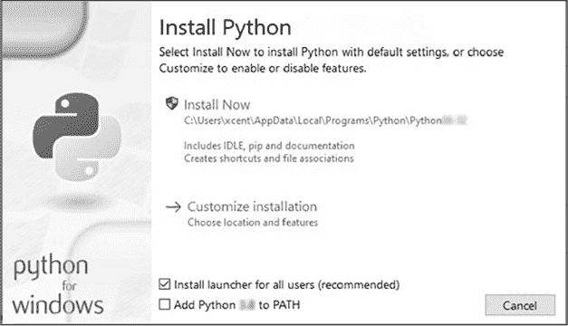
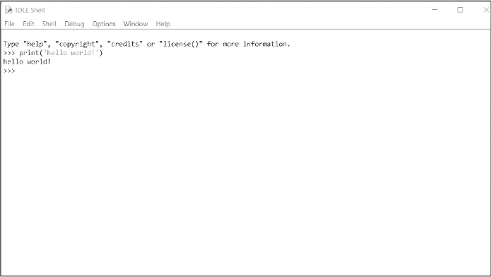
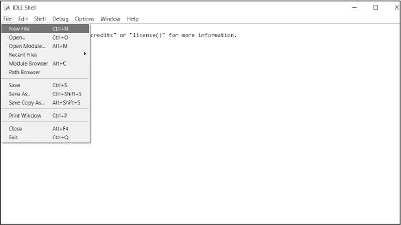
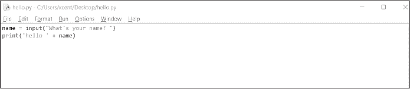
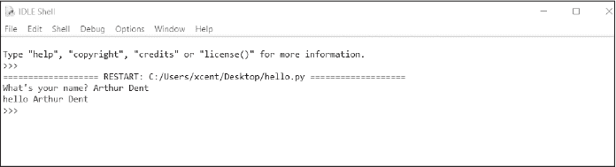

# <samp class="SANS_Dogma_OT_Bold_B_11">附录

PYTHON 基础

本附录的重点是快速回顾 Python 的基础知识。要全面了解 Python 的快速课程超出了 Dash 书籍的范围，因此我们将仅介绍如关键词、数据结构、控制流和函数等基础内容。网络上有许多优秀的资源可以帮助您更全面地掌握 Python，包括我们的免费电子邮件学堂：[*https://<wbr>blog<wbr>.finxter<wbr>.com<wbr>/email<wbr>-academy*](https://blog.finxter.com/email-academy)。

<samp class="SANS_Dogma_OT_Bold_B_15">注意</samp>

*本介绍部分使用了来自《Python One-Liners》（No Starch Press，2020）中的代码示例和文本片段，这本书由本书的其中一位作者撰写。我们鼓励您阅读本书，以全面理解单行 Python 代码。*

## <samp class="SANS_Futura_Std_Bold_B_11">安装与入门</samp>

如果您尚未安装 Python，您需要在计算机上安装 Python。由于 Python 不断发展，我们将保持此信息的一般性。

1.  首先，访问官方 Python 网站 [*https://<wbr>www<wbr>.python<wbr>.org<wbr>/downloads*](https://www.python.org/downloads)，下载适用于您的操作系统的最新版本的 Python。

2.  在计算机上运行安装程序。根据版本和操作系统的不同，您应该会看到类似 图 A-1 的对话框。请确保勾选将 Python 添加到 PATH 选项，以便您能够通过 Python 访问计算机上的任何目录。

<samp class="SANS_Futura_Std_Book_Oblique_I_11">图 A-1：安装 Python 的弹出窗口</samp>

3.  通过在命令行（Windows）、终端（macOS）或 shell（Linux）中运行以下命令，检查您的 Python 安装是否正常工作：

<samp class="SANS_TheSansMonoCd_W5Regular_11">$</samp> <samp class="SANS_TheSansMonoCd_W7Bold_B_11">python—version</samp>

<samp class="SANS_TheSansMonoCd_W5Regular_11">Python 3.</samp><samp class="SANS_TheSansMonoCd_W5Regular_Italic_I_11">x.x</samp>

<samp class="SANS_Dogma_OT_Bold_B_15">注意</samp>

*美元符号（$）只是一个提示符，表示您需要在终端或代码 shell 中运行接下来的代码。加粗的文本是您应该输入的命令。*

恭喜！您已在计算机上安装了 Python。您可以开始使用系统内置的 IDLE 编辑器编写自己的程序。只需在操作系统中搜索 *IDLE* 并打开该程序。

作为第一个程序，在您的 shell 中输入以下命令：

<samp class="SANS_TheSansMonoCd_W7Bold_B_11">print('hello world!')</samp>

Python 会解析您的命令，并将期望的文字打印到您的 shell 中（请参见 图 A-2）：

<samp class="SANS_TheSansMonoCd_W5Regular_11">hello world!</samp>

<samp class="SANS_Futura_Std_Book_Oblique_I_11">图 A-2：Python 中的 hello world 程序</samp>

这种与 Python 解释器进行来回交流的方式被称为 *交互模式*。它的优点是可以即时得到反馈。然而，编程的最令人兴奋的后果是自动化：编写一次程序并多次运行它。

让我们从一个简单的程序开始，每次运行时它会按名字向你问好。你可以保存程序并在任何时候再次运行它。这类程序叫做 *脚本*，你保存它们时会使用 *.py* 后缀，例如 *my_first_program.py*，来保存为 Python 文件。

你可以通过 IDLE shell 的菜单创建脚本，如 图 A-3 所示。

<samp class="SANS_Futura_Std_Book_Oblique_I_11">图 A-3：创建你自己的模块</samp>

点击 **文件** ► **新建文件**，然后将以下代码复制并粘贴到你的新文件中：

<samp class="SANS_TheSansMonoCd_W5Regular_11">name = input("你的名字是什么？")</samp>

<samp class="SANS_TheSansMonoCd_W5Regular_11">print('hello' + name)</samp>

将你的文件保存为 *hello.py*，保存在桌面或其他任何位置。你当前的脚本应该像 图 A-4 所示。

<samp class="SANS_Futura_Std_Book_Oblique_I_11">图 A-4：一个接受用户输入并将响应打印到标准输出的程序</samp>

现在，让我们开始一些操作：点击 **运行** ► **运行模块**。Python 程序会在交互式 shell 中开始执行，你无需逐行输入。它会逐行运行代码文件。第一行要求你输入名字，并等待你输入内容。第二行会接收你的名字并将其打印到 shell 中。图 A-5 展示了程序的实际运行。

<samp class="SANS_Futura_Std_Book_Oblique_I_11">图 A-5：图 A-4 中程序执行的示例</samp>

## <samp class="SANS_Futura_Std_Bold_B_11">数据类型</samp>

现在你已经看到一个 Python 程序的运行，我们将回顾一些基本的数据类型。

<samp class="SANS_Futura_Std_Bold_Condensed_Oblique_I_11">布尔值</samp>

布尔数据类型仅表示关键字 <samp class="SANS_TheSansMonoCd_W5Regular_11">False</samp> 或 <samp class="SANS_TheSansMonoCd_W5Regular_11">True</samp>。在 Python 中，布尔类型与整数数据类型密切相关，因为布尔类型内部使用整数值：<samp class="SANS_TheSansMonoCd_W5Regular_11">False</samp> 用整数 0 表示，<samp class="SANS_TheSansMonoCd_W5Regular_11">True</samp> 用整数 1 表示。布尔值通常用于断言或作为比较的结果。以下代码片段展示了这两个布尔关键字的实际应用：

<samp class="SANS_TheSansMonoCd_W5Regular_11">X = 1 > 2</samp>

<samp class="SANS_TheSansMonoCd_W5Regular_11">print(x)</samp>

<samp class="SANS_TheSansMonoCd_W5Regular_11"># False</samp>

<samp class="SANS_TheSansMonoCd_W5Regular_11">y = 2 > 1</samp>

<samp class="SANS_TheSansMonoCd_W5Regular_11">print(y)</samp>

<samp class="SANS_TheSansMonoCd_W5Regular_11"># True</samp>

在评估给定的表达式后，变量 <samp class="SANS_TheSansMonoCd_W5Regular_11">x</samp> 的值为 <samp class="SANS_TheSansMonoCd_W5Regular_11">False</samp>，变量 <samp class="SANS_TheSansMonoCd_W5Regular_11">y</samp> 的值为 <samp class="SANS_TheSansMonoCd_W5Regular_11">True</samp>。布尔值使我们能够创建条件执行代码，因此它们在处理数据时非常重要，因为它们允许我们在使用某个值之前先检查该值是否超过某个阈值（有关基于阈值的数据分类，请参见第七章中的 SVM Explorer 应用）。

布尔值有几个主要的运算符，代表基本的逻辑运算符：<samp class="SANS_TheSansMonoCd_W5Regular_11">and</samp>、<samp class="SANS_TheSansMonoCd_W5Regular_11">or</samp> 和 <samp class="SANS_TheSansMonoCd_W5Regular_11">not</samp>。关键字 <samp class="SANS_TheSansMonoCd_W5Regular_11">and</samp> 在表达式 <samp class="SANS_TheSansMonoCd_W5Regular_11">x and y</samp> 中，如果 <samp class="SANS_TheSansMonoCd_W5Regular_11">x</samp> 和 <samp class="SANS_TheSansMonoCd_W5Regular_11">y</samp> 都为 <samp class="SANS_TheSansMonoCd_W5Regular_11">True</samp>，则结果为 <samp class="SANS_TheSansMonoCd_W5Regular_11">True</samp>。如果其中任何一个是 <samp class="SANS_TheSansMonoCd_W5Regular_11">False</samp>，整个表达式的结果为 <samp class="SANS_TheSansMonoCd_W5Regular_11">False</samp>。

关键字 <samp class="SANS_TheSansMonoCd_W5Regular_11">or</samp> 在表达式 <samp class="SANS_TheSansMonoCd_W5Regular_11">x or y</samp> 中，如果 <samp class="SANS_TheSansMonoCd_W5Regular_11">x</samp> 为 <samp class="SANS_TheSansMonoCd_W5Regular_11">True</samp> *或* <samp class="SANS_TheSansMonoCd_W5Regular_11">y</samp> 为 <samp class="SANS_TheSansMonoCd_W5Regular_11">True</samp> *或* 两者都为 <samp class="SANS_TheSansMonoCd_W5Regular_11">True</samp>，则结果为 <samp class="SANS_TheSansMonoCd_W5Regular_11">True</samp>。如果其中有一个为 <samp class="SANS_TheSansMonoCd_W5Regular_11">True</samp>，整个表达式的结果为 <samp class="SANS_TheSansMonoCd_W5Regular_11">True</samp>。

关键字 <samp class="SANS_TheSansMonoCd_W5Regular_11">not</samp> 在表达式 <samp class="SANS_TheSansMonoCd_W5Regular_11">not x</samp> 中，如果 <samp class="SANS_TheSansMonoCd_W5Regular_11">x</samp> 为 <samp class="SANS_TheSansMonoCd_W5Regular_11">False</samp>，则结果为 <samp class="SANS_TheSansMonoCd_W5Regular_11">True</samp>。以下是一个使用每个布尔运算符的 Python 代码示例：

<samp class="SANS_TheSansMonoCd_W5Regular_11">x, y = True, False</samp>

<samp class="SANS_TheSansMonoCd_W5Regular_11">print(x or y)</samp>

<samp class="SANS_TheSansMonoCd_W5Regular_11"># True</samp>

<samp class="SANS_TheSansMonoCd_W5Regular_11">print(x and y)</samp>

<samp class="SANS_TheSansMonoCd_W5Regular_11"># True</samp>

<samp class="SANS_TheSansMonoCd_W5Regular_11">print(not y)</samp>

<samp class="SANS_TheSansMonoCd_W5Regular_11"># True</samp>

通过使用这三个运算符——<samp class="SANS_TheSansMonoCd_W5Regular_11">and</samp>、<samp class="SANS_TheSansMonoCd_W5Regular_11">or</samp> 和 <samp class="SANS_TheSansMonoCd_W5Regular_11">not</samp>——你可以表达所有你可能需要的逻辑表达式。

布尔运算符是有优先级顺序的。运算符 <samp class="SANS_TheSansMonoCd_W5Regular_11">not</samp> 拥有最高的优先级，其次是 <samp class="SANS_TheSansMonoCd_W5Regular_11">and</samp>，最后是 <samp class="SANS_TheSansMonoCd_W5Regular_11">or</samp>。请看以下示例：

<samp class="SANS_TheSansMonoCd_W5Regular_11">x, y = True, False</samp>

<samp class="SANS_TheSansMonoCd_W5Regular_11">print(x and not y)</samp>

<samp class="SANS_TheSansMonoCd_W5Regular_11"># True</samp>

<samp class="SANS_TheSansMonoCd_W5Regular_11">print(not x and y or x)</samp>

<samp class="SANS_TheSansMonoCd_W5Regular_11"># True</samp>

我们将变量 <samp class="SANS_TheSansMonoCd_W5Regular_11">x</samp> 设置为 <samp class="SANS_TheSansMonoCd_W5Regular_11">True</samp>，将 <samp class="SANS_TheSansMonoCd_W5Regular_11">y</samp> 设置为 <samp class="SANS_TheSansMonoCd_W5Regular_11">False</samp>。调用 <samp class="SANS_TheSansMonoCd_W5Regular_11">not x and y or x</samp> 时，Python 会将其解释为 <samp class="SANS_TheSansMonoCd_W5Regular_11">((not x) and y) or x</samp>，这与例如 <samp class="SANS_TheSansMonoCd_W5Regular_11">(not x) and (y or x)</samp> 是不同的。作为练习，试着找出*为什么*。

<samp class="SANS_Futura_Std_Bold_Condensed_Oblique_I_11">数值类型</samp>

最常用的两种数值数据类型是整数和浮点数。*整数*是没有浮动小数点精度的正数或负数（例如，<samp class="SANS_TheSansMonoCd_W5Regular_11">3</samp>）。*浮点数*是具有浮动小数点精度的正数或负数（例如，<samp class="SANS_TheSansMonoCd_W5Regular_11">3.14159265359</samp>）。Python 提供了各种内置的数值运算功能，还支持在数值数据类型之间进行转换。以下是几个算术运算的示例。首先，我们创建一个值为 3 的 <samp class="SANS_TheSansMonoCd_W5Regular_11">x</samp> 变量和一个值为 2 的 <samp class="SANS_TheSansMonoCd_W5Regular_11">y</samp> 变量：

<samp class="SANS_TheSansMonoCd_W5Regular_11">>>></samp> <samp class="SANS_TheSansMonoCd_W7Bold_B_11">x, y</samp> <samp class="SANS_TheSansMonoCd_W7Bold_B_11">=</samp> <samp class="SANS_TheSansMonoCd_W7Bold_B_11">3, 2</samp>

<samp class="SANS_TheSansMonoCd_W5Regular_11">>>></samp> <samp class="SANS_TheSansMonoCd_W7Bold_B_11">x</samp> <samp class="SANS_TheSansMonoCd_W7Bold_B_11">+</samp> <samp class="SANS_TheSansMonoCd_W7Bold_B_11">y</samp>

<samp class="SANS_TheSansMonoCd_W5Regular_11">5</samp>

<samp class="SANS_TheSansMonoCd_W5Regular_11">>>></samp> <samp class="SANS_TheSansMonoCd_W7Bold_B_11">x</samp> <samp class="SANS_TheSansMonoCd_W7Bold_B_11">—</samp> <samp class="SANS_TheSansMonoCd_W7Bold_B_11">y</samp>

<samp class="SANS_TheSansMonoCd_W5Regular_11">1</samp>

<samp class="SANS_TheSansMonoCd_W5Regular_11">>>></samp> <samp class="SANS_TheSansMonoCd_W7Bold_B_11">x * y</samp>

<samp class="SANS_TheSansMonoCd_W5Regular_11">6</samp>

<samp class="SANS_TheSansMonoCd_W5Regular_11">>>></samp> <samp class="SANS_TheSansMonoCd_W7Bold_B_11">x / y</samp>

<samp class="SANS_TheSansMonoCd_W5Regular_11">1.5</samp>

<samp class="SANS_TheSansMonoCd_W5Regular_11">>>></samp> <samp class="SANS_TheSansMonoCd_W7Bold_B_11">x // y</samp>

<samp class="SANS_TheSansMonoCd_W5Regular_11">1</samp>

<samp class="SANS_TheSansMonoCd_W5Regular_11">>>></samp> <samp class="SANS_TheSansMonoCd_W7Bold_B_11">x % y</samp>

<samp class="SANS_TheSansMonoCd_W5Regular_11">1</samp>

<samp class="SANS_TheSansMonoCd_W5Regular_11">>>></samp> <samp class="SANS_TheSansMonoCd_W7Bold_B_11">-x</samp>

<samp class="SANS_TheSansMonoCd_W5Regular_11">-3</samp>

<samp class="SANS_TheSansMonoCd_W5Regular_11">>>></samp> <samp class="SANS_TheSansMonoCd_W7Bold_B_11">abs(-x)</samp>

<samp class="SANS_TheSansMonoCd_W5Regular_11">3</samp>

<samp class="SANS_TheSansMonoCd_W5Regular_11">>>></samp> <samp class="SANS_TheSansMonoCd_W7Bold_B_11">int(3.9)</samp>

<samp class="SANS_TheSansMonoCd_W5Regular_11">3</samp>

<samp class="SANS_TheSansMonoCd_W5Regular_11">>>></samp> <samp class="SANS_TheSansMonoCd_W7Bold_B_11">float(3)</samp>

<samp class="SANS_TheSansMonoCd_W5Regular_11">3.0</samp>

<samp class="SANS_TheSansMonoCd_W5Regular_11">>>></samp> <samp class="SANS_TheSansMonoCd_W7Bold_B_11">x ** y</samp>

<samp class="SANS_TheSansMonoCd_W5Regular_11">9</samp>

前四种运算分别是加法、减法、乘法和除法。<samp class="SANS_TheSansMonoCd_W5Regular_11">//</samp> 运算符执行整数除法。结果是一个整数值，向下舍入到较小的整数（例如，<samp class="SANS_TheSansMonoCd_W5Regular_11">3 // 2</samp> <samp class="SANS_TheSansMonoCd_W5Regular_11">==</samp> <samp class="SANS_TheSansMonoCd_W5Regular_11">1</samp>）。<samp class="SANS_TheSansMonoCd_W5Regular_11">%</samp> 操作是 *取模操作*，它给你除法的余数。减号操作符 <samp class="SANS_TheSansMonoCd_W5Regular_11">–</samp> 会将值变为负数。<samp class="SANS_TheSansMonoCd_W5Regular_11">abs()</samp> 给出绝对值（即非负值）。<samp class="SANS_TheSansMonoCd_W5Regular_11">int()</samp> 会将值转换为整数，舍弃小数点后的数字。<samp class="SANS_TheSansMonoCd_W5Regular_11">float()</samp> 会将给定的值转换为浮动小数。双星号 <samp class="SANS_TheSansMonoCd_W5Regular_11">**</samp> 表示求幂。运算符优先级和你在学校学到的一样：括号优先于指数，指数优先于乘法，乘法优先于加法，依此类推。

<samp class="SANS_Futura_Std_Bold_Condensed_Oblique_I_11">字符串</samp>

Python 字符串是字符的序列。字符串是不可变的，因此一旦创建，不能更改；如果你想要一个修改过的字符串，你必须创建一个新的字符串。字符串通常只是放在引号中的文本（包括数字）：<samp class="SANS_TheSansMonoCd_W5Regular_11">"this is a string"</samp>。以下是创建字符串的五种最常见方法：

单引号：<samp class="SANS_TheSansMonoCd_W5Regular_11">'Yes'</samp>

双引号：<samp class="SANS_TheSansMonoCd_W5Regular_11">"Yes"</samp>

三引号（用于多行字符串）：<samp class="SANS_TheSansMonoCd_W5Regular_11">'''</samp><samp class="SANS_TheSansMonoCd_W5Regular_11">Yes'''</samp> 或 <samp class="SANS_TheSansMonoCd_W5Regular_11">" ""Yes" ""</samp>

字符串方法：<samp class="SANS_TheSansMonoCd_W5Regular_11">str(yes)</samp> <samp class="SANS_TheSansMonoCd_W5Regular_11">==</samp> <samp class="SANS_TheSansMonoCd_W5Regular_11">'yes'</samp> 是 <samp class="SANS_TheSansMonoCd_W5Regular_11">True</samp>

拼接：<samp class="SANS_TheSansMonoCd_W5Regular_11">'Py'</samp> <samp class="SANS_TheSansMonoCd_W5Regular_11">+</samp> <samp class="SANS_TheSansMonoCd_W5Regular_11">'thon'</samp> 变成 <samp class="SANS_TheSansMonoCd_W5Regular_11">'Python'</samp>

要在字符串中使用空白字符，你需要显式地指定它们。要在字符串中开始新的一行，使用换行符 <samp class="SANS_TheSansMonoCd_W5Regular_11">'\n'</samp>。要添加一个制表符的空格，使用制表符字符 <samp class="SANS_TheSansMonoCd_W5Regular_11">'\t'</samp>。

字符串也有自己的方法集。<samp class="SANS_TheSansMonoCd_W5Regular_11">strip()</samp> 方法移除前后空白字符，包括空格、制表符和换行符：

<samp class="SANS_TheSansMonoCd_W5Regular_11">y = " This is lazy\t\n "</samp>

<samp class="SANS_TheSansMonoCd_W5Regular_11">print(y.strip())</samp>

结果更加整洁：

<samp class="SANS_TheSansMonoCd_W5Regular_11">'This is lazy'</samp>

<samp class="SANS_TheSansMonoCd_W5Regular_11">lower()</samp> 方法将整个字符串转为小写：

<samp class="SANS_TheSansMonoCd_W5Regular_11">print("DrDre".lower())</samp>

我们得到：

<samp class="SANS_TheSansMonoCd_W5Regular_11">'drdre'</samp>

<samp class="SANS_TheSansMonoCd_W5Regular_11">upper()</samp> 方法将整个字符串转为大写：

<samp class="SANS_TheSansMonoCd_W5Regular_11">print("attention".upper())</samp>

这会给我们：

<samp class="SANS_TheSansMonoCd_W5Regular_11">'ATTENTION'</samp>

<samp class="SANS_TheSansMonoCd_W5Regular_11">startswith()</samp> 方法检查您提供的参数是否可以在字符串的开头找到：

<samp class="SANS_TheSansMonoCd_W5Regular_11">print("smartphone".startswith("smart"))</samp>

它返回一个布尔值：

<samp class="SANS_TheSansMonoCd_W5Regular_11">True</samp>

<samp class="SANS_TheSansMonoCd_W5Regular_11">endswith()</samp> 方法检查您提供的参数是否可以在字符串的末尾找到：

<samp class="SANS_TheSansMonoCd_W5Regular_11">print("smartphone".endswith("phone"))</samp>

这也返回一个布尔值：

<samp class="SANS_TheSansMonoCd_W5Regular_11">True</samp>

<samp class="SANS_TheSansMonoCd_W5Regular_11">find()</samp> 方法返回子字符串在原字符串中第一次出现的位置索引：

<samp class="SANS_TheSansMonoCd_W5Regular_11">print("another".find("other"))</samp>

像这样：

<samp class="SANS_TheSansMonoCd_W5Regular_11">匹配索引：2</samp>

<samp class="SANS_TheSansMonoCd_W5Regular_11">replace()</samp> 方法将第一个参数中的字符替换为第二个参数中的字符：

<samp class="SANS_TheSansMonoCd_W5Regular_11">print("cheat".replace("ch", "m"))</samp>

<samp class="SANS_TheSansMonoCd_W5Regular_11">cheat</samp> 变成了：

<samp class="SANS_TheSansMonoCd_W5Regular_11">meat</samp>

<samp class="SANS_TheSansMonoCd_W5Regular_11">join()</samp> 方法将可迭代对象中的所有值连接起来，使用调用该方法的字符串作为元素之间的分隔符：

<samp class="SANS_TheSansMonoCd_W5Regular_11">print(','.join(["F", "B", "I"]))</samp>

我们得到：

<samp class="SANS_TheSansMonoCd_W5Regular_11">F,B,I</samp>

<samp class="SANS_TheSansMonoCd_W5Regular_11">len()</samp> 方法返回字符串的字符数，包括空白字符：

<samp class="SANS_TheSansMonoCd_W5Regular_11">print(len("Rumpelstiltskin"))</samp>

这会给我们：

<samp class="SANS_TheSansMonoCd_W5Regular_11">字符串长度：15</samp>

<samp class="SANS_TheSansMonoCd_W5Regular_11">in</samp> 关键词在与字符串操作数一起使用时，用于检查一个字符串是否出现在另一个字符串中：

<samp class="SANS_TheSansMonoCd_W5Regular_11">print("ear" in "earth")</samp>

这也返回一个布尔值：

<samp class="SANS_TheSansMonoCd_W5Regular_11">包含：True</samp>

这个非排他性的字符串方法列表展示了 Python 的字符串数据类型既灵活又强大，你可以利用 Python 内建的功能解决许多常见的字符串问题。

## <samp class="SANS_Futura_Std_Bold_B_11">控制流</samp>

让我们深入探讨一些编程逻辑，使得我们的代码可以做出决策。算法就像一道烹饪食谱：如果食谱只是一个顺序命令的列表——把水倒进锅里，加入盐，加入米，去掉水，最后端上米饭——你可能几秒钟内完成这些步骤，最后得到的却是一碗未煮熟的米。我们需要根据不同的情况做出不同的反应：只有*当*米变软时，才从锅中去掉水；*当*水开了时，才把米放入锅中。根据不同情况做出响应的代码叫做*条件执行*代码。在 Python 中，条件执行的关键词有 <samp class="SANS_TheSansMonoCd_W5Regular_11">if</samp>、<samp class="SANS_TheSansMonoCd_W5Regular_11">else</samp> 和 <samp class="SANS_TheSansMonoCd_W5Regular_11">elif</samp>。

这是一个基本示例，用于比较两个数字：

<samp class="SANS_TheSansMonoCd_W5Regular_11">half_truth = 21</samp>

<samp class="SANS_TheSansMonoCd_W5Regular_11">if 2 * half_truth == 42:</samp>

<samp class="SANS_TheSansMonoCd_W5Regular_11">   print('Truth!')</samp>

<samp class="SANS_TheSansMonoCd_W5Regular_11">else:</samp>

<samp class="SANS_TheSansMonoCd_W5Regular_11">   print('Lie!')</samp>

这将打印：

<samp class="SANS_TheSansMonoCd_W5Regular_11">Truth!</samp>

<samp class="SANS_TheSansMonoCd_W5Regular_11">if</samp> 条件 <samp class="SANS_TheSansMonoCd_W5Regular_11">2 * half_truth</samp> <samp class="SANS_TheSansMonoCd_W5Regular_11">==</samp> <samp class="SANS_TheSansMonoCd_W5Regular_11">42</samp> 生成的结果要么是 <samp class="SANS_TheSansMonoCd_W5Regular_11">True</samp>，要么是 <samp class="SANS_TheSansMonoCd_W5Regular_11">False</samp>。如果表达式的值为 <samp class="SANS_TheSansMonoCd_W5Regular_11">True</samp>，我们进入第一个分支并打印 <samp class="SANS_TheSansMonoCd_W5Regular_11">Truth!</samp>。如果表达式的值为 <samp class="SANS_TheSansMonoCd_W5Regular_11">False</samp>，我们进入第二个分支并打印 <samp class="SANS_TheSansMonoCd_W5Regular_11">Lie!</samp>。由于表达式的值为 <samp class="SANS_TheSansMonoCd_W5Regular_11">True</samp>，因此进入第一个分支，Shell 输出为 <samp class="SANS_TheSansMonoCd_W5Regular_11">Truth!</samp>。

每个 Python 对象，如变量或列表，都有一个隐式的布尔值，这意味着我们可以将 Python 对象用作条件。例如，一个空列表的值为<samp class="SANS_TheSansMonoCd_W5Regular_11">False</samp>，而一个非空列表的值为<samp class="SANS_TheSansMonoCd_W5Regular_11">True</samp>：

<samp class="SANS_TheSansMonoCd_W5Regular_11">lst = []</samp>

<samp class="SANS_TheSansMonoCd_W5Regular_11">if lst:</samp>

<samp class="SANS_TheSansMonoCd_W5Regular_11">   print('满！')</samp>

<samp class="SANS_TheSansMonoCd_W5Regular_11">else:</samp>

<samp class="SANS_TheSansMonoCd_W5Regular_11">   print('空！')</samp>

这会打印：

<samp class="SANS_TheSansMonoCd_W5Regular_11">空！</samp>

如果你不需要<samp class="SANS_TheSansMonoCd_W5Regular_11">else</samp>分支，你可以直接跳过它，Python 会在条件评估为<samp class="SANS_TheSansMonoCd_W5Regular_11">False</samp>时跳过整个代码块：

<samp class="SANS_TheSansMonoCd_W5Regular_11">如果 2 + 2 == 4:</samp>

<samp class="SANS_TheSansMonoCd_W5Regular_11">   print('四')</samp>

这会打印：

<samp class="SANS_TheSansMonoCd_W5Regular_11">四</samp>

只有当<samp class="SANS_TheSansMonoCd_W5Regular_11">if</samp>条件评估为<samp class="SANS_TheSansMonoCd_W5Regular_11">True</samp>时，输出才会被打印。否则，什么也不会发生。代码没有副作用，因为它会被执行流跳过。

你还可以有多个条件的代码。在这种情况下，你可以使用<samp class="SANS_TheSansMonoCd_W5Regular_11">elif</samp>语句：

<samp class="SANS_TheSansMonoCd_W5Regular_11">x = input('你的数字：')</samp>

<samp class="SANS_TheSansMonoCd_W5Regular_11">if x ==</samp> <samp class="SANS_TheSansMonoCd_W5Regular_11">'1':</samp>

<samp class="SANS_TheSansMonoCd_W5Regular_11">   print('一个')</samp>

<samp class="SANS_TheSansMonoCd_W5Regular_11">elif x == '2':</samp>

<samp class="SANS_TheSansMonoCd_W5Regular_11">   print('两个')</samp>

<samp class="SANS_TheSansMonoCd_W5Regular_11">elif x == '3':</samp>

<samp class="SANS_TheSansMonoCd_W5Regular_11">   print('三个')</samp>

<samp class="SANS_TheSansMonoCd_W5Regular_11">else:</samp>

<samp class="SANS_TheSansMonoCd_W5Regular_11">   print('多个')</samp>

代码接受你的输入，并将其与字符串<samp class="SANS_TheSansMonoCd_W5Regular_11">'1'</samp>、<samp class="SANS_TheSansMonoCd_W5Regular_11">'2'</samp>和<samp class="SANS_TheSansMonoCd_W5Regular_11">'3'</samp>进行比较。在每种情况下，都会打印不同的输出。如果输入与任何字符串都不匹配，则进入最终分支，输出为<samp class="SANS_TheSansMonoCd_W5Regular_11">'MANY'</samp>。

以下代码片段接受用户输入，将其转换为整数，并存储在变量 <samp class="SANS_TheSansMonoCd_W5Regular_11">x</samp> 中。然后测试变量是否大于、等于或小于 3，并根据评估结果打印不同的消息。换句话说，代码以区分的方式响应不可预测的现实世界输入：

<samp class="SANS_TheSansMonoCd_W5Regular_11">x = int(input('请输入你的值：'))</samp>

<samp class="SANS_TheSansMonoCd_W5Regular_11">if x > 3:</samp>

<samp class="SANS_TheSansMonoCd_W5Regular_11">   print('大')</samp>

<samp class="SANS_TheSansMonoCd_W5Regular_11">elif x ==</samp> <samp class="SANS_TheSansMonoCd_W5Regular_11">3:</samp>

<samp class="SANS_TheSansMonoCd_W5Regular_11">   print('中')</samp>

<samp class="SANS_TheSansMonoCd_W5Regular_11">else:</samp>

<samp class="SANS_TheSansMonoCd_W5Regular_11">   print('小')</samp>

我们使用关键字 <samp class="SANS_TheSansMonoCd_W5Regular_11">if</samp> 后跟一个条件来决定执行路径。如果条件评估为 <samp class="SANS_TheSansMonoCd_W5Regular_11">True</samp>，执行路径将跟随紧接着的缩进块中的第一个分支。如果条件评估为 <samp class="SANS_TheSansMonoCd_W5Regular_11">False</samp>，则执行流会继续查找，并执行以下三种情况之一：

1.  评估额外的条件，条件由任意数量的 <samp class="SANS_TheSansMonoCd_W5Regular_11">elif</samp> 分支给出

2.  如果既没有 <samp class="SANS_TheSansMonoCd_W5Regular_11">if</samp> 条件也没有 <samp class="SANS_TheSansMonoCd_W5Regular_11">elif</samp> 条件满足，则进入 <samp class="SANS_TheSansMonoCd_W5Regular_11">else</samp> 分支

3.  如果没有给出 <samp class="SANS_TheSansMonoCd_W5Regular_11">else</samp> 分支，且没有符合的 <samp class="SANS_TheSansMonoCd_W5Regular_11">elif</samp> 分支，则跳过整个结构

规则是执行路径从顶部开始，逐行向下执行，直到某个条件匹配——此时执行对应的代码分支——或者所有条件都被检查过，但没有匹配。

在这里你可以看到，可以将对象传递给 <samp class="SANS_TheSansMonoCd_W5Regular_11">if</samp> 条件，并像布尔值一样使用它们：

<samp class="SANS_TheSansMonoCd_W5Regular_11">如果是 None、0、0.0、' '、[]、{} 或 set():</samp>

<samp class="SANS_TheSansMonoCd_W5Regular_11">   print('死代码') # 不会执行</samp>

<samp class="SANS_TheSansMonoCd_W5Regular_11">if</samp> 条件的评估结果是 <samp class="SANS_TheSansMonoCd_W5Regular_11">False</samp>，因此 <samp class="SANS_TheSansMonoCd_W5Regular_11">print</samp> 语句永远不会被执行。因为以下值会被评估为布尔值 <samp class="SANS_TheSansMonoCd_W5Regular_11">False</samp>：关键字 <samp class="SANS_TheSansMonoCd_W5Regular_11">None</samp>、整数值 <samp class="SANS_TheSansMonoCd_W5Regular_11">0</samp>、浮动值 <samp class="SANS_TheSansMonoCd_W5Regular_11">0.0</samp>、空字符串和空容器类型。表达式 <samp class="SANS_TheSansMonoCd_W5Regular_11">None or 0 or 0.0 or ' ' or [] or {} or set()</samp> 的评估结果为 <samp class="SANS_TheSansMonoCd_W5Regular_11">True</samp>，如果 Python 能够隐式将任意操作数转换为 <samp class="SANS_TheSansMonoCd_W5Regular_11">True</samp>，但在此情况下，由于所有操作数都被转换为 <samp class="SANS_TheSansMonoCd_W5Regular_11">False</samp>，因此不成立。

## <samp class="SANS_Futura_Std_Bold_B_11">重复执行</samp>

为了允许类似代码片段的重复执行，Python 提供了两种类型的循环：<samp class="SANS_TheSansMonoCd_W5Regular_11">for</samp> 循环和 <samp class="SANS_TheSansMonoCd_W5Regular_11">while</samp> 循环。我们将分别创建一个 <samp class="SANS_TheSansMonoCd_W5Regular_11">for</samp> 循环和一个 <samp class="SANS_TheSansMonoCd_W5Regular_11">while</samp> 循环，以不同的方式实现相同的功能：将整数 0、1 和 2 打印到 Python shell 中。

这是 <samp class="SANS_TheSansMonoCd_W5Regular_11">for</samp> 循环：

<samp class="SANS_TheSansMonoCd_W5Regular_11">for i in [0, 1, 2]:</samp>

<samp class="SANS_TheSansMonoCd_W5Regular_11">   print(i)</samp>

这将打印：

<samp class="SANS_TheSansMonoCd_W5Regular_11">0</samp>

<samp class="SANS_TheSansMonoCd_W5Regular_11">1</samp>

<samp class="SANS_TheSansMonoCd_W5Regular_11">2</samp>

<samp class="SANS_TheSansMonoCd_W5Regular_11">for</samp> 循环通过声明一个循环变量 <samp class="SANS_TheSansMonoCd_W5Regular_11">i</samp> 来反复执行循环体，该变量会依次取列表 <samp class="SANS_TheSansMonoCd_W5Regular_11">[0, 1, 2]</samp> 中的所有值。然后它会打印变量 <samp class="SANS_TheSansMonoCd_W5Regular_11">i</samp>，直到所有值都用完。

这是具有相似语义的 <samp class="SANS_TheSansMonoCd_W5Regular_11">while</samp> 循环版本：

<samp class="SANS_TheSansMonoCd_W5Regular_11">i = 0</samp>

<samp class="SANS_TheSansMonoCd_W5Regular_11">while i < 3:</samp>

<samp class="SANS_TheSansMonoCd_W5Regular_11">   print(i)</samp>

<samp class="SANS_TheSansMonoCd_W5Regular_11">   i = i + 1</samp>

这也会打印：

<samp class="SANS_TheSansMonoCd_W5Regular_11">0</samp>

<samp class="SANS_TheSansMonoCd_W5Regular_11">1</samp>

<samp class="SANS_TheSansMonoCd_W5Regular_11">2</samp>

<samp class="SANS_TheSansMonoCd_W5Regular_11">while</samp> 循环在满足条件时执行循环体——在我们的例子中，条件是 <samp class="SANS_TheSansMonoCd_W5Regular_11">i</samp> <samp class="SANS_TheSansMonoCd_W5Regular_11"><</samp> <samp class="SANS_TheSansMonoCd_W5Regular_11">3</samp>。你选择使用哪种循环取决于你的情况。一般来说，当你需要遍历固定数量的元素时，例如遍历列表中的所有元素，就会使用 <samp class="SANS_TheSansMonoCd_W5Regular_11">for</samp> 循环；而当你想要重复某个动作直到达到某个结果时，例如猜测密码直到成功登录时，就会使用 <samp class="SANS_TheSansMonoCd_W5Regular_11">while</samp> 循环。

终止循环有两种基本方法：一种是定义一个循环条件，使其在某一时刻返回 <samp class="SANS_TheSansMonoCd_W5Regular_11">False</samp>，就像前面的例子那样；另一种方法是在循环体内的特定位置使用关键字 <samp class="SANS_TheSansMonoCd_W5Regular_11">break</samp> 来停止循环。这里我们使用 <samp class="SANS_TheSansMonoCd_W5Regular_11">break</samp> 来退出一个本来会是无限循环的情况：

<samp class="SANS_TheSansMonoCd_W5Regular_11">while True:</samp>

<samp class="SANS_TheSansMonoCd_W5Regular_11">   break # 无无限循环</samp>

<samp class="SANS_TheSansMonoCd_W5Regular_11">print('hello world')</samp>

从中我们得到：

<samp class="SANS_TheSansMonoCd_W5Regular_11">hello world</samp>

我们创建了一个 <samp class="SANS_TheSansMonoCd_W5Regular_11">while</samp> 循环，其循环条件始终会被评估为 <samp class="SANS_TheSansMonoCd_W5Regular_11">True</samp>，因为循环条件 <samp class="SANS_TheSansMonoCd_W5Regular_11">while True</samp> 本身就是 <samp class="SANS_TheSansMonoCd_W5Regular_11">True</samp>。当执行到 <samp class="SANS_TheSansMonoCd_W5Regular_11">break</samp> 时，循环提前结束，代码继续执行 <samp class="SANS_TheSansMonoCd_W5Regular_11">print('hello world')</samp>。

你可能会疑惑，如果我们不想让循环一直运行，为什么要创建一个无限循环？这其实是一种常见的做法，例如，在开发 Web 服务器时，服务器必须使用无限循环来等待新的 Web 请求并处理请求。然而，你仍然希望能够在适当时终止循环。在 Web 服务器的例子中，你可能希望在服务器检测到被攻击时停止服务文件。在这些情况下，你可以使用关键字 <samp class="SANS_TheSansMonoCd_W5Regular_11">break</samp> 来在满足某个条件时停止循环。

也可以强制 Python 解释器跳过循环中的某些区域，而不是提前结束循环。在我们的 Web 服务器示例中，你可能希望跳过恶意的 Web 请求，而不是完全停止服务器。你可以使用 <samp class="SANS_TheSansMonoCd_W5Regular_11">continue</samp> 关键词来实现，它会结束当前的循环迭代并将执行流返回到开始处的循环条件：

<samp class="SANS_TheSansMonoCd_W5Regular_11">while True:</samp>

<samp class="SANS_TheSansMonoCd_W5Regular_11">   continue</samp>

<samp class="SANS_TheSansMonoCd_W5Regular_11">   print('43') # Dead code</samp>

这段代码会永远执行下去，并且不会执行一次 <samp class="SANS_TheSansMonoCd_W5Regular_11">print</samp> 语句，因为 <samp class="SANS_TheSansMonoCd_W5Regular_11">continue</samp> 语句结束了当前的循环迭代，并在到达 <samp class="SANS_TheSansMonoCd_W5Regular_11">print()</samp> 行之前将执行流带回了开始的地方。那行 <samp class="SANS_TheSansMonoCd_W5Regular_11">print()</samp> 现在被视为 *死代码*：即永远不会执行的代码。<samp class="SANS_TheSansMonoCd_W5Regular_11">continue</samp> 语句和 <samp class="SANS_TheSansMonoCd_W5Regular_11">break</samp> 通常仅与使用 <samp class="SANS_TheSansMonoCd_W5Regular_11">if-else</samp> 的附加条件一起使用，如下所示：

<samp class="SANS_TheSansMonoCd_W5Regular_11">while True:</samp>

<samp class="SANS_TheSansMonoCd_W5Regular_11">   user_input = input('your password: ')</samp>

<samp class="SANS_TheSansMonoCd_W5Regular_11">   if user_input == '42':</samp>

<samp class="SANS_TheSansMonoCd_W5Regular_11">      break</samp>

<samp class="SANS_TheSansMonoCd_W5Regular_11">   print('wrong!') # Dead code</samp>

<samp class="SANS_TheSansMonoCd_W5Regular_11">print('恭喜，你找到了秘密密码！')</samp>

这段代码请求一个密码并一直执行，直到用户猜出密码为止。如果用户输入正确的密码 <samp class="SANS_TheSansMonoCd_W5Regular_11">42</samp>，会到达 <samp class="SANS_TheSansMonoCd_W5Regular_11">break</samp> 语句，循环终止，执行流跳到成功的 <samp class="SANS_TheSansMonoCd_W5Regular_11">print</samp> 语句那里。否则，循环会中断，执行流返回到开始，用户需要重新尝试。以下是一个示例用法：

<samp class="SANS_TheSansMonoCd_W5Regular_11">your password: 41</samp>

<samp class="SANS_TheSansMonoCd_W5Regular_11">wrong!</samp>

<samp class="SANS_TheSansMonoCd_W5Regular_11">your password: 21</samp>

<samp class="SANS_TheSansMonoCd_W5Regular_11">wrong!</samp>

<samp class="SANS_TheSansMonoCd_W5Regular_11">your password: 42</samp>

<samp class="SANS_TheSansMonoCd_W5Regular_11">恭喜，你找到了秘密密码！</samp>

这些是控制程序执行流程的最重要关键词。

## <samp class="SANS_Futura_Std_Bold_B_11">其他有用的关键字</samp>

让我们看一些其他有用的关键字。<samp class="SANS_TheSansMonoCd_W5Regular_11">in</samp> 关键字用于检查某个元素是否存在于给定的序列或容器类型中。这里我们检查 42 是否在下面的列表中，然后检查 21 是否可以作为字符串在集合中找到：

<samp class="SANS_TheSansMonoCd_W5Regular_11">print(42 in [2, 39, 42])</samp>

<samp class="SANS_TheSansMonoCd_W5Regular_11"># True</samp>

<samp class="SANS_TheSansMonoCd_W5Regular_11">print('21' in {'2', '39', '42'})</samp>

<samp class="SANS_TheSansMonoCd_W5Regular_11"># False</samp>

<samp class="SANS_TheSansMonoCd_W5Regular_11">in</samp> 关键字返回布尔值，因此第一个语句会返回 <samp class="SANS_TheSansMonoCd_W5Regular_11">True</samp>，第二个返回 <samp class="SANS_TheSansMonoCd_W5Regular_11">False</samp>。

<samp class="SANS_TheSansMonoCd_W5Regular_11">is</samp> 关键字用于检查两个变量是否指向内存中的同一个对象。Python 初学者经常对 <samp class="SANS_TheSansMonoCd_W5Regular_11">is</samp> 关键字的确切含义感到困惑，但值得花时间彻底理解它。这里我们看到两个变量指向内存中同一个对象的区别，以及两个看起来相似但指向不同对象的列表：

<samp class="SANS_TheSansMonoCd_W5Regular_11">x =</samp> <samp class="SANS_TheSansMonoCd_W5Regular_11">3</samp>

<samp class="SANS_TheSansMonoCd_W5Regular_11">y = x</samp>

<samp class="SANS_TheSansMonoCd_W5Regular_11">print(x is y)</samp>

<samp class="SANS_TheSansMonoCd_W5Regular_11"># True</samp>

<samp class="SANS_TheSansMonoCd_W5Regular_11">print([3] is [3])</samp>

<samp class="SANS_TheSansMonoCd_W5Regular_11"># False</samp>

正如你在后面的示例中看到的，如果你创建两个列表——即使它们包含相同的元素——它们仍然在内存中指向两个不同的列表对象。如果你稍后决定修改其中一个列表对象，这不会影响另一个列表对象。如果你检查一个列表是否指向内存中的相同对象，结果会是 <samp class="SANS_TheSansMonoCd_W5Regular_11">False</samp>。在这里，当我们检查 <samp class="SANS_TheSansMonoCd_W5Regular_11">x</samp> 是否为 <samp class="SANS_TheSansMonoCd_W5Regular_11">y</samp> 时，返回的是 <samp class="SANS_TheSansMonoCd_W5Regular_11">True</samp>，因为我们显式地将 <samp class="SANS_TheSansMonoCd_W5Regular_11">y</samp> 设置为指向 <samp class="SANS_TheSansMonoCd_W5Regular_11">x</samp>。然而，当我们检查列表 <samp class="SANS_TheSansMonoCd_W5Regular_11">[3]</samp> 与 <samp class="SANS_TheSansMonoCd_W5Regular_11">[3]</samp> 是否相等时，我们得到 <samp class="SANS_TheSansMonoCd_W5Regular_11">False</samp>，因为这两个列表指向内存中的不同对象。如果你修改一个，它不会改变另一个！

## <samp class="SANS_Futura_Std_Bold_B_11">函数</samp>

*函数*是可重用的代码片段，完成特定任务。程序员通常会与其他程序员共享函数来处理特定任务，从而节省编写代码的时间和精力。

你使用<samp class="SANS_TheSansMonoCd_W5Regular_11">def</samp>关键字来定义一个函数。这里我们定义了两个简单的函数，每个函数都打印一个字符串：

<samp class="SANS_TheSansMonoCd_W5Regular_11">def say_hi():</samp>

<samp class="SANS_TheSansMonoCd_W5Regular_11">   print('hi!')</samp>

<samp class="SANS_TheSansMonoCd_W5Regular_11">def say_hello():</samp>

<samp class="SANS_TheSansMonoCd_W5Regular_11">   print('hello!')</samp>

函数由函数名和括号组成，前面加上<samp class="SANS_TheSansMonoCd_W5Regular_11">def</samp>关键字，以及函数体，它是一个缩进的代码块。这个代码块可以包含其他缩进的块，比如<samp class="SANS_TheSansMonoCd_W5Regular_11">if</samp>语句，甚至是进一步的函数定义。和 Python 中的任何块定义一样，你必须缩进函数的主体。

这是一个函数，它在新行上打印两个字符串：

<samp class="SANS_TheSansMonoCd_W5Regular_11">def say_bye():</samp>

<samp class="SANS_TheSansMonoCd_W5Regular_11">   print('Time to go…')</samp>

<samp class="SANS_TheSansMonoCd_W5Regular_11">   print('Bye! ')</samp>

这样在 Python 终端中运行这三个函数：

<samp class="SANS_TheSansMonoCd_W5Regular_11">Say_hi()</samp>

<samp class="SANS_TheSansMonoCd_W5Regular_11">Say_hello()</samp>

<samp class="SANS_TheSansMonoCd_W5Regular_11">Say_bye()</samp>

这是输出结果：

<samp class="SANS_TheSansMonoCd_W5Regular_11">hi!</samp>

<samp class="SANS_TheSansMonoCd_W5Regular_11">hello!</samp>

<samp class="SANS_TheSansMonoCd_W5Regular_11">Time to go…</samp>

<samp class="SANS_TheSansMonoCd_W5Regular_11">Bye!</samp>

这些函数按顺序执行。

<samp class="SANS_Futura_Std_Bold_Condensed_Oblique_I_11">参数</samp>

函数也可以在括号内接受参数。一个*参数*允许你定制输出。考虑这个函数，它将名字作为唯一的参数，并将自定义字符串输出到终端：

<samp class="SANS_TheSansMonoCd_W5Regular_11">def say_hi(name):</samp>

<samp class="SANS_TheSansMonoCd_W5Regular_11">   print('hi ' +</samp> <samp class="SANS_TheSansMonoCd_W5Regular_11">name)</samp>

<samp class="SANS_TheSansMonoCd_W5Regular_11">say_hi('Alice')</samp>

<samp class="SANS_TheSansMonoCd_W5Regular_11">say_hi('Bob')</samp>

我们定义了函数，然后用不同的参数运行它两次：<samp class="SANS_TheSansMonoCd_W5Regular_11">'Alice'</samp>然后<samp class="SANS_TheSansMonoCd_W5Regular_11">'Bob'</samp>。因此，函数执行的输出是不同的：

<samp class="SANS_TheSansMonoCd_W5Regular_11">hi Alice</samp>

<samp class="SANS_TheSansMonoCd_W5Regular_11">hi Bob</samp>

函数也可以接受多个参数：

<samp class="SANS_TheSansMonoCd_W5Regular_11">def say_hi(a, b):</samp>

<samp class="SANS_TheSansMonoCd_W5Regular_11">   print(a + ' says hi to ' + b)</samp>

<samp class="SANS_TheSansMonoCd_W5Regular_11">say_hi('Alice', 'Bob')</samp>

<samp class="SANS_TheSansMonoCd_W5Regular_11">say_hi('Bob', 'Alice')</samp>

输出如下：

<samp class="SANS_TheSansMonoCd_W5Regular_11">Alice 向 Bob 打招呼</samp>

<samp class="SANS_TheSansMonoCd_W5Regular_11">Bob 向 Alice 打招呼</samp>

在第一次执行函数时，参数变量 <samp class="SANS_TheSansMonoCd_W5Regular_11">a</samp> 取值为字符串 <samp class="SANS_TheSansMonoCd_W5Regular_11">'Alice'</samp>，而参数变量 <samp class="SANS_TheSansMonoCd_W5Regular_11">b</samp> 取值为字符串 <samp class="SANS_TheSansMonoCd_W5Regular_11">'Bob'</samp>。第二次执行函数时，这两个参数的值会交换，从而得到不同的输出。

函数也可以有返回值，因此你可以将一个值传递给函数，并获得一个返回值，然后可以在代码中稍后使用该值，如列表 A-1 所示。

<samp class="SANS_TheSansMonoCd_W5Regular_11">def f(a, b):</samp>

<samp class="SANS_TheSansMonoCd_W5Regular_11">   return a + b</samp>

<samp class="SANS_TheSansMonoCd_W5Regular_11">x =</samp> <samp class="SANS_TheSansMonoCd_W5Regular_11">f(2, 2)</samp>

<samp class="SANS_TheSansMonoCd_W5Regular_11">y = f(40, 2)</samp>

<samp class="SANS_TheSansMonoCd_W5Regular_11">print(x)</samp>

<samp class="SANS_TheSansMonoCd_W5Regular_11">print(y)</samp>

<samp class="SANS_Futura_Std_Book_Oblique_I_11">列表 A-1：使用 return 关键字</samp>

返回值是紧跟在`return`关键字后的表达式，它也会终止函数。Python 会在`return`关键字之后检查返回值，并结束函数，立即将这个值返回给函数的调用者。

如果你没有显式提供返回表达式，Python 会隐式地在函数末尾添加表达式 `return None`。`None`关键字表示*没有值*。其他编程语言，如 Java，使用`null`关键字，这通常会让初学者误以为它等同于整数值 0。而 Python 使用`None`来表示它是一个空对象，如空列表或空字符串，而不是数值 0。

当一个函数执行完成时，执行流程总是会传递给调用该函数的地方；`return`关键字只是让你更好地控制*何时*终止函数以及*返回什么*值。

我们将 <samp class="SANS_TheSansMonoCd_W5Regular_11">a=2</samp> 和 <samp class="SANS_TheSansMonoCd_W5Regular_11">b=2</samp> 传递给 示例 A-1 中的函数，得到结果 <samp class="SANS_TheSansMonoCd_W5Regular_11">4</samp>。然后我们将 <samp class="SANS_TheSansMonoCd_W5Regular_11">a=40</samp> 和 <samp class="SANS_TheSansMonoCd_W5Regular_11">b=2</samp> 传递进去，得到（唯一的）答案 <samp class="SANS_TheSansMonoCd_W5Regular_11">42</samp>。以下是输出：

<samp class="SANS_TheSansMonoCd_W5Regular_11">4</samp>

<samp class="SANS_TheSansMonoCd_W5Regular_11">42</samp>

几乎每个仪表盘应用程序都至少包含一个添加交互性的函数。通常，你可能有一个根据用户输入更新图表的函数，类似这样的：

<samp class="SANS_TheSansMonoCd_W5Regular_11">def update_graph(value):</samp>

<samp class="SANS_TheSansMonoCd_W5Regular_11">   if value == 2:</samp>

<samp class="SANS_TheSansMonoCd_W5Regular_11">      return 'something'</samp>

接下来，我们将介绍 Python 中一个更高级且高度相关的特性：*默认函数参数*。

<samp class="SANS_Futura_Std_Bold_Condensed_Oblique_I_11">默认函数参数</samp>

默认参数允许你在 Python 中定义具有可选参数的函数。如果用户在调用函数时没有提供参数，就会使用默认参数。你通过在参数名后使用等号（<samp class="SANS_TheSansMonoCd_W5Regular_11">=</samp>）并附加默认值来设置默认参数。

列表 A-2 展示了一个更有趣的例子。这里我们定义了一个函数<scode class="SANS_TheSansMonoCd_W5Regular_11">add()</samp>，它返回函数参数<scode class="SANS_TheSansMonoCd_W5Regular_11">a</samp>和<scode class="SANS_TheSansMonoCd_W5Regular_11">b</samp>的和。因此，<samp class="SANS_TheSansMonoCd_W5Regular_11">add(1,2)</samp>将返回<samp class="SANS_TheSansMonoCd_W5Regular_11">3</samp>，而<samp class="SANS_TheSansMonoCd_W5Regular_11">add(41,1)</samp>将返回<samp class="SANS_TheSansMonoCd_W5Regular_11">42</samp>。我们为函数参数指定了默认值：<samp class="SANS_TheSansMonoCd_W5Regular_11">0</samp>为<scode class="SANS_TheSansMonoCd_W5Regular_11">a</samp>，<samp class="SANS_TheSansMonoCd_W5Regular_11">1</samp>为<scode class="SANS_TheSansMonoCd_W5Regular_11">b</samp>。如果在函数调用中没有传递其中一个或两个参数的值，则会使用默认值。因此，<samp class="SANS_TheSansMonoCd_W5Regular_11">add(1)</samp>将返回<samp class="SANS_TheSansMonoCd_W5Regular_11">2</samp>，<samp class="SANS_TheSansMonoCd_W5Regular_11">add(-1)</samp>将返回<samp class="SANS_TheSansMonoCd_W5Regular_11">0</samp>，而<samp class="SANS_TheSansMonoCd_W5Regular_11">add()</samp>将返回<samp class="SANS_TheSansMonoCd_W5Regular_11">1</samp>，因为默认参数<code class="SANS_TheSansMonoCd_W5Regular_11">0</code>和<code class="SANS_TheSansMonoCd_W5Regular_11">1</code>将用于 a 和 b。

<samp class="SANS_TheSansMonoCd_W5Regular_11">def add(a=0, b=1):</samp>

<samp class="SANS_TheSansMonoCd_W5Regular_11">   return a + b</samp>

<samp class="SANS_TheSansMonoCd_W5Regular_11">print(add(add(</samp><samp class="SANS_TheSansMonoCd_W7Bold_B_11">add()</samp><samp class="SANS_TheSansMonoCd_W5Regular_11">)))</samp>

<samp class="SANS_Futura_Std_Book_Oblique_I_11">列表 A-2：定义带默认参数的函数</samp>

这将输出：

<samp class="SANS_TheSansMonoCd_W5Regular_11">3</samp>

在我们突出显示的最内层函数调用中，<samp class="SANS_TheSansMonoCd_W5Regular_11">print(add(add(</samp><samp class="SANS_TheSansMonoCd_W7Bold_B_11">add()</samp><samp class="SANS_TheSansMonoCd_W5Regular_11">)))</samp>，我们调用了没有参数的函数<scode class="SANS_TheSansMonoCd_W5Regular_11">add()</samp>，因此它使用了<a>和<b>的默认值（分别为 0 和 1）。

对于剩下的两个调用，你只需要向 <samp class="SANS_TheSansMonoCd_W5Regular_11">add()</samp> 传递一个参数，该参数是上一个函数调用的返回值。这个参数将接收 <samp class="SANS_TheSansMonoCd_W5Regular_11">a</samp>，通过参数的位置来决定该传递哪个参数给哪个变量，而 <samp class="SANS_TheSansMonoCd_W5Regular_11">b</samp> 将使用其默认值 1。最内层的第一个 <samp class="SANS_TheSansMonoCd_W5Regular_11">add()</samp> 调用返回 1。这个值会传递给第二个调用的 <samp class="SANS_TheSansMonoCd_W5Regular_11">add()</samp>，并增加 1，然后这个值再在第三个调用中增加 1。

下面是我们执行 Listing A-2 时的背后步骤：

<samp class="SANS_TheSansMonoCd_W5Regular_11">add(add(add()))</samp>

<samp class="SANS_TheSansMonoCd_W5Regular_11">   = add(add(1))</samp>

<samp class="SANS_TheSansMonoCd_W5Regular_11">   = add(2)</samp>

<samp class="SANS_TheSansMonoCd_W5Regular_11">   = 3</samp>

你可以看到，默认参数可以帮助你使函数在处理输入时更加灵活。

## <samp class="SANS_Futura_Std_Bold_B_11">Python 资源与进一步阅读</samp>

+   随时查看 *Python 一行代码* 入门视频，这些视频可以在 [*https://<wbr>pythononeliners<wbr>.com*](https://pythononeliners.com) 免费获取。

+   官方的 Python 网站，包含最新的 Python 版本下载，可以在 [*https://<wbr>www<wbr>.python<wbr>.org*](https://www.python.org) 找到。

+   你可以在 Finxter 博客上找到有关 Python 列表的完整教程和详细的视频内容，链接为 [*https://<wbr>blog<wbr>.finxter<wbr>.com<wbr>/python<wbr>-lists*](https://blog.finxter.com/python-lists)。

+   有关 Python 切片的完整教程和视频，请访问 [*https://<wbr>blog<wbr>.finxter<wbr>.com<wbr>/introduction<wbr>-to<wbr>-slicing<wbr>-in<wbr>-python*](https://blog.finxter.com/introduction-to-slicing-in-python)。

+   你可以在 [*https://<wbr>blog<wbr>.finxter<wbr>.com<wbr>/python<wbr>-dictionary*](https://blog.finxter.com/python-dictionary) 找到有关 Python 字典的完整指南。

+   有关列表推导的指南和视频可以在 [*https://<wbr>blog<wbr>.finxter<wbr>.com<wbr>/list<wbr>-comprehension*](https://blog.finxter.com/list-comprehension) 查看。

+   一个面向面向对象编程（OOP）的备忘单可以作为 PDF 下载，链接为 [*https://<wbr>blog<wbr>.finxter<wbr>.com<wbr>/object<wbr>-oriented<wbr>-programming<wbr>-terminology<wbr>-cheat<wbr>-sheet<wbr>*](https://blog.finxter.com/object-oriented-programming-terminology-cheat-sheet)。

+   你可以在 [*https://<wbr>blog<wbr>.finxter<wbr>.com<wbr>/python<wbr>-crash<wbr>-course*](https://blog.finxter.com/python-crash-course) 查找更多备忘单和免费的 Python 入门课程。
