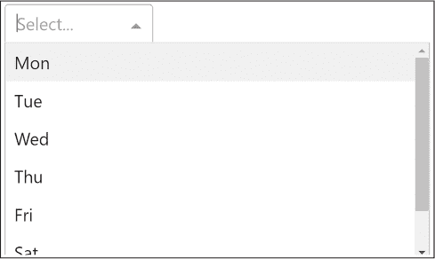

## <samp class="SANS_Futura_Std_Bold_Condensed_B_11">1</samp> <samp class="SANS_Dogma_OT_Bold_B_11">PYTHON 回顾</samp>

如果你打算开发 Dash 应用程序，可能至少已经了解一点 Python。尽管本书不会假设你是专家，但我们会复习一些在使用 Dash 时更相关的 Python 概念，包括列表、字典、面向对象编程和装饰器函数。如果你已经非常熟悉这些领域，可以直接跳到 第二章，本章将介绍我们将在本书中使用的 Python IDE——PyCharm。

### <samp class="SANS_Futura_Std_Bold_B_11">列表</samp>

让我们快速复习一下在几乎所有 Dash 应用程序中都使用的最重要的容器数据类型：Python 列表！在 Dash 中，列表非常重要，因为它们用于定义布局，包含 Dash Bootstrap 主题，并且通常出现在回调和由 Plotly 构建的图形中。

列表容器类型存储一系列元素。列表是可变的，意味着你可以在创建后修改它们。在这里，我们创建了一个名为 <samp class="SANS_TheSansMonoCd_W5Regular_11">lst</samp> 的列表，并打印其长度：

<samp class="SANS_TheSansMonoCd_W5Regular_11">lst = [1, 2, 2]</samp>

<samp class="SANS_TheSansMonoCd_W5Regular_11">print(len(lst))</samp>

我们的输出仅为：

<samp class="SANS_TheSansMonoCd_W5Regular_11">3</samp>

我们使用方括号和逗号分隔的元素来创建列表。列表可以包含任意的 Python 对象、重复值，甚至其他列表，因此它们是 Python 中最灵活的容器类型之一。在这里，我们用三个整数元素填充了我们的列表 <samp class="SANS_TheSansMonoCd_W5Regular_11">lst</samp>。<samp class="SANS_TheSansMonoCd_W5Regular_11">len()</samp> 函数返回列表中的元素数量。

<samp class="SANS_Futura_Std_Bold_Condensed_Oblique_I_11">添加元素</samp>

向已存在的列表添加元素有三种常见方法：追加、插入和连接。

<samp class="SANS_TheSansMonoCd_W5Regular_11">append()</samp> 方法将其参数放置在列表的末尾。以下是一个追加的示例：

<samp class="SANS_TheSansMonoCd_W5Regular_11">lst = [1, 2, 2]</samp>

<samp class="SANS_TheSansMonoCd_W5Regular_11">lst.append(4)</samp>

<samp class="SANS_TheSansMonoCd_W5Regular_11">print(lst)</samp>

这将打印：

<samp class="SANS_TheSansMonoCd_W5Regular_11">[1, 2, 2, 4]</samp>

<samp class="SANS_TheSansMonoCd_W5Regular_11">insert()</samp> 方法将在给定的位置插入一个元素，并将所有后续元素向右移动。以下是一个插入的示例：

<samp class="SANS_TheSansMonoCd_W5Regular_11">lst = [1, 2, 4]</samp>

<samp class="SANS_TheSansMonoCd_W5Regular_11">lst.insert(2,2)</samp>

<samp class="SANS_TheSansMonoCd_W5Regular_11">print(lst)</samp>

这将打印相同的结果：

<samp class="SANS_TheSansMonoCd_W5Regular_11">[1, 2, 2, 4]</samp>

最后，连接操作：

<samp class="SANS_TheSansMonoCd_W5Regular_11">print([1, 2, 2] +</samp> <samp class="SANS_TheSansMonoCd_W5Regular_11">[4])</samp>

我们得到：

<samp class="SANS_TheSansMonoCd_W5Regular_11">[1, 2, 2, 4]</samp>

对于连接操作，我们使用加号 (<samp class="SANS_TheSansMonoCd_W5Regular_11">+</samp>) 运算符。它通过将两个现有列表拼接在一起创建一个新的列表。

所有操作都会生成相同的列表 <samp class="SANS_TheSansMonoCd_W5Regular_11">[1, 2, 2, 4]</samp>。其中，添加操作最快，因为它不需要像插入操作那样遍历列表并将元素插入正确位置，也不需要像连接操作那样创建一个由两个子列表组成的新列表。

要向给定列表中添加多个元素，可以使用 <samp class="SANS_TheSansMonoCd_W5Regular_11">extend()</samp> 方法：

<samp class="SANS_TheSansMonoCd_W5Regular_11">lst = [1, 2]</samp>

<samp class="SANS_TheSansMonoCd_W5Regular_11">lst.extend([2, 4])</samp>

<samp class="SANS_TheSansMonoCd_W5Regular_11">print(lst)</samp>

该代码通过如下方式修改现有的列表对象 <samp class="SANS_TheSansMonoCd_W5Regular_11">lst</samp>：

<samp class="SANS_TheSansMonoCd_W5Regular_11">[1, 2, 2, 4]</samp>

上述代码是一个可以容纳重复值的列表示例。

<samp class="SANS_Futura_Std_Bold_Condensed_Oblique_I_11">删除元素</samp>

我们可以使用 <samp class="SANS_TheSansMonoCd_W5Regular_11">lst.remove(x)</samp> 从列表中移除元素 <samp class="SANS_TheSansMonoCd_W5Regular_11">x</samp>，如：

<samp class="SANS_TheSansMonoCd_W5Regular_11">lst = [1, 2, 2, 4]</samp>

<samp class="SANS_TheSansMonoCd_W5Regular_11">lst.remove(1)</samp>

<samp class="SANS_TheSansMonoCd_W5Regular_11">print(lst)</samp>

这将给我们如下结果：

<samp class="SANS_TheSansMonoCd_W5Regular_11">[2, 2, 4]</samp>

该方法作用于列表对象本身——不会创建新列表，而是修改原始列表。

<samp class="SANS_Futura_Std_Bold_Condensed_Oblique_I_11">反转列表</samp>

你可以使用 <samp class="SANS_TheSansMonoCd_W5Regular_11">lst.reverse()</samp> 方法反转列表元素的顺序：

<samp class="SANS_TheSansMonoCd_W5Regular_11">lst = [1, 2, 2, 4]</samp>

<samp class="SANS_TheSansMonoCd_W5Regular_11">lst.reverse()</samp>

<samp class="SANS_TheSansMonoCd_W5Regular_11">print(l)</samp>

这将打印：

<samp class="SANS_TheSansMonoCd_W5Regular_11">[4, 2, 2, 1]</samp>

反转列表也会修改原始列表对象，而不是创建一个新的列表对象。

<samp class="SANS_Futura_Std_Bold_Condensed_Oblique_I_11">排序列表</samp>

你可以使用 <samp class="SANS_TheSansMonoCd_W5Regular_11">lst.sort()</samp> 方法对列表元素进行排序：

<samp class="SANS_TheSansMonoCd_W5Regular_11">lst = [2, 1, 4, 2]</samp>

<samp class="SANS_TheSansMonoCd_W5Regular_11">lst.sort()</samp>

<samp class="SANS_TheSansMonoCd_W5Regular_11">print(lst)</samp>

我们看到排序后的列表：

<samp class="SANS_TheSansMonoCd_W5Regular_11">[1, 2, 2, 4]</samp>

同样，排序列表会修改原始列表对象。默认情况下，结果列表按升序排序。要按降序排序，可以传递 <samp class="SANS_TheSansMonoCd_W5Regular_11">reverse=True</samp>，如下所示：

<samp class="SANS_TheSansMonoCd_W5Regular_11">lst = [2, 1, 4, 2]</samp>

<samp class="SANS_TheSansMonoCd_W5Regular_11">lst.sort(reverse=True)</samp>

<samp class="SANS_TheSansMonoCd_W5Regular_11">print(lst)</samp>

然后我们看到结果是按逆序排列的：

<samp class="SANS_TheSansMonoCd_W5Regular_11">[4, 2, 2, 1]</samp>

你还可以指定一个 <samp class="SANS_TheSansMonoCd_W5Regular_11">key</samp> 函数，并将其作为参数传递给 <samp class="SANS_TheSansMonoCd_W5Regular_11">sort()</samp>，以自定义排序行为。<samp class="SANS_TheSansMonoCd_W5Regular_11">key</samp> 函数只是将一个列表元素转换为可以排序的元素。例如，它可以通过使用 Dash 组件的字符串标识符作为键，将一个不可排序的对象（如 Dash 组件）转换为可排序类型。通常，这些 <samp class="SANS_TheSansMonoCd_W5Regular_11">key</samp> 函数允许你对自定义对象的列表进行排序；例如，按员工年龄对员工对象列表进行排序。以下示例对列表进行排序，但使用元素的逆（负）值作为 <samp class="SANS_TheSansMonoCd_W5Regular_11">key</samp>：

<samp class="SANS_TheSansMonoCd_W5Regular_11">lst = [2, 1, 4, 2]</samp>

<samp class="SANS_TheSansMonoCd_W5Regular_11">lst.sort(key=</samp><samp class="SANS_TheSansMonoCd_W5Regular_11">lambda x:</samp> <samp class="SANS_TheSansMonoCd_W5Regular_11">−</samp><samp class="SANS_TheSansMonoCd_W5Regular_11">x)</samp>

<samp class="SANS_TheSansMonoCd_W5Regular_11">print(lst)</samp>

这将给我们：

<samp class="SANS_TheSansMonoCd_W5Regular_11">[4, 2, 2, 1]</samp>

元素 <samp class="SANS_TheSansMonoCd_W5Regular_11">4</samp> 的 <samp class="SANS_TheSansMonoCd_W5Regular_11">key</samp> 是负值 <samp class="SANS_TheSansMonoCd_W5Regular_11">−</samp><samp class="SANS_TheSansMonoCd_W5Regular_11">4</samp>，这是所有列表元素中最小的值。由于列表是按升序排序的，这就是结果排序列表的第一个值。

<samp class="SANS_Futura_Std_Bold_Condensed_Oblique_I_11">索引列表元素</samp>

你可以使用 <samp class="SANS_TheSansMonoCd_W5Regular_11">list.index(x)</samp> 方法来确定指定列表元素 <samp class="SANS_TheSansMonoCd_W5Regular_11">x</samp> 的索引，如下所示：

<samp class="SANS_TheSansMonoCd_W5Regular_11">print([2, 2, 4].index(2))</samp>

<samp class="SANS_TheSansMonoCd_W5Regular_11">print([2, 2, 4].index(2,1))</samp>

方法 <samp class="SANS_TheSansMonoCd_W5Regular_11">index(x)</samp> 会查找列表中元素 <samp class="SANS_TheSansMonoCd_W5Regular_11">x</samp> 的第一次出现，并返回其索引。

你可以通过传递第二个参数来指定起始索引，该参数设置从哪个索引开始搜索。因此，第一行打印的是值 2 的第一次出现的索引，第二行则从索引 1 开始搜索，打印值 2 第一次出现的索引。在这两种情况下，该方法都会立即找到值 2 并打印：

<samp class="SANS_TheSansMonoCd_W5Regular_11">0</samp>

<samp class="SANS_TheSansMonoCd_W5Regular_11">1</samp>

<samp class="SANS_Dogma_OT_Bold_B_11">索引基础</samp>

<samp class="SANS_Futura_Std_Book_11">这里是 Python 中索引的快速概述，通过示例来展示。假设我们有一个字符串</samp> <samp class="SANS_TheSansMonoCd_W5Regular_11">'universe'</samp><samp class="SANS_Futura_Std_Book_11">。这些索引实际上就是该字符串中各个字符的位置，从 0 开始：</samp>

<samp class="SANS_Futura_Std_Book_11">索引             0      1      2      3      4      5      6      7</samp>

<samp class="SANS_Futura_Std_Book_11">字符      u      n      i       v       e      r      s      e</samp>

<samp class="SANS_Futura_Std_Book_11">第一个字符的索引是 0，第二个字符的索引是 1，</samp> <samp class="SANS_TheSansMonoCd_W5Regular_11">i</samp><samp class="SANS_Futura_Std_Book_11">-th 字符的索引是</samp> <samp class="SANS_TheSansMonoCd_W5Regular_11">i</samp><samp class="SANS_TheSansMonoCd_W5Regular_11">−</samp><samp class="SANS_TheSansMonoCd_W5Regular_11">1</samp><samp class="SANS_Futura_Std_Book_11">。</samp>

### <samp class="SANS_Futura_Std_Bold_B_11">切片</samp>

*切片* 是从给定字符串中切出子字符串的过程。我们称这个子字符串为 *切片*。切片的语法如下：

<samp class="SANS_TheSansMonoCd_W5Regular_11">string[start:stop:step]</samp>

<samp class="SANS_TheSansMonoCd_W5Regular_11">start</samp> 参数是我们希望开始字符串的位置，并且该位置会包含在切片中，而 <samp class="SANS_TheSansMonoCd_W5Regular_11">stop</samp> 是我们希望字符串停止的位置，该位置会排除在切片之外。忘记 <samp class="SANS_TheSansMonoCd_W5Regular_11">stop</samp> 索引被排除在外是一个常见的错误源，所以一定要记住这一点。<samp class="SANS_TheSansMonoCd_W5Regular_11">step</samp> 参数告诉 Python 要包含哪些元素，因此，如果 <samp class="SANS_TheSansMonoCd_W5Regular_11">step</samp> 为 2，它会包含每隔一个元素；如果 <samp class="SANS_TheSansMonoCd_W5Regular_11">step</samp> 为 3，它会包含每隔三个元素。下面是一个步长为 2 的例子：

<samp class="SANS_TheSansMonoCd_W5Regular_11">s = '----p-y-t-h-o-n----'</samp>

<samp class="SANS_TheSansMonoCd_W5Regular_11">print(s[4:15:2])</samp>

这将给我们：

<samp class="SANS_TheSansMonoCd_W5Regular_11">python</samp>

所有三个参数都是可选的，因此你可以跳过它们，使用默认值 <samp class="SANS_TheSansMonoCd_W5Regular_11">start=0</samp>、<samp class="SANS_TheSansMonoCd_W5Regular_11">stop=len(string)</samp> 和 <samp class="SANS_TheSansMonoCd_W5Regular_11">step=</samp><samp class="SANS_TheSansMonoCd_W5Regular_11">1</samp>。在切片冒号前省略 <samp class="SANS_TheSansMonoCd_W5Regular_11">start</samp> 参数表示切片从第一个位置开始，省略 <samp class="SANS_TheSansMonoCd_W5Regular_11">stop</samp> 参数表示切片在最后一个元素处结束。省略 <samp class="SANS_TheSansMonoCd_W5Regular_11">step</samp> 参数表示步长为 1。这里我们省略了 <samp class="SANS_TheSansMonoCd_W5Regular_11">step</samp> 参数：

<samp class="SANS_TheSansMonoCd_W5Regular_11">x = 'universe'</samp>

<samp class="SANS_TheSansMonoCd_W5Regular_11">print(x[2:4])</samp>

这给我们：

<samp class="SANS_TheSansMonoCd_W5Regular_11">iv</samp>

这里我们指定了起始位置但没有指定结束位置，并给定了步长为 2，因此我们从第三个字符开始，跳过每个字符，直到字符串的末尾：

<samp class="SANS_TheSansMonoCd_W5Regular_11">x = 'universe'</samp>

<samp class="SANS_TheSansMonoCd_W5Regular_11">print(x[2::2])</samp>

这给我们：

<samp class="SANS_TheSansMonoCd_W5Regular_11">ies</samp>

如果我们不小心给出了一个超出最大序列索引的 <samp class="SANS_TheSansMonoCd_W5Regular_11">stop</samp> 索引，Python 会假设我们是想让切片在原始字符串的末尾结束。这里是一个例子：

<samp class="SANS_TheSansMonoCd_W5Regular_11">word = "galaxy"</samp>

<samp class="SANS_TheSansMonoCd_W5Regular_11">print(word[4:50])</samp>

这打印出：

<samp class="SANS_TheSansMonoCd_W5Regular_11">xy</samp>

只需记住，如果切片超出序列索引，什么意外情况也不会发生。

你还可以为所有三个参数提供负整数。<samp class="SANS_TheSansMonoCd_W5Regular_11">start</samp> 或 <samp class="SANS_TheSansMonoCd_W5Regular_11">stop</samp> 的负索引告诉 Python 从末尾开始计数。例如，<samp class="SANS_TheSansMonoCd_W5Regular_11">string[</samp><samp class="SANS_TheSansMonoCd_W5Regular_11">–</samp><samp class="SANS_TheSansMonoCd_W5Regular_11">3:]</samp> 将从倒数第三个元素开始切片，而 <samp class="SANS_TheSansMonoCd_W5Regular_11">string[</samp><samp class="SANS_TheSansMonoCd_W5Regular_11">–</samp><samp class="SANS_TheSansMonoCd_W5Regular_11">10:</samp><samp class="SANS_TheSansMonoCd_W5Regular_11">–</samp><samp class="SANS_TheSansMonoCd_W5Regular_11">5]</samp> 将从倒数第十个元素开始（包括该元素），并且在倒数第五个元素处停止（不包括该元素）。负步长意味着 Python 会从右往左切片。例如，<samp class="SANS_TheSansMonoCd_W5Regular_11">string[::</samp><samp class="SANS_TheSansMonoCd_W5Regular_11">–</samp><samp class="SANS_TheSansMonoCd_W5Regular_11">1]</samp> 会将字符串反转，而 <samp class="SANS_TheSansMonoCd_W5Regular_11">string[::</samp><samp class="SANS_TheSansMonoCd_W5Regular_11">–</samp><samp class="SANS_TheSansMonoCd_W5Regular_11">2]</samp> 会每隔一个字符取一个，且从最后一个字符开始，向左移动。

### <samp class="SANS_Futura_Std_Bold_B_11">字典</samp>

*字典* 是一种用于存储键值对的有用数据结构。我们通过大括号来定义字典，如下所示：

<samp class="SANS_TheSansMonoCd_W5Regular_11">calories = {'apple': 52, 'banana': 89, 'choco': 546}</samp>

键首先出现，后面跟着冒号，然后是值。键值对之间应该用逗号分隔。这里，<samp class="SANS_TheSansMonoCd_W5Regular_11">'apple'</samp> 是第一个键，<samp class="SANS_TheSansMonoCd_W5Regular_11">52</samp> 是它的值。你可以通过指定字典和括号中的键来访问字典中的单个元素。在下面的例子中，我们比较了苹果的卡路里和一块巧克力的卡路里：

<samp class="SANS_TheSansMonoCd_W5Regular_11">print(calories['apple'] < calories['choco'])</samp>

当然，它会返回：

<samp class="SANS_TheSansMonoCd_W5Regular_11">True</samp>

字典是一种可变数据结构，因此你可以在创建后更改它。例如，你可以添加、删除或更新现有的键值对。这里，我们向字典中添加了一个新的键值对，存储了卡布奇诺的卡路里是 74：

<samp class="SANS_TheSansMonoCd_W5Regular_11">calories['cappu'] = 74</samp>

<samp class="SANS_TheSansMonoCd_W5Regular_11">print(calories['banana'] < calories['cappu'])</samp>

当我们断言一杯卡布奇诺的卡路里比一根香蕉还多时，我们得到：

<samp class="SANS_TheSansMonoCd_W5Regular_11">False</samp>

我们使用 <samp class="SANS_TheSansMonoCd_W5Regular_11">keys()</samp> 和 <samp class="SANS_TheSansMonoCd_W5Regular_11">values()</samp> 函数来访问字典中的所有键和值。这里我们检查字符串 <samp class="SANS_TheSansMonoCd_W5Regular_11">'apple'</samp> 是否是字典的一个键，以及整数 <samp class="SANS_TheSansMonoCd_W5Regular_11">52</samp> 是否是字典的一个值。事实上，这两者的结果都是 <samp class="SANS_TheSansMonoCd_W5Regular_11">True</samp>：

<samp class="SANS_TheSansMonoCd_W5Regular_11">print('apple' in calories.keys())</samp>

<samp class="SANS_TheSansMonoCd_W5Regular_11">print(52 in calories.values())</samp>

要访问字典的所有键值对，我们使用 <samp class="SANS_TheSansMonoCd_W5Regular_11">dictionary.items()</samp> 方法。在以下的 <samp class="SANS_TheSansMonoCd_W5Regular_11">for</samp> 循环中，我们遍历 <samp class="SANS_TheSansMonoCd_W5Regular_11">calories</samp> 字典中的每一个 <samp class="SANS_TheSansMonoCd_W5Regular_11">(key, value)</samp> 对，并检查每个值是否大于 500 卡路里。如果是这样，它会打印出相应的键：

<samp class="SANS_TheSansMonoCd_W5Regular_11">for key, value in calories.items():</samp>

<samp class="SANS_TheSansMonoCd_W5Regular_11">   if value > 500:</samp>

<samp class="SANS_TheSansMonoCd_W5Regular_11">      print(key)</samp>

我们唯一的结果是：

<samp class="SANS_TheSansMonoCd_W5Regular_11">'choco'</samp>

这为我们提供了一种方便的方法，可以在不单独访问每个元素的情况下，遍历字典中的所有键和值。

### <samp class="SANS_Futura_Std_Bold_B_11">列表推导式</samp>

列表推导式是一种紧凑的创建列表的方式，其基本格式是 <samp class="SANS_TheSansMonoCd_W5Regular_11">[expression</samp> <samp class="SANS_TheSansMonoCd_W5Regular_11">+</samp> <samp class="SANS_TheSansMonoCd_W5Regular_11">context]</samp>。<samp class="SANS_TheSansMonoCd_W5Regular_11">context</samp> 告诉 Python 向新列表添加哪些元素。<samp class="SANS_TheSansMonoCd_W5Regular_11">expression</samp> 定义了在添加这些新元素之前需要对它们做什么。例如，列表推导式语句

<samp class="SANS_TheSansMonoCd_W5Regular_11">[x for x in range(3)]</samp>

创建新的列表 <samp class="SANS_TheSansMonoCd_W5Regular_11">[0, 1, 2]</samp>。这个例子中的 <samp class="SANS_TheSansMonoCd_W5Regular_11">context</samp> 是 <samp class="SANS_TheSansMonoCd_W5Regular_11">for x in range(3)</samp>，因此循环变量 <samp class="SANS_TheSansMonoCd_W5Regular_11">x</samp> 依次取值 0、1 和 2。这个例子中的 <samp class="SANS_TheSansMonoCd_W5Regular_11">x</samp> 表达式非常简单：它只是将当前的循环变量添加到列表中，而不进行任何修改。然而，列表推导式能够处理更复杂的表达式。

列表推导式通常用于仪表盘应用程序中；例如，它用于动态创建多个下拉菜单选项。在这里，我们创建了一个字符串列表——工作日——然后使用该列表在列表推导式中创建一个字典列表。我们将使用这些字典来为 Dash 下拉菜单创建标签和选项，菜单显示在图 1-1 中：

<samp class="SANS_TheSansMonoCd_W5Regular_11">days = ['Mon', 'Tue', 'Wed', 'Thu', 'Fri', 'Sat', 'Sun']</samp>

<samp class="SANS_TheSansMonoCd_W5Regular_11">options = [{'label': day, 'value': day} for day in days]</samp>

<samp class="SANS_Futura_Std_Book_Oblique_I_11">图 1-1：一个 Dash 下拉菜单</samp>

上下文是 <samp class="SANS_TheSansMonoCd_W5Regular_11">for day in days</samp>，因此我们遍历每个工作日 <samp class="SANS_TheSansMonoCd_W5Regular_11">'Mon',</samp><samp class="SANS_TheSansMonoCd_W5Regular_11"> … ,</samp> <samp class="SANS_TheSansMonoCd_W5Regular_11">'Sun'</samp>。该表达式创建了一个包含两个键值对的字典，<samp class="SANS_TheSansMonoCd_W5Regular_11">{'label': day, 'value': day}</samp>。这是一种非常简洁的方式，来创建以下字典列表：

<samp class="SANS_TheSansMonoCd_W5Regular_11">[{'label': 'Mon', 'value': 'Mon'}, {'label': 'Tue', 'value': 'Tue'},

{'label': 'Wed', 'value': 'Wed'}, {'label': 'Thu', 'value': 'Thu'},

{'label': 'Fri', 'value': 'Fri'}, {'label': 'Sat', 'value': 'Sat'},

{'label': 'Sun', 'value': 'Sun'}]</samp>

另一种方式是使用常规的 Python <samp class="SANS_TheSansMonoCd_W5Regular_11">for</samp> 循环，如这三行代码所示：

<samp class="SANS_TheSansMonoCd_W5Regular_11">options = []</samp>

<samp class="SANS_TheSansMonoCd_W5Regular_11">for day in days:</samp>

<samp class="SANS_TheSansMonoCd_W5Regular_11">   options.append({'label': day, 'value': day})</samp>

你创建了一个字典列表，其中标签和对应的值与相应的星期几相关联。在这里，下拉菜单将显示标签<samp class="SANS_TheSansMonoCd_W5Regular_11">'Mon'</samp>，如果用户选择它，标签将与值<samp class="SANS_TheSansMonoCd_W5Regular_11">'Mon'</samp>关联。

这个上下文包含了任意数量的 <samp class="SANS_TheSansMonoCd_W5Regular_11">for</samp> 和 <samp class="SANS_TheSansMonoCd_W5Regular_11">if</samp> 语句。我们可以在列表推导式中使用 <samp class="SANS_TheSansMonoCd_W5Regular_11">if</samp> 语句来过滤结果；例如，我们可以仅使用工作日来创建下拉菜单选项：

<samp class="SANS_TheSansMonoCd_W5Regular_11">options = [{'label': day, 'value': day} for day in days if day not in ['Sat', 'Sun']]</samp>

在这里，我们使用<samp class="SANS_TheSansMonoCd_W5Regular_11">if</samp>语句将<samp class="SANS_TheSansMonoCd_W5Regular_11">Sat</samp>和<samp class="SANS_TheSansMonoCd_W5Regular_11">Sun</samp>排除在结果列表之外。这是一种更快速、更简洁的写法，用于在<samp class="SANS_TheSansMonoCd_W5Regular_11">for</samp>循环中实现常规的<samp class="SANS_TheSansMonoCd_W5Regular_11">if</samp>语句。

### <samp class="SANS_Futura_Std_Bold_B_11">面向对象编程</samp>

在 Python 中，一切都是对象。即使是整数值也是对象。这与 C 语言等编程语言不同，在这些语言中，整数、浮动数和布尔值是原始数据类型。因此，Python 是建立在一种严谨一致的面向对象范式上的。

<samp class="SANS_Futura_Std_Bold_Condensed_Oblique_I_11">类与对象</samp>

面向对象的 Python 核心是类。类是创建对象的蓝图。类的描述告诉你一个对象的外观以及它能做什么，这分别被称为对象的*数据*和*功能*。数据通过*属性*定义，属性是与给定对象相关的变量。功能通过*方法*定义，方法是与给定对象相关的函数。

让我们通过哈利·波特的例子来看这些概念的实际应用。首先，我们将创建一个只有属性而没有方法的类。在这里，我们创建了一个<samp class="SANS_TheSansMonoCd_W5Regular_11">Muggle</samp>类，并从中创建了两个<samp class="SANS_TheSansMonoCd_W5Regular_11">Muggle</samp>对象：

<samp class="SANS_TheSansMonoCd_W5Regular_11">class Muggle:</samp>

<samp class="SANS_TheSansMonoCd_W5Regular_11">   def __init__(self, age, name, liking_person):</samp>

<samp class="SANS_TheSansMonoCd_W5Regular_11">      self.age =</samp> <samp class="SANS_TheSansMonoCd_W5Regular_11">age</samp>

<samp class="SANS_TheSansMonoCd_W5Regular_11">      self.name = name</samp>

<samp class="SANS_TheSansMonoCd_W5Regular_11">      self.likes = liking_person</samp>

<samp class="SANS_TheSansMonoCd_W5Regular_11">Vernon = Muggle(52, "Vernon", None)</samp>

<samp class="SANS_TheSansMonoCd_W5Regular_11">Petunia = Muggle(49, "Petunia", Vernon)</samp>

我们使用关键字<samp class="SANS_TheSansMonoCd_W5Regular_11">class</samp>为<samp class="SANS_TheSansMonoCd_W5Regular_11">Muggle</samp>对象创建一个新的蓝图。这决定了每个<samp class="SANS_TheSansMonoCd_W5Regular_11">Muggle</samp>对象将拥有的数据以及它能做什么。在这里，我们规定每个<samp class="SANS_TheSansMonoCd_W5Regular_11">Muggle</samp>对象应有一个年龄、一个名字和一个他们喜欢的人。

对于每个类，你必须使用方法<samp class="SANS_TheSansMonoCd_W5Regular_11">__init__()</samp>来初始化类的数据。每个<samp class="SANS_TheSansMonoCd_W5Regular_11">Muggle</samp>对象都会有属性<samp class="SANS_TheSansMonoCd_W5Regular_11">age</samp>、<samp class="SANS_TheSansMonoCd_W5Regular_11">name</samp>和<samp class="SANS_TheSansMonoCd_W5Regular_11">likes</samp>。通过将它们作为参数传递给<samp class="SANS_TheSansMonoCd_W5Regular_11">def</samp>语句，我们使它们在创建对象时成为必需的参数。任何类方法的第一个值是对对象本身的引用，用<samp class="SANS_TheSansMonoCd_W5Regular_11">self</samp>表示。只要你在代码中调用初始化方法，Python 就会创建一个空对象，你可以使用<samp class="SANS_TheSansMonoCd_W5Regular_11">self</samp>来访问它。

<samp class="SANS_Dogma_OT_Bold_B_15">注意</samp>

*尽管在定义方法时，第一个参数是 self，但在调用方法时你实际上不需要指定这个参数。Python 会在内部为你处理它。*

当你从类创建对象时，初始化方法<samp class="SANS_TheSansMonoCd_W5Regular_11">__init__</samp>会自动首先被调用，通过将类的名称作为函数调用来实例化一个新对象。调用<samp class="SANS_TheSansMonoCd_W5Regular_11">Muggle(52, "Vernon", None)</samp>和<samp class="SANS_TheSansMonoCd_W5Regular_11">Muggle(49, "Petunia", Vernon)</samp>会创建两个新的类对象，两个对象都定义了这三个属性，如下所示：

<samp class="SANS_TheSansMonoCd_W5Regular_11">麻瓜</samp>

<samp class="SANS_TheSansMonoCd_W5Regular_11">   age = 52</samp>

<samp class="SANS_TheSansMonoCd_W5Regular_11">   name = "Vernon"</samp>

<samp class="SANS_TheSansMonoCd_W5Regular_11">   likes = None</samp>

<samp class="SANS_TheSansMonoCd_W5Regular_11">麻瓜</samp>

<samp class="SANS_TheSansMonoCd_W5Regular_11">   age = 49</samp>

<samp class="SANS_TheSansMonoCd_W5Regular_11">   name = "Petunia"</samp>

<samp class="SANS_TheSansMonoCd_W5Regular_11">   likes = "Vernon"</samp>

你可以看到这些对象遵循相同的蓝图，但它们是<samp class="SANS_TheSansMonoCd_W5Regular_11">Muggle</samp>的不同实例；它们具有相同的属性，但不同的“DNA”。

从现在开始，这些对象将驻留在计算机的内存中，直到程序终止时，Python 才会将它们销毁。

到目前为止，你能看到这个故事中的悲剧元素吗？Petunia 喜欢 Vernon，但 Vernon 不喜欢任何人。我们来稍微让这个故事变得轻松一些，好吗？我们将把<samp class="SANS_TheSansMonoCd_W5Regular_11">Vernon</samp>的<samp class="SANS_TheSansMonoCd_W5Regular_11">likes</samp>属性改为<samp class="SANS_TheSansMonoCd_W5Regular_11">Petunia</samp>。我们可以通过对象的名称、点表示法，然后是属性名称来访问对象的不同属性，像这样：

<samp class="SANS_TheSansMonoCd_W5Regular_11">Vernon.likes = "Petunia"</samp>

<samp class="SANS_TheSansMonoCd_W5Regular_11">print(Vernon.likes)</samp>

这将输出：

<samp class="SANS_TheSansMonoCd_W5Regular_11">Petunia</samp>

让我们定义一个 <samp class="SANS_TheSansMonoCd_W5Regular_11">Wizard</samp> 类，以便我们能在这个小世界中创建一些巫师。这一次，我们将添加一些功能：

<samp class="SANS_TheSansMonoCd_W5Regular_11">class Wizard:</samp>

<samp class="SANS_TheSansMonoCd_W5Regular_11">   def __init__(self, age, name):</samp>

<samp class="SANS_TheSansMonoCd_W5Regular_11">      self.age = age</samp>

<samp class="SANS_TheSansMonoCd_W5Regular_11">      self.name = name</samp>

<samp class="SANS_TheSansMonoCd_W5Regular_11">      self.mana = 100</samp>

<samp class="SANS_TheSansMonoCd_W5Regular_11">   def love_me(self, victim):</samp>

<samp class="SANS_TheSansMonoCd_W5Regular_11">      if self.mana >= 100:</samp>

<samp class="SANS_TheSansMonoCd_W5Regular_11">         victim.likes = self.name</samp>

<samp class="SANS_TheSansMonoCd_W5Regular_11">         self.mana =</samp> <samp class="SANS_TheSansMonoCd_W5Regular_11">self.mana</samp> <samp class="SANS_TheSansMonoCd_W5Regular_11">–</samp> <samp class="SANS_TheSansMonoCd_W5Regular_11">100</samp>

<samp class="SANS_TheSansMonoCd_W5Regular_11">Wiz = Wizard(42, "Tom")</samp>

每个 <samp class="SANS_TheSansMonoCd_W5Regular_11">Wizard</samp> 对象有三个属性：<samp class="SANS_TheSansMonoCd_W5Regular_11">age</samp>、<samp class="SANS_TheSansMonoCd_W5Regular_11">name</samp> 和 <samp class="SANS_TheSansMonoCd_W5Regular_11">mana</samp> 等级（即巫师剩余的魔法力量）。<samp class="SANS_TheSansMonoCd_W5Regular_11">age</samp> 和 <samp class="SANS_TheSansMonoCd_W5Regular_11">name</samp> 属性是在创建 <samp class="SANS_TheSansMonoCd_W5Regular_11">Wizard</samp> 对象时，根据传入的参数值来设置的。而 <samp class="SANS_TheSansMonoCd_W5Regular_11">mana</samp> 属性则在 <samp class="SANS_TheSansMonoCd_W5Regular_11">__init__</samp> 方法中被硬编码为 <samp class="SANS_TheSansMonoCd_W5Regular_11">100</samp>。例如，调用 <samp class="SANS_TheSansMonoCd_W5Regular_11">Wizard(42, "Tom")</samp> 会将 <samp class="SANS_TheSansMonoCd_W5Regular_11">self.age</samp> 设置为 <samp class="SANS_TheSansMonoCd_W5Regular_11">42</samp>，<samp class="SANS_TheSansMonoCd_W5Regular_11">self.name</samp> 设置为 <samp class="SANS_TheSansMonoCd_W5Regular_11">"Tom"</samp>，并且 <samp class="SANS_TheSansMonoCd_W5Regular_11">self.mana</samp> 设置为 <samp class="SANS_TheSansMonoCd_W5Regular_11">100</samp>。

我们还添加了一个方法love_me()，它对受害者施下爱情魔咒。如果巫师剩余的法力足够，他们可以通过将受害者的likes属性设置为施法者的名字来迫使受害者爱上他们。然而，只有当巫师的法力大于或等于 100 时（self.mana >= 100），这才有效。成功后，受害者的likes属性指向施法巫师的名字，而施法巫师的法力值减少 100。

我们创建了一个 42 岁的巫师，名叫 Tom。Tom 很孤独，想要被喜欢。让我们让 Petunia 和 Vernon 爱上他。我们使用点表示法来访问对象的方法，并传入Petunia和Vernon对象：

<samp class="SANS_TheSansMonoCd_W5Regular_11">Wiz.love_me(Petunia)</samp>

<samp class="SANS_TheSansMonoCd_W5Regular_11">Wiz.love_me(Vernon)</samp>

<samp class="SANS_TheSansMonoCd_W5Regular_11">print(Petunia.likes=="Tom" and Vernon.likes=="Tom")</samp>

你能告诉我 Tom 是否成功让 Petunia 和 Vernon 都爱上他吗？

面向对象编程中最常见的混淆来源之一是忘记在定义方法时包含self参数。另一个问题是初始化方法的定义使用了语法__init__()，而你调用类创建方法时使用语法ClassName()，而不是你可能预期的ClassName.__init__()。这在代码中有所体现，我们并没有调用Wizard.__init__(20, 'Ron')，而是简单地调用Wizard(20, 'Ron')来创建一个新的Wizard对象。

这只是对 Python 中面向对象编程的简要概述，但值得确保你完全理解如何在 Python 中构建类和对象。

如需进一步信息，可以查看有关面向对象编程的备忘单：[*https://<wbr>blog<wbr>.finxter<wbr>.com<wbr>/object<wbr>-oriented<wbr>-programming<wbr>-terminology<wbr>-cheat<wbr>-sheet*](https://blog.finxter.com/object-oriented-programming-terminology-cheat-sheet)。

<samp class="SANS_Futura_Std_Bold_Condensed_Oblique_I_11">术语</samp>

在这里，我们将快速浏览面向对象的 Python 中的一些关键定义。

**类** 创建对象的蓝图。类定义了对象的属性（数据）和功能（方法）。你可以通过点表示法访问属性和方法。

**对象** 一个根据类定义构建的、包含封装数据和相关功能的单元。对象也被称为类的*实例*。通常，一个对象被用来模拟现实世界中的事物。例如，我们可以根据类定义 <samp class="SANS_TheSansMonoCd_W5Regular_11">Person</samp> 创建对象 <samp class="SANS_TheSansMonoCd_W5Regular_11">Obama</samp>**。** 一个对象由任意数量的属性和方法组成，这些属性和方法被封装在一个单独的单元中。

**实例化** 创建一个类的对象的过程。

**方法** 与特定对象关联的函数。我们使用关键字 def 在类定义中定义方法。一个对象可以有任意多个方法。

**属性** 用于存储与类或实例相关联的数据的变量。

**类属性** 在类定义中静态创建的变量，并且由该类创建的所有对象共享。它们也被称为*类变量*、**静态变量**和*静态属性*。

**动态属性** 在程序执行期间动态定义的对象属性，并且在任何方法内没有定义。例如，你可以通过调用 <samp class="SANS_TheSansMonoCd_W5Regular_11">o.my_attribute</samp> <samp class="SANS_TheSansMonoCd_W5Regular_11">=</samp> <samp class="SANS_TheSansMonoCd_W5Regular_11">42</samp>，简单地将一个新属性 <samp class="SANS_TheSansMonoCd_W5Regular_11">my_attribute</samp> 添加到任何对象 <samp class="SANS_TheSansMonoCd_W5Regular_11">o</samp> 上**。

**实例属性** 存储属于单个对象的数据的变量。其他对象不能像类属性那样共享此变量。通常，在使用 <samp class="SANS_TheSansMonoCd_W5Regular_11">self</samp> 变量名创建实例时，你会创建一个实例属性 <samp class="SANS_TheSansMonoCd_W5Regular_11">x</samp>，例如 self.x = 42。这些也被称为*实例变量*。

**继承**      一种编程概念，允许你通过重用一些或所有数据和功能来创建新类作为现有类的修改版本。也就是说，类 A 可以继承类<samp class="SANS_TheSansMonoCd_W5Regular_11">B</samp>的属性或方法，使其拥有与类<samp class="SANS_TheSansMonoCd_W5Regular_11">B</samp>相同的数据和功能，但类<samp class="SANS_TheSansMonoCd_W5Regular_11">A</samp>可以改变行为或添加数据和方法。例如，类<samp class="SANS_TheSansMonoCd_W5Regular_11">Dog</samp>可以继承类 Animal 的属性<samp class="SANS_TheSansMonoCd_W5Regular_11">number_of_legs</samp>。在这种情况下，你可以按如下方式定义继承类<samp class="SANS_TheSansMonoCd_W5Regular_11">Dog</samp>：<samp class="SANS_TheSansMonoCd_W5Regular_11">class Dog(Animal):</samp>，然后是类体。

如果你理解了这些术语，你就能跟随大多数关于面向对象编程的讨论。掌握面向对象是精通 Python 的重要一步。

### <samp class="SANS_Futura_Std_Bold_B_11">装饰器函数和注解</samp>

Dash 在很大程度上依赖于 Python 中的*装饰器*或*装饰器函数*的概念，装饰器函数可以在不修改代码本身的情况下为现有代码添加功能。如果你想修改或定制现有函数的输出，而不需要改变函数的实际代码，这非常有用。例如，你可能没有访问函数定义的权限，但仍然希望改变该函数的行为。装饰器函数来帮忙了！

把装饰器函数想象成一个包装器。它接受一个原始函数，调用它，然后根据程序员的需求修改其行为。这样，你可以在函数最初定义后动态地改变函数的行为。

让我们从一个简单的例子开始。定义一个打印文本到标准输出的函数：

<samp class="SANS_TheSansMonoCd_W5Regular_11">def print_text():</samp>

<samp class="SANS_TheSansMonoCd_W5Regular_11">   print("Hello world!")</samp>

<samp class="SANS_TheSansMonoCd_W5Regular_11">print_text()</samp>

输出为：

<samp class="SANS_TheSansMonoCd_W5Regular_11">Hello world!</samp>

该函数将始终打印相同的消息。假设你想装饰这个输出，使其更有趣。一种方法是定义一个新的<samp class="SANS_TheSansMonoCd_W5Regular_11">pretty_print()</samp>函数；这还不是装饰器函数，因为它没有改变另一个函数的行为。然而，它确实展示了如何包装另一个函数并修改其行为：

<samp class="SANS_TheSansMonoCd_W5Regular_11">def print_text():</samp>

<samp class="SANS_TheSansMonoCd_W5Regular_11">   print("Hello world!")</samp>

<samp class="SANS_TheSansMonoCd_W5Regular_11">def pretty_print():</samp>

<samp class="SANS_TheSansMonoCd_W5Regular_11">   annotate = '+'</samp>

<samp class="SANS_TheSansMonoCd_W5Regular_11">   print(annotate * 30)</samp>

<samp class="SANS_TheSansMonoCd_W5Regular_11">   print_text()</samp>

<samp class="SANS_TheSansMonoCd_W5Regular_11">   print(annotate * 30)</samp>

<samp class="SANS_TheSansMonoCd_W5Regular_11">pretty_print()</samp>

现在输出看起来是这样的：

<samp class="SANS_TheSansMonoCd_W5Regular_11">++++++++++++++++++++++++++++++</samp>

<samp class="SANS_TheSansMonoCd_W5Regular_11">Hello world!</samp>

<samp class="SANS_TheSansMonoCd_W5Regular_11">++++++++++++++++++++++++++++++</samp>

外部函数<samp class="SANS_TheSansMonoCd_W5Regular_11">pretty_print()</samp>调用内部函数<samp class="SANS_TheSansMonoCd_W5Regular_11">print_text()</samp>，并在内部函数输出的前后添加 30 个加号（<samp class="SANS_TheSansMonoCd_W5Regular_11">+</samp>）符号，从而装饰了结果。本质上，你是*包装*了内部函数的结果，并用额外的功能来丰富它。

装饰器函数允许你像这样将代码进行通用化。例如，你可能希望将一个任意的内部函数传入到你的<samp class="SANS_TheSansMonoCd_W5Regular_11">pretty_print()</samp>函数中，这样你就可以将它应用于任何 Python 函数。这里我们创建了一个装饰器函数，但请注意，为了展示它是如何工作的，我们使用了较长的方式来创建这个函数。稍后我们将看看 Python 提供的更简短的方式来实现相同的功能。以下是较长的版本：

<samp class="SANS_TheSansMonoCd_W5Regular_11">def pretty_print_decorator(f):</samp>

<samp class="SANS_TheSansMonoCd_W5Regular_11">   annotate =</samp> <samp class="SANS_TheSansMonoCd_W5Regular_11">'+'</samp>

<samp class="SANS_TheSansMonoCd_W5Regular_11">   def pretty_print():</samp>

<samp class="SANS_TheSansMonoCd_W5Regular_11">      print(annotate * 50)</samp>

<samp class="SANS_TheSansMonoCd_W5Regular_11">      f()</samp>

<samp class="SANS_TheSansMonoCd_W5Regular_11">      print(annotate * 50)</samp>

<samp class="SANS_TheSansMonoCd_W5Regular_11">   return pretty_print</samp>

<samp class="SANS_TheSansMonoCd_W5Regular_11">def print_text():</samp>

<samp class="SANS_TheSansMonoCd_W5Regular_11">   print("Hello world!")</samp>

<samp class="SANS_TheSansMonoCd_W5Regular_11">def print_text_2():</samp>

<samp class="SANS_TheSansMonoCd_W5Regular_11">   print("Hello universe!")</samp>

当我们像这样使用它时：

<samp class="SANS_TheSansMonoCd_W5Regular_11">pretty_print_decorator(print_text)()</samp>

<samp class="SANS_TheSansMonoCd_W5Regular_11">pretty_print_decorator(print_text_2)()</samp>

我们将得到如下的输出：

<samp class="SANS_TheSansMonoCd_W5Regular_11">++++++++++++++++++++++++++++++++++++++++++++++++++</samp>

<samp class="SANS_TheSansMonoCd_W5Regular_11">Hello world!</samp>

<samp class="SANS_TheSansMonoCd_W5Regular_11">++++++++++++++++++++++++++++++++++++++++++++++++++</samp>

<samp class="SANS_TheSansMonoCd_W5Regular_11">++++++++++++++++++++++++++++++++++++++++++++++++++</samp>

<samp class="SANS_TheSansMonoCd_W5Regular_11">Hello universe!</samp>

<samp class="SANS_TheSansMonoCd_W5Regular_11">++++++++++++++++++++++++++++++++++++++++++++++++++</samp>

在这里，装饰器函数接收一个函数作为输入，并返回另一个函数，通过将输出包裹在<samp class="SANS_TheSansMonoCd_W5Regular_11">+</samp>符号中来修改行为。你可以传递任何打印任何输出的函数，并创建一个类似的函数，额外将输出包裹在一系列的<samp class="SANS_TheSansMonoCd_W5Regular_11">+</samp>符号中。

这个简单的装饰器函数接收一个函数对象并应用一些输出修改，但装饰器函数可以做各种复杂的事情，比如分析输出、应用一些额外的逻辑或过滤掉一些不需要的消息。

这是构建装饰器函数的一种不切实际的复杂方式。因为这种模式太常见，Python 提供了一种方便的方法，可以用更少的代码实现相同的功能：你只需要在要装饰的函数前添加一行代码。这一行由@符号(<samp class="SANS_TheSansMonoCd_W5Regular_11">@</samp>)开头，后面跟着你之前定义的装饰器函数的名称。在这里，我们定义了pretty_print_decorator(f)函数，然后在定义两个打印函数时应用它：

<samp class="SANS_TheSansMonoCd_W5Regular_11">def pretty_print_decorator(f):</samp>

<samp class="SANS_TheSansMonoCd_W5Regular_11">   annotate = '+'</samp>

<samp class="SANS_TheSansMonoCd_W5Regular_11">   def pretty_print():</samp>

<samp class="SANS_TheSansMonoCd_W5Regular_11">      print(annotate * 50)</samp>

<samp class="SANS_TheSansMonoCd_W5Regular_11">      f()</samp>

<samp class="SANS_TheSansMonoCd_W5Regular_11">      print(annotate * 50)</samp>

<samp class="SANS_TheSansMonoCd_W5Regular_11">   return pretty_print</samp>

<samp class="SANS_TheSansMonoCd_W5Regular_11">@pretty_print_decorator</samp>

<samp class="SANS_TheSansMonoCd_W5Regular_11">def print_text():</samp>

<samp class="SANS_TheSansMonoCd_W5Regular_11">   print("Hello world!")</samp>

<samp class="SANS_TheSansMonoCd_W5Regular_11">@pretty_print_decorator</samp>

<samp class="SANS_TheSansMonoCd_W5Regular_11">def print_text_2():</samp>

<samp class="SANS_TheSansMonoCd_W5Regular_11">   print("Hello universe!")</samp>

我们以这种方式调用我们定义的两个函数：

<samp class="SANS_TheSansMonoCd_W5Regular_11">print_text()</samp>

<samp class="SANS_TheSansMonoCd_W5Regular_11">print_text_2()</samp>

我们应该得到像这样的输出：

<samp class="SANS_TheSansMonoCd_W5Regular_11">++++++++++++++++++++++++++++++++++++++++++++++++++</samp>

<samp class="SANS_TheSansMonoCd_W5Regular_11">Hello world!</samp>

<samp class="SANS_TheSansMonoCd_W5Regular_11">++++++++++++++++++++++++++++++++++++++++++++++++++</samp>

<samp class="SANS_TheSansMonoCd_W5Regular_11">++++++++++++++++++++++++++++++++++++++++++++++++++</samp>

<samp class="SANS_TheSansMonoCd_W5Regular_11">你好，宇宙！</samp>

<samp class="SANS_TheSansMonoCd_W5Regular_11">++++++++++++++++++++++++++++++++++++++++++++++++++</samp>

您可以看到输出与之前完全相同。但这一次，我们不是显式地调用装饰器函数 <samp class="SANS_TheSansMonoCd_W5Regular_11">pretty_print_factory</samp>，例如在 <samp class="SANS_TheSansMonoCd_W5Regular_11">pretty_print_decorator(print_text)</samp> 中装饰现有函数 <samp class="SANS_TheSansMonoCd_W5Regular_11">print_text</samp>，而是直接使用带有 <samp class="SANS_TheSansMonoCd_W5Regular_11">@</samp> 前缀的装饰器函数修改 <samp class="SANS_TheSansMonoCd_W5Regular_11">print_text()</samp> 的行为。然后，每次调用装饰后的函数时，它都会自动通过装饰器函数。通过这种方式，我们可以堆叠任意复杂的函数层次结构，每一层都通过装饰另一个函数的输出添加新的复杂性。

装饰器函数是 Dash 框架的核心。Dash 提供了高级功能，您可以通过将 Dash 已定义的装饰器函数应用于任何函数（使用注解 <samp class="SANS_TheSansMonoCd_W5Regular_11">@</samp>）来访问这些功能。Dash 将这些装饰器函数称为*回调装饰器*。在本书讨论的仪表板应用程序中，您会看到很多这样的例子。

### <samp class="SANS_Futura_Std_Bold_B_11">摘要</samp>

这是一些与使用 Dash 创建应用程序最相关的 Python 概念的快速概述。如果您觉得这些内容难以理解，我们建议在开始构建应用程序之前查阅“Python 基础”附录。

但在我们开始创建仪表板应用程序之前，让我们先深入了解我们推荐您使用的 PyCharm 框架。如果您已经是 PyCharm 专家或者您有其他喜欢的编程环境，请随意跳转到第三章。
