## 2 PYCHARM 教程

在本章中，我们将向你介绍 PyCharm IDE。*IDE*（集成开发环境）是一种文本编辑器，提供各种工具来帮助你编写代码，并有潜力显著提高你的编程生产力。现代 IDE 通常具有代码高亮、动态工具提示、自动补全、语法检查、检查代码风格的代码检查工具、版本控制以保护你编辑的历史记录、调试、视觉辅助工具、性能优化工具和分析器等功能。

随着你的 Python 仪表板应用程序的增长，你将需要将所有源代码聚合到一个地方，并在一个开发环境中进行管理。不断增加的复杂性很快就要求使用 IDE。为了跟随本书提供的代码示例，我们建议你使用专门为 Python 设计的 IDE——PyCharm。PyCharm 是最流行的 IDE 之一，适用于所有操作系统。它简化了高级应用程序的开发，并且大量的在线教程和文档为你提供了极好的支持。PyCharm 还与 Dash 应用程序良好集成，允许你运行和调试它们，快速而轻松地安装所需的库，并使用语法检查和代码检查工具。不过，如果你更喜欢使用其他 IDE，比如 VS Code，本书中的指令同样容易调整以适应其他 IDE。

### 安装 PyCharm

让我们从下载最新版本的 PyCharm 开始。这里的示例适用于 Windows 操作系统，但在 macOS 上的步骤类似。如果你使用的是 Linux，可以查看我们在 PyCharm 教程中提供的关于如何解压和安装 IDE 的指令，网址是 [*https://<wbr>blog<wbr>.finxter<wbr>.com<wbr>/pycharm<wbr>-a<wbr>-simple<wbr>-illustrated<wbr>-guide*](https://blog.finxter.com/pycharm-a-simple-illustrated-guide)。在不同操作系统中使用 PyCharm 的方式非常相似。访问 [*https://<wbr>www<wbr>.jetbrains<wbr>.com<wbr>/pycharm<wbr>/download*](https://www.jetbrains.com/pycharm/download)，你应该能看到类似 图 2-1 的页面。

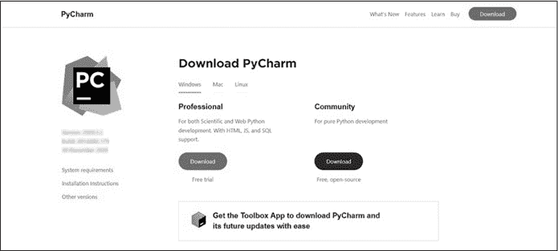

图 2-1：PyCharm 下载页面

点击 **下载** 以获取免费的社区版（图 2-1），下载完成后，运行可执行安装程序并按照安装步骤进行操作。我们建议你直接接受安装程序建议的所有默认设置。

### 创建项目

在你的系统上找到 PyCharm 并运行它。选择**新建项目**，你应该会看到一个类似于图 2-2 的窗口。这个用户界面中有几个需要注意的选项：一个项目名称，你将其作为 Location 字段中的后缀；虚拟环境；Python 解释器；以及用于创建*main.py* 脚本的复选框。

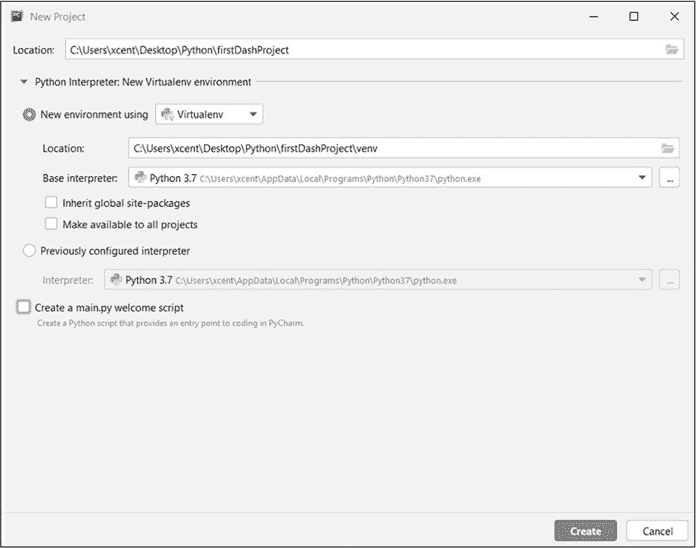

图 2-2：设置 PyCharm 项目

我们将把项目命名为*firstDashProject*，但你可以使用任何你喜欢的名称。一个简短的全小写项目名称会更符合惯例，但暂时我们使用一个更明显的名称。如果要更改名称，只需修改 Location 字段中最后一个反斜杠（\）后的文本。

虚拟环境和解释器字段应会自动填充 PyCharm 在你系统上检测到的内容。在图 2-2 中，使用的是 Python 3.7。我们因此将使用与标准 Python 安装一起提供的虚拟环境 Virtualenv。使用虚拟环境意味着你安装的所有软件包默认情况下将仅安装在项目环境中，而不会安装到你的计算机上，这样可以将所有与项目相关的内容保存在一个整洁的地方。虚拟化项目依赖项的众多优点之一是，你可以为不同的项目安装不同版本的软件包，而不会使操作系统变得混乱。例如，如果一个项目使用的是 Dash 的旧版本，而另一个项目需要一个更新的 Dash 版本，全局安装 Dash 几乎肯定会导致问题。当你在不同的虚拟环境中为每个项目安装不同的 Dash 版本时——每个项目一个虚拟环境——你就避免了版本冲突。

最后，选择不创建*main.py* 欢迎脚本，方法是取消选中底部的复选框。许多 Python 程序使用*main.py*作为程序的主要入口点。为了执行项目，它们执行 *main.py* 文件，进而启动程序提供的所有其他功能。然而，对于 Dash 应用程序，按照惯例，代码的主要入口点是 *app.py* 文件——尽管通常你可以使用任意文件名。因此，我们建议在所有 Dash 项目中取消选中 *main.py* 复选框。

其他部分我们将保持原样。

点击**创建**，你应该会看到你的第一个 PyCharm 仪表盘项目！它应该像图 2-3 一样。

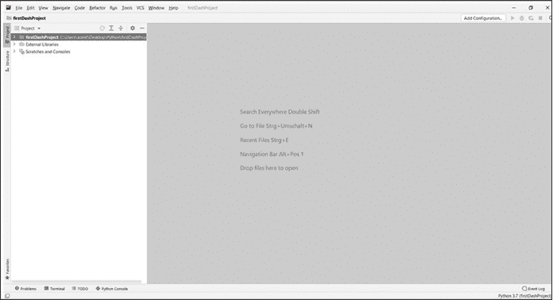

图 2-3：你的第一个 PyCharm 仪表盘项目

在我们深入探讨如何在 PyCharm 中创建仪表盘应用程序的细节之前，让我们快速浏览一下 PyCharm 的界面（见图 2-4）。

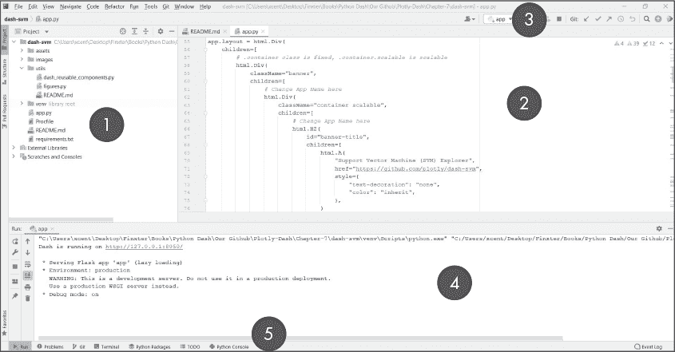

图 2-4：PyCharm 界面概览

图 2-4 显示了界面中最重要的元素：

*项目工具窗口*为你提供项目文件夹结构的概览。对于较大的项目，保持对所有代码功能以及各模块如何协同工作以提供一个连贯整体的高层次概览至关重要。

2.  *编辑窗口*允许你打开、编写和编辑来自代码项目的多个代码文件。你可以在项目工具窗口中浏览项目，并双击文件以在编辑窗口中打开它们。这里是你编写和编辑代码的地方。

*导航栏*提供了按钮和快捷方式，可以快速执行最重要的功能，例如启动和停止应用程序、选择要执行的主模块、搜索文件和调试应用程序。

4.  在你启动应用程序之后，你将会在*运行工具窗口*中观察到其输出和执行状态。在图 2-4 中，我们刚刚启动了第一个仪表盘应用程序，因此运行窗口显示了我们可以点击或输入浏览器的 URL 来查看我们的仪表盘应用。如果你在代码中使用了 print() 语句，打印输出将显示在这里。

5.  运行工具窗口还提供了另一个导航栏，允许你在运行工具窗口的不同*标签页*之间切换。例如，你可以打开一个 Python shell、在 Windows 中打开命令行或在 macOS 中打开终端，以访问操作系统的功能，或者逐步调试你的应用程序。

PyCharm 附带了许多额外的窗口，但这些是你在任何应用程序中都会使用到的最重要的窗口，无论是否是仪表盘应用。其余的窗口留给你在闲暇时自行探索。

### 运行 Dash 应用

现在我们来看一下官方 Dash 文档中的示例仪表盘应用程序。此代码创建了一个示例的仪表盘应用程序，展示了一个简单的条形图，如图 2-5 所示。它还在本地计算机上启动了一个服务器，以便你可以在浏览器中查看仪表盘应用。

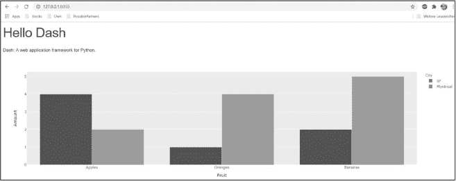

图 2-5：一个示例的 Dash 应用

在 PyCharm 中，右键点击左侧菜单面板中的项目，选择**新建**►**文件**。命名你的文件为*app.py*，并复制[此处代码](https://dash.plotly.com/layout)，也如清单 2-1 所示。

# 使用 'python app.py' 运行此应用并

# 访问 http://127.0.0.1:8050/ 在你的网页浏览器中。

from dash import Dash, html, dcc

import plotly.express as px

import pandas as pd

import pandas as pd

# assume you have a "long-form" data frame

# see https://plotly.com/python/px-arguments/ for more options

df = pd.DataFrame({

   "Fruit": ["Apples", "Oranges", "Bananas", "Apples", "Oranges", "Bananas"],

   "Amount": [4, 1, 2, 2, 4, 5],

   "City": ["SF", "SF", "SF", "Montreal", "Montreal", "Montreal"]

})

fig = px.bar(df, x="Fruit", y="Amount", color="City", barmode="group")

app.layout = html.Div(children=[

   html.H1(children='Hello Dash'),

   html.Div(children='''

      Dash: A web application framework for your data.

   '''),

   dcc.Graph(

      id='example-graph',

      figure=fig

   )

])

if __name__ == '__main__':

   app.run_server(debug=True)

Listing 2-1: Example app from the Dash documentation

我们并不指望你现在理解这段代码，也不会在此时详细讲解。从高层次来看，这段代码导入了必要的库，构建了应用并设置了其样式，创建了数据并通过条形图进行可视化，同时设置了整体布局，包含了标题等元素。最后两行启动了服务器，这样你就可以在浏览器中查看它了（参见图 2-6）。在学习后续章节后，你会发现这很简单。

现在运行你的项目：进入顶部菜单并选择 **运行**►**app.py**。你也可以点击导航栏中的绿色播放按钮。然而，你会发现我们遇到了一个问题：运行程序时，底部的运行工具窗口显示了一个错误，见 图 2-6。我们的应用程序现在不能运行，因为我们正在导入 Dash，但 PyCharm 并没有识别 Dash！原因是 Dash 不是 Python 标准库的一部分：你需要手动安装它，才能在项目中使用。

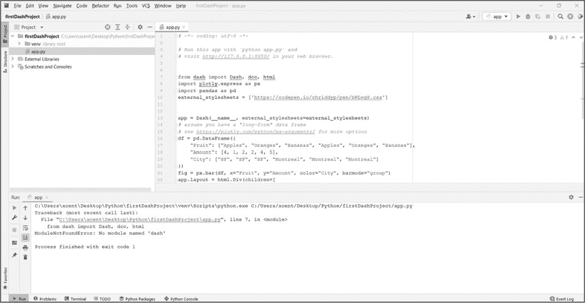

图 2-6：PyCharm Dash 错误

你可能会想，为什么我们不早点安装 Dash？正如你稍后会看到的那样，因为每个项目都被隔离在各自的虚拟环境中，这样的做法有助于你将来更好地使用 Dash。

### 通过 PyCharm 安装 Dash

安装 Dash 有两种方式：一种是全局安装到你的计算机上，这意味着每个未来的项目都可以导入 Dash；另一种是在你的虚拟环境中本地安装，这意味着只有当前项目可以导入 Dash，对于不同虚拟环境中的项目，你需要重新安装 Dash。推荐的方式是在虚拟环境中安装。

注意

*PyCharm 在不同系统上可能会有所不同，因此如果你在此步骤遇到问题，可以查看我们的完整指南，访问* [`<wbr>blog<wbr>.finxter<wbr>.com<wbr>/how<wbr>-to<wbr>-install<wbr>-a<wbr>-library<wbr>-on<wbr>-pycharm`](https://blog.finxter.com/how-to-install-a-library-on-pycharm) *获取帮助。*

PyCharm 允许我们通过应用程序代码直接安装 Dash。点击红色下划线的 Dash 库导入行，将光标悬停在上面；一个小红色灯泡会出现，并显示一个菜单。选择**安装 Dash 包**选项，见 图 2-7。

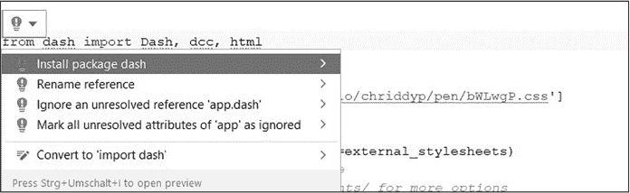

图 2-7：通过 PyCharm 安装 Dash

注意，只有在你在虚拟环境中创建 PyCharm 项目时，才会出现这个选项（见 图 2-2）。如果你看不到包安装选项，可以在运行工具窗口中打开 Terminal 标签，并输入：

$ pip install dash

安装 Dash 库需要几分钟时间。重要的是要记住，库只会安装在这个*虚拟环境*中——也就是说，它不会安装在全局操作系统中，而只是作用于项目级别。对于不同的项目，你可能需要再次安装 Dash。

根据您的本地环境，您可能还需要重复相同的程序来安装 pandas 库。请访问 pandas 安装指南：[*https://<wbr>blog<wbr>.finxter<wbr>.com<wbr>/how<wbr>-to<wbr>-install<wbr>-pandas<wbr>-on<wbr>-pycharm*](https://blog.finxter.com/how-to-install-pandas-on-pycharm)。我们将在第三章中介绍 pandas 的安装。

现在再次尝试运行 *app.py*，您应该会看到类似这样的内容：

Dash 正在运行于 http://127.0.0.1:8050/

   * 正在提供 Flask 应用 "app"（延迟加载）

   * 环境：生产

     警告：这是一个开发服务器，请勿在生产环境中使用。

     请改用生产环境的 WSGI 服务器。

   * 调试模式：开启

您的应用程序托管在本地计算机上，因此外部无法访问它。在内部，Dash 使用 Python 的 Flask 库来执行重任，将网站提供给用户。要测试您的应用程序，请将 *http://127.0.0.1:8050/* 粘贴到浏览器中，或者在 PyCharm 的输出窗口中点击它。该 URL 表示仪表盘应用程序在您的本地计算机上运行，IP 地址为 127.0.0.1——这是一个通常被称为 *localhost* 的 *环回* 地址，您可以将其理解为“您的本地计算机”——并且端口为 8050。

有关 PyCharm 的更多信息，请参见我们的多页博客教程：[*https://<wbr>blog<wbr>.finxter<wbr>.com<wbr>/pycharm<wbr>-a<wbr>-simple<wbr>-illustrated<wbr>-guide*](https://blog.finxter.com/pycharm-a-simple-illustrated-guide)。

### 在 GitHub 上使用 Dash

学习 Dash 和习惯使用 PyCharm 的一个绝佳方式是从专家那里复制现有的 Dash 项目，并尝试修改他们的代码。学习专家的代码项目是测试和提升您思维的最佳方式之一。之前，您通过复制并粘贴 *app.py* 文件中的代码尝试了示例应用程序。考虑到许多代码项目包含多个文件和更复杂的文件夹结构，这种方式并不总是最方便的。这里我们将克隆一个 GitHub 项目。大多数开源项目都托管在 GitHub 上，因此您可以浏览大量项目。

注意

*在我们开始之前，您需要安装 GitHub。如果没有安装，您可以从官方网站下载 Git（*[`git-scm.com/downloads`](https://git-scm.com/downloads)）*或通过 PyCharm 安装它。*

要将 GitHub 项目克隆到一个新的 PyCharm 项目中，首先获取你想要克隆的 GitHub 仓库的 URL；可以从[*https://<wbr>github<wbr>.com<wbr>/plotly<wbr>/dash<wbr>-sample<wbr>-apps*](https://github.com/plotly/dash-sample-apps)中选择许多项目。图 2-8 展示了一些来自 Plotly 的 Dash Gallery 应用示例。

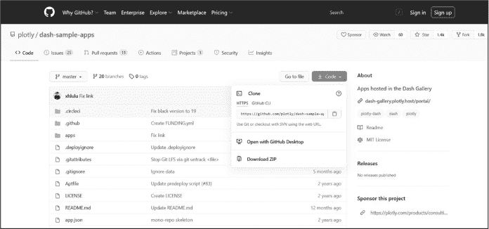

图 2-8：GitHub 上的 Dash Gallery 应用示例

点击仓库中的**代码**并复制 URL。例如，你可以使用[*https://<wbr>github<wbr>.com<wbr>/plotly<wbr>/dash<wbr>-sample<wbr>-apps<wbr>.git*](https://github.com/plotly/dash-sample-apps.git)访问一个包含所有 Dash 应用的仓库。

打开 PyCharm 并点击**VCS**►**从版本控制获取**，如图 2-9 所示。输入 URL。请注意，构建此项目将从 Git 项目 URL 创建一个新项目，因此你从哪个项目开始并不重要。

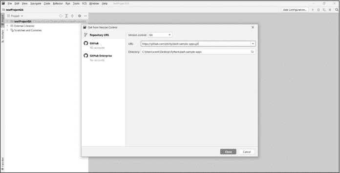

图 2-9：在 PyCharm 中打开 GitHub 仓库

点击**克隆**并等待操作完成。因为该仓库包含了所有的 Dash Gallery 项目，所以这可能需要一些时间。安装整个仓库使你能够快速尝试许多不同的 Dash 项目，并检查专家是如何实现你感兴趣的 Dash 特性的。

接下来，PyCharm 会要求你设置一个虚拟环境来安装示例应用所需的库（见图 2-10）。点击**确定**。如需故障排除，请按照[此处](https://www.jetbrains.com/help/pycharm/creating-virtual-environment.xhtml)提供的详细策略进行操作。

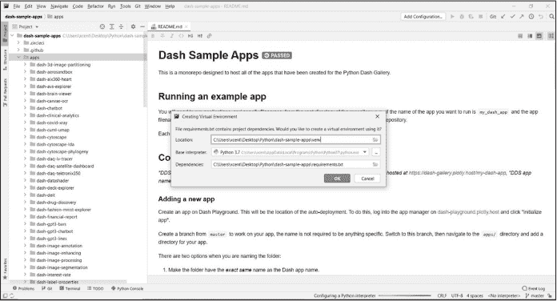

图 2-10：在 PyCharm 中为已签出的 GitHub 仓库安装虚拟环境中的库

恭喜！你的 PyCharm 项目现在应该可以正常工作了。你已经创建了原始 GitHub 项目的克隆。*克隆*只是原始项目的副本，因此如果你更改了克隆中的代码，除了你自己，其他人无法看到这些更改。

图 2-11 展示了如何打开单个仪表板应用的主入口文件：*app.py*。在 PyCharm 中打开该文件，安装它所依赖的任何库，运行并在你自己的浏览器中查看。

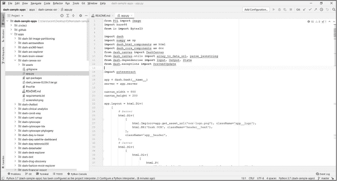

图 2-11：从 Dash Gallery 打开仪表板应用的 app.py 文件

如果你想查看更多示例 Dash 应用，[*Dash 画廊*](https://dash.gallery/Portal) 提供了许多由 Dash 专家创建的 GitHub 仓库。克隆它们就像使用 Dash 画廊提供的 URL 按照这些步骤操作一样简单。如果你没有使用 PyCharm，你可以查看这篇关于如何克隆现有仓库的指南：[*https://<wbr>docs<wbr>.github<wbr>.com<wbr>/en<wbr>/github<wbr>/creating<wbr>-cloning<wbr>-and<wbr>-archiving<wbr>-repositories<wbr>/cloning<wbr>-a<wbr>-repository*](https://docs.github.com/en/github/creating-cloning-and-archiving-repositories/cloning-a-repository)。别担心——你无法破坏任何东西，所以尽管放心玩弄代码。像 Git 这样的版本控制系统可以让你轻松恢复到初始状态。

### 总结

在本章中，你学习了如何设置 PyCharm，这是最受欢迎的 Python 集成开发环境之一。PyCharm 与 Python Dash 集成良好。具体来说，你学习了如何通过 PyCharm 安装 PyCharm 本身以及像 Dash 这样的第三方库，创建第一个简单的 Dash 项目，运行该项目，并在浏览器中查看你的仪表盘应用。此外，你还学习了如何将 PyCharm 与最流行的版本控制系统 Git 集成，这样你就可以检查现有的 Dash 应用，进行学习并与他人协作。

事实上，现在正是跟随本教程步骤，克隆画廊中现有的仪表盘应用，运行它，并调整颜色和文本标签等简单内容以熟悉 Dash 的绝佳时机！我们将在接下来的章节中详细解释一切，但在尝试弥补知识空白之前，先打开这个空白也无妨，不是吗？

安装好 PyCharm 后，我们将继续介绍 pandas 库。pandas 库帮助你组织和处理你希望在仪表盘应用中可视化的数据！
