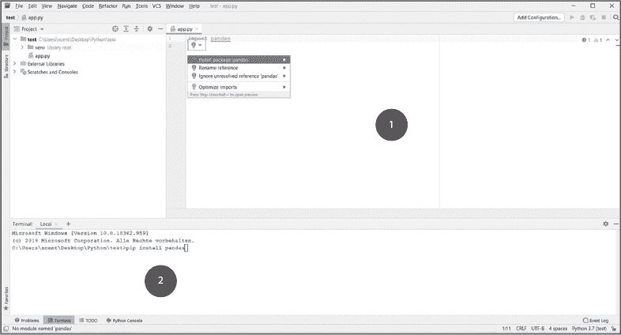
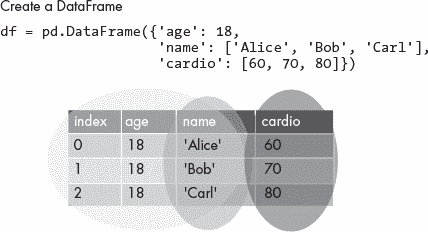
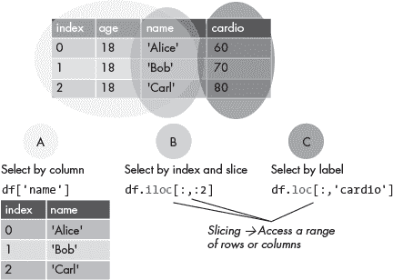
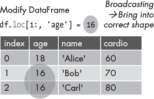

## 第三章：3 pandas 快速入门

仪表板应用程序主要用于可视化数据。但是，在你可以做到这一点之前，你需要对数据进行预处理、清理和分析。为了帮助你完成这些任务，Python 提供了一套强大的数据分析模块，包括流行的 pandas 库。*pandas 库* 提供了用于表示和操作数据的数据结构和功能。你可以把它想象成一个带有额外功能的高级电子表格程序，包括创建电子表格、按名称访问单独的行、计算基本统计数据、对满足特定条件的单元格进行操作等等。

本章简要介绍了 pandas 的最重要功能。它大致基于官方的“10 分钟学习 pandas”指南，但在本书中，我们将内容压缩为最相关的信息。关于 pandas 快速入门的八分钟视频教程可以在[*https://<wbr>blog<wbr>.finxter<wbr>.com<wbr>/pandas<wbr>-quickstart*](https://blog.finxter.com/pandas-quickstart)找到。

### 视觉概览备忘单

图 3-1 提供了本章所描述主题的图示概览。

图 3-1：pandas 备忘单

在阅读本章时，随时可以查看这张图。接下来，让我们深入到每个步骤的详细解释。

### 安装 pandas

使用以下命令在你的虚拟环境或系统中安装 pandas 库，命令可以在终端、命令行或 shell 中执行：

$ pip install pandas

如果你已经安装了 pandas，我们建议使用命令pip install -U pandas更新到最新版本。

一些编辑器和集成开发环境（IDE）具有集成终端，你可以使用它们来安装 pandas，包括 PyCharm，如图 3-2 所示。如果你使用的是其他 IDE，可以使用它提供的终端，或者你操作系统的终端。如果你已经安装了 PyCharm，可以在主编辑器中输入import pandas，一个工具提示应该会显示出来。点击工具提示后，它会给你安装 pandas 的选项，如图 3-2 所示。

两种安装 pandas 的方式展示在图 3-2 中。

图 3-2：使用工具提示（1）或集成终端中的命令 pip install pandas（2）在 PyCharm 中安装 pandas。

在 Python 脚本中访问 pandas 库时，只需使用 import pandas 语句导入即可。为了方便访问和简洁起见，通常将 pandas 设为别名 pd，因此在脚本顶部添加的完整代码行应该是：

import pandas as pd

使用这个别名后，您可以使用 pd.somefunction()，而不是 pandas.somefunction()。

故障排除

如果在尝试使用 pandas 运行代码时发现它仍然没有正确安装，请按照以下步骤正确安装 pandas 到您的 PyCharm 项目中：

1.  从 PyCharm 菜单中选择 文件►设置►项目 。

2.  选择当前项目。

3.  在您的项目标签页中点击 Python 解释器 标签。

4.  点击小加号符号（+）以向项目中添加新的库。

5.  输入要安装的库的名称，这里是 pandas，然后点击 安装软件包。

6.  等待安装完成，然后关闭所有弹出窗口。

### 在 pandas 中创建对象

pandas 中最重要的两种数据类型是 Series 和 DataFrame。pandas Series 是一维的数据值数组，类似于 Excel 表格中的一列。pandas DataFrame 是一种二维的带标签数据结构，类似于完整的电子表格。Series 和 DataFrame 结构的目的是便于数据存储、访问和分析。

为了便于通过索引访问单独的行或列，pandas 在创建 DataFrame 结构时会自动添加行和列的索引。默认情况下，pandas 使用从零开始的索引，因此它从索引 0 开始，并且后续的索引值会递增，直到数据结构的末尾。

Series

为了在 PyCharm IDE 中跟随 pandas 的示例，你可以通过选择**文件**►**新建项目**来创建一个新项目，然后通过**文件**►**新建**►**Python 文件**创建一个新的空 Python 文件。你可以给项目和 Python 文件命名任意名称。在新项目文件中，复制以下代码来创建一个简单的 Series 对象（确保你已经安装了 pandas）：

import pandas as pd

s = pd.Series([42, 21, 7, 3.5])

print(s)

运行代码，你应该能看到以下内容：

0      42.0

1      21.0

2      7.0

3      3.5

dtype: float64

你刚刚使用了`pd.Series()`构造器创建了一个 Series 对象，并传入了一个值的列表。你也可以通过传入其他数据类型来创建 Series，例如，传入一个整数列表、布尔元组或任何其他可迭代的数据值，pandas 会自动确定整个 Series 的类型并将其分配给 Series 对象，就像输出的最后一行所示。

DataFrames

pandas DataFrame 就像是你代码中的数据表，具有行、列和存储特定类型数据的单元格，如图 3-3 所示。

图 3-3：创建一个包含三列（不包括索引列）和三行的 pandas DataFrame 对象

清单 3-1 展示了如何创建一个简单的 DataFrame 对象。

import pandas as pd

df = pd.DataFrame({'age': 18,

                   'name': ['Alice', 'Bob', 'Carl'],

                   'cardio': [60, 70, 80]})

print(df)

清单 3-1：名为 df 的示例 DataFrame

这将给我们一个看起来像这样的 DataFrame：

|  | 年龄 | 姓名 | 心脏健康 |
| --- | --- | --- | --- |
| 0 | 18 | Alice | 60 |
| 1 | 18 | Bob | 70 |
| 2 | 18 | Carl | 80 |

你可以使用 pd.DataFrame() 构造器创建 DataFrame。当你使用字典来初始化 DataFrame 时，就像我们在这里做的那样，字典的键是列名，字典的值是该列的行值。你也可以只提供一个列值，例如 18，并将其分配给整个列名，例如 age，这样该列中的每个单元格都会填充值 18。

注意

*从技术上讲，如果为特定列的所有行仅提供一个值，pandas 会自动将相同的值设置为 DataFrame 中所有现有行的值，这个过程被称为* 广播 *。*

DataFrame 也可以通过读取 CSV 文件中的数据来构造。你可以使用 pandas 的 read_csv() 函数将 CSV 文件加载为 DataFrame，如下所示：

import pandas as pd

路径 = "your/path/to/CSV/file.csv"

df = pd.read_csv(path)

你需要用你特定的文件路径替换文件的路径；这可以是一个绝对路径，也可以是相对于你脚本所在位置的相对路径。例如，如果 CSV 文件和你的 Python 脚本在同一目录下，你可以直接给出文件名作为相对路径。

### 在 DataFrame 中选择元素

Series 对象和 DataFrame 允许轻松访问单个元素。在这里，我们将看到如何以简单、高效且易于阅读的方式存储、访问和分析 DataFrame 中的数据。Series 对象可以看作是单维的 DataFrame，因此理解 DataFrame 访问方式也能解释 Series 的访问方式。图 3-4 显示了相关部分的备忘单，方便您查阅。您可以看到有三种访问数据的方法：按列选择 (A)、按索引和切片选择 (B)、按标签选择 (C)。以下小节简要概述了每种方法。我们将在后续章节中深入探讨。

图 3-4：在 DataFrame 中选择元素的三种不同方式

按列选择

您可以使用已经熟悉的 Python 列表和字典中的方括号表示法来访问列。使用 清单 3-1 中的 df DataFrame，我们可以这样选择 age 列中的所有元素：

print(df['age'])

这将输出：

0     18

1     18

2     18

Name: age, dtype: int64

您可以使用访问的 DataFrame 名称和方括号中的列名来选择标签为 age 的所有值。

请注意，pandas 允许使用另一种语法 df.age 来访问列。虽然在一些 pandas 代码库中可以看到这种方式，但更常用的方法是使用方括号表示法 df['age']，就像在标准的 Python 列表、字符串和字典索引中一样。

按索引和切片选择

要访问 DataFrame 中的特定行，我们使用切片表示法 df[start:stop]。正如 第一章 中提到的，具有 start 索引的行包括在内，而具有 stop 索引的行则不包括在内。然而，在使用 df.loc[start:stop] 时要小心：stop 索引实际上是*包括*在内的，这也是一个常见的混淆来源！

注意

*你可以在* [`<wbr>blog<wbr>.finxter<wbr>.com<wbr>/introduction<wbr>-to<wbr>-slicing<wbr>-in<wbr>-python`](https://blog.finxter.com/introduction-to-slicing-in-python) *找到关于 Python 切片的综合教程，并在* [`blog.finxter.com/numpy-tutorial`](https://blog.finxter.com/numpy-tutorial) *找到关于 NumPy 切片的教程。*

要访问单行，请相应地设置 开始 和 结束 索引：

print(df[2:3])

这将打印索引为 2 的行，并通过指定< s>停止 索引为 3，不再打印后续行：

|  | 年龄 | 姓名 | 心血管 |
| --- | --- | --- | --- |
| 2 | 18 | Carl | 80 |

你还可以使用 iloc 索引来访问 DataFrame 元素，以访问 i 行和 j 列。在这里，我们使用零基索引 2 和 1，分别访问 df DataFrame 中的第三行和第二列：

print(df.iloc[2, 1])

第一个参数 i 访问 i 行，第二个参数 j 访问 j 列。 这将打印第三行（索引为 2）和第二列（索引为 1）的数据值，即 'Carl'。

布尔索引

一种强大的方式来访问满足某个条件的行是通过 *布尔索引*。我们将再次使用我们的 df DataFrame，并访问在 cardio 列中值大于 60 的行（请稍等，我们马上会解释这个）：

print(df[df['cardio']>60])

这将提取最后两行：

|  | 年龄 | 姓名 | 心血管 |
| --- | --- | --- | --- |
| 1 | 18 | 鲍勃 | 70 |
| 2 | 18 | 卡尔 | 80 |

虽然这种语法刚开始看起来可能有些奇怪，但实际上它是由 pandas 创建者精心设计的。内部条件 df['cardio']>60 产生了一个布尔值序列，当 cardio 列的第 i 个元素大于 60 时，值为 'True'。这对于数据框的最后两行适用。因此，df['cardio']>60 结果为：

0    False

1     True

2     True

Name: Cardio, dtype: bool

这些布尔值随后作为索引传递给 df 数据框，这样会得到一个只有两行而不是三行的 DataFrame。

按标签选择

就像在电子表格中一样，pandas 中的每一行和每一列都有标签。标签可以是整数索引号，例如行索引，或者是字符串名称，例如 cardio 列名在 df 数据框中。要通过标签访问数据，我们使用索引机制 df.loc[rows, columns]。在这里，我们访问 df 数据框中 name 列的所有行：

print(df.loc[:, 'name'])

这样我们得到：

0    爱丽丝

1      鲍勃

2     卡尔

Name: name, dtype: object

'''

我们使用逗号分隔的切片索引方案，写在方括号内df.loc[:, 'name']，其中第一部分:选择行，第二部分'name'选择要从数据框中检索的列。没有指定起止索引的空切片冒号，表示你希望无条件访问所有行。字符串'name'表示你只希望检索来自name列的值，忽略其他列。

要访问来自<code>age</code>和<code>cardio</code>列的所有行，我们可以传递一个列标签的列表，如下所示：

print(df.loc[:, ['age', 'cardio']])

这会导致以下结果：

|  | age | cardio |
| --- | --- | --- |
| 0 | 18 | 60 |
| 1 | 18 | 70 |
| 2 | 18 | 80 |

### 修改现有数据框

你可以使用赋值运算符=来修改甚至覆盖数据框的一部分，通过在左侧选择需要替换的数据，在右侧提供新的数据。在这里，我们将age列中的所有整数值覆盖为 16：

df['age'] = 16

print(s)

这是结果：

|  | age | name | cardio |
| --- | --- | --- | --- |
| 0 | 16 | Alice | 60 |
| 1 | 16 | Bob | 70 |
| 2 | 16 | Carl | 80 |

首先，你选择 age 列，使用 df['age']，并将 age 对应的值覆盖为整数值 16。为了将这个整数复制到该列的所有行，pandas 使用广播。

图 3-5 显示了 pandas 备忘单的相关部分。

图 3-5：使用切片和广播修改 DataFrame 中第 2 和第 3 行的 age 列

这是一个更高级的示例，使用切片和 loc 索引来覆盖 age 列中除第 1 行以外的所有行。首先，我们将重新构建原始的 df DataFrame：

import pandas as pd

df = pd.DataFrame({'age': 18,

                  'name': ['Alice', 'Bob', 'Carl'],

                  'cardio': [60, 70, 80]})

这给我们带来了：

|  | age | name | cardio |
| --- | --- | --- | --- |
| 0 | 18 | Alice | 60 |
| 1 | 18 | Bob | 70 |
| 2 | 18 | Carl | 80 |

现在，我们通过使用标准切片符号选择第 2 和第 3 行来排除第 1 行的更改：

df.loc[1:,'age'] = 16

print(df)

我们可以看到 Alice 的年龄仍然是 18：

|  | age | name | cardio |
| --- | --- | --- | --- |
| 0 | 18 | Alice | 60 |
| 1 | 16 | Bob | 70 |
| 2 | 16 | Carl | 80 |

为了丰富我们的示例，我们将使用一个新的系统，因为 pandas 非常灵活。通过理解不同的索引方案——括号表示法、切片、loc 和 iloc——你将能够覆盖现有的数据并添加新数据。这里我们使用 loc 索引、切片和广播来添加一个新的列 friend：

df.loc[:,'friend'] = 'Alice'

print(df)

这给我们带来了：

|  | age | name | cardio | friend |
| --- | --- | --- | --- | --- |
| 0 | 18 | Alice | 60 | Alice |
| 1 | 16 | Bob | 70 | Alice |
| 2 | 16 | Carl | 80 | Alice |

请注意，使用这里展示的更简化代码也可以实现相同的效果：

df['friend'] = 'Alice'

print(df)

结果我们得到了相同的结果：

|  | 年龄 | 姓名 | 心脏健康 | 朋友 |
| --- | --- | --- | --- | --- |
| 0 | 18 | Alice | 60 | Alice |
| 1 | 16 | Bob | 70 | Alice |
| 2 | 16 | Carl | 80 | Alice |

### 总结

这是关于 Pandas 库的快速入门课程，我们将在本书中使用其最相关的功能。Pandas 库还有许多其他功能，包括计算统计数据、绘图、分组和重塑数据等。我们建议您使用本章资源部分的链接，按照自己的节奏探索 Pandas。一旦您理解了本章中讨论的概念，您将能够阅读并理解许多其他 Dash 项目中的现有 Pandas 代码。

现在，让我们开始创建您的第一个仪表盘应用吧！

### 资源

+   “10 分钟学 Pandas”：[*https://<wbr>pandas<wbr>.pydata<wbr>.org<wbr>/pandas<wbr>-docs<wbr>/stable<wbr>/user<wbr>_guide<wbr>/10min<wbr>.xhtml*](https://pandas.pydata.org/pandas-docs/stable/user_guide/10min.xhtml)

+   *Coffee Break Pandas*，这是一本免费的电子书，您可以在本书的配套网站上找到，链接为[*https://<wbr>learnplotlydash<wbr>.com*](https://learnplotlydash.com)
