## <samp class="SANS_Futura_Std_Bold_Condensed_B_11">4</samp> <samp class="SANS_Dogma_OT_Bold_B_11">第一个 Dash 应用</samp>

在本章中，你将构建第一个 Dash 应用。我们将分析自 2011 年以来，16 位选定名人收到的 Twitter 点赞数。你可以通过本书提供的资源下载数据，链接为 [*https://<wbr>nostarch<wbr>.com<wbr>/python<wbr>-dash*](https://nostarch.com/python-dash)。我们将进行的分析类型在社交媒体分析领域中非常常见，通常用于更好地了解受众行为、帖子效果以及账户的整体表现。

这个第一个仪表盘将绘制每条推文的点赞数。一旦你掌握了使用 Dash 绘制简单图表的过程，你将能够扩展技能，绘制更大且更复杂的数据，如：Instagram 帖子的浏览量、Facebook 个人资料访问量、LinkedIn 帖子的点击率以及 YouTube 视频表现。

本章应为你提供足够的 Dash 知识，以便创建自己的仪表盘应用。你将学习如何将数据整合到应用中，管理多个仪表盘应用组件，构建基本图表（如折线图），并通过回调装饰器为仪表盘添加交互功能。首先，让我们下载代码并运行应用，看看它能做什么。

### <samp class="SANS_Futura_Std_Bold_B_11">设置项目</samp>

打开 PyCharm，创建一个新项目，并将其命名为 *my-first-app*（项目名称应该是新建项目对话框中“位置”字段最后一个反斜杠后的后缀文本）。使用标准的 Virtualenv 设置虚拟环境。

<samp class="SANS_Dogma_OT_Bold_B_15">注意</samp>

*本章中的代码假设你使用的是 Python IDE，如 PyCharm。如果你没有安装 IDE 并设置虚拟环境，请参考第二章并完成 Python 环境设置。如果你使用的是其他编码环境，只需根据你的环境调整此处的说明。本章中的代码还要求使用 Python 3.6 或更高版本。*

接下来，你需要将本章的仪表盘应用文件下载到你的项目文件夹中。与我们在第二章中通过克隆仓库的方式不同，我们将直接下载 ZIP 文件。尝试不同的项目设置方式是值得的，因为你可能会遇到一些无法直接作为 Git 仓库使用的项目。要使用 ZIP 文件，请访问 GitHub 仓库 [*https://<wbr>github<wbr>.com<wbr>/DashBookProject<wbr>/Plotly<wbr>-Dash*](https://github.com/DashBookProject/Plotly-Dash)，点击 **代码**，然后点击 **下载 ZIP**，如 图 4-1 所示。

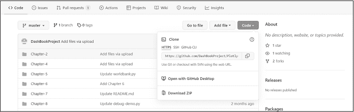

<samp class="SANS_Futura_Std_Book_Oblique_I_11">图 4-1：从 GitHub 下载应用代码</samp>

一旦您将 *Plotly-Dash-master.zip* 文件下载到计算机上，解压并进入 *Chapter-4* 文件夹。将该文件夹中的所有文件复制到您最近创建的 *my-first-app* 项目文件夹中。项目文件夹应具有以下结构：

<samp class="SANS_TheSansMonoCd_W5Regular_11">– my-first-app</samp>

<samp class="SANS_TheSansMonoCd_W5Regular_11">|––assets</samp>

<samp class="SANS_TheSansMonoCd_W5Regular_11">      ––mystyles.css</samp>

<samp class="SANS_TheSansMonoCd_W5Regular_11">|––tweets.csv</samp>

<samp class="SANS_TheSansMonoCd_W5Regular_11">|––twitter_app.py</samp>

*assets* 文件夹将保存 CSS 脚本。*tweets.csv* 文件保存我们将使用的数据，*twitter_app.py* 是我们用来运行应用的主要文件。

我们现在将在虚拟环境中安装必要的库。请在 PyCharm 窗口的底部选项卡中，打开终端（如 图 4-2 所示）。

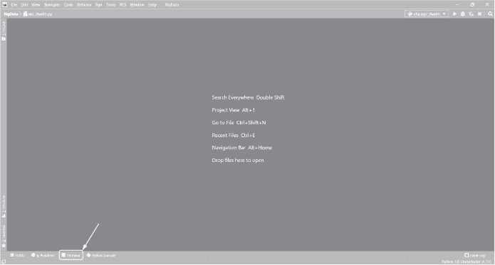

<samp class="SANS_Futura_Std_Book_Oblique_I_11">图 4-2：在 PyCharm 中打开终端</samp>

输入并执行以下代码行以安装 pandas 和 Dash（Plotly 包会随着 Dash 自动安装，因此无需单独安装 Plotly，NumPy 包会随着 pandas 自动安装）：

<samp class="SANS_TheSansMonoCd_W5Regular_11">$</samp> <samp class="SANS_TheSansMonoCd_W7Bold_B_11">pip install pandas</samp>

<samp class="SANS_TheSansMonoCd_W5Regular_11">$</samp> <samp class="SANS_TheSansMonoCd_W7Bold_B_11">pip install dash</samp>

要检查库是否正确安装，请输入：

<samp class="SANS_TheSansMonoCd_W5Regular_11">$</samp> <samp class="SANS_TheSansMonoCd_W7Bold_B_11">pip list</samp>

这将创建一个列出当前虚拟环境中所有 Python 包的列表。如果它们都列出，您就可以继续了。请注意，pandas 和 Dash 的所有依赖项也会列出，因此您可能会看到比您安装的两个库更多的库。

接下来，在 PyCharm 中打开 *twitter_app.py* 并运行脚本。您应该看到以下信息：

<samp class="SANS_TheSansMonoCd_W5Regular_11">* 正在服务 Flask 应用 "twitter_app"（懒加载）</samp>

<samp class="SANS_TheSansMonoCd_W5Regular_11">* 环境：生产</samp>

<samp class="SANS_TheSansMonoCd_W5Regular_11">警告：这是一个开发服务器。请勿在生产部署中使用它。</samp>

<samp class="SANS_TheSansMonoCd_W5Regular_11">请改用生产环境中的 WSGI 服务器。</samp>

<samp class="SANS_TheSansMonoCd_W5Regular_11">* 调试模式：开启</samp>

<samp class="SANS_TheSansMonoCd_W5Regular_11">Dash 正在运行于</samp> <samp class="SANS_TheSansMonoCd_W5Regular_11">http://127.0.0.1:8050/</samp>

该警告只是提醒我们应用运行在开发服务器上，这是完全正常的。要打开您的应用，请点击 HTTP 链接或将其复制粘贴到浏览器的地址栏中。

恭喜！你现在应该能够看到你的第一个 Dash 应用，它应该像图 4-3 那样。

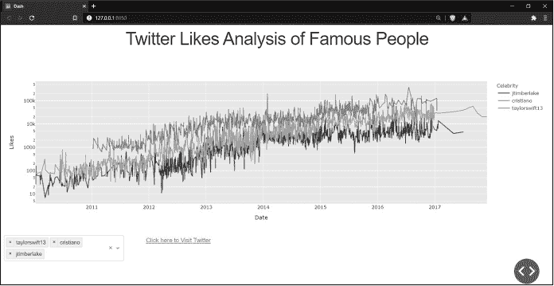

<samp class="SANS_Futura_Std_Book_Oblique_I_11">图 4-3：Twitter 喜欢分析应用</samp>

玩得开心！在你的仪表板应用中玩一玩。改变下拉框的值，点击链接，点击图表图例，通过按住鼠标左键并拖动鼠标来放大某个日期范围。看看你能推断出什么信息。

现在让我们看看应用的代码。大多数 Dash 应用的代码布局是类似的：

1.  导入必要的 Python 库。

2.  读取数据。

3.  为应用分配样式表，描述应用的显示方式。

4.  构建应用布局，定义如何显示所有元素。

5.  创建回调函数，使应用组件之间能够进行交互。

因为 Dash 应用大多遵循这一框架，我们将按此顺序逐步讲解代码。

<samp class="SANS_Futura_Std_Bold_Condensed_Oblique_I_11">导入库</samp>

让我们先看看我们将使用的库，见清单 4-1。

<samp class="SANS_TheSansMonoCd_W5Regular_11">import pandas as pd</samp>

<samp class="SANS_TheSansMonoCd_W5Regular_11">import plotly.express as px</samp>

<samp class="SANS_TheSansMonoCd_W5Regular_11">from dash import Dash, dcc, html, Input, Output</samp>

<samp class="SANS_Futura_Std_Book_Oblique_I_11">清单 4-1：来自</samp> <samp class="SANS_Futura_Std_Book_11">twitter_app.py</samp>的导入部分

我们首先导入 pandas 来处理数据。然后导入 Plotly，这是一个流行的 Python 可视化库。Plotly 创建图表的主要方式有两种。我们使用的是*Plotly Express*，这是一个高级接口，通过单个函数调用来创建图表，只需要很少的代码行。它具有足够的功能，可以让你无缝且快速地构建图表，并且是两者中更容易使用的，适用于简单的应用。

另一种选择是*Plotly 图形对象*，这是一种低级接口，用于从零开始创建图表。使用图形对象时，你需要定义数据、布局，有时还需要定义帧，这些都使得图表构建过程更加复杂。尽管如此，它的完整功能集允许你以多种方式自定义图表，增加图表的丰富性，因此当你掌握了 Dash 基础并需要构建更复杂的图表时，可能会希望使用 Plotly 图形对象。我们在大多数情况下将使用 Plotly Express，并在更复杂的情况下回退到图形对象。

接下来，我们导入一些 Dash 库来处理组件和依赖项。*组件*是构建复杂界面的基石，可以组合在一起为用户创建丰富的界面，例如下拉菜单、范围滑块和单选按钮。Dash 包含了 Plotly 维护的两个关键组件库：dash-html-components（HTML）和 dash-core-components（DCC）。*dash-html-components* 库包含结构元素，如标题和分隔符，用于在页面上样式化和定位元素，而 *dash-core-components* 提供应用程序的核心功能，如用户输入字段和图形。

<samp class="SANS_Futura_Std_Bold_Condensed_Oblique_I_11">数据管理</samp>

在这个应用中，我们使用 CSV 表格作为数据源。为了使用数据，我们需要通过 pandas 将其读取到内存中，但在此之前我们必须先 *清洗* 数据。这意味着通过标准化字符串的大小写和时间格式、去除空白以及为缺失值添加空值等操作，来为分析和绘图准备数据。当数据是 *脏的* 时，通常是没有组织的，并且可能包含缺失值。如果你尝试使用脏数据，绘图可能无法正常工作，分析也可能不准确，而且你会发现过滤也很困难。清洗数据能确保数据是可读的、可展示的，并且可以进行绘图。

清单 4-2 显示了代码中的数据管理部分。

❶ <samp class="SANS_TheSansMonoCd_W5Regular_11">df =</samp> <samp class="SANS_TheSansMonoCd_W5Regular_11">pd.read_csv("tweets.csv")</samp>

<samp class="SANS_TheSansMonoCd_W5Regular_11">df["name"] = pd.Series(df["name"]).str.lower()</samp>

<samp class="SANS_TheSansMonoCd_W5Regular_11">df["date_time"] = pd.to_datetime(df["date_time"])</samp>

<samp class="SANS_TheSansMonoCd_W5Regular_11">df = (</samp>

<samp class="SANS_TheSansMonoCd_W5Regular_11">   df.groupby([df["date_time"].dt.date, "name"])[</samp>

<samp class="SANS_TheSansMonoCd_W5Regular_11">      ["number_of_likes", "number_of_shares"]</samp>

<samp class="SANS_TheSansMonoCd_W5Regular_11">   ]</samp>

<samp class="SANS_TheSansMonoCd_W5Regular_11">   .mean()</samp>

<samp class="SANS_TheSansMonoCd_W5Regular_11">   .astype(int)</samp>

<samp class="SANS_TheSansMonoCd_W5Regular_11">)</samp>

<samp class="SANS_TheSansMonoCd_W5Regular_11">df = df.reset_index()</samp>

<samp class="SANS_Futura_Std_Book_Oblique_I_11">清单 4-2：数据管理部分</samp> <samp class="SANS_Futura_Std_Book_11">twitter_app.py</samp>

在 ❶ 处，我们将 CSV 表格读取到一个名为 <samp class="SANS_TheSansMonoCd_W5Regular_11">df</samp> 的 pandas DataFrame 中。Dash 应用程序开始时的 DataFrame 通常被称为 *全局 DataFrame*，而数据则是 *全局变量*（*global* 意味着对象是在函数外声明的，这意味着它在整个应用中都是可访问的）。

为了清理数据，我们将名人<samp class="SANS_TheSansMonoCd_W5Regular_11">name</samp>列中的字符串转换为小写，这样我们就可以方便地进行比较；我们将<samp class="SANS_TheSansMonoCd_W5Regular_11">date_time</samp>列转换为 pandas 可识别的日期格式；然后我们根据<samp class="SANS_TheSansMonoCd_W5Regular_11">date_time</samp>和<samp class="SANS_TheSansMonoCd_W5Regular_11">name</samp>对数据进行分组，以确保每一行都有一个唯一的日期戳和姓名。如果我们没有这样分组数据，就会导致多个行有相同的日期和姓名，进而生成无法读取的混乱折线图。

为了检查数据，请在脚本中紧接着<samp class="SANS_TheSansMonoCd_W5Regular_11">df</samp> <samp class="SANS_TheSansMonoCd_W5Regular_11">=</samp> <samp class="SANS_TheSansMonoCd_W5Regular_11">df.reset_index()</samp>后添加以下代码行：

<samp class="SANS_TheSansMonoCd_W5Regular_11">print(df.head())</samp>

一旦你重新运行脚本，你应该会在 Python 终端中看到类似以下内容：

|  | <samp class="SANS_TheSansMonoCd_W5Regular_11">date_time</samp> | <samp class="SANS_TheSansMonoCd_W5Regular_11">name</samp> | <samp class="SANS_TheSansMonoCd_W5Regular_11">number_of_likes</samp> | <samp class="SANS_TheSansMonoCd_W5Regular_11">number_of_shares</samp> |
| --- | --- | --- | --- | --- |
| <samp class="SANS_TheSansMonoCd_W5Regular_11">0</samp> | <samp class="SANS_TheSansMonoCd_W5Regular_11">2010-01-06</samp> | <samp class="SANS_TheSansMonoCd_W5Regular_11">selenagomez</samp> | <samp class="SANS_TheSansMonoCd_W5Regular_11">278</samp> | <samp class="SANS_TheSansMonoCd_W5Regular_11">695</samp> |
| <samp class="SANS_TheSansMonoCd_W5Regular_11">1</samp> | <samp class="SANS_TheSansMonoCd_W5Regular_11">2010-01-07</samp> | <samp class="SANS_TheSansMonoCd_W5Regular_11">jtimberlake</samp> | <samp class="SANS_TheSansMonoCd_W5Regular_11">62</samp> | <samp class="SANS_TheSansMonoCd_W5Regular_11">189</samp> |
| <samp class="SANS_TheSansMonoCd_W5Regular_11">2</samp> | <samp class="SANS_TheSansMonoCd_W5Regular_11">2010-01-07</samp> | <samp class="SANS_TheSansMonoCd_W5Regular_11">selenagomez</samp> | <samp class="SANS_TheSansMonoCd_W5Regular_11">201</samp> | <samp class="SANS_TheSansMonoCd_W5Regular_11">630</samp> |
| <samp class="SANS_TheSansMonoCd_W5Regular_11">3</samp> | <samp class="SANS_TheSansMonoCd_W5Regular_11">2010-01-08</samp> | <samp class="SANS_TheSansMonoCd_W5Regular_11">jtimberlake</samp> | <samp class="SANS_TheSansMonoCd_W5Regular_11">27</samp> | <samp class="SANS_TheSansMonoCd_W5Regular_11">107</samp> |
| <samp class="SANS_TheSansMonoCd_W5Regular_11">4</samp> | <samp class="SANS_TheSansMonoCd_W5Regular_11">2010-01-08</samp> | <samp class="SANS_TheSansMonoCd_W5Regular_11">selenagomez</samp> | <samp class="SANS_TheSansMonoCd_W5Regular_11">349</samp> | <samp class="SANS_TheSansMonoCd_W5Regular_11">935</samp> |

如你所见，结果是一个整洁的 pandas DataFrame，其中包含每个名人每天平均点赞和分享数的数据行。

在应用程序的开始阶段读取和准备数据总是一个好的实践，因为读取数据可能是一个消耗内存的任务；通过在开始时插入数据，你可以确保应用程序只加载一次数据到内存中，并且每次用户与仪表板互动时都不会重复这个过程。

<samp class="SANS_Futura_Std_Bold_Condensed_Oblique_I_11">布局和样式</samp>

下一步是管理应用组件的布局和样式，例如标题、图表和下拉菜单。我们将在本章后面详细学习“Dash 组件”；在这里，我们将只关注布局部分。

在 Dash 应用中，*布局*指的是组件在应用中的排列方式。*样式*指的是元素的外观，如颜色、大小、间距和其他属性（在 Dash 中称为 *props*）。为应用程序设置样式可以实现更加定制化和专业化的展示。如果没有样式，你可能会得到像图 4-4 所示的应用，其中标题没有居中，下拉菜单字段跨越整个页面，并且链接与上方的下拉菜单之间没有间距。

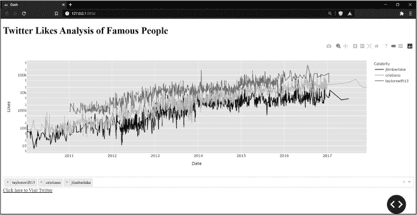

<samp class="SANS_Futura_Std_Book_Oblique_I_11">图 4-4：没有适当布局和样式的 Twitter 点赞分析应用</samp>

<samp class="SANS_Futura_Std_Bold_Condensed_B_11">对齐</samp>

Dash 应用是基于 Web 的，因此它们使用 Web 页面的标准语言：HTML（超文本标记语言）。幸运的是，Dash 包含 Dash HTML 组件模块，它将 Python 转换为 HTML，这意味着我们可以使用 Python 编写 HTML。

HTML 最基本的组件之一是 <samp class="SANS_TheSansMonoCd_W5Regular_11">Div</samp>，即*division*（分区）的缩写，它只是一个容器，用来存放其他元素，并将元素分组在一起。我们在 Dash 应用中使用的每个组件都会被包含在一个 <samp class="SANS_TheSansMonoCd_W5Regular_11">Div</samp> 中，而一个 <samp class="SANS_TheSansMonoCd_W5Regular_11">Div</samp> 可以包含多个组件。我们构建 <samp class="SANS_TheSansMonoCd_W5Regular_11">Div</samp>，然后为其设置样式，告诉浏览器准确地将其定位，并确定它占用的空间。

假设我们正在创建一个包含三个下拉菜单的仪表板应用，这些菜单通过关键字 <samp class="SANS_TheSansMonoCd_W5Regular_11">Dropdown</samp> 表示，如清单 4-3 所示。

<samp class="SANS_TheSansMonoCd_W5Regular_11">app.layout =</samp> <samp class="SANS_TheSansMonoCd_W5Regular_11">html.Div([</samp>

<samp class="SANS_TheSansMonoCd_W5Regular_11">   html.Div(dcc.Dropdown()),</samp>

<samp class="SANS_TheSansMonoCd_W5Regular_11">   html.Div(dcc.Dropdown()),</samp>

<samp class="SANS_TheSansMonoCd_W5Regular_11">   html.Div(dcc.Dropdown()),</samp>

<samp class="SANS_TheSansMonoCd_W5Regular_11">])</samp>

<samp class="SANS_Futura_Std_Book_Oblique_I_11">列表 4-3：示例 Div 代码（不是主应用程序的一部分）</samp>

这一行 <samp class="SANS_TheSansMonoCd_W5Regular_11">app.layout</samp> 创建了一个布局用于这个 Dash 应用程序。所有与布局相关的内容都必须放在 <samp class="SANS_TheSansMonoCd_W5Regular_11">app.layout</samp> 中。接着，我们创建了一个包含三个下拉菜单的 <samp class="SANS_TheSansMonoCd_W5Regular_11">Div</samp>。

默认情况下，<samp class="SANS_TheSansMonoCd_W5Regular_11">Div</samp> 会占用父容器的全部宽度，这意味着它被假设为一个占据页面宽度的大单元格。就这样，第一个 <samp class="SANS_TheSansMonoCd_W5Regular_11">Dropdown</samp> 将出现在页面的左上角，并且从左到右填满整个页面。第二个 <samp class="SANS_TheSansMonoCd_W5Regular_11">Dropdown</samp> 会出现在第一个 <samp class="SANS_TheSansMonoCd_W5Regular_11">Dropdown</samp> 的正下方，并且也会填满页面的整个宽度，第三个 <samp class="SANS_TheSansMonoCd_W5Regular_11">Dropdown</samp> 也是如此。换句话说，每个 <samp class="SANS_TheSansMonoCd_W5Regular_11">Div</samp> 都会占据页面的全部宽度，并将相邻的元素挤到新的一行。

为了最好地控制 <samp class="SANS_TheSansMonoCd_W5Regular_11">Div</samp> 分配的空间，我们应将网页定义为一个由行和列组成的网格，并将每个 <samp class="SANS_TheSansMonoCd_W5Regular_11">Div</samp> 放置在该网格中的特定单元格内。我们可以使用预制的 CSS 样式表快速定义行和列。CSS（层叠样式表）是另一种用于定义页面显示方式的网页语言。我们将样式表放在外部文件中，或者从在线目录调用样式表到我们的应用程序中。我们正在使用一个来自[*https://<wbr>codepen<wbr>.io*](https://codepen.io)的样式表。这个样式表由 Plotly Dash 的创建者 Chris Parmer 编写，功能全面，适合用于基本的 Dash 应用程序。在列表 4-4 中，我们导入了这个 CSS。我们还告诉 *twitter_app.py* 从网上获取这个 CSS 样式表并将其整合到应用中，并且我们通过 <samp class="SANS_TheSansMonoCd_W5Regular_11">Dash</samp> 实例化了我们的应用程序。

<samp class="SANS_TheSansMonoCd_W5Regular_11">stylesheets = ['</samp><samp class="SANS_TheSansMonoCd_W5Regular_11">https://codepen.io/chriddyp/pen/bWLwgP.css']</samp>

<samp class="SANS_TheSansMonoCd_W5Regular_11">app = Dash(__name__, external_stylesheets=stylesheets)</samp>

<samp class="SANS_Futura_Std_Book_Oblique_I_11">列表 4-4：导入样式表到</samp> <samp class="SANS_Futura_Std_Book_11">twitter_app.py</samp>

我们的 CSS 样式表使用 CSS 类描述页面上列和行的宽度和高度。我们只需在 Dash 代码中引用这些类，即可将 <samp class="SANS_TheSansMonoCd_W5Regular_11">Div</samp> 内容放置在网格中特定的单元格里。

首先，我们必须指定行，因为列应该被行包裹。为此，我们将字符串值 <samp class="SANS_TheSansMonoCd_W5Regular_11">"row"</samp> 赋给 <samp class="SANS_TheSansMonoCd_W5Regular_11">className</samp>。我们以清单 4-3 中的 <samp class="SANS_TheSansMonoCd_W5Regular_11">Div</samp> 示例为基础，假设此代码已导入自定义样式表；新代码以加粗显示（请参见清单 4-5）。

<samp class="SANS_TheSansMonoCd_W5Regular_11">app.layout = html.Div([</samp>

<samp class="SANS_TheSansMonoCd_W5Regular_11">   html.Div(dcc.Dropdown()),</samp>

<samp class="SANS_TheSansMonoCd_W5Regular_11">   html.Div(dcc.Dropdown()),</samp>

<samp class="SANS_TheSansMonoCd_W5Regular_11">   html.Div(dcc.Dropdown()),</samp>

<samp class="SANS_TheSansMonoCd_W5Regular_11">],</samp> <samp class="SANS_TheSansMonoCd_W7Bold_B_11">className="row"</samp><samp class="SANS_TheSansMonoCd_W5Regular_11">)</samp>

<samp class="SANS_Futura_Std_Book_Oblique_I_11">清单 4-5：带有 className 的示例 Div 代码</samp> <samp class="SANS_Futura_Std_Book_Oblique_I_11">(不是主应用的一部分)</samp>

在这里，我们为包含所有三个下拉框的 <samp class="SANS_TheSansMonoCd_W5Regular_11">html.Div</samp> 分配了一个行，因此所有这些下拉框将在页面上显示在同一行内（图 4-5）。<samp class="SANS_TheSansMonoCd_W5Regular_11">className</samp> 是一个属性，可以从 CSS 样式表中分配类，以告诉 Dash 如何样式化元素。这里我们将其赋值为 <samp class="SANS_TheSansMonoCd_W5Regular_11">row</samp> 类，这告诉应用程序该 <samp class="SANS_TheSansMonoCd_W5Regular_11">Div</samp> 内的所有组件应该在同一行上显示。每个 Dash 组件都会有一个 <samp class="SANS_TheSansMonoCd_W5Regular_11">className</samp>，通常用于样式和定义布局。我们使用 <samp class="SANS_TheSansMonoCd_W5Regular_11">html.Div</samp> 的 <samp class="SANS_TheSansMonoCd_W5Regular_11">className</samp> 属性来描述每个 <samp class="SANS_TheSansMonoCd_W5Regular_11">Div</samp> 的行列布局。

在定义行之后，我们需要定义列的宽度，以便 Dash 知道在该行中为每个组件分配多少列空间。我们对每个包含在行中的 <samp class="SANS_TheSansMonoCd_W5Regular_11">html.Div</samp> 这样做，如清单 4-6 中所示的加粗部分。

<samp class="SANS_TheSansMonoCd_W5Regular_11">app.layout =</samp> <samp class="SANS_TheSansMonoCd_W5Regular_11">html.Div([</samp>

<samp class="SANS_TheSansMonoCd_W5Regular_11">   html.Div(dcc.Dropdown(),</samp> <samp class="SANS_TheSansMonoCd_W7Bold_B_11">className="four columns"</samp><samp class="SANS_TheSansMonoCd_W5Regular_11">),</samp>

<samp class="SANS_TheSansMonoCd_W5Regular_11">   html.Div(dcc.Dropdown(),</samp> <samp class="SANS_TheSansMonoCd_W7Bold_B_11">className="four columns"</samp><samp class="SANS_TheSansMonoCd_W5Regular_11">),</samp>

<samp class="SANS_TheSansMonoCd_W5Regular_11">   html.Div(dcc.Dropdown(),</samp> <samp class="SANS_TheSansMonoCd_W7Bold_B_11">className="four columns"</samp><samp class="SANS_TheSansMonoCd_W5Regular_11">),</samp>

<samp class="SANS_TheSansMonoCd_W5Regular_11">], className=</samp><samp class="SANS_TheSansMonoCd_W5Regular_11">"row")</samp>

<samp class="SANS_Futura_Std_Book_Oblique_I_11">清单 4-6: 设置列宽（不属于主应用部分）</samp>

我们通过将每个<code>Div</code>组件的列数设置为<code>className</code>并格式化为<code>"one column"</code>或<code>"two columns"</code>等字符串值来设置每个组件应该填充的空间列数。大多数网页的最大列数为 12 列（行数可以是无限的），这意味着组件的列宽总和不能超过 12，因此在这里我们将它们设置为每个填充 4 列。请注意，我们不需要填满所有 12 列。

图 4-5 显示了这个简单页面的展示方式。

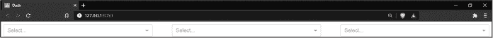

<samp class="SANS_Futura_Std_Book_Oblique_I_11">图 4-5: 三个下拉框在一行中的演示</samp>

考虑到这一切，让我们来看一下清单 4-7，我们*twitter_app.py*文件中的<html.Div>部分，它包含不到 12 列。

<samp class="SANS_TheSansMonoCd_W5Regular_11">html.Div(</samp>

<samp class="SANS_TheSansMonoCd_W5Regular_11">   [</samp>

<samp class="SANS_TheSansMonoCd_W5Regular_11">   </samp>❶ <samp class="SANS_TheSansMonoCd_W5Regular_11">html.Div(</samp>

<samp class="SANS_TheSansMonoCd_W5Regular_11">        dcc.Dropdown(</samp>

<samp class="SANS_TheSansMonoCd_W5Regular_11">           id="my-dropdown",</samp>

<samp class="SANS_TheSansMonoCd_W5Regular_11">           multi=True,</samp>

<samp class="SANS_TheSansMonoCd_W5Regular_11">           options=</samp><samp class="SANS_TheSansMonoCd_W5Regular_11">[</samp>

<samp class="SANS_TheSansMonoCd_W5Regular_11">              {"label": x, "value": x}</samp>

<samp class="SANS_TheSansMonoCd_W5Regular_11">              for x in sorted(df["name"].unique())</samp>

<samp class="SANS_TheSansMonoCd_W5Regular_11">           ],</samp>

<samp class="SANS_TheSansMonoCd_W5Regular_11">   </samp><samp class="SANS_TheSansMonoCd_W5Regular_11">        value=["taylorswift13", "cristiano", "jtimberlake"],</samp>

<samp class="SANS_TheSansMonoCd_W5Regular_11">        ),</samp>

<samp class="SANS_TheSansMonoCd_W5Regular_11">        className="three columns",</samp>

<samp class="SANS_TheSansMonoCd_W5Regular_11">     ),</samp>

<samp class="SANS_TheSansMonoCd_W5Regular_11">   </samp>❷ <samp class="SANS_TheSansMonoCd_W5Regular_11">html.Div(</samp>

<samp class="SANS_TheSansMonoCd_W5Regular_11">        html.A(</samp>

<samp class="SANS_TheSansMonoCd_W5Regular_11">           id="my-link",</samp>

<samp class="SANS_TheSansMonoCd_W5Regular_11">           children="点击这里访问 Twitter",</samp>

<samp class="SANS_TheSansMonoCd_W5Regular_11">           href="</samp><samp class="SANS_TheSansMonoCd_W5Regular_11">https://twitter.com/explore",</samp>

<samp class="SANS_TheSansMonoCd_W5Regular_11">           target="_blank",</samp>

<samp class="SANS_TheSansMonoCd_W5Regular_11">        ),</samp>

<samp class="SANS_TheSansMonoCd_W5Regular_11">        className="two columns",</samp>

<samp class="SANS_TheSansMonoCd_W5Regular_11">    ),</samp>

<samp class="SANS_TheSansMonoCd_W5Regular_11">        ],</samp>

<samp class="SANS_TheSansMonoCd_W5Regular_11">   className="row",</samp>

<samp class="SANS_TheSansMonoCd_W5Regular_11">),</samp>

<samp class="SANS_Futura_Std_Book_Oblique_I_11">示例 4-7：下拉菜单</samp> <samp class="SANS_Futura_Std_Book_Oblique_I_11">部分来自</samp> <samp class="SANS_Futura_Std_Book_11">twitter_app.py</samp>

我们看到这一行包含了两个 <samp class="SANS_TheSansMonoCd_W5Regular_11">Div</samp>：一个 <samp class="SANS_TheSansMonoCd_W5Regular_11">Dropdown</samp>，提供了多个名人供用户选择 ❶ 和一个用户可以点击的链接 ❷。这两个 <samp class="SANS_TheSansMonoCd_W5Regular_11">Div</samp> 的列总和正好是五列，意味着它们在页面上是左对齐的，如图 4-6 所示。

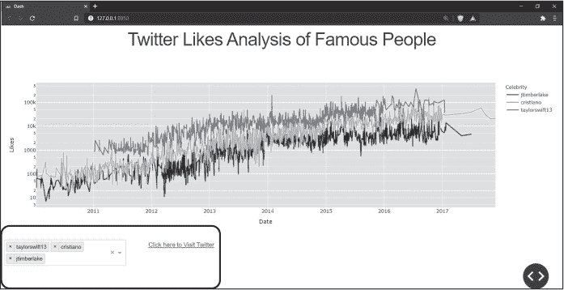

<samp class="SANS_Futura_Std_Book_Oblique_I_11">图 4-6：宽度为五列的组件</samp>

请注意，一些样式表（包括我们这里使用的样式表）要求我们首先创建父级的 <samp class="SANS_TheSansMonoCd_W5Regular_11">Div</samp>，并为其分配一个行（row）。然后，在父级 <samp class="SANS_TheSansMonoCd_W5Regular_11">Div</samp> 的子级中，我们定义每个内嵌 <samp class="SANS_TheSansMonoCd_W5Regular_11">Div</samp> 的列宽。

<samp class="SANS_Futura_Std_Bold_Condensed_Oblique_I_11">样式：美化你的应用程序</samp>

样式是赋予应用程序生命的因素。我们可以添加颜色，改变字体和文字大小，给文字加下划线等等。修改应用程序样式有两种主要方法。第一种是使用 <samp class="SANS_TheSansMonoCd_W5Regular_11">style</samp> 属性在 Dash HTML 组件中。这样可以让用户指定将直接应用到组件的 CSS 样式声明。

第二种方法是引用一个 CSS 样式表，就像我们之前创建行和列时所做的那样。我们将向你展示如何将额外的样式表 *mystyles.css* 集成到应用程序中；如果你按照本章之前的“设置项目”部分下载了文件，它应该位于你的 *assets* 文件夹中。让我们首先看看如何使用 <samp class="SANS_TheSansMonoCd_W5Regular_11">style</samp> 属性来修改应用程序。

<samp class="SANS_Futura_Std_Bold_Condensed_B_11">使用 style 属性</samp>

<samp class="SANS_TheSansMonoCd_W5Regular_11">style</samp> 属性期望一个 Python 字典，字典中的键指定我们想要修改的方面，值则设置样式。在我们的 *twitter_app.py* 文件中，我们将通过在 <samp class="SANS_TheSansMonoCd_W5Regular_11">html.A</samp> 组件中定义 <samp class="SANS_TheSansMonoCd_W5Regular_11">style</samp> 属性来将链接的文本颜色更改为红色，正如 清单 4-8 所示。

<samp class="SANS_TheSansMonoCd_W5Regular_11">html.Div(</samp>

<samp class="SANS_TheSansMonoCd_W5Regular_11">   html.A(id="my-link", children="点击这里访问 Twitter",</samp>

<samp class="SANS_TheSansMonoCd_W5Regular_11">      href="</samp><samp class="SANS_TheSansMonoCd_W5Regular_11">https://twitter.com/explore",</samp> <samp class="SANS_TheSansMonoCd_W5Regular_11">target="_blank",</samp>

<samp class="SANS_TheSansMonoCd_W5Regular_11">   </samp>❶   <samp class="SANS_TheSansMonoCd_W5Regular_11">style={"color": "red"}),</samp>

<samp class="SANS_TheSansMonoCd_W5Regular_11">   className="two columns")</samp>

<samp class="SANS_Futura_Std_Book_Oblique_I_11">清单 4-8：对 HTML 元素进行样式设置</samp> <samp class="SANS_Futura_Std_Book_11">twitter_app.py</samp>

在 ❶ 处，我们将一个字典分配给 <samp class="SANS_TheSansMonoCd_W5Regular_11">style</samp> 属性，其中键是 <samp class="SANS_TheSansMonoCd_W5Regular_11">color</samp>，值是 <samp class="SANS_TheSansMonoCd_W5Regular_11">red</samp>。这告诉浏览器用红色文本渲染此链接。

现在，我们通过向字典中添加另一个键值对，给相同的链接添加一个黄色背景色：

<samp class="SANS_TheSansMonoCd_W5Regular_11">style={"color": "red",</samp> <samp class="SANS_TheSansMonoCd_W7Bold_B_11">"backgroundColor": "yellow"</samp><samp class="SANS_TheSansMonoCd_W5Regular_11">}</samp>

注意，字典的键是一个驼峰式命名的字符串。在 Dash 中，<samp class="SANS_TheSansMonoCd_W5Regular_11">style</samp> 字典中的键应该始终使用驼峰式命名。

最后，我们将把链接的字体大小改为 40 像素：

<samp class="SANS_TheSansMonoCd_W5Regular_11">style={"color": "red", "backgroundColor": "yellow",</samp> <samp class="SANS_TheSansMonoCd_W7Bold_B_11">"fontSize": "40px"</samp><samp class="SANS_TheSansMonoCd_W5Regular_11">}</samp>

Dash 的一个美妙之处在于，样式不仅限于 HTML 组件；我们还可以为核心组件（如<samp class="SANS_TheSansMonoCd_W5Regular_11">Dropdown</samp>）添加样式。例如，若要将下拉选项的文字颜色更改为绿色，我们在<samp class="SANS_TheSansMonoCd_W5Regular_11">dcc.Dropdown</samp>中添加<samp class="SANS_TheSansMonoCd_W5Regular_11">style</samp>属性，如列表 4-9 所示。

<samp class="SANS_TheSansMonoCd_W5Regular_11">html.Div(</samp>

<samp class="SANS_TheSansMonoCd_W5Regular_11">   dcc.Dropdown(id="my-dropdown", multi=True,</samp>

<samp class="SANS_TheSansMonoCd_W5Regular_11">           options=[{"label": x, "value": x}</samp>

<samp class="SANS_TheSansMonoCd_W5Regular_11">                 for x in sorted(df["name"].unique())],</samp>

<samp class="SANS_TheSansMonoCd_W5Regular_11">           value=["taylorswift13", "cristiano", "jtimberlake"],</samp>

<samp class="SANS_TheSansMonoCd_W5Regular_11">           </samp><samp class="SANS_TheSansMonoCd_W7Bold_B_11">style={"color": "green"}</samp><samp class="SANS_TheSansMonoCd_W5Regular_11">),</samp>

<samp class="SANS_TheSansMonoCd_W5Regular_11">   className="three columns"),</samp>

<samp class="SANS_Futura_Std_Book_Oblique_I_11">列表 4-9：在</samp> <samp class="SANS_Futura_Std_Book_11">twitter_app.py</samp> <samp class="SANS_Futura_Std_Book_Oblique_I_11">中样式化核心组件</samp>

在图 4-7 的左下角显示的下拉选项，现在会是绿色而不是黑色。

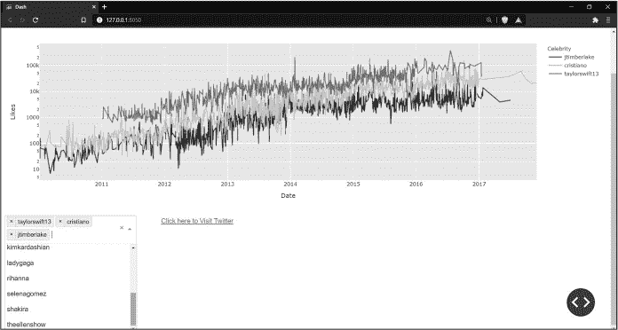

<samp class="SANS_Futura_Std_Book_Oblique_I_11">图 4-7：在你的电脑上运行时，出现绿色的下拉选项</samp>

<samp class="SANS_Futura_Std_Bold_Condensed_B_11">使用样式表</samp>

第二种样式化应用组件的方法是通过元素或类来定义样式。通常，在需要大量代码来进行样式设置时，我们会使用这种方法。为了减少应用本身中出现的代码量，我们将样式代码放在外部的 CSS 样式表中。CSS 样式表也是可重用的；你可以一次定义一个特定的类，并将其应用于多个组件。

我们将使用的 CSS 样式表是*mystyles.css*，它应该已经包含在你随书籍资源下载的*assets*文件夹中。通过双击打开 PyCharm 或你喜欢的文本编辑器中的 CSS 样式表，你应该能看到以下这些代码行：

<samp class="SANS_TheSansMonoCd_W5Regular_11">/*</samp>

<samp class="SANS_TheSansMonoCd_W5Regular_11">h1 {font-size: 8.6rem; line-height: 1.35; letter-spacing: -.08rem;</samp>

<samp class="SANS_TheSansMonoCd_W5Regular_11">margin-bottom: 1.2rem; margin-top: 1.2rem;}</samp>

<samp class="SANS_TheSansMonoCd_W5Regular_11">*/</samp>

<samp class="SANS_TheSansMonoCd_W5Regular_11">/*</samp> 是注释语法，因此要启用样式，删除下面和上面 CSS 代码的 <samp class="SANS_TheSansMonoCd_W5Regular_11">/*</samp> 和 <samp class="SANS_TheSansMonoCd_W5Regular_11">*/</samp> 符号。这里的 <samp class="SANS_TheSansMonoCd_W5Regular_11">h1</samp> 是 *选择器*，它指定我们希望应用后续样式的元素；在此例中，它适用于所有 <samp class="SANS_TheSansMonoCd_W5Regular_11">h1</samp> 元素。在花括号内，我们声明属性和属性值，设置应用程序中的各种样式。在这个例子中，我们将元素的字体大小设置为 8.6，行高设置为 1.35，字母间距设置为 –0.08，上下边距设置为 1.2。

列表 4-10 展示了我们的应用中如何使用这个 CSS 样式表来处理 <samp class="SANS_TheSansMonoCd_W5Regular_11">H1</samp> 标题组件。

<samp class="SANS_TheSansMonoCd_W5Regular_11">html.Div(html.H1("Twitter 名人点赞分析",</samp>

<samp class="SANS_TheSansMonoCd_W5Regular_11">                 style={"textAlign": "center"}),</samp>

<samp class="SANS_TheSansMonoCd_W5Regular_11">         className="row"),</samp>

<samp class="SANS_Futura_Std_Book_Oblique_I_11">列表 4-10：在</samp> <samp class="SANS_Futura_Std_Book_11">twitter_app.py</samp> 中的 html.H1 组件

<samp class="SANS_TheSansMonoCd_W5Regular_11">html.H1</samp> 至 <samp class="SANS_TheSansMonoCd_W5Regular_11">html.H6</samp> 组件用于定义标题，其中 <samp class="SANS_TheSansMonoCd_W5Regular_11">H1</samp> 表示最高的标题级别，<samp class="SANS_TheSansMonoCd_W5Regular_11">H6</samp> 表示最低的标题级别。图 4-8 展示了此标题样式的外观。

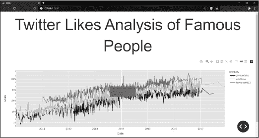

<samp class="SANS_Futura_Std_Book_Oblique_I_11">图 4-8：使用 CSS 样式的应用程序标题</samp>

如你所见，如果将图 4-8 与图 4-6 进行对比，结果是应用程序标题的字体大小变大，标题的上下边距增大，而字母之间的间距则变小。如果你的应用程序标题没有变化大小，请重新启动应用程序以查看效果。

如果你希望恢复标题的小字体，只需通过重新插入 <samp class="SANS_TheSansMonoCd_W5Regular_11">/*</samp> 和 <samp class="SANS_TheSansMonoCd_W5Regular_11">*/</samp> 符号来注释掉 CSS 代码，如下所示：

<samp class="SANS_TheSansMonoCd_W5Regular_11">/*</samp>

<samp class="SANS_TheSansMonoCd_W5Regular_11">h1 {font-size: 8.6rem; line-height: 1.35; letter-spacing: -.08rem;</samp>

<samp class="SANS_TheSansMonoCd_W5Regular_11">margin-bottom: 1.2rem; margin-top: 1.2rem;}</samp>

<samp class="SANS_TheSansMonoCd_W5Regular_11">*/</samp>

你已经学会了如何使用纯 Python 操控应用的样式和布局。但这只是开始。在第五章中，我们将深入了解 dash-bootstrap-components，这将使仪表盘应用的布局设计和样式更加简单且多样化。

### <samp class="SANS_Futura_Std_Bold_B_11">Dash 组件</samp>

在这里，我们将概述一些 Dash 中常见的组件，这些组件由 dash-html-components 和 dash-core-components 库提供。还有许多其他组件库，甚至可以编写自己的组件！但 dash-html-components 和 dash-core-components 包含了我们需要的大部分基本功能。HTML 组件通常用于构建网页布局，包含 <samp class="SANS_TheSansMonoCd_W5Regular_11">Div</samp>、<samp class="SANS_TheSansMonoCd_W5Regular_11">Button</samp>、<samp class="SANS_TheSansMonoCd_W5Regular_11">H1</samp> 和 <samp class="SANS_TheSansMonoCd_W5Regular_11">Form</samp> 等许多其他组件。Core 组件——例如 <samp class="SANS_TheSansMonoCd_W5Regular_11">Dropdown</samp>、<samp class="SANS_TheSansMonoCd_W5Regular_11">Checklist</samp>、<samp class="SANS_TheSansMonoCd_W5Regular_11">RangeSlider</samp> 等——用于创建交互式体验。所有 HTML 和 Core 组件都有用于增强功能的属性。有关这些属性及其组件的完整列表，请访问 Dash 文档中的 HTML 和 Core 组件部分，链接：[*https://<wbr>dash<wbr>.plotly<wbr>.com<wbr>/dash<wbr>-core<wbr>-components*](https://dash.plotly.com/dash-core-components)。

<samp class="SANS_Futura_Std_Bold_Condensed_Oblique_I_11">HTML 组件</samp>

Dash HTML 组件是用 Python 编写的，自动转换为 HTML，因此无需成为 HTML 或 CSS 的专家就能使用 Dash 应用。以下是 Python 中的一行代码：

<samp class="SANS_TheSansMonoCd_W5Regular_11"><h1> Twitter 喜欢分析：名人 </h1></samp>

这大致相当于以下一行 HTML，供网页浏览器读取：

<samp class="SANS_TheSansMonoCd_W5Regular_11">html.H1("Twitter 喜欢分析：名人")</samp>

现在完全用纯 Python 编写一个完整的仪表盘应用是可能的：永远使用 Python！

要创建一个 HTML 组件，可以使用点表示法，连接 <samp class="SANS_TheSansMonoCd_W5Regular_11">html</samp> 关键字和组件名称。例如，要创建一个 <samp class="SANS_TheSansMonoCd_W5Regular_11">Div</samp> 组件，你会使用 <samp class="SANS_TheSansMonoCd_W5Regular_11">html.Div</samp>，就像我们之前看到的那样。我们还看到两个额外的 HTML 组件：<samp class="SANS_TheSansMonoCd_W5Regular_11">html.H1</samp>，它创建一个顶级标题，以及 <samp class="SANS_TheSansMonoCd_W5Regular_11">html.A</samp>，它创建一个超链接。让我们更仔细地看看如何使用 <samp class="SANS_TheSansMonoCd_W5Regular_11">html.H1</samp> 来表示页面的标题，标题本身作为字符串写在这里：

<samp class="SANS_TheSansMonoCd_W5Regular_11">html.H1("Twitter 点赞分析：名人篇")</samp>

这将字符串分配给 <samp class="SANS_TheSansMonoCd_W5Regular_11">children</samp> 属性，通常这是接受 children 的任何组件的第一个位置参数。在这个上下文中，<samp class="SANS_TheSansMonoCd_W5Regular_11">children</samp> 是一个属性，将组件或元素（如文本标签）放置在另一个组件中。写全之后，上一行看起来像这样：

<samp class="SANS_TheSansMonoCd_W5Regular_11">html.H1(children="Twitter 点赞分析：名人篇")</samp>

在以下代码的前三个示例中，<samp class="SANS_TheSansMonoCd_W5Regular_11">children</samp> 属性将文本添加到页面中。在最后一个示例中，使用 <samp class="SANS_TheSansMonoCd_W5Regular_11">html.Div</samp>，<samp class="SANS_TheSansMonoCd_W5Regular_11">children</samp> 属性将 <samp class="SANS_TheSansMonoCd_W5Regular_11">html.H1</samp> 组件添加到页面中，该组件也包含文本。<samp class="SANS_TheSansMonoCd_W5Regular_11">children</samp> 属性可以接受整数、字符串、Dash 组件或这些的列表。所有这些示例都是可行的：

<samp class="SANS_TheSansMonoCd_W5Regular_11">html.H1(children=2),</samp>

<samp class="SANS_TheSansMonoCd_W5Regular_11">html.H1(children="Twitter 点赞分析：名人篇"),</samp>

<samp class="SANS_TheSansMonoCd_W5Regular_11">html.H1(children=["Twitter 点赞分析：名人篇"]),</samp>

<samp class="SANS_TheSansMonoCd_W5Regular_11">html.Div(children=</samp><samp class="SANS_TheSansMonoCd_W5Regular_11">[</samp>

<samp class="SANS_TheSansMonoCd_W5Regular_11">   html.H1("Twitter 点赞分析：名人篇"),</samp>

<samp class="SANS_TheSansMonoCd_W5Regular_11">   html.H2("Twitter 点赞分析：名人篇")</samp>

<samp class="SANS_TheSansMonoCd_W5Regular_11">])</samp>

<samp class="SANS_TheSansMonoCd_W5Regular_11">html.A</samp> 组件创建一个 <samp class="SANS_TheSansMonoCd_W5Regular_11"><a></samp> HTML5 元素，用于创建超链接。在这个组件中，如清单 4-11 所示，我们使用了四个属性：<samp class="SANS_TheSansMonoCd_W5Regular_11">id</samp>、<samp class="SANS_TheSansMonoCd_W5Regular_11">children</samp>、<samp class="SANS_TheSansMonoCd_W5Regular_11">href</samp> 和 <samp class="SANS_TheSansMonoCd_W5Regular_11">target</samp>。

<samp class="SANS_TheSansMonoCd_W5Regular_11">html.A(id="my-link", children=</samp><samp class="SANS_TheSansMonoCd_W5Regular_11">"点击这里访问 Twitter",</samp>

<samp class="SANS_TheSansMonoCd_W5Regular_11">   href="</samp><samp class="SANS_TheSansMonoCd_W5Regular_11">https://twitter.com/explore",</samp> <samp class="SANS_TheSansMonoCd_W5Regular_11">target="_blank")</samp>

<samp class="SANS_Futura_Std_Book_Oblique_I_11">清单 4-11：HTML 链接组件在</samp> <samp class="SANS_Futura_Std_Book_11">twitter_app.py</samp> 中的实现

我们为 <samp class="SANS_TheSansMonoCd_W5Regular_11">href</samp> 属性分配的值是完整的链接目标，用户点击链接后将跳转到该目标页面。<samp class="SANS_TheSansMonoCd_W5Regular_11">target</samp> 属性表示链接打开的位置：如果其分配的值为 <samp class="SANS_TheSansMonoCd_W5Regular_11">_self</samp>，链接将在用户所在的浏览器标签页中打开；如果其分配的值为 <samp class="SANS_TheSansMonoCd_W5Regular_11">_blank</samp>，链接将在新的浏览器标签页中打开。<samp class="SANS_TheSansMonoCd_W5Regular_11">children</samp> 属性定义了组件的内容，在这里是一个字符串值，表示用户在页面上看到的链接文本。

<samp class="SANS_TheSansMonoCd_W5Regular_11">id</samp> 属性很重要，因为 Dash 组件使用 <samp class="SANS_TheSansMonoCd_W5Regular_11">id</samp> 来识别和相互交互，这为仪表板应用提供了交互功能。我们将在本章稍后的“回调装饰器”中详细讨论这一点。现在，首先要注意的是，分配给 <samp class="SANS_TheSansMonoCd_W5Regular_11">id</samp> 的值必须是唯一的字符串，以便可以用来识别该组件。

<samp class="SANS_Futura_Std_Bold_Condensed_Oblique_I_11">核心组件</samp>

Dash 核心组件是来自 Dash 库的预构建组件，允许用户以直观的方式与应用程序交互。在这个应用中，我们使用了两个核心组件：<samp class="SANS_TheSansMonoCd_W5Regular_11">Graph</samp> 和 <samp class="SANS_TheSansMonoCd_W5Regular_11">Dropdown</samp>。要构建或访问特定的核心组件，我们使用 <samp class="SANS_TheSansMonoCd_W5Regular_11">dcc</samp> 关键字和点表示法，例如 <samp class="SANS_TheSansMonoCd_W5Regular_11">dcc.Dropdown</samp>。

<samp class="SANS_Futura_Std_Bold_Condensed_B_11">Graph 组件</samp>

<samp class="SANS_TheSansMonoCd_W5Regular_11">Graph</samp> 组件允许你将数据可视化以图表、图形和图像的形式嵌入到你的应用中，这些都是使用 Plotly 编写的。它是最受欢迎的核心组件之一，你很可能会在每一个分析仪表盘应用中看到它。

一个 <samp class="SANS_TheSansMonoCd_W5Regular_11">Graph</samp> 组件有两个主要属性：<samp class="SANS_TheSansMonoCd_W5Regular_11">id</samp> 和 <samp class="SANS_TheSansMonoCd_W5Regular_11">figure</samp>。这是定义 <samp class="SANS_TheSansMonoCd_W5Regular_11">Graph</samp> 组件的模板：

<samp class="SANS_TheSansMonoCd_W5Regular_11">dcc.Graph(id="line-chart", figure={})</samp>

<samp class="SANS_TheSansMonoCd_W5Regular_11">id</samp> 属性为 <samp class="SANS_TheSansMonoCd_W5Regular_11">Graph</samp> 组件赋予一个唯一的 ID。<samp class="SANS_TheSansMonoCd_W5Regular_11">figure</samp> 属性是 Plotly 图表的占位符。一旦创建了 Plotly 图表，我们会将其赋值给 <samp class="SANS_TheSansMonoCd_W5Regular_11">figure</samp> 属性，替换掉空字典。例如，在我们的应用中，我们通过 Listing 4-12 中的代码创建了一个 Plotly 折线图。

<samp class="SANS_TheSansMonoCd_W5Regular_11">import plotly.express as px</samp>

<samp class="SANS_TheSansMonoCd_W5Regular_11">--</samp><samp class="SANS_TheSansMonoCd_W5Regular_Italic_I_11">snip--</samp>

<samp class="SANS_TheSansMonoCd_W5Regular_11">fig = px.line(data_frame=df_filtered, x="date_time", y="number_of_likes",</samp>

<samp class="SANS_TheSansMonoCd_W5Regular_11">   color="name", log_y=True)</samp>

<samp class="SANS_Futura_Std_Book_Oblique_I_11">Listing 4-12: 在</samp> <samp class="SANS_Futura_Std_Book_11">twitter_app.py</samp> <samp class="SANS_Futura_Std_Book_Oblique_I_11">中创建 Plotly 图表</samp>

我们将在本章稍后的“Plotly Express 折线图”部分详细介绍 Plotly 图表。目前，这一行代码仅仅描述了图表的外观，并将其分配给 <samp class="SANS_TheSansMonoCd_W5Regular_11">fig</samp> 对象，使其成为一个 Plotly 图形。然后我们可以将 <samp class="SANS_TheSansMonoCd_W5Regular_11">fig</samp> 插入到 <samp class="SANS_TheSansMonoCd_W5Regular_11">dcc.Graph</samp> 的 <samp class="SANS_TheSansMonoCd_W5Regular_11">figure</samp> 属性中，将折线图显示在页面上。Listing 4-13 显示了 *twitter_app.py* 文件中的代码，执行了这一操作，并将其分配给了 <samp class="SANS_TheSansMonoCd_W5Regular_11">app.layout</samp>。

<samp class="SANS_TheSansMonoCd_W5Regular_11">html.Div(dcc.Graph(id="line-chart", figure=fig), className="row")</samp>

<samp class="SANS_Futura_Std_Book_Oblique_I_11">Listing 4-13: 将图表拉入 Graph 组件中，位于</samp> <samp class="SANS_Futura_Std_Book_11">twitter_app.py</samp>

我们将 <samp class="SANS_TheSansMonoCd_W5Regular_11">Graph</samp> 组件放入 <samp class="SANS_TheSansMonoCd_W5Regular_11">Div</samp> 组件内，并将其分配到页面的单独一行。一旦完整的应用脚本激活，折线图将显示在页面上。

如果你想了解完整的 Dash <samp class="SANS_TheSansMonoCd_W5Regular_11">Graph</samp> 组件及其用法，请观看视频“关于图表组件的一切”，视频链接：[*https://<wbr>learnplotlydash<wbr>.com*](https://learnplotlydash.com)。

<samp class="SANS_Futura_Std_Bold_Condensed_B_11">下拉框组件</samp>

<samp class="SANS_TheSansMonoCd_W5Regular_11">Dropdown</samp> 组件允许用户从下拉菜单中选择选项，以动态过滤数据并更新图表。我们通过为四个属性提供值来定义 <samp class="SANS_TheSansMonoCd_W5Regular_11">Dropdown</samp> 组件：<samp class="SANS_TheSansMonoCd_W5Regular_11">id</samp>、<samp class="SANS_TheSansMonoCd_W5Regular_11">multi</samp>、<samp class="SANS_TheSansMonoCd_W5Regular_11">options</samp> 和 <samp class="SANS_TheSansMonoCd_W5Regular_11">value</samp>，如示例 4-14 所示。此菜单如图 4-9 所示。

<samp class="SANS_TheSansMonoCd_W5Regular_11">dcc.Dropdown(id="my-dropdown", multi=True,</samp>

<samp class="SANS_TheSansMonoCd_W5Regular_11">              options=[{"label": x, "value": x}</samp>

<samp class="SANS_TheSansMonoCd_W5Regular_11">                 for x in sorted(df["name"].unique())],</samp>

<samp class="SANS_TheSansMonoCd_W5Regular_11">              value=["taylorswift13", "cristiano", "jtimberlake"])</samp>

<samp class="SANS_Futura_Std_Book_Oblique_I_11">示例 4-14：在</samp> <samp class="SANS_Futura_Std_Book_11">twitter_app.py</samp> <samp class="SANS_Futura_Std_Book_Oblique_I_11">中创建下拉框组件</samp>

<samp class="SANS_TheSansMonoCd_W5Regular_11">multi</samp> 属性允许我们选择用户是否可以一次选择多个值，或者一次只能选择一个值。当此属性设置为 <samp class="SANS_TheSansMonoCd_W5Regular_11">True</samp> 时，应用程序用户可以选择多个值；当设置为 <samp class="SANS_TheSansMonoCd_W5Regular_11">False</samp> 时，用户每次只能选择一个值。

<samp class="SANS_TheSansMonoCd_W5Regular_11">options</samp> 属性表示用户点击 <samp class="SANS_TheSansMonoCd_W5Regular_11">Dropdown</samp> 时可以选择的值。我们为其分配一个包含 <samp class="SANS_TheSansMonoCd_W5Regular_11">label</samp> 和 <samp class="SANS_TheSansMonoCd_W5Regular_11">value</samp> 键的字典列表，每个字典表示一个菜单选项。<samp class="SANS_TheSansMonoCd_W5Regular_11">label</samp> 是用户看到的选项名称，<samp class="SANS_TheSansMonoCd_W5Regular_11">value</samp> 是应用程序读取的实际数据。

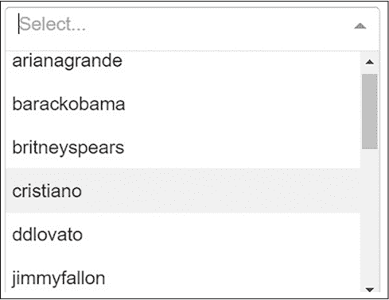

<samp class="SANS_Futura_Std_Book_Oblique_I_11">图 4-9：应用下拉菜单选项</samp>

在 Listing 4-14 中，我们使用列表推导式为字典列表赋值，这是 Python 中的一种快捷方式，可以根据另一个列表（或任何其他 Python 可迭代对象）的值创建一个新的列表。对于我们 pandas 数据框中 `<samp class="SANS_TheSansMonoCd_W5Regular_11">name</samp>` 列中的每一个唯一值，这一行代码将创建一个包含 `<samp class="SANS_TheSansMonoCd_W5Regular_11">label</samp>` 和 `<samp class="SANS_TheSansMonoCd_W5Regular_11">value</samp>` 键的字典。

如果我们只有少量的值，手动写出每个字典可能比使用列表推导式更为简便。例如，在 Listing 4-15 中，我们构建了一个只包含两个值的 `<samp class="SANS_TheSansMonoCd_W5Regular_11">Dropdown</samp>`：`<samp class="SANS_TheSansMonoCd_W5Regular_11">taylorswift13</samp>` 和 `<samp class="SANS_TheSansMonoCd_W5Regular_11">cristiano</samp>`。

<samp class="SANS_TheSansMonoCd_W5Regular_11">dcc.Dropdown(id="my-dropdown", multi=True,</samp>

<samp class="SANS_TheSansMonoCd_W5Regular_11">             options=[{"label": "Taylor", "value": "taylorswift13"},</samp>

<samp class="SANS_TheSansMonoCd_W5Regular_11">                      {"label": "Ronaldo", "value": "cristiano"}]</samp>

<samp class="SANS_TheSansMonoCd_W5Regular_11">)</samp>

<samp class="SANS_Futura_Std_Book_Oblique_I_11">Listing 4-15: 一个不在</samp> <samp class="SANS_Futura_Std_Book_11">twitter_app.py</samp> 中的 Dropdown 示例

在这里，我们使用数据框中出现的值，以便更容易进行过滤。但我们可以为 `<samp class="SANS_TheSansMonoCd_W5Regular_11">label</samp>` 键选择一个更适合人类理解的表示方式，以便用户能够更容易识别。当用户点击下拉菜单时，他们将看到两个选项 *Taylor* 和 *Ronaldo*，这些选项在应用中分别被读取为 `<samp class="SANS_TheSansMonoCd_W5Regular_11">taylorswift13</samp>` 和 `<samp class="SANS_TheSansMonoCd_W5Regular_11">cristiano</samp>`。

最后的 `<samp class="SANS_TheSansMonoCd_W5Regular_11">Dropdown</samp>` 属性是 `<samp class="SANS_TheSansMonoCd_W5Regular_11">value</samp>`（不要与字典中的 `<samp class="SANS_TheSansMonoCd_W5Regular_11">value</samp>` 键混淆），它包含了用户启动应用时，`<samp class="SANS_TheSansMonoCd_W5Regular_11">Dropdown</samp>` 将采用的默认值。由于我们有一个多值的 `<samp class="SANS_TheSansMonoCd_W5Regular_11">Dropdown</samp>`，我们使用数据框中 `<samp class="SANS_TheSansMonoCd_W5Regular_11">name</samp>` 列的三个字符串作为初始值：`<samp class="SANS_TheSansMonoCd_W5Regular_11">taylorswift13</samp>`，`<samp class="SANS_TheSansMonoCd_W5Regular_11">cristiano</samp>` 和 `<samp class="SANS_TheSansMonoCd_W5Regular_11">jtimberlake</samp>`。

这些字符串对应于在列表 4-14 中`<samp class="SANS_TheSansMonoCd_W5Regular_11">options</samp>`属性中生成的值。字符串是预加载的，因此这三个值在用户点击下拉菜单之前就会自动选择。一旦用户在下拉菜单中选择了不同的值，这些值会相应地发生变化。

要观看有关 Dash <samp class="SANS_TheSansMonoCd_W5Regular_11">Dropdown</samp> 组件及其使用的完整视频教程，请参见视频“Dropdown Selector”，网址为[*https://<wbr>learnplotlydash<wbr>.com*](https://learnplotlydash.com)。

### <samp class="SANS_Futura_Std_Bold_B_11">Dash 回调函数</samp>

*Dash 回调函数*使用户能够在仪表盘应用中进行交互；它是将 Dash 组件连接在一起的机制，使得执行某个操作会导致其他操作发生。当应用用户选择下拉菜单的值时，图形会更新；当用户点击按钮时，应用标题的颜色会改变，或者另一张图表会被添加到页面上。Dash 组件之间的交互是无限的，如果没有回调函数，应用就会是静态的，用户无法修改任何内容。

Dash 回调函数有两个部分，一个是回调装饰器，用于标识相关组件，定义在布局部分：

<samp class="SANS_TheSansMonoCd_W5Regular_11">@app.callback()</samp>

以及定义这些 Dash 组件如何交互的回调函数：

<samp class="SANS_TheSansMonoCd_W5Regular_11">def function_name(y):</samp>

<samp class="SANS_TheSansMonoCd_W5Regular_11">   return x</samp>

这个简单的应用只有一个回调函数，而更复杂的应用可能会有多个回调函数。

<samp class="SANS_Futura_Std_Bold_Condensed_Oblique_I_11">回调装饰器</samp>

回调装饰器将回调函数注册到 Dash 应用中，告诉应用何时调用该函数，以及如何使用函数的返回值来更新应用。（我们在第一章中讨论了装饰器。）

回调装饰器应该放在回调函数的上方，且装饰器与函数之间不能有空格。装饰器有两个主要参数：<samp class="SANS_TheSansMonoCd_W5Regular_11">Output</samp> 和 <samp class="SANS_TheSansMonoCd_W5Regular_11">Input</samp>，它们分别表示在用户操作另一个组件时应该改变的组件（<samp class="SANS_TheSansMonoCd_W5Regular_11">Output</samp>）和用户操作的组件（<samp class="SANS_TheSansMonoCd_W5Regular_11">Input</samp>）。例如，输出可能是线图，它应该根据用户在 <samp class="SANS_TheSansMonoCd_W5Regular_11">Dropdown</samp> 组件中的输入来变化，如列表 4-16 所示。

<samp class="SANS_TheSansMonoCd_W5Regular_11">@app.callback(</samp>

<samp class="SANS_TheSansMonoCd_W5Regular_11">   Output(component_id="line-chart", component_property="figure"),</samp>

<samp class="SANS_TheSansMonoCd_W5Regular_11">   [Input(component_id="my-dropdown", component_property="value")],</samp>

<samp class="SANS_TheSansMonoCd_W5Regular_11">)</samp>

<samp class="SANS_Futura_Std_Book_Oblique_I_11">清单 4-16：来自</samp> <samp class="SANS_Futura_Std_Book_11">twitter_app.py</samp> 的回调装饰器

<samp class="SANS_TheSansMonoCd_W5Regular_11">Output</samp> 和 <samp class="SANS_TheSansMonoCd_W5Regular_11">Input</samp> 都接受两个参数：<samp class="SANS_TheSansMonoCd_W5Regular_11">component_id</samp>，它应对应于特定 Dash 组件的 <samp class="SANS_TheSansMonoCd_W5Regular_11">id</samp>，以及 <samp class="SANS_TheSansMonoCd_W5Regular_11">component_property</samp>，它应对应于该组件的特定属性。在清单 4-16 中，<samp class="SANS_TheSansMonoCd_W5Regular_11">Input</samp> 的 <samp class="SANS_TheSansMonoCd_W5Regular_11">component_id</samp> 指向我们之前定义的 <samp class="SANS_TheSansMonoCd_W5Regular_11">my-dropdown Dropdown</samp>。<samp class="SANS_TheSansMonoCd_W5Regular_11">component_property</samp> 特指 <samp class="SANS_TheSansMonoCd_W5Regular_11">my-dropdown</samp> 的 <samp class="SANS_TheSansMonoCd_W5Regular_11">value</samp> 属性，这个属性是初始设置的 Twitter 用户数据：<samp class="SANS_TheSansMonoCd_W5Regular_11">["taylorswift13", "cristiano", "jtimberlake"]</samp>，如清单 4-14 所示。

在 <samp class="SANS_TheSansMonoCd_W5Regular_11">Output</samp> 中，我们引用了 <samp class="SANS_TheSansMonoCd_W5Regular_11">dcc.Graph</samp> 的 <samp class="SANS_TheSansMonoCd_W5Regular_11">figure</samp> 属性，该属性我们之前在布局中也进行了定义，如清单 4-17 所示。

<samp class="SANS_TheSansMonoCd_W5Regular_11">dcc.Graph(id="line-chart", figure={})</samp>

<samp class="SANS_Futura_Std_Book_Oblique_I_11">清单 4-17：布局部分中的图形组件</samp> <samp class="SANS_Futura_Std_Book_11">twitter_app.py</samp>

这里的 <samp class="SANS_TheSansMonoCd_W5Regular_11">figure</samp> 属性目前是一个空字典，因为回调函数将根据输入创建折线图并将其赋值给 <samp class="SANS_TheSansMonoCd_W5Regular_11">figure</samp>。让我们深入了解回调函数，以便完全理解这一过程是如何发生的。

<samp class="SANS_Futura_Std_Bold_Condensed_Oblique_I_11">回调函数</samp>

我们应用的回调函数名为 <samp class="SANS_TheSansMonoCd_W5Regular_11">update_graph()</samp>，其中包含一系列 <samp class="SANS_TheSansMonoCd_W5Regular_11">if-else</samp> 语句，用于过滤数据框 <samp class="SANS_TheSansMonoCd_W5Regular_11">df</samp> 并根据所选的输入值创建折线图。清单 4-18 展示了我们应用中的回调函数。

<samp class="SANS_TheSansMonoCd_W5Regular_11">def update_graph(chosen_value):</samp>

<samp class="SANS_TheSansMonoCd_W5Regular_11">   print(f"用户选择的值: {chosen_value}")</samp>

<samp class="SANS_TheSansMonoCd_W5Regular_11">   if len(chosen_value) == 0:</samp>

<samp class="SANS_TheSansMonoCd_W5Regular_11">      return {}</samp>

<samp class="SANS_TheSansMonoCd_W5Regular_11">   else:</samp>

<samp class="SANS_TheSansMonoCd_W5Regular_11">     df_filtered = df[df["name"].isin(chosen_value)]</samp>

<samp class="SANS_TheSansMonoCd_W5Regular_11">     fig = px.line(</samp>

<samp class="SANS_TheSansMonoCd_W5Regular_11">        data_frame=df_filtered,</samp>

<samp class="SANS_TheSansMonoCd_W5Regular_11">        x="date_time",</samp>

<samp class="SANS_TheSansMonoCd_W5Regular_11">        y="number_of_likes",</samp>

<samp class="SANS_TheSansMonoCd_W5Regular_11">        color="name",</samp>

<samp class="SANS_TheSansMonoCd_W5Regular_11">        log_y=</samp><samp class="SANS_TheSansMonoCd_W5Regular_11">True,</samp>

<samp class="SANS_TheSansMonoCd_W5Regular_11">        labels={</samp>

<samp class="SANS_TheSansMonoCd_W5Regular_11">           "number_of_likes": "点赞数",</samp>

<samp class="SANS_TheSansMonoCd_W5Regular_11">           "date_time": "日期",</samp>

<samp class="SANS_TheSansMonoCd_W5Regular_11">           "name": "名人",</samp>

<samp class="SANS_TheSansMonoCd_W5Regular_11">        },</samp>

<samp class="SANS_TheSansMonoCd_W5Regular_11">      )</samp>

<samp class="SANS_TheSansMonoCd_W5Regular_11">      return fig</samp>

<samp class="SANS_Futura_Std_Book_Oblique_I_11">清单 4-18: 回调函数在</samp> <samp class="SANS_Futura_Std_Book_11">twitter_app.py</samp>

我们接下来将逐行分析其中的逻辑。不过首先，让我们讨论一下这个函数的作用。执行时，<samp class="SANS_TheSansMonoCd_W5Regular_11">update_graph()</samp> 返回一个名为 <samp class="SANS_TheSansMonoCd_W5Regular_11">fig</samp> 的对象，在本例中它包含了 Plotly Express 的折线图。这个 <samp class="SANS_TheSansMonoCd_W5Regular_11">fig</samp> 对象被返回给我们在回调装饰器中指定的组件和属性。正如我们所知，回调装饰器指向布局中的 Dash 组件。因此，<samp class="SANS_TheSansMonoCd_W5Regular_11">fig</samp> 被赋值给布局部分中 <samp class="SANS_TheSansMonoCd_W5Regular_11">Graph</samp> 组件的 <samp class="SANS_TheSansMonoCd_W5Regular_11">figure</samp> 属性，因此回调告诉应用程序显示一个折线图。以下是回调函数 <samp class="SANS_TheSansMonoCd_W5Regular_11">update_graph()</samp> 执行后，<samp class="SANS_TheSansMonoCd_W5Regular_11">Graph</samp> 组件的样子：

<samp class="SANS_TheSansMonoCd_W5Regular_11">dcc.Graph(id="line-chart", figure=fig)</samp>

现在，<samp class="SANS_TheSansMonoCd_W5Regular_11">figure</samp> 属性被赋值为对象 <samp class="SANS_TheSansMonoCd_W5Regular_11">fig</samp>，而不是我们在 Listing 4-17 中看到的空字典。

我们将简要总结这一点，因为这个过程非常重要！一旦回调函数通过用户输入被激活，它将返回一个与回调装饰器中 <samp class="SANS_TheSansMonoCd_W5Regular_11">Output</samp> 的 <samp class="SANS_TheSansMonoCd_W5Regular_11">component_property</samp> 绑定的对象。由于组件属性代表了应用布局中组件的实际属性，结果就是一个通过用户交互不断更新的应用。

要查看关于 Dash 回调装饰器及其用法的完整视频教程，请参阅视频“Dash 回调—输入、输出、状态等”，视频链接为 [*https://<wbr>learnplotlydash<wbr>.com*](https://learnplotlydash.com)。

<samp class="SANS_Futura_Std_Bold_Condensed_B_11">激活回调</samp>

要激活回调，用户必须与回调装饰器内的 <samp class="SANS_TheSansMonoCd_W5Regular_11">Input</samp> 组件进行交互。在此应用程序中，组件属性代表 <samp class="SANS_TheSansMonoCd_W5Regular_11">Dropdown</samp> 的值，因此每次用户选择不同的下拉值（一个 Twitter 账户名）时，回调函数都会被触发。

如果回调装饰器有三个 <samp class="SANS_TheSansMonoCd_W5Regular_11">Input</samp>，用户需要提供三个参数来触发回调函数。在我们的例子中，回调装饰器只有一个 <samp class="SANS_TheSansMonoCd_W5Regular_11">Input</samp>；因此，回调函数将只接受一个参数：<samp class="SANS_TheSansMonoCd_W5Regular_11">chosen_value</samp>。

<samp class="SANS_Futura_Std_Bold_Condensed_B_11">函数的工作原理</samp>

让我们查看 Listing 4-19，它展示了应用回调函数内部的操作。

❶  <samp class="SANS_TheSansMonoCd_W5Regular_11">def update_graph(chosen_value):</samp>

<samp class="SANS_TheSansMonoCd_W5Regular_11">        print(f"用户选择的值: {chosen_value}")</samp>

❷ <samp class="SANS_TheSansMonoCd_W5Regular_11">if len(chosen_value) == 0:</samp>

<samp class="SANS_TheSansMonoCd_W5Regular_11">     return {}</samp>

<samp class="SANS_TheSansMonoCd_W5Regular_11">        else:</samp>

<samp class="SANS_TheSansMonoCd_W5Regular_11">      df_filtered = df[df["name"].isin(chosen_value)]</samp>

<samp class="SANS_TheSansMonoCd_W5Regular_11">      fig =</samp> <samp class="SANS_TheSansMonoCd_W5Regular_11">px.line(</samp>

<samp class="SANS_TheSansMonoCd_W5Regular_11">        data_frame=df_filtered,</samp>

<samp class="SANS_TheSansMonoCd_W5Regular_11">        x="date_time",</samp>

<samp class="SANS_TheSansMonoCd_W5Regular_11">        y="number_of_likes",</samp>

<samp class="SANS_TheSansMonoCd_W5Regular_11">        color="name",</samp>

<samp class="SANS_TheSansMonoCd_W5Regular_11">        log_y=True,</samp>

<samp class="SANS_TheSansMonoCd_W5Regular_11">        labels={</samp>

<samp class="SANS_TheSansMonoCd_W5Regular_11">           "number_of_likes": "Likes",</samp>

<samp class="SANS_TheSansMonoCd_W5Regular_11">           "date_time": "Date",</samp>

<samp class="SANS_TheSansMonoCd_W5Regular_11">           "name": "Celebrity",</samp>

<samp class="SANS_TheSansMonoCd_W5Regular_11">        },</samp>

<samp class="SANS_TheSansMonoCd_W5Regular_11">      )</samp>

<samp class="SANS_TheSansMonoCd_W5Regular_11">      return fig</samp>

<samp class="SANS_Futura_Std_Book_Oblique_I_11">清单 4-19：用于</samp> <samp class="SANS_Futura_Std_Book_11">twitter_app.py</samp> 的回调函数

<samp class="SANS_TheSansMonoCd_W5Regular_11">chosen_value</samp> 参数 ❶ 指的是 <samp class="SANS_TheSansMonoCd_W5Regular_11">dcc.Dropdown</samp> 的值，它是一个 Twitter 用户名的列表。每当用户选择新选项时，函数会被激活。用户可以选择任意数量的可用名人，<samp class="SANS_TheSansMonoCd_W5Regular_11">chosen_value</samp> 列表中的项目数量会相应增加或减少。它可能是一个包含 3 个值、10 个值，甚至没有值的列表。因此，我们检查 <samp class="SANS_TheSansMonoCd_W5Regular_11">chosen_value</samp> 列表的长度 ❷。如果它等于零，表示它是一个空列表，函数会返回一个空字典，返回的 <samp class="SANS_TheSansMonoCd_W5Regular_11">fig</samp> 对象会显示一个空图表。

如果 <samp class="SANS_TheSansMonoCd_W5Regular_11">chosen_value</samp> 列表的长度不等于零，则在 <samp class="SANS_TheSansMonoCd_W5Regular_11">else</samp> 分支中，我们使用 pandas 来过滤 DataFrame，仅保留包含选定 Twitter 用户名的行。过滤后的 DataFrame 被保存为 <samp class="SANS_TheSansMonoCd_W5Regular_11">df_filtered</samp>，然后作为数据用于创建折线图，并将其保存为 <samp class="SANS_TheSansMonoCd_W5Regular_11">fig</samp> 对象。返回的 <samp class="SANS_TheSansMonoCd_W5Regular_11">fig</samp> 对象会显示在应用页面上的折线图。

关于这些函数有一个重要说明：如果原始 DataFrame 发生任何修改，你应该始终创建原始 DataFrame 的副本，就像我们在创建 <samp class="SANS_TheSansMonoCd_W5Regular_11">df_filtered</samp> 时所做的那样。应用程序开始时定义的原始 DataFrame，在清单 4-2 中，被视为全局变量。全局变量不应被修改，因为这样会影响应用程序中其他用户所看到的变量。例如，如果一个用户在财务仪表板应用中修改了全局变量 <samp class="SANS_TheSansMonoCd_W5Regular_11">price_values</samp>，所有用户都会看到这些修改后的价格。这可能会导致严重的损害和混乱。

<samp class="SANS_Futura_Std_Bold_Condensed_Oblique_I_11">回调图</samp>

Dash 拥有一个强大的回调图工具，可以展示回调的结构并明确元素之间的关联。当你定义回调时，尤其是回调有多个 <samp class="SANS_TheSansMonoCd_W5Regular_11">Input</samp> 和 <samp class="SANS_TheSansMonoCd_W5Regular_11">Output</samp> 时，使用该工具会特别有帮助，因为这种情况下更难理解回调结构。要打开回调图，点击应用页面右下角的蓝色按钮，如图 4-10 所示。

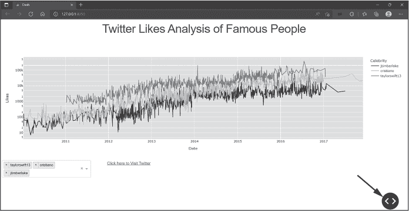

<samp class="SANS_Futura_Std_Book_Oblique_I_11">图 4-10：点击右下角的按钮以打开菜单。</samp>

然后点击灰色的 **Callbacks** 按钮，如图 4-11 所示。

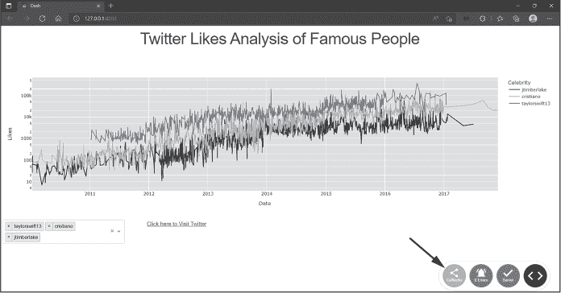

<samp class="SANS_Futura_Std_Book_Oblique_I_11">图 4-11：点击 Callbacks 按钮查看回调图。</samp>

结果应如下图所示：图 4-12。

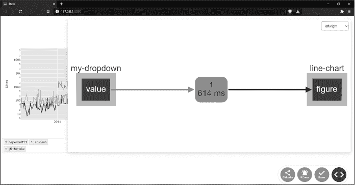

<samp class="SANS_Futura_Std_Book_Oblique_I_11">图 4-12：回调图 for</samp> <samp class="SANS_Futura_Std_Book_11">twitter_app.py</samp>

左侧的元素是 <samp class="SANS_TheSansMonoCd_W5Regular_11">Input</samp> 的组件属性。中间的元素描述了在本次会话中回调被触发的次数（在此案例中是一次），以及回调完全执行所需的时间（614 毫秒）。右侧的元素是 <samp class="SANS_TheSansMonoCd_W5Regular_11">Output</samp> 的组件属性。该图有助于清晰地展示 <samp class="SANS_TheSansMonoCd_W5Regular_11">Dropdown</samp> 的值（<samp class="SANS_TheSansMonoCd_W5Regular_11">Input</samp>）如何影响折线图的图形（<samp class="SANS_TheSansMonoCd_W5Regular_11">Output</samp>）。

继续通过更改主应用页面上的<samp class="SANS_TheSansMonoCd_W5Regular_11">Dropdown</samp>名人姓名来触发回调。你看中间的绿色元素是如何变化的吗？点击左侧和右侧的元素探索这个图表，你应该能够在每个元素中看到额外的信息。

确保在将应用部署到网页之前，将调试模式关闭，使用<samp class="SANS_TheSansMonoCd_W5Regular_11">debug</samp> <samp class="SANS_TheSansMonoCd_W5Regular_11">=</samp> <samp class="SANS_TheSansMonoCd_W5Regular_11">False</samp>来关闭图表。否则，最终用户也能访问该图表。

### <samp class="SANS_Futura_Std_Bold_B_11">Plotly Express 折线图</samp>

在这里，我们将回顾如何创建 Plotly 图表。我们将重点讨论折线图，因为这是我们在此应用中使用的类型，其他类型的图表将在未来的章节中进行回顾。

Plotly Express 是一个用于快速直观地创建图表的高级接口。它包含了几十种可以选择的图形，涵盖了科学、统计和金融图表到 3D 图表和地图等各种类型。每种图形都有许多属性，允许你根据用户需求自定义图形。以下是 Plotly Express 折线图可用属性的完整列表，目前所有属性都设置为<samp class="SANS_TheSansMonoCd_W5Regular_11">None</samp>：

<samp class="SANS_TheSansMonoCd_W5Regular_11">plotly.express.line(</samp><samp class="SANS_TheSansMonoCd_W7Bold_B_11">data_frame=None, x</samp><samp class="SANS_TheSansMonoCd_W7Bold_B_11">=None, y=None</samp><samp class="SANS_TheSansMonoCd_W5Regular_11">, line_group=None, color=None, line_dash=None, hover_name=None, hover_data=None, custom_data=</samp><samp class="SANS_TheSansMonoCd_W5Regular_11">None, text=None, facet_row=None, facet_col=None, facet_col_wrap=0, facet_row_spacing=None, facet_col_spacing=None, error_x=None, error_x_minus=None, error_y=None, error_y_minus=</samp><samp class="SANS_TheSansMonoCd_W5Regular_11">None, animation_frame=None, animation_group=None, category_orders={}, labels={}, orientation=None, color_discrete_sequence=None, color_discrete_map={}, line_dash_sequence=None, line_dash_map={}, log_x=</samp><samp class="SANS_TheSansMonoCd_W5Regular_11">False, log_y=False, range_x=None, range_y=None, line_shape=None, render_mode='auto', title=None, template=None,width=None, height=None)</samp>

Plotly Express 的美妙之处在于，在大多数情况下，创建图表所需了解的只需要前面三个属性：<samp class="SANS_TheSansMonoCd_W5Regular_11">data_frame</samp>、<samp class="SANS_TheSansMonoCd_W5Regular_11">x</samp>和<samp class="SANS_TheSansMonoCd_W5Regular_11">y</samp>，在示例中以粗体显示。这些分别代表 DataFrame、用于 x 轴的数据列以及用于 y 轴的数据列。这里我们绘制了一个非常简单的折线图：

<samp class="SANS_TheSansMonoCd_W5Regular_11">import plotly.express as px</samp>

<samp class="SANS_TheSansMonoCd_W5Regular_11">px.line(data_frame=df, x="some_xaxis_data", y="some_yaxis_data")</samp>

<samp class="SANS_TheSansMonoCd_W5Regular_11">fig.show()</samp>

这将创建最基本的折线图，绘制两个数据列之间的关系，得到类似于 图 4-13 的图形。

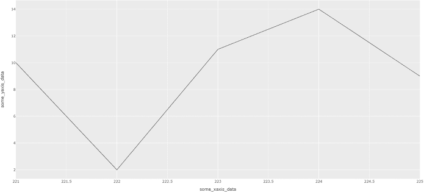

<samp class="SANS_Futura_Std_Book_Oblique_I_11">图 4-13：最简单的折线图</samp>

随着你越来越熟悉 Plotly Express，你会发现自己往图表中添加更多的属性。例如，为了通过颜色区分数据组，我们添加了 <samp class="SANS_TheSansMonoCd_W5Regular_11">color</samp> 属性，并为其指定了一个假设的 DataFrame 列：

<samp class="SANS_TheSansMonoCd_W5Regular_11">px.line(data_frame=df, x="some_ xaxis _data", y="some_yaxis_data",</samp> <samp class="SANS_TheSansMonoCd_W7Bold_B_11">color</samp><samp class="SANS_TheSansMonoCd_W7Bold_B_11">="some_data"</samp><samp class="SANS_TheSansMonoCd_W5Regular_11">)</samp>

因此，我们将看到类似于 图 4-14 的效果。

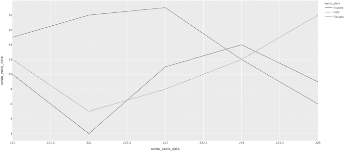

<samp class="SANS_Futura_Std_Book_Oblique_I_11">图 4-14：向简单图表添加颜色属性</samp>

要改变图形的高度，我们需要添加 <samp class="SANS_TheSansMonoCd_W5Regular_11">height</samp> 属性，并为其指定一个像素值：

<samp class="SANS_TheSansMonoCd_W5Regular_11">px.line(data_frame=df, x="some_xaxis_data", y='some_yaxis_data',</samp> <samp class="SANS_TheSansMonoCd_W7Bold_B_11">height=300</samp><samp class="SANS_TheSansMonoCd_W5Regular_11">)</samp>

在这里，我们将整个图形的高度设置为 300 像素。

在我们的 Twitter 点赞分析应用中，折线图包括了 <samp class="SANS_TheSansMonoCd_W5Regular_11">data_frame</samp>、<samp class="SANS_TheSansMonoCd_W5Regular_11">x</samp>、<samp class="SANS_TheSansMonoCd_W5Regular_11">y</samp> 和 <samp class="SANS_TheSansMonoCd_W5Regular_11">color</samp> 属性，以及 <samp class="SANS_TheSansMonoCd_W5Regular_11">labels</samp> 和 <samp class="SANS_TheSansMonoCd_W5Regular_11">log_y</samp> 属性。列表 4-20 展示了我们的 Plotly 图表代码。

<samp class="SANS_TheSansMonoCd_W5Regular_11">fig = px.line(</samp>

<samp class="SANS_TheSansMonoCd_W5Regular_11">   data_frame=df_filtered,</samp>

<samp class="SANS_TheSansMonoCd_W5Regular_11">   x="date_time",</samp>

<samp class="SANS_TheSansMonoCd_W5Regular_11">   y=</samp><samp class="SANS_TheSansMonoCd_W5Regular_11">"number_of_likes",</samp>

<samp class="SANS_TheSansMonoCd_W5Regular_11">   color="name",</samp>

<samp class="SANS_TheSansMonoCd_W5Regular_11">   log_y=True,</samp>

<samp class="SANS_TheSansMonoCd_W5Regular_11">   labels={</samp>

<samp class="SANS_TheSansMonoCd_W5Regular_11">      "number_of_likes": "Likes",</samp>

<samp class="SANS_TheSansMonoCd_W5Regular_11">      "date_time": "Date",</samp>

<samp class="SANS_TheSansMonoCd_W5Regular_11">      "name": "Celebrity",</samp>

<samp class="SANS_TheSansMonoCd_W5Regular_11">   },</samp>

<samp class="SANS_TheSansMonoCd_W5Regular_11">)</samp>

<samp class="SANS_Futura_Std_Book_Oblique_I_11">清单 4-20: Plotly 折线图，用于</samp> <samp class="SANS_Futura_Std_Book_11">twitter_app.py</samp>

<samp class="SANS_TheSansMonoCd_W5Regular_11">log_y</samp> 属性告诉应用程序在 y 轴数据上使用对数刻度。当图表中的少量数据点远大于或小于大部分数据时，推荐使用对数刻度，因为它能提供更清晰的可视化。我们在这里不详细讨论对数刻度，但可以尝试将属性从 <samp class="SANS_TheSansMonoCd_W5Regular_11">True</samp> 更改为 <samp class="SANS_TheSansMonoCd_W5Regular_11">False</samp>，然后刷新应用程序查看更新后的图表。你更喜欢哪一个？

<samp class="SANS_TheSansMonoCd_W5Regular_11">labels</samp> 属性更改应用程序用户看到的轴标签。用于绘制折线图的三列是 <samp class="SANS_TheSansMonoCd_W5Regular_11">date_time</samp>（x 轴），<samp class="SANS_TheSansMonoCd_W5Regular_11">number_of_likes</samp>（y 轴）和 <samp class="SANS_TheSansMonoCd_W5Regular_11">name</samp>（颜色）。这些是 pandas DataFrame 中的列名，我们必须保持其格式和拼写，以便与正确的列匹配。使用 <samp class="SANS_TheSansMonoCd_W5Regular_11">labels</samp> 属性，我们更改用户在应用页面上看到的内容，使其更具用户友好性，从而使 <samp class="SANS_TheSansMonoCd_W5Regular_11">number_of_likes</samp> 简单地变为 <samp class="SANS_TheSansMonoCd_W5Regular_11">Likes</samp>。

每个属性在 Plotly 文档中都有详细描述，网址为 [*https://<wbr>plotly<wbr>.com<wbr>/python<wbr>-api<wbr>-reference*](https://plotly.com/python-api-reference)。花时间阅读这些描述非常值得，因为它将帮助你了解如何自定义折线图和其他类型的图形。

有关带有 <samp class="SANS_TheSansMonoCd_W5Regular_11">Dropdown</samp> 的 Plotly Express 折线图的完整视频教程，请观看视频“Line Plot (Dropdown)”在 [*https://<wbr>learnplotlydash<wbr>.com*](https://learnplotlydash.com)。

<samp class="SANS_Dogma_OT_Bold_B_11">工具提示</samp>

<samp class="SANS_Futura_Std_Book_11">在我们的应用程序中没有使用的一个常见属性，但是它非常普遍，因此在这里值得一提：</samp> <samp class="SANS_TheSansMonoCd_W5Regular_11">hover_data</samp><samp class="SANS_Futura_Std_Book_11">，它允许您在用户将鼠标悬停在图表特定元素上时提供额外的信息工具提示。您可以将分配给</samp> <samp class="SANS_TheSansMonoCd_W5Regular_11">hover_data</samp> <samp class="SANS_Futura_Std_Book_11">的值放在列表或字典中。</samp>

<samp class="SANS_Futura_Std_Book_11">当您使用列表时，图表的悬停工具提示将包括列表中的值。例如，如果我们使用</samp> <samp class="SANS_TheSansMonoCd_W5Regular_11">number_of_shares</samp> <samp class="SANS_Futura_Std_Book_11">列作为</samp> <samp class="SANS_TheSansMonoCd_W5Regular_11">hover_data</samp> <samp class="SANS_Futura_Std_Book_11">列表，则当用户将鼠标悬停在图表线条上时，悬停工具提示将包括这些数据。要尝试这样做，请进行以下更改并重新运行应用程序：</samp>

<samp class="SANS_TheSansMonoCd_W5Regular_11">fig = px.line(data_frame=df_filtered, x="date_time", y="number_of_likes",</samp>

<samp class="SANS_TheSansMonoCd_W5Regular_11">              </samp><samp class="SANS_TheSansMonoCd_W5Regular_11">color="name", hover_data=["number_of_shares"])</samp>

<samp class="SANS_Futura_Std_Book_11">以下图显示了悬停信息的差异。</samp>

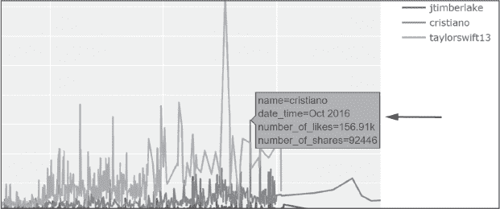

<samp class="SANS_Futura_Std_Book_Oblique_I_11">示例工具提示，包含“number of shares”在悬停数据中</samp>

<samp class="SANS_Futura_Std_Book_11">确保在完成后删除更改。</samp>

<samp class="SANS_Futura_Std_Book_11">当您使用字典而不是列表时，键是 DataFrame 列，值是布尔值，您用来显示（</samp><samp class="SANS_TheSansMonoCd_W5Regular_11">True</samp><samp class="SANS_Futura_Std_Book_11">）或不显示（</samp><samp class="SANS_TheSansMonoCd_W5Regular_11">False</samp><samp class="SANS_Futura_Std_Book_11">）悬停工具提示中的数据。例如，如果您将</samp> <samp class="SANS_TheSansMonoCd_W5Regular_11">number_of_likes</samp> <samp class="SANS_Futura_Std_Book_11">列作为字典键，将</samp> <samp class="SANS_TheSansMonoCd_W5Regular_11">False</samp> <samp class="SANS_Futura_Std_Book_11">作为字典值，那么每位名人的点赞数的数据将不再显示在悬停工具提示中：</samp>

<samp class="SANS_TheSansMonoCd_W5Regular_11">hover_data={"number_of_likes": False}</samp>

<samp class="SANS_Futura_Std_Book_11">我们还可以使用</samp> <samp class="SANS_TheSansMonoCd_W5Regular_11">hover_data</samp> <samp class="SANS_Futura_Std_Book_11">字典来格式化工具提示中显示的悬停数据。例如，默认情况下，</samp> <samp class="SANS_TheSansMonoCd_W5Regular_11">number_of_likes</samp> <samp class="SANS_Futura_Std_Book_11">是以字母“k”表示 10,000（200,000 会写成 200k）。然而，如果我们更喜欢显示带逗号作为分隔符的完整数字（200,000），我们可以使用：</samp>

<samp class="SANS_TheSansMonoCd_W5Regular_11">hover_data={"number_of_likes": ':,'}</samp>

### <samp class="SANS_Futura_Std_Bold_B_11">总结</samp>

本章向你介绍了基本 Dash 应用程序的核心元素：编程所需的 Python 库、使用的数据、Dash HTML 和核心组件、使用布局部分将应用程序组件定位在页面上、使用回调将组件连接在一起并创建交互性，以及 Plotly Express 图形库。在下一章中，我们将基于这里学到的技能，开发更复杂的 Dash 应用程序。
