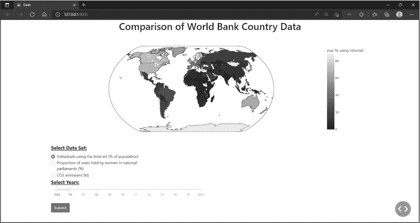
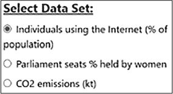
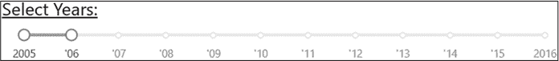
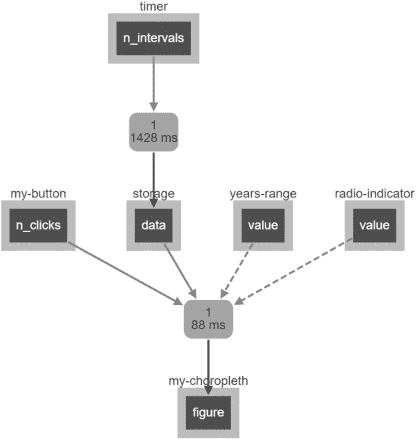
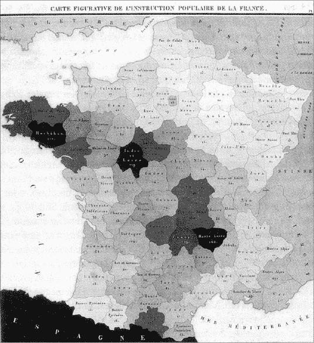

## 第五章：5 全球数据分析：高级布局 和图表

在本章中，你将通过构建一个应用程序来扩展 Dash 的知识，该应用程序比较和分析三个指标的世界数据：互联网使用率、议会中女性比例和二氧化碳（CO[2]）排放量。我们将这些指标称为 *指标*。我们将更深入地了解 Dash 的回调函数，并学习如何绘制 *分层图*，它在地图的特定空间区域（如国家、州、省等）中以阴影和颜色的形式表示定量数据。你还将发现使用 dash-bootstrap-components 管理布局和样式的新方法，这个库提供了复杂和响应式的布局。

为了收集这个应用程序所需的数据，我们将使用 pandas 访问世界银行的应用程序编程接口（API）。*API* 提供了一个接口，允许你连接到外部服务器并请求数据，以便将其输入到应用程序中。

到本章结束时，你将更加熟悉如何在地图上绘制数据，管理更高级的布局，理解回调函数，并使用 dash-core-components。首先，设置应用程序和相应的代码是重中之重。

### 设置项目

和往常一样，首先你需要创建项目文件夹，并将应用程序代码放在其中。创建一个名为 *world-bank-app* 的新项目文件夹，并定位到你从 [*https://<wbr>github<wbr>.com<wbr>/DashBookProject<wbr>/Plotly<wbr>-Dash*](https://github.com/DashBookProject/Plotly-Dash) 下载的 ZIP 文件中包含的 *Chapter-5* 文件夹，该文件夹在 第四章的开始部分。该文件夹应包含两个文件：*worldbank.py* 和 *our_indicator.py*。将这些文件复制到你的 world-bank-app 文件夹中。

项目文件夹应如下所示：

- world-bank-app

|--our_indicator.py

|--worldbank.py

我们需要四个库：常用的 pandas 和 Dash 库，以及 dash-bootstrap-components 和 pandas datareader。打开命令提示符（Mac 用户使用终端）或 PyCharm 中的终端标签，或者你选择的 Python IDE。然后逐行输入以下内容以安装这四个库：

$ pip install pandas

$ pip install dash

$ pip install dash-bootstrap-components

$ pip install pandas-datareader

要检查这些库是否已正确安装，请输入：

$ pip list

这将列出你当前安装的所有 Python 包。如果我们需要的四个库中有任何一个没有列出，请尝试重新输入相应的 install 命令。

在查看代码之前，先来看看应用。打开 *worldbank.py* 文件，在你的 IDE 中运行该脚本。你应该会看到一个带有 HTTP 链接的消息。点击该链接，或将其复制到你的浏览器中：

Dash 正在运行于 http://127.0.0.1:8050/

   * 正在服务 Flask 应用 "worldbank"（延迟加载）

   * 环境：生产

     警告：这是一个开发服务器。请勿在生产环境中使用。

     请改用生产环境中的 WSGI 服务器。

   * 调试模式：开启

现在，你应该能看到世界银行数据分析仪表盘应用，如 图 5-1 所示。

图 5-1：世界银行数据分析应用

玩得开心点！使用滑块来更改日期，并使用单选按钮选择不同的世界银行数据指标，比如议会席位数或二氧化碳排放量。移动地图并将鼠标悬停在某些国家上，以比较它们的数据。哪个国家议会中的女性比例最高？哪个国家的互联网使用比例增长最快？熟悉一下这个应用，随着我们逐步讲解，代码会变得更易理解。

导入库

在这个应用中，我们引入了两个新的 Python 库：dash-bootstrap-components 和 pandas datareader。

dash-bootstrap-components 是一个包，它使得管理应用布局变得更加简单。Bootstrap 提供了组件，允许你更精确地将应用元素放置在页面上，创建更多组件（如图表和单选按钮），并以非常详细的方式对每个元素进行样式设置。它本质上是 Dash 内建布局功能的扩展。

我们将使用 pandas 来筛选并准备数据以进行绘图，就像我们在第四章的应用中所做的那样。然而，这个应用还将使用 pandas datareader，这是 pandas 的一个扩展，它通过 API 获取数据并基于这些数据创建 DataFrame。pandas datareader 扩展提供了从多个常见互联网来源提取数据的方法，例如 NASDAQ、加拿大银行、世界银行等。我们的应用只使用来自世界银行的数据，因此为了访问这些数据，我们需要从 datareader 扩展中导入 wb 世界银行模块，如列表 5-1 所示。

import dash_bootstrap_components as dbc

from pandas_datareader import wb

列表 5-1：世界银行应用的导入部分 worldbank.py 应用

数据管理

接下来的部分是数据管理代码，在这里我们将世界银行 API 中的数据整合到我们的应用中。我们还将清理数据，去除损坏的值，提取我们需要的数据，并将其与另一个 DataFrame 合并，以获取缺失的值。

连接到 API

连接到 API 让我们的应用能够动态读取数据，使我们可以随时添加和更改读取的数据，而无需修改和上传静态的 Excel 文件。通过通过 pandas datareader 连接到 API，我们可以在收到请求后立即将新数据上传到应用中。

需要注意的是，一些 API 会限制个人可以发出的请求数量，以防止 API 被过度使用。如果超过了此限制，您可能会被阻止在一定时间内发送更多请求。请求之间设置超时是避免过载 API 的一种方法。

wb 模块包含用于获取与世界银行相关的不同类型数据的函数。例如，download() 函数将在传入指标作为参数时，从世界银行的世界发展指标中提取信息，而 get_countries() 函数将查询有关指定国家的信息。我们将重点关注这两个函数来构建我们的应用。

让我们首先将必要的国家数据下载到应用中，如列表 5-2 所示。

countries = wb.get_countries()

countries["capitalCity"].replace({" ": None}, inplace=True)

❶ countries.dropna(subset=["capitalCity"], inplace=True)

❷ countries = countries[["name", "iso3c"]]

countries = countries[countries["name"] != "Kosovo"]

countries = countries.rename(columns={"name": "country"})

清单 5-2：从世界银行 API 下载国家数据 worldbank.py app

首先，我们连接到世界银行 API，并使用 get_countries() 提取所有国家的名称。然而，数据并不像我们希望的那样干净，有些行实际上包含的是地区名称而不是国家名称。例如，如果你使用以下代码打印前 10 行：

countries = wb.get_countries()

print(countries.head(10)[['name']])

exit()

你会发现第 1 行包含了“东部和南部非洲”这个地区。我们的应用专注于国家，所以我们使用 dropna() 来排除地区，通过删除所有没有首都城市的行 ❶，这样剩下的应该只有国家名称。

为了在地图上绘制点，Plotly 使用的是国家代码而非国家名称，因此接下来我们需要为应用提供国家代码。这些代码被称为*alpha-3*或*ISO3*代码，每个国家都有不同的代码。例如，奥地利的代码是 AUT，阿塞拜疆的是 AZE，布隆迪的是 BDI，依此类推。

我们不需要 get_countries() 返回的其他信息，所以我们将数据框限制为两个必要的列：name 列和 iso3c 国家代码列 ❷。

作者们之前的实验表明，科索沃的 ISO3 数据是损坏的，因此我们过滤数据框，删除科索沃的行。最后，我们将 name 列重命名为 country，这样以后合并数据框时会更加方便（见清单 5-4）。

识别指标

在构建了各国的数据框后，我们需要提取与我们的三个指标相关的世界银行数据：互联网使用、女性政治家和排放数据。我们首先需要找到指标的确切名称，然后找到其相应的 ID，以便我们能够正确查询 API。我们直接从世界银行网站获取指标名称。访问 [*https://<wbr>data<wbr>.worldbank<wbr>.org<wbr>/indicator*](https://data.worldbank.org/indicator)。要获取互联网使用指标的名称，请点击页面顶部的 **所有指标** 标签。然后，在基础设施部分，点击 **个人使用互联网（占人口百分比）**。这就是我们在应用程序中将使用的指标的确切名称。如果世界银行网站更改了指标名称，请确保搜索类似的内容并获取确切的名称。如果你遇到问题，我们会确保书中的代码保持最新。

接下来，我们使用指标名称通过你下载的包含在书籍资源中的 *our_indicator.py* 文件来获取其 ID。在你的项目文件夹中，打开 *our_indicator.py* 文件并在一个新的 IDE 窗口中运行它：

df = wb.get_indicators()[['id','name']]

df = df[df.name == '个人使用互联网（占人口百分比）']

print(df)

这只是从数据框中提取与世界银行网站相关的 name 和 id 列的条目。输出应该显示与该指标相关的 ID：

|  | id | name |  |  |  |  |
| --- | --- | --- | --- | --- | --- | --- |
| 8045 | IT.NET.USER.ZS | 个人使用互联网（占人口百分比） |

你需要重复这个过程，从世界银行网站获取剩余两个指标的名称，方法是将 'Individuals using the Internet (% of population)' 替换为其他两个指标的名称：'Proportion of seats held by women in national parliaments (%)'，该指标位于性别部分，和 'CO2 emissions (kt)'，该指标位于气候变化部分。再次提醒，这些名称时常会变化，所以如果你没有找到结果，请确保搜索世界银行的指标页面并找到最接近的匹配项。然后，我们将指标名称和 ID 存储在 *worldbank.py* 文件中的字典里，后续我们将使用它，如 示例 5-3 所示。

indicators = {

   "IT.NET.USER.ZS": "使用互联网的个人（占人口百分比）",

   "SG.GEN.PARL.ZS": "女性在国家议会中占据的席位比例（%）",

   "EN.ATM.CO2E.KT": "二氧化碳排放量（千吨）",

}

列表 5-3：在 worldbank.py 中定义指标

你下载的主要代码将包含这些 ID，但自己练习获取这些 ID 会很有用，因为它们会不时发生变化。

提取数据

现在我们可以创建一个函数，下载这三个世界银行指标的历史数据，见列表 5-4。我们将把数据保存在一个新的 DataFrame 中，命名为df。

def update_wb_data():

   # 从 API 获取特定的世界银行数据

   df = wb.download(

      indicator=(list(indicators)), country=countries["iso3c"],

      start=2005, end=2016

   )

   df = df.reset_index()

   df.year = df.year.astype(int)

   # 将国家的 ISO3 ID 添加到主 df 中

   df = pd.merge(df, countries, on="country")

   df = df.rename(columns=indicators)

   return df

列表 5-4：下载历史数据的 worldbank.py 部分

我们使用 wb.download() 方法来检索数据，该方法有几个参数。第一个是 indicator，它接受一个表示指标 ID 的字符串列表。这里我们将其赋值为 第 5-3 节 中的 indicators 字典的键。接下来的参数是 country，它接受一个表示国家 ISO3 代码的字符串列表。我们将其赋值为 第 5-2 节 中创建的 countries DataFrame 的 iso3c 列。最后，start 和 end 参数允许我们定义所需数据的年份范围。我们选择截至 2016 年，因为那是世界银行完整记录二氧化碳指标的最后一年。

然后，我们重置索引，使得原本作为索引的 country 和 year 变成新的列，并且创建一个专门的 index 列，其中仅包含整数，这将有助于后续的筛选。您可以在 第 5-5 节 中看到重置索引的效果，我们在那里展示了重置索引前后的 DataFrame。

|  |  | IT.NET.USER.ZS | SG.GEN.PARL.ZS | EN.ATM.CO2E.KT |  |
| --- | --- | --- | --- | --- | --- |
| 国家 | 年份 |  |  |  |  |
| 阿鲁巴 | 2016 | 93.542454 | NaN | NaN |  |
|  | 2015 | 88.661227 | NaN | NaN |  |
|  | 2014 | 83.780000 | NaN | NaN |  |
|  | 2013 | 78.900000 | NaN | NaN |  |
|  | 2012 | 74.000000 | NaN | NaN |  |
| … | … | … | … | … |  |
| 津巴布韦 | 2009 | 4.000000 | 14.953271 | 7750.0 |  |
|  | 2008 | 3.500000 | 15.238095 | 7600.0 |  |
|  | 2007 | 3.000000 | 16.000000 | 9760.0 |  |
|  | 2006 | 2.400000 | 16.666667 | 9830.0 |  |
|  | 2005 | 2.400000 | 16.000000 | 10510.0 |  |
| [2520 行 x 3 列] |
| >>> df.reset_index() |  |  |  |  |
|  | 国家 | 年份 | IT.NET.USER.ZS | SG.GEN.PARL.ZS | EN.ATM.CO2E.KT |
| 0 | 阿鲁巴 | 2016 | 93.542454 | NaN | NaN |
| 1 | 阿鲁巴 | 2015 | 88.661227 | NaN | NaN |
| 2 | 阿鲁巴 | 2014 | 83.780000 | NaN | NaN |
| 3 | 阿鲁巴 | 2013 | 78.900000 | NaN | NaN |
| 4 | 阿鲁巴 | 2012 | 74.000000 | NaN | NaN |
| … | … | … | … | … | … |
| 2515 | 津巴布韦 | 2009 | 4.000000 | 14.953271 | 7750.0 |
| 2516 | 津巴布韦 | 2008 | 3.500000 | 15.238095 | 7600.0 |
| 2517 | 津巴布韦 | 2007 | 3.000000 | 16.000000 | 9760.0 |
| 2518 | 津巴布韦 | 2006 | 2.400000 | 16.666667 | 9830.0 |
| 2519 | 津巴布韦 | 2005 | 2.400000 | 16.000000 | 10510.0 |
| [2520 行 x 5 列] |

列表 5-5：重置索引前后的 DataFrame

在重置索引之前，country 和 year 是索引的一部分，但不是与索引元素关联的结果行的一部分。重置索引后，它们都变成了 DataFrame 的独立列，这样可以更容易地访问包含国家和年份数据的单独行。

接下来，我们将 year 列中的值从字符串转换为整数，这样以后就可以用 pandas 正确地筛选数据。原始的 df DataFrame 不包含我们查询 API 所需的 ISO3 国家代码，因此我们从 countries DataFrame 中提取这些代码，并通过 pd.merge 在 country 列上合并两个 DataFrame。最后，我们重命名列，使它们显示指标名称，而不是 ID，以便更易于阅读。例如，列 IT.NET.USER.ZS 将被命名为 使用互联网的个人（占总人口百分比）。

update_wb_data() 函数现在已完成，并将在应用启动时立即在第一个回调函数内被调用。你将在本章稍后学到这个过程。与此同时，让我们学习如何使用 dash-bootstrap-components 来创建布局并美化应用。

Dash Bootstrap 样式

Dash Bootstrap 是一个强大的工具，帮助我们为 Dash 应用创建布局、样式，并添加像按钮和单选项这样的 Bootstrap 组件。按钮和单选项也存在于 dash-core-components 中，但我们将使用 dash-bootstrap-components 版本，以更好地与我们其余的 Bootstrap 样式兼容。Bootstrap 还包含用于存储各种样式表主题的模块，作为字符串提供，这使得我们只需引用这些模块链接来美化元素。

要将 Bootstrap 集成到 Dash 应用中，我们首先需要选择一个主题，并将其分配给 external_stylesheets 参数，该参数位于我们的导入部分下方，如 清单 5-6 所示。

import dash_bootstrap_components as dbc

from pandas_datareader import wb

app = Dash(__name__, external_stylesheets=[dbc.themes.BOOTSTRAP])

清单 5-6: Dash 被实例化的 worldbank.py 部分

Bootstrap 主题是一个在线托管的样式表，决定了页面元素的字体类型、颜色、形状和大小。

在这个应用中，我们使用默认主题 BOOTSTRAP，它是主题列表中的第一个主题。Bootstrap 还有其他多个主题供你选择。要查看这些主题，你可以访问 [*https://<wbr>hellodash<wbr>.pythonanywhere<wbr>.com*](https://hellodash.pythonanywhere.com)，然后点击页面左侧的 **Change Theme** 按钮。如果你愿意，可以为这个应用更换主题；只需确保在为 external_stylesheets 参数指定时使用完全大写的主题名称。每次只能指定一个主题，因此如果选择了新主题，请确保替换掉 BOOTSTRAP。

要查看 Dash Bootstrap 的完整视频教程，请观看视频“Complete Guide to Bootstrap Dashboard Apps”，网址为 [*https://<wbr>learnplotlydash<wbr>.com*](https://learnplotlydash.com)。

布局

正如你所知，我们通常将应用的布局称为网格，它通常由 12 列和无限行组成。要开始构建布局，我们需要创建一个容器来容纳所有的行和列，以及将放置其中的组件。dbc.Container 语法与 html.Div 非常相似，但它与 Bootstrap 样式更加兼容。首先，我们声明行，然后声明每行中包含的列。最后，我们将应用组件放入列中。最后一步定义了每个组件在页面上的位置。

为了避免给你展示创建应用布局所需的 80 行代码，列表 5-7 是一个简化版本，去除了每个 html、dcc 和 dbc 组件中的属性，仅展示了整体结构。

app.layout = dbc.Container(

          [

     ❶ dbc.Row(

          dbc.Col(

              [

                html.H1(),

                dcc.Graph()

              ],

              width=12,

          )

       )，

     ❷ dbc.Row(

          dbc.Col(

              [

                dbc.Label(),

                dbc.RadioItems(),

              ],

              width=4,

          )

       )，

     ❸ dbc.Row(

          [

              dbc.Col(

                  [

                    dbc.Label(),

                    dcc.RangeSlider(),

                    dbc.Button()

                  ],

                  width=6,

              ),

          ]

     ),

   ]

)

示例 5-7：应用布局简化

本应用包含三行。第一行❶有一个列组件，宽度为 12 列，并包含H1标题和Graph可视化组件。这些对应应用中的标题和分级地图，见图 5-1。

在第二行❷，我们放置了一个宽度仅为四列的列组件，内部放置了Label和RadioItems。它们对应应用中的“选择数据集”子标题以及其下方的三个单选按钮。

最后一行❸包含了Label、RangeSlider和Button，这些都被包含在一个宽度为六列的列组件中。

多组件行

需要重申的是，构建仪表盘的一种有效且流行的方法是每页最多设置 12 列，并允许组件跨越多个列的宽度。在这个应用中，每一行只有一个列组件，但如果我们要在一行中添加多个组件，我们必须确保它们的宽度总和不超过 12 列。我们来看一个例子：

dbc.Row([

     dbc.Col([dropdown, button, checkbox], width=6),

     dbc.Col([dropdown, slider, date-picker], width=5),

]),

在前面的代码中，总宽度为 11，这意味着所有的 Dash 组件将显示在一行上。以下是一个例子，展示了 不 应该这样做：

dbc.Row([

     dbc.Col([dropdown, button, checkbox], width=8),

     dbc.Col([dropdown, slider, date-picker], width=6),

]),

在总宽度为 14 的情况下，第二个 dbc.Col 的 Dash 组件会换行到第一个 dbc.Col下方，导致出现两行而不是一行。这可能会破坏你的布局。

组件和样式

Dash Bootstrap 组件与 Dash 核心组件类似，但它们的优势在于更易于使用，并且能够与 Bootstrap 样式表集成。在我们的应用中，我们使用了三个 Bootstrap 组件：Label、RadioItems和Button。我们来看看Button和RadioItems组件。

我们通过五个属性定义了<Button>：id、children、n_clicks、color和className，如列表 5-8 所示。

dbc.Button(

   id="my-button",

   children="提交",

   n_clicks=0,

   color="primary",

   className="mt-4",

)，

列表 5-8：定义一个 Bootstrap 按钮

id 属性用于唯一标识此组件，并将在 Dash 回调中分配给 component_id，以允许与其他组件交互。在这里，我们将其命名为 my-button。children 属性表示按钮上显示的文本。n_clicks 属性计数按钮被用户点击的次数，因此我们将其初始化为 0。color 属性设置按钮背景的颜色。这里，它被分配了 Bootstrap 上下文颜色 primary，表示蓝色（我们也可以使用 secondary 来使其变灰，success 变绿，warning 变橙，或者 danger 变红）。请注意，primary 表示的颜色取决于你选择的主题；如果你选择了 LUX 主题，那么 primary 会表示黑色，而 secondary 会是白色。

className 控制组件的样式。在这里，我们为其分配了 Bootstrap 类 mt-4，该类控制按钮顶部与上方组件之间的间距。mt 代表 *上边距*，而 –4 在组件上方的边距中创建了四个单位的空间。所有这些共同作用形成了图 5-2 中显示的按钮。

图 5-2：我们应用的提交按钮

尝试将边距更改为 mt-1，看看按钮和上方的范围滑块之间的空间如何缩小。

你还可以通过在 className 属性中添加空格来组合多个类，从而为组件添加更多样式。例如，尝试在 mt-4 后面添加 fw-bold，并将它们作为一个字符串传递给 className 属性，使得提交文本变为粗体，如下所示：

dbc.Button(

   id="my-button",

   children="提交",

   n_clicks=0,

   color="primary",

   className="mt-4 fw-bold",

),

有一些其他的Button属性我们没有使用，但值得注意。href属性可以分配一个网址，这样当按钮被点击时，用户将跳转到一个新的网站。size属性通过分配以下值之一来控制按钮的大小：'lg'、'md'或'sm'。disabled属性在我们将True赋值给它时禁用按钮；例如，如果按钮不再需要，我们可能希望创建一个回调函数来指示应用禁用该按钮。

接下来是RadioItems（也叫单选按钮），它是标签旁边可以点击的小圆圈或方框。单选按钮类似于复选框，不同之处在于复选框允许用户选择多个标签，而单选按钮一次只能选择一个标签。用户将使用它来选择他们希望显示数据的指标，如图 5-3 所示。

图 5-3：指标选择的 RadioItems 组件

我们通过列表 5-9 中显示的四个属性来定义RadioItems。

dbc.RadioItems(

   id="radio-indicator",

❶  options=[{"label": i, "value": i} for i in indicators.values()],

❷  value=list(indicators.values()) [0],

   input_class_name="me-2",

),

列表 5-9：在 worldbank.py的布局部分中的 RadioItems 组件

我们首先为<сamp class="SANS_TheSansMonoCd_W5Regular_11">RadioItems组件指定一个<сamp class="SANS_TheSansMonoCd_W5Regular_11">id名称。options属性负责显示标签。我们传递给它一个字典列表❶，每个字典代表一个标签；我们使用列表推导遍历所有指示器并为每个项目创建一个标签。或者，按照下面的代码写法，我们可以将三个字典的列表分配给<сamp class="SANS_TheSansMonoCd_W5Regular_11">RadioItems options属性，这样的（简化版）写法也会得到相同的结果：

options=[

   {"label": "使用者数量…", "value": "使用者数量…"},

   {"label": "座位比例…", "value": "座位比例…"},

   {"label": "CO2 排放量（千吨）", "value": "CO2 排放量（千吨）"}

]

每个字典有两个键：label键决定了显示给用户的文本，而value键则是指示器的实际值。例如，我们使用“CO2 排放量（千吨）”作为值，以便与指示器的字典键值相匹配，如列表 5-3 所示。这使得后续在回调部分过滤数据变得更加容易。label键可以是你希望显示的任何内容，但在这里我们使用相同的字符串作为label和value，因为该字符串已经很清晰、信息量大且显示长度适中。

下一个属性是<сamp class="SANS_TheSansMonoCd_W5Regular_11">value ❷，它记录用户选择的值，具体取决于用户点击了哪个单选按钮；在列表 5-9 中，分配给<сamp class="SANS_TheSansMonoCd_W5Regular_11">value属性的对象表示应用首次加载时默认选择的值。我们使用<сamp class="SANS_TheSansMonoCd_W5Regular_11">input_class_name属性来为单选按钮设置样式；在本例中，我们为它分配了 Bootstrap 类<сamp class="SANS_TheSansMonoCd_W5Regular_11">me-2，将圆形与标签左侧的间距设置为两个单位。尝试更改数字，看看这如何影响外观。请注意，我们可以使用 Bootstrap 类来为 Dash Core 组件以及 Bootstrap 组件设置样式。

有无数的 Bootstrap 类，这些类已经在[*https://<wbr>dashcheatsheet<wbr>.pythonanywhere<wbr>.com*](https://dashcheatsheet.pythonanywhere.com)的备忘单中做了有用的总结和组织。例如，mt-4 类位于 Spacing 工具部分，而 fw-bold 类位于 Text 工具部分。可以尝试使用其他工具类，为应用程序赋予个人风格。由于 Bootstrap 类的数量庞大，我们不会在这里详细介绍所有类；相反，我们建议你使用备忘单并尝试结合不同的类。

始终将 Bootstrap 主题分配给 external_stylesheets 参数，就像我们在示例 5-6 中做的那样，否则 Bootstrap 布局、样式和元素将在整个应用程序中无法正常工作。

### Dash 核心组件

我们将向应用程序中添加一些新的 Dash 核心组件，分别是 RangeSlider、Store 和 Interval。

RangeSlider 通常在我们需要展示一系列可选择值，或者当用户可以选择一个范围而不是离散值时使用。在本例中，我们将使用它让用户选择单个年份或一系列年份，如图 5-4 所示。

图 5-4：年份选择范围滑块组件

我们将用六个属性来定义我们的 RangeSlider，如示例 5-10 所示。

dcc.RangeSlider(

   id="years-range",

   min=2005,

   max=2016,

   step=1,

   value=[2005, 2006],

   marks={

         2005: "2005",

         2006: " '06",

         2007: " '07",

         2008: " '08",

         2009: " '09",

         2010: " '10",

         2011: " '11",

         2012: " '12",

         2013: " '13",

         2014: " '14",

         2015: " '15",

         2016: "2016",

   },

),

示例 5-10: 布局部分的 RangeSlider 组件 worldbank.py

min 和 max 属性定义了 RangeSlider 上的最小值和最大值，通常是从左到右。step 属性决定了滑块移动时的增量。我们将值设置为 1，这样每次滑块移动时年份都会增加一个。然而，由于我们为每年设置了标记，将 step 设置为另一个值，比如 3，也会达到相同的效果；用户的选择会自动对齐到最近的标记。如果我们删除了 2005 年到 2016 年之间所有年份的标记，仅保留这两个标记，滑块将以每三年的增量移动，假设你将 step 设置为 3。

value 属性决定了应用加载时默认选择的初始范围；它还会检测应用用户选择的年份范围。marks 属性标记了各个年份的标记。我们为其分配一个字典：键决定了年份在滑块上的位置，而值表示在该位置上显示的文本。

另一个常见的 RangeSlider 属性，在此未使用，是 allowCross，它允许 RangeSlider 的滑块（如图 5-4 中 2005 和 ’06 上方看到的蓝色圆圈）在设置为 True 时交叉。默认情况下，allowCross=False，但如果你将其改为 True，你将能够将 2005 的滑块拉到右侧，跨过 ’06 的滑块。有关完整的 RangeSlider 属性列表，请访问 Dash 组件文档（*http://dash.plotly.com/dash-core-components*），并选择 dcc.RangeSlider。这些属性可以在页面底部找到。有关 Dash RangeSlider 的完整视频教程，请查看视频“Range Slider—Python Dash Plotly”在 [*https://<wbr>learnplotlydash<wbr>.com*](https://learnplotlydash.com)。

Dash Store 组件通常用于将仪表板数据保存在用户的网页浏览器的内存中，以便数据可以快速高效地被调用和恢复。该存储是不可见的，并不会出现在用户的页面上，但我们仍然必须在布局部分声明它，如清单 5-11 所示。

dcc.Store(id="storage", storage_type="local", data={}),

清单 5-11：在布局的最后部分中使用的 Store 组件 worldbank.py

该组件允许回调之间无缝且快速地共享数据。然而，它可以存储的数据量是有限的：在移动环境中大约为 2MB，在大多数仅桌面应用程序中则为 5MB 到大约 10MB。我们将在下一部分中看到回调如何使用该存储。

id 属性将在回调中用于标识该组件。data 属性表示存储的数据；这些数据可以是字典、列表、整数、字符串或布尔值。实际上，我们不需要声明 data 属性或分配一个空字典，如在清单 5-11 中所做的那样，但我们在这里添加它是为了描述目的。Store 组件总是假设它存在，这就是为什么我们不需要显式声明它。

属性 storage_type 声明了我们希望如何存储数据。它有三个选项：session、local 和 memory。session 选项会保留数据，直到浏览器标签页或浏览器本身关闭并重新打开。local 选项会将数据保存在浏览器中，直到所有浏览历史和 cookie 被删除。memory 选项会在浏览器刷新时重置数据。

我们的最后一个组件是 Dash Interval，用于自动更新应用程序，而无需手动刷新浏览器页面。这个组件通常用于需要实时数据的应用程序，如金融应用程序，它们需要每几秒钟就用新数据更新自己。在我们的应用中，Interval 激活第一个回调，回调从世界银行 pandas API 获取数据并创建 DataFrame。然后，每隔 60 秒，Interval 会重新激活回调，以再次拉取数据并创建新的 DataFrame。

Interval 组件有一些重要的属性，如清单 5-12 所示。

dcc.Interval(id="timer", interval=1000 * 60, n_intervals=0),

清单 5-12：布局最后部分的 Interval 组件 worldbank.py

interval 属性告诉应用程序每次激活 Interval 之间应该间隔多少时间。我们以毫秒为单位设置这个间隔，因此这里我们使用 1000 * 60，即 60 秒。每 60 秒，你应该看到浏览器窗口标签中出现“Updating”字样。n_intervals 属性计算 Interval 被激活的次数：60 秒后 n_intervals=1，120 秒后 n_intervals=2，以此类推，直到永远。另一个常见的属性是 max_intervals，它定义了 Interval 激活的最大次数。例如，如果 max_intervals=2 且 interval=1000*60，则应用将在 120 秒后停止更新。

实际上，我们并不需要每 60 秒更新一次数据，因为世界银行可能每隔几周才更新一次数据。我们选择 60 秒的间隔只是为了让你能够看到 Interval 组件的实际效果。

有关 Dash Interval 的完整视频教程，请参见视频“Dash Interval 概述”，网址为 [*https://<wbr>learnplotlydash<wbr>.com*](https://learnplotlydash.com)。

### Dash 回调函数

我们的应用使用了两个回调函数。第一个回调函数负责通过 pandas datareader API 从世界银行获取数据，而第二个回调函数则负责在应用中创建并显示 choropleth 地图。

数据获取回调函数

数据获取回调函数将调用相应的组件，每 60 秒检索一次所选数据，并返回该数据的 DataFrame，数据存储在用户的网页浏览器中。与往常一样，回调函数有两个部分：回调装饰器和回调函数，如 列表 5-13 所示。

❶ @app.callback(Output("storage", "data"), Input("timer", "n_intervals"))

❷ def store_data(n_time):

   dataframe = update_wb_data()

   return dataframe.to_dict("records")

清单 5-13：在 worldbank.py 中的第一个回调

在回调装饰器 ❶ 内，Input 和 Output 参数包含 component_id 和 component_property，它们的赋值引用应用布局部分中的组件。在这种情况下，Input 参数的 component_id 是 "timer"，而 component_property 是 "n_intervals"。这些是位置参数，因此我们不需要在装饰器函数代码中包括这些参数。实际上，按长方式写出的相同代码如下所示：

@app.callback(

   Output(component_id="storage", component_property="data"),

   Input(component_id="timer", component_property="n_intervals")

)

如清单 5-13 所示，"timer" 指的是 Dash Interval 组件的 id，而 "n_intervals" 指的是表示 Interval 已触发次数的属性。按照相同的逻辑，"storage" 指的是 Dash Store 组件的 id，而 "data" 指的是表示存储在用户浏览器中的数据的属性。

在回调函数 ❷ 内，我们传入了单个 Input 参数 n_time。n_time 参数指代分配给 Input 的 component_property，即 n_intervals。因为 n_time 指向 n_intervals，每当 Interval 被触发（每 60 秒触发一次），回调函数也会被触发。第一次触发发生在应用首次渲染页面时，或页面刷新时。

你可以随意命名这个参数，它不必叫作 n_time。但是需要注意的是，回调函数只传入了一个参数，因为回调装饰器只有一个 Input。

一旦函数被触发，它会在应用的开始时激活 update_wb_data 函数（见 Listing 5-4），并将结果保存到 dataframe 对象中。这个 DataFrame 现在包含来自世界银行的数据。然后，DataFrame 被返回。在回调函数中返回的每个对象对应于 Output 参数的 component_property。在这个例子中，返回的 DataFrame 对应于 Store 组件的 data 属性，见 Listing 5-13。因此，检索到的世界银行数据被存储在用户的网页浏览器中以供将来使用。

我们的回调装饰器只有一个输出，因此回调函数中返回一个对象。如果回调装饰器有多个输出，那么你必须在回调函数中返回相同数量的对象。例如，在这里，回调函数返回了两个消息，因为装饰器函数有两个输出：

@app.callback(

   Output("example-content1", "children"),

   Output("example-content2", "children"),

   Input("timer", "n_intervals")

)

def update_data(n_time):

   message1 = "显示在第一个 Output 的 children 属性中的文本."

   message2 = "显示在第二个 Output 的 children 属性中的文本."

   return message1, message2

有关 Dash 回调函数的完整视频教程，请观看视频“Dash 回调—输入、输出、状态及更多”，链接见 [*https://<wbr>learnplotlydash<wbr>.com*](https://learnplotlydash.com)。

禁用启动时回调函数

默认情况下，所有回调函数在应用启动时都会被触发。然而，有时你需要阻止这种情况发生。例如，你可能有一个回调函数，只有在点击按钮时才返回图表，因此你不希望这个回调函数在启动时就被触发，而是等到按钮点击后才触发。阻止回调函数在应用首次加载时自动触发的方式有两种。一种是通过在应用启动时添加 prevent_initial_callbacks 这一行，并将其设置为 True，如下所示：

app = Dash(__name__, external_stylesheets=[dbc.themes.BOOTSTRAP],

           prevent_initial_callbacks=True)

这将阻止所有回调函数在页面首次加载或页面刷新时触发。第二种方法是在不希望在页面加载时触发的特定回调函数中输入 prevent_initial_call=True 。如果我们在第一个回调函数中这么做，代码将如下所示：

@app.callback(Output("storage", "data"), Input("timer", "n_intervals"),

              prevent_initial_call=True)

图形创建回调

图形创建回调将从用户的浏览器中检索存储的 DataFrame，根据用户选择的年份和数据集过滤该 DataFrame，并返回一个可视化表示该数据的图形。装饰器函数有两个 Input 参数，两个 State 参数，以及一个 Output，如 列表 5-14 所示。

@app.callback(

   Output("my-choropleth", "figure"),

   Input("my-button", "n_clicks"),

   Input("storage", "data"),

   State("years-range", "value"),

   State("radio-indicator", "value"),

)

列表 5-14：第二个回调的回调装饰器 worldbank.py

第一个 Input 参数表示按钮被点击的次数，第二个则表示由第一个回调存储在用户浏览器中的数据。接下来，我们定义了几个 State 参数。State 参数不会在其组件被更改时触发回调，而是记录用户的选择。这里，第一个 State 参数检查用户在 RangeSlider 上选择的年份范围，第二个则指向用户从 RadioItems 中选择的指标。

当用户更改 RangeSlider 上选择的年份，或选择不同的 RadioItems 世界银行指标时，值会被保存，但直到按钮被点击时，等值的 choropleth 地图才会更新。这是因为按钮的 n_clicks 是一个 Input 参数的组件属性（列表 5-14）。记住，Input 参数总是触发回调，而 State 参数不会触发回调。

现在让我们看看回调函数。回调装饰器有四个参数，这些参数不是 Output，所以回调函数必须也被分配四个参数，如示例 5-15 所示。

def update_graph(n_clicks, stored_dataframe, years_chosen, indct_chosen):

   ❶  dff = pd.DataFrame.from_records(stored_dataframe)

      print(years_chosen)

   ❷  if years_chosen[0] != years_chosen[1]:

      ❸   dff = dff[dff.year.between(years_chosen[0], years_chosen[1])]

      ❹   dff = dff.groupby(["iso3c", "country"])[indct_chosen].mean()

         dff = dff.reset_index()

         fig = px.choropleth(

                    data_frame=dff,

                    locations="iso3c",

                    color=indct_chosen,

                    scope="world",

                    hover_data={"iso3c": False, "country": True},

                    labels={

                           indicators["SG.GEN.PARL.ZS"]: "% parliament women",

                           indicators["IT.NET.USER.ZS"]: "pop % using internet",

                    },

           )

           fig.update_layout(

                    geo={"projection": {"type": "natural earth"}},

                    margin=dict(l=50, r=50, t=50, b=50),

      )

      return fig

      ❺  if years_chosen[0] == years_chosen[1]:

      ❻   dff = dff[dff["year"].isin(years_chosen)]

      ❼   fig = px.choropleth(

                    data_frame=dff,

                    locations="iso3c",

                    color=indct_chosen,

                    scope="world",

                    hover_data={"iso3c": False, "country": True},

                    labels={

                            indicators["SG.GEN.PARL.ZS"]: "议会女性比例",

                            indicators["IT.NET.USER.ZS"]: "互联网使用人口比例",

                    },

           )

           fig.update_layout(

                    geo={"projection": {"type": "natural earth"}},

                    margin=dict(l=50, r=50, t=50, b=50),

      )

      return fig

示例 5-15：定义第二个回调函数 worldbank.py

四个参数对应于示例 5-14 中State和Input组件属性，具体如下：

n_clicks 赋值给 n_clicks

stored_dataframe 赋值给 data

years_chosen 赋值给 value

indct_chosen 赋值给 value

回调函数中的第一行代码❶将存储的数据（目前是一个字典列表）转换为 pandas DataFrame，以便更容易创建 Plotly Express 图表。

接下来，我们需要过滤数据，为绘制分层地图做准备。要了解如何最佳过滤RangeSlider数据，请进入应用程序，尝试移动滑块手柄选择多个年份或仅选择一个年份，然后点击**提交**。查看在 Python IDE 中打印出的内容。你应该会看到类似下面的内容：

[2005, 2006]

[2005, 2009]

[2009, 2009]

我们可以看到，应用程序必须区分years_chosen列表中的两个值是不同的❷还是相同的❺，以便判断是使用年份范围的数据还是单一年份的数据。现在我们知道了数据的形态，过滤变得更加容易。

如果两个值不同，则意味着用户选择了一个范围。首先，我们创建一个仅限于用户选择的年份范围内行的 DataFrame❸。如果用户移动滑块手柄选择了[2005, 2009]，新的 DataFrame 将包括 2005 到 2009 年之间的所有年份。接下来，对于每个国家，我们提取所选指标的平均值。由于每个国家会在多行中出现——每个年份对应一行——我们还会按country和iso3c列对 DataFrame 进行分组❹。这样可以确保每个国家在新的 DataFrame 中只出现一次。

如果你不确定某些代码行的作用，可以在代码行之间添加 print 语句，以便在每次操作前后查看数据的变化。

如果years_chosen列表中的两个值相同❺，则意味着用户只选择了一个年份（例如，[2009, 2009]）。因此，无需使用groupby，因为每个国家将只出现一次。最后，我们过滤 DataFrame，使其仅包含所选年份❻的行。

数据完全过滤后，现已准备好用于绘制分层地图。我们将在本章的最后部分“Plotly Express 分层地图”中介绍分层地图的创建❼。

回调图

为了更清晰地描述回调的发生情况，我们将查看回调图表，就像我们在第四章中所做的那样，以获取关于触发回调的顺序、完全渲染每个回调所需的时间以及激活回调内部组件的信息。

首先，如清单 5-16 所示，在布局部分将间隔减少到 10 秒，以便更频繁地触发回调，并且可以在每 10 秒查看回调图表中发生的情况。还要检查代码末尾的debug=True；否则，图表将不会显示。

dcc.Interval(id="timer", interval=1000 * 10, n_intervals=0),

if __name__ == "__main__":

   app.run_server(debug=True)

清单 5-16：Interval 组件及 worldbank.py 文件中的最后一行代码

现在运行应用程序，在浏览器中点击右下角的**Callbacks**按钮。图 5-5 显示应该出现的图表。

图 5-5：回调图表

每个回调参数（Input、Output或State）都用一个框表示，另一个框告诉你回调被触发的次数及其执行速度。正如你所看到的，第一个输入指的是Interval组件。第二行的框告诉我们，该回调已触发一次（页面加载时），并且花了一点多一秒钟（1,428 毫秒）来完成回调并将数据存储在浏览器上。注意第二行框中的箭头指向第三行的存储组件。你应该看到第二行框中的顶部数字每隔 10 秒增加一次。

第三行中的四个框代表第二个回调中的两个Input和两个State参数。下面的框通知我们，第二个回调已触发一次，而且只花了不到十分之一秒的时间返回一个区域地图图表作为一个Output。

大约在第一个回调完成后一秒钟，您应该能看到存储组件的轮廓在屏幕上用紫色高亮显示。这是因为存储组件激活了第二个回调。

让我们看看用户与应用交互时图示的变化。点击按钮，选择不同的RadioItem，并调整RangeSlider的年份。每当您与组件交互时，相应的蓝色框应该在图示中高亮显示。注意，RadioItem和RangeSlider并不会触发第二个回调；只有Button和Store组件会触发第二个回调，因为它们是Input参数，而不是State参数。

别忘了将布局部分的时间间隔改回 60 秒，以避免通过请求过载 API。

回调函数顺序

在继续之前，重要的是要讨论回调函数的编写顺序。如果回调函数之间没有相互依赖，那么顺序并不重要，因为页面首次加载时，回调函数可以按任何顺序调用。然而，对于那些彼此依赖的回调函数，就像本应用中的情况一样，编写顺序非常重要。需要先触发的回调函数应该写在依赖它的回调函数之前；因此，我们将存储数据的回调写在使用存储数据绘制图形的回调之上。

要观看有关 Dash 链式回调的完整视频教程，请访问视频“Dash 中的链式回调”：[*https://<wbr>learnplotlydash<wbr>.com*](https://learnplotlydash.com)。

### Plotly Express 柱状图地图

柱状图地图通过不同的阴影和颜色在特定的空间区域上呈现定量数据。柱状图地图是展示区域数据变化的一个很好的数据可视化工具。已知最早的柱状图地图由查尔斯·杜潘（Charles Dupin）于 1826 年创建，用于展示法国各部门基础教育的普及程度，如图 5-6 所示。柱状图地图最初被称为*cartes teintées*，或“色彩图”。

图 5-6：已知最早的柱状图地图（来源： [https://en.wikipedia.org/wiki/Choropleth_map](https://en.wikipedia.org/wiki/Choropleth_map))

我们通过使用 Plotly Express 方法 px.choropleth 将数据可视化为 choropleth 图。以下是与 Plotly Express 中 choropleth 地图相关的完整属性列表：

plotly.express.choropleth(data_frame=None, lat=None, lon=None, locations=None, locationmode=None, geojson=None, featureidkey=None, color=None, facet_row=None, facet_col=None, facet_col_wrap=0, facet_row_spacing=None, facet_col_spacing=None, hover_name=None, hover_data=None, custom_data=None, animation_frame=None, animation_group=None, category_orders=None, labels=None, color_discrete_sequence=None, color_discrete_map=None, color_continuous_scale=None, range_color=None, color_continuous_midpoint=None, projection=None, scope=None, center=None, fitbounds=None, basemap_visible=None, title=None, template=None, width=None, height=None)

为了构建我们的 choropleth 图，我们只需要其中六个属性，如 Listing 5-17 所示。

fig = px.choropleth(

   data_frame=dff,

   locations="iso3c",

   color=indct_chosen,

   scope="world",

   hover_data={"iso3c": False, "country": True},

   labels={indicators["SG.GEN.PARL.ZS"]: "% parliament women",

           indicators["IT.NET.USER.ZS"]: "pop % using internet"},

)

Listing 5-17: 第二个回调函数中的 choropleth 图 worldbank.py

对于 data_frame 属性，我们将之前根据 years_chosen 参数筛选的数据集赋值给它。对于 locations，我们将 iso3c 列赋值给它，该列包含三个字母的国家代码，按自然地球网站的定义（[*https://<wbr>www<wbr>.naturalearthdata<wbr>.com*](https://www.naturalearthdata.com)）。color 属性控制地图如何使用颜色区分。我们将 indct_chosen 传递给它，该变量对应用户从 RadioItem 中选择的指标。

scope 属性描述了地图上将展示的区域，并且有一些特定的关键词可以分配给它：world、usa、africa、asia、europe、north america 或 south america。例如，如果绘制的数据仅针对非洲，则应选择 africa 而不是 world。在这里，我们选择整个世界。hover_data 属性控制用户将鼠标悬停在地图上时出现的工具提示信息。在这里，我们将 "country": True 赋值给它，以显示国家名称，但隐藏国家代码。labels 属性指示应用程序更改某些列的名称。因为在这种情况下，这些名称将在悬停工具提示和图表右侧的颜色条标题中使用，空间有限，因此我们改变标签的名称，使其更简短，能够适应应用中相应的位置。

要调整 choropleth 布局的某些方面，我们必须转向 Plotly 图形对象：用于从底层创建图表的低级接口。由于 Plotly Express 是建立在 Plotly 图形对象之上的，每当一个图表需要更复杂的自定义功能，而这些功能在 Plotly Express 中没有时，就可以使用来自图形对象的图表属性。在 清单 5-18 中，我们使用它来更改地图的显示形状，并减少周围的空白边距，从而放大地图本身。

fig.update_layout(

   geo={"projection": {"type": "natural earth"}},

   margin=dict(l=50, r=50, t=50, b=50),

)

清单 5-18：在第二个回调函数内更新 choropleth 图的布局 worldbank.py

geo 属性可以包含许多字典键，用于更改地图布局，包括 projection、oceancolor 和 resolution 等等。projection 键有一个自己的字典键，叫做 type，它决定地图框架的形状。将 natural earth 赋值给 type 键会显示为椭圆形的框架，而不是方形框架。试着将 natural earth 改为 satellite 或 bonne，看看地图的形状如何改变。第二个属性 margin 通过将默认的 80 像素边距减少到 50 像素，扩大了地图的显示大小。有关 choropleth 的 Plotly 图形对象属性的完整列表，请访问 [*https://<wbr>plotly<wbr>.com<wbr>/python<wbr>/reference<wbr>/choropleth*](https://plotly.com/python/reference/choropleth)。

### 摘要

在本章中，你学习了几个新概念：你学习了如何使用 pandas datareader 从网页提取数据；你了解了 Dash Bootstrap 组件，用于管理应用的布局和样式，以及一些新的重要 Dash Core 组件，如Store和Interval；你学习了如何创建具有多个回调的应用；并且你深入了解了流行的分区图（choropleth map）。掌握了这些技能后，你可以创建更加高效和复杂的实时更新仪表盘。
