## 第六章：6 投资组合：构建更大的应用

在本章中，我们将向你展示如何创建一个投资组合应用，探索资产配置如何影响投资组合的回报。我们将首先介绍资产配置及其为何是投资中的一个重要概念。接着，我们将创建一个仪表板，探索一个包含自 1929 年以来现金、股票和债券年回报数据集的应用。这个应用将展示如何使用 Dash 创建的交互式仪表板真正使数据生动起来。

这个应用包含的代码行数比 第五章 的应用要多。我们将介绍如何组织更大的应用，并提供一些维护和调试大型应用的技巧和窍门。我们还将介绍一些高级回调技巧。

本章结束时，你将知道如何：

+   结构化一个更大的项目，使其更易于维护和调试

+   在你的应用中包含 FontAwesome 图标

+   使用新的 Dash 核心组件：DataTable、Slider 和 Markdown

+   使用新的 Dash Bootstrap 组件：Card、InputGroup、Table、Tabs 和 Tooltip

+   使用 Plotly 图形对象制作颜色编码的图形

我们还将介绍一些高级回调技巧，例如使用多个输入和输出的回调、在不触发回调的情况下从组件获取数据，以及通过回调同步组件。然而，在进入代码之前，你需要了解一些关于资产配置的背景知识。

### 资产配置

投资的主要目标之一是以最低的风险获得最高的回报。*资产配置*是将投资组合分配到不同资产类别（如股票、债券和现金）中的策略。其目的是通过多样化来降低风险。从历史上看，这些资产类别的回报并不是同步变化的。例如，当股票下跌时，债券通常会上涨。在你的投资组合中同时拥有这两种资产类别可以减少风险，因为它们相互抵消。

每个资产类别的配置比例取决于你的目标、时间范围和风险承受能力。例如，股票比债券或现金波动性更大，但通常长期回报更高。如果你是为几十年后的退休做投资，可能会更倾向于将更多的资金配置到股票上，因为你有足够的时间等待市场的起伏。然而，提前很难预测，当你看到账户余额下降时，你会有什么感受。在股票下跌时，很多人会恐慌并在市场底部卖出，从而锁定亏损。拥有其他资产，这些资产与股票不同步下跌，可以帮助你坚持长期的投资策略。

过于保守也有风险。如果你过多地配置现金，你就有可能在退休时没有足够的资金。然而，对于短期目标，例如能够应对突如其来的生活开支，持有现金是合适的。

如果你是投资新手，且这部分内容还不太明白，尝试使用该应用程序可以帮助你澄清这些概念。这就是数据可视化的一个优点。通过一眼望去的颜色编码图表，你可以看到股票、债券和现金的表现如何随时间变化。这个应用将分析并图形化地展示资产配置如何影响你选择的投资组合，允许你调整配置比例，查看不同配置下投资组合随时间的表现。

### 下载并运行应用

首先，让我们来看一下完成的应用程序。你可以在[*https://<wbr>github<wbr>.com<wbr>/DashBookProject<wbr>/Plotly<wbr>-Dash*](https://github.com/DashBookProject/Plotly-Dash)找到完整的代码。按照第二章中的说明下载并在本地运行，或者在[*https://<wbr>wealthdashboard<wbr>.app*](https://wealthdashboard.app)上查看实时版本。图 6-1 展示了应用程序的截图。

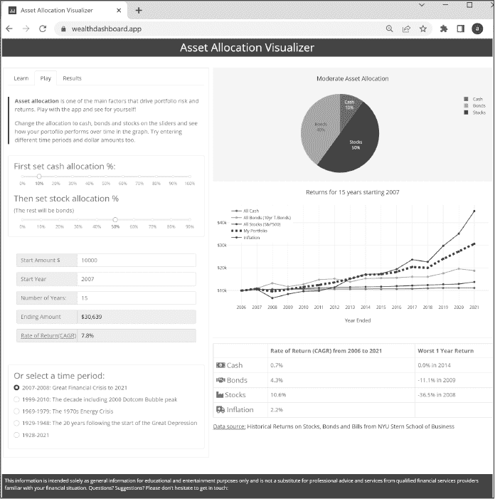

图 6-1：资产配置可视化应用的截图

你会发现这个应用包含了比我们之前的 Dash 应用更多的元素。试着使用这个应用，看看它是如何运作的。输入不同的数字到输入框中，移动滑块选择不同的资产配置。看看如果你把所有的钱都投入现金、股票、债券或它们的各种组合，投资回报会是多少。使用单选按钮选择不同的时间段，看看如果你在互联网泡沫的高峰期或大萧条的低谷开始投资，你的投资组合会有怎样的表现。

注意观察应用中各个组件是如何互动的，以及饼图、折线图、表格和结果字段如何更新。你将在本章后面的“Dash 回调”部分学习如何实现这些功能。

此外，请注意布局设计。该应用程序的左侧有滑块、输入字段和复选框选项，右侧则以饼图、折线图和汇总表格的形式显示输出。你将在本章的“布局和样式”部分学到如何实现这一点。

### 应用程序结构

Dash 的一个显著特点是，使用极少的代码就可以轻松创建视觉交互式应用程序。本书中的前两个应用程序就是很好的示例，你可以在 Dash 教程和 Dash 企业应用程序库中看到更多示例。然而，当你开始创建自己的应用程序时，你会发现，随着你添加更多的功能和组件并构建多页面应用程序，代码容易膨胀，可能会有数百甚至上千行。本章中的应用程序大约有 700 行代码，但它仍然相对简单。

当你开始处理更大的应用程序时，你会很快理解为什么结构化应用程序如此重要。在小型应用程序中，像在布局中直接定义组件甚至在回调函数中定义组件这样的做法可能很方便，但随着功能的增加，这种方法会使得布局变得庞大，难以管理、修改和调试。

在较大的应用程序中，我们可能会将不同的部分分离到各自的文件中。在这个应用程序中，由于它仍然相对较小，我们将所有代码保持在一个文件中，但组织得当，使得相关的元素能够分组在一起。例如，我们有不同的部分分别用于图表、表格、标签页和Markdown组件。每个组件要么在一个函数中定义，要么被分配给一个变量名。由于组件是以这种方式组织的，它们成为了构建块，我们可以通过函数调用或调用变量名，在布局中随时需要时放置它们。这种组织方式还使得在其他应用程序中重用这些组件变得容易。我们还将处理数据的辅助函数，如计算投资回报率，分离到自己的部分中。由于我们对组件进行了结构化，因此能够让布局部分保持简洁，只有 30 行代码。最后一部分是应用程序的回调函数。

结构化应用程序的方式有很多种。例如，你可以将某些部分放在不同的模块中并将其导入主应用程序。对于多页面应用程序，标准做法是将每个页面放在不同的模块中。你将在第七章中看到相关示例。重要的是要有一种一致的方式来组织和结构化你的应用程序，这种方式对你来说有效，并且符合项目的需求。对于这个应用程序，考虑到它的规模并且它是一个单页面应用程序，我们更倾向于将所有内容放在一起。

### 设置项目

像往常一样，我们将从导入库文件和管理数据开始。

导入库文件

我们首先导入应用中使用的模块（清单 6-1）。这个应用中新加入的模块包括 data_table、State、callback_context 和 plotly.graph_objects。

from dash import Dash, dcc, html, dash_table, Input, Output, State, callback_context

import dash_bootstrap_components as dbc

import plotly.graph_objects as go

import pandas as pd

清单 6-1: app.py 的导入部分

我们使用 data_table 来显示结果和源数据。在我们的回调函数中使用了 State 和 callback_context，并且我们使用 Plotly Graph Objects 而不是 Plotly Express 来创建图表。我们稍后会更详细地讨论这些内容。

添加样式表

接下来，我们将添加 Bootstrap CSS 和 FontAwesome 图标作为外部样式表。在第五章中，我们已将 BOOTSTRAP 主题添加到应用中，而在这个应用中，我们使用的是 SPACELAB 主题，如下所示：

app = Dash(__name__, external_stylesheets=[dbc.themes.SPACELAB, dbc.icons.FONT_AWESOME])

SPACELAB 主题为我们提供了页面元素的字体、配色方案、形状和大小，这些内容在图 6-1 中可以看到。

FontAwesome 库拥有丰富的图标集合，有助于让应用程序更具吸引力。图 6-2 展示了我们在应用中使用的 FontAwesome 图标。

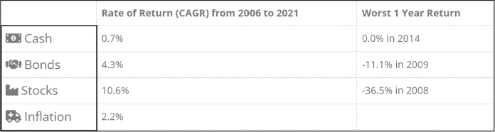

图 6-2: 我们在应用中使用的 FontAwesome 图标

Dash Bootstrap 组件库包含了一个模块，提供了 FontAwesome 和 Bootstrap 图标的 URL 以及各种 Bootstrap 主题的 URL。这使得将它们添加到应用中变得更加简单。例如，你可以指定主题为 dbc.themes.SPACELAB，而不是[*https://<wbr>cdn<wbr>.jsdelivr<wbr>.net<wbr>/npm<wbr>/bootswatch@5<wbr>.1<wbr>.3<wbr>/dist<wbr>/spacelab<wbr>/bootstrap<wbr>.min<wbr>.css*](https://cdn.jsdelivr.net/npm/bootswatch@5.1.3/dist/spacelab/bootstrap.min.css)。

数据管理

该应用程序的数据来源于 Aswath Damodaran 教授，他在纽约大学斯特恩商学院教授企业财务和估值课程。数据包括三个资产类别的回报——现金、债券和股票——分别由三个月期的美国国库券、十年期的美国国债和标准普尔 500 指数代表。你可以在 [*http://<wbr>people<wbr>.stern<wbr>.nyu<wbr>.edu<wbr>/adamodar<wbr>/New<wbr>_Home<wbr>_Page<wbr>/data<wbr>.xhtml*](http://people.stern.nyu.edu/adamodar/New_Home_Page/data.xhtml) 了解更多关于这些数据的信息。

我们已下载数据并将其保存为名为 *historic.csv* 的 Excel 表格，保存在 *assets* 文件夹中。这里我们在应用程序中包含了这些数据：

df = pd.read_csv("assets/historic.csv")

接下来，我们采取一些步骤，使应用程序在长期内更易于维护。首先，我们将数据系列的开始和结束年份设置为全局变量，因为我们在应用程序的多个地方使用这些日期。现在，当我们每年用新数据更新应用程序时，就不需要修改代码中的新日期：

MAX_YR = df.Year.max()

MIN_YR = df.Year.min()

START_YR = 2007

START_YR 是应用程序首次运行时投资周期的默认起始年份。与其在应用程序的多个地方硬编码“2007”，我们使用这个全局变量。如果你决定更改起始年份，只需在这一行代码中修改即可。

我们还将颜色设置为全局变量。我们在图表中为股票、债券和现金使用自定义颜色，这些颜色与我们的 Bootstrap 主题相匹配。如果你想切换到其他 Bootstrap 主题，你可以通过更改 COLORS 字典中的颜色值来更新图表颜色，颜色会在整个应用程序中更新：

COLORS = {

   "cash": "#3cb521",

   "bonds": "#fd7e14",

   "stocks": "#446e9b",

   "inflation": "#cd0200",

   "background": "whitesmoke",

}

使用这个字典还可以使代码更具可读性和自文档性，因为你可以像这样指定颜色：

COLORS["stocks"]

而不是像这样：

"#446e9b"

### 布局和样式

在这一部分，我们将所有组件和图形分离出来进行模块化，以便可以将它们添加到布局的任何位置，正如章节开头所提到的那样。主要布局仅包含约 30 行代码，而应用程序总共有 700 行代码。为了保持简洁，我们在应用的其他部分定义组件和图形，并为它们赋予可调用的变量名，方便在布局部分调用。以这种方式构建布局可以清晰化应用结构，并简化设计变更。

第 6-2 节展示了 app.layout 代码，用于定义主要布局。

app.layout = dbc.Container(

   [

      ❶ dbc.Row(

           dbc.Col(

              html.H2(

                 "资产配置可视化工具",

                 className="text-center bg-primary text-white p-2",

              ),

           )

         ),

      ❷ dbc.Row(

           [

              dbc.Col(tabs, width=12, lg=5, className="mt-4 border"),

              dbc.Col(

                 [

                    dcc.Graph(id="allocation_pie_chart", className="mb-2"),

                    dcc.Graph(id="returns_chart", className="pb-4"),

                    html.Hr(),

                    html.Div(id="summary_table"),

                    html.H6(datasource_text, className="my-2"),

                 ],

                 width=12,

                 lg=7,

                 className="pt-4",

              ),

           ],

           className="ms-1",

     ),

     dbc.Row(dbc.Col(footer)),

   ],

   ❸ fluid=True,

)

清单 6-2：布局代码

整个应用程序的内容被包裹在一个 dbc.Container 中，这是 Bootstrap 中最基本的布局元素，使用行和列网格系统时是必需的。

布局的第一行❶定义了蓝色的头部栏，如图 6-3 所示，该栏被定义为一个包含单列的 Bootstrap 行，该列跨越整个屏幕宽度。

图 6-3：资产配置可视化器应用的头部栏

我们使用 Bootstrap 实用类来样式化头部。我们使用 text-center 来使文本居中，bg-primary 设置背景为 SPACELAB 主题的主色，text-white 设置文本颜色，p-2 添加内边距。要查看所有可用于样式化应用程序的 Bootstrap 实用类，请参阅 Dash Bootstrap 备忘单，链接为[*https://<wbr>dashcheatsheet<wbr>.pythonanywhere<wbr>.com*](https://dashcheatsheet.pythonanywhere.com)。

第二行❷有两列，包含应用程序的主要内容，如图 6-4 所示。左侧列包含用户输入控制面板选项卡，右侧列包含主要输出，即饼图、折线图和汇总表格的可视化效果。这一行有很多信息。如果屏幕是静态的，视图者在小屏幕上查看时需要放大并进行大量滚动才能看到完整信息。好消息是，Bootstrap 可以轻松地使我们的应用程序响应设备的大小。我们只需设置小于平板大小的屏幕一次只显示一列，而较大的屏幕则显示两列并排显示。

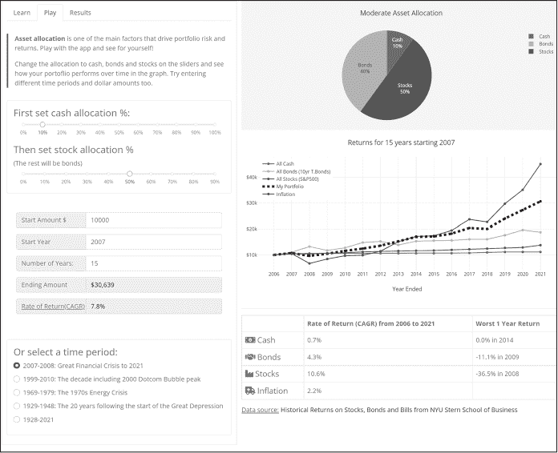

图 6-4：生成应用程序的主要内容

由于 Bootstrap 的行有 12 列，我们通过将宽度设置为 12 来使行跨越整个屏幕。然后，在大屏幕上，我们将第一列的宽度设置为 5，第二列的宽度设置为 7，使它们并排显示。以下是一个简化的示例：

dbc.Row(

   [

      dbc.Col("列 1", width=12, lg=5),

      dbc.Col("列 2", width=12, lg=7)

   ]

)

在底部我们放置页脚，如图 6-5 所示。为了保持一致性，它的样式与头部相同。网站的页脚位于每个页面的底部，通常包括次要信息，如联系信息、法律声明和网站地图。

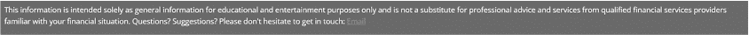

图 6-5：应用程序的页脚

最后，我们设置了属性 fluid=True ❸。这使得内容跨越整个*视口*的宽度，视口是用户在网页上可见的区域，并且会随着设备的不同而变化。在手机和平板电脑上，视口比在计算机屏幕上要小，因此设置 fluid=True 使应用程序具有响应式设计，可以适应这种差异。稍后会进一步讨论这个话题。至此，主要布局部分就完成了！

### 组件

现在我们将更详细地描述如何定义我们添加到布局中的每个组件。你会注意到应用程序有不同的*标签*，它们定义了不同的内容窗格，例如教程（“学习”标签）、应用程序控制（“播放”标签）和数据（“结果”标签）。如果你在标签之间切换，你会看到只有第一列的内容发生变化；第二列显示的是图表和摘要表，当你只是切换标签时，它始终保持不变。

“播放”标签是最忙碌的，我们将详细查看以下每个元素：

+   dcc.Markdown 用于格式化和显示简介文本

+   dbc.Card 和 dcc.Slider 组件用于设置资产分配百分比

+   dbc.Input、dbc.InputGroup 和 dbc.InputGroupText 用于创建输入数字数据的表单

+   dbc.Tooltip用于悬停显示附加数据

在“Results”标签中，我们使用DataTable来显示源数据和可视化结果。

标签

在 Dash 中，Tabs组件提供了一种方便的方式将内容分隔到不同的面板中。用户可以点击标签查看相应的面板，最棒的是，组件会自动为我们处理这种导航。我们需要做的就是定义每个标签内的内容。图 6-6 展示了我们应用程序中的标签。

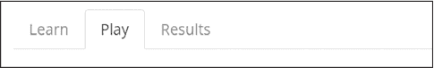

图 6-6：资产配置可视化器标签

“Learn”标签包含一些文本。“Play”标签是应用程序的主要控制面板，允许用户输入他们的选择。“Results”标签包含包含投资组合年回报和源数据的表格。这些数据在第二列中进行了可视化。

在app.layout中，我们通过简单地在第二行的第一列中包含变量名tabs来包含这些标签：

--省略--

   dbc.Row(

      

        dbc.Col(tabs, width=12, lg=5, className="mt-4 border"),

--省略--

我们定义了如[清单 6-3 所示的tab。

tabs = dbc.Tabs(

   [

      dbc.Tab(learn_card, tab_id="tab1", label="Learn"),

   ❶  dbc.Tab(

             [asset_allocation_text, slider_card, input_groups,

             time_period_card],

             tab_id="tab-2",

             label="Play",

             className="pb-4",

      ),

      dbc.Tab([results_card, data_source_card],

             tab_id="tab-3", label="结果"),

   ],

   id="tabs",

   ❷  active_tab="tab-2",

)

清单 6-3：定义标签

我们使用 dbc.Tabs 组件创建一个 tabs 容器，包含三个独立的 Tab 面板。我们为每个 dbc.Tab 提供要显示的内容、ID 和屏幕上显示的标签。请看第二个 dbc.Tab ❶，也就是图 6-7 中展示的播放标签，你会看到 children 属性包含一个变量名列表，这些变量对应着我们在代码的组件部分单独定义的组件。asset_allocation_text 包含了介绍文本。slider_card 包含两个 dcc.Slider，用户可以通过它们设置现金、股票和债券之间的分配百分比。input_groups 定义了输入区域，用于输入所有用户数据：起始金额、年份和起始年份。我们使用这些输入来计算投资回报。time_period_card 允许用户选择一些有趣的历史时期，比如互联网泡沫或大萧条。

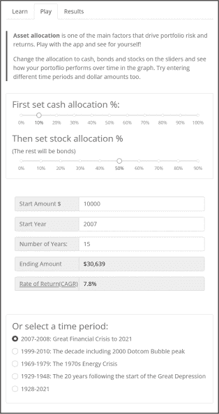

图 6-7：播放标签的完整内容

现在尝试将 asset_allocation_text 变量名移动到列表中的最后一项。当你运行带有这个更改的应用时，你会看到介绍文本被移到标签屏幕的底部。这展示了使用这种结构化应用的技巧时，进行设计更改是多么简单。在下一节中，我们将更详细地讨论每个部分是如何定义的。

active_tab 属性 ❷ 指定了应用启动时要显示的默认标签页。通过将其设置为 2，我们确保应用始终在“播放”标签页打开。

卡片容器与滑块

Bootstrap dbc.Card 是一个方便的容器，用于存放相关内容。它通常是一个带有内边距的边框框，具有标题、页脚和其他内容的选项。我们还可以使用 Bootstrap 实用类来轻松地为卡片添加样式和定位。

我们在应用中多个地方使用了dbc.Card，但我们将仅检查图 6-8 中显示的卡片代码作为示例。

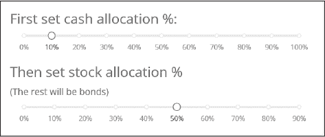

图 6-8：一个示例 dbc.Card

列表 6-4 显示了图 6-6 中显示的 Card 组件代码。

slider_card = dbc.Card(

   [

      html.H4("首先设置现金分配百分比：", className="card-title"),

      dcc.Slider(

         id="cash",

         marks={i: f"{i}%" for i in range(0, 101, 10)},

         min=0,

         max=100,

         step=5,

         value=10,

         included=False,

      ),

      html.H4("然后设置股票分配百分比", className="card-title mt-3",),

      html.Div("(其余将是债券)", className="card-title"),

      dcc.Slider(

         id="stock_bond",

         marks={i: f"{i}%" for i in range(0, 91, 10)},

         min=0,

         max=90,

         step=5,

         value=50,

         included=False,

      ),

   ],

   body=True,

   className="mt-4",

)

清单 6-4: 分配滑块卡片

对于滑块标签，我们使用 Dash 组件 html.H4 设置一个 4 级标题，并使用 Bootstrap 类 card-title 来为所选主题设置一致的间距。

dcc.Slider 是 Dash 核心组件。在 第五章中，我们看到了 dcc.RangeSlider，它允许用户选择一个范围的起始值和结束值。dcc.Slider 类似，但只允许选择一个单一的值。我们给滑块指定一个 id，以便在回调中引用，并为 marks、min、max、step 和 value 设置初始值，这些值将用于选择滑块上的值。这些就是你在应用启动时看到的默认值。

included 属性设置滑块轨道的样式。默认情况下，滑块手柄前面的滑轨部分会被高亮显示。然而，在我们的应用中，我们指定了一个离散值，因此合理的做法是只高亮显示该值，而不是一个范围。我们通过将 included=False 来实现这一点。

在应用程序中查找其他卡片，你会看到它们以类似的方式构建，但包含不同的组件，例如 dbc.RadioItems、dbc.InputGroup 和 dcc.Markdown。

输入容器

dbc.Input 组件处理用户输入，而 dbc.InputGroup 是一个容器，通过增加更多功能来增强 dbc.Input，例如图标、文本、按钮和下拉菜单。

图 6-9 展示了我们如何在应用程序中使用 dbc.InputGroup 创建一个表单，变量名为 input_groups。

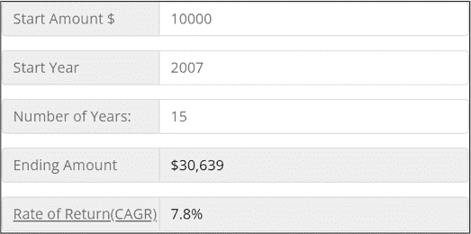

图 6-9：输入表单

每一行是一个 dbc.InputGroup 项目，所以这里我们将五个项目放在一个容器中。在这种情况下，我们不是使用 Card 作为容器，而是使用 html.Div 容器，简单的原因是它默认没有边框和内边距。以下是包含的 Div：

input_groups = html.Div(

   [start_amount, start_year, number_of_years, end_amount, rate_of_return],

   className="mt-4 p-4",

)

我们将每个 InputGroup 项目单独定义并添加到 html.Div 容器中。每个项目都非常相似，所以我们只需详细查看其中几个。这里我们定义了第二个项目，即“开始年份”：

start_year = dbc.InputGroup(

   [

      dbc.InputGroupText("开始年份"),

      dbc.Input(

         id="start_yr",

         placeholder=f"最小 {MIN_YR}  最大 {MAX_YR}",

         type="number",

         min=MIN_YR,

         max=MAX_YR,

         value=START_YR,

      ),

   ],

   className="mb-3",

)

你可以使用 dbc.InputGroupText 组件在输入字段的前后或两侧添加文本。这使得表单看起来更加美观。例如，这里我们使用 dbc.InputGroupText("开始年份") 在 dbc.Input 前面显示文本“开始年份”。

我们设置了 min 和 max，这是 dbc.Input 的属性，用于限定有效值范围，并将 type 设置为只接受数字；这样有助于数据验证。对于 min 和 max 的值，我们使用了之前讨论过的全局变量 MIN_YR 和 MAX_YR。如果输入字段为空，placeholder 会显示有效范围的提示信息。因为我们在更新数据文件时使用了全局变量，所以当日期范围发生变化时，我们不需要对该组件做任何更改。

最后的两个 InputGroup 项目实际上并不是用于输入，而是用来显示一些结果。我们设置了 disabled=True，这样就无法输入任何内容，并且我们将背景颜色设置为灰色以区分这些项目。在回调中，我们会用投资结果更新这个字段。虽然使用输入组件作为输出字段可能显得有些奇怪，但这样做能够保持该组的一致性。再者，未来我们可能会决定允许在这里输入数据。例如，用户可以输入最终的美元金额，并查看在不同的市场条件下需要投资多少，投资多长时间，才能达到这个目标。rate_of_return 输入组的代码如下：

rate_of_return = dbc.InputGroup(

   [

      dbc.InputGroupText(

         "回报率（CAGR）",

         id="tooltip_target",

         className="text-decoration-underline",

      ),

      dbc.Input(id="cagr", disabled=True, className="text-black"),

      dbc.Tooltip(cagr_text, target="tooltip_target")

   ],

   className="mb-3",

)

工具提示

*工具提示* 是当用户将鼠标悬停在组件上时出现的文本提示，如图 6-10 所示。为了添加它们，我们使用 dbc.Tooltip 组件，并使用 Bootstrap 样式进行样式设置。你只需要指定 Tooltip 的 target id，无需回调！我们在应用中使用它来提供 CAGR 的定义，因为很多人不熟悉这个术语。前一部分末尾的代码片段展示了在 rate_of_return 输入组中的 Tooltip 的代码。

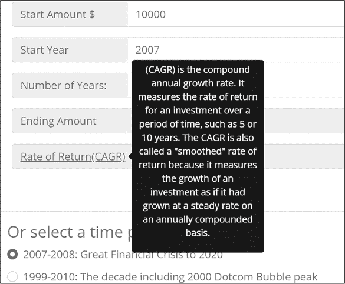

图 6-10: 工具提示示例

数据表

DataTable 是一个用于查看、编辑和探索大型数据集的交互式表格。这个应用仅使用了它的一小部分功能，因此一定要查看 Dash 文档，了解更多关于如何使用这个强大工具的示例。我们使用一个 DataTable 来展示结果标签中的 total_returns_table，如图 6-11 所示。

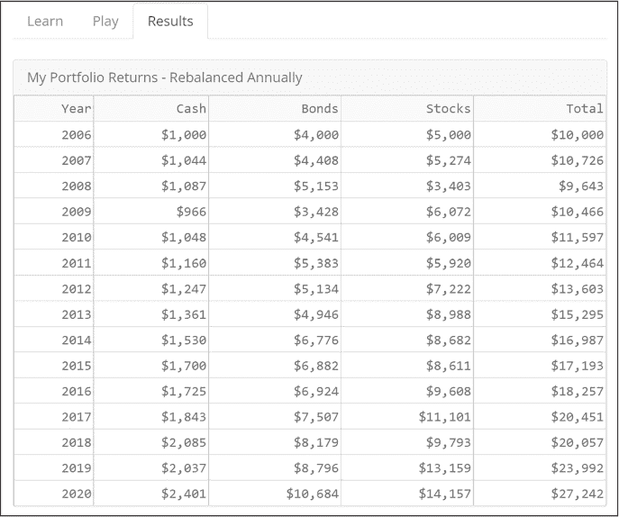

图 6-11: 完整的结果标签

列表 6-5 显示了 DataTable 的代码。

total_returns_table = dash_table.DataTable(

   id="total_returns",

   columns=[{"id": "Year", "name": "Year", "type": "text"}]

   + [

        {"id": col, "name": col, "type": "numeric", "format": {"specifier": "$,.0f"}}

        for col in ["Cash", "Bonds", "Stocks", "Total"]

   ],

   page_size=15,

   style_table={"overflowX": "scroll"},

)

列表 6-5: 图 6-11 中显示的 DataTable 代码

与我们应用中的其他元素一样，我们将DataTable分配给一个变量，以便在布局中轻松调用。

我们使用以下组件属性来定义我们的表格：

+   表格的id是"total_returns"；我们用它来在回调中标识这个组件。

+   列的id与我们的 pandas DataFrame 中的列名匹配，这是我们用来更新表格单元格数据的依据。

+   列的name是显示在列标题中的文本。

+   列的type设置数据类型为text或numeric。

+   "format": {"specifier": "$,.0f"}将单元格格式化为带有美元符号（$）和零（0）小数的形式，以便数据以整美元显示。请注意，数据的type必须是numeric，以便正确应用格式化。

+   page_size属性控制表格高度，并在表格底部添加分页按钮。我们将其设置为15，以便每页显示 15 行。style_table={"overflowX": "scroll"}语法通过在表格溢出父容器时添加滚动条来控制表格宽度。

内容表格

dbc.Table组件是用 Bootstrap 主题样式化基本 HTML 表格的好方法。当你只需要显示少量项目时，HTML 表格非常方便，并且它们可以包含其他 Dash 组件，如dcc.Graph或dbc.Button作为内容。今天使用 Dash DataTable是无法做到这一点的。

我们在应用中使用dbc.Table来显示图 6-12 中的汇总表格。这使我们能够在汇总表中包含 Dash 组件并使用 FontAwesome 图标。

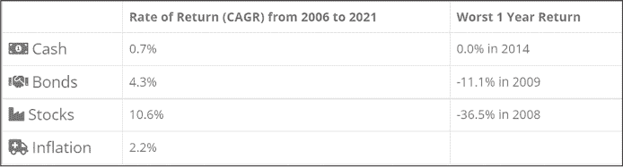

图 6-12：资产配置可视化应用中的汇总表格

清单 6-6 显示了部分代码，但大致思路是通过一个函数创建这个表格。

def make_summary_table(dff):

   # 创建一个包含表格信息的新 DataFrame

   df_table = pd.DataFrame(…)

   return dbc.Table.from_dataframe (df_table, bordered=True, hover=True)

清单 6-6：摘要表格代码的摘录

我们将在本章稍后使用这个函数。该函数的参数是根据用户输入创建的 DataFrame。然后，我们创建另一个 DataFrame，只包含我们想要在摘要表中显示的信息。我们使用 dash-bootstrap-components 的辅助函数 dbc.Table.from_dataframe() 来构建 HTML 表格。

Markdown 文本

*Markdown* 是一种用于格式化网页文本的标记语言，是添加和格式化文本（如粗体、斜体、标题、列表等）最流行的方式之一。要了解更多关于 Markdown 语法的信息，请查看教程 [*https://<wbr>commonmark<wbr>.org<wbr>/help*](https://commonmark.org/help)。

我们使用 dcc.Markdown 组件将格式化的文本添加到应用程序中。在这个应用程序中，我们用它来添加在 图 6-13 中显示的资产配置描述。Markdown 语法使用 ** 来突出显示某些文本，使用 > 来将文本格式化为引用块。

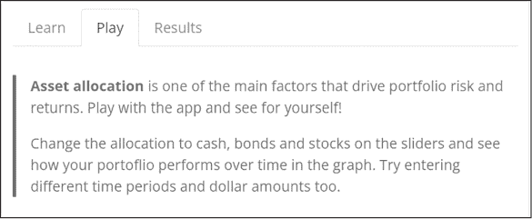

图 6-13：使用 Markdown 添加文本

以下是 Markdown 组件的代码：

asset_allocation_text = dcc.Markdown(

   " ""

> **资产配置** 是影响投资组合风险和回报的主要因素之一。玩一玩这个应用程序，亲自体验一下吧！

> 在滑块上更改现金、债券和股票的配置，看看您的投资组合如何随着时间的推移在图表中表现。

   尝试输入不同的时间段和金额。

" ""

)

我们还需要进行最后一步，使块引用在应用程序中显示出正确的样式。*blockquote* 通常是来自其他来源的扩展引用，但它也可以用来重复或突出某些内容。块引用通常会有额外的边距、内边距或其他格式，使它更突出，这也是我们在这种特定情况下选择它的原因。

Bootstrap 中块引用的默认样式是：

blockquote {

   margin: 0 0 1rem;

}

这在顶部和右侧没有设置边距，底部只有 1rem 的边距。（*rem* 是根元素的字体大小，通常为 16 像素。）这并没有使文本突出，所以我们增加了一些边距和颜色，如下所示：

blockquote {

   border-left: 4px var(--bs-primary) solid;

   padding-left: 1rem;

   margin-top: 2rem;

   margin-bottom: 2rem;

   margin-left: 0rem;

}

这为左侧添加了一个 4 像素宽的边框，并将颜色与页眉和页脚的颜色匹配。它还增加了一些额外的边距和内边距。以下是一个在使用 Bootstrap 时非常实用的 CSS 小技巧：与其使用十六进制颜色值（例如 #446e9b），不如使用 Bootstrap 的颜色名称，像这样：var(--bs-primary)。这段代码会将颜色与 Bootstrap 主题的“主要”颜色匹配。如果你更改了应用程序中的 Bootstrap 主题，这段引用框的左侧边距颜色会自动更新为该主题的主色，以保持应用程序内的一致性。

这个自定义 CSS 保存在名为 *mycss.css* 的文件中，文件位于 *assets* 文件夹里。你可以随意命名这个文件，只要它具有 *.css* 扩展名，Dash 会自动将这个自定义 CSS 包含到应用中。

### 使用 Plotly 图形对象的饼图

这是一个简要的介绍，展示了如何使用 Plotly 图形对象创建图形，Plotly 图形对象提供了比简单的 Plotly Express 更复杂的图表创建选项。该应用程序的饼图，如图 6-14 所示，会随着用户移动滑块，实时更新资产配置。

图 6-14: Plotly 饼图示例

与我们在前几章中使用 Plotly Express 制作图形不同，这里我们使用 Plotly Graph Objects。Plotly Express 预先配置了许多常用参数，方便您快速制作图表，并且代码量较少。然而，当您想进行更多自定义时，可能更倾向于使用 Plotly Graph Objects。列表 6-7 显示了创建饼图的代码。

def make_pie(slider_input, title):

   fig = go.Figure(

      data=[

         go.Pie(❶

            labels=["现金", "债券", "股票"],

            values=slider_input,

            textinfo="label+percent",

            textposition="inside",

            marker={"colors": [COLORS["cash"], COLORS["bonds"], COLORS["stocks"]]}, ❷

            sort=False, ❸

            hoverinfo="none",

         )

      ]

   )

   fig.update_layout(

      title_text=title,

      title_x=0.5,

   margin=dict(b=25, t=75, l=35, r=25),

      height=325,

      paper_bgcolor=COLORS["background"],

   )

   return fig

第 6-7 节：创建 Plotly Graph Objects 饼图

为了创建我们的饼图，我们首先使用fig = go.Figure来创建一个图形实例。这里的Figure语法指的是在<`samp class="SANS_TheSansMonoCd_W5Regular_11">plotly.graph_objects模块中定义的主要类之一（通常导入为go），表示整个图形。我们使用这个类，因为它的实例内置了许多方便的操作方法，包括.update.layout()和.add.trace()。实际上，Plotly Express 函数使用图形对象，并返回一个plotly.graph_objects.Figure实例。

Plotly Graph Objects 中的饼图对象是go.Pie ❶，它使我们可以轻松为每个分段设置自定义颜色。请注意，这里我们使用的是COLORS字典作为全局变量 ❷，而不是直接为marker设置颜色。这意味着如果我们之后决定更改颜色，只需更新COLORS字典中的代码，而不必修改图形中的代码。在我们的应用中，我们希望每个资产的颜色保持不变，即使其值发生变化。我们通过设置sort=False ❸来实现这一点。（默认值是True，会按降序排列值，因此最大值将始终具有相同的颜色。）

和第 6-6 节中的表格一样，我们在一个函数中创建这个饼图，以便可以在回调中更新它。输入参数是滑块的值和标题。

### 使用 Plotly Graph Objects 的折线图

我们将再次使用 Plotly Graph Objects 来创建我们的折线图，这样可以为每个轨迹定制颜色和标记——而使用 Plotly Express 则会显得非常冗长。

同样，我们在一个函数中创建折线图，并将一个 DataFrame 作为参数输入。这个 DataFrame 是基于用户选择的数据：资产配置、时间段、起始金额和年份数。稍后你将在本章的回调部分学习如何创建这个 DataFrame。图 6-15 展示了折线图。

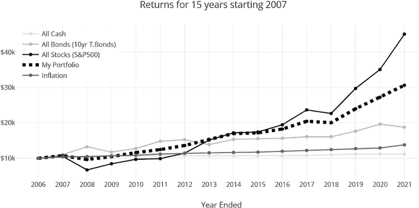

图 6-15：Plotly 折线图示例

列表 6-8 给出了折线图的代码。

def make_line_chart(dff):

   start = dff.loc[1, "Year"]

   yrs = dff["Year"].size - 1

   dtick = 1 if yrs < 16 else 2 if yrs in range(16, 30) else 5

   fig = go.Figure() ❶

   fig.add_trace(

      go.Scatter(

        x=dff["Year"],

        y=dff["all_cash"],

        name="All Cash",

        marker_color=COLORS["cash"],

      )

   )

   fig.add_trace(

      go.Scatter(

        x=dff["Year"],

        y=dff["all_bonds"],

        name="All Bonds (10yr T.Bonds)",

        marker_color=COLORS["bonds"],

      )

   )

   # 为简洁起见，"All Stocks"、"My Portfolio" 和 "Inflation" 的数据被省略

   fig.update_layout(

      title=f"Returns for {yrs} years starting {start}",

      template="none",

      showlegend=True,

      legend=dict(x=0.01, y=0.99),

      height=400,

      margin=dict(l=40, r=10, t=60, b=55),

      yaxis=dict(tickprefix="$", fixedrange=True),

      xaxis=dict(title="年度结束", fixedrange=True, dtick=dtick),

   )

   return fig

清单 6-8：创建 Plotly Graph Objects 线图

通过使用 graph_objects，我们可以轻松地自定义每个轨迹（在此情况下为线条）。我们从使用 fig=go.Figure() ❶ 创建图形开始，然后使用 fig.add_trace() 分别将每个轨迹添加到图表中。对于这个函数，x 和 y 属性是图形的 x 轴和 y 轴数据。每个轨迹的 x 数据是 Years，它来自 DataFrame 的 Year 列。y 数据包含在 DataFrame 的相应列中。例如，“All Cash” 线的数据在 DataFrame 列 dff["all_cash"] 中。name 属性将在图例和悬停时显示。marker_color 属性设置每个轨迹的颜色。还有许多其他用于自定义轨迹的属性，可以在 Plotly 文档中查看。

我们使用 fig.update_layout() 方法自定义图形中非数据部分的位置和配置，例如设置标题、高度和边距。yaxis 和 xaxis 属性需要更多解释：

+   tickprefix=$ 为 y 轴的标签添加美元符号。

+   fixedrange=True 禁用 x 轴和 y 轴的缩放。这可以防止在触摸屏上不小心缩放；当你试图滚动页面却意外放大图形时，这种行为会让人很烦。

+   dtict=dict 用于设置 x 轴标签之间的步长。你可以看到，当用户选择不同的时间段时，标签如何变化。我们这样计算：

dtick = 1 if yrs < 16 else 2 if yrs in range(16, 30) else 5

### Dash 回调

接下来是有趣的部分。回调使得应用程序变得互动。每当输入组件的属性发生变化时，回调函数会自动被调用。我们将从一个简单的回调开始，该回调根据两个滑块的值更新饼图。

接下来我们将展示如何使用 State 获取数据，而不触发回调。

然后我们将讨论一个回调，通过使用相同的参数作为输入和输出来同步组件。

最后，我们将展示一个包含多个输入和输出的回调，并展示如何在回调中使用函数，使得大型回调更加易于管理。

交互式图形

让我们从更新饼图的回调开始。这里是定义：

@app.callback(

   Output("allocation_pie_chart", "figure"),

   Input("stock_bond", "value"),

   Input("cash", "value"),

)

首先是回调的 Output，它通过更新 dcc.Graph 的 figure 属性来更新饼图。你可以在 app.layout 中找到这个 dcc.Graph：

dcc.Graph(id="allocation_pie_chart", className="mb-2")

然后我们定义回调的输入，这些输入包括滑块的 id "stock_bond" 的值属性和滑块的 id "cash" 的值属性。

接下来是回调函数，如清单 6-9 所示。

def update_pie(stocks, cash):

   bonds = 100 - stocks - cash

   slider_input = [cash, bonds, stocks]

   if stocks >= 70:

      investment_style = "激进型"

   elif stocks <= 30:

      investment_style = "保守型"

   else:

      investment_style = "中等风险"

   figure = make_pie(slider_input, investment_style + " 资产配置")

   return figure

清单 6-9：update_pie() 回调函数

我们首先根据用户在滑块上选择的现金和股票比例，计算债券的百分比，使用公式 bonds = 100 – stocks – cash。

接下来，我们更新饼图的标题文本。我们的经验法则是，股票占比超过 70% 的投资组合为“激进型”投资风格，股票占比低于 30% 的投资组合为“保守型”，其他则为“中等风险”型。这个标题会随着用户移动滑块而动态更新。我们将这个标题作为属性传递给 make_pie() 函数。

最后，我们通过调用我们在清单 6-7 中定义的 make_pie() 函数来创建图表。通过使用函数来创建图表，我们减少了回调函数中的代码量，并且可以在其他回调中重复使用该函数。结果是，代码更加可读和易于维护。

现在，你可以回到应用程序，查看移动滑块是如何更新饼图的，并了解这一过程是如何实现的。

使用状态的回调函数

第二个回调通过单向同步将两个滑块同步：一个滑块用来更新另一个滑块的值。"cash" 滑块会更新 "stock_bond" 滑块，但 "stock_bond" 滑块不会更新 "cash" 滑块。在用户选择了 "cash" 滑块上的现金分配后，我们更新 "stock_bond" 滑块组件：

@app.callback(

   Output("stock_bond", "max"),

   Output("stock_bond", "marks"),

   Output("stock_bond", "value"),

   Input("cash", "value"),

❶  State("stock_bond", "value"),

 )

❷  def update_stock_slider(cash, initial_stock_value):

   max_slider = 100 - int(cash)

   stocks = min(max_slider, initial_stock_value)

   # 格式化滑块刻度

   if max_slider > 50:

      marks_slider = {i: f"{i}%" for i in range(0, max_slider + 1, 10)}

   elif max_slider <= 15:

      marks_slider = {i: f"{i}%" for i in range(0, max_slider + 1, 1)}

   else:

      marks_slider = {i: f"{i}%" for i in range(0, max_slider + 1, 5)}

   return max_slider, marks_slider, stocks

我们在函数定义中使用了State ❶，因为我们需要知道当前滑块的输入值，以便计算新的输出值。State 不会触发回调；它的作用是提供回调触发时该属性的当前值（即状态）。

在❷处我们开始回调函数。当用户选择现金分配时，我们会调整可以分配给股票或债券的金额。例如，如果用户将现金更改为 20％，股票的最大比例为 80％，因此我们需要将"stock_bond"滑块的值从当前值更新为新的最大值 80％。

我们还通过更新标记来更新滑块上的刻度。请注意，股票分配百分比滑块的刻度在图 6-16 的上半部分按十进制递增，而在下半部分按单个数字递增。

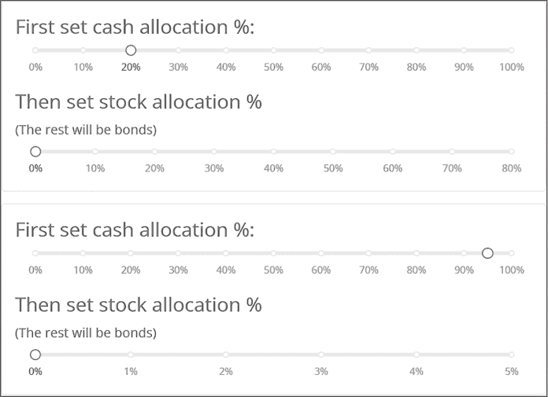

图 6-16：更新前（上）和更新后（下）的现金和股票分配滑块

我们根据滑块的最大值计算滑块的标记。例如，在底部的一组滑块中，现金分配为 95％，因此股票分配的最大值为 5％。这意味着max_slider的值在创建滑块标记的函数中为5：

marks_slider = {i: f"{i}%" for i in range(0, max_slider + 1)}

这比以下写法更简洁：

marks_slider={

      0: '0%',

      1: '1%',

      2: '2%',

      3: '3%',

      4: '4%',

      5: '5%'

   },

现在你可以返回应用程序，查看如何移动"cash"滑块更新"max"、"marks"和"value"，同时更新"stock_bond"滑块。

循环回调与同步组件

Dash 还允许组件的双向同步。例如，如果你希望用户能够通过输入框输入一个数字*或者*通过移动滑块来设置某个值，就需要确保这两个值匹配。在这种情况下，滑块更新输入框，输入框也会更新滑块。这就是一个*循环回调*的例子。

我们在应用程序中使用循环回调来同步控制面板中的某些组件。回想一下，用户可以在输入框中输入起始年份和年数来计算投资回报，但也可以从列表中选择某个有趣的时间段，如大萧条。这个回调函数可以保持这三个输入同步。当你从列表中选择大萧条时，它会将输入框中的起始年份更改为 1929 年，并将计划时长更改为 20 年，以突出显示股票恢复所需的时间。如果用户随后在输入框中输入 2010 年，这就不再是大萧条时期，因此该单选按钮会被取消选中。

现在让我们更详细地查看这个回调函数：

@app.callback(

   Output("planning_time", "value"),

   Output("start_yr", "value"),

   Output("time_period", "value"),

   Input("planning_time", "value"),

   Input("start_yr", "value"),

   Input("time_period", "value"),

)

请注意，在 @app.callback 装饰器函数下，三个输出与三个输入完全相同。这使得同步这三个组件的值成为可能。清单 6-10 展示了回调函数。

def update_time_period(planning_time, start_yr, period_number):

   " ""同步输入和选择的时间段" ""

❶ ctx = callback_context

❷ input_id = ctx.triggered[0]["prop_id"].split(".")[0]

   if input_id == "time_period":

      planning_time = time_period_data[period_number]["planning_time"]

      start_yr = time_period_data[period_number]["start_yr"]

   if input_id in ["planning_time", "start_yr"]:

      period_number = None

   return planning_time, start_yr, period_number

清单 6-10：用于同步的回调函数

为了正确更新输出，回调必须知道是哪个输入触发了回调，我们可以使用另一个高级回调功能来查找：callback_context ❶。这是一个只在 Dash 回调内可用的全局变量。callback_context 的一个属性叫做 triggered，它是一个已更改属性的列表。我们解析这个列表以查找触发输入的 id ❷。

接下来，我们使用 input_id 来更新不同的内容，具体取决于哪个输入触发了回调。如果是用户选择了时间周期触发的，我们会更新年和规划时间的输入框。如果是用户在输入框中输入内容触发的，我们会取消选择时间周期单选按钮。这保持了 UI 的同步。

请注意，为了实现像这样的同步组件，必须将输入和输出放在同一个回调中，接下来我们将讨论这一点。

具有多个输入和多个输出的回调

Dash 当前的一个限制是，它不允许多个回调更新相同的输出。当前唯一可行的解决方案是将所有更新输出的输入包含在同一个回调中。这样做的缺点是回调可能变得庞大而复杂，这可能使得它们难以理解、维护和调试。应对这一问题的策略是为回调中的每个过程创建独立的函数。你可以在 列表 6-11 的回调中看到这一做法的示例。

这个回调是应用程序的核心。每当滑块或输入框中的任何输入发生变化时，都会触发这个回调，更新总回报表格、折线图、摘要表格、期末金额和回报率。哇。如果我们将所有这些代码都包含在这个回调中，它将有数百行长。而现在，它只有 15 行（不包括注释和空白）。我们之所以能做到这么简洁，是因为我们创建并调用了处理特定变化的函数。列表 6-11 显示了完整的回调。

@app.callback(

   Output("total_returns", "data"),

   Output("returns_chart", "figure"),

   Output("summary_table", "children"),

   Output("ending_amount", "value"),

   Output("cagr", "value"),

   Input("stock_bond", "value"),

   Input("cash", "value"),

   Input("starting_amount", "value"),

   Input("planning_time", "value"),

   Input("start_yr", "value"),

)

def update_totals(stocks, cash, start_bal, planning_time, start_yr):

   # 设置无效输入的默认值

   start_bal = 10 if start_bal is None else start_bal

   planning_time = 1 if planning_time is None else planning_time

   start_yr = MIN_YR if start_yr is None else int(start_yr)

   # 计算有效的计划时间起始年份

   max_time = MAX_YR + 1 - start_yr

   planning_time = min(max_time, planning_time)

   if start_yr + planning_time > MAX_YR:

      start_yr = min(df.iloc[-planning_time, 0], MAX_YR) # 0 是年份列

   # 创建投资回报数据框

   dff = backtest(stocks, cash, start_bal, planning_time, start_yr)

   # 为数据表创建数据

   data = dff.to_dict("records")

   fig = make_line_chart(dff) ❶

   summary_table = make_summary_table(dff) ❷

   # 格式化期末余额

   ending_amount = f"${dff['Total'].iloc[-1]:0,.0f}"

   # 计算年复合增长率（CAGR）

   ending_cagr = cagr(dff["Total"])

   return data, fig, summary_table, ending_amount, ending_cagr

清单 6-11：更新多个输出的完整回调函数

❶ 和 ❷ 这两行是我们在本章前面“使用 Plotly 图形对象绘制折线图”和“内容表格”部分中提到的两个函数的例子。第一个函数绘制折线图，第二个函数生成总结表格。我们使用这两个函数 backtest() 和 cagr() 来计算投资回报。尽管本章未对这两个函数做详细讨论，但你可以在 GitHub 上的代码中的辅助函数部分看到它们。

### 总结

我们将通过总结构建大型应用的策略来结束本章内容：

+   使用全局变量存储常量应用数据，例如主题应用颜色和启动默认值。

+   为组件分配变量名，以便在布局中更容易调用。这也意味着我们可以像积木一样在其他应用中重用这些组件。

+   组织代码，保持相似的元素在一起；例如，将视觉元素（如表格、图表和输入框）分成独立的部分。

+   使用函数将逻辑打包，使代码更容易阅读和理解。这在回调函数中处理多个输入和输出时尤其有用。

在开发大型应用或为现有应用添加新功能时，首先创建一个独立的最小工作示例会很有帮助。这个小版本更容易调试，因为你不必在成百上千行的代码中搜索错误源。

在下一章，你将学习更多构建应用的技巧，例如使用多个文件和可重用组件。
