## <samp class="SANS_Futura_Std_Bold_Condensed_B_11">7</samp> <samp class="SANS_Dogma_OT_Bold_B_11">探索机器学习</samp>

本章解释了如何使用 Dash 直观地探索和展示机器学习模型及分类算法的内部。例如，假设你创建了一个自驾车的机器学习模型，该模型将物体分类为人类、植物和其他汽车，你需要向其他程序员和非技术管理人员解释你的模型是如何工作的以及为什么有效。仪表盘应用程序可以帮助你以快速、令人信服且视觉上吸引人的方式做到这一点。

本章特别从支持向量机（SVM）这一流行的机器学习分类算法的概念介绍开始。SVM 提供了一种通过告诉我们如何准确地划分数据，从而将数据放置到正确类别中的方式。我们将在仪表盘应用程序中使用各种图表和图形来可视化 SVM 的工作原理。

接下来，我们将使用强大的 NumPy 库进行数值计算，并利用 scikit-learn 提供的易用机器学习算法。最重要的是，你将体验到使用这个图库作为基础，深入探索专业人士编写的更高级仪表盘应用程序的巨大好处。

本章还介绍了*包装函数*，这是 Dash 中用于创建自定义、可重用组件的新概念，提供了比预定义的 Dash 和 HTML 组件更多的选择。你还将学习一些新的 Dash 标准组件，如轮廓图和图形，并且我们将介绍 Dash 的*加载指示器*，它在特定仪表盘组件加载时向用户提供视觉反馈。加载指示器对于那些因为计算负载较重而加载缓慢的复杂仪表盘应用程序非常有用。

<samp class="SANS_Dogma_OT_Bold_B_15">注意</samp>

*本章的目的是为你提供 Dash 可以实现的概述，并帮助你发展更多的技能。我们不会在任何一个主题上深入探讨。我们的目标是提供信息，而不是全面覆盖，因此，如果某个内容特别引起你的兴趣，我们建议你查看 Charming Data YouTube 频道以及本书配套网站上的补充材料：* [`learnplotlydash.com`](https://learnplotlydash.com)。

### <samp class="SANS_Futura_Std_Bold_B_11">仪表盘应用程序使机器学习模型</samp> <samp class="SANS_Futura_Std_Bold_B_11">更直观</samp>

随着机器学习在计算机科学和我们日常生活中变得越来越普及，理解计算机如何得出结论变得愈发重要。机器可以在国际象棋和围棋中战胜人类棋王，减少许多交通场景中的事故发生率，并在工厂环境中生产比人工更多的商品。当谈到可量化的表现时，机器往往能够证明它们的优越性，甚至能说服最激烈的批评者，认为它们的力量能够解放人类劳动力。

然而，仅仅通过机器的表现指标来观察其有效性可能是危险的。我们无法知道机器在无法从数据集学习到的极端情况中会如何表现；数据驱动的方法总是会偏向于过去的经验。如果一台机器在 100 年的股市历史中没有观察到 95%的股市崩盘，它很可能不会在其模型中考虑到这种情况，但这种情况在未来某天很可能会发生。

为了降低这种风险，组织必须更好地理解机器“智能”的来源。它们的假设是什么？它们是基于什么做出结论的？在面对极端输入时，它们的行为会如何变化？1960 年代的机器学习模型无疑会把负利率视为“极端”甚至是“不可行”的。今天我们知道得更清楚了。

这引出了机器学习仪表盘的动机。仪表盘是一个强大的工具，可以可视化机器内部发生的事情。你可以训练一个模型，并观察它在输入变化时的表现。你可以测试极端情况。你可以查看内部机制，并通过对过去数据的过拟合来评估潜在风险。

可视化机器学习模型可以让你*展示*你的模型给客户，让他们能够调整输入参数，从而建立起对模型的信任，这是在命令行模型中永远无法实现的。仪表盘帮助让机器的智能变得可触摸。

<samp class="SANS_Futura_Std_Bold_Condensed_Oblique_I_11">分类：简短指南</samp>

你不需要深入理解分类或支持向量机（SVM）就能跟随本章中的应用。我们会为那些有兴趣的读者提供一些详细的解释，但如果你想跳过这一部分以及后面的 SVM 部分，完全可以这样做，并把 SVM 算法当作一个黑箱，继续阅读后面的内容。

还在吗？好吧，让我们深入了解机器学习中的分类问题的基础知识。

通常，分类问题试图根据一组提供的标注（已分类）训练数据中的学习，给输入数据分配一个类别（即类别标签）。例如，如果我们想根据训练数据预测学生可能会在大学学习的专业，我们可能会测量每个学生在学校的创造性和逻辑思维能力。目标是创建一个分类算法，从特征（创造性与逻辑思维能力的对比）中预测标签——即学生预测的专业。

支持向量机（SVM），例如在此仪表盘应用中可视化的那种，是*分类*算法。分类算法接受一组数据，并根据从训练数据中学到的模型，为每个数据点分配一个标签，表示该数据点所属的特定类别。更具体地说，分类算法将寻找一个*决策边界*，将数据划分为两个或更多类别。线性支持向量机将决策边界建模为*n*维空间中的*(n – 1)*维平面，从而将数据点分为两类。决策边界一侧的所有数据点属于一个类别，而另一侧的所有数据点属于另一个类别。因此，假设你能在*n*维空间中表示所有数据点，并且你有一个*(n – 1)*维决策边界，你可以使用该决策边界来对新数据进行分类，因为任何新数据点都会落在决策边界的某一侧。粗略地说，分类的目标就是识别一个决策边界，将训练数据和测试数据有效地分开。

图 7-1 给出了一个例子，灵感来源于但稍作修改的*Python One-Liners*，作者是 Christian Mayer（No Starch Press，2020）。

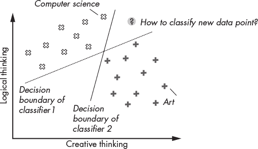

<samp class="SANS_Futura_Std_Book_Oblique_I_11">图 7-1：示例分类问题：不同的决策边界会导致对新数据点的不同分类（可以是“计算机科学”或“艺术”）</samp>

这种分类场景创建了一个分类模型，帮助有抱负的大学生找到可能符合自己优势的学科领域。我们有来自两个学科的前学生的训练数据：计算机科学和艺术。幸运的是，这些学生已经提供了他们自己的逻辑思维和创造力估计值。当数据映射到一个二维空间时，将逻辑和创造性思维视为独立的坐标轴，数据似乎呈现出一种聚类模式，计算机科学的学生通常在逻辑思维上较强，而艺术类学生通常在创造力上较强。我们使用这些数据来找到一个决策边界，以最大化训练数据的分类准确性。从技术上讲，所获得的分类模型仅仅给有抱负的学生提供一个关于他们基于优势可能选择的学科方向的提示。它并不一定能帮助他们决定应该选择什么（例如，最大化他们的幸福感）。那是一个更加复杂的问题。

我们将使用决策边界来分类新的用户，这些用户只有关于其逻辑和创造力的数据。图中展示了两个线性分类器（用线表示），当作为决策边界时，它们能够完美地将数据分开。它们在分类测试数据时的准确率为 100%，因此这两条线看起来都同样优秀。为了让机器学习算法表现良好，它必须明智地选择决策边界。但是，我们如何找到最好的边界呢？

<samp class="SANS_Futura_Std_Bold_Condensed_Oblique_I_11">支持向量机（SVM）</samp>

支持向量机（SVM）试图最大化来自两个类别的最接近数据点与决策边界之间的距离；这个距离被称为*安全边距*、*边际*或简称为*边距*。这些最接近的点被称为*支持向量*。通过最大化安全边距，SVM 旨在最小化分类新点时的错误，尤其是那些接近决策边界的点。

作为一个视觉示例，请查看图 7-2。

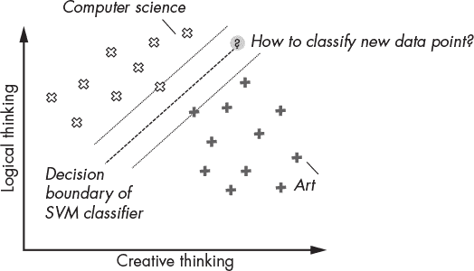

<samp class="SANS_Futura_Std_Book_Oblique_I_11">图 7-2：示例 SVM 分类及决策边界与支持向量</samp>

SVM 分类器为每个类别找到支持向量，并将直线放置在每个支持向量的最大距离处（即两者之间的中点），这样不同支持向量之间的区域就尽可能厚。这个直线就是决策边界。在图 7-2 中，添加了一个需要分类的新数据点；然而，由于该点位于间隔区，模型无法自信地判断它属于艺术类还是计算机科学类。这恰好展示了 SVM 内建机制，它可以明确告诉我们模型是否进行了边界分类。例如，SVM 可能会告诉我们，一个在创造力方面排名很高的学生属于艺术类，而一个在逻辑思维方面排名很高的学生属于计算机科学类，但一个在创造力和逻辑思维方面都很强的学生则无法自信地归属于任何一个类别。

请注意，SVM 模型也可以通过允许训练数据中的*异常值*来进行训练；这些异常值是位于决策边界一侧，但实际上属于另一侧的点。这是现实世界数据中最常见的情况。然而，本文不会进一步探讨这些 SVM 优化方法，而是建议您查看本章末尾列出的优秀 SVM 分类教程，这样我们可以立即深入了解这个令人兴奋的仪表板应用。

### <samp class="SANS_Futura_Std_Bold_B_11">SVM Explorer 应用</samp>

图 7-3 展示了我们如何使用 SVM Explorer 应用来可视化 SVM，这是一个来自画廊的 Python 仪表板应用，使用了各种类型的图表和图形。欢迎在[*https://<wbr>dash<wbr>-gallery<wbr>.plotly<wbr>.host<wbr>/dash<wbr>-svm*](https://dash-gallery.plotly.host/dash-svm)上玩转这个实时项目。

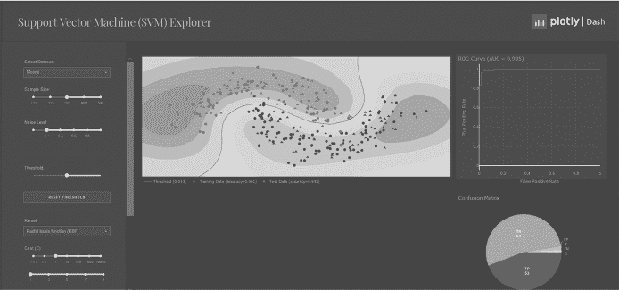

<samp class="SANS_Futura_Std_Book_Oblique_I_11">图 7-3：来自画廊的 SVM Explorer 应用</samp>

我们首先为您提供 SVM Explorer 应用的概述，以便您大致了解其工作原理。该应用展示了给定 SVM 模型如何对给定的训练数据集进行分类。您可以通过仪表板控件（如滑块、下拉菜单和单选按钮）来控制模型。根据您的选择，输出的图表和图形会随 SVM 模型的实例化变化而发生变化。

该应用程序的作者之一，邢汉，友好地为我们提供了 SVM Explorer 应用的简要概述：

该应用程序完全使用 Dash 和 scikit-learn 编写。所有组件都作为输入参数传递给 scikit-learn 函数，后者根据用户更改的参数生成模型。模型随后会进行预测，并显示在等高线图上，同时其预测结果会被评估，用于创建 ROC [接收器操作特性] 曲线和混淆矩阵。除了创建模型外，它还使用 scikit-learn 生成您看到的数据集，以及生成度量图所需的数据。

让我们快速查看每个可见组件。仪表板左列有多个输入组件：

+   *选择数据集*下拉菜单允许你选择用于训练和测试的合成数据集。默认选择是 Moon 数据集，以其月亮形状的数据集命名。这个输入下拉菜单让你探索 SVM 模型如何在具有不同固有特性的数据显示上工作。例如，你可以选择 Circles 数据集（图中未显示），这是一个非线性数据集，其中两个待分类的数据集形状像一个内圈和围绕该圈的外环。SVM 模型同样可以对这些类型的数据进行分类！

+   *样本大小*滑块允许你控制用于测试和训练模型的数据点数量。更高的样本大小通常会导致更准确的模型，这就是为什么机器学习公司永远不会停止收集更多数据的原因！然而，在我们的玩具仪表板中，较高的样本大小可能会导致更拥挤的可视化效果。

+   *噪声水平*滑块允许你控制添加到数据中的高斯噪声的标准差。更高的噪声水平会导致模型的准确性降低，因为噪声会减少数据中模式的清晰度，并且在训练阶段使得找到一个分离决策边界变得更加困难。然而，你可以使用噪声水平滑块来检查 SVM 模型在实际应用中的鲁棒性，因为现实世界中的数据通常是嘈杂的。

+   *阈值*滑块允许你对某个类别或另一个类别增加偏置。大致来说，通过增加阈值，你可以将决策边界从 A 类更多地移动到 B 类（或者通过减少阈值，反之亦然），以便对于给定的输入，A 类的分类可能性增加。例如，如果阈值为 0.4，任何大于 0.4 的得分都会被视为正向预测，而任何小于 0.4 的得分都会被视为负向预测，用于判断该点是否属于某个类别。

+   *重置阈值*按钮将阈值重置为默认值，而不使用自定义的阈值或偏置。

+   *核函数*下拉菜单、*成本*滑块以及其他控制项，如*Gamma*滑块和*收缩*单选按钮，允许你进一步控制其他 SVM 参数及其对分类准确性的影响。在这个简要概述中讨论这些参数需要的不仅仅是一个或两个句子，因此我们将跳过这一部分。如果你有兴趣了解这些控制项背后的理论，可以参考《信息检索导论》15 章（剑桥大学出版社，2008 年）。你可以在[*https://<wbr>nlp<wbr>.stanford<wbr>.edu<wbr>/IR<wbr>-book<wbr>/pdf<wbr>/15svm<wbr>.pdf*](https://nlp.stanford.edu/IR-book/pdf/15svm.pdf)免费阅读该章节。

三个输出组件会随着模型的变化而变化：

+   *Dash 图表组件*是一个等高线图，它通过热力图叠加可视化训练数据、测试数据及模型分类置信度。数据点表示训练数据，三角形表示测试数据。红色数据点属于一个类别，蓝色数据点属于另一个类别。首先，我们基于样本数据的一个子集训练 SVM 模型。然后，我们使用训练好的模型对测试数据进行分类，并在可视化中绘制预测的类别。

+   *ROC 曲线图*是衡量给定数据集上 SVM 模型质量的指标。它衡量的是*真正例率*，即正确分类的数据点的比例，与*假正例率*，即错误分类的数据点的比例。

+   *混淆矩阵*指的是预测类别与实际类别之间的对比。具体来说，它是一个柱状图，展示了测试数据的真正例、真负例、假正例和假负例的分类数量。你可以把它看作是另一个衡量 SVM 模型在给定数据集上进行训练和分类任务表现的指标。

我们在本章末提供了更多关于 Dash <samp class="SANS_TheSansMonoCd_W5Regular_11">图表</samp>、ROC 曲线图和混淆矩阵的详细解释链接。然而，了解这些概念的一个好方法是通过 SVM Explorer 应用进行操作。我们建议花费 10 到 20 分钟操作该应用，充分理解每个组件的理念。

你可以在 GitHub 仓库中找到该应用的代码，地址是 [*https://<wbr>github<wbr>.com<wbr>/DashBookProject<wbr>/Plotly<wbr>-Dash<wbr>/tree<wbr>/master<wbr>/Chapter<wbr>-7*](https://github.com/DashBookProject/Plotly-Dash/tree/master/Chapter-7)。完整代码超过 650 行，但不用担心，我们将重点关注最重要的部分。请注意，维护良好的代码不会永远保持不变。自本章写作以来，作者们已经通过添加新样式等方式更新了原始代码库。但由于应用程序的核心没有改变，我们已经在指定的 GitHub 仓库中提供了原始代码，你可以下载并复现本章中所解释的精确应用。我们强烈建议你下载代码，以加速学习进程。

事不宜迟，接下来让我们深入研究代码吧！

<samp class="SANS_Futura_Std_Bold_Condensed_Oblique_I_11">Python 库</samp>

我们将借助巨人的肩膀，依赖几个 Python 库来创建我们的 SVM 仪表板应用。列表 7-1 显示了本项目中使用的库。

<samp class="SANS_TheSansMonoCd_W5Regular_11">import time</samp>

<samp class="SANS_TheSansMonoCd_W5Regular_11">import importlib</samp>

<samp class="SANS_TheSansMonoCd_W5Regular_11">from dash import Dash, dcc, html, Input, Output, State</samp>

<samp class="SANS_TheSansMonoCd_W5Regular_11">import numpy as np</samp>

<samp class="SANS_TheSansMonoCd_W5Regular_11">from dash.dependencies import Input, Output, State</samp>

❶ <samp class="SANS_TheSansMonoCd_W5Regular_11">from sklearn.model_selection import train_test_split</samp>

<samp class="SANS_TheSansMonoCd_W5Regular_11">from sklearn.preprocessing import StandardScaler</samp>

<samp class="SANS_TheSansMonoCd_W5Regular_11">from sklearn import datasets</samp>

<samp class="SANS_TheSansMonoCd_W5Regular_11">from sklearn.svm import SVC</samp>

<samp class="SANS_Futura_Std_Book_Oblique_I_11">列表 7-1：SVM 应用的依赖项</samp>

你已经看到过导入 Dash 库的语句，这些语句用于导入核心和 HTML 组件，以及整体 Dash 应用的功能。本章的核心代码包括支持向量机（SVM）的计算。我们不会从头开始实现 SVM，而是依赖于 scikit-learn 库提供的优秀实现。因此，我们会从这个库中导入一些模块，稍后会详细介绍它们 ❶。如果你对机器学习感兴趣，scikit-learn 将是你最好的朋友！

<samp class="SANS_Futura_Std_Bold_Condensed_Oblique_I_11">数据管理</samp>

scikit-learn 提供了一些很棒的合成数据集，用于测试各种分类和预测算法。在列表 7-2 中，我们展示了函数 <samp class="SANS_TheSansMonoCd_W5Regular_11">generate_data()</samp> 如何根据样本点数量、数据集类型和噪声水平动态创建数据集，这些参数都在 SVM Explorer 应用的左列中指定，如图 7-3 所示。我们将使用函数 <samp class="SANS_TheSansMonoCd_W5Regular_11">datasets.make_moons()</samp>、<samp class="SANS_TheSansMonoCd_W5Regular_11">datasets.make_circles()</samp> 和 <samp class="SANS_TheSansMonoCd_W5Regular_11">datasets.make_classification()</samp> 来生成不同的数据集（分别为 <samp class="SANS_TheSansMonoCd_W5Regular_11">"moons"</samp>、<samp class="SANS_TheSansMonoCd_W5Regular_11">"circles"</samp> 和 <samp class="SANS_TheSansMonoCd_W5Regular_11">"linear"</samp>），这些数据集会根据输入下拉菜单中获得的值生成。此数据集稍后用于训练和测试我们的 SVM。

<samp class="SANS_TheSansMonoCd_W5Regular_11">def generate_data(n_samples, dataset, noise):</samp>

<samp class="SANS_TheSansMonoCd_W5Regular_11">   if dataset == "moons":</samp>

<samp class="SANS_TheSansMonoCd_W5Regular_11">      return datasets.make_moons(n_samples=n_samples,</samp>

<samp class="SANS_TheSansMonoCd_W5Regular_11">                                 noise=noise, random_state=0)</samp>

<samp class="SANS_TheSansMonoCd_W5Regular_11">   elif dataset == "circles":</samp>

<samp class="SANS_TheSansMonoCd_W5Regular_11">      return datasets.make_circles(</samp>

<samp class="SANS_TheSansMonoCd_W5Regular_11">         n_samples=n_samples, noise=noise, factor=0.5, random_state=</samp><samp class="SANS_TheSansMonoCd_W5Regular_11">1</samp>

<samp class="SANS_TheSansMonoCd_W5Regular_11">    )</samp>

<samp class="SANS_TheSansMonoCd_W5Regular_11">   elif dataset == "linear":</samp>

<samp class="SANS_TheSansMonoCd_W5Regular_11">      X, y = datasets.make_classification(</samp>

<samp class="SANS_TheSansMonoCd_W5Regular_11">         n_samples=n_samples,</samp>

<samp class="SANS_TheSansMonoCd_W5Regular_11">         n_features=2,</samp>

<samp class="SANS_TheSansMonoCd_W5Regular_11">         n_redundant=0,</samp>

<samp class="SANS_TheSansMonoCd_W5Regular_11">         n_informative=2,</samp>

<samp class="SANS_TheSansMonoCd_W5Regular_11">         random_state=2,</samp>

<samp class="SANS_TheSansMonoCd_W5Regular_11">         n_clusters_per_class=1,</samp>

<samp class="SANS_TheSansMonoCd_W5Regular_11">      )</samp>

<samp class="SANS_TheSansMonoCd_W5Regular_11">      rng = np.random.RandomState(2)</samp>

<samp class="SANS_TheSansMonoCd_W5Regular_11">      X +=</samp> <samp class="SANS_TheSansMonoCd_W5Regular_11">noise * rng.uniform(size=X.shape)</samp>

<samp class="SANS_TheSansMonoCd_W5Regular_11">      linearly_separable = (X, y)</samp>

<samp class="SANS_TheSansMonoCd_W5Regular_11">      return linearly_separable</samp>

<samp class="SANS_TheSansMonoCd_W5Regular_11">   else:</samp>

<samp class="SANS_TheSansMonoCd_W5Regular_11">      raise ValueError(</samp>

<samp class="SANS_TheSansMonoCd_W5Regular_11">        "数据类型指定错误。请选择一个现有的数据集。"</samp>

<samp class="SANS_TheSansMonoCd_W5Regular_11">      )</samp>

<samp class="SANS_Futura_Std_Book_Oblique_I_11">清单 7-2：SVM 应用的数据管理</samp>

从高层次来看，代码由 <samp class="SANS_TheSansMonoCd_W5Regular_11">if…elif…elif…else</samp> 语句组成，用于区分用户输入。这样，用户可以从三个数据集选择： <samp class="SANS_TheSansMonoCd_W5Regular_11">"moons"</samp>、<samp class="SANS_TheSansMonoCd_W5Regular_11">"circles"</samp> 和 <samp class="SANS_TheSansMonoCd_W5Regular_11">"linear"</samp>。在每种情况下，都会使用 scikit-learn 的 <samp class="SANS_TheSansMonoCd_W5Regular_11">dataset.make_X()</samp> 函数创建一个新的数据集，该函数接收不同的输入参数（例如样本点的数量），并将数据作为 NumPy 数组返回。有兴趣的读者可以通过以下链接了解我们在此使用的输入参数的更多信息：[*https://<wbr>scikit<wbr>-learn<wbr>.org<wbr>/stable<wbr>/modules<wbr>/classes<wbr>.xhtml#module<wbr>-sklearn<wbr>.datasets*](https://scikit-learn.org/stable/modules/classes.xhtml#module-sklearn.datasets)。

### <samp class="SANS_Futura_Std_Bold_B_11">布局与样式</samp>

布局和样式部分展示了 SVM Explorer 应用程序的结构以及构建它的基本 Dash 组件。我们从项目的整体布局开始。

<samp class="SANS_Futura_Std_Bold_Condensed_Oblique_I_11">布局</samp>

当你开始处理更大的应用时，*app.py* 文件中的代码行数很快变得难以管理。为了帮助管理代码，SVM Explorer 应用包括一个 *utils* 文件夹，其中包含两个帮助模块，*dash_resuable_components.py* 和 *figures.py*，它们包含了一些自定义 Dash 组件的定义，我们将在本章后面详细探讨这些组件，以及一些绘图和样式功能。将实用功能从 *app.py* 文件中提取到一些导入的外部模块中，是处理你自己的大型仪表盘项目的良好实践，以确保主要的 *app.py* 保持整洁和专注。

SVM Explorer 应用的结构如下：

<samp class="SANS_TheSansMonoCd_W5Regular_11">- app.py</samp>

<samp class="SANS_TheSansMonoCd_W5Regular_11">- utils/</samp>

<samp class="SANS_TheSansMonoCd_W5Regular_11">   |--dash_reusable_components.py</samp>

<samp class="SANS_TheSansMonoCd_W5Regular_11">   |--figures.py</samp>

应用的布局是 HTML 元素的分层嵌套结构，如 列表 7-3 所示。

<samp class="SANS_TheSansMonoCd_W5Regular_11">app.layout = html.Div(</samp>

<samp class="SANS_TheSansMonoCd_W5Regular_11">   children=[html.Div(…), # 标题等。</samp>

<samp class="SANS_TheSansMonoCd_W5Regular_11">      html.Div(…)] # 主体</samp>

<samp class="SANS_TheSansMonoCd_W5Regular_11">)</samp>

<samp class="SANS_Futura_Std_Book_Oblique_I_11">列表 7-3：放大 SVM 应用布局的一个级别</samp>

外部 <samp class="SANS_TheSansMonoCd_W5Regular_11">Div</samp> 的第一个子元素包含应用的标题、标志和其他元信息。第二个子元素包含应用的主体，即应用的中心部分。列表 7-4 展示了 SVM Explorer 应用布局部分的完整代码。只需简单浏览一下，尝试理解应用的结构；我们将在后面讨论相关部分。

❶ <samp class="SANS_TheSansMonoCd_W5Regular_11">app.layout = html.Div(</samp>

<samp class="SANS_TheSansMonoCd_W5Regular_11">   children=[</samp>

<samp class="SANS_TheSansMonoCd_W5Regular_11">     # .container 类是固定的，.container.scalable 是可扩展的</samp>

<samp class="SANS_TheSansMonoCd_W5Regular_11">   </samp>❷ <samp class="SANS_TheSansMonoCd_W5Regular_11">html.Div(</samp>

<samp class="SANS_TheSansMonoCd_W5Regular_11">        className="banner",</samp>

<samp class="SANS_TheSansMonoCd_W5Regular_11">        children=[</samp>

<samp class="SANS_TheSansMonoCd_W5Regular_11">     </samp><samp class="SANS_TheSansMonoCd_W5Regular_11">      html.Div(</samp>

<samp class="SANS_TheSansMonoCd_W5Regular_11">              className="container scalable",</samp>

<samp class="SANS_TheSansMonoCd_W5Regular_11">              children=</samp><samp class="SANS_TheSansMonoCd_W5Regular_11">[</samp>

<samp class="SANS_TheSansMonoCd_W5Regular_11">                 # 在此更改应用名称</samp>

<samp class="SANS_TheSansMonoCd_W5Regular_11">                 html.H2(</samp>

<samp class="SANS_TheSansMonoCd_W5Regular_11">                    id="banner-title",</samp>

<samp class="SANS_TheSansMonoCd_W5Regular_11">                    children=[</samp>

<samp class="SANS_TheSansMonoCd_W5Regular_11">                       html.A(</samp>

<samp class="SANS_TheSansMonoCd_W5Regular_11">                          "支持向量机（SVM）浏览器",</samp>

<samp class="SANS_TheSansMonoCd_W5Regular_11">                          href=("</samp><samp class="SANS_TheSansMonoCd_W5Regular_11">https://github.com/"</samp>

<samp class="SANS_TheSansMonoCd_W5Regular_11">                            "plotly/dash-svm"),</samp>

<samp class="SANS_TheSansMonoCd_W5Regular_11">            </samp><samp class="SANS_TheSansMonoCd_W5Regular_11">              style={</samp>

<samp class="SANS_TheSansMonoCd_W5Regular_11">                            "text-decoration": "none",</samp>

<samp class="SANS_TheSansMonoCd_W5Regular_11">                            "color": "inherit",</samp>

<samp class="SANS_TheSansMonoCd_W5Regular_11">            </samp><samp class="SANS_TheSansMonoCd_W5Regular_11">              },</samp>

<samp class="SANS_TheSansMonoCd_W5Regular_11">                      )</samp>

<samp class="SANS_TheSansMonoCd_W5Regular_11">                    ],</samp>

<samp class="SANS_TheSansMonoCd_W5Regular_11">                 ),</samp>

<samp class="SANS_TheSansMonoCd_W5Regular_11">                 html.A(</samp>

<samp class="SANS_TheSansMonoCd_W5Regular_11">                    id="banner-logo",</samp>

<samp class="SANS_TheSansMonoCd_W5Regular_11">                    children=[</samp>

<samp class="SANS_TheSansMonoCd_W5Regular_11">        </samp><samp class="SANS_TheSansMonoCd_W5Regular_11">               html.Img(src=app.get_asset_url(</samp>

<samp class="SANS_TheSansMonoCd_W5Regular_11">                      </samp><samp class="SANS_TheSansMonoCd_W5Regular_11">    "dash-logo-new.png"))</samp>

<samp class="SANS_TheSansMonoCd_W5Regular_11">                    ],</samp>

<samp class="SANS_TheSansMonoCd_W5Regular_11">            </samp><samp class="SANS_TheSansMonoCd_W5Regular_11">        href="</samp><samp class="SANS_TheSansMonoCd_W5Regular_11">https://plot.ly/products/dash/",</samp>

<samp class="SANS_TheSansMonoCd_W5Regular_11">                 ),</samp>

<samp class="SANS_TheSansMonoCd_W5Regular_11">             ],</samp>

<samp class="SANS_TheSansMonoCd_W5Regular_11">          )</samp>

<samp class="SANS_TheSansMonoCd_W5Regular_11">                 ],</samp>

<samp class="SANS_TheSansMonoCd_W5Regular_11">     ),</samp>

<samp class="SANS_TheSansMonoCd_W5Regular_11">   </samp>❸ <samp class="SANS_TheSansMonoCd_W5Regular_11">html.Div(</samp>

<samp class="SANS_TheSansMonoCd_W5Regular_11">        id="body",</samp>

<samp class="SANS_TheSansMonoCd_W5Regular_11">        className="container scalable",</samp>

<samp class="SANS_TheSansMonoCd_W5Regular_11">        children=[</samp>

<samp class="SANS_TheSansMonoCd_W5Regular_11">           html.Div(</samp>

<samp class="SANS_TheSansMonoCd_W5Regular_11">              id="app-container",</samp>

<samp class="SANS_TheSansMonoCd_W5Regular_11">              # className="row",</samp>

<samp class="SANS_TheSansMonoCd_W5Regular_11">              children=[</samp>

<samp class="SANS_TheSansMonoCd_W5Regular_11">                  html.Div(</samp>

<samp class="SANS_TheSansMonoCd_W5Regular_11">                    # className=</samp><samp class="SANS_TheSansMonoCd_W5Regular_11">"three columns",</samp>

<samp class="SANS_TheSansMonoCd_W5Regular_11">                    id="left-column",</samp>

<samp class="SANS_TheSansMonoCd_W5Regular_11">                    children=[</samp>

<samp class="SANS_TheSansMonoCd_W5Regular_11"># … 查看 Dash 组件</samp>

<samp class="SANS_TheSansMonoCd_W5Regular_11">                    ],</samp>

<samp class="SANS_TheSansMonoCd_W5Regular_11">                  </samp><samp class="SANS_TheSansMonoCd_W5Regular_11">),</samp>

<samp class="SANS_TheSansMonoCd_W5Regular_11">                  html.Div(</samp>

<samp class="SANS_TheSansMonoCd_W5Regular_11">                    id="div-graphs",</samp>

<samp class="SANS_TheSansMonoCd_W5Regular_11">                    children=dcc.Graph(</samp>

<samp class="SANS_TheSansMonoCd_W5Regular_11">                    id="graph-sklearn-svm",</samp>

<samp class="SANS_TheSansMonoCd_W5Regular_11">  </samp><samp class="SANS_TheSansMonoCd_W5Regular_11">                    figure=dict(</samp>

<samp class="SANS_TheSansMonoCd_W5Regular_11">                  </samp><samp class="SANS_TheSansMonoCd_W5Regular_11">       layout=dict(</samp>

<samp class="SANS_TheSansMonoCd_W5Regular_11">                            plot_bgcolor=</samp><samp class="SANS_TheSansMonoCd_W5Regular_11">"#282b38",</samp>

<samp class="SANS_TheSansMonoCd_W5Regular_11">                            paper_bgcolor="#282b38"</samp>

<samp class="SANS_TheSansMonoCd_W5Regular_11">                      </samp><samp class="SANS_TheSansMonoCd_W5Regular_11">    )</samp>

<samp class="SANS_TheSansMonoCd_W5Regular_11">                      ),</samp>

<samp class="SANS_TheSansMonoCd_W5Regular_11">          </samp><samp class="SANS_TheSansMonoCd_W5Regular_11">          ),</samp>

<samp class="SANS_TheSansMonoCd_W5Regular_11">                  ),</samp>

<samp class="SANS_TheSansMonoCd_W5Regular_11">        </samp><samp class="SANS_TheSansMonoCd_W5Regular_11">      ],</samp>

<samp class="SANS_TheSansMonoCd_W5Regular_11">            )</samp>

<samp class="SANS_TheSansMonoCd_W5Regular_11">        ],</samp>

<samp class="SANS_TheSansMonoCd_W5Regular_11">    ),</samp>

<samp class="SANS_TheSansMonoCd_W5Regular_11">  ]</samp>

<samp class="SANS_TheSansMonoCd_W5Regular_11">)</samp>

<samp class="SANS_Futura_Std_Book_Oblique_I_11">Listing 7-4: SVM 应用布局的多级缩放</samp>

代码引用了样式表和 Dash 组件，我们将在接下来的章节中讨论这些内容，因此现在可能还不清楚这一部分是如何工作的。但它确实向你展示了一个非平凡的 Dash 应用程序的样子：使用 dash-html-components 的层次化嵌套 HTML 组件。在大型应用中，你将使用这种结构在修改应用的外观和感觉时添加更多组件。

与我们在早期章节中看到的小型应用一样，应用由一个外部的 <samp class="SANS_TheSansMonoCd_W5Regular_11">Div</samp> ❶ 组成，里面包含两个内部的 <samp class="SANS_TheSansMonoCd_W5Regular_11">Div</samp> 元素，分别位于 ❷ 和 ❸。第一个内部的 <samp class="SANS_TheSansMonoCd_W5Regular_11">Div</samp> 包含了元信息，如标题和 logo。第二个内部的 <samp class="SANS_TheSansMonoCd_W5Regular_11">Div</samp> 包含了应用的主体内容。

在本章稍后的“可重用组件”部分，我们将专注于不同的 Dash 组件，了解它们是如何独立工作的。

接下来，我们将看看我们用来样式化 SVM Explorer 应用的 CSS 样式表。

<samp class="SANS_Futura_Std_Bold_Condensed_Oblique_I_11">样式化</samp>

我们从第四章和第五章中知道，我们可以使用 CSS 样式表或 dash-bootstrap-components 来样式化我们的 HTML 元素。在这个应用中，我们选择了 CSS 样式表，因为它允许我们通过边距、填充、颜色、字体和边框来创建更为个性化的外观和感觉。请注意，主要的样式已经内置在默认的 Plotly Dash 组件中，因此使用自定义样式表只是 SVM Explorer 应用创建者的一个相对次要的设计决策。

我们将样式表定义在 *assets* 子文件夹中，结构如下：

<samp class="SANS_TheSansMonoCd_W5Regular_11">- app.py</samp>

<samp class="SANS_TheSansMonoCd_W5Regular_11">- assets/</samp>

<samp class="SANS_TheSansMonoCd_W5Regular_11">   |--base-styles.css</samp>

<samp class="SANS_TheSansMonoCd_W5Regular_11">   |--custom-styles.css</samp>

<samp class="SANS_TheSansMonoCd_W5Regular_Italic_I_11">--snip--</samp>

我们将使用两个样式表：*base-styles.css* 和 *custom-styles.css*，这两个文件是由应用创建者添加到 SVM Explorer 应用中的。*base-styles.css* 样式表定义了如何样式化基础的 HTML 元素，如标题和段落。*custom-styles.css* 样式表定义了如何样式化 Dash 特定的元素，如命名的滑块、图表容器和卡片。让我们快速浏览一下 *base-styles.css*，看看如何修改默认的样式。

*base-styles.css* 样式表由 Listing 7-5 中显示的 13 个部分组成，每个部分定义了某些类型 HTML 元素的外观。

<samp class="SANS_TheSansMonoCd_W5Regular_11">/* 目录内容</samp>

<samp class="SANS_TheSansMonoCd_W5Regular_11">—————————————————————————</samp>

<samp class="SANS_TheSansMonoCd_W5Regular_11">- 网格</samp>

<samp class="SANS_TheSansMonoCd_W5Regular_11">- 基础样式</samp>

<samp class="SANS_TheSansMonoCd_W5Regular_11">- 排版</samp>

<samp class="SANS_TheSansMonoCd_W5Regular_11">- 链接</samp>

<samp class="SANS_TheSansMonoCd_W5Regular_11">- 按钮</samp>

<samp class="SANS_TheSansMonoCd_W5Regular_11">- 表单</samp>

<samp class="SANS_TheSansMonoCd_W5Regular_11">- 列表</samp>

<samp class="SANS_TheSansMonoCd_W5Regular_11">- 代码</samp>

<samp class="SANS_TheSansMonoCd_W5Regular_11">- 表格</samp>

<samp class="SANS_TheSansMonoCd_W5Regular_11">- 间距</samp>

<samp class="SANS_TheSansMonoCd_W5Regular_11">- 工具类</samp>

<samp class="SANS_TheSansMonoCd_W5Regular_11">- 清除浮动</samp>

<samp class="SANS_TheSansMonoCd_W5Regular_11">- 媒体查询</samp>

<samp class="SANS_TheSansMonoCd_W5Regular_11">*/</samp>

<samp class="SANS_Futura_Std_Book_Oblique_I_11">列表 7-5：概述</samp> <samp class="SANS_Futura_Std_Book_11">base-styles.css</samp>

这个样式表允许你定义基本元素的字体、背景颜色、边距和内边距等样式。例如，在排版部分（见列表 7-6），我们定义了不同标题的字体大小、粗细和间距。

<samp class="SANS_TheSansMonoCd_W5Regular_11">/* 排版</samp>

<samp class="SANS_TheSansMonoCd_W5Regular_11">—————————————————————————*/</samp>

<samp class="SANS_TheSansMonoCd_W5Regular_11">h1, h2, h3, h4, h5, h6 {</samp>

<samp class="SANS_TheSansMonoCd_W5Regular_11">   margin-top: 0;</samp>

<samp class="SANS_TheSansMonoCd_W5Regular_11">   margin-bottom: 0;</samp>

<samp class="SANS_TheSansMonoCd_W5Regular_11">   font-weight: 300;}</samp>

<samp class="SANS_TheSansMonoCd_W5Regular_11">h1 {font-size: 4.5rem; line-height: 1.2; letter-spacing: -.1rem; margin-bottom: 2rem;}</samp>

<samp class="SANS_TheSansMonoCd_W5Regular_11">h2 {font-size: 3.6rem; line-height: 1.25; letter-spacing: -.1rem; margin-bottom: 1.8rem; margin-top: 1.8rem;}</samp>

<samp class="SANS_TheSansMonoCd_W5Regular_11">h3 {font-size: 3.0rem; line-height: 1.3; letter-spacing: -.1rem; margin-bottom: 1.5rem; margin-top: 1.5rem;}</samp>

<samp class="SANS_TheSansMonoCd_W5Regular_11">h4 {font-size: 2.6rem; line-height: 1.35; letter-spacing: -.08rem; margin-bottom: 1.2rem; margin-top: 1.2rem;}</samp>

<samp class="SANS_TheSansMonoCd_W5Regular_11">h5 {font-size: 2.2rem; line-height: 1.5; letter-spacing: -.05rem; margin-bottom: 0.6rem; margin-top: 0.6rem;}</samp>

<samp class="SANS_TheSansMonoCd_W5Regular_11">h6 {font-size: 2.0rem; line-height: 1.6; letter-spacing: 0; margin-bottom: 0.75rem; margin-top: 0.75rem;}</samp>

<samp class="SANS_TheSansMonoCd_W5Regular_11">p {</samp>

<samp class="SANS_TheSansMonoCd_W5Regular_11">   margin-top: 0;}</samp>

<samp class="SANS_Futura_Std_Book_Oblique_I_11">列表 7-6：放大查看</samp> <samp class="SANS_Futura_Std_Book_11">base-styles.css</samp> 中的排版部分

你可以看到，我们为顶级标题 <samp class="SANS_TheSansMonoCd_W5Regular_11">h1</samp> 设置了字体大小为 <samp class="SANS_TheSansMonoCd_W5Regular_11">4.5rem</samp>，使其成为最大的标题。

本章我们不会深入探讨每个元素的具体细节，但我们建议你快速浏览一下代码，了解我们是如何为各种元素应用自定义样式的。

我们不需要陷入细节的 CSS 调整（你可以选择在自己的仪表盘应用中忽略这些，并默认使用 Dash 的标准样式），让我们来看看 SVM 应用的核心部分：Dash 组件。

### <samp class="SANS_Futura_Std_Bold_B_11">可重用组件</samp>

在这里，我们将介绍一个新的 Dash 概念，即 *可重用组件*，它允许你为现有组件添加自定义的样式和功能。在我们的 SVM Explorer 应用中，我们使用了几个与内置组件类似但略有不同的组件，例如带有不同标签和取值范围的下拉菜单。我们在 *dash_reusable_components.py* 文件中定义这些组件，并在 *app.py* 文件中实例化它们，给每个组件赋予自定义的特性。首先，我们将把 *dash_reusable_components.py* 模块添加到 *utils* 文件夹中：

<samp class="SANS_TheSansMonoCd_W5Regular_11">- app.py</samp>

<samp class="SANS_TheSansMonoCd_W5Regular_11">- assets/</samp>

<samp class="SANS_TheSansMonoCd_W5Regular_11">- utils/</samp>

<samp class="SANS_TheSansMonoCd_W5Regular_11">   |--dash_reusable_components.py</samp>

<samp class="SANS_TheSansMonoCd_W5Regular_Italic_I_11">--snip--</samp>

假设我们的目标是创建一个自定义按钮，这个按钮将在代码中多次使用。这个自定义按钮组件可以非常复杂；它可能仅包含一个按钮标签，或者可能包含更复杂的内容，例如一个图表，显示按钮在一段时间内被点击的频率（是的，Dash 可以做到这一点！）。为了保持代码简洁和清晰，我们希望避免在 *app.py* 文件中重复创建自定义按钮。为此，我们将这个自定义按钮作为自定义类 <samp class="SANS_TheSansMonoCd_W5Regular_11">CustomButton</samp> 的一个实例来创建。我们在 *dash_reusable_components.py* 模块中定义这个类一次，然后可以在主 *app.py* 文件中根据需要多次实例化这个自定义按钮组件，每次实例化时可以拥有不同的特性，例如不同的背景颜色或文本。

<samp class="SANS_Futura_Std_Bold_Condensed_Oblique_I_11">定义卡片</samp>

在 第六章中，我们使用了一个 Bootstrap <samp class="SANS_TheSansMonoCd_W5Regular_11">Card</samp> 来创建一个包含内容的小区域。这里，我们将创建一个包含多个组件的 <samp class="SANS_TheSansMonoCd_W5Regular_11">Card</samp>：一个标签，一个滑块和一个按钮。你可以把 <samp class="SANS_TheSansMonoCd_W5Regular_11">Card</samp> 想象成一个由多个子组件组成的元组件，使用特定的（相对）宽度和内边距，并在底部添加一个实心灰色边框来将这些组件在视觉上分组。一个 <samp class="SANS_TheSansMonoCd_W5Regular_11">Card</samp> 实际上是 HTML 组件 <samp class="SANS_TheSansMonoCd_W5Regular_11">html.Section</samp> 的包装器，这是一个将不同 HTML 元素或文本分组在（可能是）样式化区域内的容器。所有位于 <samp class="SANS_TheSansMonoCd_W5Regular_11">Section</samp> 中的内容在语义上或主题上是相关的。图 7-4 展示了我们在 SVM Explorer 应用中使用 <samp class="SANS_TheSansMonoCd_W5Regular_11">html.Section</samp> 元素将三个组件分组的一个 <samp class="SANS_TheSansMonoCd_W5Regular_11">Card</samp> 示例：标签、滑块和按钮。

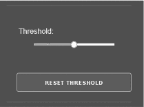

<samp class="SANS_Futura_Std_Book_Oblique_I_11">图 7-4: 自定义 Card 的示例</samp>

<samp class="SANS_Dogma_OT_Bold_B_11">什么是 Wrapper？</samp>

<samp class="SANS_Futura_Std_Book_11">A</samp> <samp class="SANS_Futura_Std_Book_Oblique_I_11">wrapper</samp> <samp class="SANS_Futura_Std_Book_11">是一个函数，它的唯一目的是调用另一个函数。通过这样做，wrapper 将调用者从不必要的复杂性或冗余中解救出来。例如，内部函数的调用可能非常复杂，包含许多调用者不知晓的特定参数。wrapper 函数通过要求更少的参数并将剩余的参数硬编码，从而简化了对内部函数的访问。这提高了代码的可读性，减少了复杂性，并改善了代码的可维护性。</samp>

Listing 7-7 展示了来自 *dash_reusable_components.py* 的 <samp class="SANS_TheSansMonoCd_W5Regular_11">Card</samp> 包装器函数的实际定义。

<samp class="SANS_TheSansMonoCd_W5Regular_11">def Card(children, **kwargs):</samp>

<samp class="SANS_TheSansMonoCd_W5Regular_11">   return html.Section(className=</samp><samp class="SANS_TheSansMonoCd_W5Regular_11">"card", children=children, **_omit(["style"], kwargs))</samp>

<samp class="SANS_Futura_Std_Book_Oblique_I_11">Listing 7-7: 定义 Card 组件</samp>

要全面了解 <samp class="SANS_TheSansMonoCd_W5Regular_11">Card</samp> 组件的工作原理，我们需要深入探讨以下这些参数：

<samp class="SANS_TheSansMonoCd_W7Bold_B_11">children   </samp>是包含在<samp class="SANS_TheSansMonoCd_W5Regular_11">Card</samp>中的其他 Dash 元素的列表，因此它们会在仪表盘应用中一起显示。你可以创建各种嵌套和层次化的 HTML 树，并将任何 HTML 元素的可迭代对象传递给<samp class="SANS_TheSansMonoCd_W5Regular_11">Card</samp>。然后，<samp class="SANS_TheSansMonoCd_W5Regular_11">Card</samp>会将这些元素包装成一个共同的元素，类似于一个物理卡片：一个二维框，具有一致的样式，封装了一些其他设计元素。

<samp class="SANS_TheSansMonoCd_W7Bold_B_11">**kwargs   </samp>代表*任意关键字参数*。<samp class="SANS_TheSansMonoCd_W5Regular_11">**kwargs</samp>参数将传递给函数调用的所有关键字参数打包成一个单独的<samp class="SANS_TheSansMonoCd_W5Regular_11">kwargs</samp>字典。关键字参数名是字典的键，关键字参数的值是字典的值。例如，如果某人调用函数<samp class="SANS_TheSansMonoCd_W5Regular_11">Card(children, example</samp> <samp class="SANS_TheSansMonoCd_W5Regular_11">=</samp> <samp class="SANS_TheSansMonoCd_W5Regular_11">"123")</samp>，我们可以在函数内部使用<samp class="SANS_TheSansMonoCd_W5Regular_11">kwargs['example']</samp>来获得值<samp class="SANS_TheSansMonoCd_W5Regular_11">"123"</samp>。我们可以稍后使用这个字典将大量的参数解包到<samp class="SANS_TheSansMonoCd_W5Regular_11">html.Section()</samp>构造函数中，包括诸如节的语言或用户点击该组件的次数等元数据。我们在 SVM Explorer 应用中并没有真正使用传递任意关键字参数的机会，但这是<Card>组件的一个有趣方面。你可以在[*https://blog.finxter.com/python-double-asterisk*](https://blog.finxter.com/python-double-asterisk)找到关于双星号操作符的详细教程。

另一个参数实际上是一个函数。让我们仔细看看它：

<samp class="SANS_TheSansMonoCd_W7Bold_B_11">_omit</samp><samp class="SANS_TheSansMonoCd_W7Bold_B_11">   </samp>允许我们排除不需要的某些元素。例如，我们可能会删除字典中的 <samp class="SANS_TheSansMonoCd_W5Regular_11">"style"</samp> 键，因为在 <samp class="SANS_TheSansMonoCd_W5Regular_11">html.Section()</samp> 构造函数中并不需要它，毕竟我们已经通过 CSS 样式表定义了样式。<samp class="SANS_TheSansMonoCd_W5Regular_11">_omit()</samp> 函数接收两个参数：一个是包含被省略键的字符串列表 <samp class="SANS_TheSansMonoCd_W5Regular_11">omitted_keys</samp>，另一个是字典 <samp class="SANS_TheSansMonoCd_W5Regular_11">d</samp>。该函数返回一个新的字典，其中包含原始字典 <samp class="SANS_TheSansMonoCd_W5Regular_11">d</samp> 中所有没有被列入 <samp class="SANS_TheSansMonoCd_W5Regular_11">omitted_keys</samp> 中的键及其对应的值。以下是 SVM Explorer 应用的作者如何简洁地完成此操作的：

<samp class="SANS_TheSansMonoCd_W5Regular_11">def _omit(omitted_keys, d):</samp>

<samp class="SANS_TheSansMonoCd_W5Regular_11"> return {k: v for k, v in d.items() if k not in omitted_keys}</samp>

在 SVM Explorer 应用中，您调用 <samp class="SANS_TheSansMonoCd_W5Regular_11">**_omit(["style"], kwargs)</samp> 来传递关键字参数字典 <samp class="SANS_TheSansMonoCd_W5Regular_11">kwargs</samp>，该字典是从 <samp class="SANS_TheSansMonoCd_W5Regular_11">Card()</samp> 调用中提取的，经过 <samp class="SANS_TheSansMonoCd_W5Regular_11">_omit()</samp> 函数删除了 <samp class="SANS_TheSansMonoCd_W5Regular_11">"style"</samp> 键。双星号前缀会将字典中的所有值解包成 <samp class="SANS_TheSansMonoCd_W5Regular_11">html.Section()</samp> 构造函数的参数列表。

在 *app.py* 中，我们现在可以使用 <samp class="SANS_TheSansMonoCd_W5Regular_11">Card</samp> 可重用组件来创建一个包含命名滑块和按钮的卡片，详情请参见 列表 7-8。

<samp class="SANS_TheSansMonoCd_W5Regular_11">.drc.Card(</samp>

<samp class="SANS_TheSansMonoCd_W5Regular_11">   id="button-card",</samp>

<samp class="SANS_TheSansMonoCd_W5Regular_11">   children=[</samp>

<samp class="SANS_TheSansMonoCd_W5Regular_11">      drc.NamedSlider(</samp>

<samp class="SANS_TheSansMonoCd_W5Regular_11">         name="Threshold",</samp>

<samp class="SANS_TheSansMonoCd_W5Regular_11">         id="slider-threshold",</samp>

<samp class="SANS_TheSansMonoCd_W5Regular_11">         min=0,</samp>

<samp class="SANS_TheSansMonoCd_W5Regular_11">         max=</samp><samp class="SANS_TheSansMonoCd_W5Regular_11">1,</samp>

<samp class="SANS_TheSansMonoCd_W5Regular_11">         value=0.5,</samp>

<samp class="SANS_TheSansMonoCd_W5Regular_11">         step=0.01,</samp>

<samp class="SANS_TheSansMonoCd_W5Regular_11">      ),</samp>

<samp class="SANS_TheSansMonoCd_W5Regular_11">      html.Button(</samp>

<samp class="SANS_TheSansMonoCd_W5Regular_11">         "重置阈值",</samp>

<samp class="SANS_TheSansMonoCd_W5Regular_11">         id="button-zero-threshold",</samp>

<samp class="SANS_TheSansMonoCd_W5Regular_11">      ),</samp>

<samp class="SANS_TheSansMonoCd_W5Regular_11">   ],</samp>

<samp class="SANS_TheSansMonoCd_W5Regular_11">)</samp>

<samp class="SANS_Futura_Std_Book_Oblique_I_11">清单 7-8：在 Card 定义中组合命名滑块和按钮组件</samp>

请注意，<samp class="SANS_TheSansMonoCd_W5Regular_11">drc.NamedSlider</samp> 本身就是一个可重用的组件，因此我们将另一个可重用组件 <samp class="SANS_TheSansMonoCd_W5Regular_11">drc.Card</samp> 以层次结构的方式包装在另一个可重用组件周围。

图 7-4 显示了 <samp class="SANS_TheSansMonoCd_W5Regular_11">drc.Card</samp> 在 SVM Explorer 应用中的显示效果。命名滑块由两个组件组成：一个 HTML 组件用来显示文本 <samp class="SANS_TheSansMonoCd_W5Regular_11">"Threshold"</samp>，另一个是 Dash <samp class="SANS_TheSansMonoCd_W5Regular_11">Slider</samp> 组件，用来设置 0 到 1 之间的浮动值。

阈值随后作为我们 SVM 模型的输入值，用来控制分类模型对某一类或另一类的偏倚。虽然这是一个特定分类模型中的参数，但你可以使用这种策略展示机器学习中各种模型参数对性能的影响。探索关键参数的影响变得和在智能手机上使用滑块一样简单！当你向公众展示下一个机器学习模型时，这不会留下深刻印象吗？

现在你知道如何通过在另一个组件周围使用包装函数来创建可重用的组件。如果你没有完全理解细节也不用担心；我们只希望你把握大局：如何通过包装函数创建可重用的组件。接下来，我们来深入了解在我们的应用中使用的下一个自定义组件：格式化滑块。

<samp class="SANS_Futura_Std_Bold_Condensed_Oblique_I_11">定义格式化滑块</samp>

格式化滑块是另一个自定义包装器，由一个 HTML <samp class="SANS_TheSansMonoCd_W5Regular_11">Div</samp> 元素和一个 <samp class="SANS_TheSansMonoCd_W5Regular_11">dcc.Slider</samp> 组件组成，这是 Dash Core 组件，在第六章中介绍。格式化滑块是一个应用了某些预定义格式的 <samp class="SANS_TheSansMonoCd_W5Regular_11">dcc.Slider</samp> 组件，通常与内边距相关。为了简化使用，我们通常会使用简单的 CSS 来将格式与滑块组件关联，但该应用的作者可能考虑到未来会添加一些更复杂的组件或功能，因此他们将其做成了一个可重用的组件，易于扩展。

列表 7-9 显示了我们在 *dash_reusable_components.py* 中放置的包装函数的代码。

<samp class="SANS_TheSansMonoCd_W5Regular_11">def FormattedSlider(**kwargs):</samp>

<samp class="SANS_TheSansMonoCd_W5Regular_11">   return html.Div(</samp>

<samp class="SANS_TheSansMonoCd_W5Regular_11">      style=kwargs.get("style", {}),</samp>

<samp class="SANS_TheSansMonoCd_W5Regular_11">      children=</samp><samp class="SANS_TheSansMonoCd_W5Regular_11">dcc.Slider(**_omit(["style"], kwargs))</samp>

<samp class="SANS_TheSansMonoCd_W5Regular_11">   )</samp>

<samp class="SANS_Futura_Std_Book_Oblique_I_11">列表 7-9：定义 FormattedSlider 组件</samp>

在 *app.py* 中，我们通过以下滑块创建代码片段，创建了一个特定实例的格式化滑块，该滑块展示在 图 7-5 中：

<samp class="SANS_TheSansMonoCd_W5Regular_11">drc.FormattedSlider(</samp>

<samp class="SANS_TheSansMonoCd_W5Regular_11">   id="slider-svm-parameter-C-coef",</samp>

<samp class="SANS_TheSansMonoCd_W5Regular_11">   min=1,</samp>

<samp class="SANS_TheSansMonoCd_W5Regular_11">   max=9,</samp>

<samp class="SANS_TheSansMonoCd_W5Regular_11">   value=1,</samp>

<samp class="SANS_TheSansMonoCd_W5Regular_11">)</samp>

这将创建一个格式化的滑块，最小值为 1，最大值为 9，且两个连续值之间的滑块粒度为 1。我们将四个关键字参数传递给 <samp class="SANS_TheSansMonoCd_W5Regular_11">FormattedSlider()</samp> 函数，这些参数随后被打包成 <samp class="SANS_TheSansMonoCd_W5Regular_11">kwargs</samp> 字典。字典中没有 <samp class="SANS_TheSansMonoCd_W5Regular_11">style</samp> 键，因此 列表 7-9 中的 <samp class="SANS_TheSansMonoCd_W5Regular_11">kwargs.get("style", {})</samp> 调用返回空字典。在这种情况下，将使用 Dash 的默认样式。我们将字典中其余的键值对作为关键字参数传递到 <samp class="SANS_TheSansMonoCd_W5Regular_11">dcc.Slider()</samp> 创建过程中。这些参数构建了具有指定范围的新滑块；请注意，Dash 会自动为 SVM Explorer 应用程序中显示的特定格式化滑块添加标签 1、3、5、7 和 9（见 图 7-5）。如果你亲自尝试这个滑块，你会发现，即使标记只显示每隔一个值，滑块的粒度仍然是 1。当然，如果需要，你可以通过添加另一个 <samp class="SANS_TheSansMonoCd_W5Regular_11">marks</samp> 参数，在字典中将滑块值映射到文本标签，从而自定义标记。

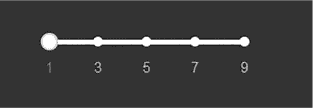

<samp class="SANS_Futura_Std_Book_Oblique_I_11">图 7-5：格式化滑块示例</samp>

<samp class="SANS_Futura_Std_Bold_Condensed_Oblique_I_11">定义一个命名滑块</samp>

命名滑块是对 <samp class="SANS_TheSansMonoCd_W5Regular_11">dcc.Slider</samp> 组件的另一个包装器，它添加了一个自定义标题。图 7-6 显示了我们在 SVM Explorer 应用中命名为 Degree 的滑块。

<samp class="SANS_Futura_Std_Book_Oblique_I_11">图 7-6：命名滑块的示例</samp>

定义 <samp class="SANS_TheSansMonoCd_W5Regular_11">NamedSlider</samp> 的代码在 清单 7-10 中显示。

<samp class="SANS_TheSansMonoCd_W5Regular_11">def NamedSlider(name, **kwargs):</samp>

<samp class="SANS_TheSansMonoCd_W5Regular_11">   return html.Div(</samp>

<samp class="SANS_TheSansMonoCd_W5Regular_11">      style={"padding": "20px 10px 25px 4px"},</samp>

<samp class="SANS_TheSansMonoCd_W5Regular_11">      children=[</samp>

<samp class="SANS_TheSansMonoCd_W5Regular_11">        html.P(f"{name}:"),</samp>

<samp class="SANS_TheSansMonoCd_W5Regular_11">        html.Div(style={"margin-left": "6px"},</samp>

<samp class="SANS_TheSansMonoCd_W5Regular_11">          children=</samp><samp class="SANS_TheSansMonoCd_W5Regular_11">dcc.Slider(**kwargs)),</samp>

<samp class="SANS_TheSansMonoCd_W5Regular_11">    ],</samp>

<samp class="SANS_TheSansMonoCd_W5Regular_11">   )</samp>

<samp class="SANS_Futura_Std_Book_Oblique_I_11">清单 7-10：定义 NamedSlider 组件</samp>

我们创建了一个 HTML <samp class="SANS_TheSansMonoCd_W5Regular_11">Div</samp> 容器，包含两个元素：一个 HTML 段落元素，通过 <samp class="SANS_TheSansMonoCd_W5Regular_11">html.P()</samp> 向命名的滑块添加标签，另一个 <samp class="SANS_TheSansMonoCd_W5Regular_11">Div</samp> 容器，包含一个常规的 Dash <samp class="SANS_TheSansMonoCd_W5Regular_11">dcc.Slider()</samp> 元素。这里我们通过设置外部 <samp class="SANS_TheSansMonoCd_W5Regular_11">Div</samp> 样式字典的 <samp class="SANS_TheSansMonoCd_W5Regular_11">padding</samp> 属性来硬编码一些样式元素。这是我们为什么可能会选择使用 <samp class="SANS_TheSansMonoCd_W5Regular_11">_omit()</samp> 从字典中移除 <samp class="SANS_TheSansMonoCd_W5Regular_11">style</samp> 键的一个很好的例子，正如前面讨论的那样；如果我们想更改样式，可以使用 Dash HTML 组件的这个特定样式参数。在我们的案例中，自定义样式扩展了命名滑块组件周围的框宽度。如果我们在 *dash_reusable_components.py* 中更改了此样式，那么我们在 *app.py* 中创建的每个实例都会进行相应的更改！

我们使用格式化字符串 <samp class="SANS_TheSansMonoCd_W5Regular_11">f"{name}:"</samp> 来访问 *app.py* 中 <samp class="SANS_TheSansMonoCd_W5Regular_11">NamedSlider()</samp> 调用的 <samp class="SANS_TheSansMonoCd_W5Regular_11">name</samp> 参数的值，并将其放入将作为滑块标签的字符串中。这使我们能够为每个滑块提供一个独立的标签。

内部 <samp class="SANS_TheSansMonoCd_W5Regular_11">Div</samp> 的 <samp class="SANS_TheSansMonoCd_W5Regular_11">"margin-left"</samp> 属性将整个滑块稍微向右移动，以显示滑块组件的缩进效果。

<samp class="SANS_Dogma_OT_Bold_B_15">注意</samp>

*在* dash_reusable_components.py *中的自定义函数名称通常以大写字母开头，因为 Dash 组件也是大写的。这样，调用一个可重用组件就像调用一个预定义的 Dash 组件一样。*

列表 7-11 显示了 *app.py* 中的代码，该代码实例化了 图 7-6 中命名的滑块。

<samp class="SANS_TheSansMonoCd_W5Regular_11">drc.NamedSlider(</samp>

<samp class="SANS_TheSansMonoCd_W5Regular_11">   name="Degree",</samp>

<samp class="SANS_TheSansMonoCd_W5Regular_11">   id="slider-svm-parameter-degree",</samp>

<samp class="SANS_TheSansMonoCd_W5Regular_11">   min=2,</samp>

<samp class="SANS_TheSansMonoCd_W5Regular_11">   max=10,</samp>

<samp class="SANS_TheSansMonoCd_W5Regular_11">   value=3,</samp>

<samp class="SANS_TheSansMonoCd_W5Regular_11">   step=1,</samp>

<samp class="SANS_TheSansMonoCd_W5Regular_11">   marks={</samp>

<samp class="SANS_TheSansMonoCd_W5Regular_11">      str(i): str(i) for i in range(2, 11, 2)</samp>

<samp class="SANS_TheSansMonoCd_W5Regular_11">   },</samp>

<samp class="SANS_TheSansMonoCd_W5Regular_11">)</samp>

<samp class="SANS_Futura_Std_Book_Oblique_I_11">列表 7-11：实例化 NamedSlider 组件</samp>

该滑块的最小值为 2，最大值为 10。我们还将滑块的标记设置为 2、4、6、8 和 10，这些标记是通过生成器表达式 <samp class="SANS_TheSansMonoCd_W5Regular_11">str(i) for i in range(2, 11, 2)</samp> 创建的。

<samp class="SANS_Futura_Std_Bold_Condensed_Oblique_I_11">定义命名下拉框</samp>

与 <samp class="SANS_TheSansMonoCd_W5Regular_11">Slider</samp> 一样，我们将基于 <samp class="SANS_TheSansMonoCd_W5Regular_11">dcc.Dropdown()</samp> 创建一个带有标签的命名下拉框。这里的过程与创建命名滑块类似，因此我们将简要介绍它，以便在不同的上下文中展示给你。列表 7-12 显示了在 *dash_reusable_components.py* 中的定义。

<samp class="SANS_TheSansMonoCd_W5Regular_11">def NamedDropdown(name, **kwargs):</samp>

<samp class="SANS_TheSansMonoCd_W5Regular_11">   return html.Div(</samp>

<samp class="SANS_TheSansMonoCd_W5Regular_11">      style={"margin": "10px 0px"},</samp>

<samp class="SANS_TheSansMonoCd_W5Regular_11">      children=[</samp>

<samp class="SANS_TheSansMonoCd_W5Regular_11">        html.P(children=f"{name}:", style={"margin-left": "3px"}),</samp>

<samp class="SANS_TheSansMonoCd_W5Regular_11">        dcc.Dropdown(**kwargs),</samp>

<samp class="SANS_TheSansMonoCd_W5Regular_11">      ],</samp>

<samp class="SANS_TheSansMonoCd_W5Regular_11">   )</samp>

<samp class="SANS_Futura_Std_Book_Oblique_I_11">列表 7-12：定义 NamedDropdown 组件</samp>

我们使用双星号运算符传递关键字参数列表，以便在 <samp class="SANS_TheSansMonoCd_W5Regular_11">kwargs</samp> 字典中捕获所有关键字参数，并将这些关键字参数解包到 <samp class="SANS_TheSansMonoCd_W5Regular_11">dcc.Dropdown()</samp> 创建例程中。创建 <samp class="SANS_TheSansMonoCd_W5Regular_11">NamedDropdown</samp> 实例时传入的函数参数 <samp class="SANS_TheSansMonoCd_W5Regular_11">name</samp> 作为 HTML 段落元素中的文本标签。

结果的 <samp class="SANS_TheSansMonoCd_W5Regular_11">NamedDropdown</samp> 可复用组件将类似于图 7-7。

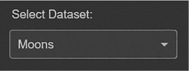

<samp class="SANS_Futura_Std_Book_Oblique_I_11">图 7-7：命名下拉框示例</samp>

在列表 7-13 中，我们在 *app.py* 中创建了这个组件。

<samp class="SANS_TheSansMonoCd_W5Regular_11">drc.NamedDropdown(</samp>

<samp class="SANS_TheSansMonoCd_W5Regular_11">   name="选择数据集",</samp>

<samp class="SANS_TheSansMonoCd_W5Regular_11">   id="dropdown-select-dataset",</samp>

<samp class="SANS_TheSansMonoCd_W5Regular_11">   options=[</samp>

<samp class="SANS_TheSansMonoCd_W5Regular_11">      {"label": "Moons", "value": "moons"},</samp>

<samp class="SANS_TheSansMonoCd_W5Regular_11">      {</samp>

<samp class="SANS_TheSansMonoCd_W5Regular_11">        "label": "线性可分",</samp>

<samp class="SANS_TheSansMonoCd_W5Regular_11">        "value": "linear",</samp>

<samp class="SANS_TheSansMonoCd_W5Regular_11">      },</samp>

<samp class="SANS_TheSansMonoCd_W5Regular_11">      {</samp>

<samp class="SANS_TheSansMonoCd_W5Regular_11">        "label": "圆形",</samp>

<samp class="SANS_TheSansMonoCd_W5Regular_11">        "value": "circles",</samp>

<samp class="SANS_TheSansMonoCd_W5Regular_11">      },</samp>

<samp class="SANS_TheSansMonoCd_W5Regular_11">      ],</samp>

<samp class="SANS_TheSansMonoCd_W5Regular_11">   clearable=False,</samp>

<samp class="SANS_TheSansMonoCd_W5Regular_11">   searchable=False,</samp>

<samp class="SANS_TheSansMonoCd_W5Regular_11">   value="moons",</samp>

<samp class="SANS_TheSansMonoCd_W5Regular_11">)</samp>

<samp class="SANS_Futura_Std_Book_Oblique_I_11">清单 7-13：实例化 NamedDropdown 组件</samp>

我们调用新创建的 <samp class="SANS_TheSansMonoCd_W5Regular_11">drc.NamedDropdown()</samp> 函数，并传入我们希望为命名下拉组件指定的名称。其余的关键字参数 <samp class="SANS_TheSansMonoCd_W5Regular_11">id</samp>（HTML 元素的标识符）、<samp class="SANS_TheSansMonoCd_W5Regular_11">options</samp>（下拉菜单的标签和值）、<samp class="SANS_TheSansMonoCd_W5Regular_11">clearable</samp>（一个布尔值，用于决定是否允许用户通过点击小图标清除当前选择的条目）、<samp class="SANS_TheSansMonoCd_W5Regular_11">searchable</samp>（一个布尔值，用于决定是否允许用户搜索下拉菜单中的特定值）以及 <samp class="SANS_TheSansMonoCd_W5Regular_11">value</samp>（默认的下拉值）将被打包进 <samp class="SANS_TheSansMonoCd_W5Regular_11">kwargs</samp> 字典，并传递到 <samp class="SANS_TheSansMonoCd_W5Regular_11">dcc.Dropdown()</samp> 创建过程中。

这个实例化过程将在 图 7-8 中创建命名下拉框，默认数据集设置为“Moons”，并且同时禁用了 <samp class="SANS_TheSansMonoCd_W5Regular_11">searchable</samp> 和 <samp class="SANS_TheSansMonoCd_W5Regular_11">clearable</samp>。

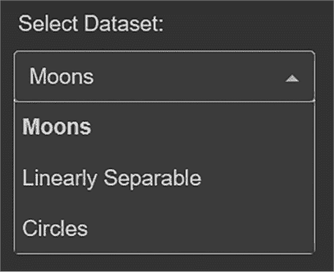

<samp class="SANS_Futura_Std_Book_Oblique_I_11">图 7-8：命名下拉框点击状态</samp>

使用可重用组件是扩展应用程序和创建全新库以供全球使用的极为高效的方式。只需定义自己的 *dash_reusable_components.py* 文件，并在主程序文件中使用现有 Dash 和 HTML 组件的包装函数。可重用组件为你提供了轻松自定义应用外观和体验的方式，并使你的代码更易于理解、更简洁且更易于维护，即使你的应用程序需要成千上万行代码！

接下来，我们将深入探讨一些尚未覆盖的新 Dash 组件，这些组件将在 SVM Explorer 应用中使用。

<samp class="SANS_Futura_Std_Bold_Condensed_Oblique_I_11">使用 Dash 图形</samp>

整个 SVM Explorer 应用的核心组件，当然是可视化学习和分类性能的图形，该图形基于所选的训练数据。图 7-9 展示了最终的图形。

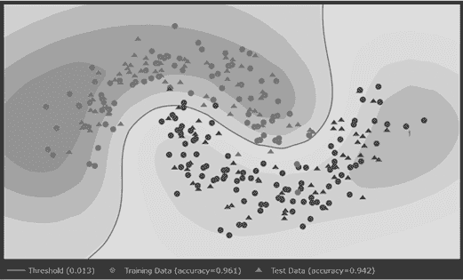

<samp class="SANS_Futura_Std_Book_Oblique_I_11">图 7-9：示例 Dash 图形</samp>

首先，我们使用仪表盘中不同控件的输入参数来训练模型。然后，我们测试模型在测试数据集上的准确性。点状图表示训练数据，三角形表示测试数据。红色数据点属于一个类别，蓝色数据点属于另一个类别；我们分别将它们称为类别 X 和类别 Y。对于每一条训练数据，我们已经知道它是 X 还是 Y；也就是说，知道它位于决策边界的哪一侧。然后，模型会基于从训练数据中学习到的决策边界，估算每条测试数据所属的类别。

以下函数调用实现了这个强大的可视化效果（位于 *app.py* 示例项目的第 434 行）：

<samp class="SANS_TheSansMonoCd_W5Regular_11">dcc.Graph(id="graph-sklearn-svm", figure=prediction_figure)</samp>

我们创建一个 <samp class="SANS_TheSansMonoCd_W5Regular_11">dcc.Graph</samp> 组件，使用 <samp class="SANS_TheSansMonoCd_W5Regular_11">id "graph-sklearn-svm"</samp>。作为 <samp class="SANS_TheSansMonoCd_W5Regular_11">figure</samp> 参数，我们传入了 <samp class="SANS_TheSansMonoCd_W5Regular_11">prediction_figure</samp> 变量，它是在 *app.py* 文件的第 410 到 421 行定义的（见 Listing 7-14）。

<samp class="SANS_TheSansMonoCd_W5Regular_11">prediction_figure = figs.serve_prediction_plot(</samp>

<samp class="SANS_TheSansMonoCd_W5Regular_11">   model=clf,</samp>

<samp class="SANS_TheSansMonoCd_W5Regular_11">   X_train=X_train,</samp>

<samp class="SANS_TheSansMonoCd_W5Regular_11">   X_test=X_test,</samp>

<samp class="SANS_TheSansMonoCd_W5Regular_11">   y_train=y_train,</samp>

<samp class="SANS_TheSansMonoCd_W5Regular_11">   y_test=y_test,</samp>

<samp class="SANS_TheSansMonoCd_W5Regular_11">   Z=Z,</samp>

<samp class="SANS_TheSansMonoCd_W5Regular_11">   xx=xx,</samp>

<samp class="SANS_TheSansMonoCd_W5Regular_11">   yy=yy,</samp>

<samp class="SANS_TheSansMonoCd_W5Regular_11">   mesh_step=</samp><samp class="SANS_TheSansMonoCd_W5Regular_11">h,</samp>

<samp class="SANS_TheSansMonoCd_W5Regular_11">   threshold=threshold,</samp>

<samp class="SANS_TheSansMonoCd_W5Regular_11">)</samp>

<samp class="SANS_Futura_Std_Book_Oblique_I_11">Listing 7-14: 定义图形的属性</samp>

我们不会深入探讨技术细节，但请注意，函数调用使用了四个主要数据集：<samp class="SANS_TheSansMonoCd_W5Regular_11">X_train</samp> 和 <samp class="SANS_TheSansMonoCd_W5Regular_11">y_train</samp>，以及 <samp class="SANS_TheSansMonoCd_W5Regular_11">X_test</samp> 和 <samp class="SANS_TheSansMonoCd_W5Regular_11">y_test</samp>。像所有监督学习一样，我们使用由 *(X, y)* 元组组成的训练数据集来训练模型，其中 *X* 是输入数据，*y* 是输出数据，目的是得到映射关系 *X* → *y*。我们将所有这些信息传递给以下函数：

<samp class="SANS_TheSansMonoCd_W5Regular_11">figs.serve_prediction_plot()</samp>

这个函数绘制了支持向量机（SVM）的预测轮廓、阈值线以及测试和训练数据的散点图。然后，它返回结果图形对象，可以传递给之前展示过的 <samp class="SANS_TheSansMonoCd_W5Regular_11">dcc.Graph</samp> 组件。我们将分解并讨论它的各个组成部分。首先，<samp class="SANS_TheSansMonoCd_W5Regular_11">figs</samp> 部分对应于 *app.py* 文件头部的这个导入语句：

<samp class="SANS_TheSansMonoCd_W5Regular_11">import utils.figures as figs</samp>

我们从 *utils* 文件夹中导入 <samp class="SANS_TheSansMonoCd_W5Regular_11">figures</samp> 模块，并将其命名为 <samp class="SANS_TheSansMonoCd_W5Regular_11">figs</samp>。该模块包含了用于创建仪表盘中显示的各种图表的实用函数，包括用于 SVM 模型训练和测试数据可视化的 <samp class="SANS_TheSansMonoCd_W5Regular_11">serve_prediction_plot()</samp> 函数。

函数 <samp class="SANS_TheSansMonoCd_W5Regular_11">serve_prediction_plot()</samp> 创建了 Plotly 图形对象，用于可视化训练和测试数据以及轮廓图（参见 图 7-10）。我们在 *figures.py* 模块的第 7 到第 96 行中定义了它，如 清单 7-15 所示。

<samp class="SANS_TheSansMonoCd_W5Regular_11">import plotly.graph_objs as go</samp>

<samp class="SANS_TheSansMonoCd_W5Regular_11">def serve_prediction_plot(...):</samp>

<samp class="SANS_TheSansMonoCd_W5Regular_11">...</samp>

<samp class="SANS_TheSansMonoCd_W5Regular_11">   # 创建图表</samp>

<samp class="SANS_TheSansMonoCd_W5Regular_11">   # 绘制 SVM 的预测轮廓</samp>

<samp class="SANS_TheSansMonoCd_W5Regular_11">   trace0 = go.Contour(</samp>

<samp class="SANS_TheSansMonoCd_W5Regular_11">...</samp>

<samp class="SANS_TheSansMonoCd_W5Regular_11">   )</samp>

<samp class="SANS_TheSansMonoCd_W5Regular_11">   # 绘制阈值线</samp>

<samp class="SANS_TheSansMonoCd_W5Regular_11">   trace1 = go.Contour(</samp>

<samp class="SANS_TheSansMonoCd_W5Regular_11">...</samp>

<samp class="SANS_TheSansMonoCd_W5Regular_11">   )</samp>

<samp class="SANS_TheSansMonoCd_W5Regular_11">   # 绘制训练数据</samp>

<samp class="SANS_TheSansMonoCd_W5Regular_11">   trace2 = go.Scatter(</samp>

<samp class="SANS_TheSansMonoCd_W5Regular_11">...</samp>

<samp class="SANS_TheSansMonoCd_W5Regular_11">   )</samp>

<samp class="SANS_TheSansMonoCd_W5Regular_11">   trace3 = go.Scatter(</samp>

<samp class="SANS_TheSansMonoCd_W5Regular_11">...</samp>

<samp class="SANS_TheSansMonoCd_W5Regular_11">   )</samp>

<samp class="SANS_TheSansMonoCd_W5Regular_11">   layout = go.Layout(</samp>

<samp class="SANS_TheSansMonoCd_W5Regular_11">...</samp>

<samp class="SANS_TheSansMonoCd_W5Regular_11">   )</samp>

<samp class="SANS_TheSansMonoCd_W5Regular_11">   data = [trace0, trace1, trace2, trace3]</samp>

<samp class="SANS_TheSansMonoCd_W5Regular_11">   figure = go.Figure(data=</samp><samp class="SANS_TheSansMonoCd_W5Regular_11">data, layout=layout)</samp>

<samp class="SANS_TheSansMonoCd_W5Regular_11">   return figure</samp>

<samp class="SANS_Futura_Std_Book_Oblique_I_11">列表 7-15：创建图形对象并填充数据</samp>

这个代码框架展示了如何创建图 7-10 中显示的等高线图，图中可视化了 SVM 的置信度水平，以及训练数据和测试数据的两个散点图。我们将这些图表存储在四个变量中：<samp class="SANS_TheSansMonoCd_W5Regular_11">trace0</samp>、<samp class="SANS_TheSansMonoCd_W5Regular_11">trace1</samp>、<samp class="SANS_TheSansMonoCd_W5Regular_11">trace2</samp> 和 <samp class="SANS_TheSansMonoCd_W5Regular_11">trace3</samp>。然后，我们将这些变量作为数据输入参数传递给 <samp class="SANS_TheSansMonoCd_W5Regular_11">go.Figure()</samp> 构造函数，创建一个包含四个数据集的 Plotly 图形对象。

接下来我们来看一下 <samp class="SANS_TheSansMonoCd_W5Regular_11">go.Contour</samp> 组件。

<samp class="SANS_Futura_Std_Bold_Condensed_Oblique_I_11">创建 Plotly 等高线图</samp>

*等高线* 是一种很好的方式，用于在二维图中可视化三维数据。二维空间中的每个点 *(x,y)* 都有一个对应的 *z* 值，可以将其理解为该点的“高度”（例如，二维地图中的海拔值）。所有在同一等高线上的点都有相同的 *z* 值。图 7-10 显示了等高线的示例。

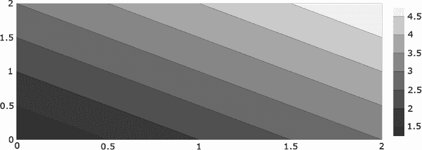

<samp class="SANS_Futura_Std_Book_Oblique_I_11">图 7-10：等高线图示例</samp>

为了定义这些等高线，我们在一个 2D 数组中定义 *z* 值，其中单元格 *(x,y)* 定义了空间中相应 *x* 和 *y* 点的 *z* 值。然后，Python 会自动“连接”这些点，形成等高线。列表 7-16 中的代码生成了这个图。

<samp class="SANS_TheSansMonoCd_W5Regular_11">import plotly.graph_objects as go</samp>

<samp class="SANS_TheSansMonoCd_W5Regular_11">fig = go.Figure(data =</samp>

<samp class="SANS_TheSansMonoCd_W5Regular_11">   go.Contour(</samp>

<samp class="SANS_TheSansMonoCd_W5Regular_11">      z = [[1, 2, 3],</samp>

<samp class="SANS_TheSansMonoCd_W5Regular_11">          [2, 3, 4],</samp>

<samp class="SANS_TheSansMonoCd_W5Regular_11">          [3, 4, 5]]</samp>

<samp class="SANS_TheSansMonoCd_W5Regular_11">   ))</samp>

<samp class="SANS_TheSansMonoCd_W5Regular_11">fig.show()</samp>

<samp class="SANS_Futura_Std_Book_Oblique_I_11">列表 7-16：创建基本的等高线图</samp>

在*z*数组中，哪些单元格*(x,y)*的*z*值为 3？这三个单元格是 (0,2)，(1,1) 和 (2,0)。现在，查看轮廓图并在二维空间中找到这些点*(x,y)*。可视化的*z*值是否为 3？

你可以通过定义几个具有相似*z*值的点来看到这一点。Plotly 完成了所有繁重的可视化工作，包括轮廓图的绘制和着色！如果你想了解更多关于轮廓图的信息（例如，如何自定义*x*和*y*值或轮廓线的形状），请访问 [*https://<wbr>plotly<wbr>.com<wbr>/python<wbr>/contour<wbr>-plots*](https://plotly.com/python/contour-plots)。

在 SVM 模型中的轮廓图中，轮廓线表示那些生成相同确定性值的点，这些点属于某个特定类别。这种“确定性”被称为*决策函数*，它将一个值关联到空间中的每个点。它是机器学习模型的核心。你可以说，决策函数*就是*模型。对于给定的输入*x*，决策函数*f(x)*的符号决定模型*f*是否预测*x*属于某个类别。如果是正值，它属于 X 类；如果是负值，它属于 Y 类。决策函数越是正值或负值，越能确定输入点属于某个类别。

<samp class="SANS_Futura_Std_Bold_Condensed_Oblique_I_11">使用 Dash 加载</samp>

在之前的“使用 Dash 图形”中，你学习了带有 <samp class="SANS_TheSansMonoCd_W5Regular_11">prediction_figure</samp> 参数的 <samp class="SANS_TheSansMonoCd_W5Regular_11">dcc.Graph</samp> 组件。涉及的计算相对复杂，可能需要一些加载或初始化时间。用户可能需要等待，这可能会影响可用性并让使用感到笨重，因此 SVM Explorer 应用的设计者决定将 <samp class="SANS_TheSansMonoCd_W5Regular_11">dcc.Graph</samp> 组件包装在 <samp class="SANS_TheSansMonoCd_W5Regular_11">dcc.Loading</samp> 组件中。这个想法很简单：当你的 Python 解释器处理数据并进行计算时，Dash 会显示一个加载符号（加载旋转器）。始终保持用户的反馈！

图 7-11 展示了不同时间点上加载符号的样子。

<samp class="SANS_Futura_Std_Book_Oblique_I_11">图 7-11：示例 Dash 加载符号</samp>

这个动态加载符号会一直显示，直到加载被 <samp class="SANS_TheSansMonoCd_W5Regular_11">dcc.Loading</samp> 组件包装的 Dash 组件完成为止。

现在让我们看看我们是如何在 SVM Explorer 应用中使用 <samp class="SANS_TheSansMonoCd_W5Regular_11">dcc.Loading</samp> 组件的（见 清单 7-17）。

<samp class="SANS_TheSansMonoCd_W5Regular_11">children=dcc.Loading(</samp>

<samp class="SANS_TheSansMonoCd_W5Regular_11">   className=</samp><samp class="SANS_TheSansMonoCd_W5Regular_11">"graph-wrapper",</samp>

<samp class="SANS_TheSansMonoCd_W5Regular_11">   children=dcc.Graph(id="graph-sklearn-svm", figure=prediction_figure),</samp>

<samp class="SANS_TheSansMonoCd_W5Regular_11">   style={"display": "none"},</samp>

<samp class="SANS_TheSansMonoCd_W5Regular_11">)，</samp>

<samp class="SANS_Futura_Std_Book_Oblique_I_11">Listing 7-17: 设置加载行为</samp>

该函数调用有三个参数：

<samp class="SANS_TheSansMonoCd_W7Bold_B_11">className   </samp>我们将 <samp class="SANS_TheSansMonoCd_W5Regular_11">graph-wrapper</samp> 类定义与 CSS 样式表中的定义关联。这只是为组件定义了一些宽度和高度限制。

<samp class="SANS_TheSansMonoCd_W7Bold_B_11">children   </samp>这是将由 <samp class="SANS_TheSansMonoCd_W5Regular_11">dcc.Loading</samp> 组件包装的 <samp class="SANS_TheSansMonoCd_W5Regular_11">dcc.Graph</samp> 对象。在该对象加载时，应该显示加载符号。

<samp class="SANS_TheSansMonoCd_W7Bold_B_11">style</samp>   我们向元素添加了一组样式属性字典。特别地，我们将 <samp class="SANS_TheSansMonoCd_W5Regular_11">"display"</samp> 属性设置为 <samp class="SANS_TheSansMonoCd_W5Regular_11">"none"</samp>。这本质上隐藏了整个元素。然而，在样式表中，我们将 <samp class="SANS_TheSansMonoCd_W5Regular_11">"display"</samp> 属性覆盖为 <samp class="SANS_TheSansMonoCd_W5Regular_11">"flex"</samp>，这根据可用空间灵活地设置了大小。代码从来不是完美的，这本可以由 SVM 应用的创建者写得更简洁。

事实证明，如果我们运行 SVM Explorer 应用程序，我们甚至看不到加载符号，因为组件加载得非常快。我们怀疑这个应用最初是为较慢版本的 Dash 实现的。但 Dash 的速度和可用性正在迅速提高，因此这个 SVM 应用现在可以快速计算——我们可以简单地跳过 <samp class="SANS_TheSansMonoCd_W5Regular_11">dcc.Loading</samp> 包装器。

有关在 Dash 应用中使用加载旋转器的完整视频教程，请观看视频 “Dash Bootstrap Spinner & Progress Bar”，可在 [*https://<wbr>learnplotlydash<wbr>.com*](https://learnplotlydash.com) 查看。

### <samp class="SANS_Futura_Std_Bold_B_11">Dash 回调</samp>

SVM Explorer 应用是一个高级应用，包含许多相互作用的代码部分。到目前为止，我们主要集中在你在其他应用中尚未见过的独立组件上。现在是时候再次从更大的视角来看，探索不同组件如何交互。

为了快速了解应该集中在哪些地方，我们从 Dash 框架提供的回调图开始，当你运行应用时并设置 <samp class="SANS_TheSansMonoCd_W5Regular_11">debug=True</samp>（参见 Listing 7-18）。

<samp class="SANS_TheSansMonoCd_W5Regular_11"># 运行服务器</samp>

<samp class="SANS_TheSansMonoCd_W5Regular_11">if __name__ == "__main__":</samp>

<samp class="SANS_TheSansMonoCd_W5Regular_11">   app.run_server(debug=True)</samp>

<samp class="SANS_Futura_Std_Book_Oblique_I_11">列表 7-18: 启用调试</samp>

你现在可以通过 图 7-12 中显示的按钮菜单访问自动生成的回调图。

<samp class="SANS_Futura_Std_Book_Oblique_I_11">图 7-12: 回调图按钮菜单</samp>

这个按钮菜单应该出现在你浏览器中的 Dash 应用程序的右下角。点击 **Callback Graph** 查看 图 7-13 中显示的内容。

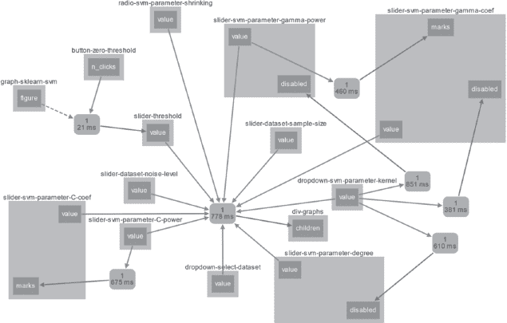

<samp class="SANS_Futura_Std_Book_Oblique_I_11">图 7-13: SVM Explorer 应用的回调图</samp>

框框上方的名称是你在 *app.py* 文件中定义的 Dash 组件。列表 7-19 显示了一个命名滑块的代码示例。

<samp class="SANS_TheSansMonoCd_W5Regular_11">drc.NamedSlider(</samp>

<samp class="SANS_TheSansMonoCd_W5Regular_11">   name="Cost (C)",</samp>

<samp class="SANS_TheSansMonoCd_W5Regular_11">   id="slider-svm-parameter-C-power",</samp>

<samp class="SANS_TheSansMonoCd_W5Regular_11">   min=-2,</samp>

<samp class="SANS_TheSansMonoCd_W5Regular_11">   max=4,</samp>

<samp class="SANS_TheSansMonoCd_W5Regular_11">   value=</samp><samp class="SANS_TheSansMonoCd_W5Regular_11">0,</samp>

<samp class="SANS_TheSansMonoCd_W5Regular_11">   marks={</samp>

<samp class="SANS_TheSansMonoCd_W5Regular_11">      i: "{}".format(10 ** i)</samp>

<samp class="SANS_TheSansMonoCd_W5Regular_11">      for i in range(-2, 5)</samp>

<samp class="SANS_TheSansMonoCd_W5Regular_11">   },</samp>

<samp class="SANS_TheSansMonoCd_W5Regular_11">)</samp>

<samp class="SANS_Futura_Std_Book_Oblique_I_11">列表 7-19: 命名滑块组件定义，展示回调图中的名称来自哪里</samp>

你可以在上面四个框中的一个找到名称 <samp class="SANS_TheSansMonoCd_W5Regular_11">slider-svm-parameter-C-power</samp>。通过命名滑块，你将值输入到 <samp class="SANS_TheSansMonoCd_W5Regular_11">slider-svm-parameter-C-coef</samp> 组件。所有组件的值最终都输入到包含所有 SVM 图表的 <samp class="SANS_TheSansMonoCd_W5Regular_11">div-graphs</samp> 组件。

所以，让我们关注回调函数，它将所有这些输入映射到位于 *app.py* 主文件中第 346 至 453 行的单一输出组件 <samp class="SANS_TheSansMonoCd_W5Regular_11">div-graphs</samp>。特别是，我们将从输入和输出注解以及函数定义开始，这些内容显示在 列表 7-20 中。

<samp class="SANS_TheSansMonoCd_W5Regular_11">@app.callback(</samp>

<samp class="SANS_TheSansMonoCd_W5Regular_11">   Output("div-graphs", "children"),</samp>

<samp class="SANS_TheSansMonoCd_W5Regular_11">   [</samp>

<samp class="SANS_TheSansMonoCd_W5Regular_11">      Input("dropdown-svm-parameter-kernel", "value"),</samp>

<samp class="SANS_TheSansMonoCd_W5Regular_11">      Input("slider-svm-parameter-degree", "value"),</samp>

<samp class="SANS_TheSansMonoCd_W5Regular_11">      Input("slider-svm-parameter-C-coef", "value"),</samp>

<samp class="SANS_TheSansMonoCd_W5Regular_11">      Input("slider-svm-parameter-C-power", "value"),</samp>

<samp class="SANS_TheSansMonoCd_W5Regular_11">      Input("slider-svm-parameter-gamma-coef", "value"),</samp>

<samp class="SANS_TheSansMonoCd_W5Regular_11">      Input("slider-svm-parameter-gamma-power", "value"),</samp>

<samp class="SANS_TheSansMonoCd_W5Regular_11">      Input("dropdown-select-dataset", "value"),</samp>

<samp class="SANS_TheSansMonoCd_W5Regular_11">      Input("slider-dataset-noise-level", "value"),</samp>

<samp class="SANS_TheSansMonoCd_W5Regular_11">      Input("radio-svm-parameter-shrinking", "value"),</samp>

<samp class="SANS_TheSansMonoCd_W5Regular_11">      Input("slider-threshold", "value"),</samp>

<samp class="SANS_TheSansMonoCd_W5Regular_11">      Input("slider-dataset-sample-size", "value"),</samp>

<samp class="SANS_TheSansMonoCd_W5Regular_11">   ],</samp>

<samp class="SANS_TheSansMonoCd_W5Regular_11">)</samp>

<samp class="SANS_TheSansMonoCd_W5Regular_11">def update_svm_graph(</samp>

<samp class="SANS_TheSansMonoCd_W5Regular_11">   kernel,</samp>

<samp class="SANS_TheSansMonoCd_W5Regular_11">   degree,</samp>

<samp class="SANS_TheSansMonoCd_W5Regular_11">   C_coef,</samp>

<samp class="SANS_TheSansMonoCd_W5Regular_11">   C_power,</samp>

<samp class="SANS_TheSansMonoCd_W5Regular_11">   gamma_coef,</samp>

<samp class="SANS_TheSansMonoCd_W5Regular_11">   gamma_power,</samp>

<samp class="SANS_TheSansMonoCd_W5Regular_11">   dataset,</samp>

<samp class="SANS_TheSansMonoCd_W5Regular_11">   noise,</samp>

<samp class="SANS_TheSansMonoCd_W5Regular_11">   shrinking,</samp>

<samp class="SANS_TheSansMonoCd_W5Regular_11">   threshold,</samp>

<samp class="SANS_TheSansMonoCd_W5Regular_11">   sample_size,</samp>

<samp class="SANS_TheSansMonoCd_W5Regular_11">):</samp>

<samp class="SANS_Futura_Std_Book_Oblique_I_11">列出 7-20: SVM 图的输入和输出注释</samp>

函数不是只有一个输入，而是有一个输入列表，如回调图中所示。所有这些输入都是计算 SVM 模型所必需的。然后使用这个 SVM 模型生成你在 SVM Explorer 应用中看到的所有图表。

列出 7-21 显示了生成不同图表的代码。

<samp class="SANS_TheSansMonoCd_W5Regular_11">   # … 为了可读性，省略模型计算 …</samp>

<samp class="SANS_TheSansMonoCd_W5Regular_11">   </samp><samp class="SANS_TheSansMonoCd_W5Regular_11">return [</samp>

<samp class="SANS_TheSansMonoCd_W5Regular_11">      html.Div(</samp>

<samp class="SANS_TheSansMonoCd_W5Regular_11">         id="svm-graph-container",</samp>

<samp class="SANS_TheSansMonoCd_W5Regular_11">         children=</samp><samp class="SANS_TheSansMonoCd_W5Regular_11">dcc.Loading(</samp>

<samp class="SANS_TheSansMonoCd_W5Regular_11">            </samp><samp class="SANS_TheSansMonoCd_W5Regular_11">className="graph-wrapper",</samp>

<samp class="SANS_TheSansMonoCd_W5Regular_11">            children=dcc.Graph(id="graph-sklearn-svm",</samp>

<samp class="SANS_TheSansMonoCd_W5Regular_11">                               figure=prediction_figure),</samp>

<samp class="SANS_TheSansMonoCd_W5Regular_11">           style={"display": "none"},</samp>

<samp class="SANS_TheSansMonoCd_W5Regular_11">        ),</samp>

<samp class="SANS_TheSansMonoCd_W5Regular_11">      ),</samp>

<samp class="SANS_TheSansMonoCd_W5Regular_11">      html.Div(</samp>

<samp class="SANS_TheSansMonoCd_W5Regular_11">        id="graphs-container",</samp>

<samp class="SANS_TheSansMonoCd_W5Regular_11">        children=[</samp>

<samp class="SANS_TheSansMonoCd_W5Regular_11">           dcc.Loading(</samp>

<samp class="SANS_TheSansMonoCd_W5Regular_11">              className="graph-wrapper",</samp>

<samp class="SANS_TheSansMonoCd_W5Regular_11">              children=dcc.Graph(id=</samp><samp class="SANS_TheSansMonoCd_W5Regular_11">"graph-line-roc-curve",</samp>

<samp class="SANS_TheSansMonoCd_W5Regular_11">                                 figure=roc_figure),</samp>

<samp class="SANS_TheSansMonoCd_W5Regular_11">           ),</samp>

<samp class="SANS_TheSansMonoCd_W5Regular_11">           dcc.Loading(</samp>

<samp class="SANS_TheSansMonoCd_W5Regular_11">              className="graph-wrapper",</samp>

<samp class="SANS_TheSansMonoCd_W5Regular_11">              children=dcc.Graph(</samp>

<samp class="SANS_TheSansMonoCd_W5Regular_11">                 id="graph-pie-confusion-matrix",</samp>

<samp class="SANS_TheSansMonoCd_W5Regular_11">                 figure=confusion_figure</samp>

<samp class="SANS_TheSansMonoCd_W5Regular_11">              ),</samp>

<samp class="SANS_TheSansMonoCd_W5Regular_11">           ),</samp>

<samp class="SANS_TheSansMonoCd_W5Regular_11">        </samp><samp class="SANS_TheSansMonoCd_W5Regular_11">],</samp>

<samp class="SANS_TheSansMonoCd_W5Regular_11">    </samp><samp class="SANS_TheSansMonoCd_W5Regular_11">),</samp>

<samp class="SANS_TheSansMonoCd_W5Regular_11">      ]</samp>

<samp class="SANS_Futura_Std_Book_Oblique_I_11">列表 7-21：更新 svm 图形函数的返回值，该函数在 SVM Explorer 应用中生成图形</samp>

返回值是一个包含两个 <samp class="SANS_TheSansMonoCd_W5Regular_11">Div</samp> 元素的列表。第一个包含本章前面“创建 Plotly 轮廓图”部分讨论的预测图。第二个包含两个 <samp class="SANS_TheSansMonoCd_W5Regular_11">dcc.Graph</samp> 元素：一张折线图和一张饼图。图 7-14 显示了这三张生成的图表。

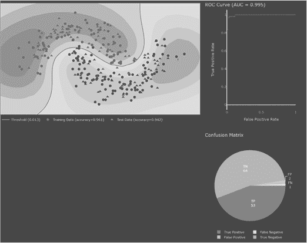

<samp class="SANS_Futura_Std_Book_Oblique_I_11">图 7-14：三个 dcc.Graph</samp> <samp class="SANS_Futura_Std_Book_Oblique_I_11">元素</samp>

### <samp class="SANS_Futura_Std_Bold_B_11">总结</samp>

本章涵盖了许多高级 Dash 概念。你学习了强大的 SVM 分类算法，以及仪表板如何帮助你可视化机器学习模型。你学习了如何将 NumPy 和 scikit-learn 集成到仪表板应用程序中，并如何创建可复用的组件。你还学习了或加深了对 Dash HTML 组件的理解，如 <samp class="SANS_TheSansMonoCd_W5Regular_11">html.Div</samp>、<samp class="SANS_TheSansMonoCd_W5Regular_11">html.A</samp>、<samp class="SANS_TheSansMonoCd_W5Regular_11">html.Section</samp>、<samp class="SANS_TheSansMonoCd_W5Regular_11">html.P</samp>、<samp class="SANS_TheSansMonoCd_W5Regular_11">html.Button</samp> 和 <samp class="SANS_TheSansMonoCd_W5Regular_11">html.H2</samp>，以及标准 Dash 组件，如 <samp class="SANS_TheSansMonoCd_W5Regular_11">dcc.Graph</samp>、<samp class="SANS_TheSansMonoCd_W5Regular_11">dcc.Slider</samp> 和 <samp class="SANS_TheSansMonoCd_W5Regular_11">dcc.Dropdown</samp>。

现在你掌握了创建复杂仪表板应用程序的技能，并可以深入探索图库，学习关于高级 Dash 组件和功能的知识。我们不仅仅给了你鱼；我们告诉了你如何以及在哪里自己去抓鱼。图库就像是充满鱼的海洋，如果你总是渴望更多，你就知道该去哪儿！

### <samp class="SANS_Futura_Std_Bold_B_11">资源</samp>

要更深入地了解 SVM Explorer 应用程序，欢迎查看以下由应用程序创建者之一邢涵推荐的资源：

+   分类器比较：[*https://<wbr>scikit<wbr>-learn<wbr>.org<wbr>/stable<wbr>/auto<wbr>_examples<wbr>/classification<wbr>/plot<wbr>_classifier<wbr>_comparison<wbr>.xhtml*](https://scikit-learn.org/stable/auto_examples/classification/plot_classifier_comparison.xhtml)

+   ROC 指标：[*https://<wbr>scikit<wbr>-learn<wbr>.org<wbr>/stable<wbr>/auto<wbr>_examples<wbr>/model<wbr>_selection<wbr>/plot<wbr>_roc<wbr>.xhtml*](https://scikit-learn.org/stable/auto_examples/model_selection/plot_roc.xhtml)

+   混淆矩阵：[*https://<wbr>scikit<wbr>-learn<wbr>.org<wbr>/stable<wbr>/modules<wbr>/model<wbr>_evaluation<wbr>.xhtml#confusion<wbr>-matrix*](https://scikit-learn.org/stable/modules/model_evaluation.xhtml#confusion-matrix)

+   SVM 分类器 (SVC): [*https://<wbr>scikit<wbr>-learn<wbr>.org<wbr>/stable<wbr>/modules<wbr>/generated<wbr>/sklearn<wbr>.svm<wbr>.SVC<wbr>.xhtml*](https://scikit-learn.org/stable/modules/generated/sklearn.svm.SVC.xhtml)

+   “支持向量分类 (SVC) 实用指南”: [*https://<wbr>www<wbr>.csie<wbr>.ntu<wbr>.edu<wbr>.tw<wbr>/~cjlin<wbr>/papers<wbr>/guide<wbr>/guide<wbr>.pdf*](https://www.csie.ntu.edu.tw/~cjlin/papers/guide/guide.pdf)
