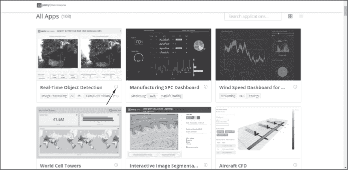
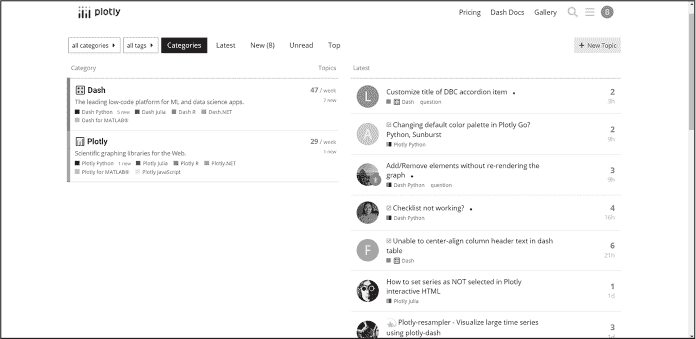
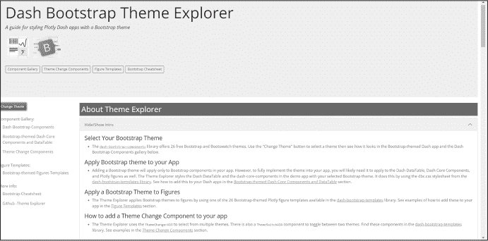
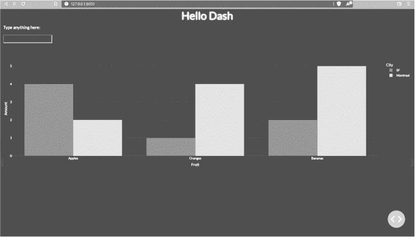
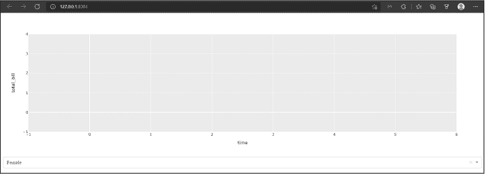
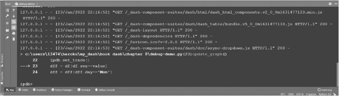
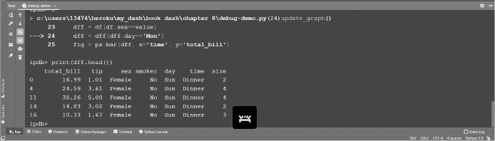
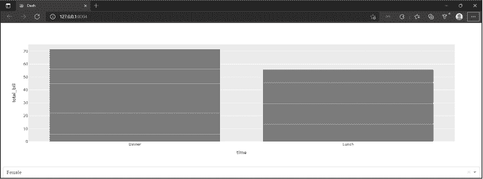
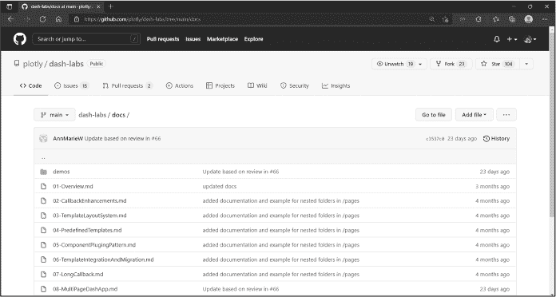

## <samp class="SANS_Futura_Std_Bold_Condensed_B_11">8</samp> <samp class="SANS_Dogma_OT_Bold_B_11">技巧与窍门</samp>

在丰富的 Dash 库中仍然有很多内容等待发现。在本章中，我们整理了一些提示，帮助你在 Dash 学习之旅中迈出下一步。这些是我们在学习 Dash 和开始构建更高级应用程序时发现的有用提示。

我们将深入了解 Dash 企业应用画廊，在这里你可以发现用于构建特定行业内更高级应用的开源代码。你还将学会利用 Plotly 社区帮助你克服开发过程中的编码难题。我们将分享一些 Bootstrap 主题和调试工具，帮助你美化应用并解决 bug。我们还将带你浏览 dash-labs 仓库，这是一个不断开发前沿 Dash 特性的地方。最后，本章将为你提供一套 Dash 学习资源，提升你的知识水平，让用 Dash 编程变得更加有趣和令人兴奋。

### <samp class="SANS_Futura_Std_Bold_B_11">Dash 企业应用画廊</samp>

正如我们在本书中多次提到的，了解更多高级和复杂 Dash 应用的一种有帮助的方式是探索 Dash 企业应用画廊（[*https://<wbr>dash<wbr>.gallery<wbr>/Portal*](https://dash.gallery/Portal)）。这些应用中的许多都是开源的，这意味着你可以在 GitHub 上完全访问其代码。要查找某个特定应用是否为开源应用，请点击应用卡片右下角的信息图标（在图 8-1 中指出）；一个弹窗将会打开，如果它写着类似“未经认证：任何人都可以访问此应用”的信息，那么它就是开源的。此信息卡片还会告诉你该应用使用的编程语言；正如你可能预料的，大多数应用都是用 Python 编写的。

<samp class="SANS_Futura_Std_Book_Oblique_I_11">图 8-1：Dash 画廊中应用卡片上的信息图标</samp>

画廊内容正在不断增加。为了找到最符合你需求的应用，你可以通过点击页面顶部的特定行业来筛选页面。有一个小提示：在浏览应用时，想一想你自己当前应用项目的布局需求。如果你对某个特定布局感兴趣，可以访问该应用的开源代码，看看是否可以在你的应用中复制这个布局。

### <samp class="SANS_Futura_Std_Bold_B_11">通过 Plotly 论坛增强你的学习</samp>

Plotly 论坛 ([*https://<wbr>community<wbr>.plotly<wbr>.com*](https://community.plotly.com)) 是一个为 Plotly 和 Dash 提供支持的社区论坛。如果你还没有在 Plotly 论坛上注册账户，现在就应该开设一个。在你使用 Dash 开发的过程中，论坛社区的成员会帮助你更好地了解 Dash 和 Plotly 图表库，克服障碍，解决特定的 bug。即使你现在的代码没有问题，我们也建议你花时间进入论坛，阅读一些你感兴趣的主题的帖子。通过阅读其他用户的经验，你会学到很多；最重要的是，浏览论坛还会帮助你理解如何创建主题、提供有用的答案，以及以一种能得到有效回答的方式提问。你很快就会发现论坛如何推动社区的成长。图 8-2 展示了论坛的登录页面；当然，每次你访问时，它会有所不同，因此看起来不会完全像这样。

<samp class="SANS_Futura_Std_Book_Oblique_I_11">图 8-2：Plotly 论坛登录页面</samp>

页面左侧是主要类别，*Dash* 和 *Plotly*。右侧则是这两个类别中最新的帖子，无论主题是什么。

论坛社区通常非常活跃并且乐于助人。为了确保你的问题能够被看到并得到回答，请始终使用适合你问题的帖子标题，并明确说明你遇到的问题；同时，确保你添加了与问题相关的代码。这个代码通常被称为 *最小工作示例*，它可以让潜在的回答者复制你的代码并在他们的系统上测试，看看是否能够复现相同的问题或错误。确保代码格式正确，并在编辑工具栏中使用预格式化文本符号<samp class="SANS_TheSansMonoCd_W5Regular_11"></></samp>。

随着你在 Dash 中积累更多经验，记得回馈社区，帮助他人回答问题。最后，我们鼓励你通过使用 *展示与分享* 标签，向社区分享你创建的应用。

### <samp class="SANS_Futura_Std_Bold_B_11">应用主题浏览器</samp>

在第五章中，你学习了如何将 Bootstrap 主题添加到你的应用中，示例如下：

<samp class="SANS_TheSansMonoCd_W5Regular_11">app = Dash(__name__, external_stylesheets=[dbc.themes.BOOTSTRAP])</samp>

这些主题只会应用于你应用中的 Bootstrap 组件。要将一个主题完全应用到你的应用中，你还需要将该主题应用于 Dash <samp class="SANS_TheSansMonoCd_W5Regular_11">DataTable</samp>、Dash 核心组件和 Plotly 图表。可以通过 [*https://<wbr>hellodash<wbr>.pythonanywhere<wbr>.com*](https://hellodash.pythonanywhere.com) 上的 *Dash Bootstrap 主题浏览器*（如 图 8-3 所示），选择一个主题，并查看它在页面上所有组件、文本和图表的效果。要查看可用的主题，点击页面左侧的 **更改主题**。一个面板会滑出并显示主题列表。点击一个主题，看看下拉菜单、复选框组件、标题、文本、图表和 <samp class="SANS_TheSansMonoCd_W5Regular_11">DataTable</samp> 在样式和颜色上的变化。

<samp class="SANS_Futura_Std_Book_Oblique_I_11">图 8-3: Dash Bootstrap 主题浏览器的登录页面</samp>

选择一个适合你应用的主题，并按照以下四个步骤将其添加到应用的所有元素中。我们将在一个示例应用中实现 <samp class="SANS_TheSansMonoCd_W5Regular_11">VAPOR</samp> 主题；你可以在书籍资源的 *第八章* 文件夹中找到完整的 *app.py* 文件，网址为 [*https://<wbr>github<wbr>.com<wbr>/DashBookProject<wbr>/Plotly<wbr>-Dash*](https://github.com/DashBookProject/Plotly-Dash)。

1.  安装 *dash_bootstrap_templates* 库，并导入 *load_figure_template* 和 *dash_bootstrap_components*。为此，打开 PyCharm 终端并输入：

<samp class="SANS_TheSansMonoCd_W5Regular_11">$</samp> <samp class="SANS_TheSansMonoCd_W7Bold_B_11">pip install dash-bootstrap-templates</samp>

要导入必要的库，请在主应用文件中输入以下内容：

<samp class="SANS_TheSansMonoCd_W7Bold_B_11">import dash_bootstrap_components as dbc</samp>

<samp class="SANS_TheSansMonoCd_W7Bold_B_11">from dash_bootstrap_templates import load_figure_template</samp>

2.  将预构建的 Dash Bootstrap 样式表添加到应用中，并选择一个主题。这里我们选择了 <samp class="SANS_TheSansMonoCd_W5Regular_11">VAPOR</samp>。确保在替换 Dash 实例化时保持大写样式：

<samp class="SANS_TheSansMonoCd_W5Regular_11">dbc_css = "</samp><samp class="SANS_TheSansMonoCd_W5Regular_11">https://cdn.jsdelivr.net/gh/AnnMarieW/dash-bootstrap-templates

@V1.0.4/dbc.min.css"</samp>

<samp class="SANS_TheSansMonoCd_W5Regular_11">app = Dash(__name__, external_stylesheets=</samp><samp class="SANS_TheSansMonoCd_W5Regular_11">[dbc.themes.VAPOR, dbc_css])</samp>

<samp class="SANS_TheSansMonoCd_W5Regular_11">load_figure_template(["vapor"])</samp>

3.  将选定的主题合并到条形图的 <samp class="SANS_TheSansMonoCd_W5Regular_11">template</samp> 属性中：

<samp class="SANS_TheSansMonoCd_W5Regular_11">fig = px.bar(df, x="Fruit", y="Amount", color="City", barmode="group",</samp>

template="vapor")</samp>

4.  最后，在应用的外部容器中添加 <samp class="SANS_TheSansMonoCd_W5Regular_11">className="dbc"</samp>，如下代码所示：

<samp class="SANS_TheSansMonoCd_W5Regular_11">app.layout = dbc.Container([</samp>

<samp class="SANS_TheSansMonoCd_W5Regular_11">    html.H1("Hello Dash", style={'textAlign': 'center'}),</samp>

<samp class="SANS_TheSansMonoCd_W5Regular_11">    html.P("在这里输入任何内容："),</samp>

<samp class="SANS_TheSansMonoCd_W5Regular_11">    dcc.Input(className="mb-2"),</samp>

<samp class="SANS_TheSansMonoCd_W5Regular_11">    dcc.Graph(</samp>

<samp class="SANS_TheSansMonoCd_W5Regular_11">       id='example-graph',</samp>

<samp class="SANS_TheSansMonoCd_W5Regular_11">       figure=fig</samp>

<samp class="SANS_TheSansMonoCd_W5Regular_11">    )</samp>

<samp class="SANS_TheSansMonoCd_W5Regular_11">],</samp>

<samp class="SANS_TheSansMonoCd_W5Regular_11">    fluid=True,</samp>

<samp class="SANS_TheSansMonoCd_W5Regular_11">    </samp><samp class="SANS_TheSansMonoCd_W7Bold_B_11">className="dbc"</samp>

<samp class="SANS_TheSansMonoCd_W5Regular_11">)</samp>

在此示例中使用的 *app.py* 文件在执行时应生成 图 8-4 中所示的应用。

<samp class="SANS_Futura_Std_Book_Oblique_I_11">图 8-4：完整的示例应用</samp>

### <samp class="SANS_Futura_Std_Bold_B_11">调试 Dash 应用</samp>

知道如何有效地调试你的应用程序，将在出现错误时节省你大量的时间和试错成本。教授你完整的调试技能超出了本章的范围；然而，我们在这里整理了一些材料，帮助你入门。

Python 提供了一些免费的调试器包。对于 Dash，我们推荐使用 <samp class="SANS_TheSansMonoCd_W5Regular_11">ipdb</samp> 包。要安装它，请打开终端并输入：

<samp class="SANS_TheSansMonoCd_W5Regular_11">$</samp> <samp class="SANS_TheSansMonoCd_W7Bold_B_11">pip install ipdb</samp>

让我们看一个调试可能会有帮助的示例。在书本的代码中找到 *debug-demo.py* 文件，链接为 [*https://<wbr>github<wbr>.com<wbr>/DashBookProject<wbr>/Plotly<wbr>-Dash*](https://github.com/DashBookProject/Plotly-Dash)。当你在计算机上运行它时，你应该会看到类似 图 8-5 的内容。这个应用应该能够绘制账单总额随时间的变化。

<samp class="SANS_Futura_Std_Book_Oblique_I_11">图 8-5：执行后的</samp> <samp class="SANS_Futura_Std_Book_11">debug-demo.py</samp> <samp class="SANS_Futura_Std_Book_Oblique_I_11">应用</samp>

这真让人沮丧：我们的应用没有抛出任何错误，但显然有问题，因为图表没有显示任何数据。让我们调试一下应用，找出问题所在。

首先，取消注释 *debug-demo.py* 中的第一行代码，<samp class="SANS_TheSansMonoCd_W5Regular_11">import ipdb</samp>。然后，在回调函数中的第一行代码激活调试功能，通过取消注释这一行：

<samp class="SANS_TheSansMonoCd_W5Regular_11">ipdb.set_trace()</samp>

当然，你可以调试应用程序中的任何部分；在我们的案例中，我们将从构建图表的回调函数开始，因为问题出在图表上。最后，关闭原生 Dash 调试机制，并禁用应用程序的多线程，以避免在多个 <samp class="SANS_TheSansMonoCd_W5Regular_11">ipdb</samp> 实例重叠时破坏会话，正如在 *debug-demo.py* 中所做的那样：

<samp class="SANS_TheSansMonoCd_W5Regular_11">if __name__ == '__main__':</samp>

<samp class="SANS_TheSansMonoCd_W5Regular_11">   app.run_server(</samp><samp class="SANS_TheSansMonoCd_W7Bold_B_11">debug=False</samp><samp class="SANS_TheSansMonoCd_W5Regular_11">,</samp> <samp class="SANS_TheSansMonoCd_W7Bold_B_11">threaded=False</samp><samp class="SANS_TheSansMonoCd_W5Regular_11">, port=8004)</samp>

保存并运行修改后的 *debug-demo.py* 文件，然后点击 HTTP 链接在浏览器中打开你的应用程序。返回到运行工具窗口，你应该会看到类似于图 8-6 的内容。

<samp class="SANS_Futura_Std_Book_Oblique_I_11">图 8-6：在 PyCharm 运行窗口中激活调试</samp>

如果你尝试在运行窗口中执行 <samp class="SANS_TheSansMonoCd_W5Regular_11">print(dff.head())</samp>，你会得到一个错误，提示 <samp class="SANS_TheSansMonoCd_W5Regular_11">dff</samp> 未定义。这是因为创建并定义 <samp class="SANS_TheSansMonoCd_W5Regular_11">dff</samp> 的代码行位于第 23 行，而这一行尚未执行。为了让调试器执行下一行代码，请在运行窗口中输入小写的 **n**。现在，如果你再次执行 <samp class="SANS_TheSansMonoCd_W5Regular_11">print(dff.head())</samp>，你应该会看到 DataFrame 的前五行，如图 8-7 所示。

<samp class="SANS_Futura_Std_Book_Oblique_I_11">图 8-7：在运行窗口中打印的 DataFrame</samp>

然而，当你按下 **n** 执行代码行 24 并再次输入 <samp class="SANS_TheSansMonoCd_W5Regular_11">print(dff.head())</samp> 时，你将在运行窗口中看到一个通知，告诉你 DataFrame 是空的：

<samp class="SANS_TheSansMonoCd_W5Regular_11">Empty DataFrame</samp>

<samp class="SANS_TheSansMonoCd_W5Regular_11">Columns: [total_bill, tip, sex, smoker, day, time, size]</samp>

<samp class="SANS_TheSansMonoCd_W5Regular_11">Index: []</samp>

这是因为第 24 行过滤了 <samp class="SANS_TheSansMonoCd_W5Regular_11">day</samp> 列，只保留了值为 <samp class="SANS_TheSansMonoCd_W5Regular_11">'Mon'</samp> 的行。看起来没有任何行的 <samp class="SANS_TheSansMonoCd_W5Regular_11">day</samp> 列值是 <samp class="SANS_TheSansMonoCd_W5Regular_11">'Mon'</samp>，这就是 DataFrame 为空的原因。要检查 <samp class="SANS_TheSansMonoCd_W5Regular_11">day</samp> 列中存在哪些唯一值，可以在运行窗口输入 <samp class="SANS_TheSansMonoCd_W7Bold_B_11">print(df.day.unique())</samp>。你会发现 <samp class="SANS_TheSansMonoCd_W5Regular_11">day</samp> 列中只有 <samp class="SANS_TheSansMonoCd_W5Regular_11">['Sun' 'Sat' 'Thur' 'Fri']</samp> 这些值。这就是为什么在执行应用时图表没有绘制任何内容：没有数据可以绘制。

要修复你的应用，将第 24 行中的 <samp class="SANS_TheSansMonoCd_W5Regular_11">'Mon'</samp> 改为 <samp class="SANS_TheSansMonoCd_W5Regular_11">'Fri'</samp>，然后重新启动 *debug-demo.py* 文件。（如果你的应用无法重新启动，可以将端口号从 8004 改为其他任何值。）在终端中，你可以直接输入 **c** 来继续程序执行，直到完成，而不是为每行代码输入 **n**。因为应用中没有其他错误（断点），所以它成功执行，并且应该像 图 8-8 一样。

<samp class="SANS_Futura_Std_Book_Oblique_I_11">图 8-8：调试后的</samp> <samp class="SANS_Futura_Std_Book_11">debug-demo.py</samp> <samp class="SANS_Futura_Std_Book_Oblique_I_11">应用成功执行</samp>

如需查看 <samp class="SANS_TheSansMonoCd_W5Regular_11">ipdb</samp> 的备忘单，请访问 [*https://<wbr>wangchuan<wbr>.github<wbr>.io<wbr>/coding<wbr>/2017<wbr>/07<wbr>/12<wbr>/ipdb<wbr>-cheat<wbr>-sheet<wbr>.xhtml<wbr>*](https://wangchuan.github.io/coding/2017/07/12/ipdb-cheat-sheet.xhtml)。

调试愉快！

### <samp class="SANS_Futura_Std_Bold_B_11">dash-labs</samp>

*dash-labs* 是由 Plotly 启动的一个 GitHub 仓库，作为潜在未来 Dash 功能的技术预览，位于 [*https://<wbr>github<wbr>.com<wbr>/plotly<wbr>/dash<wbr>-labs*](https://github.com/plotly/dash-labs)。社区的反馈和积极参与对这个仓库的成功至关重要，因为功能是为社区并在社区的帮助下构建的。过去几年在 dash-labs 中开发的一些功能包括灵活的回调签名 ([*https://<wbr>dash<wbr>.plotly<wbr>.com<wbr>/flexible<wbr>-callback<wbr>-signatures*](https://dash.plotly.com/flexible-callback-signatures)) 和长回调 ([*https://<wbr>dash<wbr>.plotly<wbr>.com<wbr>/long<wbr>-callbacks*](https://dash.plotly.com/long-callbacks))。

在撰写本文时，dash-labs 中的两个活跃项目包括多页面应用特性，用于快速、无缝地编写多页面应用，以及 Dashdown 特性，允许在 Dash 中执行 Markdown 文档。要开始探索 dash-labs，请点击 dash-labs 仓库中的 ***docs*** 文件夹（图 8-9），了解更多已经开发的功能。

<samp class="SANS_Futura_Std_Book_Oblique_I_11">图 8-9：dash-labs 仓库中的</samp> <samp class="SANS_Futura_Std_Book_11">docs</samp> <samp class="SANS_Futura_Std_Book_Oblique_I_11">文件夹</samp>

为了亲自尝试一些功能，你可以 <samp class="SANS_TheSansMonoCd_W5Regular_11">git clone dash-labs</samp> 并运行位于 *demos* 文件夹中的任何 *app.py* 或 *app_dbc.py* 文件。

### <samp class="SANS_Futura_Std_Bold_B_11">使用 Black 格式化代码</samp>

以一种良好的格式编写代码不仅使代码更美观，而且对可读性至关重要。随着你技能的提升，你所编写的程序将变得越来越大、越来越复杂。如果这些程序没有良好的格式化，你很容易在自己的代码中迷失。根据官方 Python 风格指南 PEP8 手动格式化代码非常耗时。幸运的是，我们有了 Python 工具 *Black*：一个代码格式化工具。

让我们看看 Black 的实际效果。首先安装 Black：

<samp class="SANS_TheSansMonoCd_W5Regular_11">$</samp> <samp class="SANS_TheSansMonoCd_W7Bold_B_11">pip install black</samp>

然后从 [*https://<wbr>github<wbr>.com<wbr>/DashBookProject<wbr>/Plotly<wbr>-Dash*](https://github.com/DashBookProject/Plotly-Dash) 下载 *pre-black-formatting.py* 文件并打开它（列表 8-1）。

<samp class="SANS_TheSansMonoCd_W5Regular_11">from dash import Dash, dcc, html</samp>

<samp class="SANS_TheSansMonoCd_W5Regular_11">import plotly.express as px</samp>

<samp class="SANS_TheSansMonoCd_W5Regular_11">import pandas as pd</samp>

<samp class="SANS_TheSansMonoCd_W5Regular_11">app = Dash(__name__)</samp>

<samp class="SANS_TheSansMonoCd_W5Regular_11">df = pd.DataFrame({</samp>

<samp class="SANS_TheSansMonoCd_W5Regular_11">   </samp>❶<samp class="SANS_TheSansMonoCd_W5Regular_11"> 'Fruit': ["Apples", "Oranges", "Bananas", "Apples", "Oranges",</samp>

<samp class="SANS_TheSansMonoCd_W5Regular_11">              "Bananas"],</samp>

<samp class="SANS_TheSansMonoCd_W5Regular_11">      "Amount": [4, 1, 2, 2, 4, 5],</samp>

<samp class="SANS_TheSansMonoCd_W5Regular_11">      "City": ["SF", "SF", "SF", "Montreal", "Montreal", "Montreal"]</samp>

<samp class="SANS_TheSansMonoCd_W5Regular_11">})</samp>

❷ <samp class="SANS_TheSansMonoCd_W5Regular_11">fig=px.bar(df, x=</samp><samp class="SANS_TheSansMonoCd_W5Regular_11">"Fruit", y="Amount", color="City")</samp>

<samp class="SANS_TheSansMonoCd_W5Regular_11">app.layout = html.Div([</samp>

<samp class="SANS_TheSansMonoCd_W5Regular_11">   html.H1("Fruit Analysis App", style={'textAlign':'center'}),</samp>

<samp class="SANS_TheSansMonoCd_W5Regular_11">   </samp>❸  <samp class="SANS_TheSansMonoCd_W5Regular_11">dcc.Graph(</samp>

<samp class="SANS_TheSansMonoCd_W5Regular_11">      id='example-graph',</samp>

<samp class="SANS_TheSansMonoCd_W5Regular_11">      figure=fig</samp>

<samp class="SANS_TheSansMonoCd_W5Regular_11">   )</samp>

<samp class="SANS_TheSansMonoCd_W5Regular_11">],</samp>

<samp class="SANS_TheSansMonoCd_W5Regular_11">)</samp>

<samp class="SANS_TheSansMonoCd_W5Regular_11">if __name__ == '__main__':</samp>

<samp class="SANS_TheSansMonoCd_W5Regular_11">   app.run_server(debug=True)</samp>

<samp class="SANS_Futura_Std_Book_Oblique_I_11">Listing 8-1: The</samp> <samp class="SANS_Futura_Std_Book_11">pre-black-formatting.py</samp> <samp class="SANS_Futura_Std_Book_Oblique_I_11">file</samp>

代码中有一些格式不一致的地方。例如，<samp class="SANS_TheSansMonoCd_W5Regular_11">Fruit</samp> 键 ❶ 被单引号包围，而 <samp class="SANS_TheSansMonoCd_W5Regular_11">Amount</samp> 和 <samp class="SANS_TheSansMonoCd_W5Regular_11">City</samp> 键则被双引号包围。同样，<samp class="SANS_TheSansMonoCd_W5Regular_11">Fruit</samp> 键的值跨越了两行代码，而其他键的值则写在一行代码上。此外，在构建 Plotly Express 柱状图的那一行 ❷，我们可以看到等号（<samp class="SANS_TheSansMonoCd_W5Regular_11">fig=px.bar</samp>）前后没有空格。最后，我们看到 Dash 的 <samp class="SANS_TheSansMonoCd_W5Regular_11">Graph</samp> 组件跨越了四行代码 ❸，而它上面的 <samp class="SANS_TheSansMonoCd_W5Regular_11">html.H1</samp> 组件则写在了一行代码上。代码中还有一些其他的不一致，看看在使用 Black 前能否发现它们。

要使用 Black，打开终端并进入包含 *pre-black-formatting.py* 的目录。进入后，输入命令并跟上文件名，如下所示：

<samp class="SANS_TheSansMonoCd_W5Regular_11">$</samp> <samp class="SANS_TheSansMonoCd_W7Bold_B_11">black pre-black-formatting.py</samp>

Black 会自动格式化文件而不重命名它。为了演示的目的，我们将文件重命名为 *post-black-formatting.py*，该文件也位于书籍的 GitHub 仓库中（Listing 8-2）。

<samp class="SANS_TheSansMonoCd_W5Regular_11">from dash import Dash, dcc, html</samp>

<samp class="SANS_TheSansMonoCd_W5Regular_11">import plotly.express as px</samp>

<samp class="SANS_TheSansMonoCd_W5Regular_11">import pandas as pd</samp>

<samp class="SANS_TheSansMonoCd_W5Regular_11">app = Dash(__name__)</samp>

<samp class="SANS_TheSansMonoCd_W5Regular_11">df = pd.DataFrame(</samp>

<samp class="SANS_TheSansMonoCd_W5Regular_11">   {</samp>

<samp class="SANS_TheSansMonoCd_W5Regular_11">        "Fruit": ["苹果", "橙子", "香蕉", "苹果", "橙子", "香蕉"],</samp> ❶

<samp class="SANS_TheSansMonoCd_W5Regular_11">        "Amount": [4, 1, 2, 2, 4, 5],</samp>

<samp class="SANS_TheSansMonoCd_W5Regular_11">        "City": ["SF", "SF", "SF", "蒙特利尔", "蒙特利尔", "蒙特利尔"],</samp>

<samp class="SANS_TheSansMonoCd_W5Regular_11">   }</samp>

<samp class="SANS_TheSansMonoCd_W5Regular_11">)</samp>

<samp class="SANS_TheSansMonoCd_W5Regular_11">     fig = px.bar(df, x=</samp><samp class="SANS_TheSansMonoCd_W5Regular_11">"Fruit", y="Amount", color="City")</samp> ❷

<samp class="SANS_TheSansMonoCd_W5Regular_11">app.layout = html.Div(</samp>

<samp class="SANS_TheSansMonoCd_W5Regular_11">   [</samp>

<samp class="SANS_TheSansMonoCd_W5Regular_11">      html.H1("水果分析应用", style={"textAlign": "center"}),</samp>

<samp class="SANS_TheSansMonoCd_W5Regular_11">      dcc.Graph(id="example-graph", figure=fig),</samp> ❸

<samp class="SANS_TheSansMonoCd_W5Regular_11">   ],</samp>

<samp class="SANS_TheSansMonoCd_W5Regular_11">)</samp>

<samp class="SANS_TheSansMonoCd_W5Regular_11">if __name__ == "__main__":</samp>

<samp class="SANS_TheSansMonoCd_W5Regular_11">   app.run_server(debug=True)</samp>

<samp class="SANS_Futura_Std_Book_Oblique_I_11">列表 8-2：使用 Black 格式化的</samp> <samp class="SANS_Futura_Std_Book_11">post-black-formatting.py</samp> <samp class="SANS_Futura_Std_Book_Oblique_I_11">文件</samp>

我们可以看到，所有的单引号都被替换成了双引号，并且<samp class="SANS_TheSansMonoCd_W5Regular_11">Fruit</samp>键的值被写成了一行代码而不是两行 ❶，等号前后有相同的空格 ❷，而<samp class="SANS_TheSansMonoCd_W5Regular_11">Graph</samp>组件也被写成了一行而不是四行 ❸。正如你所看到的，Black 格式化的代码一致性更强，也更易读。

### <samp class="SANS_Futura_Std_Bold_B_11">后续资源</samp>

*重要的事情是不要停止提问；好奇心有其存在的理由。*

—阿尔伯特·爱因斯坦

认识到学习永无止境，我们整理了一些资源，帮助你成为 Dash 的专家：

+   我们自己的网站专门用于教授 Dash 并分享与本书相关的更新，此外还提供了一些推荐的视频列表，帮助你更深入地了解 Dash：[*https://<wbr>learnplotlydash<wbr>.com*](https://learnplotlydash.com)。

+   Dash Bootstrap 备忘单网站，由我们的合著者 Ann Marie Ward 创建，提供了 Bootstrap 主要样式语法的总结，Dash Bootstrap 组件文档的快捷链接，以及 Dash 文档不同部分的链接：[*https://<wbr>dashcheatsheet<wbr>.pythonanywhere<wbr>.com*](https://dashcheatsheet.pythonanywhere.com)。

+   Finxter 是一个每月吸引超过五十万名学生的 Python 教育网站，由我们的合著者 Chris Mayer 创办，是学习 Python 和提升 pandas 技能的好地方。访问 [*https://<wbr>app<wbr>.finxter<wbr>.com*](https://app.finxter.com)。欲免费获取 Chris 的书籍 *Coffee Break Pandas*，请访问 [*https://<wbr>blog<wbr>.finxter<wbr>.com<wbr>/coffee<wbr>-break<wbr>-pandas<wbr>-book<wbr>-page*](https://blog.finxter.com/coffee-break-pandas-book-page)。

+   Charming Data 的 YouTube 频道及其相应的 GitHub 仓库，由我们的合著者 Adam Schroeder 创建和维护，是学习 Dash 并及时跟进最新 Dash 发展情况的极好资源：[*https://<wbr>www<wbr>.youtube<wbr>.com<wbr>/c<wbr>/CharmingData*](https://www.youtube.com/c/CharmingData) 和 [*https://<wbr>github<wbr>.com<wbr>/Coding<wbr>-with<wbr>-Adam<wbr>/Dash<wbr>-by<wbr>-Plotly<wbr>*](https://github.com/Coding-with-Adam/Dash-by-Plotly)。

+   由社区创建和维护的 Dash 组件的全面列表将允许你为应用程序添加功能和特性，使其看起来更专业：[*https://<wbr>community<wbr>.plotly<wbr>.com<wbr>/t<wbr>/community<wbr>-components<wbr>-index<wbr>/60098<wbr>*](https://community.plotly.com/t/community-components-index/60098)。

+   以下是一些专门教授 Dash 和 Plotly 的在线课程。在决定适合你的课程之前，请务必阅读评论：

+   *https://www.datacamp.com/courses/building-dashboards-with-dash-and-plotly*

+   *https://www.coursera.org/projects/interactive-dashboards-plotly-dash*

+   *https://www.pluralsight.com/courses/plotly-building-data-visualizations*

+   *https://www.udemy.com/course/interactive-python-dashboards-with-plotly-and-dash*
