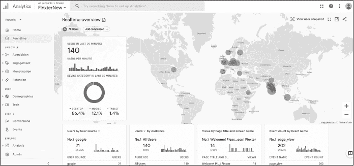
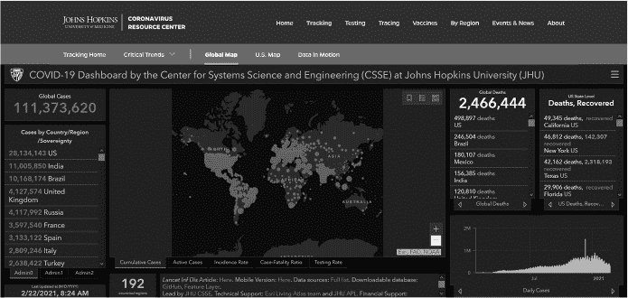
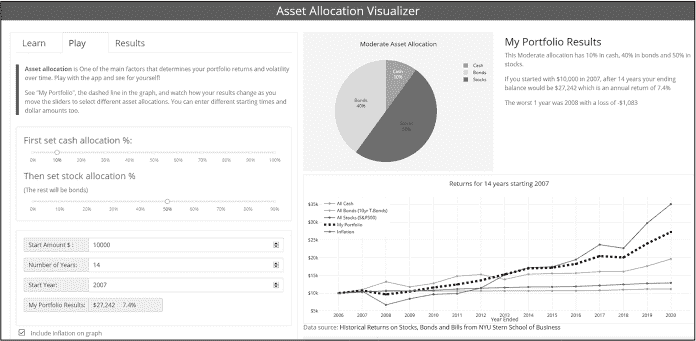

# <samp class="SANS_Dogma_OT_Bold_B_11">引言</samp>

有人说信息就是力量。也有人宣称数据是新黄金。但原始信息和数据往往在没有背景的情况下毫无意义。数据只有在被正确分析、解读和理解后，才是一项有价值的资产。因此，新的领域层出不穷。数据科学家、数据工程师、数据分析师、商业智能顾问和机器学习工程师等职业越来越受欢迎，它们有一个共同点：使用图表和仪表板等可视化工具来解读数据。

本书的目标是帮助你创建美观的仪表板应用，让你只需几行代码就能将数据可视化。无论你是一个有抱负的专业人士，还是经常与数据打交道，抑或你只是喜欢玩弄数字，本书都会为你提供工具和知识，帮助你利用数据的力量。

## <samp class="SANS_Futura_Std_Bold_B_11">为什么选择这本书</samp>

Plotly Dash 框架使你能够轻松构建自己的仪表板。*仪表板* 是 Web 应用，允许你和你的用户使用交互式小部件动态地探索数据，这些小部件接受用户输入并解释输出。例如，仪表板可能包含滑块、文本框、按钮和下拉菜单，允许用户选择在结果图表和图形中显示哪些数据，就像你在图 1 中看到的地图和条形图一样。仪表板应用的交互性是近年来它们越来越受欢迎的原因。

<samp class="SANS_Futura_Std_Book_Oblique_I_11">图 1：Google Analytics 仪表板，用于跟踪网站使用情况</samp>

在没有适当指导的情况下，构建一个 Plotly Dash 应用可能会很困难。本书将通过实用的指导和易于理解的教程，教你如何创建第一个互动且高度可视化的分析仪表板应用。它将引导你从 Dash 初学者到快速且自信地创建自己的仪表板应用。

阅读本书也将帮助你锻炼 21 世纪的关键技能，包括编程、数据分析和数据科学，以及数据可视化和展示。社区迫切需要能够展示动态且不断增长的数据集的精美数据可视化，这些数据集来自众多数据源，如智能家居、工厂、网络商店、社交网络、视频托管服务和健康追踪设备。

随着数据规模和复杂性的不断增加，我们将看到对能够为用户提供实时、数据驱动概览的仪表板应用需求的增长。你可能已经在自己的生活中使用过基于浏览器的仪表板：Google Analytics、Facebook 广告管理器和 Salesforce 仪表板都是现实生活中的仪表板应用示例。图 1 显示了 Google Analytics 仪表板应用的截图，它让你可以跟踪实时网站流量。

这个仪表板告诉我们，在截图录制时，美国和亚洲的大多数用户仍在睡觉，而欧洲的用户已经开始忙碌地上网搜索。通过适当的仪表板应用可视化数据时，这些洞察力是多么地顺畅地呈现出来！创建这种类型的应用过去只对熟练的编码人员和能够将实时数据源与动态网站连接的大型组织可行，从而提供仪表板应用所独特的价值主张。

图 2 展示了约翰·霍普金斯仪表板应用的截图，它通过新鲜的动态数据流可视化了 COVID-19 的传播。

<samp class="SANS_Futura_Std_Book_Oblique_I_11">图 2：约翰·霍普金斯仪表板，用于可视化全球疾病的传播</samp>

你可以通过这个[*https://coronavirus.jhu.edu/map.xhtml*](https://coronavirus.jhu.edu/map.xhtml)链接实时查看该仪表板。该仪表板显示了一个动态计数器，跟踪全球病例数量，还有一个热点地图，显示各国的病例数据、传播进程以及更多静态和动态统计数据。这个仪表板应用每月能帮助成千上万的人从数据中获取洞察——这些洞察是仅依赖电子表格和表格数据无法获得的。

图 3 展示了本书一位作者创建的资产配置工具的截图（[ *https://<wbr>wealthdashboard<wbr>.app*](https://wealthdashboard.app)）。

<samp class="SANS_Futura_Std_Book_Oblique_I_11">图 3：</samp> <samp class="SANS_Futura_Std_Book_11">Wealthdashboard.com</samp> <samp class="SANS_Futura_Std_Book_Oblique_I_11">可视化你的资产配置的应用</samp>

这个工具允许你通过输入分配给股票、债券和现金的财富百分比，并使用历史数据来可视化你的资产配置的回报和风险状况。这是你将在本书中学会制作的仪表板之一！

仪表板应用的潜在用途几乎是无限的。对于每个数据源，都有一个有用的仪表板应用等待你来创建。

我们，作为作者，度过了无数个不眠之夜编写代码、调试并弄清楚如何使我们的第一个 Dash 应用运行。关于 Dash 的书籍很少，更不用说那些容易理解且适合 Python 初学者的书籍了。所以，我们决定开始这个项目，是时候改变这一现状了！

查看 Dash 企业应用画廊中的许多示例应用，地址为[*https://<wbr>dash<wbr>.gallery<wbr>/Portal*](https://dash.gallery/Portal)，以获取更多示例（见图 4）。有些应用，比如 AI 语音识别应用，代码行数少于 100 行！

<samp class="SANS_Futura_Std_Book_Oblique_I_11">图 4：官方 Dash 展示的截图，展示了仪表板应用的多种用途和特点</samp>

## <samp class="SANS_Futura_Std_Bold_B_11">为什么选择 Plotly Dash</samp>

我们已经确认仪表板非常棒，那么让我们看看为什么你应该选择 Plotly Dash 来完成这项工作。创建仪表板有很多很棒的替代框架，包括 Streamlit、Shiny、Jupyter、Tableau、Infogram 等等。然而，我们发现有很多令人信服的理由，考虑在各种应用场景中选择 Dash 而不是其竞争对手：

+   Dash 应用程序可以用纯 Python 编写，这意味着如果你熟悉 Python，你可以非常快速地开始使用。它还意味着你可以轻松地将现有 Python 工作中的数据和结果集成到 Dash 应用中。

+   Python 具有很高的表达性，Dash 代码也相对简洁，这意味着你可以更快地进行原型设计和迭代，这在开发有时间限制的应用程序或在需求经常变化的敏捷环境中非常有用。

+   Dash 隐藏了很多复杂性，比如 JavaScript 前端与 Python 后端之间的通信。因此，你无需承担过于复杂的责任，如序列化、反序列化、定义 API 端点或发起 HTTP 请求。这可以显著减少样板代码。

+   Dash 是由 Plotly 团队开发的，这意味着它与 Plotly 图形库有着极好的集成。Plotly 因此也成为创建 web 应用程序的绝佳选择，因为这些交互式图形本身就基于 web 技术。

+   Dash 基于广泛使用的 Flask 框架构建，为我们提供了许多部署选项，从完全托管到自托管。

+   尽管 Dash 仅限于与 Python 一起使用，但它非常可扩展，允许你混合使用 CSS 和 JavaScript，甚至可以使用 React 和 Dash 组件生成器编写自己的组件。

尽管 Dash 具有许多优点，但没有软件是完美的。为了帮助你决定什么最适合你，以下是 Dash 的一些局限性：

+   Dash 性能很好，但如果你有大量组件、极其复杂的应用程序，或者处理庞大的数据集时，可能会发现应用程序开始变慢。

+   Dash 的启动和运行比一些无代码或低代码的替代方案稍微复杂，而且与其他企业软件的集成不像替代框架那样完善；例如，PowerBI 与微软企业软件的集成非常紧密。

+   尽管 Dash 是纯 Python 编写的，但要正确理解其运作原理，你需要了解 HTML 和 CSS 的基础知识。

## <samp class="SANS_Futura_Std_Bold_B_11">本书适合谁阅读</samp>

我们编写这本书时考虑到了完全的 Dash 初学者。虽然一些 Python 基础知识会帮助你更好地理解本书，但我们并不假设你有很多编程经验，因此我们会解释一些基础内容，比如如何安装 Dash 及相关库、如何设置编程环境，以及如何使用像 pandas 这样的库。整个 Python 课程超出了本书的范围，但第一章将讲解一些构建 Dash 应用所需的 Python 基础知识，并为你提供一些资源，帮助你深入学习。

实际上，许多读者可能已经有一些 Python 编程语言的经验。如果你了解 Python，但还没有经验设置编程环境，可以从第二章开始。

另一方面，如果你已经了解 Python 并且已设置好编程环境（最好是 PyCharm），你可以直接跳到第三章，我们会给你一个简短的 pandas 库教程。如果你是一个熟练的程序员，知道所有这些内容，可以跳过所有入门章节，从第四章开始，我们将向你展示如何创建第一个 Dash 应用。

## <samp class="SANS_Futura_Std_Bold_B_11">书中的内容</samp>

本书分为两部分：第一部分将帮助你安装并设置构建 Dash 应用所需的一切；第二部分将引导你构建四个逐渐复杂的应用，并以一些通用的技巧总结。

**第一部分：速成课程**

**第一章，Python 复习**，讨论了构建基于数据的应用程序最重要的 Python 基础知识，包括数据类型和结构、函数，甚至涉及一些面向对象编程。

**第二章，PyCharm 教程**，引导你安装 PyCharm 编程环境、安装库、创建项目并运行你的 Dash 应用。

**第三章，pandas 速成课程**，为你提供了一个可视化的概述和 10 分钟的 pandas 库回顾，帮助你处理表格数据。

**第二部分：构建应用**

**第四章，第一个 Dash 应用**，通过基于社交媒体分析的实用示例，向你展示如何创建第一个 Dash 应用。它介绍了 Dash 应用的构建模块，包括布局和样式部分、Dash 组件、回调函数以及用于创建可视化的 Plotly Express。阅读完本章后，你将能够创建自己的基本 Dash 应用。

**第五章，全球数据分析：高级布局和图表**，利用世界银行的全球数据集，介绍更多的组件和样式功能。本章对你基本的 Dash 技能进行了精炼和扩展：你将与 API 交互，以实时检索数据，并学习使用 dash-bootstrap-components 创建更复杂的布局。

**第六章，投资组合：构建更大的应用**，深入探讨了更高级的 Dash 组件，以基于财富的仪表盘应用为例。你将学习如何构建和调试更大的 Dash 应用，使用更复杂的 Dash 和 Bootstrap 组件，并使用更低级的 Plotly 图形对象库来构建你的图表。

**第七章，探索机器学习**，带你通过一个可视化机器学习模型的应用，并提供支持向量机的背景知识。这展示了 Dash 的另一个应用：可视化和探索算法的工作原理。你将深入学习与 Dash 常用的两个数值库：NumPy 和 scikit-learn。我们将介绍等高线图，并探讨 Dash 回调的更多复杂应用。

**第八章，技巧与窍门**，通过最佳技巧和窍门以及一些进一步阅读的参考资料总结了本书内容，涵盖调试、应用自动格式化、利用 Dash 社区和探索更多应用等主题。

## <samp class="SANS_Futura_Std_Bold_B_11">在线资源</samp>

在整本书中，我们会推荐由我们作者制作的资源来增强你的学习。一本书能容纳的内容有限，为了保持重点，我们已将大量代码、视频和文档提供在线访问。

+   书籍页面及附加材料：[*https://<wbr>learnplotlydash<wbr>.com*](https://learnplotlydash.com)

+   Adam 的 YouTube 频道：[*https://<wbr>www<wbr>.youtube<wbr>.com<wbr>/c<wbr>/CharmingData*](https://www.youtube.com/c/CharmingData)

+   GitHub 仓库：[*https://<wbr>github<wbr>.com<wbr>/DashBookProject<wbr>/Plotly<wbr>-Dash*](https://github.com/DashBookProject/Plotly-Dash)

+   出版商更新：[*https://<wbr>nostarch<wbr>.com<wbr>/python<wbr>-dash*](https://nostarch.com/python-dash)

+   免费的 Python 邮件学院和备忘单：[*https://<wbr>blog<wbr>.finxter<wbr>.com<wbr>/email<wbr>-academy*](https://blog.finxter.com/email-academy)
