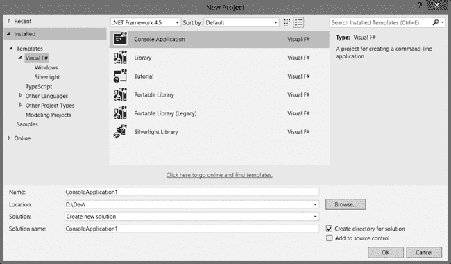
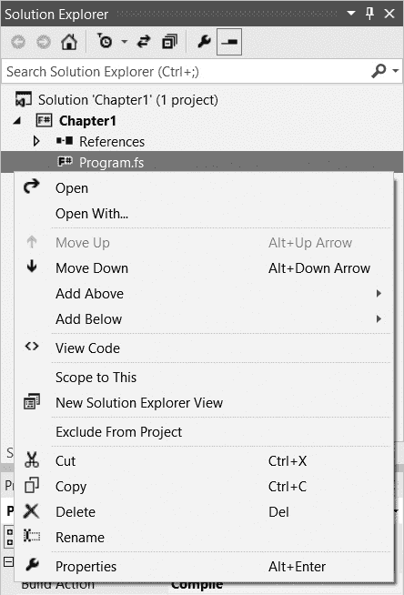
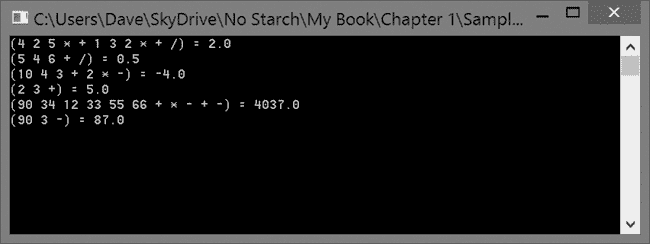

## 第一章. 认识 F#

F# 最初在微软研究院剑桥分部开发，是一种以函数为主的多范式语言。通俗来说，这意味着尽管 F# 的语法和构造强调编写将函数应用于数据的代码，但它也是一种功能全面的面向对象语言，并且加入了一些命令式编程的构造。

F# 起源于 2002 年，但直到 2005 年微软发布了版本 1.0，才迎来了第一次重大发布。F# 源自 ML 语言，并受到 OCaml 的深刻启发。在早期的开发过程中，F# 团队努力保持与 ML 的语法兼容，但随着时间推移，语言有所不同。逐渐地，F# 找到了在 Visual Studio 中的第一等公民地位，从 Visual Studio 2010 开始，每个版本都提供了现成的项目模板。F# 的最新版本随 Visual Studio 2013 一同发布，版本号为 3.1。

尽管 F# 被包含在 Visual Studio 中，但它仍然拥有不应有的声誉，认为它只是学术界或高度专业化的金融软件中使用的冷门语言。因此，它未能在企业软件中获得广泛应用，但随着开发人员开始理解函数式语言的优点，这种情况似乎正在改变。F# 是一门开源语言，使用 Apache 2.0 许可证，并且每个平台都有可用的编译器，这也在帮助这门语言获得更多的关注。微软继续为 F# 做出重大贡献，但语言本身是由独立的 F# 软件基金会管理的。

本章的目标是让你了解 F# 程序在 Visual Studio 项目和代码层面的组织结构。在你学习这门语言的过程中，你会发现 F# 真正是一种通用编程语言，能够满足大多数现代软件开发任务的需求。

除非另有说明，本书中的示例是使用 F# 3.1 在 Visual Studio 2013（专业版和终极版）中开发的。如果出于某种原因你没有使用 Visual Studio，不用担心，本书中的大部分示例无论你使用哪个平台都适用。

### 注

*尽管我在本书中并未专门讲解，但如果你打算使用除 Visual Studio 之外的开发环境，可以参考 F# 软件基金会网站上的大量资源，帮助你入门，网址是* [`fsharp.org/`](http://fsharp.org/)*。你还可以在浏览器中尝试 F#，网址是* [`www.tryfsharp.org/`](http://www.tryfsharp.org/).

## F# 与 Visual Studio

因为本书主要面向有经验的 .NET 开发人员，所以我假设你已经知道如何在 Visual Studio 中创建项目。我将直接介绍可用的不同 F# 项目模板，并简要讨论 F# 项目中的文件组织结构。

### 项目模板

每个 Visual F#项目模板都列在新建项目对话框中的 Visual F#类别下，但该类别在列表中的位置会根据你的 IDE 设置有所不同。如果 Visual F#类别没有立即列在已安装模板下，请检查其他语言节点。如果仍然没有看到，确保已安装 F#组件。图 1-1 展示了在为 F#开发并针对.NET 4.0 配置的 IDE 中，每个模板的显示方式。

如你所见，提供了五个模板。模板名称非常直观，以下是简要说明：

+   ****控制台应用程序****。创建一个新的命令行应用程序。

+   ****库****。创建一个新的库，可以从其他应用程序或库中引用。

    图 1-1. Visual Studio 2013 中的 F#项目模板

+   ****教程****。这是一个快速了解 F#提供的功能的方式，但对于开始新项目来说并不太有用。

+   ****便携式库****。创建一个便携式类库，可以同时被.NET 4.5 和 Windows Store 应用程序使用。

+   ****便携式库（遗留版）****。创建一个便携式类库，可以同时被.NET 4.0 和 Silverlight 应用程序使用。

+   ****Silverlight 库****。创建一个新的库，可以在 Silverlight 应用程序中引用。

一旦你使用这些模板创建了一个项目，你应该能看到熟悉的 Visual Studio 界面，包括文本编辑器、解决方案资源管理器以及你通常打开的其他窗口。根据你之前是否使用过 F#，你也可能会看到 F#互动窗口。

显眼缺失的模板包括 Windows Forms 应用程序、WPF 应用程序和 ASP.NET 应用程序的模板。缺失的一个主要原因是许多设计工具尚未更新以支持生成或理解 F#代码。尽管缺少内置模板，你仍然可以使用这些技术构建 F#应用程序，但通常需要做更多的手动工作。

### 注意

*GitHub 上的 F#社区模板库托管了多个额外的模板。写本文时，库中仅包含少量的 Visual Studio 模板，但随着时间推移，可能会添加针对其他编辑器（如 Xamarin Studio）的模板。你可以在* [`github.com/fsharp/FSharpCommunityTemplates/`](https://github.com/fsharp/FSharpCommunityTemplates/) *找到该库。*

### 项目组织

当你第一次看到 Visual Studio 在从上述模板创建项目后的项目工作区时，可能会误以为 F# 项目和 C# 或 Visual Basic 项目一样。从某些方面来看，确实如此。例如，你可以通过按 F5 启动可执行项目，Visual Studio 调试器可以逐步执行 F# 代码，文件通过解决方案资源管理器进行管理。然而，F# 的项目组织与传统 .NET 语言有很大的不同。实际上，你可能会发现 F# 的代码结构几乎和语言本身一样陌生。

传统的 .NET 项目通常遵循每个文件一个类型的惯例；也就是说，单独的数据类型几乎总是存储在不同的文件中，并按与项目命名空间相对应的文件夹层次结构进行组织。除了避免循环程序集引用外，关于如何或何时在项目中出现某个元素，几乎没有什么固定的规则。除非涉及访问修饰符（如 public、private 等），否则类型和成员可以互相引用，不管它们在项目中定义的位置在哪里。

有些规则是可以打破的，但在这种情况下，F# 彻底摧毁了项目组织规则书，然后焚烧了残骸。它对项目的组织方式有着极其严格的规定，且理由充分：F# 代码是自上而下进行评估的。这意味着，不仅单个代码文件内的声明顺序很重要，项目中的文件顺序同样至关重要！

新的 F# 程序员常常会向项目中添加一个新文件，填入一些定义，然后出现编译错误，提示新定义缺失。这通常是因为程序员忘记将新创建的文件移动到会使用这些定义的文件之前。幸运的是，在 F# 项目中更改文件顺序相对简单，因为 IDE 中有上下移动文件的右键菜单和快捷键，如 图 1-2 所示。

F# 自上而下的评估顺序的另一个重要影响是，不允许使用文件夹。文件夹本身不会破坏评估顺序，但它们确实会使其变得更加复杂，因此在 IDE 中没有添加文件夹的选项。

你可能会想，这种评估结构究竟能带来什么优势。其主要好处是，编译器可以对你的代码做出更多假设，从而为你提供其他 .NET 语言无法比拟的类型推断能力。此外，这种评估结构避免了不经意的递归定义（即两个或多个类型相互依赖）。这促使你更多地思考类型的使用方式和使用位置，并且在合适的地方强制你明确递归定义。

图 1-2. Solution Explorer 中上下文菜单的移动和添加选项

## 空白字符的重要性

新接触 F# 的人通常会很快注意到缺少大括号或 `BEGIN` 和 `END` 分隔符。F# 的设计者并没有依赖语法符号来表示代码块，而是决定让空白字符具有意义。

在一个代码块内的代码必须比打开该代码块的行缩进得更远。例如，当你定义一个函数时，属于函数体的行必须比函数声明的第一字符向右缩进。缩进的距离并不重要，重要的是代码被缩进，并且同一个代码块中的每行缩进级别要保持一致。

在大多数编程语言中，这通常是制表符与空格之间的老生常谈的争论点，但在 F# 中并非如此。F# 编译器在这个问题上采取了铁腕政策，明确禁止使用制表符，因为制表符所代表的空格数是不可知的。当你开始编写 F# 时，你可能希望配置 Visual Studio 的文本编辑器选项，将制表符替换为空格。

一种语法，统领一切

说 F# 需要一致的缩进，或者明确禁止制表符，并不完全准确。F# 实际上有两种语法格式：冗长格式和轻量格式。冗长格式要求你更明确地编写代码，但对缩进不那么敏感。在冗长语法下，代码块的结束不是通过减少缩进级别来表示的，而是通过使用额外的关键字，如 `end` 和 `done` 来表示。

在 F# 的初期，冗长格式是标准，但随着语言的发展，轻量语法逐渐受到青睐，现在成为了默认语法。当然，冗长格式和轻量格式之间还有其他差异，但它们超出了本书的范围。本书中的所有示例都没有使用冗长语法，但如果你渴望编写更多代码，可以通过在代码文件中使用 `#light off` 指令来恢复到冗长语法。

## 代码分组构造

F# 中有两种主要的代码分组方式：命名空间和模块。在单文件项目中，声明命名空间或模块是可选的，因为文件的内容会隐式地成为一个与文件同名的模块——例如，如果你的文件名是 *Program.fs*，那么模块会自动命名为 `Program`。然而，在所有其他情况下，每个文件必须以命名空间或模块声明开始。

### 命名空间

F# 的命名空间与 C# 和 Visual Basic 中的命名空间相同，它们允许你通过名称对相关代码进行分组，从而减少命名冲突的可能性。命名空间可以包含模块和类型定义，但不能直接包含任何值或函数。

你可以使用`namespace`关键字后跟标识符来声明命名空间。例如，本书中的代码可能会有如下的命名空间：

```
namespace TheBookOfFSharp
```

你还可以通过嵌套命名空间来声明更细粒度的命名空间。嵌套的命名空间使用完全限定的名称声明，每个层级由点（`.`）分隔。例如，我们可以将本章的所有代码分组到一个嵌套的命名空间中，如下所示：

```
namespace TheBookOfFSharp.Chapter1
```

就像在其他.NET 语言中一样，你可以将命名空间分割到多个文件和程序集。你还可以在一个文件中声明多个命名空间，但不能将它们内联嵌套；每个命名空间声明必须是顶级块。

如果你想将代码放入.NET 的全局命名空间，可以使用`global`关键字声明命名空间，如下所示：

```
namespace global
```

每当你声明一个命名空间时，已经加载到该命名空间中的其他代码会立即对你的代码可用。然而，在所有其他情况下，你必须完全限定类型或模块名称，或者使用`open`关键字导入它们，就像在 C#中使用`using`指令或在 Visual Basic 中使用`Imports`语句一样。以下代码片段展示了这两种方法：

```
// Fully qualified name
let now = System.DateTime.Now

// Imported namespace
open System
let today = DateTime.Now.Date
```

### 模块

模块与命名空间类似，因为它们允许你逻辑地分组代码。然而，与命名空间不同，模块可以直接包含值和函数。实际上，模块更像是其他.NET 语言中只包含静态成员的类；事实上，它们就是这样在编译后的程序集中的表现。

模块分为两类：顶级模块和本地模块。*顶级*模块将所有代码包含在一个单一的实现文件中。相反，*本地*模块用于当多个模块或不属于任何模块的类型在同一文件中定义时。

你可以使用`module`关键字后跟标识符来声明模块，如下所示：

```
module TheBookOfFSharp
```

与命名空间不同，模块定义不能跨文件，但你可以在单一文件中定义多个模块。你也可以像这样将模块直接嵌套在父模块中：

```
module OuterModule
  module NestedModule =
    do ()
```

当你想同时使用命名空间和顶级模块时，F#提供了一个方便的语法快捷方式，将它们合并为单个声明。要利用这一点，只需在模块名称前包含完整的限定名称，如下所示：

```
module TheBookOfFSharp.Chapter1.QualifiedModule
```

在上面的代码片段中，我们在`TheBookOfFSharp.Chapter1`命名空间中声明了一个名为`QualifiedModule`的模块。

最后，您可以通过`open`关键字导入模块成员，就像它们属于一个命名空间一样。例如，要导入`QualifiedModule`中定义的任何类型，我们可以写：

```
open TheBookOfFSharp.Chapter1.QualifiedModule
```

为了简化这个过程，你可以使用`AutoOpen`属性来修饰模块，如下所示：

```
[<AutoOpen>]
module TheBookOfFSharp.Chapter1.QualifiedModule
```

通过将该属性应用于模块，每当你显式地打开包含该模块的命名空间时，模块也会被打开。

## 表达式无处不在

F#的一个显著特征是它是一种*基于表达式*的语言；也就是说，几乎所有被求值的内容都会返回结果。当你学习 F#时，你会很快发现，编写应用程序和库是通过组合表达式来产生结果的练习。这与 C#等语言形成鲜明对比，在这些语言中，通常只有方法（和运算符）返回结果。在 F#中，像`if...else`这样的看似熟悉的结构焕发新生，因为就像所有表达式一样，`if...else`表达式会返回结果。考虑下面这段代码，它使用 C#的`if...else`语句打印一个字符串，表示一个数字是偶数还是奇数：

```
// C#
var testNumber = 10;
string evenOrOdd;

if (testNumber % 2 == 0)
      evenOrOdd = "even";
else
      evenOrOdd = "odd";

Console.WriteLine(evenOrOdd);
```

现在，比较一下这段功能等效的 F#代码，它使用了`if...else`表达式：

```
// F#
let testNumber = 10
let evenOrOdd = if testNumber % 2 = 0 then "even" else "odd"
Console.WriteLine evenOrOdd
```

你可能首先注意到的是，F#版本更简洁。然而，可能不那么明显的是，F#版本消除了 C#版本中的可变状态（`evenOrOdd`在赋值之前是未初始化的）。在这个简单的示例中，这不是问题，因为可变状态是隔离的，但在更大的应用程序中，可变状态会导致脆弱且常常不可预测的代码库。

你可能会争辩（正确地说）我们可以使用 C#的条件操作符来代替`if...else`语句，从而实现与 F#代码相同的效果。但这个例子的关键点在于，即使是看似熟悉的结构，在 F#中也会返回值。

## 应用程序入口点

在 F#应用程序中，项目中最后一个文件中定义的初始化程序默认作为应用程序的入口点。为了更好地控制应用程序的启动方式，你可以通过使用`EntryPoint`特性装饰一个`let`绑定的函数来将其作为应用程序的入口点。这允许你使用任意函数来代替 C#或 Visual Basic 应用程序中的`Main`方法或过程。因此，装饰过的函数必须接受一个字符串数组并返回一个整数，才能被视为有效。这样的函数通常遵循以下模式：

```
**[<EntryPoint>]**
let main argv =
  // initialization code
  0
```

## 隐式返回值

由于 F#是一种以表达式为基础的语言，F#编译器能够对你的代码做出更多的假设。因为所有表达式都会返回值，所有函数也是表达式，所以可以推断所有函数都会返回一个值。因此，编译器可以假设在函数中最后一个被求值的表达式就是函数的返回值；你无需显式使用`return`关键字来声明它。

举个例子，考虑上一节中的`main`函数。在这个函数中，`0`是隐式返回的，因为它是该函数中最后被求值的表达式。类似地，考虑这个函数，它只是简单地将两个整数相加：

```
let add x y = x + y
```

这里，`add` 函数接受两个参数，`x` 和 `y`，并且只包含一个表达式：加法操作。由于加法操作是在调用 `add` 时最后一个被评估的表达式，`add` 隐式地返回该操作的结果。

## 你的第一个 F# 程序

现在你已经学会了如何构建 F# 项目，是时候看看一些“真实”的 F# 代码了，这些代码超越了基本的语法。尽管传统的“Hello world”类型应用程序的即时满足感是刚开始学习新语言时很好的信心提升，但我决定放弃这种方法，转而选择一个既有用又能很好展示 F# 多种功能的示例：一个逆波兰表示法（RPN）计算器。

RPN 是一种后缀表示法，用于数学表达式；也就是说，它是一种表示计算的方式，每个运算符紧跟其操作数。例如，要表示计算 1 和 2 的和，我们通常会写作 `1 + 2`；然而，使用 RPN 时，我们会写作 `1 2 +`。

通常，你可以通过遍历一系列数字和运算符来实现 RPN 计算器。每个项目都会被检查，数字会被压入堆栈，而运算符则从堆栈中弹出适当数量的操作数，进行计算，并将结果重新压入堆栈。处理结束时，堆栈中剩下的唯一项目应为表达式的结果。图 1-3 大致说明了当该过程应用于表达式 `4 2 5 * +` 时的情况。

图 1-3. 逆波兰表示法应用

从左到右工作，你可以看到如何向堆栈中添加和移除项目，最终得出`14`作为结果。不过，正如你将看到的，使用 F# 实现一个基本的逆波兰表示法（RPN）计算器只需要几行代码，甚至不需要管理一个可变堆栈！

如果你想在 Visual Studio 中跟随这个示例进行操作，创建一个使用 F# 应用程序模板的新项目。准备好后，将文本编辑器的内容替换为以下代码（请注意，F# 是区分大小写的）：

```
module TheBookOfFSharp.RpnCalculator

open System

let evalRpnExpr (s : string) =
  let solve items current =
    match (current, items) with
    | "+", y::x::t -> (x + y)::t
    | "-", y::x::t -> (x - y)::t
    | "*", y::x::t -> (x * y)::t
    | "/", y::x::t -> (x / y)::t
    | _ -> (float current)::items
  (s.Split(' ') |> Seq.fold solve []).Head

[<EntryPoint>]
let main argv =
  [ "4 2 5 * + 1 3 2 * + /"
    "5 4 6 + /"
    "10 4 3 + 2 * -"
    "2 3 +"
    "90 34 12 33 55 66 + * - + -"
    "90 3 -" ]
  |> List.map (fun expr -> expr, evalRpnExpr expr)
  |> List.iter (fun (expr, result) -> printfn "(%s) = %A" expr result)
  Console.ReadLine() |> ignore
  0
```

完成输入 RPN 计算器代码后，按 F5 键并观察输出。你应该能看到如 图 1-4 所示的结果。

图 1-4. 逆波兰表示法计算器结果

如果你现在看不懂 RPN 计算器的代码，不要气馁；这正是重点！目前你只需要明白整个 RPN 计算都包含在`evalRpnExpr`函数中。之所以从这个例子开始，是因为它不仅展示了一些地道的 F#代码，还演示了许多重要的概念，比如默认不可变性、函数作为数据、模式匹配、递归、库函数、部分应用、F#列表和管道化。这些概念协同作用，创建了高度表达性且可预测的代码。在本书的过程中，你将详细探讨这些概念及更多内容。随着阅读的深入，我鼓励你定期回顾这个例子，看看这样一个小程序包含了多少功能。

## 概述

尽管 F#有着作为小众语言的声誉，但它是一门富有表现力、以函数为核心、支持多范式的语言，根植于 ML，并且对大多数现代软件开发活动都非常有用。正如你将在接下来的章节中看到的，编写高效的 F#代码就是学习如何将你在命名空间和模块中定义的类型、函数和数值组合成表达式。也就是说，传统的.NET 开发者需要适应语言的一些细微差别，如自上而下的求值、空格的意义以及隐式返回。然而，一旦你克服了初始的学习曲线，你就会看到 F#简单却富有表现力的语法将使你能够解决复杂的问题，并且写出的代码更稳定、可预测。
