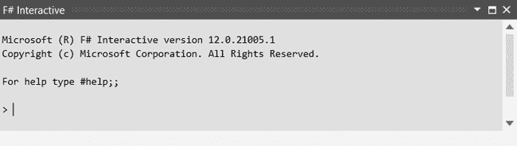
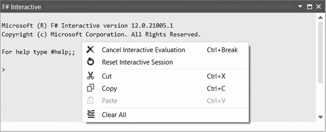
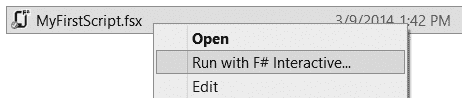
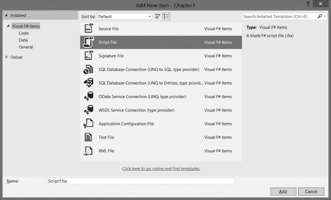
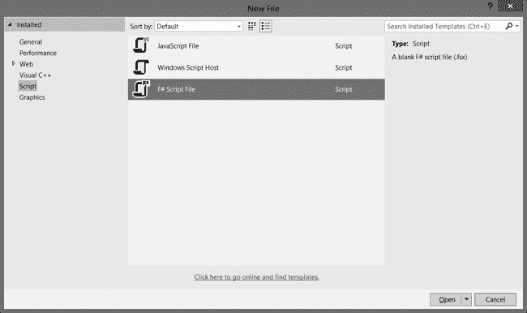
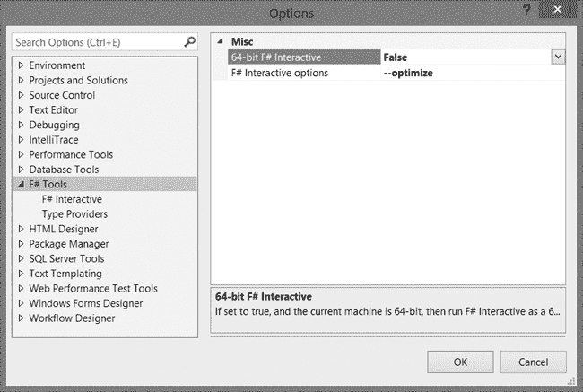

## 第二章. F# Interactive

如果用 .NET Framework 进行真正的函数式编程的前景还不足够吸引你，那么 F# Interactive (FSI) 带来的生产力提升一定会。FSI 是一个 *读取-评估-打印循环 (REPL)* 工具，你可以用它来探索问题领域，并在编写代码时进行测试。它还兼任脚本宿主，允许你利用 F# 的优雅和 .NET Framework 的强大功能来自动化常见任务。像 F# 这样的编译语言如何能互动式地使用呢？因为在幕后，FSI 会将输入编译成动态生成的程序集。

## 运行 F# Interactive

在 FSI 中工作有两种方式：通过 Visual Studio 中的 F# Interactive 窗口或 *fsi.exe* 控制台应用程序。选择通常是基于方便性。我通常更喜欢在 F# Interactive 窗口中工作，因为它能轻松融入我的 Visual Studio 开发工作流。我一般用这个窗口进行探索性任务，而将控制台保留用于脚本执行。

要在 Visual Studio 中打开 F# Interactive 窗口，请按 CTRL-ALT-F；你应该看到如图 2-1 所示的提示。默认情况下，*fsi.exe* 只能通过 Visual Studio 命令提示符快捷方式访问，而不能通过基本的 Windows 命令提示符访问。如果你希望通过其他命令提示符访问 *fsi.exe*，需要将其位置添加到你的路径环境变量中。默认情况下，F# 安装在 *%PROGRAMFILES(x86)%\Microsoft SDKs\F#\3.0\Framework\v4.0\*（在 32 位系统上为 *%PROGRAMFILES%*）中。

图 2-1. Visual Studio 2013 中的 F# Interactive 窗口

除了打开 Interactive 窗口外，你还可以使用 ALT-ENTER 将代码发送到窗口，在这种情况下，执行该代码的结果也会显示出来。这使得测试新概念变得非常容易：如果你不确定某个功能是否有效，通常可以通过写一点代码，发送到 FSI，并检查结果来立即尝试。

从文本编辑器发送代码并不是在 FSI 中评估表达式的唯一方式；你也可以直接从其提示符运行代码。这种灵活性对于提高生产力非常有帮助，因为你可以在文本编辑器中处理一段代码，将其发送到 FSI，然后在 FSI 窗口中与之互动，进行实验。

直接在交互式窗口中输入代码与从文本编辑器发送代码之间有一个重要区别。当你从编辑器发送代码时，它会自动编译并执行，而直接输入的代码在没有使用双分号模式（`;;`）终止时不会执行。例如，要执行简单的加法，你可以将 `1 + 1` 输入到文本编辑器并发送到 FSI，或者直接在 FSI 提示符下输入 `1 + 1;;`。这两种方法的结果相同，但由于必须使用双分号来表示代码输入的结束，FSI 允许你直接在提示符下输入并执行多行代码。

### 注意

*尽管在提示符下可以输入多行代码，但通常这会带来更多麻烦，因为一旦发生打字错误，你必须重新开始。我倾向于尽可能使用单行语句在提示符下进行操作。（幸运的是，从这样的错误中恢复通常只是修正错误并重新尝试。）*

## F# 交互式输出

使 FSI 如此有用的一个特点是它会报告它所做的所有事情。每当你在 FSI 中执行代码时，它会显示 `val`，后面跟着标识符名称、数据类型和它所创建的每个绑定的值。例如，当你定义并调用一个函数时，FSI 会创建两个绑定：一个是函数本身，另一个是结果，如下所示。

```
> **let add a b = a + b**
**let sum = add 1 2;;**

val add : a:int -> b:int -> int
val sum : int = 3
```

## it 标识符

在 FSI 中，你不总是需要显式定义绑定；在大多数交互式会话中，你可以直接评估一个表达式。例如，你可以直接调用 `add` 函数，而无需像这样定义 `sum` 标识符。

```
> **add 1 2;;**
val it : int = 3
```

当你没有显式命名某个东西时（例如进行简单计算或检查函数输出时），FSI 会自动将结果绑定到 `it` 标识符。你可以在后续评估中引用 `it`，但请注意，正如 *Highlander* 中所说，只有一个；每当 FSI 隐式绑定某个东西时，该值会被替换。你可以通过评估多个表达式而不显式将结果绑定到标识符来看到这种行为，如下所示。

```
> **it;;**
val it : int = 3

> **add 3 4;;**
val it : int = 7

> **it;;**
val it : int = 7
```

关于 `it` 标识符的关键是：喜爱它、使用它，但不要依赖它。

## 在沙盒中玩耍

即使在 Visual Studio 中运行，FSI 也是一个沙盒，它与任何你没有明确告诉它的代码完全隔离并且不知情。这种隔离提供了一层“工作”和“娱乐”之间的保护，但也意味着为了让它有用，你需要与外部世界进行交互。为此，我们使用指令。

FSI 提供了几个指令，可以在交互式会话或脚本中调用。其中包括用于刷新你记忆的指令，加载其他 F# 源文件中的代码，引用程序集，甚至提供一些性能统计信息。

### #help

如果你忘记了任何指令，可以在 FSI 提示符下调用`#help`指令，以获取可用指令的列表以及每个指令的简要描述。

### #quit

如果你需要从命令提示符退出 FSI，可以使用`#quit`指令结束会话。尽管你可以在 Visual Studio 的 FSI 窗口中使用`#quit`，但我建议使用图 2-2 中显示的重置交互式会话上下文菜单项，因为它会清除之前的输出，并自动开始一个新的会话。

图 2-2. 重置交互式会话上下文菜单项

### #load

加载现有代码到 FSI 会话的一种方法是使用如下面所示的`#load`指令。`#load`指令接受一个或多个字符串参数，这些参数包含外部源文件的绝对路径或相对路径。FSI 应该加载、编译并执行列出的文件（按顺序），并使其内容在当前会话中可用。

```
> **#load @"D:\Dev\FSharp\Samples\Chapter2\MySourceFile.fs";;**
[Loading D:\Dev\FSharp\Samples\Chapter2\MySourceFile.fs]
-- *snip* --
```

轻松加载

Visual Studio 中的 F# 项目模板鼓励你通过包含一个脚本来加载多个文件，你可以更新该脚本以包含任何新文件。通过保持该脚本与项目结构同步，你可以轻松地将代码从项目加载到 FSI 并进行实验。

虽然你可以在单个`#load`指令中包含多个源文件，但通常更容易为每个文件使用单独的指令。原因是，如果你正在积极编辑其中一个文件并且出现错误，编译器会将整个指令标记为问题。通过使用多个指令，你可以更快地定位问题文件。

### #r

`#r`指令对于程序集的作用就像`#load`指令对源文件的作用一样。你可以使用`#r`来引用任何 .NET 程序集（遵循目标框架和平台的通常限制）。如果你需要的程序集已经位于程序集搜索路径中某个文件夹中，你可以通过名称来识别它，否则你需要包含完整路径。例如，如果你需要加载`System.Configuration`，你可以使用：

```
> **#r "System.Configuration";;**
--> Referenced 'C:\Program Files (x86)\Reference Assemblies\Microsoft\
Framework\.NETFramework\v4.5\System.Configuration.dll'
```

FSI 会回应加载的每个程序集的完整路径。

### #I

当你需要引用一个尚未包含在搜索路径中的文件夹中的多个程序集时，你可以使用`#I`指令将该文件夹添加到 FSI 的程序集搜索路径中。

```
> **#I @"D:\Dev\FSharp\Samples\Chapter2\Bin\Debug";;**
--> Added 'D:\Dev\FSharp\Samples\Chapter2\Bin\Debug' to library include path
```

一旦文件夹被添加到搜索路径中，你应该能够通过名称而不是完整路径来引用其中的程序集。

### #time

`#time`指令通过在输出中打印一些统计信息，为你的代码提供额外的可见性。你可以通过使用带有`on`字符串参数的`#time`指令来启用计时信息。

```
> **#time "on";;**
-- > Timing now on
```

启用计时后，每次在 FSI 中执行代码时，统计信息都会被计算出来。这些统计信息包括实时、CPU 时间和垃圾回收操作的次数，涵盖所有三代。例如，为了帮助优化一个慢函数，您可以启用计时来调用它，并看到类似这样的输出：

```
> **DoSomethingSlow();;**
Real: 00:00:01.095, CPU: 00:00:01.107, GC gen0: 25, gen1: 23, gen2: 23
val it : unit = ()
```

当您完成统计并且不再希望在 FSI 输出中看到它们时，可以使用 `#time` 指令和 `off` 字符串参数禁用它们。

```
> **#time "off";;**
--> Timing now off
```

## 脚本编写

由于 F# 是一种 .NET 语言，您的大多数 F# 代码将放在 .*fs* 文件中，并编译成程序集，以供大型应用程序使用。然而，当与 FSI 配合使用时，F# 可以作为脚本语言，利用它的强大功能来自动化常见任务，并且完全支持 .NET Framework。

例如，假设您想将多个 PDF 文件合并成一个文档。您可以为此编写一个控制台应用程序，但使用开源的 PDFsharp 库来操作单个 PDF 文件，编写脚本则更为简便。该脚本大约需要 30 行代码（包括空行）。F# 提供简洁的语法，并且能够发挥 .NET Framework 的强大功能，非常适合这种任务。

创建 .*fsx* 文件作为脚本有几个好处。首先，《沙箱中的操作》 中描述的指令是 FSI 特性，因此它们不能出现在标准源文件中。此外，由于 .*fsx* 文件与 *fsi.exe* 相关联，您可以直接通过 shell 上下文菜单执行它们，如图 2-3 所示。这使得像 PDF 合并这样的脚本可以根据需要轻松运行。

图 2-3. 使用 F# Interactive 上下文菜单项运行

要将脚本添加到项目中，请在解决方案资源管理器中选择项目，按 CTRL-SHIFT-A 打开 **添加新项** 对话框，然后选择 **F# 脚本文件**，如图 2-4 所示。

图 2-4. 将 F# 脚本文件添加到项目中

要在 Visual Studio 2013 中快速创建独立的 .*fsx* 文件，请按 CTRL-N 打开 **新建文件** 对话框，选择左侧菜单中的 **脚本**，然后找到 **F# 脚本文件** 选项，如图 2-5 所示。

图 2-5. 创建独立的 F# 脚本文件

## F# Interactive 选项

除了在沙盒中玩耍一章中讨论的指令外，FSI 还提供了几个命令行选项，允许你控制它的行为。这些选项中有些提供了 FSI 指令功能的替代方案，而另一些则控制编译器的行为。我不会在这里介绍所有可用的选项，但我会重点讲解你最有可能使用的选项。（要查看 FSI 选项的完整列表，请运行**`fsi.exe –help`**。）这些选项适用于你通过命令提示符还是 F# Interactive 窗口运行 FSI。要在 Visual Studio 中设置选项，请转到**工具** ◂ **选项**，在左侧列表中找到**F# 工具**，然后将新选项输入到**F# Interactive 选项**文本框中，如图 2-6 所示。

图 2-6. 设置 F# Interactive 选项

### 注意

*Visual Studio 中的 F# Interactive 选项设置是全局设置。更改它将影响所有窗口实例。*

### --load

`--load`选项是`#load`指令的命令行等价物。它允许你在 FSI 会话启动时指定外部源文件供 FSI 编译并加载，例如：

```
**fsi --load:MyFirstScript.fsx**
```

`--load`选项不会处理指定文件中的任何指令，因此如果需要评估任何指令，请改用`--use`选项。

### --use

与`--load`一样，`--use`选项加载外部源文件，但它还会在加载文件时处理诸如`#load`或`#I`之类的指令。

```
**fsi --use:MyFirstScript.fsx**
```

### --reference

就像你可以使用`--load`或`--use`导入源文件一样，你也可以使用`--reference`选项（或其简写形式`-r`）来引用外部程序集。这与`#r`指令的效果相同。

```
**fsi --reference:System.Configuration**
```

与`#r`指令一样，如果程序集不在已包含的搜索路径中，请确保包括程序集的完整路径。

### --lib

`--lib`选项的作用与`#I`指令相同，都是将指定的文件夹添加到程序集搜索路径中。它的简写是`-I`。

```
**fsi --lib:D:\Dev\FSharp\Samples\Chapter2\Bin\Debug**
```

### --define

与其他 .NET 语言一样，F# 允许你定义条件编译符号（如 Visual Studio 中预定义的`DEBUG`和`RELEASE`符号），这些符号会影响代码的编译方式。要在 FSI 会话中定义符号，请使用`--define`选项。

```
**fsi --define:DEBUG**
```

FSI 和 F# 编译器会根据代码的编译方式自动为你定义某些符号。例如，当你在 FSI 会话中运行编译后的代码时，无论是通过提示符输入，还是从文本编辑器发送，或导入另一个文件，FSI 都会定义`INTERACTIVE`符号。直接编译的 F# 代码则会得到`COMPILED`符号。这些符号在代码必须根据环境差异在 FSI 会话和编译后的程序集之间表现不同的情况下变得非常重要。

### --exec

默认情况下，FSI 进程在评估完脚本后不会终止。要强制其退出而不是返回 FSI 提示符，可以指定`--exec`选项。

```
**fsi --load:MyFirstScript.fsx --exec**
```

现在，当脚本完成时，您将自动返回命令提示符。

### --

如果您的代码需要命令行参数，可以通过`--`选项将它们传递给 FSI；这实际上是一个分隔符，告诉 FSI 将所有剩余的参数视为代码的参数，而非 FSI 本身的参数。

```
**fsi --load:MyFirstScript.fsx --exec -- Dave**
```

当依赖命令行参数的代码可能从 FSI 会话或已编译程序集执行时，您应该使用`INTERACTIVE`和`COMPILED`符号来确保正确读取参数。例如，在典型的.NET 应用程序中，您会使用`System.Environment.GetCommandLineArgs()`来解析参数。对于`COMPILED`代码也是如此，但在`INTERACTIVE`代码中，执行过程实际上是 FSI 而不是您的程序集。因此，`GetCommandLineArgs`方法返回的是传递给 FSI 进程的所有参数，而不仅仅是用于脚本的参数！为了适应这个差异，交互式代码通常应该调用`fsi.CommandLineArgs`。您可以通过条件编译轻松改变这种行为，如下所示。

```
**let getCommandLineArgs() =**
**#if INTERACTIVE**
  **fsi.CommandLineArgs**
**#else**
  **System.Environment.GetCommandLineArgs()**
**#endif**

getCommandLineArgs() |> printfn "%A"
```

幸运的是，两个函数返回相同的结果：一个字符串数组，其中第一个项目是脚本/可执行文件的名称。这极大简化了任何参数解析代码，因为最终结果是一样的。

### --quiet

根据脚本的功能，FSI 可能会输出大量信息，有时结果会被噪音掩盖。要让 FSI 保持安静，可以使用`--quiet`选项。

```
**fsi --quiet**
```

`--quiet`选项将抑制 FSI 通常会输出的几乎所有内容，包括绑定、文件加载和程序集引用（但如果启用计时，统计信息除外）。FSI 仍然会显示错误信息和任何代码发送到控制台的内容。

### --optimize

`--optimize`选项控制是否对代码应用编译器优化。它在 Visual Studio 中默认启用。

### --tailcalls

我们将在第五章中详细讨论尾递归，但现在只需知道`--tailcalls`选项控制编译器是否对尾递归函数进行优化。此选项在 FSI 中默认启用。

## 总结

在本章中，您学习了如何使用 F#的 REPL 工具 F# Interactive 来帮助您探索问题并找到解决方案。您还了解了如何通过指令和命令行选项自定义 FSI 的行为。在下一章，我们将通过学习一些关键特性来开始探索 F#语言本身，无论您是采用函数式、面向对象还是命令式编程风格，这些特性都是通用的。
