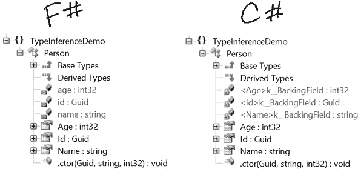
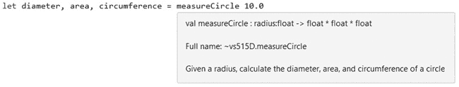

## 第三章 基础知识

在上一章中，你学习了如何通过快速反馈和任务自动化来提升 F# Interactive 的工作流程。现在，我们将把这些知识付诸实践，探索一些基本的语言特性。本章介绍的概念无论你主要使用命令式、面向对象还是函数式编程风格，都是适用的。

本章大部分内容集中于 F# 如何处理与 .NET Framework 中核心概念相关的内容，如核心数据类型、枚举、流程控制、泛型和异常处理。你还将学习如何通过控制副作用、默认不可变性、类型推断和选项类型来帮助你编写更可预测的代码。无论主题如何，你应该开始看到 F# 如何作为 C# 和 Visual Basic 的一种有力替代方案脱颖而出。

## 不可变性与副作用

如果你是从主要使用面向对象编程的背景转到 F#，你可能会发现最难适应的特性是*默认不可变性*。这是与传统 .NET 语言的根本区别，因为传统的语言对可以更改的内容和时间几乎没有限制。在没有默认不可变性的语言中编写的程序可能是不可预测的，因为系统状态（程序数据）几乎可以随时改变。我们将这些变化称为*副作用*。

一些副作用，如写入控制台，相对来说是无害的，但如果它们影响共享资源呢？如果调用一个函数改变了在其他地方使用的值呢？无论何时调用，函数是否总是会产生相同的结果？考虑下面这个 C# 示例，它引用了一个公共字段进行乘法运算：

```
//C#
using System;
using System.Linq;

class Example
{
  public static int multiplier = 1;

  private static void ① Multiply(int value)
  {
    var result = value * multiplier;
    Console.WriteLine("{0} x {1} = {2}", value, ②multiplier++, result);
  }

  static void Main()
  {
    var range = Enumerable.Range(1, 100);
    foreach(var i in range)
    {
      Multiply(i);
    }
  }
}

// First 10 results
// 1 x 1 = 1
// 2 x 2 = 4
// 3 x 3 = 9
// 4 x 4 = 16
// 5 x 5 = 25
// 6 x 6 = 36
// 7 x 7 = 49
// 8 x 8 = 64
// 9 x 9 = 81
// 10 x 10 = 100
```

在这个例子中，`Multiply` 方法①有一个副作用，即`multiplier`会被递增②。只要程序中的其他部分没有变化，它是相对可预测的，但一旦你改变 `Multiply` 方法调用的顺序，增加另一个 `Multiply` 方法的调用，或者通过其他机制更改 `multiplier` 字段，所有后续结果就会变得不可预测。

为了进一步复杂化问题，考虑当多次并行调用 `Multiply` 时会发生什么，以下是 `Main` 方法的修改版本：

```
//C#
static void Main()
{
  var range = Enumerable.Range(1, 100);
  System.Threading.Tasks.Parallel.ForEach(range, i => Multiply(i));
}

// First 10 results
// 1 x 1 = 1
// 6 x 3 = 18
// 7 x 4 = 28
// 5 x 2 = 10
// 10 x 6 = 60
// 11 x 7 = 77
// 12 x 8 = 96
// 13 x 9 = 117
// 14 x 10 = 140
// 15 x 11 = 165
```

在并行运行时，无法保证哪个操作会先执行，因此运行这段代码 10 次可能会得到 10 种不同的结果。使用可变值所带来的不可预测性就是为什么*全局状态*（在应用程序中任何地方都可以访问的值）通常被认为是有害的原因。正确管理全局状态需要一种纪律，而随着团队和项目的扩大，这种纪律的执行可能变得越来越困难。

## 函数式纯粹性

像 F# 这样的函数式语言通常用其数学纯度来描述。在 *纯粹的* 函数式语言（如 Haskell）中，程序完全由确定性的 *表达式* 组成，这些表达式总是返回一个值，并且除非在某些特定情况下，副作用是明确禁止的。相比之下，F# 是一种 *不纯* 的函数式语言。因此，它通过默认将值设为不可变，朝着提高可预测性迈出了重要的一步。

这并不是说 F# 不能像传统意义上的变量那样使用变量；这只是意味着，为了改变一个值，你必须明确允许它，并应尽可能限制该值的作用范围。通过保持范围狭窄，你可以主要以函数式风格编写代码，但在适当的情况下在独立片段中切换到更具命令式或面向对象的风格。

通过通过默认的不变性来管理副作用，F# 代码更自然地适用于并行和并发环境。在许多情况下，仔细控制哪些内容可以更改，减少了（如果不是消除了的话）对共享资源加锁的需求，并确保多个进程不会试图对整体系统状态做出可能冲突或改变行为的更改。随着软件开发演变，越来越多地利用现代计算中普遍存在的多处理器或多核心系统，这种额外的安全性变得愈加重要。

## 绑定

*绑定* 是 F# 用于标识值或可执行代码的主要方式。共有三种类型的绑定——`let`、`use` 和 `do`——每种都有其特定用途。

### 让绑定

`let` 绑定只是将名称与值关联。它们是最常见和最通用的绑定类型。（我在第二章中简要介绍了 `let` 绑定。）你可以使用 `let` 关键字创建一个 `let` 绑定。例如，绑定一个整数值，你可以使用如下代码：

```
let intValue = 1
```

同样，绑定一个字符串，你可以使用如下代码：

```
let strValue = "hello"
```

但是，`let` 绑定并不限于简单的赋值。你也可以用它们来标识函数或其他表达式：

```
let add a b = a + b
let sum = add 1 2
```

#### 字面量

尽管我们迄今看到的 `let` 绑定是不可变的，但它们不能像传统 .NET 中的常量值那样被视为常量。绑定更像是 C# 中的 `readonly` 变量（Visual Basic 中的 `ReadOnly`），而不是常量，因为它们的值是在运行时解析的，而不是在编译时内联替换。你可以通过使用 `Literal` 特性来定义一个真正的 .NET 常量值，F# 中称之为 *字面量*。（F# 遵循与其他 .NET 语言相同的约定，使得 `Attribute` 后缀是可选的，因此在此示例中，`Literal` 和 `LiteralAttribute` 都是可以接受的。）

```
**[<Literal>]**
let FahrenheitBoilingPoint = 212
```

这使得编译器将定义视为 C# 中的 `const`（Visual Basic 中的 `Const`），意味着该值将在使用的地方内联编译。因此，作为 `Literal` 装饰的绑定必须是完全构造的值类型、字符串或 null。

#### 可变绑定

如果你尝试使用赋值操作符（`<-`）更改默认绑定的值，编译器会告诉你这是不允许的。

```
let name = "Dave"

name <- "Nadia"
// Error – immutable binding
```

要使一个绑定变为可变，只需在其定义中包含 `mutable` 关键字。一旦定义了可变绑定，你就可以随意更改它的值。

```
let mutable name = "Dave"

name <- "Nadia"
// OK – mutable binding
```

当然，这里有一个警告：可变绑定与 *闭包*（可以访问在其定义作用域内可见的绑定的内联函数）不太兼容。

```
// Horrible, invalid code
let addSomeNumbers nums =
  let ① mutable sum = 0
  let add = ② (fun num -> sum <- sum + num)
  Array.iter (fun num -> add num) [| 1..10 |]
```

在这个例子中，可变绑定 `sum`① 被 `add` 闭包 ② 捕获。如果你尝试编译这段代码，编译器会礼貌地告诉你错误，并建议你要么消除这个变更，要么使用另一个可变结构——*引用单元格*。

#### 引用单元格

引用单元格像可变绑定一样，它们的值可以在运行时改变，但它们的工作方式完全不同。一个合理的理解方式是，引用单元格类似于指针，就像可变绑定类似于传统变量。也就是说，引用单元格其实并不是真正的指针，因为它们是封装可变值的具体类型，而不是指向特定资源或内存地址。

你可以像普通的 `let` 绑定一样创建一个新的引用单元格，只不过你在绑定的值前加上 `ref` 操作符。

```
let cell = **ref** 0
```

访问和更改引用单元格的值需要不同的语法，因为我们需要操作封装的值，而不是引用单元格本身。

```
① cell := 100
  printf "%i" ②! cell
```

如你所见，在 ① 处，`:=` 操作符用于更改引用单元格的值，在 ② 处，`!` 操作符用于返回单元格的值。

### 使用绑定

F# 提供了一种绑定机制，用于实现 `IDisposable` 接口的类型，这种机制类似于 C# 的 `using` 语句。在 F# 中，当你希望编译器插入一个对 `IDisposable` 对象的 `Dispose` 方法的调用时，你可以使用 `use` 关键字创建一个 `use` 绑定。

像 `using` 语句一样，它限定了 `IDisposable` 对象的作用域块，`use` 绑定创建的对象会在其所在的块结束时被处置；也就是说，如果在一个函数的顶层创建了 `use` 绑定，该对象将在函数返回后立即被处置。类似地，如果 `use` 绑定是在一个嵌套结构（例如循环）内创建的，该对象将在循环迭代完成时被处置。

以下示例演示了这个原理的实际应用：

```
open System

let ① createDisposable name =
  printfn "creating: %s" name
  ②{ new IDisposable with
   member x.Dispose() =
     printfn "disposing: %s" name
  }

let ③testDisposable() =
  use root = createDisposable "outer"
  for i in [1..2] do
    use nested = createDisposable (sprintf "inner %i" i)
    printfn "completing iteration %i" i
  printfn "leaving function"
```

在这个例子中，`createDisposable` 函数 ① 向控制台输出一条消息，告诉你正在创建一个可处置的对象。然后它返回一个对象，当该对象被处置时会输出一条消息 ②。`testDisposable` 函数 ③ 在一个简单的 `for` 循环内外反复调用 `createDisposable` 函数，并输出消息，告诉你每个代码块何时终止。

调用 `testDisposable` 函数会产生如下输出，显示每个对象在其包含块中被创建和处置的时间。

```
creating: outer
creating: inner 1
completing iteration 1
disposing: inner 1
creating: inner 2
completing iteration 2
disposing: inner 2
leaving function
disposing: outer
```

一个简单且更实用的 `use` 绑定示例是将一些文本写入文件，如下所示：

```
  open System.IO
① let writeToFile filename buffer =
    ②use fs = ③new FileStream(filename, FileMode.CreateNew, FileAccess.Write)
    fs.Write(buffer, 0, buffer.Length)
```

请注意，在 ① 处，使用了 `let` 绑定来定义 `writeToFile` 函数（函数在 F# 中也是数据），而在 ② 处，`use` 绑定与 `new` 关键字一起使用 ③ 来创建 `FileStream`。 （`new` 关键字在 F# 中是可选的，但按照惯例，每当创建一个 `IDisposable` 对象时都会包含它，以表示该对象应当被处置。如果你在没有 `new` 关键字的情况下创建 `use` 绑定，编译器会发出警告。）

`use` 绑定不能直接在模块内使用，主要是因为模块本质上是静态类，它们永远不会超出作用域。如果你尝试直接在模块中定义 `use` 绑定，你将收到编译器的警告，提示该绑定将被当作 `let` 绑定处理，如下所示：

```
warning FS0524: 'use' bindings are not permitted in modules and are
treated as 'let' bindings
```

#### using 函数

若想对 `IDisposable` 有更多控制，使用 `using` 函数。尽管它本身不是一个绑定，`using` 提供的功能与 C# 的 `using` 语句有些相似：给它一个 `IDisposable` 和一个接受该实例的函数，`using` 会在完成时自动调用 `Dispose`，如下面所示：

```
open System.Drawing
using (Image.FromFile(@"C:\Windows\Web\Screen\img100.jpg"))
      (fun img -> printfn "%i x %i" img.Width img.Height)
```

从某些方面来说，`using` 比它的 C# 对应物更强大，因为像 F# 中的每个表达式一样，它都会返回一个值。考虑以下修改版的前一个例子：

```
  open System.Drawing
① let w, h = using (Image.FromFile(@"C:\Windows\Web\Screen\img100.jpg"))
                   (fun img -> ②(img.Width, img.Height))
③ printfn "Dimensions: %i x %i" w h
```

我们没有在传递给 `using` 函数的 ② 中的函数内直接将维度写入控制台，而是将它们作为 *元组*（一个包含多个数据项的简单类型）返回，并将每个组件值绑定到有意义的名称，如 ① 所示，然后在 ③ 中写入控制台。即便在这个简单的例子中，你也可以看到 F# 的组合式、表达性语法如何通过消除大部分 *管道代码*（为满足编译器需要编写的代码），让你能够专注于问题本身，从而得出更易于理解的解决方案。

#### 在 C# 中复制 `using` 函数

我非常喜欢 F# 的 `using` 函数，因此我为我的 C# 项目创建了一些静态辅助方法。

```
// C#
public static class IDisposableHelper
{
  public static TResult Using<TResource, TResult>
    (TResource resource, Func<TResource, TResult> action)
      where TResource : IDisposable
  {
    using(resource) return action(resource);
  }

  public static void Using<TResource>
    (TResource resource, Action<TResource> action)
      where TResource : IDisposable
  {
    using(resource) action(resource);
  }
}
```

它们不算漂亮，但能够完成任务。

现在，这里是使用我的辅助函数的前面例子的 C# 版本。

```
// C#
// using System.Drawing
IDisposableHelper.Using(
  Image.FromFile(@"C:\Windows\Web\Screen\img100.jpg"),
  img => Console.WriteLine("Dimensions: {0} x {1}", img.Width, img.Height)
);

var dims =
  IDisposableHelper.Using(
    Image.FromFile(@"C:\Windows\Web\Screen\img100.jpg"),
    img => Tuple.Create(img.Width, img.Height)
  );

Console.WriteLine("Dimensions: {0} x {1}", dims.Item1, dims.Item2);
```

尽管代码看起来和行为上与 F# 版本相似，但我发现 F# 版本更加简洁，特别是它对元组的语法支持。

### do 绑定

最后一种绑定类型是 `do` 绑定，通过 `do` 关键字定义。与其他绑定类型不同，`do` 绑定不会将值附加到名称上；它们用于在函数或值定义之外执行一些代码。

`do`绑定通常在循环结构、序列表达式、类构造函数和模块初始化中使用。我们将在后续章节中逐一讨论这些场景。

## 标识符命名

我们已经看过一些标识符，但还没有真正探讨什么才是有效的标识符。像任何编程语言一样，F#也有命名规则。

F#中的标识符与大多数编程语言非常相似。通常，F#标识符必须以下划线(**`_`**)、大写字母或小写字母开头，后面可以跟随任何组合。数字也可以作为标识符中的有效字符，只要它们不是第一个字符。例如，以下是有效的标识符。

```
let myIdentifier = ""
let _myIdentifier1 = ""
```

F#中最有趣的标识符之一是替代的*引用标识符*格式，它有更少的限制。通过将标识符用双反引号（`"`）括起来，你可以几乎使用任何字符串作为有效的 F#标识符，例如这样。

```
let "This is a valid F# identifier" = ""
```

通常最好谨慎使用引用标识符，但在某些情况下，它们非常有用。例如，它们经常用于命名单元测试。通过使用引用标识符命名测试，你可以专注于描述测试内容，而不是争论命名约定。如果你使用测试框架（如 NUnit），测试列表中的完整引用名称可以明确说明正在测试什么。

## 核心数据类型

作为.NET 语言，F#支持完整的公共语言基础结构（CLI）类型。每个核心原始类型，甚至一些更复杂的类型，如`System.String`，都作为*类型缩写*（现有类型的便捷别名）暴露出来。许多类型还支持附加的语法支持，以增强*类型推断*（编译器自动确定数据类型的能力）或简化与它们的交互。

### 布尔值和运算符

`bool`类型缩写暴露了标准的`System.Boolean`结构。与其他语言一样，`bool`只能取两个值：`true`和`false`。

F#语言包括一些用于比较布尔值的运算符，具体列表请参见表 3-1。

表 3-1. 布尔运算符

| 运算符 | 描述 |
| --- | --- |
| `not` | 取反 |
| `&#124;&#124;` | OR |
| `&&` | AND |

OR 和 AND 运算符是短路运算符，因此当左侧的表达式满足整体条件时，它们会立即返回。对于 OR 运算符，如果左侧的表达式为真，则不需要评估右侧的表达式。同样，AND 运算符只有在左侧的表达式为真时才会评估右侧的表达式。

### 数值类型

F# 提供了与其他 .NET 语言相同的数字类型选择。表 3-2 列出了常用的数字类型及其相应的 .NET 类型、值范围和后缀。

表 3-2. 常见的数字类型

| 类型缩写 | .NET 类型 | 范围 | 后缀 |
| --- | --- | --- | --- |
| `byte` | `System.Byte` | 0 到 255 | `uy` |
| `sbyte`, `int8` | `System.SByte` | –128 到 127 | `y` |
| `int16` | `System.Int16` | –32,768 到 32,767 | `s` |
| `uint16` | `System.UInt16` | 0 到 65,535 | `us` |
| `int`, `int32` | `System.Int32` | –2³¹ 到 2³¹–1 |   |
| `uint`, `uint32` | `System.UInt32` | 0 到 2³²–1 | `u`, `ul` |
| `int64` | `System.Int64` | –2⁶³ 到 2⁶³–1 | `L` |
| `uint64` | `System.UInt64` | 0 到 2⁶⁴–1 | `UL` |
| `decimal` | `System.Decimal` | –2⁹⁶–1 到 2⁹⁶–1 | `M` |
| `float`, `double` | `System.Double` | 64 位双精度数，精确到大约 15 位数字 |  |
| `float32`, `single` | `System.Single` | 32 位单精度数，精确到大约 7 位数字 | `F, f` |
| `bigint` | `System.Numerics.BigInteger` | 无定义的上限或下限 | `I` |
| `nativeint` | `System.IntPtr` | 32 位平台特定整数 | `n` |
| `unativeint` | `System.UIntPtr` | 32 位平台特定的无符号整数 | `un` |

一般来说，后缀在 F# 中使用的频率比其他 .NET 语言更高，因为它们为编译器提供了正确推断类型所需的所有信息。

#### 数字运算符

正如你所预期的，F# 包含了许多用于处理数字类型的内置运算符。表 3-3 列出了常用的算术、比较和位运算操作。

表 3-3. 数字运算符

| 操作符 | 描述 |
| --- | --- |
| `+` | 一元正号（不改变表达式的符号）未检查的加法 |
| `-` | 一元负号（改变表达式的符号）未检查的减法 |
| `*` | 未检查的乘法 |
| `/` | 未检查的除法 |
| `%` | 未检查的取模 |
| `**` | 未检查的指数（仅对浮点类型有效） |
| `=` | 等于 |
| `>` | 大于 |
| `<` | 小于 |
| `>=` | 大于或等于 |
| `<=` | 小于或等于 |
| `<>` | 不等于 |
| `&&&` | 位运算与 |
| `&#124;&#124;&#124;` | 位运算或 |
| `^^^` | 位运算异或 |
| `~~~` | 位运算取反 |
| `<<<` | 位运算左移 |
| `>>>` | 位运算右移 |

需要注意的是，尽管 表 3-3 中的大多数运算符都可以用于任何数字类型，但位运算符仅适用于整数类型。此外，由于浮点数在内存中的表示方式，你应该避免直接使用等于运算符，否则可能会得到错误的结果，如下所示：

```
> **let x = 0.33333**
**let y = 1.0 / 3.0**
**x = y;;**

val x : float = 0.33333
val y : float = 0.3333333333
val it : bool = false
```

与其使用等号操作符（`=`），不如计算两个浮点值之间的差异，并验证该差异是否在阈值范围内。我通常更倾向于将这种操作定义为一个函数，以便复用。

```
> **open System**
**let approximatelyEqual (x : float) (y : float) (threshold : float) =**
  **Math.Abs(x - y) <= Math.Abs(threshold)**
**approximatelyEqual 0.33333 (1.0 / 3.0) 0.001;;**

val approximatelyEqual : x:float -> y:float -> threshold:float -> bool
val it : bool = true
```

#### 数字转换函数

当你在 F# 中处理数值数据类型时，没有隐式类型转换。这主要是因为类型转换被视为副作用，且由于隐式类型转换引发的计算问题通常很难定位。

若要在同一表达式中处理不同的数值类型，你需要使用适当的内建转换函数进行显式转换。每个转换函数的名称与目标类型的缩写相同，这使得它们非常容易记住。例如，要将整数值转换为浮点数，你可以调用 `float` 函数，如此示例所示。

```
let marchHighTemps = [ 33.0; 30.0; 33.0; 38.0; 36.0; 31.0; 35.0;
                       42.0; 53.0; 65.0; 59.0; 42.0; 31.0; 41.0;
                       49.0; 45.0; 37.0; 42.0; 40.0; 32.0; 33.0;
                       42.0; 48.0; 36.0; 34.0; 38.0; 41.0; 46.0;
                       54.0; 57.0; 59.0 ]
let totalMarchHighTemps = List.sum marchHighTemps
let average = totalMarchHighTemps / float marchHighTemps.Length
```

### 字符

作为一门 .NET 语言，F# 延续了使用 16 位 Unicode 来表示字符数据的传统。单个字符由 `System.Char` 表示，并通过 `char` 类型缩写暴露给 F#。你可以通过将它们包裹在单引号中来绑定大多数单个 Unicode 字符，而其余字符则通过转义字符代码表示，如下所示。

```
> **let letterA = 'a'**
**let copyrightSign = '\u00A9';;**

val letterA : char = 'a'
val copyrightSign : char = '©'
```

除了 Unicode 字符转义代码外，F# 还有一些其他转义序列用于表示一些常见字符，如 表格 3-4 中列出。

表格 3-4. 常见转义序列

| 字符 | 序列 |
| --- | --- |
| 退格符 | `\b` |
| 换行符 | `\n` |
| 回车符 | `\r` |
| 制表符 | `\t` |
| 反斜杠 | `\\` |
| 引号 | `\"` |
| 撇号 | `\'` |

### 字符串

字符串是 `char` 的顺序集合，并由 `string` 类型缩写表示。F# 中有三种类型的字符串：字符串字面量、逐字字符串和三引号字符串。

#### 字符串字面量

最常见的字符串定义是 *字符串字面量*，它被引号括起来，如下所示。

```
> **let myString = "hello world!";;**
val myString : string = "hello world!"
```

字符串字面量可以包含 表格 3-4 中描述的相同字符和转义序列。字符串字面量中的换行符会被保留，除非它们前面有一个反斜杠（`\`）字符。如果存在反斜杠，换行符将被移除。

#### 逐字字符串

*逐字字符串* 与字符串字面量非常相似，唯一不同的是它们以 `@` 字符开头并且忽略转义序列。你可以在字符串中嵌入引号，但必须以 `""` 的形式写入，像这样：

```
> **let verbatimString = @"Hello, my name is ""Dave""";;**
val verbatimString : string = "Hello, my name is "Dave""
```

不解析转义序列使得逐字字符串成为表示包含反斜杠的系统路径的良好选择，前提是你没有将它们存储在某个配置设置中。（你没有硬编码路径，对吧？）

#### 三引号字符串

顾名思义，*三重引号字符串*是用三个引号括起来的，像这样：`""Klaatu barada nikto!""`。三重引号字符串类似于逐字字符串，它忽略所有的转义序列，但它也忽略双引号。这种类型的字符串在处理包含嵌入引号的格式化字符数据时最为有用，例如 XML 文档。例如：

```
> **let tripleQuoted = """<person name="Dave" age="33" />""";;**
val tripleQuoted : string = "<person name="Dave" age="33" />"
```

#### 字符串连接

当你想要将多个字符串组合在一起时，可以通过多种方式进行连接。首先，`System.String`类中的传统`Concat`方法是其中的一种。这个方法和你在其他.NET 语言中所期望的完全一致。

```
> **System.String.Concat("abc", "123");;**
val it : string = "abc123"
```

### 警告

*在使用 String.Concat 时要小心，避免不小心使用 FSharp.Core 中定义的 concat 扩展方法。这个 concat 扩展方法与 String.Join 方法更为相似，而非 String.Concat。*

你还可以使用`+`和`^`运算符来使代码看起来更简洁。例如：

```
> **"abc" + "123";;**
val it : string = "abc123"
```

`+`运算符更受青睐，特别是在跨语言场景中，因为它是在`System.String`上定义的。`^`运算符是为了兼容 ML 而提供的，如果你在代码中使用它，编译器会发出警告。

## 类型推导

到目前为止，我小心翼翼地避免在示例中明确声明任何数据类型，以便展示 F#最有趣的特点之一：类型推导。*类型推导*意味着编译器通常能够根据单个值和使用情况推断出数据类型。事实上，F#的类型推导能力如此强大，以至于它常常给 F#的新手一种语言是动态类型的错觉，尽管它实际上是静态类型的。

F#当然不是第一个支持类型推导的.NET 语言。C#通过`var`关键字支持类型推导，Visual Basic 也支持，当`Option Infer`启用时同样如此。然而，尽管 C#和 Visual Basic 中的类型推导有助于避免一些显式的类型声明，但它们仅在非常有限的情况下有效。而且，尽管 C#和 Visual Basic 能够推导出单个值的数据类型，但它们仍然通常要求你在多个地方显式指定类型。相比之下，F#的自顶向下的求值方式将类型推导提升到.NET 中前所未见的水平。

F#的类型推导能力贯穿整个语言。你之前见过类型推导的例子，从简单的值到函数参数和返回类型，但这个特性甚至渗透到 F#的面向对象特性中。

有点提前讲得太多了，我们来看看 F#的类型推导在简单类定义中的帮助，先从 C#的一个示例开始。

```
// C#
using System;

public class Person
{
  public Person(Guid id, string name, int age)
  {
    Id = id;
    Name = name;
    Age = age;
  }

  public Guid Id { get; private set; }
  public string Name { get; private set; }
  public int Age { get; private set; }
}
```

即便是在这个简单的示例中，C#也需要不少于六个显式的类型声明。如果你想进一步将其扩展，定义`readonly`备份变量，而不是使用带有私有 setter 的自动实现属性，那么类型声明的数量将增加到九个！

现在我们来看一个 F#中的等效类。

```
type Person (id : System.Guid, name : string, age : int) =
  member x.Id = id
  member x.Name = name
  member x.Age = age
```

是的，那两个定义确实是相同的类！不相信？图 3-1 显示了根据反编译工具 ILSpy 查看每个类在编译后的程序集中的样子。

图 3-1. F# 和 C# 编译后的类比较

### 注意

*这两个类之间有一个微妙的差别没有在图中展示。C# 类通过私有设置器设置属性值，而 F# 类则放弃了私有设置器，完全依赖于后备变量。*

正如你在反编译的代码中看到的，两个类几乎是一样的。忽略两种语言之间的其他语法差异（面向对象编程在第四章有介绍），你可以看到 F# 的类型推断在整个示例中的实际应用。在 F# 中，我们只需要在构造函数中为每个成员指定数据类型，并且在许多情况下编译器也能在此推断出类型。即使是每个属性的数据类型，也从这个定义中自动推断出来！

在编译器无法推断类型的情况下，你可以添加 *类型注解* 来告诉它应该使用什么类型。你可以在引入新值的任何地方使用类型注解。例如，你可以在 `let` 绑定中这样添加类型注解：

```
let **i : int** = 42;;
```

你也可以为函数定义的每个部分添加注解。一个加法函数，可能会这样注解：

```
let add **(a : int) (b : int) : int** = a + b
```

在这个示例中，没有进行类型推断，因为定义明确指定了类型。

## 空值性

如果项目结构的差异和不可变性还不足以让你头晕，F# 还有另一个技巧：`null` 几乎从不使用！在 F# 中，你不能直接创建 null 值，除非使用库函数，且在 F# 中定义的类型只有在使用 `AllowNullLiteral` 特性装饰时，`null` 才能作为有效值。如果不是为了与使用没有相同限制的语言编写的 .NET 程序集进行互操作，`null` 可能根本不会包含在语言中。

通过对 null 添加如此严格的限制，F# 语言设计者大大减少了遇到孤立的 null 引用的可能性，特别是当你完全在 F# 中工作时。这意味着你花在检查每个引用类型实例是否为 `null` 上的时间会更少，再去处理它之前。

也就是说，`null` 仍然是 F# 中的一个有效关键字，你会发现确实有时需要使用它，特别是在与其他 .NET 语言编写的程序集交互时。通常，你会将 `null` 作为参数传递给库函数，或者验证库函数的返回值是否为 `null`。

### 选项

虽然 F#努力消除软件中的空值，但在某些情况下，某些东西确实没有值。没有空值可能会让这看起来像个问题，但语言已经为你考虑到了这一点。

F#并不是简单地允许`null`对每个引用类型都有效，而是通过`Option<'T>`类型采取了选择加入的方式。这个类型是一个泛型*判别联合*，包含两个值：`Some('T)`和`None`。从某种程度上来说，选项就像可空类型，但它们的显式特性使得缺少有意义的值变得显而易见。（我们将在第五章中讲解判别联合，泛型将在本章稍后介绍。）

选项在 F#中非常重要，以至于它们在类型注解中通过`option`关键字得到了语法支持，如下所示：

```
> **let middleName : string option = None;;**
val middleName : string option = None

> **let middleName = Some("William");;**
val middleName : string option = Some "William"
```

选项也是编译器表示构造函数或方法的可选参数的方式。通过在参数前加上问号（`?`），可以使一个参数变为可选的。可选参数只能放在参数列表的末尾，如下所示：

```
type Container() =
  member x.Fill ①?stopAtPercent =
    printfn "%s" <| match (②defaultArg stopAtPercent 0.5) with
                    | 1.0 -> "Filled it up"
                    | stopAt -> sprintf "Filled to %s" (stopAt.ToString("P2"))
let bottle = Container()
```

在前面的示例中，①是可选的`stopAtPercent`参数。函数需要处理`stopAtPercent`为`None`的情况。一个常见的提供默认值的方式是使用`defaultArg`函数②。这个函数有点像 C#中的空合并运算符（`??`），只不过它是与选项一起使用，而不是与空值一起使用。`defaultArg`函数接受一个选项作为第一个参数，并在它是`Some<_>`时返回它的值；否则，返回第二个参数。

### 单位类型

表达式必须始终求值为一个值，但有时它们只是为了副作用而求值，例如写入日志或更新数据库。在这些情况下，可以使用`unit`类型。`unit`类型由`()`（一对空括号）表示，是一个具体类型，具有单一值，表示没有特定的值存在，因此任何返回`unit`的表达式的结果可以安全地忽略。（在某些方面，`unit`类似于 C#中的`void`返回类型，它应该在一个函数没有实际返回值时返回，但它在语法上也用于表示无参数函数。）

每当一个表达式返回除`unit`之外的值时，F#要求你对它做点什么。编译器并不关心你是将值绑定到标识符，还是将它作为参数传递给函数；它只希望你使用它。当你没有对返回值做任何操作时，编译器会警告该表达式应该具有`unit`类型，因为它可能实际上表示一个程序错误（这个警告只会在编译后的代码中显示，FSI 中不会出现）。例如：

```
**let add a b = a + b**
// Compiler warning
add 2 3
```

如果你不想对返回值做任何操作，可以将结果传递给`ignore`函数，它接受一个单一的、不受约束的泛型参数，并返回`unit`。

```
**let add a b = a + b**
// No warning
add 2 3 |> ignore
```

在这个例子中，`add` 函数的结果通过 *前向管道操作符* (`|>`) 发送到 `ignore` 函数。该操作符会评估左侧的表达式，并将结果作为最后一个参数传递给右侧的表达式。我们将在 管道 中详细介绍前向管道操作符。

## 枚举

*枚举* 通过让你为整数值分配描述性标签，帮助你编写更具可读性的代码。F# 枚举与其他 .NET 语言编译成相同的 CLI 类型，因此 C# 或 Visual Basic 中适用的所有功能和限制在 F# 中也适用。

F# 中枚举的基本语法是：

```
type enum-name =
   | value1 = integer-literal1
   | value2 = integer-literal2
   -- *snip* --
```

然而，与 C# 和 Visual Basic 不同，F# 不会自动为每个标签生成一个枚举值，因此你需要显式地提供一个。例如，如果你的程序将每一天表示为一个整数，你可能会像这样定义一个 `DayOfWeek` 枚举：

```
type DayOfWeek =
| Sunday = 0
| Monday = 1
| Tuesday = 2
| Wednesday = 3
| Thursday = 4
| Friday = 5
| Saturday = 6
```

如果你希望基于 `int` 以外的整数类型来定义枚举，只需在标签定义中包含适当的后缀。例如，你可以通过改变每个值的后缀，将之前的 `DayOfWeek` 示例轻松改为使用 `sbyte` 作为其基础类型：

```
type DayOfWeekByte =
| Sunday = **0y**
| Monday = **1y**
| Tuesday = **2y**
-- *snip* --
```

### 标志枚举

到目前为止，我们看到的枚举仅表示单一值。然而，通常每个标签会通过位掩码中的位置表示一个值，这样可以将多个项组合在一起。

例如，考虑 `System.Text.RegularExpressions` 命名空间中的 `RegexOptions` 枚举。该枚举允许你通过使用逻辑 `or` 运算符将多个值组合在一起，从而控制正则表达式引擎如何处理模式，例如：

```
open System.Text.RegularExpressions
let re = new Regex("^(Didactic Code)$",
                   RegexOptions.Compiled ||| RegexOptions.IgnoreCase)
```

为了在你自己的枚举中实现相同的结果，添加 `Flags` 特性并使用 2 的幂值。

```
open System

**[<Flags>]**
type DayOfWeek =
| None = 0
| Sunday = 1
| Monday = 2
| Tuesday = 4
| Wednesday = 8
| Thursday = 16
| Friday = 32
| Saturday = 64
```

### 注意

*Flags 特性不是必需的，但建议包含它，以便向其他开发者展示该枚举应如何使用。*

现在，你可以通过将星期六和星期天的值组合在一起来表示周末，就像我们之前做的那样。

```
let weekend = DayOfWeek.Saturday ||| DayOfWeek.Sunday
```

如果你知道多个值将会经常组合，考虑将这些组合包含在你的枚举定义中。F# 不允许在定义中按名称引用其他值，但你仍然可以提供相应的整数值。例如，在 `DayOfWeek` 中，你可以提供 `Weekdays` 和 `WeekendDays`，其值分别为 `62` 和 `65`。

```
open System

[<Flags>]
type DayOfWeek =
-- *snip* --
| **Weekdays = 62**
| **WeekendDays = 65**
```

使用 `System.Enum` 的 `HasFlag` 方法，可以轻松确定某个特定枚举值是否设置了特定标志。

```
> **DayOfWeek.Weekdays.HasFlag DayOfWeek.Monday;;**
val it : bool = true
> **DayOfWeek.Weekdays.HasFlag DayOfWeek.Thursday;;**
val it : bool = true
> **DayOfWeek.Weekdays.HasFlag DayOfWeek.Sunday;;**
val it : bool = false
```

### 重建枚举值

使用命名标签来表示整数值是避免代码中出现*魔法数字*（没有明显含义的数字）的一种好方法，但如果你将底层值（比如保存到数据库）存储起来，稍后又想从中重建原始的枚举值该怎么办呢？内置的`enum`函数可以让你对整数（`int32`）值做到这一点。

```
> **enum<DayOfWeek> 16;;**
val it : DayOfWeek = Thursday
```

当枚举的底层类型不是`int32`时，请改用`Microsoft.FSharp.Core.LanguagePrimitives`模块命名空间中的`EnumOfValue`函数。

```
> **open Microsoft.FSharp.Core.LanguagePrimitives**
**EnumOfValue<sbyte, DayOfWeek> 16y;;**
val it : DayOfWeek = Thursday
```

### 注意

*枚举类型不限于标签所标识的值，因此在使用这些函数时，请确保只创建你在代码中已经考虑过的枚举值。*

## 流程控制

尽管 F#强调函数式编程，但它完全支持多种命令式结构用于循环和分支。这些结构与其他构造如*序列表达式*（尤其是循环结构）结合使用时尤其有用，但在其他上下文中也同样有用。

### 循环

*递归*是函数式编程中首选的循环机制，但 F#也包括一些典型的命令式语言中的循环方法。这些循环结构与其他语言中的类似。

### 注意

*F#没有提供（如 break 或 continue 之类的）机制来提前终止循环，因此在使用循环时要特别小心。*

#### while 循环

最简单的迭代结构是`while...do`循环。顾名思义，这种结构会评估一个布尔表达式，并在该条件为真时进行迭代。`while`循环适用于需要迭代一个不确定次数的情况，但由于它们本质上依赖于状态变化，因此无法用于纯函数式编程。循环体可以是任何返回`unit`的表达式。

`while`循环有助于响应用户输入。在下面的示例中，`echoUserInput`函数使用`while`循环回显用户在控制台输入的内容，直到遇到单词`quit`为止。

```
let echoUserInput (getInput : unit -> string) =
  let mutable input = getInput()
  while not (input.ToUpper().Equals("QUIT")) do
    printfn "You entered: %s" input
    input <- getInput()

echoUserInput (fun () -> printfn "Type something and press enter"
                         System.Console.ReadLine())
```

#### for 循环

当你知道需要进行多少次迭代时，可以使用其中一种`for`循环变体：简单的或可枚举的。*简单*的`for`循环非常有限，只能迭代整数范围，并始终返回`unit`。尝试返回其他内容将导致编译错误。

简单的`for`循环在你知道需要迭代多少次时非常有用。以下是一个简单`for`循环的例子，打印数字 0 到 100：

```
for i = 0 to 100 do printfn "%i" i
```

通过将`to`关键字替换为`downto`关键字，你可以使一个简单的`for`循环进行倒计时。

```
for i = 100 **downto** 0 do printfn "%A" i
```

`for`循环的更强大变种是*枚举型*`for`循环。在某些方面，枚举型`for`循环类似于 C#的`foreach`循环，因为它作用于任何序列（实现了`IEnumerable<'T>`的集合类型）。例如，枚举型`for`循环使得遍历整数范围变得容易，如下所示：

```
for i in [0..10] do
  printfn "%A" i
```

然而，实际上，枚举型的`for`循环是一个方便的语法快捷方式，它在序列上应用了 F#强大的模式匹配能力。通过模式匹配，你可以从更复杂的类型中提取值，甚至在循环定义中执行一些基本的过滤！无需 LINQ！

```
① type MpaaRating =
  | G
  | PG
  | PG13
  | R
  | NC17

② type Movie = { Title : string; Year : int; Rating : MpaaRating option }

③ let movies = [ { Title = "The Last Witch Hunter"; Year = 2014; Rating = None }
                 { Title = "Riddick"; Year = 2013; Rating = Some(R) }
                 { Title = "Fast Five"; Year = 2011; Rating = Some(PG13) }
                 { Title = "Babylon A.D."; Year = 2008; Rating = Some(PG13) } ]

④ for { Title = t; Year = y; Rating = Some(r) } in movies do
    printfn "%s (%i) - %A" t y r
```

在①处，我们看到一个表示评分尺度的区分联合，在②处看到一个表示电影并带有可选评分的记录类型，在③处看到一个 F#列表，最后在④处看到一个`for...in`循环，结合模式匹配来查找所有已经评分的电影。编译器会高亮显示模式匹配并警告你没有覆盖所有情况，但这没关系，因为我们把它当作一个过滤器。

### 注意

*别担心现在讨论的模式匹配、区分联合、记录类型以及其他函数式概念。我们将在第五章和第七章中详细探讨每一个概念。*

### 分支

F#仅提供一种命令式的分支构造：`if...then...else`表达式，如下所示。此表达式在`if`部分求值一个布尔表达式。当该表达式求值为`true`时，执行`then`分支；否则，执行`else`分支（如果有的话）。

```
let isEven number =
  if number % 2 = 0 then
    printfn "%i is even" number
  else
    printfn "%i is odd" number
```

你可以通过`elif`关键字（`else if`的快捷方式）将多个`if...then...else`表达式连接起来，如下所示。这与将它们嵌套在一起的效果相同，不过结果更加可读。

```
let isEven number =
  if number = 0 then
    printfn "zero"
  **elif** number % 2 = 0 then
    printfn "%i is even" number
  else
    printfn "%i is odd" number
```

因为`if...then...else`表达式返回一个值，所以像 C#中的条件操作符（`?:`）这样的构造不再需要。需要注意的是，由于表达式返回一个值，具体的行为会根据其使用方式有所不同。当只指定`if`分支时，其表达式必须求值为`unit`，但当同时指定`if`和`else`分支时，它们的表达式必须都求值为相同类型。

到目前为止，在每个例子中，`if...then...else`表达式的结果都是`unit`，但如果将函数改为使用`sprintf`而不是`printfn`，会发生什么呢？

```
let **isEven** number =
  if number = 0 then
    **sprintf** "zero"
  elif number % 2 = 0 then
    **sprintf** "%i is even" number
  else
    **sprintf** "%i is odd" number
```

`isEven`函数实际上将消息作为字符串返回，而不是打印到控制台。你可以通过在 FSI 中调用该函数来验证这一点，如下所示：

```
> **isEven 0;;**
val it : string = "zero"
> **isEven 1;;**
val it : string = "1 is odd"
> **isEven 2;;**
val it : string = "2 is even"
```

## 泛型

Don Syme，F#的设计者和架构师，深度参与了最终成为.NET 框架中泛型的研究和开发。拥有这样的背景，F#中的泛型异常强大，某些方面甚至比其他.NET 语言中的泛型更为强大，毫不奇怪。

泛型允许你定义可以直接与任何数据类型一起工作的函数、类、方法、接口和结构。没有泛型时，唯一编写与多种数据类型兼容的类型安全代码的方式是为每个类型编写单独的实现。然而，这种方法是有限制的，因为任何依赖于该代码的新类型都需要自己的实现。泛型通过根据你在代码中提供的类型参数自动为你生成这些实现，从而抽象化了这种复杂性。

为了展示泛型的真正用处，考虑一下原始 .NET 集合类型之一，`ArrayList`，与其“亲戚”泛型列表的对比。`ArrayList` 类是一种从 .NET 初期就存在的集合类型，在泛型被引入框架之前就已经使用了。为了能够存储任何类型的数据，它必须将每个元素视为 `System.Object`。因此，使用 `ArrayList` 编写的代码几乎总是涉及过多的类型转换，尤其是列表中的元素。更糟糕的是，`ArrayList` 没有办法强制元素之间保持一致性，因此，尽管开发人员可能认为列表中的每个元素都是字符串，但它也可能包含整数、浮动点数或其他任何数据类型的实例。这种类型的代码非常容易出错，并且往往对性能产生负面影响。

另一方面，泛型 `List<'T>` 类可以实例化为处理任何特定数据类型。它消除了关于元素类型的所有歧义，并通常避免了类型转换（即使有子类化的情况），从而导致更可靠和高效的代码。

自泛型引入以来，几乎每个 .NET 开发中的创新都离不开它们的身影，包括 LINQ 和任务并行库（Task Parallel Library）。在某些方面，泛型在 F# 开发中的作用甚至比在传统 .NET 开发中更为重要，因为它们在类型推断过程中的角色以及像静态解析类型参数这样的概念（在静态解析类型参数中有讨论）。

在 F# 中，大多数泛型类型参数都以撇号开头。例如，`'a`、`'A` 和 `'TInput` 都是有效的类型参数名称。根据约定，F# 使用小写顺序标识符表示推断的类型参数，而用户定义的类型参数则以大写字母开头。

### 自动泛化

F# 的类型推断特性在可能的情况下优先使用泛型类型，采用一种被称为*自动泛化*的过程。以下是其应用示例：

```
> **let toTriple a b c = (a, b, c);;**
val toTriple : a:'a -> b:'b -> c:'c -> 'a * 'b * 'c
```

在这个示例中，`toTriple`函数将它的三个参数转换为一个包含三项的元组（有时称为三元组）。我们将在第五章中详细探讨箭头和元组；现在只需知道，编译器自动将这三个参数分别泛化为类型`'a`、`'b`和`'c`。

编译器是否能够自动泛化一个参数，主要取决于该参数的使用方式和位置。只有在具有显式参数的完整函数定义中，对不可变值进行自动泛化时，编译器才会尝试进行泛化。

### 显式泛化

如果编译器不能自动泛化一个参数，或者你想对其进行更多控制，可以通过类型注解显式地泛化一个参数。当你想要约束允许的类型时，这尤其有用。你可以像下面这样，用显式的类型参数重写之前的`toTriple`示例：

```
> **let toTriple (a : 'A) (b : 'B) (c : 'C) = (a, b, c);;**
val toTriple : a:'A -> b:'B -> c:'C -> 'A * 'B * 'C
```

当类型参数没有约束时，你在使用它们时会受到很大限制。通常，你只能将它们与其他没有约束的泛型类型或函数一起使用，此外几乎无法调用超出`System.Object`上定义的方法。如果你需要依赖于类型的某个方面进行操作，比如调用接口方法，你将需要添加一个*约束*。

如果你熟悉 C#或 Visual Basic 中的泛型约束，可能会对你实际上能够约束的内容感到沮丧。在这些语言中，你只能将类型参数约束为引用类型、值类型、具有默认构造函数的类型、继承自特定类的类型以及实现特定接口的类型。而 F#不仅支持这些，还增加了一些其他约束。

### 注意

*大多数约束类型适用于标准类型参数，但有一些仅适用于 F#特定形式的类型参数，称为* 静态解析类型参数。*在以下示例中，你将看到这些约束在使用插入符号（^）而不是撇号的类型参数的内联函数中定义。静态解析类型参数将在本节后面描述。*

你通过在泛型类型注解后跟`when`和约束来应用约束。你可以通过使用`and`将多个约束结合起来。

+   ****子类型约束****。子类型约束将可接受的类型限制为约束类型本身或从该类型派生的任何类型。当约束类型是接口时，提供的类型需要实现该接口。

    ```
    let myFunc (stream : 'T when 'T :> System.IO.Stream) = ()
    ```

    **空值约束** 空值约束将可接受的类型限制为那些`null`是有效值的类型。

    ```
    let inline myFunc (a : ^T when ^T : null) = ()
    ```

+   ****成员约束****。成员约束确保提供的类型包含一个具有特定签名的成员。你可以根据实例成员或静态成员来约束类型。

    ```
    // instance member
    let inline myFunc
      (a : ^T when ^T : (member ReadLine : unit -> string)) = ()

    // static member
    let inline myFunc
      (a : ^T when ^T : (static member Parse : string -> ^T)) = ()
    ```

+   ****默认构造函数约束****。默认构造函数约束确保提供的类型具有默认构造函数。

    ```
    let myFunc (stream : 'T when 'T : (new : unit -> 'T)) = ()
    ```

+   ****值类型约束****。值类型约束将提供的类型限制为任何.NET 值类型，除了`System.Nullable<_>`。

    ```
    let myFunc (stream : 'T when 'T : struct) = ()
    ```

+   ****引用类型约束****。引用类型约束确保提供的类型是.NET 引用类型。

    ```
    let myFunc (stream : 'T when 'T : not struct) = ()
    ```

+   ****枚举约束****。枚举约束将提供的类型限制为具有特定基础类型的枚举类型。

    ```
    let myFunc (stream : 'T when 'T : enum<int32>) = ()
    ```

+   ****委托约束****。委托约束将提供的类型限制为具有特定参数集和返回类型的委托类型。委托约束主要用于传统的.NET 事件处理程序。

    ```
    open Systemlet
    myFunc (stream : 'T when 'T : delegate<obj * EventArgs, unit>) = ()
    ```

+   ****非托管约束****。非托管约束将提供的类型限制为非托管类型，如某些数值原始类型和枚举类型。

    ```
    let myFunc (stream : 'T when 'T : unmanaged) = ()
    ```

+   ****相等性约束****。相等性约束将提供的类型限制为支持相等性的类型。此约束被认为是弱约束，因为几乎所有 CLI 类型都满足此约束。

    ```
    let myFunc (stream : 'T when 'T : equality) = ()
    ```

+   ****比较约束****。比较约束仅由实现了`System.IComparable`、数组、`nativeint`和`unativeint`的类型满足，除非该类型具有`NoEquality`属性。

    ```
    let myFunc (stream : 'T when 'T : comparison) = ()
    ```

### 灵活类型

尽管灵活类型并非严格的泛型结构，*灵活类型*实际上是子类型约束的语法简写。它们在高阶函数的函数参数中尤其有用，因为自动类型转换通常不会自动发生。

你可以通过在类型注解中用`#`字符作为前缀来指定灵活类型。

```
let myFunc (stream : #System.IO.Stream) = ()
```

### 通配符模式

当你想使用泛型类型作为参数，但希望编译器推断出类型时，可以使用*通配符模式*来代替命名的类型参数。通配符模式用下划线表示。

```
let printList (l : List<**_**>) = l |> List.iter (fun i -> printfn "%O" i)
```

上述函数将打印 F#列表中的每个元素，并使用其`ToString`函数，而不管列表中包含的是什么类型。

### 静态解析的类型参数

F#有两种泛型分类。第一种（我们到目前为止几乎专注于此）是标准泛型，与其他.NET 语言中的泛型相同。第二种，称为*静态解析类型参数*，是 F#特有的，并用插入符号（`^`）代替撇号来表示。静态解析类型参数强制编译器在编译时解析类型，而不是在运行时解析。这意味着编译器为每个解析出的类型生成泛型类型的一个版本，而不是生成单一版本。

静态解析类型参数主要用于内联函数，并且特别适用于自定义操作符，如此处所示。

```
let inline (!**) x = x ** 2.0
```

当此操作符被编译时，它使用静态解析和约束来确保任何使用它的类型都包括`Pow`函数，基于`**`操作符的使用。

```
val inline ( !** ) :
  x: **^a** -> **^a** when **^a** : (static member **Pow** : **^a** * float -> **^a**)
```

## 出现问题时

尽管你已尽最大努力，并且 F#提供了额外的安全性，但事情还是可能出错。适当的错误处理是任何程序的关键组成部分。F#在标准的.NET 异常机制基础上，提供了额外的语法支持，使你能够轻松地*抛出*（或在 F#术语中称为*提升*）和处理异常。（为了方便，标准的异常类型`System.Exception`简写为`exn`。）

### 处理异常

错误条件始终是可能的，因此在它们出现时，正确处理它们是非常重要的。F#提供了两种错误处理结构：`try...with`和`try...finally`。这两种结构是完全独立的；也就是说，F#中没有`try...with...finally`结构。如果你需要同时使用`with`和`finally`块，通常会将`try...with`块嵌套在`try...finally`块内，尽管嵌套的顺序并不重要。

#### try...with 表达式

在`try...with`结构中，`try`块中的表达式会被求值，如果其中有任何异常被抛出，则使用 F#模式匹配来定位`with`块中合适的处理器。

输入/输出相关操作，如从文件中读取，是使用异常处理结构的典型示例，因为你受到外部因素的制约，比如网络可用性问题或文件权限问题。在这个例子中，我们尝试读取一个文本文件并将其内容写入控制台，但在`try`块中进行。

```
open System.IO

**try**
  use file = File.OpenText "somefile.txt"
  file.ReadToEnd() |> printfn "%s"
**with**
| ①:? FileNotFoundException -> printfn "File not found"
| ②_ -> printfn "Error loading file"
```

如果抛出异常，执行将转到`with`块，系统首先尝试使用①，一个*类型测试模式*（匹配特定数据类型的模式）来查找处理程序。在这种情况下，使用*通配符模式*②（一个匹配所有内容的通用模式）作为一般异常处理程序。如果找不到合适的匹配，异常会在调用栈中冒泡，直到找到处理程序或应用程序失败。

不深入探讨模式匹配的细节，我们可以看一下如何利用`with`块的潜力。现在，`FileNotFoundException`的处理程序并不十分有用，因为它没有提供关于哪个文件未找到的任何信息。你可以通过在模式中使用`as`关键字来包含标识符，从而捕获异常并在处理程序中使用它。

```
try
-- *snip* --
with
| :? FileNotFoundException **as** ①ex ->
 ②printfn "% was not found" ex.FileName
| _ -> printfn "Error loading file"
```

现在定义了`ex`标识符①后，你可以在打印消息中包含文件名②。

当两个或多个异常类型应该使用相同的处理程序时，你甚至可以将这些情况结合起来。

```
try
-- *snip* --
with
| :? FileNotFoundException as ex ->
  printfn "%s was not found" ex.FileName
**| :? PathTooLongException**
**| :? ArgumentNullException**
**| :? ArgumentException ->**
  **printfn "Invalid filename"**
| _ -> printfn "Error loading file"
```

有时你可能希望在某一层次上部分处理一个异常，但仍然允许它在调用栈中向上遍历到另一个处理程序。你可以正常地使用`raise`函数抛出异常，但这样做会丢失嵌入在异常中的调用栈信息，后续的处理程序会将你的处理程序识别为错误的源。为了保留堆栈跟踪，*重新抛出*异常，可以使用一个仅在`with`块内有效的函数：`reraise`。

```
try
-- *snip* --
with
| :? FileNotFoundException as ex ->
  printfn "%s was not found" ex.FileName
| _ ->
  printfn "Error loading file"
  **reraise()**
```

与 C#和 Visual Basic 不同，F#的`try...with`结构是一个表达式，因此它会返回一个值。到目前为止的所有示例都返回了`unit`。这为你如何使用该结构提供了更多可能性，但也意味着每个异常情况的返回类型必须与`try`块相同。

一个常见的做法是让`try...with`返回一个选项类型，其中`try`块返回`Some<_>`，而每个异常情况返回`None`。你可以遵循这个模式来返回文本文件的内容。

```
open System
open System.Diagnostics
open System.IO

let fileContents =
  try
    use file = File.OpenText "somefile.txt"
  ①Some <| file.ReadToEnd()
  with
  | :? FileNotFoundException as ex ->
    printfn "%s was not found" ex.FileName
  ②None
  | _ ->
    printfn "Error loading file"
    reraise()
```

在这个示例中，你可以看到①处创建了一个包含文本文件内容的选项并返回。在②处，`FileNotFoundException`处理程序返回了`None`。

#### try...finally 表达式

`try...finally`结构用于执行必须运行的代码，不管`try`块中的代码是否抛出异常。

通常，`try...finally`用于清理`try`块中可能打开的任何资源，如下所示：

```
try
  use file = File.OpenText "somefile.txt"
  Some <| file.ReadToEnd()
finally
  printfn "cleaning up"
```

### 抛出异常

如果你只能处理库函数抛出的异常，但不能抛出自己的异常，那么异常处理机制的用处就不大了。你可以使用`raise`函数抛出任何类型的异常。

```
let filename = "x"
if not (File.Exists filename) then
  **raise** <| FileNotFoundException("filename was null or empty")
```

除了`raise`，F#还包括一些其他函数，用于抛出一些常用的异常。`failwith`和`failwithf`函数方便用于一般异常。这两个函数都会抛出`Microsoft.FSharp.Core.FailureException`，但`failwithf`函数允许你使用 F#格式字符串（详见 String Formatting），如下所示。

```
// failwith
if not (File.Exists filename) then
  **failwith "File not found"**

// failwithf
if not (String.IsNullOrEmpty filename) then
  **failwithf "%s could not be found" filename**
```

另一个常见的异常类型是`System.ArgumentException`，可以通过内置函数轻松抛出。为了方便抛出它，可以使用`invalidArg`函数。

```
if not (String.IsNullOrEmpty filename) then
  **invalidArg** "filename" (sprintf "%s is not a valid file name" filename)
```

### 自定义异常

通常最好使用预定义的异常类型，如`ArgumentException`、`FormatException`，甚至是`NullReferenceException`，但如果你必须定义自己的异常类型，可以定义一个扩展自`System.Exception`的新类。例如：

```
type MyException(message, category) =
  inherit exn(message)
  member x.Category = category
  override x.ToString() = sprintf "[%s] %s" category message
```

你可以使用`raise`函数抛出自定义异常，并像处理其他异常类型一样，在`try...with`或`try...finally`块中处理它。在这里你可以看到自定义的`MyException`异常被抛出并捕获。

```
try
  **raise** <| MyException("blah", "debug")
with
  | **:? MyException as ex** -> printfn "My Exception: %s" <| ex.ToString()
  | _ as ex -> printfn "General Exception: %s" <| ex.ToString()
```

还有一种轻量级的替代方案来创建异常类。在 F# 中，你可以使用 `exception` 关键字定义一个自定义的异常类型及其相关数据。以这种方式创建的异常仍然是标准的 .NET 异常，派生自 `System.Exception`，但其语法借鉴了一些函数式编程概念（特别是语法元组和区分联合类型）来实现其魔力。

```
**exception** RetryAttemptFailed of string * int
**exception** RetryCountExceeded of string
```

你可以像处理任何异常一样抛出这些异常。然而，处理这些异常更加简化，因为你可以使用与区分联合类型相同的模式匹配语法（更多关于模式匹配的内容请参见第七章），不仅可以确定使用哪个处理器，还能将相关数据绑定到有用的标识符。

一个通用的 `retry` 函数可能会抛出不同的异常类型，指示它应该继续尝试还是放弃，这取决于它已经尝试执行某个操作的次数。

```
let ①retry maxTries action =
  let ②rec retryInternal attempt =
    try
      if not (action()) then
        raise <| if attempt > maxTries then
                    ③RetryCountExceeded("Maximum attempts exceeded.")
                 else
                    ④RetryAttemptFailed(sprintf "Attempt %i failed." attempt, attempt)

   with
   | ⑤RetryAttemptFailed(msg, count) as ex -> Console.WriteLine(msg)
                                             retryInternal (count + 1)
   | ⑥RetryCountExceeded(msg) -> Console.WriteLine(msg)
                                reraise()
  ⑦retryInternal 1

retry 5 (fun() -> false)
```

在这个示例中，`retry` 函数 ① 接受两个参数。第一个参数表示最大尝试次数，第二个参数是一个返回布尔值的函数。所有工作都在 `retryInternal` ② 中执行，这是一个嵌套的 *递归函数*，它调用自身并调用传入的函数。如果传入的函数返回 `false`，则抛出 `RetryCountExceeded` 异常 ③ 或 `RetryAttemptFailed` 异常 ④。当抛出 `RetryAttemptFailed` 异常时，处理器 ⑤ 会将异常消息写入控制台，然后再次调用 `retryInternal` 函数，计数器增加。如果抛出 `RetryCountExceeded` 异常，处理器 ⑥ 会将异常消息写入控制台，然后重新抛出异常，以便另一个处理器进行处理。当然，这个过程必须从某个地方开始，因此我们通过初始调用 `retryInternal` ⑦ 来表示第一次尝试，传入的参数为 1。

这种语法简洁性确实是有代价的。尽管 `RetryAttemptFailed` 和 `RetryCountExceeded` 是标准异常类型，但你真的希望将它们限制在你的 F# 程序集中，因为在其他语言中使用它们可能会很麻烦。相关数据被定义为语法元组，因此在编译后的代码中，单独的值没有描述性的名称；相反，这些值会被分配一些“有用的”生成名称，比如 `Data0` 和 `Data1`。更糟糕的是，编译器无法知道哪些相关数据项应该被视为异常的 `Message` 属性，因此使用的是默认消息（来自基类异常）。

## 字符串格式化

你可能猜到了，经过验证的 `Console.Write`、`Console.WriteLine` 和 `String.Format` 方法在 F# 中是完全可以接受的。当你需要完全控制格式化时，你必须使用它们。尽管它们功能强大，但它们并没有充分利用 F# 所能提供的一切。

F# 有其独特的字符串格式化功能，可以与 `printf`、`printfn` 和 `sprintf` 等函数一起使用。为什么语言设计者要在 .NET 内置机制已经如此强大的情况下，再构建一个格式化机制呢？因为 F# 的本地格式化能力比传统的机制更能与编译器紧密结合。首先，F# 格式字符串中使用的标记通常比核心方法中的格式字符串更容易记住，但这并不是主要优势。真正使 F# 格式化系统与众不同的是，它与 F# 的类型推导系统紧密集成！编译器会验证每个标记是否有匹配的值，并且每个提供的值是否与相应标记的类型匹配！

要简单地格式化一个字符串，你可以使用 `sprintf` 函数。例如，下面是如何快速格式化一个基本的整数值。

```
> **sprintf "%d" 123;;**
val it : string = "123"
```

当然，整数并不是唯一可以以这种方式格式化的数据类型。表 3-5 展示了常见的格式字符串标记列表。

表 3-5. 常见格式标记

| Token | 描述 |
| --- | --- |
| `%A` | 使用 F# 的默认布局设置打印任何值 |
| `%b` | 格式化一个布尔值为 `true` 或 `false` |
| `%c` | 格式化一个字符 |
| `%d`, `%i` | 格式化任何整数 |
| `%e`, `%E` | 使用科学记数法格式化一个浮动点数 |
| `%f` | 格式化一个浮动点数 |
| `%g`, `%G` | `%e` 或 `%f` 的快捷方式；会自动选择更简洁的表示。 |
| `%M` | 格式化一个十进制值 |
| `%o` | 八进制 |
| `%O` | 通过调用其 `ToString` 方法打印任何值 |
| `%s` | 格式化一个字符串 |
| `%x` | 小写十六进制 |
| `%X` | 大写十六进制 |

为了确保格式化的文本至少宽度达到一定字符数，你可以在 `%` 后添加一个可选的宽度值。（默认格式化器不会截断你的数据，除非格式标记明确允许。）例如：

```
> **printfn "%5s" "ABC";;**
ABC

> **printfn "%5s" "ABCDEFGHI";;**
ABCDEFGHI
```

你可以将多个修饰符与标记组合，以获得更多格式化的灵活性，如 表 3-6 所示。

表 3-6. 数值格式字符串修饰符

| 修饰符 | 效果 | 示例 | 结果 |
| --- | --- | --- | --- |
| `0` | 与宽度一起使用时，用零填充额外的空格 | `"%010d"` | `"0000000123"` |
| `-` | 将文本左对齐到可用空间内 | `"%-10d"` | `"123 "` |
| `+` | 如果数字是正数，则在前面加上正号 | `"%+d"` | `"+123"` |
| (空格) | 如果数字是正数，则在前面加空格 | `"% d"` | `" 123"` |

你还可以在一个标记内组合多个修饰符。例如，你可以使用标记 `%+010d` 来打印一个前面用零和加号（`+`）填充的数字。

## 类型缩写

类型缩写允许你为现有类型定义一个新名称，就像核心数据类型被暴露给 F#一样。你可以在 C#中使用`using`指令做类似的事情，但 F#的类型缩写允许你在整个库中使用该名称（当然是在定义之后），而不是仅限于单个文件内。

你可以使用`type`关键字、标识符和类型来定义类型缩写。如果你想将`System.IO.FileStream`引用为`fs`，你可以使用以下方式：

```
type fs = System.IO.FileStream
```

## 注释

当你想描述某段代码的功能时，可以使用注释。F#提供了三种注释方式：行尾注释、块注释和 XML 文档注释。

### 行尾注释

*行尾*（或*单行*）*注释*以两个斜杠字符（`//`）开头。正如其名称所示，它们包括从注释符号到行尾的所有内容。这些注释通常单独占一行，但也可以出现在一行的末尾。

```
// This is an end-of-line comment
let x = 42 // Answer to the Ultimate Question of Life, The Universe, and Everything
```

### 块注释

*块注释*以`(*`和`*)`为分隔符，通常用于需要跨多行的注释。

```
(* This is a block comment *)

(*
  So is this
*)
```

你也可以在一行未注释的代码中间使用块注释。

```
let x (* : int *) = 42
```

注意在块注释中包含的内容，因为编译器将其视为字符串、逐字字符串和三引号字符串。如果你不小心包含了一个引号（或三个连续的引号），编译器会认为你开始了一个字符串，如果找不到对应的闭合符号，就会产生语法错误。

```
(* "This is ok" *)
(* """This is not *)
```

### XML 文档

像其他.NET 语言一样，F#也允许使用*XML 文档注释*，使用三斜杠（`///`）。这些注释在技术上只是行尾注释的一种特殊情况，编译器保留内容以构建一个 XML 文档，最终可以作为文档使用。

本书并未详细讨论 XML 文档注释，但请记住，注释对记录你的 API 非常有用。至少我建议在所有应用程序的公共和内部类型及成员上使用注释。

你的 XML 文档注释通常包括一些元素，如`summary`、`param`和`returns`。`summary`元素简要描述被注释的代码，`param`元素识别并描述函数或构造函数的各个参数，`returns`元素描述函数的返回值。

你可能会像这样记录一个计算某个圆形度量（基于其半径）的函数：

```
**/// <summary>**
**/// Given a radius, calculate the diameter, area, and circumference**
**/// of a circle**
**/// </summary>**
**/// <param name="radius">The circle's radius</param>**
**/// <returns>**
**/// A triple containing the diameter, area, and circumference**
**/// </returns>**
let measureCircle radius =
    let diameter = radius * 2.0
    let area = Math.PI * (radius ** 2.0)
    let circumference = 2.0 * Math.PI * radius
    (diameter, area, circumference)
```

即使你不打算分发生成的 XML 文件，XML 文档注释也能通过 IntelliSense 为你提供关于文档化类型和成员的信息。在图 3-2 中，你可以看到前一个示例中的摘要，它包含在鼠标悬停在 Visual Studio 中的`measureCircle`函数时显示的工具提示中。

图 3-2. IntelliSense 中的 XML 文档

XML 文档注释有一个快捷方式。当你只写摘要时，你可以简单地使用三个斜杠并省略标签。以下是使用快捷方式书写的前一个示例中的摘要：

```
/// Given a radius, calculate the diameter, area, and circumference
/// of a circle
let measureCircle radius =
-- *snip* --
```

如你所见，当你的注释太长而无法放在一行时，只需确保每一行都以三个斜杠开始，就可以将其分成多行书写。

## 摘要

在本章中，我们探讨了 F#语言的一些基本概念。你已经看到可变数据可能带来的问题，以及 F#默认的不可变性、类型推断能力和显式选择无值数据的方法如何帮助你编写更强健、更容错的代码。你还了解了 F#如何支持核心 CLI 类型和.NET 框架的其他基础功能，如枚举、泛型、异常处理和字符串格式化。

然而，F#真正脱颖而出的地方，是它在如此基础的层面上扩展了如此多的概念。像`use`绑定这样的构造能够在不需要额外嵌套的情况下处理对象，返回值的异常处理器，以及与编译器紧密结合的字符串格式化函数，都能对你的生产力产生立即且积极的影响。

在下一章中，我们将基于这些概念，进一步探讨 F#的面向对象能力。我们将看到这里介绍的概念如何帮助你快速开发复杂的库，同时让你专注于问题而非编译器。
