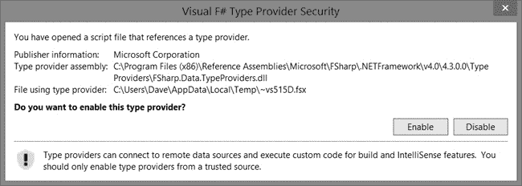

## 第十章 数据展示

几乎每个今天编写的应用程序都需要强大的机制来访问和操作数据。尽管.NET 框架中的各种数据访问技术都可以在 F#中使用，本章重点介绍两个特定领域：查询表达式和类型提供程序。

## 查询表达式

当 LINQ 被添加到.NET 中时，它彻底改变了我们访问数据的方式，通过提供统一的语法来查询来自不同数据源的数据。在 LINQ 引入后，C#和 Visual Basic 被扩展，加入了*查询语法*，这是一种类似 SQL 的语法，包含上下文敏感的关键字，实际上是对多个语言特性（如扩展方法和 lambda 表达式）的语法糖。从这个角度来看，F#有些姗姗来迟，因为在 F# 3.0 之前，使用 LINQ 的唯一方式是直接调用 LINQ 扩展方法。

尽管它们基于函数式编程，但直接使用 LINQ 方法由于其流畅接口，具有非常强的面向对象特征；序列被传递给方法，这些方法返回新的序列，且方法通常通过点符号进行链式调用。考虑以下查询，它直接对 F#列表使用 LINQ 扩展方法，筛选出奇数，并按降序对结果进行排序（记得打开`System.Linq`命名空间）：

```
[ 1..100 ]
  .Where(fun n -> n % 2 = 0)
  .OrderByDescending(fun n -> n)
```

正如你所看到的，以这种方式链式调用方法比函数式编程更具面向对象的特性。*查询表达式*，在 F# 3.0 中引入，通过提供类似 SQL 的语法，改变了这一点，这种语法类似于 C#和 Visual Basic 中的查询语法。它们实际上就是 F#的 LINQ。

查询表达式的形式是`query { ... }`。在花括号内，我们可以识别一系列我们希望应用于序列的操作，从而形成一个查询。例如，我们可以将之前的查询重写为这样的查询表达式（对于查询表达式，不需要显式地打开`System.Linq`）：

```
query { for n in [ 1..100 ] do
        where (n % 2 = 0)
        sortByDescending n }
```

现在，过滤和排序列表看起来和感觉上更具函数式编程的特点。我们不再直接链式调用方法，而是以更惯用的方式表达查询，使用表达式组合和函数调用。由于查询表达式是 LINQ 技术的包装器，因此你可以在任何序列上使用它们。

鉴于这个简单的例子，有人可能会认为`Seq`和`List`模块函数可以达到类似的效果，在许多情况下，确实如此。例如，我们可以轻松地将`where`运算符替换为`Seq.filter`函数的调用。同样，我们也可以常常使用`Seq.sortBy`来代替`sortBy`运算符。一个不那么显而易见的事实是，由于查询表达式是建立在 LINQ 之上的，它们可以提供额外的优化，比如在 SQL 查询中生成`WHERE`子句，以防止从数据库中检索大量数据集。

为了简便起见，除非另有说明，本章中的每个查询表达式示例将使用以下`QuerySource`模块中定义的类型和集合。

```
module QuerySource =
  open System

  type film = { id : int; name : string; releaseYear : int; gross : Nullable<float> }
              override x.ToString() = sprintf "%s (%i)" x.name x.releaseYear
  type actor = { id : int; firstName : string; lastName : string }
              override x.ToString() = sprintf "%s, %s" x.lastName x.firstName
  type filmActor = { filmId : int; actorId : int }

  let films =
    [ { id = 1; name = "The Terminator"; releaseYear = 1984; gross = Nullable 38400000.0 }
      { id = 2; name = "Predator"; releaseYear = 1987; gross = Nullable 59735548.0 }
      { id = 3; name = "Commando"; releaseYear = 1985; gross = Nullable<float>() }
      { id = 4; name = "The Running Man"; releaseYear = 1987; gross = Nullable 38122105.0 }
      { id = 5; name = "Conan the Destroyer"; releaseYear = 1984; gross = Nullable<float>() } ]

  let actors =
    [ { id = 1; firstName = "Arnold"; lastName = "Schwarzenegger" }
      { id = 2; firstName = "Linda"; lastName = "Hamilton" }
      { id = 3; firstName = "Carl"; lastName = "Weathers" }
      { id = 4; firstName = "Jesse"; lastName = "Ventura" }
      { id = 5; firstName = "Vernon"; lastName = "Wells" } ]
  let filmActors =
    [ { filmId = 1; actorId = 1 }
      { filmId = 1; actorId = 2 }
      { filmId = 2; actorId = 1 }
      { filmId = 2; actorId = 3 }
      { filmId = 2; actorId = 4 }
      { filmId = 3; actorId = 1 }
      { filmId = 3; actorId = 5 }
      { filmId = 4; actorId = 1 }
      { filmId = 4; actorId = 4 }
      (* Intentionally omitted actor for filmId = 5 *) ]
```

`QuerySource`模块本身并没有特别有趣的地方，但这里定义的类型和集合足以代表我们可以以多种方式查询的基本数据模型。`film`和`actor`类型还包括了`ToString`的重写，以简化查询输出。

### 基本查询

在最基本的形式中，查询表达式由一个可枚举的`for`循环和一个投影组成。可枚举的`for`循环为源序列中的项定义一个名称。投影标识查询返回的数据。

最常见的投影操作符之一是`select`，它等同于 LINQ 的`Select`方法，并定义结果序列中每个项的结构（类似于`Seq.map`）。最基本的情况下，`select`操作只是直接投影每个数据项，像这样：

```
query { for f in QuerySource.films do select f }
```

结果为：

```
val it : seq<QuerySource.film> =
  seq
    [{id = 1;
      name = "The Terminator";
      releaseYear = 1984;
      gross = 38400000.0;};
      -- *snip* -- ]
```

`select`操作不仅限于仅投影源数据项；它们还可以转换源序列，投影更复杂的类型，如元组、记录或类。例如，要投影一个包含电影名称及其上映年份的元组，可以这样写：

```
query { for f in QuerySource.films do
        select (f.name, f.releaseYear) }
```

结果为：

```
val it : seq<string * int> =
  seq
    [("The Terminator", 1984); ("Predator", 1987); ("Commando", 1985);
     ("The Running Man", 1987); ...]
```

在这些简单的示例中，我们显式地包含了`select`操作来转换源序列。随着查询复杂性的增加，通常隐含地投影原始的、未变换的数据项，因此`select`操作通常可以安全地省略。为了节省空间，我通常会用`ToString`投影结果，但我鼓励你尝试不同的投影方式，以熟悉查询行为。

### 数据过滤

查询通常涉及指定某些条件来筛选掉不需要的数据。过滤数据有两种主要方法：基于谓词的过滤器和不同项过滤器。

#### 基于谓词的过滤器

*基于谓词的过滤器*允许你通过指定每个源序列项必须满足的条件来过滤数据，从而将其包含在投影序列中。要创建一个基于谓词的过滤器，只需在查询中包含 F#等效于 LINQ 的`Where`方法——`where`操作符，后跟一个布尔表达式（通常称为*谓词*）。(注意，表达式通常需要加上括号。)例如，要仅选择 1984 年上映的电影，可以写成这样：

```
query { for f in QuerySource.films do
        where (f.releaseYear = 1984)
        select (f.ToString()) }
```

获取：

```
val it : seq<string> =
  seq ["The Terminator (1984)"; "Conan the Destroyer (1984)"]
```

在编写基于谓词的过滤器时，必须注意源序列的底层类型。对于到目前为止看到的简单示例，这并不是问题，但在许多情况下，特别是当你处理`IQueryable<'T>`实例时，可能需要处理空值。

空值可能在查询表达式中造成问题，因为标准比较操作符无法处理它们。例如，如果你使用标准的等于操作符查询所有总票房不超过 4000 万美元的电影，像这样：

```
query { for f in QuerySource.films do
        where (f.gross <= 40000000.0)
        select (f.ToString()) }
```

你将会收到以下错误，因为 `gross` 被定义为 `Nullable<float>`：

```
QueryExpressions.fsx(53,16): error FS0001: The type 'System.Nullable<float>'
does not support the 'comparison' constraint. For example, it does not support
the 'System.IComparable' interface
```

为了绕过这个限制，你需要使用 `Microsoft.FSharp.Linq.NullableOperators` 模块中定义的可空操作符。这些操作符与标准操作符类似，只不过当左操作数是 `Nullable<_>` 时，它们以问号 (`?`) 开头；当右操作数是 `Nullable<_>` 时，它们以问号结尾；或者当两个操作数都是 `Nullable<_>` 时，它们被问号包围。表 10-1 列出了每个可空操作符。

表 10-1. 可空操作符

| 操作符 | 左侧可空 | 右侧可空 | 双侧可空 |
| --- | --- | --- | --- |
| 等于 | `?=` | `=?` | `?=?` |
| 不等式 | `?<>` | `<>?` | `?<>?` |
| 大于 | `?>` | `>?` | `?>?` |
| 大于或等于 | `?>=` | `>=?` | `?>=?` |
| 小于 | `?<` | `<?` | `?<?` |
| 小于或等于 | `?<=` | `<=?` | `?<=?` |
| 加法 | `?+` | `+?` | `?+?` |
| 减法 | `?-` | `-?` | `?-?` |
| 乘法 | `?*` | `*?` | `?*?` |
| 除法 | `?/` | `/?` | `?/?` |
| 取模 | `?%` | `%?` | `?%?` |

现在我们可以使用适当的可空操作符重写之前的查询，像这样：

```
open Microsoft.FSharp.Linq.NullableOperators

query { for f in QuerySource.films do
        where (f.gross ?<= 40000000.0)
        select (f.ToString()) }
```

获取：

```
val it : seq<string> = seq ["The Terminator (1984)"; "The Running Man (1987)"]
```

正如你所看到的，尽管底层序列包含一些空值，查询仍然返回了两个匹配项。

可以使用布尔操作符将多个谓词连接在一起。例如，为了只获取 1987 年发布且总票房不超过 4000 万美元的电影，你可以这样写：

```
query { for f in QuerySource.films do
        where (f.releaseYear = 1987 && f.gross ?<= 40000000.0)
        select (f.ToString()) }
```

得到：

```
val it : seq<string> = seq ["The Running Man (1987)"]
```

#### 不同项筛选器

查询表达式可以通过筛选重复项，仅生成底层序列中独特值的序列。为了实现这一点，你只需要在查询中包含 `distinct` 操作符。

`distinct` 操作符对应于 LINQ 的 `Distinct` 方法，但与 C# 或 VB 不同，查询表达式允许你直接在查询中包含它，而不是作为单独的方法调用。例如，要查询不同的发行年份，你可以写：

```
query { for f in QuerySource.films do
        select f.releaseYear
        distinct }
```

在这里，我们已将不同的发行年份投影到一个新的序列中：

```
val it : seq<int> = seq [1984; 1987; 1985]
```

### 访问单个项目

一个序列中包含多个项目是很常见的，但你实际上只关心其中的一个项目。查询表达式包括多个操作符，用于访问序列中的第一个项目、最后一个项目或任意项目。

#### 获取第一个或最后一个项目

要从序列中获取第一个项目，可以使用`head`或`headOrDefault`操作符。这些操作符分别对应于 LINQ 中`First`和`FirstOrDefault`方法的无参重载，但使用更具函数式编程风格的`head`来标识第一个项目（就像在 F#列表中一样）。`head`和`headOrDefault`的区别在于，`head`在源序列为空时会抛出异常，而`headOrDefault`则返回`Unchecked.defaultof<_>`。

要从序列中获取第一个项目，只需像这样将序列投影到其中一个头操作符：

```
query { for f in QuerySource.films do headOrDefault }
```

在这种情况下，结果是：

```
val it : QuerySource.film = {id = 1;
                             name = "The Terminator";
                             releaseYear = 1984;
                             gross = 38400000.0;}
```

类似地，你可以使用`last`或`lastOrDefault`操作符获取序列中的最后一个项目。这些操作符的行为与它们的头操作符相同，`last`在序列为空时会抛出异常，而`lastOrDefault`则不会。根据底层序列类型，获取最后一个项目可能需要遍历整个序列，因此要小心，因为该操作可能会很昂贵或耗时。

#### 获取任意项目

当你想通过索引获取特定项目时，可以使用`nth`操作符，它相当于 LINQ 中的`ElementAt`方法。例如，要从`films`序列中获取第三个元素，你可以这样构造查询：

```
query { for f in QuerySource.films do nth 2 }
```

在这里，结果是：

```
val it : QuerySource.film = {id = 3;
                             name = "Commando";
                             releaseYear = 1985;
                             gross = null;}
```

尽管`nth`操作符在你已经知道索引的情况下非常有用，但更常见的是想要获取第一个符合某些条件的项目。在这些情况下，你会希望使用`find`操作符。

`find`操作符相当于调用 LINQ 的`First`方法并传入一个谓词。它也类似于`where`操作符，不同之处在于，它只返回单一的项目，而不是返回一个新的序列。例如，要获取 1987 年列出的第一部电影，你可以这样写：

```
query { for f in QuerySource.films do find (f.releaseYear = 1987) }
```

执行此查询将给你：

```
val it : QuerySource.film = {id = 2;
                             name = "Predator";
                             releaseYear = 1987;
                             gross = 59735548.0;}
```

`find`操作符对于查找第一个符合某些条件的项目非常有用，但它不能保证第一个匹配项是唯一匹配项。当你想返回一个单一的值，但又需要确保查询结果只包含一个项目（例如，当你通过键值查找项目时），你可以使用`exactlyOne`操作符，它对应于 LINQ 中`Single`方法的无参重载。例如，要根据`id`获取一部电影并确保唯一性，你可以这样写：

```
query { for f in QuerySource.films do
        where (f.id = 4)
        exactlyOne }
```

在这种情况下，查询返回：

```
val it : QuerySource.film = {id = 4;
                             name = "The Running Man";
                             releaseYear = 1987;
                             gross = 38122105.0;}
```

当源序列不包含正好一个项目时，`exactlyOne`操作符会抛出异常。如果你希望在源序列为空时使用默认值，可以改用`exactlyOneOrDefault`操作符。但请注意，如果源序列包含多个项目，`exactlyOneOrDefault`仍然会抛出异常。

### 注意

*查询表达式语法不包括等同于基于谓词的`Single`或`SingleOrDefault`重载的操作符。*

### 排序结果

查询表达式使得排序数据变得容易，而且在某些方面，比各种集合模块中的排序函数更加灵活。这些排序操作符允许你对可空值和非可空值进行升序或降序排序，甚至可以按多个值排序。

#### 按升序排序

按升序排序一个序列需要使用`sortBy`或`sortByNullable`操作符。这两个操作符都基于 LINQ 的

`OrderBy`方法。内部而言，这些方法的差异仅在于对其参数应用的泛型约束。正如它们的名字所暗示的那样，`sortBy`操作符用于非可空值，而`sortByNullable`用于`Nullable<_>`值。

使用这两个操作符时，你需要指定排序的值。例如，要按名称排序电影，你可以这样写：

```
query { for f in QuerySource.films do
        sortBy f.name
        select (f.ToString()) }
```

这将返回以下序列：

```
val it : seq<string> =
  seq
    ["Commando (1985)"; "Conan the Destroyer (1984)"; "Predator (1987)";
     "The Running Man (1987)"; ...]
```

#### 降序排序

要按降序排序一个序列，你可以使用`sortByDescending`或`sortByNullableDescending`操作符。这些操作符基于 LINQ 的`OrderByDescending`方法，和它们的升序对应物一样，内部的区别仅在于对其参数应用的泛型约束。

要按名称降序排序`films`序列，你可以这样写：

```
query { for f in QuerySource.films do
        sortByDescending f.name
        select (f.ToString()) }
```

这将返回：

```
val it : seq<string> =
  seq
    ["The Terminator (1984)"; "The Running Man (1987)"; "Predator (1987)";
     "Conan the Destroyer (1984)"; ...]
```

#### 按多个值排序

要按多个值排序，首先使用`sortBy`或`sortByDescending`操作符进行排序，然后用其中一个`thenBy`操作符提供后续排序值。和主要的排序操作符一样，`thenBy`也有变体，允许你在使用可空值和非可空值时进行升序或降序排序。

四个`thenBy`变体只能在某个`sortBy`变体之后出现，它们是：

+   `thenBy`

+   `thenByNullable`

+   `thenByDescending`

+   `thenByNullableDescending`

这些操作符基于 LINQ 的`ThenBy`和`ThenByDescending`方法。要查看它们的实际应用，假设我们先按`releaseYear`排序`films`序列，再按`gross`降序排序：

```
query { for f in QuerySource.films do
        sortBy f.releaseYear
        thenByNullableDescending f.gross
        select (f.releaseYear, f.name, f.gross) }
```

该查询结果如下排序序列：

```
val it : seq<int * string * System.Nullable<float>> =
  seq
    [(1984, "The Terminator", 38400000.0); (1984, "Conan the Destroyer", null);
     (1985, "Commando", null); (1987, "Predator", 59735548.0); ...]
```

你可以链式调用更多`thenBy`操作符，来创建更复杂的排序场景。

### 分组

另一个常见的查询操作是分组。查询表达式提供了两个操作符，均基于 LINQ 的`GroupBy`方法，用于执行此操作。两个操作符都会生成一个中间序列，该序列包含`IGrouping<_,_>`实例，你可以在查询的后续部分引用它。

第一个操作符`groupBy`允许你指定一个键值，按照该键值对源序列中的项目进行分组。每个由`groupBy`生成的`IGrouping<_,_>`都包含键值和一个子序列，该子序列包含所有与键匹配的源序列中的项目。例如，要按上映年份分组电影，你可以这样写：

```
query { for f in QuerySource.films do
        groupBy f.releaseYear into g
        sortBy g.Key
        select (g.Key, g) }
```

该查询生成的结果（为易读性起见，已格式化并简化）：

```
val it : seq<int * IGrouping<int, QuerySource.film>> =
  seq
    [(1984, seq [{id = 1; -- *snip* --};
                 {id = 5; -- *snip* --}]);
     (1985, seq [{id = 3; -- *snip* --}]);
     (1987, seq [{id = 2; -- *snip* --};
                 {id = 4; -- *snip* --}])]
```

并非总是需要像`groupBy`运算符那样在结果的`IGrouping<_,_>`中包含完整的源项。相反，您可以使用`groupValBy`运算符来指定要包含的内容，无论是源中的单个值还是其他转换。与我们迄今为止看到的其他运算符不同，`groupValBy`接受两个参数：要包含在结果中的值和键值。

为了演示`groupValBy`运算符，让我们再次按`releaseYear`对电影进行分组，但这次我们将包含一个包含电影`name`和其`gross`收入的元组：

```
query { for f in QuerySource.films do
        groupValBy (f.name, f.gross) f.releaseYear into g
        sortBy g.Key
        select (g.Key, g) }
```

这给我们带来了：

```
val it : seq<int * IGrouping<int,(string * System.Nullable<float>)>> =
  seq
    [(1984,
      seq [("The Terminator", 38400000.0); ("Conan the Destroyer", null)]);
     (1985, seq [("Commando", null)]);
     (1987, seq [("Predator", 59735548.0); ("The Running Man", 38122105.0)])]
```

现在，结果分组中只包含我们显式请求的数据，而不是完整的电影实例。

### 分页

查询表达式允许您轻松地对序列进行分页。想象一下典型的搜索结果页面，其中项目按每页若干个（例如，10 个）进行分割。与其管理标识用户应该查看哪个分区的占位符，您可以使用查询表达式，它提供了`skip`、`skipWhile`、`take`和`takeWhile`运算符，帮助您直接在查询中获取正确的分区。这些运算符中的每一个都与其底层的 LINQ 方法同名。

`skip`和`take`运算符都接受一个整数，表示要跳过或包含的项目数。例如，您可以编写一个函数来获取特定的页面，像这样：

```
let getFilmPageBySize pageSize pageNumber =
  query { for f in QuerySource.films do
          skip (pageSize * (pageNumber - 1))
          take pageSize
          select (f.ToString()) }
```

现在，获取特定页面只需调用`getFilmPage`函数。例如，要获取包含三项的第一页，您可以这样写：

```
getFilmPageBySize 3 1
```

这将产生：

```
val it : seq<string> =
  seq ["The Terminator (1984)"; "Predator (1987)"; "Commando (1985)"]
```

同样，您可以通过以下方式获取第二页结果：

```
getFilmPageBySize 3 2
```

这给我们带来了：

```
val it : seq<string> =
  seq ["The Running Man (1987)"; "Conan the Destroyer (1984)"]
```

指定比序列中实际存在更多的项目是可以的。如果到达序列的末尾，`skip`和`take`运算符会返回到目前为止已选择的项目，并且不会抛出任何异常。

`skipWhile`和`takeWhile`运算符与`skip`和`take`非常相似，不同之处在于它们不是针对已知数量的项目进行操作，而是根据条件跳过或选择项目。这对于根据某些标准分页处理可变数量的项目非常有用。例如，以下函数返回给定年份上映的电影：

```
let getFilmPageByYear year =
  query { for f in QuerySource.films do
          sortBy f.releaseYear
          skipWhile (f.releaseYear < year)
          takeWhile (f.releaseYear = year)
          select (f.ToString()) }
```

调用此函数并传入一个年份将生成一个包含零个或多个项目的序列。例如，调用它并传入 1984 将返回：

```
val it : seq<string> =
  seq ["The Terminator (1984)"; "Conan the Destroyer (1984)"]
```

而调用 1986 时将返回空项，因为源序列中没有 1986 年上映的电影。

如果您想知道是否可以通过单个`where`运算符简化这个按`releaseYear`分页的简单示例，答案是可以。这个示例只是展示了`takeWhile`的效果。`where`和`takeWhile`的作用类似，但区分它们非常重要，特别是在面对更复杂的谓词时。两者的区别在于，`takeWhile`在找到不匹配的项时会立即停止，而`where`则不会。

### 数据聚合

我们常常需要展示或以其他方式处理表格数据，有时我们真正需要的是数据的聚合视图。诸如计算序列中项数、求和或寻找平均值等聚合操作，都是常见的需求，可以通过内置的查询操作符来实现。

计算序列中的项数很简单；只需将序列映射到`count`操作符。

```
query { for f in QuerySource.films do count }
```

评估此查询告诉我们`films`序列中包含五个项。然而，请注意，计算序列中的项数可能是一个昂贵的操作；它通常需要枚举整个序列，这可能会对性能产生负面影响。尽管如此，基于此操作符的`Count`方法足够智能，可以跳过某些序列（如数组）。如果你仅仅是为了判断序列是否包含数据而计算项数，你应该考虑使用`exists`操作符，详见检测项。

其余的聚合操作符使你可以根据选择器轻松地对序列执行数学聚合。这些操作符——`minBy`、`maxBy`、`sumBy`和`averageBy`——分别允许你计算最小值、最大值、总和或平均值。在内部，`minBy`和`maxBy`操作符分别使用 LINQ 的`Min`和`Max`方法，但`sumBy`和`averageBy`提供了自己的实现，并且完全独立于 LINQ。

这四个操作符中的每一个也都有其对应的可空操作符，能够处理可空值，类似于排序结果中介绍的排序操作符。为了演示，我们将使用可空形式查询`films`序列。

为了找到票房最高的电影，我们可以写：

```
query { for f in QuerySource.films do maxByNullable f.gross }
```

如预期，运行此查询返回`59735548.0`。将`maxByNullable`替换为`minByNullable`返回`38122105.0`，而`sumByNullable`返回`136257653.0`。然而，`averageByNullable`操作符的行为并不像你可能预期的那样。

使用`averageByNullable`计算总收入的平均值为`27251530.6`。发生的情况是，尽管操作符在求和阶段跳过了空值，但它仍然将总和除以序列中的项数，而不管跳过了多少空项。这意味着空值实际上被当作零处理，这可能是可取的，也可能不可取。本章稍后我们将探讨如何定义一个新的查询操作符，在计算平均值时真正忽略空值。

### 检测项

到目前为止，我们已经探索了多种方式来构造查询表达式，以便转换、过滤、排序、分组和聚合序列。然而，有时你并不关心从序列中获取特定项，而是希望检查序列是否包含符合某些标准的数据。与返回新序列或特定项不同，本节讨论的运算符返回一个布尔值，指示序列是否包含所需的数据。像`distinct`运算符一样，这些运算符是查询表达式的一部分，这是 F#查询表达式与 C#和 Visual Basic 查询语法的另一个区别。

当你想查看一个已知的项是否包含在一个序列中时，你可以使用`contains`运算符。`contains`运算符基于 LINQ 的`Contains`方法，接受你要查找的项作为其参数。例如，如果我们想检测*幼儿园警探*是否存在于`films`集合中，可以这样写：

```
open System
open QuerySource

let kindergartenCop =
  { id = 6; name = "Kindergarten Cop"; releaseYear = 1990; gross = Nullable 91457688.0 }

query { for f in films do
        contains kindergartenCop }
```

调用此查询会告诉你*幼儿园警探*不在集合中（让我松了口气）。然而，如你所见，`contains`运算符实际上只适用于当你已经有对可能已经是集合一部分的项的引用时。如果你只知道你正在寻找的部分值，例如电影名称，你可以修改查询，投影每个名称并将你要查找的名称传递给`contains`，像这样：

```
query { for f in QuerySource.films do
        select f.name
        contains "Kindergarten Cop" }
```

然而，像这样投影值并不是特别高效，因为它涉及在找到指定项之前对整个序列进行枚举。相反，你可以使用另一个运算符`exists`，它基于 LINQ 的`Any`方法。`exists`运算符类似于`where`，只是它在找到符合谓词的项时就停止枚举序列，并返回`true`或`false`。例如，之前的查询可以用`exists`这样表达：

```
query { for f in QuerySource.films do
        exists (f.name = "Kindergarten Cop") }
```

当然，传递给`exists`的谓词不必查找特定项。我们可以很容易地通过以下查询来判断是否有任何电影的票房至少达到 5000 万美元：

```
open Microsoft.FSharp.Linq.NullableOperators

query { for f in QuerySource.films do
        exists (f.gross ?>= 50000000.0) }
```

因为*掠食者*的票房接近 6000 万美元，所以之前的查询返回`true`。如果你想检查序列中的每个项是否满足某个条件，可以使用`all`运算符。基于 LINQ 的`All`方法，`all`运算符枚举序列，当每个项都符合谓词时返回`true`。如果遇到一个不符合谓词的项，枚举停止，`all`返回`false`。例如，若要检查每部电影的票房是否至少达到 5000 万美元，你可以构建如下查询：

```
query { for f in QuerySource.films do
        all (f.gross ?>= 50000000.0) }
```

在我们的`films`集合中，只有一项满足条件，因此查询返回`false`。

### 联接多个数据源

从单个序列查询数据是有用的，但数据通常分布在多个源中。查询表达式继承了 LINQ 的连接功能，它允许你在单个表达式中查询来自多个源的数据。查询表达式中的连接类似于可枚举的`for`循环，它们包括一个迭代标识符和源序列，但以适当的`join`操作符开始，并且还包括连接条件。

第一种连接类型，*内连接*，使用`join`操作符将一个序列中的值与第二个序列中的值进行关联。在内部，`join`操作符使用 LINQ 的`Join`方法来实现其功能。一旦序列连接完成，来自两个序列的值可以通过后续操作符（如`where`或`select`）进行引用。

直到现在，我们编写的所有查询只使用了`films`集合。回想一下，在我们在本章开始时创建`QuerySource`模块时，我们还定义了另外两个集合：`actors`和`filmActors`。这三个集合（`films`、`actors`和`filmActors`）一起建模了`films`与`actors`之间的多对多关系，其中`filmActors`作为连接表。我们可以使用`join`操作符将这三个集合结合在一个查询中，如下所示：

```
query { for f in QuerySource.films do
        join fa in QuerySource.filmActors on (f.id = fa.filmId)
        join a in QuerySource.actors on (fa.actorId = a.id)
        select (f.name, f.releaseYear, a.lastName, a.firstName) }
```

将多个序列连接在一起，只需要为每个序列包含一个连接表达式，并通过它们的成员及等式操作符确定它们之间的关系。调用这个查询将产生以下序列（根据 FSI 进行了截断）：

```
val it : seq<string * int * string * string> =
  seq
    [("The Terminator", 1984, "Schwarzenegger", "Arnold");
     ("The Terminator", 1984, "Hamilton", "Linda");
     ("Predator", 1987, "Schwarzenegger", "Arnold");
     ("Predator", 1987, "Weathers", "Carl"); ...]
```

F#通过`groupJoin`操作符公开了 LINQ 的`GroupJoin`功能。这允许你连接两个序列，但与选择满足连接条件的单个项不同，它将满足连接条件的每个项投影到另一个可以在查询中后续引用的序列中。你可以使用这个中间序列来创建一个层次化的数据结构，这类似于`groupBy`操作符创建的`IGrouping<_,_>`实例。

请考虑以下查询，它创建了一个层次结构，其中每个演员根据他或她出演的电影进行分组：

```
query { for f in QuerySource.films do
        groupJoin fa in QuerySource.filmActors on (f.id = fa.filmId) into junction
        select (f.name, query { for j in junction do
                                join a in QuerySource.actors on (j.actorId = a.id)
                                select (a.lastName, a.firstName) } ) }
```

在这里，我们使用`groupJoin`操作符创建了一个名为`junction`的中间序列。在投影的元组内，我们有一个嵌套查询，在这个查询中，我们将`actors`与`junction`连接并投影出各个演员的名字。这将产生以下序列，我已为可读性格式化：

```
val it : seq<string * seq<string * string>> =
  seq
    [("The Terminator", seq [("Schwarzenegger", "Arnold");
                             ("Hamilton", "Linda")]);
     ("Predator", seq [("Schwarzenegger", "Arnold");
                       ("Weathers", "Carl");
                       ("Ventura", "Jesse")]);
     ("Commando", seq [("Schwarzenegger", "Arnold");
                       ("Wells", "Vernon")]);
     ("The Running Man", seq [("Schwarzenegger", "Arnold");
                              ("Ventura", "Jesse")]);
     ...]
```

如你所见，外部查询（`films`部分）返回一个包含元组的单一序列。每个项内部都有一个包含与该电影相关的演员的序列。从这些截断的结果中无法看出的是，当连接的序列中的项没有满足连接条件时（例如*毁灭者 Conan*），`groupJoin`操作创建的序列将为空。

如果你更喜欢将`groupJoin`的结果展平，而不是返回层次结构，你可以在`groupJoin`操作后跟一个可枚举的`for`循环，使用连接序列作为循环源。在这里，之前的查询被重构为将每个演员与电影同行返回：

```
query { for f in QuerySource.films do
        groupJoin fa in QuerySource.filmActors on (f.id = fa.filmId) into junction
        for j in junction do
        join a in QuerySource.actors on (j.actorId = a.id)
        select (f.name, f.releaseYear, a.lastName, a.firstName) }
```

这个查询的结果与内连接的结果相同，因此我在这里不会重复输出。在大多数情况下，你会希望使用`join`操作符，避免创建中间连接序列的开销，但在某些情况下，使用`groupJoin`这样的操作是有意义的：左外连接。

默认情况下，如果在`groupJoin`中没有任何项满足连接条件，结果是一个空序列。然而，如果你在结果序列上使用`DefaultIfEmpty`方法，你会得到一个新序列，包含一个单一项，该项是基础类型的默认值。为了在查询中执行左外连接，你可以像在之前的查询中一样使用`groupJoin`操作符，但在可枚举的`for`循环中包括对`DefaultIfEmpty`的调用——例如，`j.DefaultIfEmpty()`。或者，你可以使用`leftOuterJoin`操作符来实现相同的结果。

不幸的是，左外连接是 F#和其他.NET 框架之间不一致的一个领域，这可能会导致很多麻烦。但这实际上只有在你使用核心 F#类型时才会成为问题。考虑以下查询：

```
query { for f in QuerySource.films do
        leftOuterJoin fa in QuerySource.filmActors on (f.id = fa.filmId) into junction
        for j in junction do
        join a in QuerySource.actors on (j.actorId = a.id)
        select (f.name, f.releaseYear, a.lastName, a.firstName) }
|> Seq.iter (printfn "%O")
```

当这个查询枚举（通过`Seq.iter`）时，它会抛出`NullReferenceException`，一旦尝试连接*《野蛮人柯南》*的演员信息。因为在`filmActors`序列中没有该电影的条目，所以左外连接中的`DefaultIfEmpty`调用导致`junction`中的唯一条目为`null`。

等等，什么？`null`？`filmActor`不是一个记录类型吗？如果`null`对于记录类型来说不是有效值，那它怎么可能是`null`呢？答案在于，通过调用.NET 框架的方法，我们已经脱离了 F#的沙箱。`null`在 F#中对于记录类型可能不是有效的，但公共语言运行时（CLR）并没有记录类型的概念；它只知道值类型和引用类型，从它的角度来看，记录类型只是引用类型。因此，`null`是一个有效值。不幸的是，因为我们的代码完全是在 F#中，并且 F#编译器强制执行记录类型的值约束，我们无法通过模式匹配或`if...then`表达式来处理`null`值。我们甚至不能使用`AllowNullLiteral`属性，因为编译器也不允许那样做。

解决这个问题有点麻烦。我们可以先将查询分成两部分：一部分连接`actors`到`filmActors`，另一部分连接`films`，像这样：

```
let actorsFilmActors =
  query { for a in QuerySource.actors do
          join fa in QuerySource.filmActors on (a.id = fa.actorId)
          select (fa.filmId, a) }

query { for f in QuerySource.films do
        leftOuterJoin (id, a) in actorsFilmActors on (f.id = id) into junction
        for (_, a) in junction do
        select (f.name, a.lastName, a.firstName) }
```

这是一个不错的开始，但在枚举类型的`for`循环中，针对`junction`的元组模式匹配仍然会引发`NullReferenceException`，因为 F#也不允许元组值为`null`。不过，我们可以使用另一种解决方法：将其强制转换为`obj`类型。

```
query { for f in QuerySource.films do
        leftOuterJoin (id, a) in actorsFilmActors on (f.id = id) into junction
        for x in junction do
        select (match (**x :> obj**) with

               | null -> (f.name, "", "")
               | _ -> let _, a = x
                      (f.name, a.lastName, a.firstName))
      }
```

`null`可能不是元组的有效值，但对于`obj`却是。通过显式地将其上转换为`obj`，我们可以使用模式匹配来检测`null`值，并返回适当的元组，而不是抛出异常。

### 扩展查询表达式

如你在前面的章节中所看到的，查询表达式提供了一种简便且富有表现力的方式来处理数据。查询表达式还提供了一个真正将其与 C#和 Visual Basic 中的查询语法区分开的好处：它们是完全可扩展的。在本节中，我将展示几个额外的运算符。我们将首先通过定义暴露`Single`和`SingleOrDefault`参数化重载的运算符，填补内置运算符的空白。接下来，我们将进入一个更复杂的示例，允许我们在忽略所有`null`值的情况下计算平均值。

#### 示例：ExactlyOneWhen

回顾获取任意项，`exactlyOne`和`exactlyOneOrDefault`运算符暴露了 LINQ 的`Single`和`SingleOrDefault`无参数版本，但对于接受谓词的重载版本，并没有类似的运算符。我们可以通过利用 F#类型扩展的强大功能，轻松定义我们自己的运算符来暴露这些方法。

为了创建自定义运算符，我们需要扩展位于`Microsoft.FSharp.Linq`命名空间中的`QueryBuilder`类。这个类定义了最终作为查询运算符的方法。从根本上讲，我们定义的类型扩展与任何其他类型扩展没有区别；我们只需要包含一些属性，以便编译器知道这些函数在查询表达式中的行为。

以下是完整的代码列表：

```
open System
open Microsoft.FSharp.Linq

type QueryBuilder with

① [<CustomOperation("exactlyOneWhen")>]
  member ② __.ExactlyOneWhen (③ source : QuerySource<'T,'Q>,
                              ④ [<ProjectionParameter>] selector) =

    System.Linq.Enumerable.Single (source.Source, Func<_,_>(selector))

  [<CustomOperation("exactlyOneOrDefaultWhen")>]
  member __.ExactlyOneOrDefaultWhen (source : QuerySource<'T,'Q>,
                                     [<ProjectionParameter>] selector) =
    System.Linq.Enumerable.SingleOrDefault (source.Source, Func<_,_>(selector))
```

这个代码片段在`QueryBuilder`类上定义了两个扩展方法：`exactlyOneWhen`和`exactlyOneOrDefaultWhen`。由于它们非常相似，我们将重点关注`exactlyOneWhen`运算符。第一个需要关注的项是应用于方法本身的`CustomOperation`属性①。该属性表明该方法应该在查询表达式和运算符名称中可用。

接下来，方法的`this`标识符是两个下划线字符②，以保持与其他运算符定义的一致性。位于③处的`source`参数，标注为`QuerySource<'T, 'Q>`，标识了运算符将作用的序列。

紧跟在`source`后面的是`selector`参数④。该参数是一个函数，将应用于`source`中的每个项，以确定它是否应该被选中。应用于`selector`的`ProjectionParameter`属性指示编译器该函数被推断为接受`'T`（从`source`推断出来），这样你就可以像直接操作实例一样编写选择器函数；也就是说，如果你正在查询`films`集合，并且使用`f`作为迭代标识符，你可以写`f.id = 4`。如果没有`ProjectionParameter`，你就必须使用完整的 lambda 语法（或正式函数），而不仅仅是这个表达式。

定义了新的运算符后，我们现在可以编写使用这些运算符的查询。例如，要使用`exactlyOneWhen`运算符通过`id`查找电影，你可以写：

```
query { for f in QuerySource.films do
        exactlyOneWhen (f.id = 4) }
```

如你所见，使用这些运算符后，你不再需要在检查序列是否只包含一个项目之前，先使用`where`运算符来过滤结果。

#### 示例：AverageByNotNull

对于一个更复杂的自定义运算符示例，让我们提供一个替代方案，代替在聚合数据中使用的`averageByNullable`运算符来计算电影的平均总票房。计算结果显示平均值为`27251530.6`，因为两个空值从总和中被排除，但除数仍然是五。如果你希望真正忽略空值并将总和除以三，`averageByNullable`运算符无法帮助你，但你可以定义一个像这样的自定义运算符：

```
open System
open Microsoft.FSharp.Linq

type QueryBuilder with

  -- *snip* --
  [<CustomOperation("averageByNotNull")>]
  member inline __.AverageByNotNull< 'T, 'Q, 'Value
                      when 'Value :> ValueType
                      and 'Value : struct
                      and 'Value : (new : unit -> 'Value)
                      and 'Value : (static member op_Explicit : 'Value -> float)>
 (source : QuerySource<'T, 'Q>,
  [<ProjectionParameter>] selector : 'T -> Nullable<'Value>) =
   source.Source
   |> Seq.fold
       (fun (s, c) v -> let i = v |> selector
                        if i.HasValue then
                         (s + float i.Value, c + 1)
                        else (s, c))
       (0.0, 0)
   |> (function
      | (_, 0) -> Nullable<float>()
      | (sum, count) -> Nullable(sum / float count))
```

请注意，`AverageByNotNull`方法结合了与`exactlyOneWhen`和`exactlyOneOrDefaultWhen`相同的许多原则；也就是说，它们都涉及`CustomOperation`和`ProjectionParameter`属性。`AverageByNotNull`与其他方法的不同之处在于，它被定义为内联方法，以确保泛型参数能够得到解决。由于它们非常相似，我为`AverageByNotNull`的方法签名和泛型约束基本上基于`averageByNullable`运算符，尽管我稍微简化了它以便演示。

现在我们已经定义了`averageByNotNull`运算符，可以像这样将其包含在查询中：

```
query { for f in QuerySource.films do
        averageByNotNull f.gross }
```

执行此查询会返回`45419217.67`，与通过`averageByNullable`返回的`27251530.6`形成鲜明对比。

## 类型提供者

除了查询表达式，F# 3.0 的另一个“杀手级功能”是类型提供者。*类型提供者*的开发目的是抽象化外部数据工作所需的类型、属性和方法的创建过程，因为这个过程通常既繁琐、容易出错，又难以维护。

许多类型提供者可以类比为传统的对象关系映射（ORM）工具，如 NHibernate 或 Entity Framework，尽管它们的范围可能更广。ORM 工具通常需要大量的配置才能有效使用。尽管有一些工具简化了许多流行 ORM 技术的配置过程，但它们仍然需要大量的维护。类 ORM 的类型提供者旨在通过将类型生成作为编译过程的一部分来消除这种开销。

类型提供者的另一个主要用途是简化其他复杂的接口。考虑一下像使用正则表达式匹配字符串这样的繁琐且容易出错的操作。正则表达式的语法本身就足够令人困惑，但从匹配集合中获取命名捕获还需要使用字符串键来识别你要访问的值。正则表达式类型提供者可以通过生成与正则表达式中的命名捕获对应的类型来简化接口。

无论提供者满足哪种需求类型，它们都提供三种主要的好处：

+   通过消除手动创建映射和类型定义的需求，使数据中心的探索性编程更易于访问

+   消除手动维护映射或其他类型定义的行政负担

+   降低因未检测到底层数据结构变化而引起错误的可能性

类型提供者的详细讨论超出了本书的范围。本节旨在介绍许多可以使用的类型提供者，这些提供者要么是 F# 核心分发的一部分，要么是通过一些流行的第三方库提供的。在你了解了可用的类型提供者后，我们将讨论如何初始化和使用一些类型提供者，轻松获取你关心的数据。

### 可用的类型提供者

F# 3.0 默认包含多个类型提供者。表 10-2 列出了内置提供者及其简要描述。

表 10-2. 内置类型提供者

| 提供者 | 描述 |
| --- | --- |
| `DbmlFile` | 提供与数据库标记语言文件（*.dbml*）描述的 SQL Server 数据库对应的类型 |
| `EdmxFile` | 提供与 LINQ-to-Entities 映射文件（*.edmx*）描述的数据库对应的类型 |
| `ODataService` | 提供与 OData 服务返回的类型对应的类型 |
| `SqlDataProvider` | 提供与 SQL Server 数据库对应的类型 |
| `SqlEntityProvider` | 提供与通过 LINQ-to-Entities 映射对应的数据库类型 |
| `WsdlService` | 提供与 WSDL 基础的 Web 服务返回的类型对应的类型 |

内置的类型提供程序列表非常简单，主要集中在数据库或类似数据库的数据源上。即便如此，提供的内容覆盖了相当多的用例。如果你的数据超出了内置类型所覆盖的范围，你可以定义自定义的类型提供程序，但这超出了本书的讨论范围。

在你开始构建自己的类型提供程序之前，应该先看看是否有第三方提供程序可以满足你的需求。在撰写本文时，几个流行的库包含了许多有用的类型提供程序，最著名的包括：`FSharpx`和`FSharp.Data`。表 10-3 列出了每个库中的几个类型提供程序，让你了解哪些类型提供程序是现成的，以及它们在不同场景中的应用。这个列表并不详尽无遗；肯定还有其他可用的库。

表 10-3. 一些可用的第三方类型提供程序

| 提供程序 | 描述 | FSharpx | FSharp.Data |
| --- | --- | --- | --- |
| `AppSettingsProvider` | 提供与配置文件中 AppSettings 部分的节点对应的类型 |  |   |
| `CsvProvider` | 提供可以轻松解析逗号分隔值（CSV）文件的类型 |   |  |
| `ExcelProvider` | 提供与 Excel 工作簿交互所需的类型 |  |   |
| `FileSystemProvider` | 提供与文件系统交互所需的类型 |  |   |
| `JsonProvider` | 提供表示 JavaScript 对象表示法（JSON）文档的类型 |   |  |
| `RegexProvider` | 提供可以检查正则表达式匹配的类型 |  |   |
| `XamlProvider` | 提供可以轻松解析 XAML 的类型 |  |   |
| `XmlProvider` | 提供表示 XML 文档的类型 |   |  |

### 使用类型提供程序

无论你需要哪种类型的提供程序，初始化时始终遵循相同的基本模式：

```
type *name* = *providerName*<*parameters*>
```

在上述语法中，*name* 是你用来访问提供程序功能的名称，*providerName* 标识提供程序类型本身，*parameters* 是控制提供程序行为的特定参数。参数通常包括连接字符串或数据源路径等内容，但最终每个类型提供程序都负责定义它所接受的参数。

在 Visual Studio 中第一次使用提供程序时，您将看到一个安全对话框，如图 10-1 所示：

图 10-1. 类型提供程序安全对话框

如对话框所示，类型提供程序可以连接到远程数据源并执行自定义代码，以实现构建和智能感知功能。一旦启用或禁用了类型提供程序，系统将不再提示您。如果以后想更改选择，您可以在 Visual Studio 选项对话框中的 F#工具下找到类型提供程序的列表。

### 示例：访问 OData 服务

这个第一个示例使用`ODataService`类型提供程序从*[`www.odata.org/`](http://www.odata.org/)*查询公开可用的 Northwind 示例 OData 服务。首先，我们需要引用两个程序集：

```
#r "System.Data.Services.Client"
#r "FSharp.Data.TypeProviders"
```

第一个程序集包含了`ODataService`提供程序所需的几个 Windows 通信基础（WCF）类。虽然我们在这个示例中并没有直接使用 WCF 类型，但如果没有添加引用，会导致编译错误。第二个程序集包含了提供程序本身。添加了这些程序集引用后，我们现在可以打开包含`ODataService`提供程序的命名空间：

```
open Microsoft.FSharp.Data.TypeProviders
```

接下来，我们包含一个类型定义，引用了适当的类型提供程序以及指向 Northwind 服务的地址：

```
type northwind =
  ODataService<"http://services.odata.org/V3/Northwind/Northwind.svc/">
```

`ODataService`提供程序接受提供的地址，附加`$metadata`，然后构造并导入服务描述的类型。为了与服务进行交互，我们需要通过提供程序类型获取数据上下文，如下所示：

```
let svc = northwind.GetDataContext()
```

在建立数据上下文后，我们现在拥有了查询数据所需的一切。这里我们将使用查询表达式从 Northwind 服务中获取一些发票信息。

```
let invoices =
  query { for i in svc.Invoices do
          sortByNullableDescending i.ShippedDate
          select (i.OrderDate, i.CustomerName, i.ProductName)
          take 5 }
```

上述查询没有什么特别的地方；它使用标准查询操作符选择了`OrderDate`、`CustomerName`和`ProductName`，从五个最近发货的发票中提取数据。*特殊*之处在于，凭借指向 OData 服务的类型提供程序，我们得到了一个完整的类型层次结构，模拟了服务暴露的类型。

### 注意

*并不是所有的标准查询操作符都被每个数据源支持。例如，OData 不支持连接操作，因此在包含两个 OData 数据源的查询中使用连接操作会导致错误。*

尽管我们已经定义了`invoices`绑定，但查询执行会推迟，直到我们真正枚举序列。为了简便起见，我们可以通过将序列传递给`Seq.iter`来执行此操作，像这样打印每个项目：

```
invoices |> Seq.iter (printfn "%A")
```

执行上述代码时，我运行它时打印出了以下项目，但如果源数据发生变化，您的结果可能会不同：

```
(5/4/1998 12:00:00 AM, "Drachenblut Delikatessen", "Jack's New England Clam Chowder")
(4/30/1998 12:00:00 AM, "Hungry Owl All-Night Grocers", "Sasquatch Ale")
(4/30/1998 12:00:00 AM, "Hungry Owl All-Night Grocers", "Boston Crab Meat")
(4/30/1998 12:00:00 AM, "Hungry Owl All-Night Grocers", "Jack's New England Clam Chowder")
(5/4/1998 12:00:00 AM, "Tortuga Restaurante", "Chartreuse verte")
```

到目前为止，`ODataService`提供程序一直是一个黑盒；只要你提供一个有效的地址，它通常就能正常工作，你不必考虑它是如何工作的。当你进行探索性编程时，这特别有用，但当提供程序没有返回你预期的结果时，它可能会让人感到沮丧。幸运的是，你可以订阅一些事件，以便深入了解提供程序正在做什么：`SendingRequest`和`ReadingEntity`。

`SendingRequest`事件在提供程序创建新的`HttpWebRequest`时发生，而`ReadingEntity`事件则在数据读取到实体中后发生。为了讨论的目的，我们将重点关注`SendingRequest`，因为它可以精确显示正在请求的内容，并帮助你优化查询。

使用`SendingRequest`时最有帮助的事情之一是查询与`SendingRequestEventArgs`关联的`WebRequest`对象的`RequestUri`属性。`RequestUri`包含 OData 请求的完整地址，因此一旦获取该地址，你可以将其粘贴到浏览器（或其他诊断工具，如 Fiddler）中进行调整。获取 URI 的一个简单方法是直接将其打印到控制台，如下所示：

```
svc.DataContext.SendingRequest.Add (fun args -> printfn "%O" args.Request.RequestUri)
```

只要在查询枚举之前执行前面的代码片段，URI 将在结果之前打印出来。在本节描述的查询中，打印的 URI 是：`http://services.odata.org/V3/ Northwind/Northwind.svc/Invoices()?$orderby=ShippedDate%20desc&$top=5&$select= OrderDate, CustomerName, ProductName`。

为了方便起见，本节中的整个示例，包括对`SendingRequest`的订阅，已在此完整呈现：

```
#r "System.Data.Services.Client"
#r "FSharp.Data.TypeProviders"

open Microsoft.FSharp.Data.TypeProviders

type northwind =
  ODataService<"http://services.odata.org/V3/Northwind/Northwind.svc/">
let svc = northwind.GetDataContext()

let invoices =
  query { for i in svc.Invoices do
          sortByNullableDescending i.ShippedDate
          select (i.OrderDate, i.CustomerName, i.ProductName)
          take 5 }

svc.DataContext.SendingRequest.Add (fun args -> printfn "%O" args.Request.RequestUri)
invoices |> Seq.iter (printfn "%A")
```

### 示例：使用 RegexProvider 解析字符串

在这个示例中，我们将看看`FSharpx`项目中的`RegexProvider`如何生成与正则表达式对应的类型，在处理匹配项时为你提供显著的安全性。要使用这个提供程序，你需要从 NuGet 获取`FSharpx.TypeProviders.Regex`包，或者从 GitHub 下载源代码（*[`github.com/fsharp/fsharpx/`](https://github.com/fsharp/fsharpx/)*）。

与`ODataProvider`示例一样，我们将首先引用一些程序集并打开一些命名空间：

```
#r "System.Drawing"
#r @"..\packages\FSharpx.TypeProviders.Regex.1.8.41\lib\40\FSharpx.TypeProviders.Regex.dll"

open System
open System.Drawing
```

由于我创建此脚本时使用了包含来自 NuGet 的`FSharp.TypeProviders.Regex`包的项目，因此我只是通过相对路径直接引用了该包；程序集的路径在你的机器上可能有所不同，具体取决于你如何获取该程序集及其版本。

引用程序集并打开常用命名空间后，我们现在可以创建类型提供程序。创建 `RegexProvider` 类似于创建 `ODataService`，不同之处在于，`RegexProvider` 不是使用 URI，而是使用正则表达式模式。对于这个例子，我们将创建一个 `RegexProvider`，使用一个简单的模式来匹配十六进制的 RGB 值。（这里在原始字符串之前的空格很重要。如果没有空格，编译器会尝试将字符串解释为一个带引号的表达式，这显然不是我们想要的。）

```
type colorRegex =
  FSharpx.Regex< @"^#(?<Red>[\dA-F]{2})(?<Green>[\dA-F]{2})(?<Blue>[\dA-F]{2})$">
```

`RegexProvider` 的工作方式与 `ODataService` 有些不同，因为它并非真正作为查询源使用。相反，我们将编写一个函数，利用类型提供程序将十六进制字符串转换为标准的 .NET `Color` 实例，前提是它符合正则表达式模式。

```
let convertToRgbColor color =
  let inline hexToDec hex = Convert.ToInt32(hex, 16)
  let m = color |> ① colorRegex().Match
  if m.Success then
    Some (Color.FromArgb(② m.Red.Value |> hexToDec,
                         ③ m.Green.Value |> hexToDec,
                         ④ m.Blue.Value |> hexToDec))
  else None
```

在前面的代码中，我们将提供的 `color` 字符串传递给 `colorRegex` 的新实例中的 `Match` 方法①。`Match` 返回的值类似于我们直接使用正则表达式时返回的 `Match` 对象（通过 `System.Text.RegularExpressions` 中的 `Regex` 类），但正如你在 ②、③ 和 ④ 中看到的，它还包括与源正则表达式中定义的命名组匹配的命名属性！这意味着你不必再为访问单个命名捕获而苦苦挣扎，避免了使用神奇字符串！

要进行测试，我们只需要将一些字符串传递给 `convertToRgbColor` 函数。在这里，我们对列表中的每个字符串调用该函数：

```
[ ""; "#FFFFFF"; "#000000"; "#B0C4DE" ]
|> List.iter
  (convertToRgbColor >>
   (function
    | None -> printfn "Not a color"
    | Some(c) -> printfn "%O" c))
```

评估此代码应该得到以下结果：

```
Not a color
Color [A=255, R=255, G=255, B=255]
Color [A=255, R=0, G=0, B=0]
Color [A=255, R=176, G=196, B=222]
```

正如你所看到的，第一个字符串没有匹配颜色模式，因此没有被转换，而其余三个项目则被转换并相应地写入。

## 总结

随着 F# 3.0 中查询表达式和类型提供程序的增加，F# 在成为一个更适合数据密集型开发工作的语言方面迈出了巨大步伐。

查询表达式以一种惯用的方式将 LINQ 的强大功能带入语言中。借助它们，您可以轻松地组合复杂的查询，以分析和展示来自各种数据源的数据。此外，查询表达式的可扩展性使其非常适合更复杂的需求。

类型提供程序通过抽象出与不同数据源映射的类型创建细节，进一步扩展了 F# 已经丰富的数据体验。它们极大地提升了开发者在数据中心场景中进行探索性编程的能力，因为开发者无需过多关注如何访问数据。最后，类型提供程序可以通过在构建过程中检测底层数据结构的变化，为代码添加额外的安全性。
