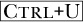

# 第四章：约定

GIMP 被用来裁剪大多数屏幕截图中的窗口装饰，以节省空间并突出显示相关信息。

符号 **Image: Colors > Curves** 表示你应该在当前操作的图像窗口中点击 Colors 菜单，然后点击名为 Curves 的条目。当然，这种符号可以包括更多的菜单层级。类似地，**Layers: right-click > Add an Alpha channel** 表示你应该在 Layers 对话框中右键点击并从出现的菜单中选择 Add an Alpha channel。

符号  表示你应该按下键盘上的相应键。  表示你应该按住控制键并同时按下 U 键。

小型大写字母（如 FEATHER）用于表示条目、按钮或复选框的名称。

单间距字体如 `Abstract 1` 用于表示用户必须输入到输入框中的特定文本。
