# 第一章. 入门

在本章中，你将学习开始使用 GIMP 所需的基础知识。如果可能的话，最好在电脑前阅读并动手操作，这样能获得最大的收获。

GIMP 没有任何复杂的系统要求，比如高端显卡或多核处理器。我们建议至少配备 2GB 的内存和一台 20 英寸的显示器，尽管你也可以用更少的配置。我们还建议使用鼠标而不是触控板，或者最好投资一块绘图板。

# 1.1 GIMP 基础

如果你需要帮助安装 GIMP，请参考附录 E。从现在开始，我们假设你已经正确安装了 GIMP。

提示：当你想退出 GIMP 时，请使用 **图像：文件 > 退出** 或 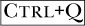。如果你尝试通过关闭窗口来退出，可能会丢失某个重要对话框。

## 屏幕布局

当 GIMP 首次启动时，屏幕上会弹出三个不同的窗口，如图 1-1 所示。这些窗口分别是工具箱、图像窗口和一个对话框停靠。默认情况下，它们会占据屏幕的全部宽度，不论你的显示器大小如何。这个屏幕布局可以根据你的喜好进行调整，许多 GIMP 用户的第一项操作就是重新排列屏幕布局，以便让它更直观且更符合他们的需求。如果你不喜欢多窗口界面，GIMP 现在提供了单窗口界面，我们将在单窗口界面中介绍。

如果你设计了一个非常适合自己的屏幕布局，可以将其保存，这样下次启动 GIMP 时它将保持不变。为此，请选择 **图像：编辑 > 偏好设置** 并选择“窗口管理”菜单项。你将看到图 1-2 中显示的对话框。点击“立即保存窗口位置”，然后点击 OK。

“窗口管理”标签还包含一个名为“窗口管理器提示”的部分，可以改变工具箱和对话框停靠的行为。在图 1-2 中，它被设置为“实用窗口”，这意味着工具箱和对话框停靠将始终保持在其他窗口之上，并在图像窗口处于活动状态时可见。换句话说，你不能最小化实用窗口。你还可以选择将工具箱和对话框视为普通窗口，或者简单地将它们保持在其他窗口之上。

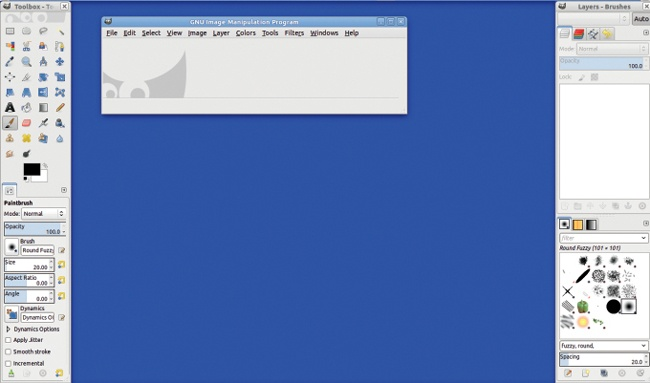

图 1-1. 初始的 GIMP 窗口，多个窗口模式

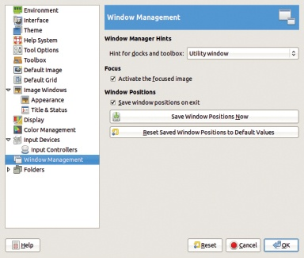

图 1-2. 偏好设置对话框，窗口管理标签

## 可停靠对话框

图 1-3 展示了新 GIMP 用户在使用多窗口模式时可能遇到的常见（虽然有些夸张的）困境。屏幕被多个窗口挤满了：此例中有十一块窗口。屏幕凌乱可能发生在你同时使用多个工具时，当某个工具关联了多个窗口，或当你同时编辑多个图像时。

当你将这些额外的窗口添加到标准对话框（如画笔、图案、渐变、图层和通道）中时，可能会轻松地打开十个或更多的窗口。

这就是 GIMP 使用 *可停靠对话框* 的原因——小型互动窗口，可以组合成一个多对话框窗口，如图 1-4 所示（它的两个部分并排排列）。你可以自定义这些窗口，包含任何组合的可停靠对话框，并且可以同时打开多个窗口。

提示：如果屏幕空间过于拥挤，你可以通过按下 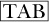 键，暂时隐藏除图像窗口以外的所有内容。再次按下  键，可以使隐藏的窗口重新出现在原位。这使得即使在较小的显示器上工作时，也能轻松优化屏幕空间。

图 1-4 中的窗口包含两个主要部分。左侧部分包含四个可停靠的对话框：图层、通道、路径和撤销历史。你可以通过点击标签来在它们之间切换。如果只有一两个标签，当前标签的名称会显示在对话框顶部；如果有三个或更多标签，则会显示图标。窗口的右侧最初显示画笔、图案和渐变，但我们已添加了涂鸦动态和字体标签。每个对话框标签都有一个主窗口、窗口底部的一排按钮，以及一个小的三角按钮（位于标签右侧）。这些按钮可以快速访问如保存和加载偏好设置等功能，而三角按钮则会弹出一个特定于该对话框的完整选项菜单，如图 1-5 所示。

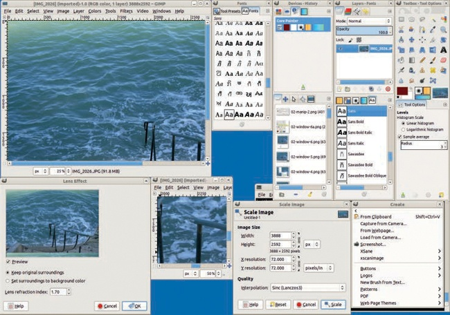

图 1-3. 一个凌乱的屏幕

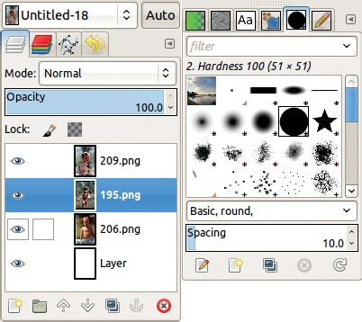

图 1-4. 多对话框窗口

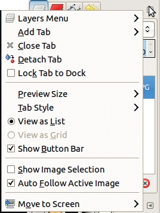

图 1-5. 图层对话框菜单

如果你关闭了可停靠对话框窗口，你可以通过**图像: 窗口 > 最近关闭的停靠窗口**重新打开它。你可以通过点击并拖动标签来将可停靠对话框从停靠位置拖出。然后，你可以将它放置在桌面上的任何位置，将其转化为独立窗口，或者将它放入另一个多对话框窗口，作为新的标签页或新的一部分，放置在窗口的底部、顶部或侧面。图 1-6 展示了将“通道”对话框移动到窗口底部的过程。

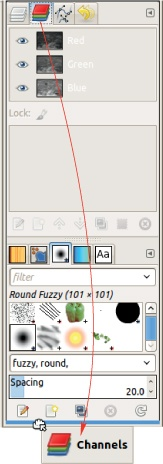

图 1-6. 在停靠之间移动对话框

## 工具箱

工具箱分为两个部分。工具箱窗口的上半部分是工具箱本身。默认情况下，它包含最常用工具的图标，尽管你可以自定义哪些工具被包含以及它们的顺序。如果你将鼠标悬停在任何图标上，GIMP 会显示*工具提示*，即工具的名称、简短描述和键盘快捷键。如果工具箱中有当前工具，它将被高亮显示。

工具箱窗口的下半部分实际上是一个可停靠的对话框，称为“工具选项”。它包含当前工具的选项对话框。虽然你可以更改此设置，但最好保持原样，这样你就可以轻松调整正在使用的工具的选项。

## 单窗口界面

GIMP 2.8 版本包含了一个许多使用 Windows 和 Mac OS 系统的 GIMP 用户迫切期待的功能：单窗口界面。如果你选择**图像: 窗口 > 单窗口模式**，所有当前的 GIMP 窗口将会合并为一个窗口。如果你从默认的多窗口布局开始，单窗口界面将像图 1-7 一样显示。工具箱位于左侧的一个窄列，多个对话框窗口位于右侧，中间的空间则用于显示图像。单窗口界面旨在占据整个屏幕，但你可以缩小它，以便同时查看桌面或其他正在运行的程序。

该界面的大多数组件都可以调整大小或移动，正如我们使用多窗口界面时所做的那样。图 1-8 展示了单窗口界面的一种使用示例。当打开两个图像或同一图像的两个视图时，你可以通过标签页在它们之间切换，但无法同时查看它们。图 1-9 展示了在多窗口界面中相同图像和对话框的展示，供比较。

与多窗口模式一样，按下  会隐藏除当前图像外的所有内容，但你仍然可以通过菜单或键盘快捷键访问工具。

请注意，在单窗口模式下，工具箱无法移动或关闭。由于所有的停靠窗口和对话框的限制，调整图像窗口的大小可能会变得更加困难。而且，当你打开一个新的对话框时，它要么会扩展到窗口的全高（并占用大量空间），要么有时不会作为主窗口的一部分开始，所以你需要将它移动到合适的位置。

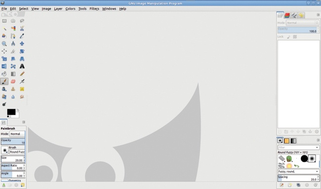

图 1-7. 初始的 GIMP 窗口，单窗口模式

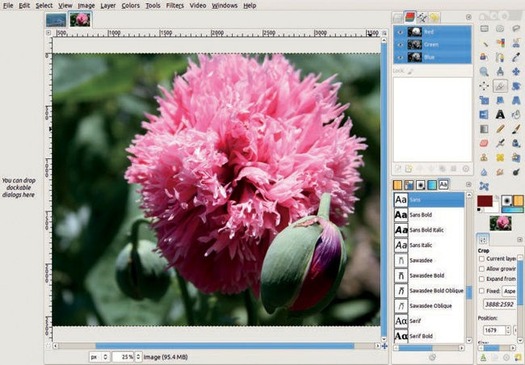

图 1-8. 打开两个图像的单窗口界面

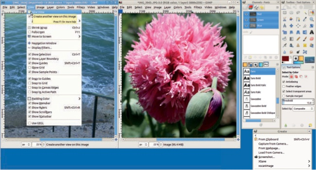

图 1-9. 打开两个图像的多窗口界面

虽然我们推荐使用多窗口模式，但在阅读本书时，你可以使用你喜欢的模式。你选择的模式很少会影响本书中的示例效果。

# 1.2 图像处理基础

在本节中，我们将展示如何打开、扫描和保存图像，并向你介绍 *图像窗口*。图像窗口包含当前在 GIMP 中打开的图像。如果当前没有打开图像，关闭图像窗口将退出 GIMP。当 GIMP 启动时，图像窗口为空。

## 打开图像

要打开已保存的图像，选择 **图像：文件 > 打开** 或按下 。将显示图 1-10 所示的窗口。

此窗口包含三个面板：位置、名称和预览。在位置面板中选择保存图像的文件夹，并在名称面板中选择图像。缩略图显示在预览面板中。左侧面板位置分为三个部分，如图 1-10 所示。顶部部分包含搜索框，可以按名称搜索图像，和“最近使用”部分，显示最近使用过的图像列表。中间部分列出了固定的文件夹或设备，例如桌面上可见的文件夹。底部部分是书签列表。初始时为空，但你可以通过在名称面板中选择文件夹并点击 +添加 按钮来添加文件夹。

点击左侧面板中的文件夹会在中间面板中打开其内容。你可以选择列出所有图像、某种类型的图像或所有可见的文件。如果选中的图像小于某个阈值（在首选项中定义），右侧面板会自动显示一个缩略图预览。如果没有显示，你可以通过点击右侧面板中的文件手动显示它。

当前路径显示在窗口顶部。你可以直接在位置字段中输入图像名称，该字段可以通过窗口左上角的按钮切换显示。图像类型通常由 GIMP 自动确定，但也可以手动选择。

提示：你可以将图像缩略图拖到 GIMP 工具箱中打开它。这适用于电脑中的文件，如图 1-11 所示，也适用于来自互联网的图像。只需将文件从浏览器拖动到 GIMP 工具箱中即可。

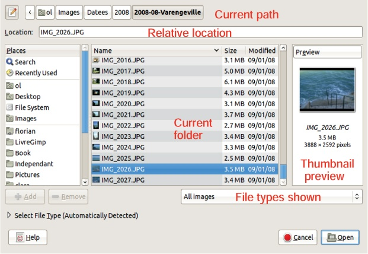

图 1-10. 从文件中打开图像

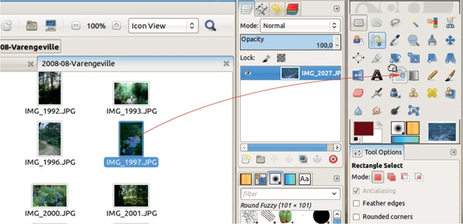

图 1-11. 拖动图像缩略图到工具箱

## 最大化图像

如果你在小屏幕上工作，或者处理的是一个大而详细的图像，你可能希望图像偶尔能填满整个屏幕。我们建议你通过**图像：视图 > 全屏**或按来使用全屏模式。这*并不是*通过窗口管理器最大化窗口。当你使用全屏模式时，所有窗口装饰都会被移除，你甚至可以隐藏菜单栏、标尺、滑块和状态栏。你甚至可以隐藏工具箱和浮动窗口（使用），让你完全利用整个屏幕。你仍然可以通过右键点击图像来访问菜单，所有的快捷键都可以使用。当你想返回到常规布局时，只需再次按（如果工具箱被隐藏，也按）。

该命令在单窗口模式下也能工作，但图像不会那么大，因为屏幕上的部分空间会被标签预览占用。

## 扫描

你可以使用扫描仪将旧照片和图画数字化。有许多品牌和型号可供选择，从非常便宜的到专业摄影师用的昂贵型号都有。最实惠的选择通常是多功能一体机，它通常包括打印机、简单的复印机和一台平板扫描仪。大多数平板扫描仪可以扫描标准的北美信纸或国际 A4 格式。更昂贵的扫描仪通常单独出售，没有内置打印机，并且通常拥有更大的扫描床。如果你想扫描装在相册中的照片，较大的扫描床就非常有用。

最佳扫描软件工具是 XSane (*[`www.sane-project.org/`](http://www.sane-project.org/)*)，这是一个 SANE 的图形化前端，SANE 是用于扫描的应用程序编程接口（API）。

XSane 在 GNU/Linux、Mac OS 以及许多其他操作系统上运行良好，但在 Windows 上不兼容，尽管这一情况可能会有所改变。以下讨论主要集中在 XSane，但许多信息也适用于任何扫描应用程序。

你可以通过 GIMP 使用 XSane，方法是从 **图像：文件 > 创建 > XSane** 菜单中选择设备对话框（DEVICE DIALOG）。你会看到一个显示“正在扫描设备”的对话框，等到你的扫描仪被识别后，两个较大的窗口将会出现。如果这没有成功，请确保你的扫描仪已经连接到电脑并开启电源。

图 1-12 显示了预览窗口，它会显示你正在扫描的内容的预览。这里有许多按钮和菜单，但我们将只介绍你开始使用时需要知道的基本内容。

图 1-12. 预览扫描的照片

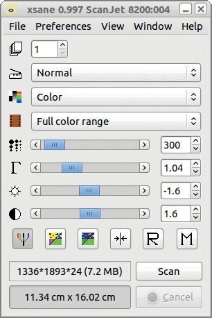

图 1-13. XSane 控制窗口

图 1-13 显示了控制窗口。这里显示的两个非常重要的信息是扫描区域的大小（以像素或你偏好的单位表示）和结果文件的大小（以兆字节为单位）。注意预览窗口中选择区域的变化以及控制窗口中扫描分辨率的变化如何影响文件大小。

### 预览图片

选择一张照片，并将其正面朝下放在扫描仪玻璃板上。不要将照片直接放在玻璃边缘，因为许多扫描仪无法扫描到玻璃的边缘。在预览窗口中，按下“获取预览”（ACQUIRE PREVIEW）按钮。

最终，你的照片预览会显示出来，如图 1-12 所示。有时扫描区域会自动调整以适应图像，但在图中并非如此。如果你将鼠标悬停在预览图像上，你会看到鼠标指针下方图像区域的原始放大表示，以及该区域中红色、绿色和蓝色（RGB）通道像素的值，以八进制和十进制表示，显示在对话框的底部。

如果你的预览图像是倒置的，可以使用从底部数起第二排的中间按钮进行翻转。你可以选择 12 种旋转方式，包括垂直翻转（如果角度后跟垂直条）和水平翻转（如果角度后跟减号）。

### 选择和扫描

要选择你想要扫描的区域，在预览区域内点击并拖动矩形轮廓框住你的图像。周围留点空间，以防止由于纸张厚度导致的视差误差。参见图 1-14。如果你的照片倾斜了也不用担心，将它完全对准扫描玻璃板可能很麻烦，而且当你关闭扫描仪时，它可能会再次错位。你可以稍后在 GIMP 中轻松旋转图像。

一旦你选择了扫描区域，就可以在控制窗口中调整参数。选择 1 为页数，选择 NORMAL 为源，选择 COLOR，然后选择 FULL COLOR RANGE。理想的分辨率取决于照片的大小和你打算如何使用它。如果你计划打印该图像，请选择一个至少能以 300 ppi（每英寸像素数）打印的分辨率。如果你打算修饰图像，或者认为可能需要打印出比实际尺寸更大的图像，选择更高的分辨率。以本示例为例，我们选择了 300 ppi 的分辨率，扫描区域为 4.3 × 6.3 英寸（11.3 × 16 厘米），扫描文件在压缩前约为 7MB。以更高分辨率扫描需要更长时间，文件也会更大，但如果你有足够的时间和硬盘空间，可以选择高分辨率。

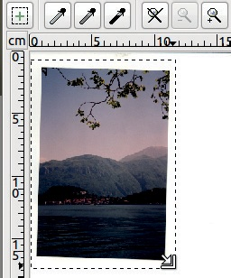

图 1-14. 选择扫描区域

选择高分辨率可以让你在不降低图像质量的情况下进行调整。如果之后你想通过电子邮件发送或发布到网页上，你可以创建一个缩小的副本。

接下来，点击 SCAN 按钮。扫描可能需要一段时间，如果你意识到自己做错了，可以取消扫描。首先，RGB 数据被接收，然后图像被转换为数字文件。如果你在预览窗口中选择了旋转，图像也会进行旋转。完成后，新的数字图像会出现在 GIMP 图像窗口中。

## 图像窗口菜单

图 1-15 显示了图像窗口及其主要组件的标签。你可以通过**图像：视图 > 显示菜单栏**来切换菜单栏的可见性。如果你使用的是 Mac OS X 或 Ubuntu Unity 界面，菜单将出现在屏幕顶部，所以“显示菜单栏”将不会起作用。你还可以通过**图像：视图**菜单打开或关闭标尺、滑块和状态栏的可见性。

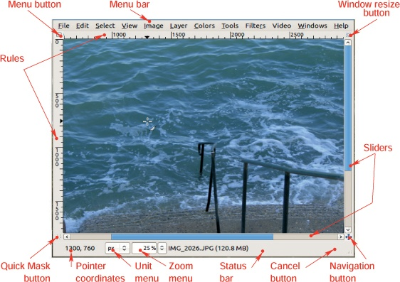

图 1-15. 图像窗口

图像窗口可以用来访问一些非常广泛的菜单，包括文件菜单和编辑菜单。你可以通过三种方式来访问这些菜单：

+   如果菜单栏显示的话

+   左上角的菜单按钮

+   在窗口中右键单击

因此，即使图像窗口仅显示一小部分，你也始终有办法访问菜单。

当通过菜单按钮或右键单击打开菜单时，菜单的顶部会有一条虚线，如图 1-16 所示。如果你点击这条虚线，菜单会作为一个单独的窗口打开。

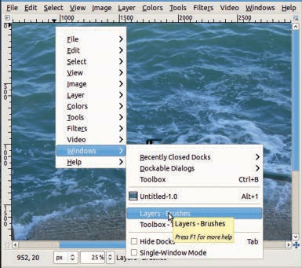

图 1-16. 从菜单按钮弹出的两个级联菜单

图像窗口中剩余的大部分元素都能自我解释。快速遮罩是一个选择编辑工具。导航按钮是一种快速更改图像在窗口中可见部分的方式，如图 1-17 所示。

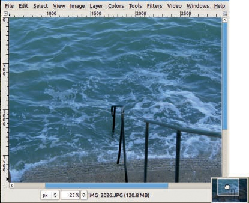

图 1-17. 使用导航按钮

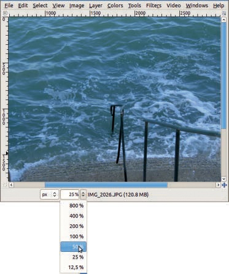

图 1-18. 使用缩放菜单

## 缩放

对图像进行缩放时，会放大屏幕上的图像，但不会实际改变图像文件。放大的程度由*缩放因子*来表示。当你打开一张图像时，GIMP 会根据图像的大小和屏幕的大小进行一些自动调整。对于中等大小的图像，缩放因子为 100%（实际大小），对于非常大的文件，缩放因子则较小。

在 GIMP 中有几种缩放方法。一种简单的方法是使用图像窗口右上角的窗口调整按钮。默认情况下它没有选中，但如果选中它，图像将自动缩放以适应窗口大小。

或者，你可以使用图 1-18 中显示的缩放菜单。你可以从下拉菜单中选择一个预定义的缩放因子，或者直接输入一个数值，或者当光标位于字段内时，使用鼠标滚轮。

如果按住键，你可以通过滚动鼠标滚轮来缩放。向上滚动缩小，向下滚动放大。

你还可以使用 GIMP 的缩放工具，可以通过点击工具箱中的放大镜图标来选择，或者按下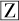。

提示：当图像窗口处于活动状态时，你可以按下键将图像恢复到 100%的缩放比例。

调整图像的缩放因子后，你可以使用

**图像：查看 > 缩小包装**（或按下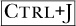），这会调整窗口大小以适应图像。在单窗口模式下，这可能会截断对话框，因为整个窗口会缩小。

## 保存图像

在 GIMP 中对图像进行处理后，你可能希望保存文件，以便稍后再次访问。GIMP 的原生格式是 XCF，当选择该格式时，图像的所有组件（图层、透明度等）都会被保留。要将新图像保存为 XCF 格式，或重新命名先前保存的 XCF 文件，选择**图像：文件 > 另存为**或。将会弹出图 1-19 中的对话框。

此窗口类似于图 1-10 中显示的打开图像对话框，但有以下区别：

+   你可以通过点击创建文件夹按钮来创建一个新文件夹。

+   选择文件类型（按扩展名）允许你选择保存图像的文件类型，但选项仅限于 XCF 和压缩 XCF 格式。

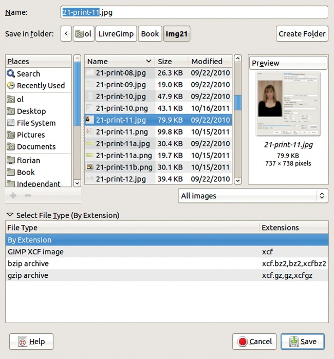

图 1-19. 保存图像对话框

你可以通过**图像：文件 > 导出**或将图像导出为多种其他格式进行保存。打开的对话框与图 1-19 中的对话框相同，但提供了更多可用格式。

在为图像命名、选择扩展名并点击导出后，可能会弹出一个对话框，具体取决于你选择的文件类型。例如，当第一次导出为 JPEG 格式时，你将被要求设置质量等级，并有机会调整其他参数。

如果你想保存一个 XCF 格式的图像而不更改其名称或文件类型，选择**图像：文件 > 保存**或按下。如果图像是 XCF 格式，这不会弹出任何对话框。如果图像是其他格式，保存对话框将会打开。如果你想导出图像并替换之前的版本，选择**图像：文件 > 覆盖**。

**图像：文件 > 另存为副本**命令类似于**图像：文件 > 另存为**，但它创建一个副本，而不会更改当前图像的名称或内容。

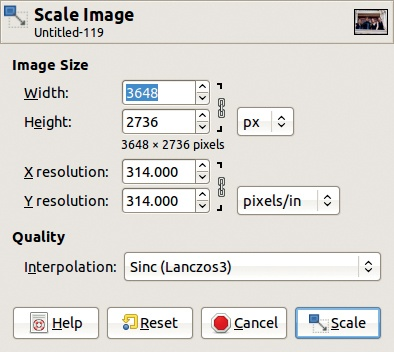

图 1-20. 缩放图像对话框

# 1.3 使用图像

在本节中，我们将帮助你开始使用图像。我们将向你展示一些流行的、易于使用的工具，帮助你裁剪、调整大小和锐化图像，然后我们将介绍几个 GIMP 的滤镜。我们还将展示图层的强大功能，并演示一些基本的绘图工具。

当你在 GIMP 中打开文件时，它所占用的空间比它在硬盘上的占用空间要大。这是因为 GIMP 允许你撤销和重做操作。为了让你回到之前的状态，GIMP 必须存储那个状态，再存储更早的状态，以此类推。要撤销操作，选择**图像：编辑 > 撤销**或按下 。如果你改变主意想要重做，选择**图像：编辑 > 重做**或按下 。

## 调整图像大小

如果你想将图像放到网页上、发送电子邮件或打印，你可能想改变它的大小。你可以在 GIMP 中使用**图像：图像 > 缩放图像**来调整图像大小。该工具的对话框如图 1-20 所示。最重要的参数是宽度和高度字段。你可以更改这些字段的单位（默认情况下为像素），或输入新的分辨率。右侧的小链条决定是否保持图像的长宽比。默认情况下是连接的，这通常是最好的，但如果你点击它，它会断开连接。

假设你将图像的宽度更改为 1024 像素。当你按下 时，图像的高度会自动调整为 683 像素，尽管图像的实际大小并不会改变，直到你点击**缩放**按钮。你可能还想将**插值**设置为 SINC（LANCZOS3），这是一种计算量较大的算法，通常能提供最佳的效果。

如果你选择使用像英寸或厘米这样的单位，你需要注意 X 和 Y 分辨率字段。分辨率是按每英寸的像素数来衡量的，因此一张宽度为 300 像素的图像，在 300ppi 的分辨率下就是一英寸宽。默认值 72ppi 适用于 CRT 屏幕。对于 LCD 屏幕，分辨率应为 98 或 100ppi。对于打印，分辨率应至少为 300ppi。如果打印时使用较低的分辨率，图像会显得像素化。

缩小图像后，你应该对其进行锐化，因为缩小图像可能会降低图像的锐度。**图像：滤镜 > 增强 > 锐化掩模**是最简单的方法。会弹出一个对话框——只需点击确定。

## 裁剪图像

裁剪图像会永久性地去除部分图像，就像用剪刀剪掉一张照片一样。你可能会裁剪照片以去除不感兴趣的部分，突出主要主体，或者改变构图。一个主体完全居中的图像通常不如一个主体略偏向一侧的图像那么生动。

以图 1-21 所示的照片为例。它比大多数照片更宽，并且很难判断我们应该看的是哪里——这是左边打瞌睡的男人的照片，还是右边门口对比鲜明的光线的照片？你可以通过两种不同的方式裁剪这张照片，以突出这些潜在的主题。

图 1-22 显示了在工具箱中选中的裁剪工具图标。

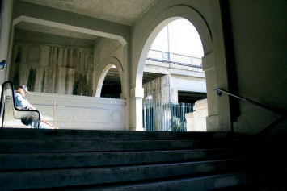

图 1-21：待裁剪的照片

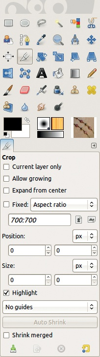

图 1-22：裁剪工具及其选项

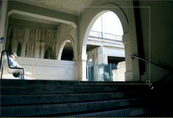

图 1-23：使用裁剪工具

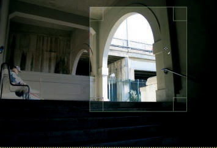

图 1-24：更改要裁剪区域的位置

裁剪工具有很多选项，如图 1-22 所示，但现在你可以保持默认设置。如果选中裁剪工具，指针会变成十字准星形状，旁边有一把刀片图标。通过点击并拖动来选择要裁剪的区域，如图 1-23 所示。

当你停止拖动时，选择区域外的部分会变暗，选定区域的轮廓就像图 1-24 中所示。指针会变成带有四个箭头的十字形，这是 GIMP 中“移动工具”的图标。你可以通过拖动裁剪矩形框来移动它在图像中的位置。

当你将指针悬停在选择区域的一侧时，指针的形状会发生变化，如图 1-25 所示，你可以拖动这一侧来改变矩形的大小。你也可以拖动选择区域的角落来改变裁剪区域的大小，同时保持纵横比。一旦选择了裁剪区域，点击区域内部或按下  以继续。点击选择区域外部则取消选择。

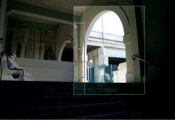

图 1-25. 更改裁剪区域的尺寸

图 1-26. 我们的杰作照片

## 使用滤镜添加框架

你如何处理刚刚创作的杰作？当然是将其放入框架中。你可以在 GIMP 中使用*滤镜*对图像进行数字化框架处理，*滤镜*是一个多样化的工具集合，集中在**图像：滤镜**菜单下。

我们决定给图 1-26 中展示的照片加框。要开始加框，选择**图像：滤镜 > 装饰 > 添加边框**，这将弹出图 1-27 所示的对话框。

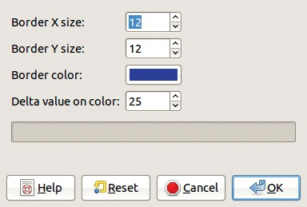

图 1-27. 添加边框对话框

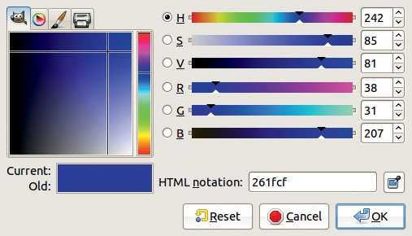

图 1-28. 颜色选择对话框

你可以选择边框的宽度、颜色以及赋予框架深度的阴影特性。我们的照片是 800 × 1200 像素，因此默认的 12 像素宽度太小。我们将其改为 40 像素，两个维度都设置为 40。25 的变化值也有点小，所以我们将其改为 50。我们不喜欢蓝色，所以点击了颜色按钮，弹出了图 1-28 所示的对话框。

左上角的四个标签允许你选择不同的颜色选择方式。现在我们将使用最左边的标签，图标是 Wilber 的头像。Wilber 是 GIMP 的吉祥物。

中央的垂直条显示当前选中了蓝色。你可以点击该条选择不同的颜色。左侧的大方框显示了蓝色的色调。你可以点击选择更浅或更深的色调。

我们希望框架是棕色的，但垂直颜色条中没有棕色。我们通过选择一种深色的红色调来制作棕色。将色调光标向下移动到垂直条中的红色区域，你会得到一种红木色。将光标进一步向上移动，得到的颜色更接近橡木或栗色。我们选择的颜色如图 1-29 所示。选择颜色并点击确定后，GIMP 会处理一段时间，之后对话框会消失。看起来似乎什么也没有改变！

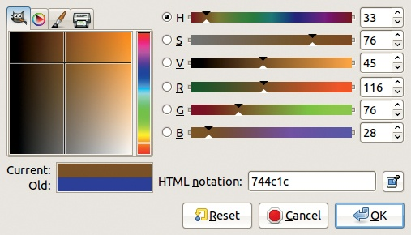

图 1-29. 选择框架颜色

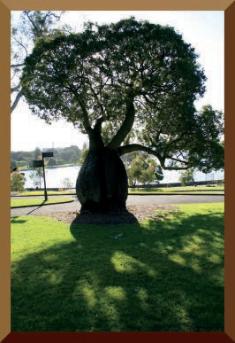

图 1-30. 已添加框架

如果你的图像窗口比图像本身大，你可能已经看到结果了，但如果看起来什么都没发生，框架只是被隐藏了。要显示它，按下将图像窗口调整为适应图像大小。现在你可以看到结果，显示在图 1-30 中。它看起来不太真实，所以我们将通过斜角滤镜来改善它。

选择**图像：滤镜 > 装饰 > 添加斜角**，将出现如图 1-31 所示的对话框。将厚度（THICKNESS）增加到 30，并取消勾选“对副本进行操作”复选框。点击“确定”，GIMP 将添加斜角。如果效果太微妙，可以通过按下再次运行相同参数的滤镜。我们的结果如图 1-32 所示。

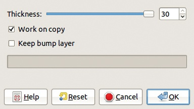

图 1-31. 添加斜角对话框

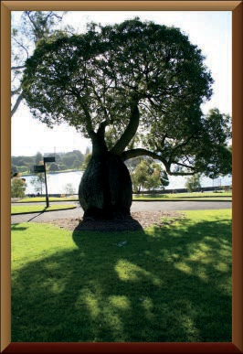

图 1-32. 斜角框架

## 使用图层

你可能希望将多个草图保存在一个文件中，给画作添加背景，或者将几个文件合成一张图像。你可以使用 GIMP 最强大的功能之一：*图层*，来实现这些操作。

层对话框默认位于多文档窗口的上部。图 1-33 显示当前图像由两层组成。下层，名为背景（Background），是原始照片。上层，名为边框层（Border Layer），是通过添加边框滤镜添加的，并通过添加斜角滤镜进行了修改。此层当前处于活动状态，因此它被高亮显示。层名称左侧的眼睛图标表示该层可见。点击眼睛图标可以切换层的可见性。

图 1-33. 层对话框

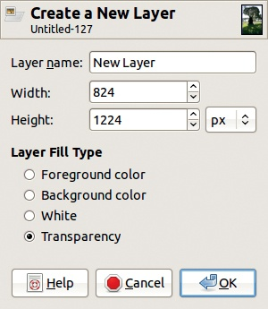

图 1-34. 创建新图层

你可以通过点击左下角的按钮来创建新图层。将显示如图 1-34 所示的对话框。你可以选择新图层的名称、大小和填充类型。默认的填充类型是透明。点击“确定”后，新图层将被创建并成为当前图层。

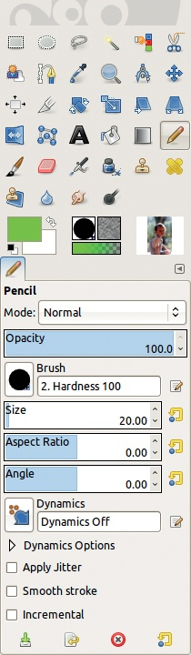

图 1-35. 选择铅笔工具

## 在 GIMP 中绘图

GIMP 是一个非常适合制作数字艺术的程序，无论是快速草图还是详细的画作。在本节中，我们将介绍一些你需要了解的基础知识，帮助你开始在 GIMP 中创作数字艺术。

GIMP 提供了多种工具供您绘制或素描。每个工具都模拟了一个真实的绘图工具，如画笔、铅笔或钢笔。为了展示其中的一些工具，我们将在一些图像上签上 Wilber 的名字。在图 1-35 中，我们使用铅笔工具模拟了记号笔。我们通过调整*画笔*选项来实现这一点，画笔选项代表了铅笔尖的大小和形状。我们选择了`Hardness 100`画笔，并将其大小调整为 20。您可以在铅笔工具选项中或在位于多功能窗口底部的画笔对话框中调整画笔设置（参见图 1-36）。

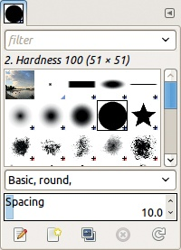

图 1-36. 画笔对话框

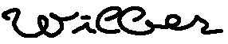

图 1-37. 使用铅笔工具绘制的签名

您还可以选择墨水颜色。这一选项不会出现在铅笔工具设置中——铅笔工具将使用当前的前景色，这个颜色显示在工具箱左下角的上方框中。下方框显示背景色。两个框之间的双向箭头可以切换前景色和背景色，而左侧的黑白小框则分别将前景色和背景色重置为黑色和白色。我们保持了默认的黑色设置。

当我们使用鼠标和铅笔工具签上 Wilber 的名字时，结果显得有些笨拙，如图 1-37 所示。这是因为铅笔工具不使用*抗锯齿*（即通过半透明像素平滑边缘），而且用鼠标绘制非常困难。

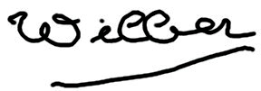

图 1-38. 使用画笔工具绘制的签名

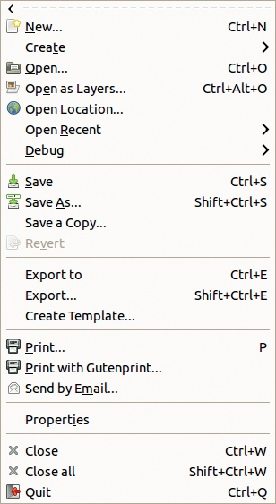

图 1-39. 文件菜单

通过单击图层对话框中铅笔图层旁边的眼睛图标来隐藏铅笔图层，然后创建另一个透明图层。在弹出的对话框中，将图层名称替换为`Paintbrush`。通过单击其图标选择画笔工具，图标位于铅笔工具图标旁边，然后再次选择一个圆形、大小为 20 的画笔。图 1-38 中显示的签名由于抗锯齿的处理看起来稍微好一些，但使用鼠标签名依然很不自然。在使用 GIMP 的平板电脑中，我们会向您展示如何使用手写笔签名。

## 使用 GIMP 打印

一旦你完成了照片和图形的编辑，可以直接从 GIMP 打印它们。图 1-39 展示了文件菜单，你将在其中找到可用的打印选项。根据你电脑上安装的 GIMP 扩展，菜单中可能仅包含部分条目。具体而言，PRINT WITH GUTENPRINT 条目需要 Gutenprint 包。这个免费的打印机驱动程序集仅适用于 GNU/Linux 和 Mac OS X 系统。

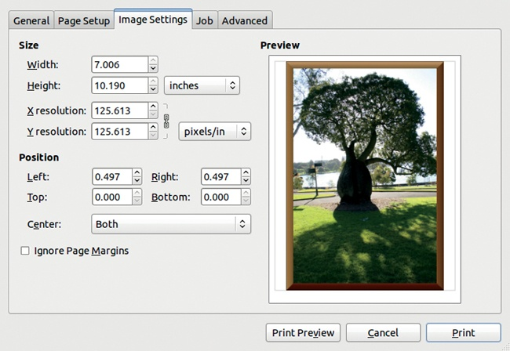

图 1-40. 打印对话框，第三个标签

如果你使用的是 GNU/Linux 或 Mac OS X 系统，从**图像：文件**菜单中选择打印。弹出的对话框包含五到七个标签页，具体取决于你在第一个标签中选择的打印机。在第二个标签中，你可以选择打印机定义的纸张类型和纸张来源，以及纸张的尺寸和方向。第三个标签（如图 1-40 所示）显示打印预览。在这里，你可以更改打印图像的分辨率或尺寸，以及它在页面上的位置。如果打印机有更多的高级设置，它们将列出在接下来的标签页中。最后的标签页允许你更改一些参数，只有在你有多个打印机并且多个用户尝试同时使用时才会有用。

在 Windows 系统中，打印对话框非常不同。它仅包含两个标签页，但在第一个标签页中，选择打印机后，你可以点击 PREFERENCES 按钮打开一个新对话框。此对话框有多个标签页，允许你设置与上述打印对话框相同的参数，但以不同的方式和顺序呈现。

对于所有系统，一旦参数设置完成，点击打印以接受你的选择并打印图像。

# 1.4 使用绘图板

在在 GIMP 中绘图中，我们看到使用鼠标绘图是多么笨拙——我们的签名既丑陋又不自然。鼠标非常适合点击，但大指针使得选择单个像素变得困难，并且几乎不可能绘制直线或优美的曲线。在接下来的章节中，我们将经常需要绘制精确的线条或平滑的轮廓。

如果你计划在 GIMP 中进行大量工作，我们强烈建议你投资购买一款绘图板。根据制造商、绘图板的尺寸和功能，价格范围可能从$20 到超过$2000 不等。你可以以大约$350 的价格找到一款具有所有真正有用功能的优秀绘图板，尽管如果你在压力感应和倾斜感应上做出妥协，也可以以更低的价格购买。

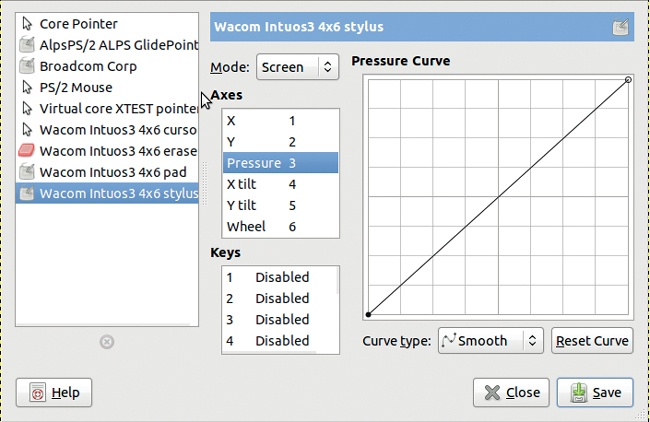

图 1-41. 配置输入设备对话框

## 安装绘图板

图形平板通常通过 USB 端口连接。根据你的操作系统，你可能需要从随附的 CD 安装软件，或配置一些系统文件才能让平板正常工作。在 GNU/Linux 系统中，支持由 Linux Wacom 项目提供 (*[`linuxwacom.sourceforge.net/`](http://linuxwacom.sourceforge.net/)*)，通常一旦连接平板就能直接工作。

即使平板制造商的官方网站通常忽略提到它们的平板与 GIMP（或任何自由软件）兼容，大多数平板都是兼容的。一旦平板安装并正常工作，你只需要告诉 GIMP 它的存在。为此，打开**图像：编辑 > 偏好设置**对话框，进入“输入设备”部分。点击“配置扩展输入设备”，会弹出如图 1-41 所示的对话框。你也可以从**图像：编辑 > 输入设备**打开相同的对话框。现在，你只需要关注左侧的设备菜单和“模式”按钮。

如果你的平板正确安装，你应该会在设备菜单中看到四个新设备：光标、平板、橡皮擦和手写笔（或在安装平板时选择的其他名称）。光标对应于平板的鼠标，手写笔和橡皮擦分别对应平板笔的两个端。暂时可以忽略平板。对于这三个新设备，将模式设置为屏幕（SCREEN）。现在，点击对话框中的“关闭”按钮，然后在偏好设置对话框中点击“确定”，你的平板就可以使用了！

## 平板鼠标和手写笔

根据你的需求，你可以决定将平板放在键盘旁边像鼠标一样使用，或者把键盘移到一边，将平板直接放在显示器前面。艺术家或其他专业人士通常会选择后者，而较为休闲的用户可能只在需要时才使用平板，平时将其放在一旁。你可以通过实验来看看哪种安排对你来说更舒服。

平板鼠标像普通鼠标一样工作，但有一个区别。使用常规鼠标时，通常有一个叫做*加速*的功能。当你稍微移动鼠标时，屏幕上的指针会按比例移动。如果你更快地移动鼠标，指针会更快地移动，并且在屏幕上移动得更远。这个特性允许你只通过轻微的手势，就能在宽达 2000 像素的屏幕上移动指针，同时还能保持精确的缓慢移动。

平板鼠标不使用加速。平板上的一个位置对应于屏幕上的相应位置，这一点始终保持不变。换句话说，平板的左上角总是对应于屏幕的左上角。这意味着，你需要比使用普通鼠标时更大幅度地移动手部，才能在屏幕上移动指针，特别是如果你有一个较大的平板。

手写板的触控笔表现得也是一样的。当笔尖接近手写板表面时，光标会移动到屏幕上的相应位置。将笔触碰到手写板等同于鼠标左键单击。你可以使用笔进行点击、双击和拖动。你还可以通过按下笔上的按钮来进行右键单击。

这支笔通常有两个活动端：一个用于绘画，一个用于擦除。绘画端通常像一支细的毡尖笔。有时笔会附带多个笔尖，这些笔尖类似于不同的绘图工具。另一个端通常呈铅笔橡皮的形状。你可以将不同的工具与这些端口关联，并在 GIMP 中保存你的设置。我们将画笔工具与正常的笔尖关联，将橡皮擦工具与另一端关联。有些手写板甚至允许你使用几支不同的笔，例如设置为红色画笔、黄色钢笔和黑色铅笔。

当你使用笔绘图时，施加的压力会传输到绘图应用程序中。在 GIMP 中，大多数绘图工具使用一个叫做*绘画动态*的功能，它处理来自手写板笔的输入。这部分内容将在绘画动态中详细讲解。如果你选择基础动态，笔压与画笔的不透明度相关联，笔的速度与画笔的大小相关联。

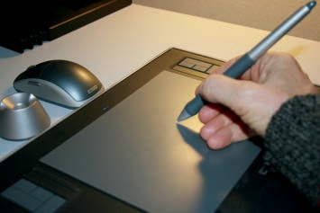

图 1-42. 使用手写板笔

一些手写板还可以感知笔的倾斜角度，甚至是旋转。在 GIMP 中，这些属性也由**绘画动态**来处理。

## 在 GIMP 中使用手写板

图 1-42 显示了正确的手持手写板笔的方法。学习如何舒适地使用它可能需要一点时间，尤其是当手写板放在键盘旁边而不是直接在屏幕前面时。

图 1-43 显示了三种使用手写板笔制作的签名，使用了三种不同的 GIMP 工具。第一个是使用铅笔工具制作的，透明度由笔压控制。笔刷的大小由笔的速度控制，你可以通过查看下划线来看到这一点——笔在向左移动时速度更快。第二个签名是使用画笔工具制作的，使用了相同的动态设置。第三个签名是使用墨水工具制作的，这个工具对于模拟书法非常有用。

图 1-44 显示了更改画笔工具的压力参数的效果。所有线条的绘制方式相同，笔压力从左到右逐渐增大。画笔也相同。对于第一条线，只有不透明度由笔压控制。对于第二条线，只有硬度控制，即当压力增加时，画笔的模糊程度减少。对于第三条线，只有大小发生了变化。对于第四条线，所有三个参数（不透明度、硬度和大小）都由笔压控制。

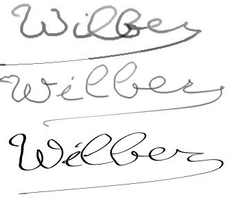

图 1-43。用平板手写笔签名

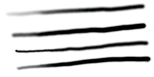

图 1-44。更改画笔工具的绘画动态

使用图形平板在 GIMP 中执行各种任务时非常有用。在第二章中，我们将使用平板在照片中进行精确选择。在第三章中，你将看到更多使用平板与绘画工具的示例。在其余的章节中，我们会指出使用平板时的优势。

人们安装新平板时常常会问一个问题：安装了图形平板后，能把旧鼠标扔掉吗？

好吧，取决于你。有些人把鼠标垫放在平板上，平时使用普通鼠标。当他们用 GIMP 进行绘图或做精确选择时，会移开鼠标垫和鼠标，改用平板手写笔。

有些人会扔掉旧的鼠标，只使用平板。他们可能会在日常任务中交替使用平板鼠标和手写笔进行绘图和选择，或者他们可能会用手写笔完成大多数人用鼠标做的任务。

# 1.5 练习

**练习 1.1。** 在**图像：窗口**菜单中，打开可停靠对话框菜单，建立一个包含你认为有用对话框的新停靠窗格。

**练习 1.2。** 调整屏幕布局，以更好地符合你的喜好。你可以添加或删除可停靠的对话框，重新排列窗口，甚至切换到单窗口模式。完成后，保存布局，以便下次启动程序时，GIMP 会记住这个布局。

**练习 1.3。** 如果你有数码相机，将一些照片加载到你的电脑上。你可以通过 USB 线将相机连接到电脑，或者取下内存卡并将其插入电脑上的读卡器。内存卡会被识别为一个新的 USB 设备，因此你可以通过文件管理器找到它和你的照片。

**练习 1.4。** 裁剪并调整你的一张照片的大小。别忘了在之后使用锐化蒙版滤镜。当你对图片满意时，打印出来。

**练习 1.5.** 奖励积分：如果你没有绘图板，赶紧去买一个！买到后，将其连接到你的电脑，并确保它已正确安装。一旦 GIMP 识别到它，使用不同的绘图工具练习签名。

**练习 1.6.** 用于身份证明卡（如驾驶执照和护照）上的照片通常都不怎么好看。找到一张自己满意的照片，并用它制作一张包含几张身份证照片的页面，准备好打印并剪切。
