# 第二章. 照片修饰

对许多人来说，GIMP 是一个用于处理照片的程序。事实上，GIMP 远不止此，但照片处理确实是它最有价值的用途之一。这也是我们在 1.3 操作图像中首先演示的操作大多涉及照片的原因，也是我们将两章内容专门用于此主题——本章和 第五章的原因。这两章的主要区别在于，本章我们一次只处理一张照片，而在 第五章中我们将同时处理多张照片，创建合成图像。

# 2.1 教程：增强拍得不好的照片

大多数照片可以通过数字处理来改善，但找到一张包含所有可能缺陷的照片是困难的。因此，我们将需要在几张不同的示例照片上演示你可以使用 GIMP 进行的许多有用的修图技巧。

## 裁剪、调整角度和恢复透视

图 2-1 中展示的照片需要裁剪和调整角度。接下来，我们需要恢复透视效果。此图像还需要进行一些光照修正，以增强教堂内部的可见性。不过，首先，我们将先把照片调整正。为此，我们需要确定旋转角度，然后使用旋转工具来将图像水平对齐。

旋转角度可以使用测量工具来测量（）。在它的选项对话框中，勾选“使用信息窗口”框。测量角度的一个好地方是沿着窗框。放大图像并将其定位在图像窗口中，使窗框的顶部占据图像窗口的宽度。要放大，请点击图像窗口底部的菜单并选择 100%。要重新定位图像，可以使用图像窗口右下角的交叉箭头。你也可以按住  键并移动鼠标，或使用鼠标的滚轮来重新定位图像。滚轮默认情况下会垂直移动图像，按住  时则水平移动图像。在使用滚轮时按住  键可以让你放大或缩小图像。

当你把图像调好后，使用测量工具，点击并按住窗框的左上角。按住鼠标键时，将光标拖到窗框的右上角。图 2-2 显示了标记测量距离的两个十字，以及测得的角度，即 2.89°。

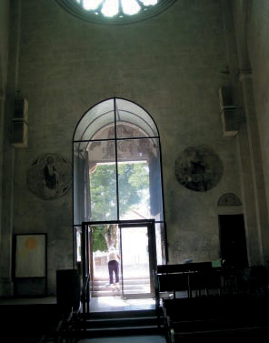

图 2-1. 初始照片

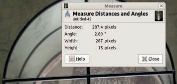

图 2-2. 测量旋转角度

现在我们将旋转图像，使画面水平。选择旋转工具（），然后点击图像。在出现的对话框中，将角度设置为 2.89（见图 2-3）。旋转中心显示为图像底部的一个圆圈（图像的中心）。在旋转工具的选项对话框中，预览选项已设置为 IMAGE+GRID。点击旋转：此时框架应该是水平的。

对于下一个变换，我们将使用透视工具（）。再次，在工具选项对话框中选择 IMAGE+GRID 预览选项，然后点击图像中的任何位置。你无法直接设置角度或尺寸。相反，你必须点击并拖动图像来扭曲透视。网格提供了一个有用的参考框架。图 2-4 展示了扭曲过程。当你对透视效果满意时，点击变换。

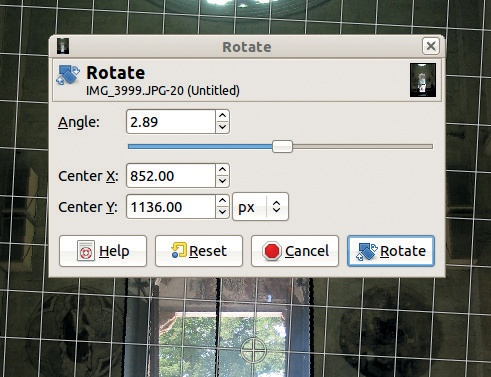

图 2-3. 旋转图像

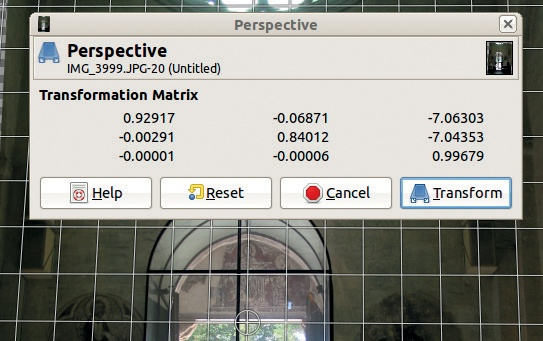

图 2-4. 应用透视工具

接下来我们将裁剪图像。因为门口是我们想要的主体，所以我们要裁掉图片的顶部。为此，使用裁剪工具（）。首先，选择你想保留的区域，如图 2-5 所示。你可以通过点击并拖动选择框的边缘或角落来修改区域。当你满意时，点击选择的区域或按下 。结果将在图 2-6 中显示。

## 曝光修正

一台优秀的数码相机应该始终设置正确的曝光。那么，对于一个对比度强烈的场景，什么是正确的曝光呢？例如，在图 2-7 中，摄影师选择将相机对准天空，因此房屋显得非常暗。调整这个问题在 GIMP 中相对简单。

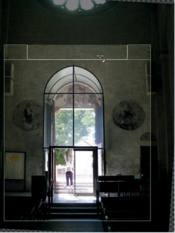

图 2-5. 裁剪图像

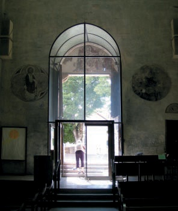

图 2-6. 裁剪后

首先选择天空。由于建筑物左侧有一小块不连贯的天空，最佳的选择工具是“按颜色选择”工具（）。点击天空中的任意地方，部分天空会被选中，你现在可以在*移动的蚂蚁线*（即跟随选择区域边界的移动虚线）中看到它。为了增加选择范围，按住，继续点击那些未选中的天空区域，尤其是图像的角落和照片中央附近的树木周围。图 2-8 展示了正确选择的天空。在这种情况下，你不需要进一步优化选择。在更复杂的情况下，你可以使用快速蒙版来优化选择（请参阅制作选择）。

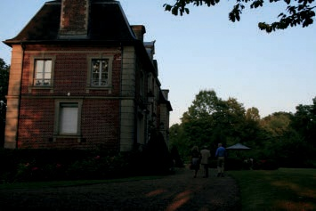

图 2-7. 初始图像

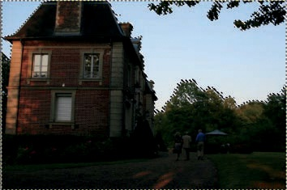

图 2-8. 选择天空

你已经选择了天空，但实际上你想选择的是除了天空之外的所有内容。因此，反选区域（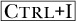）。隐藏移动的蚂蚁线（）以便更清楚地看到结果，然后打开**图像：颜色 > 级别**工具。至少现在保持颜色平衡不变，只调整亮度通道。

为了更好地查看输入等级直方图，点击对话框右上方的“对数”按钮，位于与“通道”同一行。将直方图下方最右侧的白色三角形移动到第一个峰值处，如图 2-9 所示。由于调整幅度过小，因此还需调整伽马光标。将中间的灰色三角形向左移动，直到你对结果满意为止。图 2-9 中所示的设置会产生图 2-10 中显示的结果。在第七章和第十二章中，我们介绍了一些技术，可以进一步改善这张照片。同样，图 2-6 中展示的编辑图像也可以通过额外的曝光校正获得更好的效果，但所需的技术超出了本教程的范围。

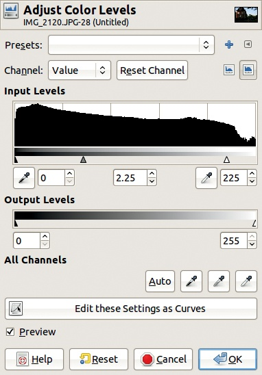

图 2-9. 调整亮度等级

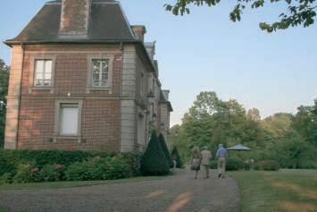

图 2-10. 最终结果

你还可以使用另一种更简单的方法来调整曝光不足的照片。这种技巧并非总是有效，但至少可能会带来有趣的结果。打开图 2-7 中的照片，在 GIMP 中立即复制唯一的图层。你可以通过多种方式来做到这一点：

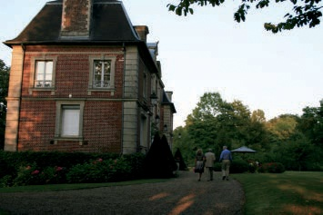

图 2-11。使用另一种方法

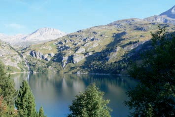

图 2-12。带有蓝色色调的照片

+   选择**图像：图层 > 复制图层**。

+   按下 。

+   选择**图层：右键 > 复制图层**。

+   点击图层对话框底部从左边数起的第四个按钮。

最后，在图层对话框的顶部，将模式改为“屏幕模式”，并调整该图层的不透明度。结果显示在图 2-11 中。如果你不满意其中任一方法的结果，你也可以将两种方法结合使用。

## 校正色彩平衡

与曝光类似，即使是非常好的数码相机也可能拍出带有色彩偏差的照片。包括用户操作错误在内的多个因素，都会导致照片出现色彩偏差。图 2-12 展示了一张带有蓝色色调的照片。如果你不喜欢这种效果，这里有一个工具可以帮助你纠正。

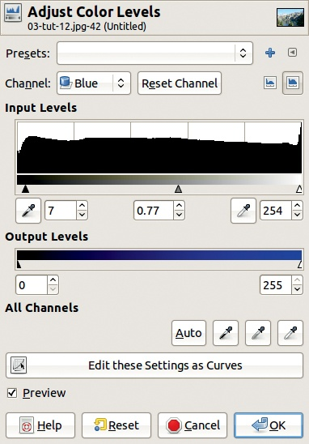

图 2-13。色阶对话框

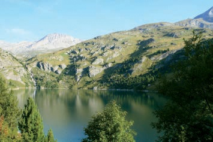

图 2-14。最终结果

要纠正色彩偏差，再次使用色阶工具。点击**图像：颜色 > 色阶**开始操作。图 2-13 展示了色阶对话框。选择蓝色通道。要调整输入级别，轻微向右移动黑色（最左侧）三角形，以扩展蓝色的色域，然后将灰色（中央）三角形向右移动，直到你对色彩偏差的减少感到满意。保持勾选“预览”框，这样你可以在不确认更改的情况下看到效果。如果你仍然不满意色彩平衡，可以尝试调整其他两个通道。图 2-14 展示了应用色彩校正后的照片。

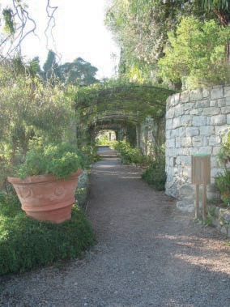

图 2-15。初始图像

## 移除物体

到目前为止，我们主要集中在如何在不实际改变内容的情况下提高图像的整体质量。在本节中，我们将展示如何去除眼睛不适的物体，在这个例子中，是污染了花架入口的垃圾桶，参见图 2-15。得益于克隆工具，去除不需要的障碍物非常简单。通过按下键盘上的字母 C 来选择该工具。在工具选项对话框中，使用对话框右下角的黄色箭头重置所有选项为默认值。选择 `Hardness 075` 画笔，并将其直径设置为 **76** 像素。放大垃圾桶，将其置于窗口的中央。现在，通过克隆周围的景物来“绘制”覆盖掉不需要的垃圾桶：

1.  按下  并点击你想要复制的图像部分（源点）。

1.  释放  并用你刚刚选择的景物“绘制”容器（目标）。

图 2-16 展示了这个过程。源点不是固定的，它是相对的。当你绘画时，源点会随着画笔的移动而移动，这样你就可以通过一次  点击覆盖一个大面积。然而，在这个例子中，还是需要时不时地改变源点，特别是在擦除垃圾桶支架时。

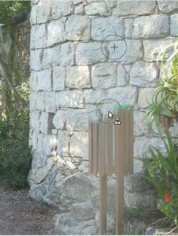

图 2-16。擦除垃圾桶

图 2-17。经过光照调整后的最终结果

借助 GIMP 方便的克隆工具，你可以在几秒钟内擦除掉那个难看的垃圾桶。图 2-17 展示了通过使用 曝光校正 中描述的技术改善光照后的最终图像。

## 提高锐度

你可能认为如果使用理想设置并选择高分辨率，你就能用数码相机拍出清晰的照片。然而，情况并非总是如此，原因有几个。一个原因是相机存储的文件分辨率实际上大于其传感器的分辨率。在这种情况下，你得到的图像是经过插值处理的结果。当你使用扫描仪从打印图像创建数字图像时，也会发生同样的事情。因此，任何数字化的图像都可以从我们本节展示的调整中受益。需要注意的是，你应该在图像处理的最后步骤中进行以下修正，确保在调整图像分辨率之后进行。

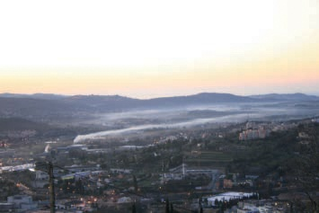

图 2-18. 初始照片

这个现象、运动模糊以及烟雾在景观上漂浮造成的雾霾，共同导致了我们示例图像的模糊，如图 2-18 所示。

选择滤镜**图像：滤镜 > 增强 > Unsharp Mask**。尽管名字如此，这个滤镜是提升图像清晰度的一个极好的工具。会弹出如图 2-19 所示的对话框。调整各个参数，可以在预览窗口看到调整效果。当你满意时，点击“确定”。我们已锐化的图像如图 2-20 所示。

## 去除红眼

红眼现象是众所周知的：当你使用闪光灯拍摄肖像时，闪光灯照亮了眼睛的后部，导致眼睛看起来呈红色，至少在人类身上是这样的。当被摄者直视摄影师且环境光线昏暗时，瞳孔会扩张，红眼现象最为明显。为了避免红眼，大多数相机都有一个非常短的预闪，能使被摄者的眼睛受到短暂的强光照射，从而导致瞳孔收缩。如果瞳孔变小，眼睛的后部就不再可见。然而，这种方法并不总是有效。而且，窄小的瞳孔可能会让被摄者看起来不那么吸引人。因此，用 GIMP 进行修正可能是一个更好的解决方案。图 2-21 是红眼现象的一个很好的例子。

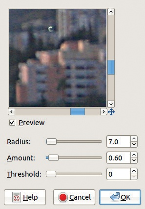

图 2-19. Unsharp Mask 滤镜对话框

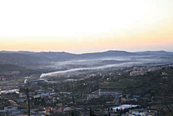

图 2-20. 最终结果

图 2-21. 初始照片

图 2-22. 选择眼睛

GIMP 提供了几种修复红眼的方法。我们在更多红眼修正方法中描述了其中的一些方法。这里，我们使用最简单的方法——专用滤镜：选择**图像：滤镜 > 增强 > 红眼去除**。如果在没有任何准备的情况下选择此滤镜，对话框会显示如下信息：“手动选择眼睛可能会改善效果。”如果忽略该消息并点击确定，滤镜会修改你未曾预期的区域的颜色，比如模特的嘴唇。

为了避免不必要的颜色修改，在应用滤镜之前，你需要先选择眼睛。使用自由选择工具完成此操作（）。对于第一个眼睛，绘制一个不精确的轮廓，包含整个虹膜。为了将第二只眼睛包括在同一选择中，在粗略勾画另一只眼睛时，按住。你可以在图 2-22 中看到完成的选择。

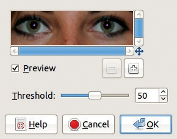

图 2-23. 红眼去除滤镜对话框

图 2-24. 最终结果

现在选择红眼去除滤镜，这将弹出图 2-23 所示的对话框。你不再看到警告，并且预览在当前设置下看起来不错。点击确定。最终图像如图 2-24 所示。

# 2.2 全局变换

本节讨论全局变换，它会影响整个照片。

## 调整图像大小

GIMP 提供了五种重要的工具，可以用于修正倾斜、框架不佳、拍摄角度尴尬等问题的照片。学习如何正确使用这些工具很重要。你已经在本章中使用了旋转工具、裁剪工具和透视工具。接下来，我们将演示缩放工具以及如何调整图像大小。

当你扫描一张图像或从数码相机传输文件时，图像可能过大，无法完全显示在显示器上。回想一下，一个 1024 × 768 的图像，在小屏幕上填满整个屏幕时，打印出来的宽度只有 3.4 英寸（8.7 厘米）。这是因为屏幕分辨率为 72 或 96 像素每英寸（ppi），而打印的标准为 300 ppi。因此，如果你想以 6 英寸（15 厘米）的宽度打印照片，图像文件的宽度必须至少为 1800 像素。需要注意的是，在喷墨打印机上，每个像素需要多个点，因此点每英寸（dpi）的分辨率与 ppi 是不等同的。

正如我们在本书中多次强调的那样，尽可能地，你应该以相机提供的最高分辨率拍摄照片。较大的文件会占用更多的内存，但在处理图像时，你将会用到所有的额外信息。如果你在完成编辑过程后*再*减小图像的文件大小，最终结果会好得多。我们建议始终以原始照片的完整尺寸导出，最好使用无损的 PNG 格式。当需要更小的文件（例如，用于网站）时，将图像的副本调整为 1024 × 768 或甚至 800 × 600，然后以 JPEG 格式导出。要以 300 ppi 打印照片，可以通过将所需宽度（以英寸为单位）乘以 300（或如果所需宽度以厘米为单位，则乘以 118）来计算新的宽度。例如，一张 10 × 15 cm 的照片应该是 1180 × 1770 像素。不过，不用太担心这些数学计算。控制打印机的软件应该能够将打印尺寸调整为你想要的任何尺寸。通常，打印时应通过打印软件调整图像的尺寸，这样可以避免图像文件被修改，从而防止调整尺寸时出现的质量损失。

话虽如此，假设你确实想使用 GIMP 来调整照片的大小，应该如何操作呢？GIMP 提供了几种方法：

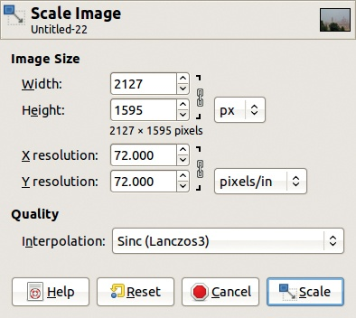

图 2-25. 缩放图像对话框

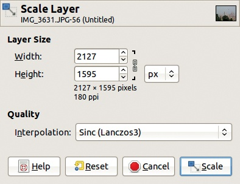

图 2-26. 缩放图层对话框

+   使用**图像：图像 > 缩放图像**来调整整个图像的大小。图 2-25 显示了弹出的对话框。调整图像的宽度或高度。连接宽度和高度的链条可以保持图像的比例，通常最好保持链条不变。你还可以更改 X 和 Y 分辨率，但这不会影响图像的大小，通常只有在打印图像时才需要考虑分辨率。即便如此，你也可以通过打印软件选择分辨率。

+   如果图像只有一个图层，先调整图层的大小，再调整画布的大小以适应。首先，选择**图像：图层 > 缩放图层**，这将弹出图 2-26 所示的对话框。调整图层大小后，使用**图像：图像 > 适应图层到画布**来调整画布的大小。

+   你还可以使用缩放工具（）来调整图层的大小。选择它后，在图像上点击任意位置。一个小对话框会出现，指针图标会发生变化。点击并拖动图像来调整图层的大小。在图 2-27 中，我们将缩放工具的选项对话框中的预览选项更改为 IMAGE+GRID。

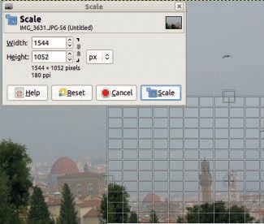

图 2-27. 使用缩放工具调整图层大小

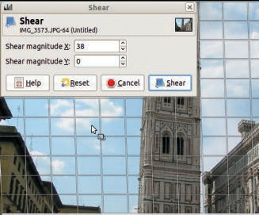

图 2-28. 使用剪切工具

请注意，您也可以直接在对话框中更改尺寸。点击“缩放”以完成缩放操作。同样，链接的链条保持宽度和高度的比例。

## 剪切图像

我们要提到的最后一个变换工具是剪切工具 ()。调用此工具会弹出图 2-28 中显示的对话框。尽管你可以为 X 和 Y 都输入数值，但一次只能修改一个坐标（X 或 Y）。你调整的第一个数值将被保留，而另一个会被忽略。例如，如果你将剪切幅度 Y 调整为 10，然后再调整剪切幅度 X 为 10，图像将在 Y 方向上被剪切。当你应用剪切工具时，图像将在选择的方向上倾斜并变形。这个工具很少有用，因此如果它仍然有些令人困惑，不用担心。

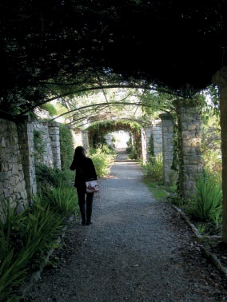

图 2-29. 初始照片

## 调整亮度、对比度和色阶

在摄影中，光线至关重要。对光线的调整可以显著改善图像效果。使用扫描仪将老照片或 35mm 胶片数字化时，光线问题尤为常见。但是，如果拍摄时使用了错误的设置或拍摄对象的光照不均，您也可能需要调整用好数码相机拍摄的照片的光线。有些最美丽的照片正是在困难的光照条件下拍摄的。

考虑图 2-29 中所示的照片。凉亭下方的区域过暗，头顶的藤蔓细节完全丧失。由于光照范围已满，女性衣服上的黑色和画面中心的纯白非常明显，因此只有图像的某些区域需要修正。

使用自由选择工具 () 只选择需要修正的区域。在选项菜单中，确保选中**羽化边缘**框并将半径设置为**10.0**。沿着图片中较亮的部分描绘。在这个示例中，有两个较亮的区域，一个在人物前面，另一个在右侧。按下  键启用“添加到选择”。你可以使用快速蒙版进行小幅调整（请参见制作选择）。完成的选择可以在图 2-30 中看到。

图 2-30. 选择亮部区域

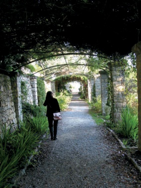

图 2-31. 首次亮度调整

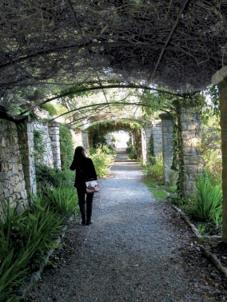

图 2-32. 第二次亮度调整

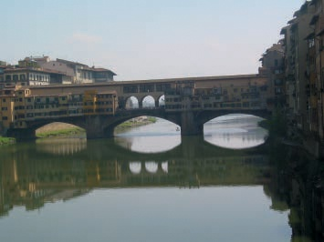

图 2-33. 初始照片

接下来，反选区域 ()，这样你就可以调整图片中较暗部分的亮度。使用**图像：颜色 > 色阶**工具来亮化这些暗区。选中色阶工具后，点击 AUTO 按钮即可获得图 2-31 所示的效果。

尽管自动调整有所帮助，但凉亭顶部仍然太暗。为了进一步亮化它，重复相同的过程。首先，使用自由选择工具选择暗部区域 ()。这次不要反选区域。选择色阶工具，再次点击 AUTO 按钮。你可以在图 2-32 中看到第二次调整的效果。

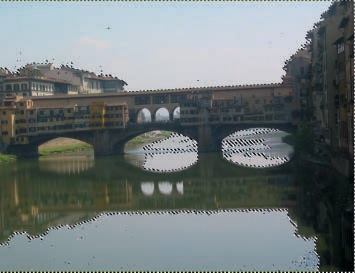

图 2-34. 选择亮部区域

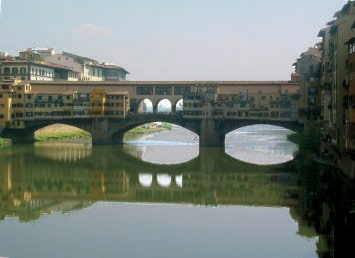

图 2-35. 最终结果

GIMP 还有许多其他方法可以改善照片的亮度。图 2-33 展示了一张昏暗、模糊的图片。由于这张图片非常暗，单独对整个图像使用色阶工具效果不好：天空和水面会显得太苍白。为了有效亮化这些区域，我们需要先选择它们。

这次，使用模糊选择工具来进行选择。按住键可以选择多个区域。根据图 2-34 中的示例，勾画出照片中的所有亮部区域。接着，反选区域 ()，隐藏它 ()，并选择色阶工具。再次点击 AUTO 按钮，这次同时将伽玛（灰色）三角形稍微向左移动（选择了亮度通道），然后在选择了蓝色通道时向右移动。这些额外的调整将减少色偏。

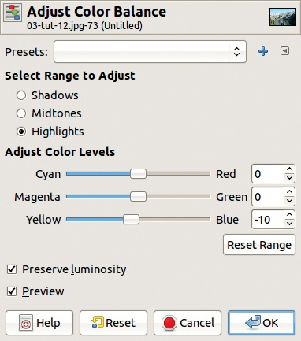

图 2-36. 色彩平衡对话框

调整完色阶后，我们通过旋转图片使其直立，然后裁剪图像以清理边缘。最终结果见图 2-35。

## 调整颜色

在整张照片中调整颜色有时是合适的，例如，当室内使用闪光灯导致普遍的红色偏色时。图 2-12 是一个简单的色彩校正示例，我们使用色阶工具来纠正蓝色偏色。GIMP 还有其他工具，可以用于简单或更复杂的色彩校正。

其中一个工具是**图像: 颜色 > 色彩平衡**(图 2-36)。要纠正蓝色偏色，将黄色和蓝色之间的滑块向左推。由于勾选了预览（PREVIEW），你可以立即看到结果。你也可以使用滑块、鼠标滚轮或右侧数字旁的小箭头来调整色彩平衡。请注意，这个更改并不是针对整个图像，而只是针对所选的子范围：阴影、中间调或高光。这个工具功能强大，但使用起来不太容易。

另一个色彩校正工具是**图像: 颜色 > 色相-饱和度**。在此工具的对话框中(图 2-37)，你可以选择六个不同的色彩子范围，对应三种主要颜色和三种互补颜色。你还可以通过点击 MASTER 选择整个子范围。移动色相（HUE）游标会使所选子范围内的所有颜色发生变化。对于图 2-12，我们希望选择蓝色子范围，并将色相游标向左移动。

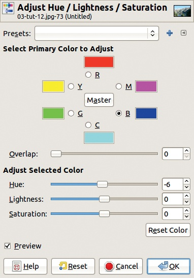

图 2-37. 色相-饱和度对话框

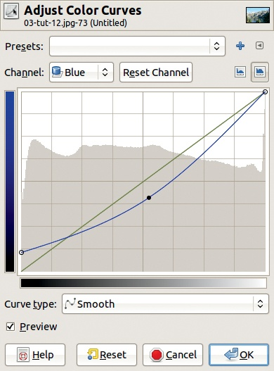

图 2-38. 曲线对话框

最后一个工具，**图像: 颜色 > 曲线**，允许你进行相同的调整，但提供了更多的控制。正如图 2-38 所示，你可以改变蓝色通道的响应曲线来去除蓝色偏色。在这里，抬高最左边的点，相当于在色阶工具中将左侧的黑色三角形向右移动。这会突显图像中最暗部分的颜色。调整中间点，使其位于对角线下方，以减少整个图像的蓝色偏色。最右边的点保持不变，因此天空仍然保持蓝色。你可以以多种方式改变色彩曲线，常常会得到一些奇怪的结果。

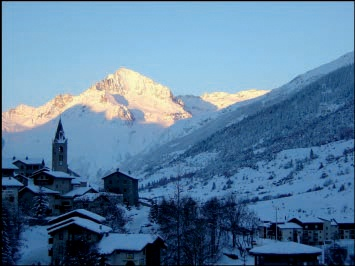

图片来源: Vincent Lecarme

图 2-39. 初始照片

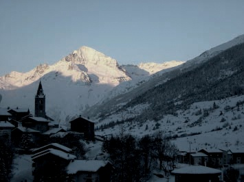

图 2-40. 在降低顶部图层的不透明度后

图 2-39 展示了一张存在色彩平衡问题的照片。恶劣的条件（极低的温度和高海拔地区的清晨光线）使得这张照片呈现出强烈的蓝色偏色，而这并不准确地反映了如果你真正站在这片雪地上望出去时的景象。

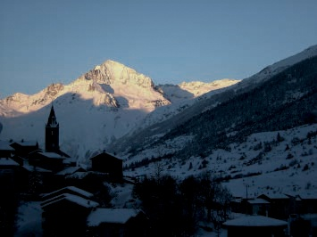

图 2-41. 最终结果

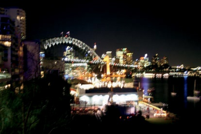

图 2-42. 初始图像

复制图像图层并对图层应用不同的变换，往往能得到令人愉悦的，或者至少有趣的结果。尝试以下操作：

1.  复制图层（）。

1.  去饱和下层（背景）图层（**图像：颜色 > 去饱和**）。

1.  将上层图层的混合模式更改为“正片叠底”。

1.  将上层图层的不透明度降低到 60%。

结果如图 2-40 所示。诚然，天空现在显得太暗。解决方法是再次复制上层图层，保持混合模式和不透明度不变。参见图 2-41。

如图 2-42 所示，这张图像展示了不同的一组挑战和可能性，充分展示了 GIMP 的灵活性。这张照片是在夜间拍摄的，且没有使用三脚架，导致了明显的运动模糊。相机确实将底部中央的灯光分配为真正的白色，并将部分天空分配为真正的黑色。由于整个色值范围都被覆盖，因此使用“色阶”工具进行全局调整将不起作用。

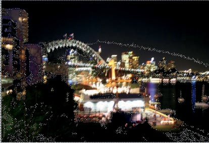

图 2-43. 选择暗部区域

相反，可以使用“色阶”工具分别编辑暗部和亮部区域。这很简单：

1.  选择“按颜色选择”工具（），然后点击天空中的任何位置。你将得到如图 2-43 所示的复杂选择。

1.  隐藏这个选择（），然后选择“色阶”工具。点击“自动”按钮。

1.  现在反转选择（），选择未修改的区域。再次选择“色阶”工具并点击“自动”按钮。

结果，如在图 2-44 中所示，可以被视为对夜间光线的创意演绎。

# 2.3 局部变换

接下来的示例和技巧需要精确选择图像的一部分，因此仅通过颜色选择工具点击照片的任意位置是不够的。现在，你需要亲自手动对选择区域进行微小调整。可以通过使用快速蒙版来完成此操作。

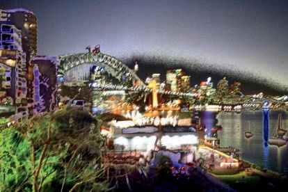

图 2-44. 最终结果

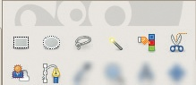

图 2-45. 工具箱中的选择工具

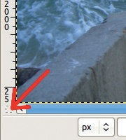

图 2-46. 快速蒙版按钮的位置

## 进行选择

GIMP 有八个选择工具，这些工具位于工具箱的前两行中（见图 2-45）。现在让我们仔细看看每个工具。

### 选择工具选项

快速蒙版（通过点击图像窗口左下角的小按钮访问，参见图 2-46）是这些工具的重要补充。

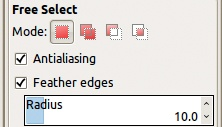

图 2-47. 自由选择工具选项

所有选择工具都提供图 2-47 中显示的选项，但大多数工具还具有额外的独特选项。通常，你应该保持 ANTIALIASING 选项选中。当你希望选择区域的轮廓平滑时，勾选 FEATHER EDGES 选项。RADIUS 指定平滑边界的宽度。MODE 决定新选择如何与现有选择交互：

+   在替换模式下，现有选择区域会被新的选择区域替换。

+   在添加模式下（如果你按下时也会设置此模式），新的选择会增强现有选择。

+   在减去模式下 ()，新的选择区域会从现有选择区域中减去。

+   在交集模式下 ()，最终的选择区域仅包含现有选择区域和新选择区域的共同部分。

如你所见，通常在进行图像调整之前，需要添加或修改选择区域。即使在切换选择工具之后，你仍然可以进行这些操作。

在接下来的部分，我们将讨论适用于修图的选择工具。矩形选择工具和椭圆选择工具很少有帮助，因为它们只能进行简单的几何选择。此外，矩形工具在目标矩形的边缘不完全与图像边缘平行时很难使用。路径工具是一种间接且复杂的选择构建方式，因此我们在本节中没有包括它。

### 简单选择工具

自由选择（）是一个非常方便的工具。我们已经在本章中使用了它好几次。自由选择最适合与图形板触控笔一起使用。围绕要选择的区域绘制，并通过在起始点附近完成选择或按下来确认选择。参见图 2-22 或图 2-30 中的示例。除了绘制外，你还可以点击目标形状轮廓的多个位置来选择区域，这样可以围绕目标构建一个多边形。图 2-48 展示了一个简单的示例，在此示例中，矩形选择工具无法使用。

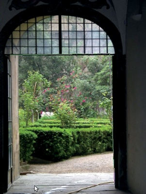

图 2-48. 使用自由选择工具选择多边形

模糊选择工具（），也称为魔术棒，已在图 2-34 中使用。模糊选择会根据给定的阈值选择与点击像素相邻且相似的所有像素。如果选择的区域过大或过小，可以在工具选项中更改阈值。通常，按住键并点击目标轮廓的多个位置来进行选择。此工具在选择形状复杂的区域时特别有用。

颜色选择工具（）已在图 2-43 中使用。它的工作方式几乎与模糊选择工具完全相同。唯一的区别是像素不需要是相邻的；如果你想选择由许多小的、分开的部分组成且颜色大致相同的区域，这是一个优势。然而，有时不需要的像素也可能被包含在选择中，仅仅是因为它们与目标颜色足够相似。因此，每种工具在不同的情况下都有其独特的用处。

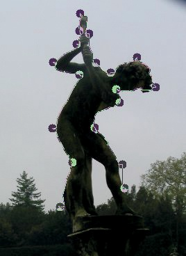

图 2-49. 使用剪刀选择工具

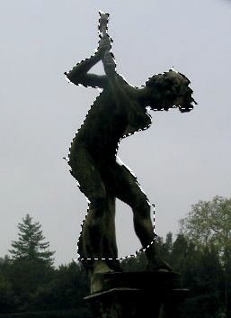

图 2-50. 最终选择

### 剪刀选择工具

剪刀选择工具（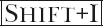）也称为智能剪刀。与模糊选择工具类似，沿着目标区域的轮廓点击即可进行选择。如果目标区域与背景有明显对比，剪刀选择会自动跟随轮廓，无论它多么复杂。图 2-49 展示了正在建立的选择。请注意，一些点可能会被分得很远，因为选择将遵循明显的轮廓。图 2-50 展示了最终的选择，这是通过关闭路径并单击选择中心得到的。在这个例子中，我们切除了雕像的脚部并包括了雕像双腿之间的区域，但我们可以通过继续初步选择到雕像的底座，然后使用减去模式去除双腿之间的区域来轻松修复。

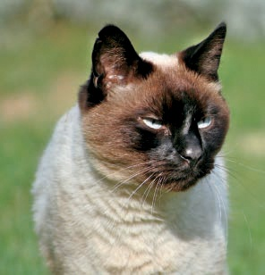

图 2-51. 初始图像

### 前景选择工具

前景选择工具在一些特定情况下非常有用；例如，当你想选择图像中位于前景的主题，并且它与背景明显分离时，像图 2-51 中的情况。选择工具箱中的前景选择工具，并围绕目标绘制一个大致的轮廓，就像使用自由选择工具一样。当轮廓闭合时，所选区域会如图 2-52 所示显示出来。

在不更改选择工具的情况下（否则之前的工作会丢失），在选择区域内绘制一条连续的路径，触及所有要包括的颜色，如图 2-53 所示。我们使用红色绘制路径，但你可以选择任何颜色，只要它与目标选择区域中的颜色不同。

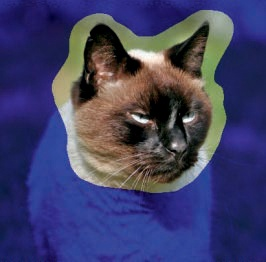

图 2-52. 选择轮廓后

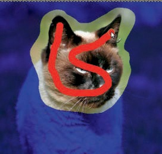

图 2-53. 选择前景颜色

当你停止绘制路径时，选择区域如图 2-54 所示出现。如你所见，图像还不完美。脸部的一部分，包括眼睛，未被选中。你可以增加更多的笔触以捕捉缺失的区域，或者按下以用行进的蚂蚁框住选择区域，然后点击快速蒙版按钮继续编辑选择。

结果如图 2-55 所示。未选择的区域显示为红色。你可以继续使用画笔工具编辑选择区域。启用快速蒙版时，从工具箱中选择画笔工具，并将颜色设置为黑色和白色。如果我们用黑色涂抹，涂抹的像素将从选择区域中删除，并变为红色。如果我们用白色涂抹，涂抹的像素将被添加到选择区域中。要在黑白之间切换，请使用键，这将交换前景色和背景色。

图 2-54. 未来选择

图 2-55. 使用快速蒙版

当你满意后，再次点击快速蒙版按钮以显示选择区域，如图 2-56 所示。

## 修改锐度

正如我们之前提到的，缩小照片的尺寸（例如，用于放置到网站上或打印）会降低锐度。因此，我们建议在任何变换过程的最后，使用**图像：滤镜 > 增强 > 非锐化蒙版**。理想情况下，你应该在整个变换过程中定期使用这个步骤。

有时，减少照片中某些区域的锐度会增加深度感。例如，考虑图 2-57。由于猫的颜色与背景中的岩石相似，而且至少一些植物的锐度与猫一样，甚至更锐利，猫融入了背景中。我们想要做的是让背景模糊，这样猫就能突出显示。

图 2-56. 最终选择

图 2-57. 初始照片

我们首先选择猫，这并不容易。尽管猫在前景中，但前景选择工具效果不好，因为猫的浅色部分几乎与背景的颜色相同，而且它的深色耳朵与灌木丛中的阴影相似。为了得到图 2-58 中看到的效果，我们使用快速蒙版小心地选择了猫。我们发现最容易的方法是选择背景，并用快速蒙版将猫涂成黑色，以便将其从选择中移除。结果虽然不完美，但足够能够看到预期的效果。

图 2-58. 选择猫

图 2-59. 最终结果

做出选择是最难的部分。完成后，我们只需要使用**图像：滤镜 > 模糊**添加强烈的高斯模糊，半径为 20 像素，即可得到图 2-59 中显示的效果。背景现在变得非常模糊，而猫则显得更加突出。

## 修改亮度

修改照片中特定区域的亮度是改变图像表观深度的另一种方法，它还可以增加在强烈对比度的图片中的可见度。这对于图 2-60 来说就是如此。

再次强调，建立选择是最困难的部分。你需要选择窗户及其内容，以及直接被阳光照射的墙面部分。你可以使用自由选择工具进行初步的大致选择，但随后需要花时间使用快速蒙版工具进行细化，以获得图 2-61 中所示的选择。

图 2-60. 初始照片

图 2-61. 选择窗户

一旦我们完成选择，我们选择“色阶”工具。点击 AUTO 不会改变太多，但移动伽马三角形将达到我们想要的效果。结果如图 2-62 所示。

图 2-62. 最终结果

图 2-63. 初始照片

我们的下一个例子是一张存在多个重大缺陷的照片。如图 2-63 所示，图像倾斜，光线昏暗，天空模糊，总体上缺乏对比度。我们不会从这张图片创建一张完美的照片，但至少可以进行一些改进。

首先，使用旋转工具将图像拉正。因为没有简单的方法来测量所需的角度，所以可以放大教堂屋顶的部分，这部分应该是水平的。选择旋转工具，在工具选项中选择一个**修正**方向。然后，将网格对齐到屋顶，按下旋转。裁剪得到的图像后，我们得到了图 2-64。

图 2-64. 旋转和裁剪后

图 2-65. 选择天空：第一步

图 2-66. 选择天空：第二步

现在我们来选择天空，以便增强它的色彩。模糊选择工具很有用，但天空和城市之间的边界太模糊了。当我们进行选择时，不仅选择了天空，还选中了靠近地平线的相当一部分土地（见图 2-65）。注意，我们已经反转了选区。

图 2-67. 为前景添加一些光线

图 2-68. 构建天空

使用快速蒙版纠正选区。这个过程需要小心处理。天空与城市之间的边界需要特别注意。钟楼也必须通过在快速蒙版中绘制手动选择。完美处理圆顶旁边的脚手架几乎是不可能的。我们的最终选区如图 2-66 所示。

这个选区允许我们使用**Levels**工具为前景添加一些光线和色彩。关闭快速蒙版，确保选中了前景，而不是天空，然后调整色阶，直到满意为止。我们的亮化图像如图 2-67 所示。注意，通过将前景的树木与画面其他部分分开，整体对比度可以得到提升。在本教程的后续部分，我们将执行这一操作。现在，结果已经足够了。

图 2-69. 最终图像

接下来，你需要反转选择，使其包含天空。点击“渐变”工具，选择预设的`Horizon 1`渐变。按下键垂直绘制（按此键可确保线条角度是 15°的倍数）。点击天空的中间，向下绘制，超过图像底部。如果绘制不够远，部分天空会呈现棕色。这个过程应该生成图 2-68。

要完成修正并获得图 2-69，请执行以下操作：

1.  使用“按颜色选择”工具，选择前景中的树木。

1.  反转选择，并选择“色阶”工具。

1.  点击“自动”按钮。最终图像有较强的红色偏色。

1.  选择红色通道，并将伽玛三角形向右移动，直到你满意为止。

## 使用克隆工具

克隆工具是更改照片细节的最强大工具之一。在本教程中，我们通过使用另一张更成功的照片中的元素来修正一张照片。图 2-70 展示了两张图片，它们在我们的工作区中打开。在其中一张照片中，红眼效应遮挡了猫的眼睛。在这种情况下，红眼去除滤镜没有起作用。为了解决这个问题，将第一张照片中的眼睛复制到第二张照片中。

图 2-70. 初始照片

图 2-71. 克隆眼睛

首先，你必须确保两张照片中的眼睛大小相同。如果不相同，可以通过**图像：图像 > 缩放图像**来调整第二张图片的缩放比例。

图 2-72. 最终结果

图 2-73. 图 2-24 经过一些修复后的效果

接下来，选择克隆工具（），使用`Hardness 075`刷子，大小设置为**20**。-点击蓝色源眼睛，然后使用克隆工具在红色眼睛上绘制，如图 2-71 所示。图 2-72 显示了结果。

在拍摄人像时，通常会捕捉到一些瑕疵和斑点，这些会影响被摄者的自然美感。你可以使用 GIMP 的克隆工具去除瑕疵，但在处理人像时，治愈工具通常更好。它的工作原理与克隆工具完全相同，不同之处在于，它不仅仅是替换目标像素，而是将其混合，从而使源图像与目标图像更平滑地融合。图 2-24 就是一个很好的例子。在这张人像上使用治愈工具（下巴的尖端和右侧、鼻梁、下嘴唇、眉毛上方的区域）后，我们达到了图 2-73 所示的效果。

图 2-74. 最初的图像

## 视角克隆

有时你可能想要在图像中克隆一个物体，使其在不同的距离上多次出现。为了获得透视效果，你需要适当调整克隆物体的大小。

Perspective Clone 工具是专门为这种效果量身定制的。虽然大多数人很少需要这种特定的效果，但当你确实需要时，Perspective Clone 工具非常有用。

以图 2-74 中显示的这张照片为例。我们将展示如何复制穿过人行道的小鹅卵石排水沟。选择工具箱中的 Perspective Clone 工具（没有键盘快捷键）。在选项对话框中勾选 MODIFY PERSPECTIVE。然后点击图像。角落里会出现方框，你可以移动这些方框来定义你将要克隆物体的透视效果。将方框移动，使指南线与人行道的边缘对齐。

图 2-75. 克隆排水沟

图 2-76. 最终结果

一旦你设置了透视效果，在选项对话框中勾选 PERSPECTIVE CLONE。现在使用该工具的方法与使用克隆工具时完全相同。首先，点击排水沟或你正在克隆的任何物体，然后使用 `Hardness 075` 笔刷，以较大的尺寸涂抹你希望出现另一个排水沟的区域。图 2-75 展示了正在进行的工作，且图 2-76 展示了最终结果。当透视角度较为剧烈时，这个工具的效果会稍逊。

图 2-77. 最初的照片

## 更多的红眼修正方法

在去除红眼中，我们演示了处理红眼的最简单方法：使用红眼去除滤镜。然而，根据图像的不同，其他一些不那么自动化的技术可能会取得更好的效果。在使用克隆工具中，我们使用克隆工具结合第二张图像进行红眼修正。这里，我们展示了更多的技术方法。

### 第一种方法：选择红色通道

在图 2-77 中可以看到一个相当具有挑战性的红眼案例。红色非常明显，但在灰色虹膜和红色瞳孔之间的边界处几乎没有对比度。将图像缩放到 400%，使左眼尽可能大。使用**图像：视图 > 新视图**同时以 100%缩放查看相同的图像，以便在工作时更好地预览最终效果。

选择加深/燃烧工具（），并按下“燃烧”按钮。选择`Hardness 075`画笔，并将其大小设置为**12**。最后，在通道对话框中，点击绿色和蓝色通道取消选择它们。所有三个通道仍然可见，但该工具只会更改红色通道（参见图 2-78）。

图 2-78. 取消选择绿色和蓝色通道

图 2-79. 修正右眼

现在烧掉红色斑点。点击并/或使用燃烧工具涂抹瞳孔，注意避免瞳孔中心的亮光反射。如图 2-79 所示，你可以在 100%缩放下检查图像的效果。如果效果过强或过弱，可以调整工具选项中的曝光值。最终效果见图 2-80。

### 第二种方法：选择红色斑点

如标题所示，下一个方法要求你选择眼睛中的红色区域。如果你放大足够远，可以使用自由选择工具来完成，但在这种情况下，椭圆选择工具实际上效果最好。

按（）选择它。在选项中，勾选“从中心扩展”和“固定”框。将“固定”选项设置为“纵横比”，并检查下方框是否显示为“1:1”。点击并从红色斑点的中心拖动，围绕它建立一个圆圈。当你对选择的结果感到满意时，选择选项下的“添加模式”，并为另一个眼睛建立第二个圆圈。

完成后，隐藏选区（）并将缩放比例恢复到 100%。颜色调整使用**图像：颜色 > 色相-饱和度**，移动色相游标直到满意为止。在选择了眼睛中的红色后，你也可以使用**图像：颜色 > 去饱和**来去除颜色。虽然这种方法不总是有效，但这次它成功了。如果图像太亮，你可以先使用**图像：颜色 > 反转**来帮助调整。

图 2-80. 最终结果

接下来，我们将向你展示一种更安全的处理红眼的方法。从已选中的红色斑点开始，尝试以下操作。

复制唯一的图层。在上层图层中，创建一个图层蒙版：**图层：右键 > 添加图层蒙版**。在出现的对话框中勾选“选择”。

通过点击缩略图选择上层。你应该在图层对话框中看到围绕图层的白色边框，而不是蒙版。蒙版启用后，任何对上层的修改只会影响红色斑点，下面的图层将保持不变。

现在调整红色斑点的颜色。尝试使用**图像：颜色 > 去饱和**，然后使用**图像：颜色 > 亮度-对比度**。你也可以尝试应用轻微的高斯模糊（**图像：滤镜 > 模糊 > 高斯模糊**，半径设为 1 或 2 像素），这可能会有所帮助。

图 2-81. 初始照片的天空显得有些单调。

图 2-82. 一张有趣的天空照片

## 改变风景的天空

在风景摄影中，天空的外观非常重要。不幸的是，捕捉到美丽的天空往往充满挑战。在本章中，你已经看到了几种不尽如人意的天空：一种太苍白（图 2-7），一种太白（图 2-15），还有一种太朦胧和阴沉（图 2-63）。在清晰、阳光明媚的日子里，山脉上的深蓝色天空稍微好一些，但简单的、均匀的深蓝色并不十分吸引人。然而，带有一些巧妙布局的云彩的深蓝色天空，却能带来恰到好处的效果。

我们通常发现，等待我们想要拍摄的景观拥有完美的蓝天和白云并不现实。我们将展示如何为缺乏完美天空的景观照片添加一个完美的天空。我们之前已经展示了一种方法（参见图 2-69），但是使用预定义的渐变并不是一个理想的解决方案。在这里，我们尝试另一种技术，这在图 2-81 中展示，使用了图 2-82 中的天空。

图 2-83. 选择并去除天空

首先，使用“按颜色选择”工具选择天空（）。只需在天空的中央单击一次，然后按住键，再在角落点击一两次。接下来，添加一个 Alpha 通道到唯一的图层（**图层：右键点击 > 添加 Alpha 通道**）。剪切选区（），得到图 2-83。

在这个图示中，你可以看到使用“按颜色选择”工具做出的选择并不很精确。图像中央的柏树周围以及右侧的树枝上仍然残留着蓝色光晕。为了修正这一点，撤销剪切操作（），然后使用**图像：选择 > 扩展**，它会将选择区域扩展固定数量的像素。选择**2**像素。接下来，使用**图像：选择 > 羽化**，它会使选择轮廓变得平滑，再次选择**2**像素。现在，如果图层名称是粗体显示的，添加一个 Alpha 通道到该图层，并剪切选区。结果会明显更好，正如你在图 2-84 中看到的那样。

图 2-84. 改善选择

图 2-85. 图像的两个图层

现在，你需要将图 2-82 中的天空作为底层放入图像中。一个简单的方法是打开该图像，在 GIMP 中激活它，然后将其唯一图层的缩略图从“图层”对话框拖到你正在处理的图像中。接着，将这个新图层拖到图层堆栈的底部，如图 2-85 所示。

一旦添加了天空图层，你可以使用移动工具 () 调整图层位置，从而改变构图。这个过程在天空图像比风景图像大时效果最好，这样你在选择构图时会有更多空间。可能的最终结果出现在图 2-86 中。为了进一步改善这幅风景，我们使用橡皮擦工具 () 去除了一些右侧树上的细小枝条。你还可以使用克隆工具隐藏一些其他不太美观的细节。

图 2-86. 最终结果

# 2.4 修饰扫描的照片

照片随着时间的推移会退化，因此如果你正在数字化旧的家庭照片，你可能希望将它们恢复到原始的辉煌状态。即使你的照片是全新的，你的扫描仪也可能无法精确捕捉到图像的细节。尽管你可以使用扫描仪的软件对图像进行调整，但 GIMP 给你更大的控制力，并且功能更强大。

## 纠正颜色

图 2-87 展示了以 300 ppi 扫描的相册页面。照片是在 1975 年拍摄的，之后有所退化。透明膜也粘在页面上，并在底部的照片中可见。我们希望最终恢复这些照片，但这里我们专注于左上角的照片。

图 2-87. 原始扫描

图 2-88. 选择关注的图片

首先，使用矩形选择工具 () 选择你想要修复的照片。因为照片略微歪斜，所以选择一个比照片大的区域，如图 2-88 所示。用这个选择区域创建一个新图像副本：

图 2-89. 关注的图片

图 2-90. 旋转和裁剪图像

1.  按下  复制选择区域。

1.  按下  将副本粘贴为新图像。

你还可以在**图像：编辑**菜单中找到这些命令。

新的图像显示在图 2-89 中。旋转它（）并裁剪它（）以使其直立，并去除相册页面的残留部分。

图 2-91. 值通道和红色通道的直方图

图 2-92. 绿色通道和蓝色通道的直方图

结果显示在图 2-90 中。通过选择直方图对话框，你可以看到颜色的衰减情况：**图像：窗口 > 可停靠对话框 > 直方图**。在弹出的窗口中，选择一个通道进行显示。图 2-91 和图 2-92 显示了值、红色、绿色和蓝色通道的直方图。理想情况下，直方图应该是钟形曲线，但这些直方图都有偏斜。它们在左侧，也就是低值处达到了峰值。值通道和红色通道的直方图在低值处也有一个缺口。

所有通道中的值范围应该被扩展，以覆盖整个范围。选择色阶工具并按下自动按钮，得到图 2-93 所示的结果。这个图像比原始图像稍微好一些，直方图也发生了很大变化，特别是在值通道和红色通道方面。

图 2-93. 自动调整色阶

图 2-94. 使用吸管调整色阶

现在使用色阶工具中的吸管，手动选择图像中的黑色、灰色和白色点。熟练使用这个工具可能有点难，尤其是顺序非常重要。为了得到图 2-94 中的结果，我们选择了猫耳朵上的黑色点，猫毛上的灰色点，以及羊皮上最亮部分的白色点。“最佳”结果是个人口味的问题，所以可以尝试不同的选择，直到找到你喜欢的那个。

图 2-95. 调整曲线

曲线工具也可以用来调整色彩平衡。通过**图像：颜色 > 曲线**来选择它，并尝试调整四条曲线。将曲线的端点向内移动，使其触及直方图的边缘，这类似于在“色阶”工具中按下 AUTO 按钮。然后在预览窗口中观察效果的同时，轻微调整每条曲线的中间部分。图 2-95 展示了结果，这是无数可能结果中的一个。

## 修复划痕和污点

许多非常旧的照片可能会有折痕、划痕或污渍。过去，修复这类损坏的唯一方法是用铅笔和画笔手工修饰照片。现在，使用扫描仪和 GIMP，你可以更轻松、更安全地修复旧照片。

图 2-96 展示了超过一个世纪前拍摄的照片。虽然褐色调是因为退化而产生的，但它看起来很舒服，所以保持原样。低色值部分已经褪色，但这使得肖像显得更柔和，因此你也不需要改变那些部分。不过，你确实想去除一些瑕疵。这张照片中间曾经被折叠过，顶部，尤其是左侧出现了污渍或划痕，而且图像周围散布着一些小的白点，例如在左侧的头发上。

图 2-96。原始图片

图 2-97。修复了折痕、划痕和污点后的效果

幸运的是，折痕没有留在眼睛上，仅在鼻子上留下了一些轻微的痕迹。首先，放大查看细节。

选择“涂抹工具”（），并选择`硬度 075`的画笔。使用短而滑动的笔触在脸部平滑瑕疵。为了去除折痕痕迹，选择一个较大的画笔大小。对于小的点状瑕疵，选择一个非常小的画笔。

图 2-98。另一张折叠的照片

图 2-99。修正后的一些效果

接下来，选择克隆工具 () 来去除头发中的划痕和折痕。再次使用 `Hardness 075` 的画笔，画笔大小要与去除的瑕疵成比例。如果你使用带有 `Basic Dynamics` 的图形平板的手写笔，可以通过简单调整压力来改变画笔大小，这非常直观，也使任务变得更轻松。虽然笔画取决于修正的内容，但通常最好跟随划痕的方向进行操作。对于一个小的白色斑点，轻轻触碰笔尖可能就足够了。最终效果如图 2-97 所示。

图 2-98 和图 2-99 展示了对另一张照片应用这些相同方法后的效果，但效果较差。由于损坏更为严重，这张图像需要手动修复。

图 2-100. 20 世纪初的照片

图 2-101. 修复主要缺陷

## 修复非常古老的照片

如图 2-100 所示，这张照片已有一个多世纪的历史，随着岁月的流逝，它已经严重退化。照片的褐色调实际上是褪色的灰度。为了将图像恢复为灰度图，你可以去饱和它，但结果并不好，因为许多主要的缺陷仍然存在，所以首先需要对图像进行修复。

首先，使用克隆工具去除马前方的大污点。 右键点击污点左侧的区域，小心地覆盖污点进行去除。为了去除右下角的蓝色偏色，选择该区域并使用“色阶”工具。调整蓝色通道中的伽马滑块，偏色就消失了。

取消选择 ()，然后使用“自动”按钮在“色阶”工具中改善整体色值范围。最后，是时候去饱和图像并将其恢复到原始的灰度值了。这应该是你的最后一步，但最终效果，如图 2-101 所示，尽管对比度强烈，图像看起来依然较为平淡。我们习惯于看到带有褐色调的老照片，因此，如果你将其恢复成原来的色调，图像会更好。你可以直接选择**图像：编辑 > 撤销**，但通过重新上色图像，你可能会获得更好的效果：

图 2-102. 最终效果

1.  复制图层。

1.  使用**图像：颜色 > 上色**工具在最上面一层，移动色相光标向左，直到你对颜色满意为止。

1.  将该图层的不透明度降低到大约 50%。

最终效果如图 2-102 所示。马的前脚已经褪色，可能需要进行一些修饰，但这些工作超出了本教程的范围。

# 2.5 高级技巧

本章节中，我们将介绍一些稍微复杂、且不太常用的技巧。

## 让照片看起来更旧

GIMP 是一个非常棒的工具，可以帮助你“作弊”时间。在前面的章节中，我们将一张旧照片更新成了更现代的样子。在接下来的章节中，我们将尝试让某人看起来更年轻。在本章节中，我们将使一张现代照片看起来像是 50 多年前拍摄的。

使照片呈现年代感的最有效方法之一是去除颜色并给照片添加一种棕褐色调。我们选择了图 2-103，这张照片没有明显的现代特征。如果你觉得懒得做太多操作，可以尝试使用滤镜（**图像：滤镜 > 装饰 > 旧照片**）。该滤镜没有太多可调参数，所以只需点击 OK。我们得到了图 2-104 中的效果。这张图像看起来确实有些年代感，但我们可以做得更好。

图 2-103. 初始照片

图 2-104. 使用旧照片滤镜

首先，将图像去饱和度（**图像：颜色 > 去饱和**）。选择整张图像（）并复制它（）。将前景色设置为棕褐色调，例如，HTML 代码中的**a28a65**。创建一个新图层（），并选择用前景色填充该图层。为该图层添加图层蒙版（**图层：右键点击 > 添加图层蒙版**），并在出现的对话框中勾选 SELECTION。将刚刚复制的内容粘贴到蒙版中，方法是点击 。将浮动选择锚定到图层蒙版上（点击图层对话框底部的锚定按钮或按下 ）。

图 2-105. 设置 Sepia 图层的图层蒙版后

图 2-106. 翻转图层蒙版并切换到颜色模式后

图 2-107. 使用圆角滤镜后

图 2-108. 添加咖啡渍

结果，出现在图 2-105 中，仍然不太对。为了改进它，请检查图层蒙版是否处于活动状态（如果不确定，请点击缩略图），然后反转颜色（**图像：颜色 > 反转**）。将顶部图层的混合模式更改为颜色。结果（图 2-106）好多了，但如果你仍然不满意，可以进一步调整。你可以尝试降低顶部图层的不透明度，或者尝试在图层本身上使用曲线工具（**图像：颜色 > 曲线**），而不是在图层蒙版上。选择值通道，然后将曲线的底部稍微提高，顶部稍微降低。这应该能改善对比度。

图 2-109. 原始照片

你可以使用**图像：滤镜 > 装饰**子菜单中的一些滤镜来完成老化效果。例如，图 2-107 的效果来自应用圆角滤镜，所有参数设置为其默认值的两倍。

在同一子菜单中，你会找到咖啡渍滤镜，它能创造出那种逼真的“哦，原来那不是杯垫？”的效果（图 2-108）。

## 改善肖像

在杂志中，你最喜欢的演员或歌手总是看起来非常迷人，这都要归功于像 GIMP 这样的程序的魔力。如果你在街上遇到他，可能会对照片修饰带来的差异感到惊讶。如今，隐藏瑕疵、去除皱纹，甚至改变一个人眼睛的颜色都变得非常容易。让我们尝试一下修饰一张非常不重要人物的肖像——这本书的作者之一。图 2-109 展示了一张相当不讨喜的肖像，我们将对其进行改善。

图 2-110. 选择面部

首先，选择“级别”工具，改善整张图片的光照。接下来，选择你将要处理的区域。虽然我们想要去除图片中的眼镜，但这样做非常困难。你可以尝试用克隆工具擦除它们，但完全去除反射效果会需要大量的工作。太费劲了。所以，还是保留眼镜。衣服不需要修饰，所以只专注于皮肤部分。使用“自由选择”工具选择工作区域。首先，粗略地在面部周围画出轮廓，然后按住键，去掉选区中的眼镜。图 2-110 显示了结果。

GIMP 提供了多种方式来使我们的主角看起来年轻些。我们将尝试以下方法：

1.  对选区应用一个非常轻微的高斯模糊：半径设置为 2 或 3 像素即可。

1.  使用修复工具去除瑕疵和变色。

1.  最后，选择涂抹工具()。选择`Hardness 075`刷子，将其大小设置为**12**，然后在皱纹或任何你想让皮肤看起来更平滑的地方涂抹。此工具通过从起始点选取颜色并将其与图像混合来工作—就像用手指涂抹湿漆一样。

图 2-111. 模糊、修复和涂抹后的效果

经过一番处理，我们得到图 2-111，效果好多了。你一开始做的选择帮助你避免了对眼镜和衣服进行不必要的修改。

这张肖像还可以进一步增强：鼻子太暗，主角看起来太严肃。要修饰鼻子，可以使用“加深/减淡”工具()，设置为减淡模式，使用`Hardness 075`刷子，并设置较大的尺寸。结果，见图 2-112，虽然变化不算巨大，但确实有所改进。

在这张图片中，进行另一个细微的修改：稍微明亮一下我们严肃的主角的心情。使用**图像：滤镜 > 扭曲 > IWarp**工具，弹出如图 2-113 所示的对话框。在调用 IWarp 之前，使用矩形选择工具选择图像的中心区域，以便在 IWarp 对话框中获得目标区域的更大视图。

然后，使用默认设置，如图所示，稍微拉伸嘴角，轻微抬起上唇的中间部分，并轻微下拉下唇的中间部分。你还可以稍微抬起下眼睑。现在如果被拍摄者没有微笑，看起来就不那么严肃了。

图 2-112. 对鼻子进行修饰并添加微笑

图 2-113. IWarp 对话框

## 使用多次拍摄同一场景

在今天的数码相机下，拍摄同一场景的多张照片既简单又不需要额外花费。正如你在多个示例照片中看到的那样，对于具有强烈对比的场景，选择合适的曝光值可能非常困难，甚至不可能。通过不同曝光拍摄同一高对比场景的多张照片，是应对这一挑战的一种方法。许多数码相机甚至提供一种叫做“自动曝光包围”模式，在这种模式下，相机会在快速连续的拍摄中拍摄三张不同曝光的照片，以围绕最佳自动曝光值进行调整。

图 2-114. 首次拍摄，正常曝光

图 2-115. 第二次拍摄，过度曝光

图 2-114 和 图 2-115 展示了一个示例。第一张图片使用了自动曝光拍摄，而第二张则是过度曝光的。请在 GIMP 中打开这两张图片：第一张以正常方式打开，第二张通过使用**图像：文件 > 作为图层打开**或  打开。将上层的透明度降低到 50%，检查两张图片是否正确重叠。这些照片是在没有三脚架的情况下拍摄的，你可以看到摄影师在拍摄过程中有轻微的移动。使用移动工具 ()，尽量仔细对齐图层，以获得图 2-116 所示的图像。如果你仔细观察，你会发现对齐仍然不完全完美。

图 2-116. 两张照片叠加

图 2-117. 使用颜色混合模式

图 2-118. 使用叠加混合模式

最后，尝试使用混合模式来改善结果。图 2-117 显示了颜色混合模式，这对这张图像非常有效。颗粒合并、柔光和叠加（图 2-118）也效果很好。

# 2.6 练习

**练习 2.1.** 层次工具有许多我们在本章中没有使用的功能。尝试在你自己的照片上实验一些这些功能。试着弄清楚五个吸管按钮分别是做什么的。

**练习 2.2.** 本章中，我们使用了透视工具来插入不同距离的物体。这个工具也可以用来修正透视畸变。拍一张从下方拍摄的摩天大楼（或任何高楼）的照片，这样透视会变形，然后尝试使用透视工具进行修正。记得保存未编辑的照片以备下一个练习使用。

**练习 2.3.** 这次，使用透视克隆工具为你变形的摩天大楼照片添加一些新的装饰。你可以添加额外的窗户、门，或者建筑上出现的任何其他物体。为建筑的多个不同层次添加装饰。

**练习 2.4.** 通常，构建选择的最有效方法是结合使用多种选择工具。对于复杂选择的精细修正，通常使用快速蒙版工具。尝试使用选择工具在照片中选择复杂的区域。如果你犯了错误，可以通过按下  来撤销操作，或者通过按下  来重做。通常，撤销和重做对部分完成的选择不起作用，但它们在需要连续步骤的选择上有效。尝试使用 **图像：编辑 > 撤销** 和 **图像：编辑 > 重做** 命令，看看它们什么时候有效，什么时候无效。

**练习 2.5.** **图像：滤镜 > 增强** 菜单中有几个我们没有使用的滤镜。尝试在你自己的照片上实验其中的一些，特别是各种锐化滤镜（除了反锐化蒙版）。
