# 第三章 绘图与插图

尽管大多数人在想到数字插图软件时不会首先想到 GIMP，但它实际上是一个出奇强大的工具，适用于上色、个性化图像，甚至从头创作原创艺术作品。在本章中，我们将向你展示如何为图画上色，并让你了解数字绘画是如何进行的。我们将介绍一些基本工具和技巧，包括画笔、填充工具以及你可以在 GIMP 中用来绘制简单形状的方法。

# 3.1 教程：为图画上色

为图画上色是学习 GIMP 中许多数字艺术技巧和工具的好方法。在本教程中，我们将使用画笔工具如画笔和修改工具如涂抹工具。上色还是一个灵活的过程：作为初学者，你可以相对快速地为小图画上色，同时也能探索技巧和工具；而一旦你成为经验丰富的上色师，你可以花费数小时制作一幅精美的艺术作品。而最重要的是——上色很有趣！

## 黑白图画

在开始上色之前，你需要一些可以上色的内容！一幅黑白线条画是最理想的，无论是你自己画的还是别人画的。如果你不想自己画，找到黑白线条画也很容易。有些艺术家喜欢画线条画，但缺乏技能、时间或兴趣为其添加颜色，因此他们会将这些作品分享给任何人进行上色。许多漫画艺术家会把线条画交给专业的上色师，后者各自拥有独特的个人风格。

我们将为图 3-1 中的蘑菇图像上色。该图像由干净、坚实的线条组成，若你是初学者，这种图像非常理想。如果你在网上找到线条画，下载你能找到的最大图像。宽度和高度超过 1000 像素效果最佳。图像缩小后，小的错误会消失，而且 GIMP 能够处理大画布大小而不出现问题。在本教程中，我们将使用宽 1200 像素、高 1800 像素的画布。

## 使用图层保持轮廓可见

图层是上色师的重要工具，因为它们减少了定义物体等枯燥工作的时间，并为有趣的部分，如玩弄不同的配色方案和添加阴影，留出了更多时间。

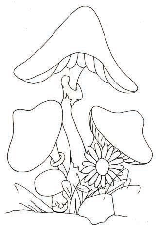

图 3-1. 蘑菇的线条画

图 3-2. 图层对话框中的新建图层按钮

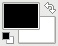

图 3-3. 前景色和背景色

在单独的图层上保留未修改的线条艺术副本，以便始终能看到线条。如果你将它放在图层堆栈的最底部并开始添加颜色，线条会消失！自己试试看：一旦你打开了线条艺术图像（**图片：文件 > 打开**或 ），创建一个新的透明图层。你可以通过以下四种方式来完成：选择**图片：图层 > 新建图层**或**图层：右键点击 > 新建图层**，或按下  或图层对话框按钮，如图 3-2 所示。然后在图像上绘制一条红色笔划：

1.  在工具箱中选择画笔工具（或按下 ）。

    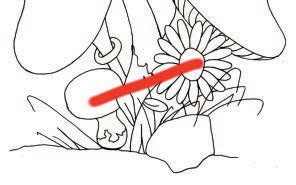

    图 3-4。红色笔划覆盖了线条

    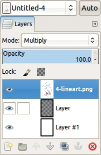

    图 3-5。图层对话框，见图 3-6

1.  点击工具箱左下角的前景色框（如图 3-3 所示）。默认前景色为黑色。

1.  在弹出的颜色选择对话框中，选择鲜艳的红色并点击“确定”。

1.  在画笔工具选项中，检查画笔是否设置为`Hardness 075`。如果没有，点击左侧的方框并选择正确的画笔。

1.  将工具选项中的尺寸滑块调整为**70**。

1.  在图像上涂鸦。

你的结果可能看起来像图 3-4。

为了在添加颜色时保持线条艺术可见，将线条艺术图层放在最上面（**图片：图层 > 堆叠 > 提升图层**）。红色笔划会被黑白图像遮住。要将它放回顶部，首先在图层堆栈底部创建一个新图层。这个图层将作为背景，可以是你喜欢的任何颜色。

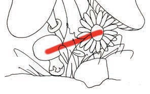

图 3-6。红色笔划显示出来

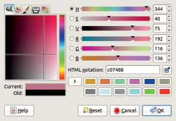

图 3-7。灰色调的颜色

接下来，选择顶部的图层（包含线条艺术）并将其设置为乘法模式，如图 3-5 所示。红色笔划应该会重新出现，如图 3-6 所示。从现在起，任何你在中间图层上绘制的内容都会透过白色显示出来，而不会遮挡线条。

## 定义物体和基础颜色

在开始之前，让我们回顾一些你需要的基本 GIMP 技能，来为绘图上色。要选择新的颜色，点击前景色框打开颜色选择对话框。

通过调整六个滑块（色相、饱和度、亮度、红色、绿色、蓝色）和左侧的可点击区域来进行选择。你的颜色选择将显示在右下角的当前颜色框中。

使用饱和度和亮度滑块（图 3-7 和图 3-8）调整灰度水平，以获得更逼真的颜色。如果你想要更具卡通风格的效果，可以选择仅使用鲜艳且饱和度高的颜色（图 3-9）。

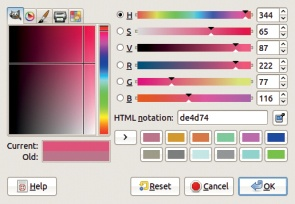

图 3-8. 中等颜色

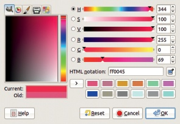

图 3-9. 鲜艳的颜色

图 3-10. 油漆桶填充工具图标

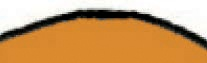

图 3-11. 使用油漆桶填充工具填充

要添加颜色，你可以使用油漆桶填充工具，单击一次填充一个区域（选择**图像：工具 > 绘画工具 > 油漆桶填充**，点击 ，或点击图 3-10 中显示的工具箱按钮），或者使用鼠标或手写板笔绘制区域，这需要更长时间。如果使用油漆桶填充工具，请确保选中**样本合并**，这样黑色线条（在单独的图层上）就会被考虑在内。你可能需要反复调整**阈值**，直到填充对象而不影响其他部分。

虽然油漆桶填充工具速度较快，但通常不够准确。深灰色像素常常保持灰色（参见图 3-11）。你可以通过继续调整**阈值**来增强效果，但结果可能永远不完美。

图 3-12. 画笔工具图标

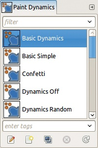

图 3-13. 画笔动态

图 3-14. 使用画笔工具绘画

图 3-15. 橡皮擦工具图标

画笔工具可以产生更准确、更清晰的效果，但使用它需要更长的时间（尽管随着经验的积累，你会变得更快）。(选择**图像：工具 > 涂鸦工具 > 画笔**，或按 ，或点击图 3-12 所示的工具箱按钮来访问画笔工具。) 如果你使用的是平板电脑，在为物体中心上色时要施加完全压力，否则你会得到部分透明的像素。或者，你可以将画笔动态设置为（图 3-13）`Dynamics Off`，以关闭压力敏感性。

在物体的边缘要小心。颜色应该涂到线条的最暗部分（覆盖任何深灰色像素），但不要超出图 3-14 所示的区域：左侧是颜色师未涂够，而右侧是颜色师涂得太远。

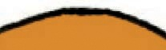

图 3-16. 精心绘制的边框

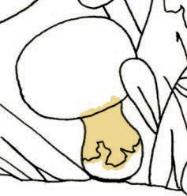

图 3-17. 定义蘑菇茎

如果你小心谨慎，耐心地为缺失的涂色区域填充颜色，并使用橡皮擦工具（选择**图像：工具 > 涂鸦工具 > 橡皮擦**，或按 ，或点击图 3-15 所示的工具箱按钮），你可以非常精确地为物体上色。在图 3-16 中，你可以看到一个精心绘制的边框。在绘制过程中，尝试使用不同的画笔大小：用较大的画笔大小绘制物体的中心，靠近边缘时切换到较小的画笔大小。现在，让我们尝试为简单的卡通上色。

## 上色蘑菇

在 GIMP 中进行上色的最有效方法是为物体中的每个基础颜色创建一个图层，然后添加颜色和阴影。这样可以让你有更多的控制和灵活性，实际上还会使阴影处理变得更容易。然而，如果你选择了太多不同的基础颜色，你将花费一整天在图层之间切换。

从距离观众最远的物体开始。为该物体创建一个新图层，位置在堆栈底部，位于背景之上。在高级选项中，选择用透明度填充该图层。在我们的蘑菇卡通中，最远的物体是蘑菇茎，所以我们将这个图层命名为`Small mushroom stem`。接下来，我们选择一种颜色并为蘑菇茎上色，如图 3-17 所示。

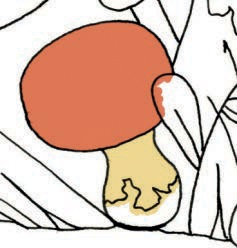

图 3-18. 现在为蘑菇帽上色

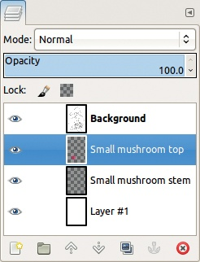

图 3-19. 每个物体一个图层

接下来，创建另一个新的透明图层，并选择距离稍近的物体：在这个例子中，可以选择蘑菇茎的底部或蘑菇帽。注意，你可以画出当前图层以上物体的线条之外，正如在图 3-18 所示。图层的数量会迅速增加，所以请为它们起有意义的名字，如在图 3-19 所示。

继续创建图层并添加颜色，直到每个物体都已定义，你拥有了一个像图 3-20 那样的基本着色绘图。

现在是时候后退一步，整体查看绘图，确保你喜欢颜色搭配的效果。如果想改变某个颜色，只需勾选相应图层的锁定 alpha 通道框（见图 3-21），选择新的颜色，并将其从前景色框拖拽到图像中。锁定框会保持每个像素的透明度不变，这样你可以只填充你已着色的区域。

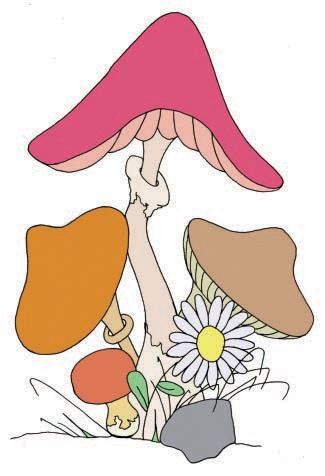

图 3-20. 添加基础颜色后

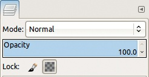

图 3-21. 锁定图层的透明度

## 阴影

现在每个物体都有颜色了，让我们为其添加一些阴影。你需要决定光源来自哪个方向。光可能来自上方，来自画中的灯光，或者来自任何你喜欢的地方。

在添加阴影之前，先合并每个物体的所有图层（**图像：图层 > 向下合并**），这样物体的阴影才会一致。例如，如果你合并了一个蘑菇的所有图层，并决定从右侧照亮它，那么你可以在左侧加上阴影，右侧加上光亮，一气呵成。

图 3-22. Dodge/Burn 工具图标

图 3-23. 使用 Dodge/Burn 为蘑菇加阴影

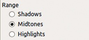

图 3-24. Dodge/Burn 工具的范围选项

现在我们准备添加阴影效果。选择减淡/加深工具（选择**图像：工具 > 绘画工具 > 减淡/加深**，或按 ，或者点击图 3-22 中所示的工具箱按钮）。在减淡模式下，这个工具增加光亮，而在加深模式下，它增加阴影。这个工具可以使不透明的区域变亮或变暗，而不会改变颜色。

在物体的面朝光源一侧进行减淡，另一侧则加深。先对较大区域进行减淡，然后在更靠近光源的较小区域再次减淡，从而创建如图 3-23 所示的渐变效果。

减淡/加深工具根据像素是被归类为暗色还是亮色，作用有所不同。RANGE 选项（图 3-24）会改变像素的分类方式。图 3-23 展示了将 RANGE 选项设置为中间色调的阴影效果，而图 3-25 则是将 RANGE 选项设置为高光时的效果。

目前添加的阴影效果较为粗糙，虽然已经大大改善了图像，但通过平滑颜色过渡，您可以让效果更好。

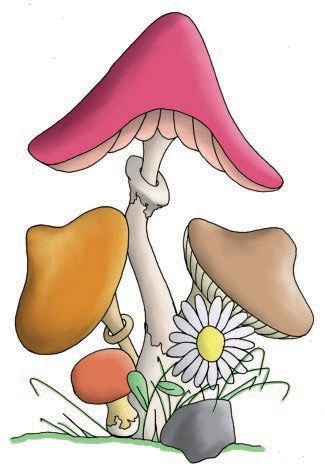

图 3-25. 设置为高光的阴影效果

图 3-26. 涂抹工具图标

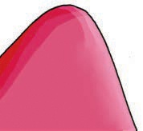

图 3-27. 使用涂抹工具平滑渐变效果

选择涂抹工具（选择**图像：工具 > 绘画工具 > 涂抹**，或按 ，或者点击图 3-26 中所示的工具箱按钮）。这个工具能够混合颜色或透明度，因此如果在物体的边缘附近进行涂抹，你将得到模糊的边缘。为了保持边缘锐利，请勾选相应图层的“锁定 alpha 通道”框（图 3-21）。涂抹后，你应该得到一个类似图 3-27 的渐变效果。

提示：首先沿着垂直于减淡线的方向进行涂抹，然后再沿着减淡线的方向进行涂抹。或者，可以使用小的圆形笔触来创建更自然的渐变效果。

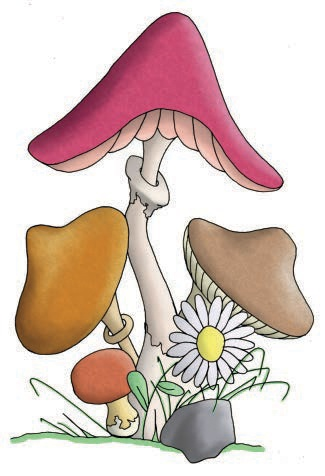

图 3-28. 添加纹理图案

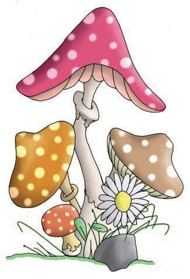

图 3-29. 添加圆点

图 3-30. 桶形填充工具选项

对图纸中的每个物体进行加深、曝光和涂抹，直到你拥有一个完全阴影的图像，就像图 3-25 中的那样。

## 收尾工作

完成阴影处理后，你可以添加一些收尾工作，比如添加图案（图 3-28），或手绘的细节，如图 3-29 中的圆点，或者任何其他你想到的内容。

要添加纹理，选择你想要修改的图层，并选择桶形填充工具。将其选项更改为图 3-30 中显示的选项：将模式设置为“叠加”（MULTIPLY），将填充类型设置为“图案填充”（PATTERN FILL），选择一个浅色图案（彩色图案会使你的颜色变化过大），并将影响区域设置为“填充整个选区”（FILL WHOLE SELECTION）。确保勾选“锁定 alpha 通道”。然后点击图像查看效果。

要添加手绘的圆点，复制其中一个蘑菇帽的图层，可以通过选择**图像：图层 > 复制图层**或**图层：右键点击 > 复制图层**，按下，或点击图层对话框按钮，如图 3-31 所示。为新图层添加图层蒙版（**图像：图层 > 蒙版 > 添加图层蒙版**），并将蒙版初始化为图层的 alpha 通道（图 3-32）。接着，清除图层内容（**图像：编辑 > 清除**或），这样你就有了一个只覆盖蘑菇帽的图层。

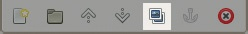

图 3-31. 图层对话框中的复制图层按钮

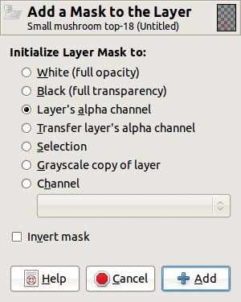

图 3-32. 初始化图层蒙版

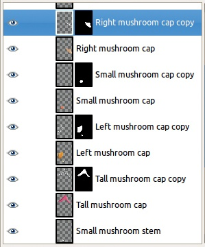

图 3-33. 每个蘑菇帽都有一个附加的图层和图层蒙版。

将图层的模式设置为 GRAIN MERGE，选择画笔工具，并将前景色设置为白色。确保这次没有勾选“锁定 Alpha 通道”，然后开始在蘑菇帽上绘制点。由于图层蒙版，你可以在蘑菇帽的边缘绘制点而不会涂到背景上，且由于 Grain Merge 模式，点的颜色将比帽子的颜色更浅。为剩余的每个蘑菇帽创建一个新图层，并在每个帽子上涂上波点（使用图层蒙版，如图 3-33 所示）。你已经完成了蘑菇上色教程。

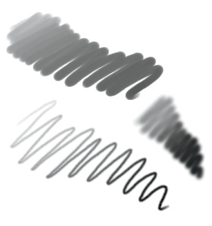

图 3-34. 画笔

# 3.2 绘画与素描

现在我们将更详细地探索一些绘画工具，但首先，关于画笔的一些说明 . . .

## 画笔

画笔与每种绘画工具一起使用，其工作原理就像现实生活中的画笔——较大的画笔一次涂抹更多的颜色，而模糊画笔会产生更柔和的边缘。图 3-34 展示了通过改变画笔可以获得的一些简单效果。然而，由于这是数字绘画，你还可以使用画笔创建一些用真实油漆不容易做到的效果。基本画笔，如`Hardness 100`和`Hardness 075`，是多功能且直观的，在本书中经常使用。

图 3-35 展示了仅使用`Hardness 100`画笔就能实现的一些创意效果。我们通过调整 SIZE、ASPECT RATIO 和 ANGLE 参数创建了一个波浪边缘。为了绘制左侧的幽灵线条，我们调整了画笔的动态设置。对于顶部的条纹线条，我们使用了渐变作为绘画颜色，并用`Random Color`画笔动态在该渐变中随机变化颜色。

图 3-35. 使用画笔的创意效果

## 铅笔工具

铅笔工具（通过**图像：工具 > 绘画工具 > 铅笔**，，或者在图 3-36 中显示的工具箱按钮访问）用硬边缘绘制自由手的线条，即使与模糊画笔一起使用，也不会包含抗锯齿效果。

*抗锯齿*通过利用视觉原理，即使在低分辨率下也能平滑边缘。油漆刷工具通过在边缘生成半透明像素来使用抗锯齿，从而产生柔和的笔触，而铅笔工具则只生成完全不透明的像素。图 3-37 显示了使用油漆刷工具（左）和铅笔工具（右）绘制的点。这些点被放大显示，以展示像素级别的抗锯齿效果。

铅笔工具在你想要精确控制每个像素变化时非常有用。例如，像素艺术通常使用铅笔工具，画笔大小设置为 1 像素（SIZE 选项设置为 1.00）。铅笔工具也适用于绘制像图标这样非常小的图像。

### 绘制图标

一些图标是在矢量图形程序中绘制的，然后缩小到最终尺寸。但小而简单的图标通常在按其预定尺寸逐像素绘制时效果更好。

图标，例如 GIMP 工具箱中代表工具的图标，通常是非常小的图像（大约 16 × 16 像素），并使用索引模式中的有限色彩调色板绘制。有限的调色板赋予图标集更统一的外观。索引模式可以通过**图像: 图像 > 模式 > 索引**来选择。

图 3-36. 铅笔工具图标

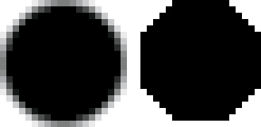

图 3-37. 油漆刷和铅笔工具绘制的点

要在像素级别进行工作，缩放到 800%（**图像: 视图 > 缩放 > 8:1**，或使用图像窗口底部的缩放下拉列表）。然而，当图像被如此剧烈地放大时，你可能会发现很难看到图标在正常缩放下的样子。

为了帮助这一点，你可以在 100% 缩放下显示图像的第二个视图（**图像: 视图 > 新视图**）。由于第二个视图非常小，为了清晰起见，可以隐藏图层边框（**图像: 视图 > 显示图层边界**）。这两种视图的示例见于图 3-38。注意，在单窗口模式下，你无法同时查看两者；你需要来回切换标签。

### 像素艺术

像素艺术是一种在像素级别上创建的数字艺术形式。老式电子游戏和许多手机游戏中的图形就是像素艺术。

再次强调，选择一个颜色调色板，在 800%的缩放级别下绘制，并且在 100%缩放时打开第二个视图是最理想的。像素艺术大致可以分为两大类：等距像素艺术和非等距像素艺术。*等距*像素艺术基于等距线，结果是一个从上方和侧面观看的 3D 物体。*非等距*像素艺术偏离这条线，生成一个从任何其他视角（如顶部、底部、侧面或正面）展示的 2D 物体。等距线如图 3-39 所示：横向 2 个像素，上升 1 个像素。

使用灰色的 1 × 1 像素网格绘制像素艺术更为简便。要查看这个网格，选择**图像：图像 > 配置网格**，然后将前景色改为灰色，宽度和高度设置为 1 像素，如图 3-40 所示。接着使用**图像：视图 > 显示网格**来显示它。

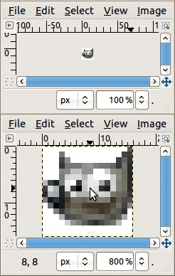

图 3-38. 使用两个视图绘制图标

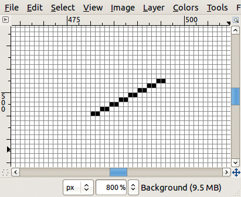

图 3-39. 等距线

你可以通过选择等距线的像素来快速构建等距网格（图 3-41）。使用矩形选择工具（**图像：工具 > 选择工具 > 矩形选择**或 ）选择网格的特定线条或部分，或者使用按颜色选择工具（**图像：工具 > 选择工具 > 按颜色选择**或 ）选择所有黑色像素。复制（**图像：编辑 > 复制**或 ）线条，粘贴（**图像：编辑 > 粘贴**或 ），并翻转（**图像：图层 > 变换 > 水平翻转**）。将此副本移动到适当位置，然后使用粘贴和水平翻转或垂直翻转来添加更多的线条。你可能需要练习，但一旦有了一个合适的网格，你就可以反复使用它。最初的等距线长度决定了网格的密度。

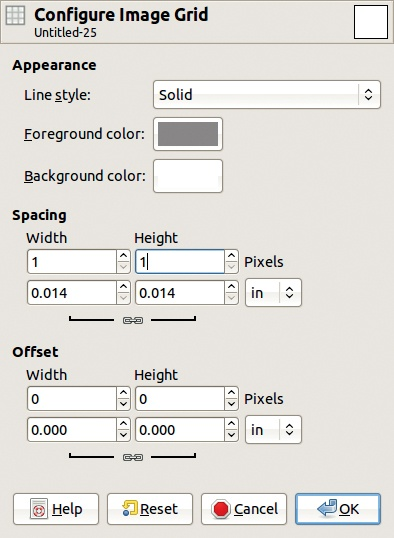

图 3-40. 网格配置

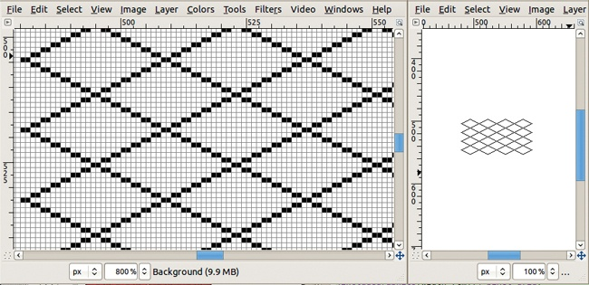

图 3-41. 等距网格

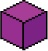

图 3-42. 等距立方体

例如，你可以使用网格来制作图 3-42 中所示的等距立方体。首先绘制两个等距方块，并用垂直线连接它们。擦除应该隐藏的像素，通过填充不同色调的相同颜色来增强三维效果，以表示阴影和光线。

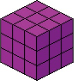

图 3-43. 创建一个更大的立方体

图 3-44. 一面砖墙

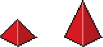

图 3-45. 金字塔

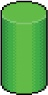

图 3-46. 一个圆柱体

你可以使用相同的网格创建一个更大的立方体，如图 3-43 所示。图 3-44 展示了一个被装饰成砖块样式的大立方体。这些砖块遵循相同的规则：水平线是等距线，垂直线与立方体的线平行。我们还为每个砖块添加了光照，并为立方体的面添加了阴影。

你可以旋转等距线来构建其他基本形状，如图 3-45 中的金字塔和图 3-46 中的圆柱体。这些形状可以组合起来构建像图 3-47 中的房子或图 3-48 中的塔。要为圆形物体添加渐变阴影，可以使用*抖动*。当类似颜色的像素交替排列时，如图 3-49 所示，它们会相互融合，看起来像是一个过渡色。你还可以添加更多细节，甚至用等距的汽车、人物或树木构建小型城镇。例如，参考 *[`sparklette.net/art/navy-open-house-ad-impressive-pixel-art/`](http://sparklette.net/art/navy-open-house-ad-impressive-pixel-art/)*。

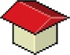

图 3-47. 一座房子

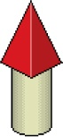

图 3-48. 一座塔

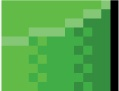

图 3-49. 圆柱细节

图 3-50. 涂鸦工具图标

## 涂鸦工具

涂鸦工具（按下  或点击图 3-50 中显示的工具箱按钮）用于带有柔和边缘的自由手绘线条。即使使用硬刷，它也会产生柔和的边缘，而使用模糊刷时，边缘会更模糊。

在数字绘画中，画笔工具主要用于两件事：绘制线条和填充区域。数字绘画的一般步骤是先草绘物体。黑色模糊的画笔非常适合草图绘制。如果线条将作为物体的轮廓保留，它们应该干净并使用相对较小的画笔大小，如图 3-51 所示。如果线条仅为草图并将被擦除，使用更大的画笔尺寸和更松散的风格，如图 3-52 所示。没有永久轮廓的绘画更具挑战性，因为在完成物体边缘时需要更加小心。

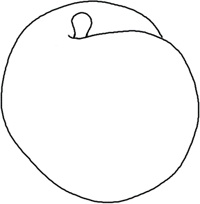

图 3-51. 绘制轮廓

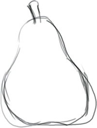

图 3-52. 绘制草图线条

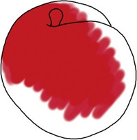

图 3-53. 填充轮廓

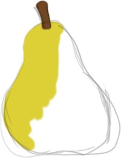

图 3-54. 填充草图

图 3-55. 气刷工具图标

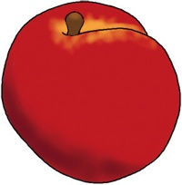

图 3-56. 使用气刷工具添加光线

你也可以使用画笔工具填充物体颜色，如图 3-53 和图 3-54 所示。你可能会将单独的物体添加到更大的画作中，比如 3.5 数字绘画过程中的景观。

## 气刷工具

气刷工具（通过**图像：工具 > 绘画工具 > 气刷**，，或图 3-55 中显示的工具箱按钮访问）用于绘制柔和的颜色区域。如果你使用图形平板和`基础动态`，不透明度将与笔压关联，因此当你轻按时，会喷出细腻的颜色雾气。每次笔触都会添加颜色，无论你是否抬起笔。此外，速度也很重要：笔移动得越慢，留下的油漆就越多。

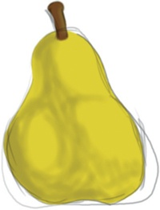

图 3-57. 使用气刷工具添加阴影

图 3-58. 墨水工具图标

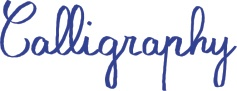

图 3-59. 传统欧洲书法

你可以使用喷枪工具添加光线（图 3-56）或阴影（图 3-57）。喷枪工具让你可以选择光线和阴影的颜色，这与加深/减淡工具不同。要平滑过渡，请参见涂抹工具。

## 墨水工具

墨水工具（通过**图像：工具 > 绘画工具 > 墨水**，，或在图 3-58 中显示的工具箱按钮）用于书法，因为它能模拟羽毛笔的效果，尤其是在使用可以感应压力和倾斜的图形板时。

对于书法，调整墨水工具选项（参见图 15-53）直到它们适合你的风格。特别是，调整角度（ANGLE）、倾斜（TILT）和速度（SPEED）的灵敏度，直到你得到想要的效果。图 3-59 是传统欧洲书法的例子，图 3-60 是日文片假名的例子。

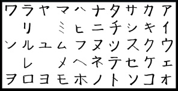

图 3-60. 日文片假名

图 3-61. 桶填充工具图标

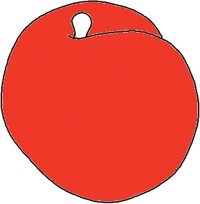

图 3-62. 用纯色填充

# 3.3 填充区域

本节介绍了用于用颜色、图案或渐变填充区域的工具。

## 桶填充工具

使用桶填充工具（**图像：工具 > 绘画工具 > 桶填充**，，或在图 3-61 中显示的工具箱按钮）可以通过点击要填充的区域或拖动前景或背景颜色并将其放到图像上来填充区域。

当你点击填充时，只有与之相连的区域会被该颜色或图案填充。这意味着线条绘图可以作为边界。例如，我们在一个桃子的线条绘图中点击，以将其填充为深橙色（图 3-62），然后填充一个旋转的图案（图 3-63）。

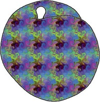

图 3-63. 用图案填充

图 3-64. 在按钮中使用渐变

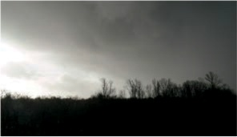

图 3-65. 原始照片，无色

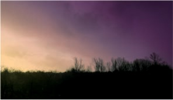

图 3-66. 一幅戏剧性的暴风雨天空

## 渐变

渐变效果在按钮背景（图 3-64）、横幅或绘图中表现良好。它们还可以为照片添加简单的阴影效果或独特的触感。

例如，我们为增强图 3-65 中的暴风雨天空的戏剧效果，添加了色彩。云前沿与地平线成对角线。我们将渐变垂直应用于云前沿，使得云层较重的区域更暗，如图 3-66 所示。

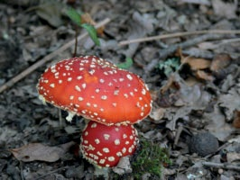

图 3-67. 蘑菇 A

图 3-68. 蘑菇 B

图 3-69. 蘑菇 C

你还可以在图层蒙版中使用渐变来创建层之间的平滑过渡。这就是我们如何将图 3-67 中的蘑菇与图 3-69 中的蘑菇结合在一起，制作出图 3-70 的效果。渐变在图层蒙版中用于黑白之间的过渡，如图 3-71 所示。白色区域是可见的，黑色区域是透明的，灰色区域则创建过渡效果。

图 3-70. 所有蘑菇融合成一个构图

图 3-71. 图层对话框，适用于图 3-70

图 3-72. 使用图案

## 图案

可以将图案应用于装饰背景，创建文本效果（如图 3-72 所示），或者让物体表面看起来更有机。有关更多细节，请参见图案对话框和图案对话框。

# 3.4 避光、烧焦和涂抹

正如我们在给桃子和梨子上色时看到的，阴影和涂抹可以极大地改善数字绘画对象的外观。减淡、烧制和涂抹是为数字艺术元素添加最后修饰的常用方法。

## 减淡/加深工具

正如你在教程中看到的，你可以使用减淡和烧制来为画作添加阴影和高光。

使用 TYPE 选项或键在减淡和加深之间切换。记住，减淡工具能提亮，烧制工具能加深。当你多次经过某个区域时，每次操作都会增强效果。

图 3-73. 第一次烧制

图 3-74. 第二次烧制

图 3-75. 第三次烧制

为了创建阴影渐变，你可以先轻轻地烧制一个大区域，然后再烧制（加深）一个较小的区域，以此类推。或者，你可以从烧制一个最暗的区域开始，然后再次烧制并扩大该区域，以此类推，如图 3-73 至图 3-75 所示。

图 3-76 和图 3-77 展示了最后两步：涂抹和减淡。

你可以只涂抹一次减淡或加深效果，然后将其与基础色融合，但效果不会那么自然。RANGE 选项改变了一层效果的强度。尽管在阴影上绘画可以让你更好地控制，但减淡/加深工具在没有太多时间或精力的情况下也能做得相当好。

图 3-76. 涂抹以柔化过渡

图 3-77. 添加了减淡效果

图 3-78. 原始照片

图 3-79. 烧制背景后

你还可以使用加深和减淡来让照片中的主题更加突出，如图 3-78 和图 3-79 所示。当你对背景进行加深或减淡时，照片的主题会更加突出。你可以使用前景选择工具（**图像：工具 > 选择工具 > 前景选择**）选中主题，反转选择，然后进行加深处理，或者你也可以使用画笔手动加深背景。

图 3-80. 不同范围值的示例

图 3-80 展示了使用三种不同范围设置进行加深和减淡的效果：**阴影**、**中间调**和**高光**。我们从一条包含四种色调的竖条开始。从上到下，色调依次是暗色、明亮且完全饱和、浅色和非常浅的色调。我们制作了 18 个该竖条的副本，将其分成 3 组。在每组内，从左到右，应用了 1 层、2 层或 3 层的加深或减淡效果。如图所示，半数组使用了加深，另一半则使用了减淡，并且分别使用了这三种范围设置。

## 涂抹工具

使用涂抹工具来软化过渡、隐藏物体，甚至创造纹理。在本章前面，我们使用涂抹工具在气刷工具中添加阴影和高光后，软化了颜色过渡，并且在上一节使用加深/减淡工具进行阴影处理后也应用了涂抹工具。

你还可以使用涂抹工具来实现微妙的颜色过渡，像传统画家一样应用不同颜色的点滴笔触并加以涂抹。从覆盖一块区域开始，密集的笔触使用一种颜色，逐渐变薄，然后在不同的区域使用不同的颜色，色彩交织。接下来，用小的圆形笔触进行涂抹。任何露出的白色背景也会融入其中，提亮该区域。继续涂抹直到整个图像完成，然后再用较大的圆圈进行涂抹，使结果更加平滑，但要小心操作。图 3-81 中的最终效果看起来很自然，因为一些不规则性得以保留。

图 3-81. 连续涂抹步骤

图 3-82. 一只华丽的怪物

你还可以使用 Smudge 工具来创造毛发、草地或其他类似的纹理。图 3-82 中的小怪物有着非常锋利的边缘。如果我们垂直于边缘进行涂抹，使用迅速而均匀的笔触，就能让小怪物看起来像是毛茸茸的，如 图 3-83 中所示。

图 3-83. 一只闪亮的毛茸茸怪物

图 3-84. 涂抹桃子

图 3-85. 涂抹梨子

图 3-86. 从天空颜色开始

图 3-87. 添加云层

图 3-84 和 图 3-85 展示了如何使用 Smudge 工具在 图 3-56 和 图 3-57 的图像中创造更平滑的过渡效果。

# 3.5 数字绘画过程

在本节中，你将有机会观察一位数字画家在 GIMP 中创作完整的风景画。虽然这不是一个跟随学习的教程，但它展示了数字画家如何计划并执行一幅中等复杂度的作品，你将看到各种实用的技巧和方法在实际操作中的应用。

## 构图

我将从创建每个风景主要部分的图层开始，按照从最远的（图 3-86 中的天空）到最近的元素（图 3-92 中的河流）顺序进行。在每个图层的初始设置时，我使用透明背景，以便背景的图层能够透过显示。在此阶段，我仅使用基本的画笔笔触来大致确定构图。我不会花太多时间在颜色上——我选择任何想到的颜色，因为我可以稍后调整它们。我也不会花很多时间去精准地绘制形状：山脉（图 3-88）是粗略的三角形，树木（图 3-91）是涂鸦。

图 3-88. 添加山脉层

图 3-89. 添加丘陵层

图 3-90. 添加草地层

图 3-91. 添加树木层

图 3-92. 添加河流层

一旦所有图层都设置好，我会通过锁定 Alpha 通道并添加新颜色来调整颜色（就像我们在给蘑菇上色时所做的那样）。我尽量通过颜色组合来捕捉一种氛围。刚开始时，找到合适的颜色组合可能会很困难，但随着练习的增多，你会发现即使在早期阶段，也能想象出这幅作品的最终效果。

接下来，我对每一层进行细化。我使用图形平板，并将“画笔动态”设置为`基本动态`，这样压力就可以控制不透明度。

## 天空和云朵

我从天空开始。使用涂抹工具中描述的技巧，我通过小幅画笔笔触（图 3-93）和圆形晕染动作（图 3-94）来使天空更为丰富。这使得平淡的天空变得更加有趣。

图 3-93. 加深天空顶部

图 3-94. 通过晕染获得更丰富的天空

图 3-95. 给云朵添加阴影

接下来，我给那些平淡的白色形状添加立体感，使它们看起来更像云朵。我锁定 Alpha 通道，在云朵底部添加灰色画笔笔触（图 3-95），并通过晕染阴影来创建柔和的过渡（图 3-96）。然后，我解锁 Alpha 通道，稍微晕染云朵的边缘，以获得那种蓬松的感觉（图 3-97）。

图 3-96. 晕染云朵的阴影

图 3-97. 将云朵的边缘晕染到天空中

图 3-98. 雪山

## 山脉

图 3-99. 暴露的泥土和岩石

图 3-100. 模糊的深色细节

图 3-101. 添加蓝色调

山脉的图层比较难处理，因为我想要雪山，但又需要将山脉和云层区分开。现在云层的底部已经有了阴影，我可以添加雪而不失去山脉的细节。我再次锁定 Alpha 通道，并用白色画笔涂抹，阳光照射的地方按得更重，其他地方则轻一些（图 3-98）。这次，画笔涂抹效果很好，所以我不打算涂抹它们。为了让山脉更加生动，我想在雪融化或者无法到达的地方加上一些深色区域。我使用**叠加**模式来保持我刚刚定义的光照效果（图 3-99）。我将这些区域随意涂抹，给它们一种自然的艺术感（图 3-100）。最后，我给雪山加了一些轻微的蓝色调，使其看起来更真实（图 3-101）。

图 3-102. 给丘陵添加光线

图 3-103. 柔化

## 丘陵

丘陵只需要一些合适的纹理，看起来像草地丘陵。我先使用减淡/加深工具设置为**高光范围**来给丘陵加光（图 3-102）。丘陵的颜色比较深，所以我使用了几层涂层，得到了所示的效果。然后，我用涂抹工具（图 3-103）将结果进行平滑处理。

我会给丘陵加些噪声，使它们看起来不那么光滑和光秃。我尝试了**图像：滤镜 > 噪声**菜单中的一些滤镜，发现其中一个，**图像：滤镜 > 噪声 > RGB 噪声**，能得到我想要的效果，所以我使用默认参数应用它（图 3-104），并得到图 3-105 所示的结果。

图 3-104. RGB 噪声对话框

图 3-105. 添加噪声

## 草原

首先，我想在山丘和草原之间创建一个柔和的过渡。我从选择一个垂直渐变开始，渐变从山丘的深绿色到草地的中绿色。锁定 Alpha 通道后，我将渐变应用于草原的顶部到草原的中部。图 3-106 显示了结果。然后，我解锁 Alpha 通道，并用涂抹工具改善两层之间的过渡。我还平滑了草原中由渐变产生的任何接缝。涂抹过的渐变如图 3-107 所示。

图 3-106. 渐变过渡

图 3-107. 模糊渐变

图 3-108. 添加噪声

我决定使用与山丘一样有效的滤镜来为草原添加纹理：**图像: 滤镜 > 噪声 > RGB 噪声**。结果如图 3-108 所示，正如我预期的那样，但山丘和草原之间的过渡现在太微妙了。这次，我想加重过渡效果。我使用橡皮擦工具去除一些之前做过的涂抹，露出更多山丘的深色基底。当我对过渡效果满意时，我停下来（见图 3-109）。

图 3-109. 标记边缘

图 3-110. 缩放图层对话框

## 树木

在绘制背景时，树木的某些地方开始困扰我。它们不仅仅是难看的涂鸦；它们似乎与构图不太搭配。我首先需要弄清楚是什么让我不安，然后才能修复它。是颜色问题（对于画作的氛围来说太暗了）？还是位置问题？也许是大小？对了，问题就在这里：与其他景物相比，树木显得太小。

快速的图层转换验证了我的怀疑。我选择**图像: 图层 > 缩放图层**，解锁链条，选择 150%的高度和 100%的宽度（见图 3-110），这样树木变得更高，但不更宽。我的直觉是对的，在擦除了一些最底部的树干后，我得到了图 3-111，这是一个更好的构图。

图 3-111. 让树木长高

图 3-112. 树皮和根部

现在，我想让这些树看起来不像乱涂乱画。我从树干开始，最后处理树叶，因为树叶位于树干上面。

我在树干上添加垂直笔触，给人一种树皮的印象。我使用喷枪工具来获得自然效果，在阴面添加深棕色线条，在阳面添加浅色线条。前面的树应该比远处的树有更多对比度，因为远处的颜色会与背景融合。每次添加阴影时，我确保山脉、山丘和树木的阴面是一致的。

我使用涂抹工具创建树根，从树的根部垂直地画到草丛里。最近的树根应该更加详细，而远处的树只需要几笔。结果如图 3-112 所示。

图 3-113. 一片叶子

图 3-114. 旋转的叶子

图 3-115. 另存为画笔管

对于树叶，我创建了自己的动画叶子画笔。我首先在一个相对较大的画布上绘制叶子（200 × 200 足够大），并轻轻地填充颜色。我用灰度绘制叶子，这样画笔就可以选取前景色。结果如图 3-113 所示。

然后，我为动画画笔创建一个新的图像（1600 × 200），并将叶子复制并旋转八次，如图 3-114 所示。（第二十二章详细介绍了动画画笔。）我从新画笔中去除了白色，并设置成任何颜色都可以替换黑色像素（**图像：颜色 > 颜色到透明**），然后我以 GIMP 动画画笔格式导出画笔，并使用图 3-115 中显示的选项。

图 3-116. 叶子

图 3-117. 带深度的叶子

当我刷新画笔对话框时，我的新画笔出现了。我选择它，选取画笔工具，并选择`随机颜色`的画笔动态设置。我选择一个绿色渐变（一个叫做`Greens`的在中间），更改画笔间距以发挥出渐变的全部潜力，然后开始绘画进行实验。200 × 200 像素的叶子对这幅画来说有点太大了，所以我调整了画笔的大小，使其变小。当我将其调整得太小时，叶子就几乎无法辨认了。100 × 100 的大小最适合。我用叶子覆盖了树木，如图 3-116 所示，让一些棕色的草图透出来作为树枝。

接下来，我想给树木增添一些深度，以便区分近处树木的树叶和远处树木的树叶。我用相同的画笔和相同的渐变涂抹叶子，但设置模式为仅高光时使用“加亮”，仅阴影时使用“加深”模式，如图 3-117 所示。

图 3-118. 河岸

图 3-119. 水位线平滑

## 河流

接下来是最后一个元素：河流。目前，它平坦地躺在草地上，但我会通过添加河岸来修正这一点。我将在新图层上绘制河岸，使用颜色渐变来增加细节。我通过定义新的画笔动态，将颜色与渐变消退关联来实现这一点。我通过反复试验选择渐变的消退长度。渐变的前景色和背景色应该尽量接近，这样渐变效果不会太刺眼。我用小的垂直笔触画出河岸，沿着河流的弯曲绘制，如图 3-118 所示。

水位线应该保持平直，因此我用模糊画笔擦除河岸的底部，结果如图 3-119 所示。

我通过在河岸上绘制半透明渐变来增加体积。我首先锁定 Alpha 通道，以保持渐变在河岸上。我选择一种深色、混合工具和 `FG to` `Transparent` 渐变。每次笔触从河岸上方开始，跨过河岸，最终在水位线处结束。现在河岸变暗了，一些瑕疵变得明显，因此我解锁了 Alpha 通道并修正它们，使用涂抹工具填补空洞，用橡皮擦工具清理水位线。当前结果如图 3-120 所示。

图 3-120. 添加河岸渐变

图 3-121. 草叶延伸至河岸

草地应该沿着河岸边缘弯曲，因此我用涂抹工具画草叶。我在河的另一边做了同样的处理，如图 3-121 所示。

这条河流看起来仍然很平坦，所以我将添加一些细节。我把远岸的部分烧掉，放入阴影中，并用长而柔软的笔触喷涂出水流，正如在图 3-122 中所示。完成绘画后的图层对话框状态如图 3-123 所示。最终的画作以完整大小显示在图 3-124 中。

图 3-122. 添加水流后

图 3-123. 完成绘画的图层对话框

# 3.6 绘制形状

GIMP 没有任何形状绘制工具：没有矩形工具，没有圆形工具，什么都没有。那么这是否意味着在 GIMP 中绘制一个干净的矩形是不可能的？当然不是！实际上，绘制形状非常简单。

## 绘制直线

你可以通过按  来用任何绘图工具绘制直线。你必须先用工具绘制一些东西（一个小点也可以）。绘制后，按 ，你会看到从点（或你绘制的任何东西）到指针之间延伸出一条线段（图 3-125）。如果点击，这条线就会被绘制出来。

图 3-124. 完成的画作

由于你可以使用这种方法与克隆工具、橡皮工具或任何其他绘图工具绘制直线，你可以得到的不仅仅是普通的线条。这是一种非常多用途的技巧。

## 绘制椭圆和矩形

如果你想在 GIMP 中绘制一个基本形状，但又不想逐行绘制，你可以使用选区工具。有几种方法可供选择。要绘制一个圆形，可以尝试以下技巧：

+   用椭圆选框工具绘制一个圆形选区（**图像：工具 > 选择工具 > 椭圆选框**或 ）。要绘制一个实心圆，填充颜色或图案，或者使用桶形填充工具。要绘制一个环形，可以将选区转化为 1 像素或 2 像素的边框，使用**图像：选择 > 边框**，然后填充结果选区。

+   绘制一个圆形选区，然后用**图像：编辑 > 描边选区**来描边。描边选区对话框允许你选择多种绘图工具，并模拟它们的绘画动态，具体说明见使用路径。

    

    图 3-125. 绘制直线

    

    图 3-126. 带有细节的图案化圆形

+   绘制一个圆形选择区域。将选择区域转换为路径（**图片：选择 > 转换为路径**），然后使用 **路径：右键点击 > 描摹路径** 沿路径绘制。描摹路径与描摹选择类似，你还可以对路径进行进一步的变换。

+   绘制一个圆形选择区域。创建一个新的透明图层，并在其中填充颜色或图案。将选择区域缩小 1 或 2 像素，然后删除新选择区域中的内容 ()。

你也可以通过使用矩形选择工具来绘制矩形（**图片：工具 > 选择工具 > 矩形选择** 或 ）。

图 3-126 和 图 3-127 是使用这些方法在 GIMP 中绘制的形状示例。

图 3-127. 带虚线边框的普通矩形

图 3-128. 一条鸭子形状的路径

图 3-129. 鸭子的线条图

## 绘制复杂形状

你可以使用路径工具（**图片：工具 > 路径** 或 ）绘制更复杂的形状或制作线条画（参见 图 3-128）。然后你可以使用 **路径：右键点击 > 描摹路径** 来描摹路径。如果你的图形由多个路径组成，你需要一个一个地描摹它们，就像我们在制作 图 3-129 时做的那样。

路径工具对于描摹现有图像也很有用（参见 图 3-130）。在 图 3-131 中，我们隐藏了锚点，以更清楚地展示描摹过程。图 3-132 显示了用墨水工具描摹此路径的结果。

图 3-130. 使用路径工具描摹照片

图 3-131. 隐藏锚点后的结果路径

图 3-132. 用墨水工具描绘路径的结果

你还可以使用 GIMP 中的 Gfig（**图像：滤镜 > 渲染 > Gfig**）绘制几何形状，详细介绍见第十七章。

# 3.7 练习

**练习 3.1.** 使用画笔工具绘制一个简单的卡通角色。如果你有绘图板，请使用它。绘制干净、实心的线条。

**练习 3.2.** 给你的画作上色（如果你跳过了第一项练习，可以找一些干净的线稿）。参考 3.1 教程：为画作上色，了解如何设置线稿图层以及它应该使用的模式。为你的角色添加实色区域。

**练习 3.3.** 现在尝试使用 Dodge/Burn 工具为角色的一部分添加阴影，然后使用喷枪工具为另一部分添加阴影。使用你偏好的方法为其余部分的卡通角色添加阴影。

**练习 3.4.** 使用涂抹工具混合阴影。如果你的角色有头发或毛发，使用涂抹工具添加它们。

**练习 3.5.** 使用墨水工具签署你的作品，并通过实验不同的选项，直到你的签名看起来合适为止。
