# 第四章：标志与纹理

标志是任何网页、广告或信头的重要部分。GIMP 是一个非常优秀的标志设计工具。事实上，许多内置的标志插件可以在**图像：文件 > 创建 > 标志**下找到。它们非常直观，因此我们在本书中不会详细介绍。

除了标志外，本章还讨论了纹理，因为纹理是标志设计的重要组成部分。许多相同的技巧对标志设计和纹理创建都很有效。在接下来的教程中，我们将展示这一点，你将创建一个纹理，并将其用作标志的基础。

# 4.1 教程：制作行李标签

首先，你将创建一个模拟皮革的纹理，然后用文字进行浮雕效果。最终的作品将是“Mr. Gimp Junior”的行李标签。

创建一个新图像（**图像：文件 > 新建**，或按下 ）。选择 400 × 250 作为大小，RGB 作为图像类型，并使用默认背景色（即白色）。

用 Hurl 噪声填充该图像。选择**图像：滤镜 > 噪声 > Hurl**，这将打开图 4-1 中的对话框。将 RANDOMIZATION 滑块调整到 60%（可以尝试使用鼠标滚轮）。将 REPEAT 滑块保持在默认值 1。点击“确定”。你会得到类似图 4-2 的效果。

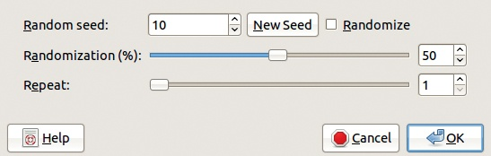

图 4-1. Hurl 对话框

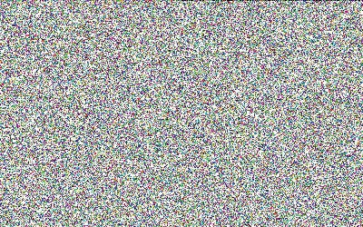

图 4-2. 应用 Hurl 工具后

现在选择**图像：滤镜 > 扭曲 > 马赛克**。选择图 4-3 中显示的参数（即，TILING PRIMITIVES 选择八边形和正方形，TILE SIZE 设置为 10.0）。当然，你可以稍后尝试其他值，但现在请跟随我们一起操作。

在图 4-4 中看到的结果，隐约有些像皮革，但马赛克效果过于显著。再次选择 Hurl 滤镜，但这次将 RANDOMIZATION 设置为 40%。在图 4-5 中，马赛克效果更为柔和，但颜色仍然不够逼真。

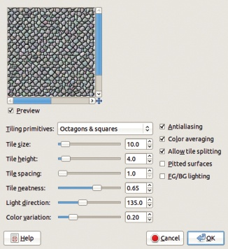

图 4-3. 马赛克对话框

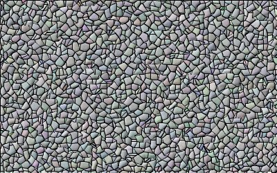

图 4-4. 应用马赛克滤镜后

选择两种棕色——较深的作为前景色，较浅的作为背景色。我们选择了 8c6434 和 a29d89。临时选择混合工具 () 并检查工具选项是否如 图 4-6 中所示设置（即从前景到背景的线性渐变，没有重复）。

现在应用**图像：颜色 > 映射 > 渐变映射**工具。该工具会立即生效，不会弹出任何对话框。你已经在混合工具中设置了选项。结果显示在 图 4-7 中。注意，前景色应用于图像的凹陷部分，背景色应用于凸起部分。

但图像缺乏浮雕效果。添加浮雕效果的最佳工具是**图像：滤镜 > 映射 > Bump Map**滤镜。在图 4-8 中显示的对话框中，浮雕效果是错误的，因为通道显示为凸起，而凸起部分显示为凹陷。这是因为光源来自下方，这是由 AZIMUTH 值决定的。该参数分配光源方向：0 表示来自右侧，90 表示来自上方，180 表示来自左侧，220 表示来自下方。选择 135，使光源来自左上方。按图中所示设置其他参数。点击 OK，应该可以看到图 4-9。

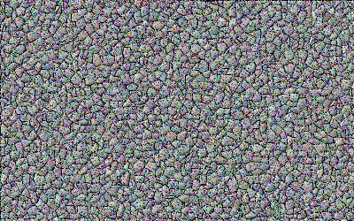

图 4-5. 再次应用 Hurl 滤镜后

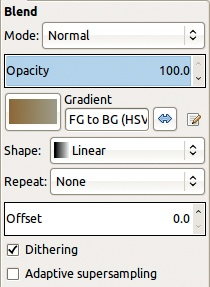

图 4-6. 混合工具选项

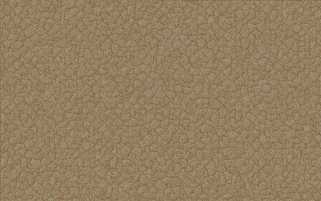

图 4-7. 应用渐变映射工具后

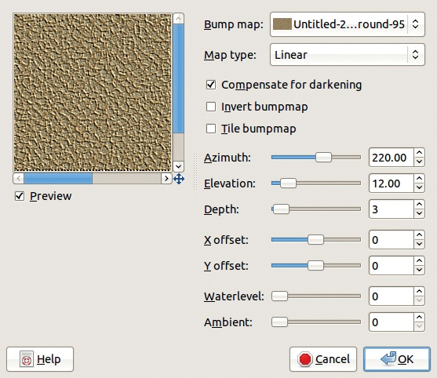

图 4-8. Bump Map 对话框

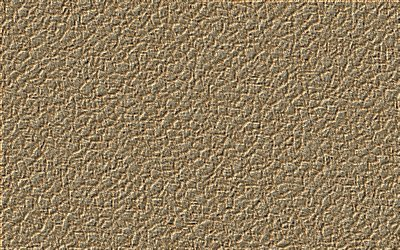

图 4-9. 应用 Bump Map 滤镜后

我们使用的下一个工具是文本工具 ()。它的选项显示在 图 4-10 中。将前景色设置为黑色，并选择一种粗体字体和较大的字体大小。我们选择了 50 像素，这对于这个例子来说效果很好。

一旦设置好选项，点击刚创建的皮革纹理的左上角。输入*Mr. Gimp Junior*——或者如果你更喜欢，可以输入你自己的名字。文本会以合适的大小出现在图像中，位于背景之上的新透明图层中。在图 4-11 中，可以看到新图层的边界。

现在复制文本图层。注意，复制的图层保持文本图层的特殊属性。确保选中复制的图层，然后选择 **图像：滤镜 > 模糊 > 高斯模糊** 滤镜。在 图 4-12 所示的对话框中，设置两个半径值为 5.0。模糊方法在这里无关紧要。点击确定。

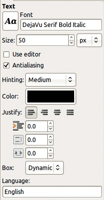

图 4-10. 文本工具选项

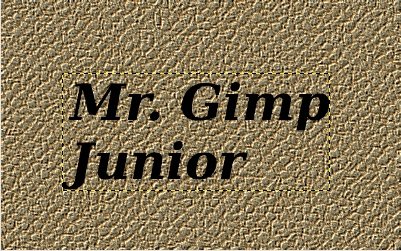

图 4-11. 输入文本后的效果

现在创建一个填充为白色的新图层（图层对话框底部的左侧按钮）。将此图层移到模糊文本图层的下方（图层对话框中的向下箭头按钮）。将模糊文本图层与白色图层合并（右键点击图层对话框中模糊文本图层的行，选择“向下合并”）。隐藏两个文本图层（点击图层对话框中它们缩略图旁的眼睛图标）。选择背景图层（点击其缩略图）。

图 4-12. 高斯模糊对话框

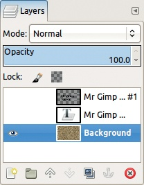

图 4-13. 图层对话框

图层对话框现在应显示为 图 4-13 所示。选择 **图像：滤镜 > 映射 > 凹凸贴图**。在凹凸贴图菜单中，选择模糊文本图层作为贴图。水位应设置为大约 80。可以保持其他参数值不变，或进行调整。注意，在方位角为 135 时，文本被雕刻在皮革上，而在方位角为 225 时，文本呈浮雕效果。点击确定，得到 图 4-14 所示的图像。

这个结果仍然需要一些改进。选择最初的文本图层，并使其可见（点击图层行中的眼睛图标）。右键点击该图层行，并选择“Alpha 到选择区”。由于该图层的背景是透明的，你将得到围绕文本的完美选区。将此选区收缩 1 像素（**图像：选择 > 收缩**）。

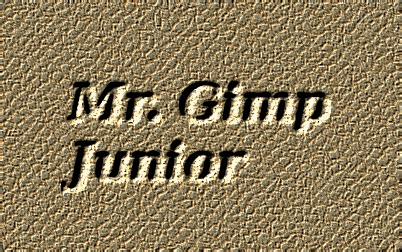

图 4-14. 雕刻文本后的效果

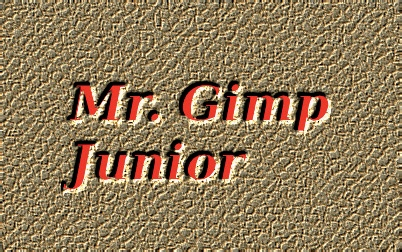

图 4-15. 照亮文本后的效果

在图层对话框中，隐藏文本图层并选择皮革背景。选择明亮的红色作为前景色，并使用  填充选区。最后，使用  去除选区。你将得到如 图 4-15 所示的最终结果。

你可以通过添加倒角（**图像：滤镜 > 装饰 > 添加倒角**）、减少标签周围的皮革部分、在角落打孔等方式完成标签的设计。我们将这些可选的装饰留给你自己去决定。

# 4.2 纹理

正如你在前面的教程中看到的，创建徽标通常需要先创建一个纹理。GIMP 提供的图案可以作为纹理使用。你可以在图案对话框中浏览这些图案，图案对话框最初位于图层对话框下方。但你可选择的图案不多，而且尺寸相对较小。你可以在线找到更多的图案和纹理，但自己制作一个并不难，而且你会发现，制作出你所需要的纹理，正如你所希望的那样，通常会更快。

本节中，我们将介绍平铺技术，它允许通过重复较小的图像并将边缘融合在一起，填充一个无限大的区域。接下来，我们将简要介绍 GIMP 中可用于创建新纹理的工具。最后，我们将演示这些工具，以便你能快速使用它们创建自己的纹理。

## 平铺

如果一个图案是*可平铺的*，意味着你可以使用它来填充任意大小和形状的区域，且图案的拼接处不会有明显的接缝。

在 GIMP 中，许多（但不是所有）预定义的图案都是可平铺的。例如，`蓝色方块`图案是可平铺的，但`紫水晶`图案则不是。要查看图案名称，可以通过点击图案对话框右上角的三角按钮，打开下拉菜单，然后选择“按列表查看”。

有时候，即使一个图案是可平铺的且没有明显的接缝，重复的效果仍然非常明显。例如，`巧克力漩涡`图案明显有重复。这部分是因为它的尺寸较小，仅为 50 × 50 像素。尽管`蓝色网格`图案只有 64 × 64，它的重复性并不那么明显，因为它没有简单的几何形状。`Nops`图案没有简单的几何形状，且大小为 128 × 128，因此它可以无缝地填充大面积区域。

如果你想用纹理填充一个大面积的区域，通常不建议将纹理制作得和目标区域一样大。尤其是当你想填充网页背景时，这一点尤其重要。不仅因为区域较大，而且通常你无法预测其大小，因为这取决于浏览器窗口的大小。当然，如果纹理是路面，看到图案之间的接缝是没问题的。另一方面，如果纹理是草地或水面，你肯定不希望看到接缝。

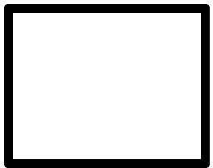

图 4-16. 原始图案

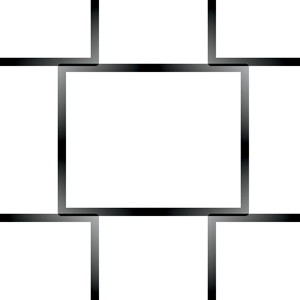

图 4-17. 应用“无缝”滤镜后的效果

### 无缝滤镜

GIMP 有一个工具，可以轻松创建可拼接的图像。我们在一个简单的几何形状上演示。创建一个新的 400 × 400 图像，背景为白色。使用矩形选择工具（），选择一个 250 × 200 的矩形，位于图像的中央。使用**图像：选择 > 边框**，创建一个宽度为 5 像素的边框。最后，将这个边框填充为黑色，并移除选择（）。你可以在图 4-16 中看到结果。

这个非常简单的图块不会形成一个好的图案。通过应用“无缝化”滤镜（**图像：滤镜 > 映射 > 无缝化**）（该滤镜没有参数，立即生效），你可以得到图 4-17。矩形被切割成四部分，并复制到图像的四个角落。同时，也应用了渐变，尽管在这种情况下，由于背景是白色的，几乎没有什么变化。

为了检查结果，调用**图像：滤镜 > 映射 > 小图块**。结果显示在图 4-18 中。原始图像已缩小一半，并复制了四次。这张图像显然可以无缝拼接，图案也出奇地有趣。

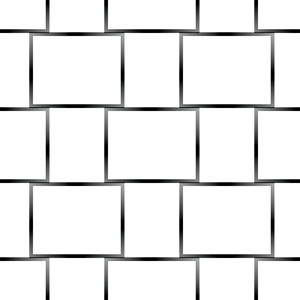

图 4-18。检查结果是否可以无缝拼接

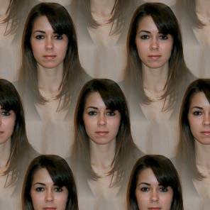

图 4-19。另一张可以无缝拼接的图像

在之前的示例中，"无缝化"滤镜效果很好。如果原始图像更复杂，情况就不一定如此。正确的起始图像可以生成一个相当好的图案，如图 4-19 所示，但这是例外，而不是规则。要从复杂的图像中创建一个令人愉悦的图案，你首先需要使用 GIMP 中的其他工具对图像进行编辑。

### 生成可拼接图像的其他滤镜

HSV 和 RGB 噪声滤镜（**图像：滤镜 > 噪声**）可以自动生成简单的可拼接图案。让我们试试看：

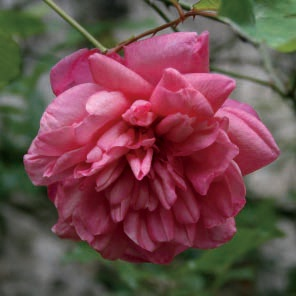

图 4-20。原始图像

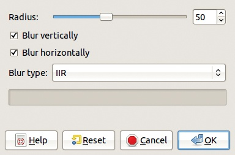

图 4-21。可拼接模糊对话框

1.  创建一个任意大小的新图像。

1.  选择**图像：滤镜 > 噪声 > RGB 噪声**，并保持所有参数不变。

1.  调用**图像：滤镜 > 映射 > 小图块**，观察结果。

你还可以使用**图像：滤镜 > 渲染 > 云彩 > 固体噪声**滤镜来创建可平铺的图像。勾选 TILABLE 按钮，完成。

若要从现有图像创建平铺纹理，你可以使用**图像：滤镜 > 模糊 > 可平铺模糊**滤镜，它会合并并模糊图像的边缘，使其可平铺。该滤镜还会模糊图像的其他部分，但你可以修复它。

我们可以尝试用图 4-20 中的图像。复制该图层并对副本进行操作。选择可平铺模糊滤镜，打开图 4-21 所示的对话框。将 RADIUS 值设置为 20（“Radius”在此与高斯模糊滤镜中的含义相同），然后点击确定。使用这个模糊的顶层图层创建一个边框：

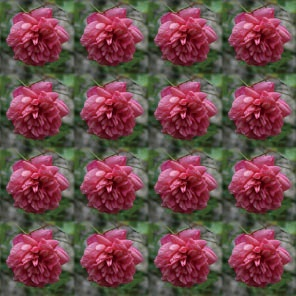

图 4-22. 最终纹理

1.  为这个图层添加 Alpha 通道。

1.  选择整个图像（）。

1.  将选区缩小 200 像素（**图像：选择 > 缩小**）。

1.  将选区羽化 100 像素（**图像：选择 > 羽化**）。

1.  剪切选区（），并丢弃它（）。

1.  合并这两层（**图层：右键点击 > 向下合并**）。

通过选择“小图块”滤镜，得到最终效果，如图 4-22 所示。

## 创建纹理

在接下来的章节中，我们将展示不同的纹理构建方法。首先，我们演示如何从背景开始，然后简要介绍一些有用的工具。之后，我们将带领你创建各种图案。

### 构建背景

首先，创建背景。你可以使用现有的图像，或者使用第三章中介绍的绘图工具来构建，或者使用滤镜自动生成背景。**图像：滤镜 > 噪声**菜单提供了几个表面填充滤镜：HSV 噪声、HURL 和 RGB 噪声都能生成不错的背景纹理。该菜单中的其他三个滤镜也能起作用，但你需要从现有的图像开始。**图像：滤镜 > 渲染**菜单列出了生成更复杂背景的工具。以一个新的空白图像为起点，尝试以下操作：

+   应用**云彩 > 等离子**来生成彩色纹理。

+   应用**云彩 > 固体噪声**来生成单色的凹凸纹理，且可以平铺。

+   应用**图案 > 棋盘格**来生成黑白棋盘格。

+   应用**图案 > 迷宫**来生成一个可以平铺的迷宫。

在**图像：滤镜 > 艺术效果**菜单中，你会找到与**图像：滤镜 > 渲染**菜单中类似的工具。这些工具中的三个可以生成不错的纹理背景。尝试使用这些滤镜：

+   应用**> 应用画布**和**> 布料化**，这两者都会生成可平铺的、类似布料的纹理。

+   应用**> 编织**，它在叠加模式下添加了一个新图层，包含类似藤编的可平铺纹理。

当然，你可以使用填充工具来创建背景。使用油漆桶填充工具与现有图案或使用混合工具与众多可用渐变、形状或重复模式之一。

### 转换背景

一旦你有了一个背景，下一步就是对其进行变换。**图像：滤镜**菜单是一个金矿。

最有用的子菜单之一是**图像：滤镜 > 模糊**。通常，在对图像进行浮雕或凹凸处理之前，会先应用模糊来创建浮雕的边缘。

如果你想扭曲初始背景怎么办？如果是的话，**图像：滤镜 > 扭曲**子菜单提供了必要的工具，包括**浮雕**、**马赛克**、**波纹**和**旋转与挤压**。我们将在接下来的部分尝试其中的一些。

**图像：滤镜 > 光影**子菜单包含一些有用的工具，但其中只有一个对创建纹理有用：**玻璃瓷砖**滤镜。**图像：滤镜 > 艺术效果**子菜单中的工具对纹理构建也很有帮助。试试**油画化**滤镜和常被称为“纹理瑞士军刀”的**GIMPressionist**。有关 GIMPressionist 的更多信息，请参见 GIMPressionist。

浮雕和凹凸工具，能够为纹理添加浮雕效果，分布在多个滤镜子菜单中：

+   **浮雕**和**雕刻**位于**图像：滤镜 > 扭曲**。

+   **光照效果**位于**图像：滤镜 > 光影**。

+   **凹凸贴图**位于**图像：滤镜 > 映射**。

### 其他纹理工具

其他几种 GIMP 工具可以用来改善纹理并赋予其独特外观：

+   创建一个包含多个图层的纹理，并使用除 NORMAL 之外的混合模式。你将在接下来的几个例子中看到这一点。

+   使用**图像：颜色**中的工具调整颜色和色彩平衡。**自动**子菜单包含无需任何参数的自动调整工具。**映射**子菜单包含几个更强大的工具。

+   在许多情况下，复制当前图层并进行修改是有益的。例如，你可以对新图层添加高斯模糊或噪声，然后通过在图层对话框中选择混合模式将图层合并。

+   模糊选择工具和按颜色选择工具可以用来从自动生成的图案（如等离子体）中生成狂野的图案。这就是 Scott 效果的基本思想，它用于生成自然看起来的老化表面。

+   最后，使用普通工具以不寻常的方式创建一些非常特殊的效果。例如，试着对宽度为 1 像素的图像应用螺旋渐变，然后放大图像。

## 使用混合工具

混合工具非常有用，可以轻松创建纹理。

你可以更改四个主要参数：混合模式、渐变、渐变形状以及是否重复。通过改变绘制的起始和停止点，你也可以影响结果。这个工具能够生成无数种纹理——仅受想象力的限制！

我们会引导你完成一些可能的变化，然后集中讲解一个特定且壮观的效果。我们每次测试都从一个新的 400 × 250 图像开始，但你可以使用任何大小的图像。请注意，使用混合工具产生的纹理不能平铺，所以你只能使用混合工具填充与起始图像大小相同的区域。但有些参数组合需要较大的计算能力，且随着图像尺寸增大，计算量也会增加。

首先，将前景色和背景色重置为默认值（）。然后，使用工具选项右下角的黄色箭头按钮，将混合工具选项重置为默认值：渐变应该是黑到白，形状应为线性，重复应设置为无，模式应为 NORMAL。

### 一些简单的混合效果

在图 4-23 中的壮观效果可以通过仅两步完成：

1.  将渐变形状更改为螺旋。

1.  点击图像中心，尽量少移动鼠标：理想的移动距离为 1 像素。

    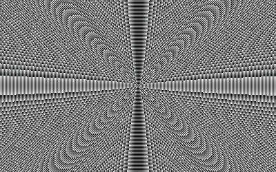

    图 4-23。用非常短的鼠标移动创建的螺旋渐变

    为了简化操作，可以将图像放大到 400%或 800%。

如果你的结果看起来更像螺旋形状，说明你移动了鼠标太远。请进一步放大并重新尝试。

这种效果发生的原因是像素仅提供了构建的复杂形状的近似值。你可以通过选择其他渐变或更改前景和背景色（如果选择了前景到背景的渐变之一）来生成这种效果的变化。

通过更改混合和重复模式，可以创造其他有趣的效果。要查看更改混合模式的效果，可以多次应用混合工具。在正常混合模式下，新混合会直接替换旧的。其他混合模式允许你混合图层，创建新的复合效果。重复模式改变了当你应用一个比画布短的渐变时，颜色的重复模式。为了查看效果，创建两个新的图像。选择径向形状，将渐变设置为一些丰富多彩的选项，比如饱和度全满的渐变，并分别使用锯齿波和三角波，在每个空白图像上绘制一个短渐变。

你还可以使用重复模式来产生有趣的灰度模式。我们生成了图 4-24，其方法如下：

1.  从默认设置开始，我们将混合模式更改为“叠加”。

1.  我们将重复模式更改为三角波。

    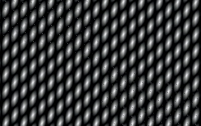

    图 4-24. 叠加混合模式下的重复三角波

    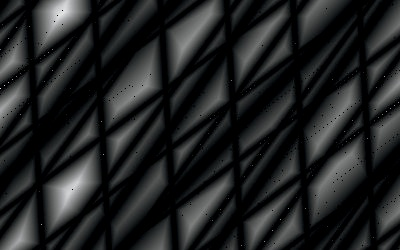

    图 4-25. 仅暗化混合模式下的三角波重复模式

1.  我们在图像上画了两条非常短的垂直笔触。

一个令人惊讶的副作用是，如果你足够幸运并找到了正确的笔触组合，这个纹理是可以平铺的！

图 4-25 展示了在混合模式设置为“仅暗化”且重复模式设置为三角波的情况下，随机方向绘制的六七个笔触的结果。

### 差异混合模式

你可以使用差异混合模式来实现有趣的效果。在这种模式下，Blend 工具绘制的每个像素都会与现有的像素混合。新像素的值是两个像素之间差值的绝对值。因此，暗色像素变亮，亮色像素变暗。

当你绘制许多交错的笔触时，这种模式会产生最有趣的结果。长笔触通常比短笔触效果更好。图 4-26 是使用几条长的随机笔触和三角波重复模式创建的。我们将这个模式作为接下来两种纹理的基础。

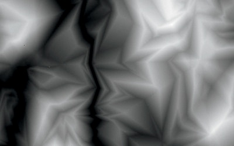

图 4-26. 差异混合模式下的长笔触

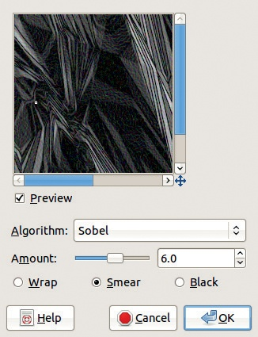

图 4-27. 边缘检测对话框

### 使用边缘检测

选择**图像：滤镜 > 边缘检测 > 边缘**。在弹出的对话框中，选择图 4-27 所示的选项和值。点击确认，然后使用**图像：颜色 > 色彩平衡**工具给纹理上色（图 4-28）。

### 一块丝绸

下一个纹理生成起来更为复杂。首先，对图 4-26 中的纹理应用半径为 25 的高斯模糊（**图像：滤镜 > 模糊 > 高斯模糊**）。然后使用边缘滤镜，如同上一个例子，但值设置为 2。结果非常暗，因此使用**图像：颜色 > 反相**将其反转。

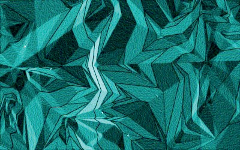

图 4-28. 边缘检测和上色后的效果

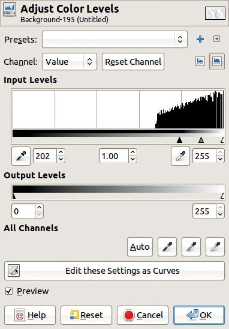

图 4-29. 色阶对话框

为了调整纹理的对比度，选择**图像：颜色 > 色阶**工具，并调整输入色阶区域中的左侧三角形，如图 4-29 所示。我们的结果如图 4-30 所示。

我们可以在此停止，但我们想在完成这个纹理之前再做一些细微的调整。例如，添加一个新的中灰色图层，颜色为十六进制的 808080。然后选择**图像：滤镜 > 噪声 > RGB 噪声**，取消勾选独立 RGB 框，并将三种颜色设置为 0.2。接下来，应用**图像：滤镜 > 模糊 > 运动模糊**，并设置图 4-31 中显示的参数。

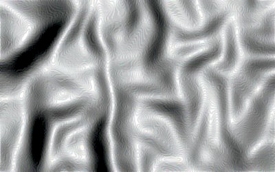

图 4-30. 执行前四个操作后

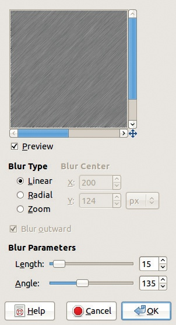

图 4-31. 运动模糊对话框

应用**图像：滤镜 > 映射 > 位移**，使用图 4-32 中显示的参数，然后将混合模式更改为叠加。合并图层后，你将得到图 4-33。接下来，你可以通过选择例如**图像：颜色 > 色彩平衡**来对纹理进行上色。

### 垂挂窗帘

使用差值混合模式和三角波重复模式（见图 4-34）用混合工具构建一个新纹理。添加一个透明图层，并选择**图像：滤镜 > 渲染 > 云雾 > 等离子**。将湍流设置为最大值 7.0。然后用半径为 10.0 的高斯模糊对该图层进行模糊处理（见图 4-35）。

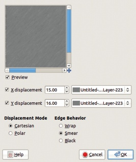

图 4-32. 位移对话框

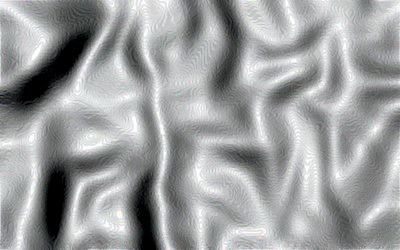

图 4-33. 合并两层后的效果

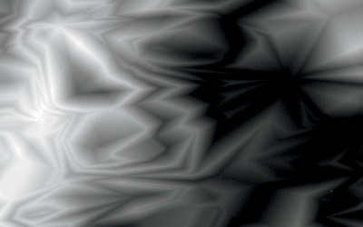

图 4-34. 新的起始纹理

然后选择**图像：滤镜 > 扭曲 > IWarp**。将变形半径设置为 50，使用逆时针 SWIRL 和顺时针 SWIRL 变形模式添加一些漩涡效果（图 4-36）。

现在应用**图像：滤镜 > 艺术效果 > 油画**，蒙版大小设为 15，然后应用**图像：滤镜 > 艺术效果 > 立体主义**，瓷砖大小设为 10，再次应用油画效果（图 4-37）。应用**图像：滤镜 > 边缘检测 > 边缘**，设置强度为 10，结果如图 4-38。

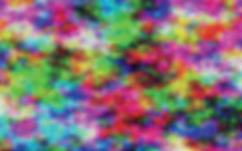

图 4-35. 应用等离子体和高斯模糊滤镜后的效果

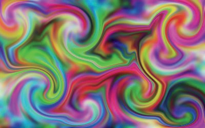

图 4-36. 应用 IWarp 滤镜后的效果

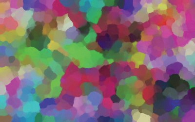

图 4-37. 应用油画、立体主义和油画滤镜后的效果

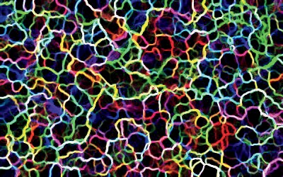

图 4-38. 边缘检测后的效果

使用“按颜色选择”工具（），点击图像中的黑色区域，剪切选择区域（），并丢弃该区域。将该层的模式设置为“仅暗化”，透明度设置为 50%。使用**图像：颜色 > 曲线**工具，调整数值曲线，直到图像与图 4-39 中的效果相似。

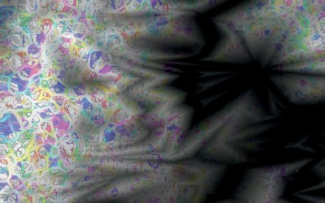

图 4-39. 调整曲线后的效果

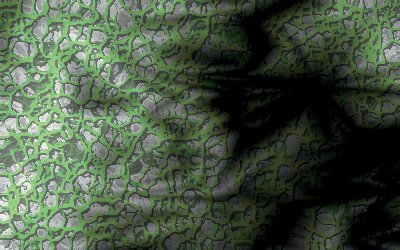

图 4-40. 应用凸起映射和上色滤镜后的效果

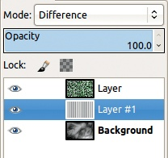

图 4-41. 图层对话框

现在在上层应用凸起映射，使用该层自身作为映射（**图像：滤镜 > 映射 > 凸起映射**），并使用**图像：颜色 > 上色**将其上色。请参见图 4-40 中的效果。

最后，在背景层上方添加一个新的透明层。选择正常混合模式下的混合工具，并使用三角波重复模式。在中间层上画一个非常短的水平线条，然后将该层设置为差异模式。图 4-41 显示了此时的图层对话框。最终效果见图 4-42。

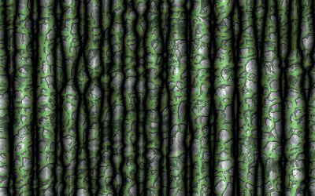

图 4-42. 最终纹理

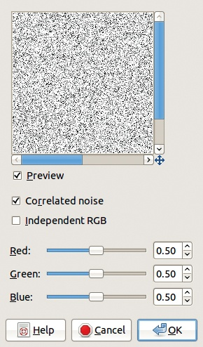

图 4-43. RGB 噪声对话框

当然，你可以使用这个过程创建无数种不同的纹理。

## 使用噪声滤镜

**图像: 滤镜 > 噪声**菜单有六个选项。它们中的三个在活动图层上创建一个或多或少随机的像素模式，另外三个通过移动现有像素来改变活动图层。整体思路是生成不可预测的像素排列。HSV 噪声和 RGB 噪声提供了一定的控制，能改变生成的像素颜色。

让我们生成噪声，并将其作为一些精细纹理的基础。

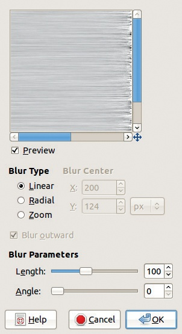

图 4-44. 运动模糊对话框

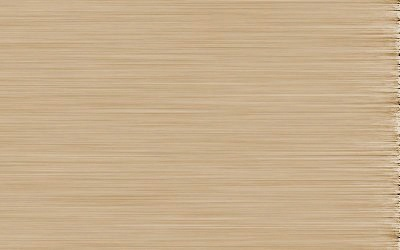

图 4-45. 上色后的结果

### 第一种方法: 刷金属效果

最简单的方法是制作刷金属效果。因为金属通常只有一种颜色，所以可以生成单色噪声。你可以使用 RGB 噪声滤镜来完成这一点。在图 4-43 中，取消选中“独立 RGB”（INDEPENDENT RGB）框，以获取灰色噪声。选中“相关噪声”（CORRELATED NOISE）框，以获得更强的噪声。最后，将三个滑块（它们是联动的）推到 0.5，得到适中的粗糙噪声。

要将噪声转变为刷金属效果，请选择**图像: 滤镜 > 模糊 > 运动模糊**滤镜。在图 4-44 中，设置角度（ANGLE）为 0，以获得水平效果，并将长度（LENGTH）设置为 100。

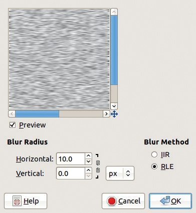

图 4-46. 高斯模糊对话框

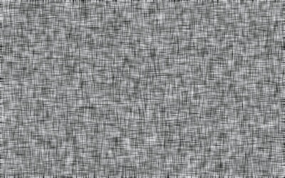

图 4-47. 画布纹理

如果你不喜欢金属效果，使用**图像: 颜色 > 上色**工具可以轻松更改颜色。如图 4-45 所示，纹理的右侧看起来有些奇怪。要修复它，可以使用裁剪工具去掉那个边缘！。

### 第二种方法: 画布纹理

接下来，我们创建一个简单的画布纹理。在一个新图像中，生成一些 RGB 噪声。其强度决定了结果的外观。选择 0.7。复制图层，并对每个图层应用高斯模糊。通过在图层对话框中点击图层来选择一个图层。当应用模糊时，打破水平和垂直半径之间的链条（请参见图 4-46）。对于其中一个图层，将水平半径设置为 0，垂直半径设置为 10。对于另一个图层，反过来：将水平半径设置为 10，垂直半径设置为 0（如图所示）。将顶层设置为“叠加”模式，你将得到图 4-47 中所示的画布纹理。

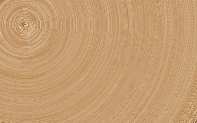

图 4-48. 木纹纹理

### 第三种方法：木纹纹理

本节中的最后一个例子模拟一块木材。如前所述，从一个新的 400 × 250 图像开始。用中性色灰色（如 999999）填充背景。创建一个额外的图层，填充中等灰色 7F7F7F（在三个 RGB 通道中的值为 127）。选择 Grain extract 作为混合模式。添加一些强烈的 RGB 噪声（**图像：滤镜 > 噪声 > RGB 噪声**）。取消选中“独立 RGB”框，并将三个光标移到 1.00。为了得到木纹纹理，添加一个运动模糊：应用 **图像：滤镜 > 模糊 > 运动模糊**，选择径向模糊类型，角度为 60，并将模糊中心设置为 `X` 和 `Y` 的 50。

由于木材很少是这种灰色，给它上色。为此，添加第三个图层，填充为棕色（我们使用的是 8c6434），并将混合模式设置为“颜色”混合模式。请参见图 4-48 中的结果。注意，这种上色方式保留了原始的灰度纹理，不像“上色”或“色彩平衡”工具那样改变纹理。

## 使用浮雕滤镜

如前所述，浮雕或凹凸滤镜分布在三个不同的滤镜菜单中。

### 第一个例子：逼真的画布纹理

其中最简单的滤镜是 **图像：滤镜 > 映射 > 凹凸贴图**。我们使用这个滤镜来改善图 4-47 中的画布纹理。首先，合并这两个图层。然后选择该滤镜。选择图 4-49 中显示的参数并点击“确定”。请参见图 4-50 中的结果。

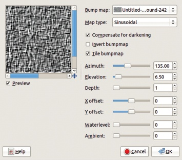

图 4-49. 凹凸贴图对话框

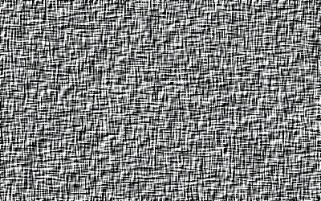

图 4-50. 更逼真的画布纹理

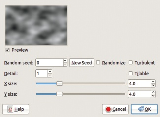

图 4-51. 实心噪声对话框

### 第二个示例：类似水面的纹理

在下一个示例中，我们使用相同的滤镜来构建类似水面的纹理。使用图 4-51 中所示的参数，通过 **图像：滤镜 > 渲染 > 云彩 > 固体噪声** 滤镜填充一个新图像。然后应用 **图像：滤镜 > 噪声 > 扩散** 滤镜，并使用图 4-52 中所示的参数。对图像进行 5 像素的高斯模糊处理，分别应用于两个方向，得到图 4-53。

图 4-52. 扩散对话框

图 4-53. 第三个滤镜应用后的效果

接下来，选择 Bump Map 滤镜，像前面的示例那样使用图像本身作为映射。为了在波浪上产生波纹，将 ELEVATION 设置为 80，DEPTH 设置为 40。AZIMUTH 设置为 135，但这个设置并不特别重要。通过使用 **图像：颜色 > 曲线** 工具来增强水的外观，如图 4-54 所示。现在，水面，如图 4-55 所示，只需要一些颜色。我们可以通过颜色平衡、着色、色阶，甚至曲线来实现这一点，这些功能都可以在 **图像：颜色** 菜单中找到。你也可以添加一个新的彩色图层并将其设置为颜色模式。

图 4-54. 曲线对话框

图 4-55. 应用 Bump Map 滤镜并调整曲线后

图 4-56. 进行选择

### 第三个示例：斯科特效果

接下来，我们展示斯科特效果，用于创建腐蚀或生锈的纹理。这个思路简单，但可以作为一些非常漂亮的自然纹理的基础。在这里，我们为你提供了一个基础。首先，创建一个新图像，并填充 **图像：滤镜 > 渲染 > 云彩 > 等离子**。选择一个 2.0 的湍流值。使用颜色选择工具随机选择（）。要构建更大的选择区域，按住  键并继续在图像中随机点击。构建一个类似于图 4-56 所示的选择区域。

图 4-57. 用灰色填充选区

图 4-58. 为金属图层添加腐蚀效果

等离子层的目的是简单地生成选区。隐藏它，然后添加一个白色图层，再添加一个透明图层。保持透明图层激活，用灰色填充选区。结果见于图 4-57。

隐藏顶部图层，丢弃选区。激活中间图层，使用 RGB 噪声滤镜和运动模糊构建刷金属纹理，正如我们在第一方法：刷金属效果中所做的那样。为了完成效果，选择 Bump Map 滤镜，并使用它来提升金属图层，使用顶部图层作为贴图。尝试调整参数，尤其是海拔和深度。在图 4-58 中查看一种可能的结果。

结果可以在另一种形式中进行凹凸处理，或以不同的方式上色。通过在顶层转换 Alpha 为选区，恢复按颜色选择工具的选区，然后剪切或上色。当然，这些只是一些建议。你可以继续使用 GIMP 中的任何效果编辑此纹理。

图 4-59. 光照效果对话框

图 4-60. 最终的石材纹理

### 第四个例子：石材纹理

在本节的最后一个例子中，我们使用**图像：滤镜 > 光与影 > 光照效果**滤镜来构建石材纹理。首先，创建一个新图像，并使用**图像：滤镜 > 渲染 > 云彩 > 固体噪声**填充背景图层。然后添加一些 RGB 噪声，将三个通道的值设置为较低值。

添加一个新图层，用适度湍流的等离子填充。此图层将作为凹凸贴图使用，因此将其隐藏并选择背景。选择光照效果滤镜，在光照效果滤镜对话框中，如图 4-59 所示，选择 BUMP MAP 选项卡，并启用凹凸贴图，使用等离子图层作为贴图。你还可以更改光源、光线颜色和一些其他选项。最终效果可见于图 4-60，并可以使用我们展示的任何方法进行上色。

图 4-61. 使用渐变画笔构建的可平铺纹理

图 4-62. 用 1 像素宽的图层构建的可平铺纹理

## 更多创建纹理的方法

你可以使用并结合许多其他技巧来生成新的纹理。

### 使用渐变画笔

你可以通过以下方法在图 4-61 中创建可平铺的纹理：

1.  创建一个新的白色图像。

1.  选择画笔工具 ()。选择`随机颜色`画笔动态，`加勒比蓝`渐变，以及`动画五彩纸屑`画笔，设置大小为 60。

1.  用画笔在背景上涂抹，覆盖背景。

1.  应用**图像：滤镜 > 映射 > 制作无缝**。

### 使用 1 像素宽的图层

另一种稍微让人惊讶的技巧产生了图 4-62 中显示的有趣效果。试试以下方法：

1.  创建一个新的白色 400 × 250 图像。

1.  添加一个新的 1 × 250 图层。应用等离子滤镜。使用**图像：图层 > 缩放图层**，将此图层缩放到 400 × 250。注意打破宽度和高度之间的链条。使用移动工具 ()，将此图层移动到整个图像上。

    

    图 4-63. 第一次笔触

1.  重复步骤 2，创建第三个图层，这次从 400 × 1 的大小开始。

1.  将顶层图层设置为差异模式，并将其合并到下方。

请注意，这种格子纹理已经是可平铺的，无需任何额外操作。快试试看吧！

### 手工构建

我们的最后一个纹理几乎完全是手工构建的，没有使用强大的工具。我们一步步地构建它，并提供一些关键插图来指导你。

从你常用的白色 400 × 250 图像开始。使用画笔工具 () 绘制一个可平铺的纹理。选择`硬度 100`画笔，并将其设置为大小 10。选择一个亮色——例如红色——并绘制一些随机曲线，分布在图像上，但不要接触到边缘，如图 4-63 所示。

现在选择**图像：图层 > 变换 > 偏移**工具（或 ）。在图 4-64 中显示的对话框中，勾选“环绕”并点击“X/2, Y/2 偏移”，然后点击“偏移”。更改画笔工具的颜色，并画出更多曲线，尤其是在空白区域。重复此过程两次，每次更改颜色，并在[x/*2, 0] 和 [0, *y*/2] 的偏移之间交替。结果显示在图 4-65 中。如果需要，可以检查它是否可平铺。

图 4-64. 偏移图层对话框

图 4-65. 所有笔触后的效果

使用**图像：滤镜 > 扭曲 > 旋涡与挤压**对该图像进行变形。选择大约 120 度的角度。接下来，应用**图像：滤镜 > 映射 > 小块图案**滤镜，使用默认参数。添加一个半径为 20 的高斯模糊。选择**图像：颜色 > 色阶**，通过将黑色三角形向右移动，白色三角形向左移动，使三个三角形靠得更近。结果如图 4-66 所示。

选择**图像：颜色 > 曲线**，并改变曲线的形状，使其类似字母*M*，其中高点位于 64 和 192，低点分别位于原点、128 和 256。结果如图 4-67 所示。这个纹理已经很有趣且可平铺，你可能想在继续之前保存一个副本。

接下来使用**图像：颜色 > 去饱和**去除颜色，然后使用**图像：颜色 > 自动 > 拉伸对比度**。为了增加浮雕效果，首先创建一个半径为 10 的高斯模糊，然后复制图层。将顶部图层设置为减法模式。结果是完全黑色的，因为你把每个像素从自身中减去。使用移动工具（）将顶部图层向下和向右移动几个像素。我们建议使用箭头键进行这种微调。结果是一个暗色的图像，上面有微妙的光旋涡。

图 4-66. 应用旋涡与挤压和小块图案滤镜后，再调整色阶

图 4-67. 调整曲线后

合并两个图层，然后再次调整色阶，使三角形在直方图最左侧的黑色区域下靠得更近。添加一个半径为 5 的高斯模糊。创建一个新图层，并将其填充为浅灰色。使用背景作为地图对该图层进行凸起贴图，并调整参数直到它像图 4-68。请注意，由于你稍微移动了顶层图层，图像不再可以平铺。稍后我们会修复这个问题。

为了让此纹理更有趣，请执行以下操作：

1.  选择底部图层 ()，并复制它 ()。

1.  为顶层图层添加图层蒙版。

    

    图 4-68. 在构建图案并应用凸起贴图滤镜后

    

    图 4-69. 最终纹理，几乎准备好平铺

1.  将复制的图层粘贴到顶层图层中 ()，并将其锚定到图层蒙版上 ()。

1.  使用“Levels”工具使此蒙版更清晰。

1.  隐藏底部图层，并在其上方添加一个填充为浅色的新图层。

1.  将蒙版应用于顶层图层，并将其 Alpha 通道转换为选择区域。

1.  在中间图层激活状态下，用深色填充此选择区域。移除选择。

1.  对中间图层应用一个半径为 5 的高斯模糊，并将其向下和向右移动几像素。这将创建纹理在顶层图层上投下的阴影。

1.  对顶层图层进行着色。

结果显示在图 4-69 中。为了让它平铺，从图像的中央选择一个 200×125 的矩形区域。确保避开边缘。复制选择区域，并用该复制创建一个新图像 ()。

这张新图像是可以平铺的。你可以使用相同的过程让图 4-67 中的纹理也变得可以平铺。

图 4-70. 文本工具选项

# 4.3 徽标

在本章的最后部分，我们使用一些用于纹理的技术来构建一些徽标。然而，请注意，**文件：创建 > 徽标**菜单提供了许多预定义的徽标。

## 文本工具

要构建徽标，你需要一种将文本添加到图像中的方法。可以使用文本工具完成此操作，该工具可以从工具箱访问，或者通过点击 。它的选项对话框会出现在图 4-70 中。

三个最重要的参数是文本的字体（FONT）、大小（SIZE）和颜色（COLOR）。你可以通过点击当前字体中显示字母“A”和“a”的按钮来更改字体。你还可以使用字体对话框，它是一个通常位于多对话框窗口中的可停靠对话框。

GIMP 没有自带任何字体。它会访问你系统中可用的字体。如果你想添加额外的字体，许多字体可以在网上免费获得，但请记住，复杂的字体可能会降低可读性。此外，在将徽标转换以添加浮雕效果时，粗体甚至超粗体字体效果最佳。

文本工具的默认大小为 18 像素，这对于徽标来说太小了。通常，徽标文本的大小应该在 50 到 200（或更多）像素之间。你可以在工作过程中调整文本大小以及其他参数，通过反复试验来找到适合你徽标的完美设置。

颜色按钮会弹出标准的颜色选择器。一旦创建了文本，你也可以将颜色从工具箱拖到图像上。

当文本被添加到图像中时，它会变成一个文本图层。只要保持这个属性，你可以更改参数甚至是文本内容。这个新图层的大小是文本加上一个小的边框，所以通常比画布小。只要文本图层属性处于活动状态，你就可以使用通常用于选择的角部句柄来更改图层的尺寸。该图层本身是透明的，文本则显示在这层透明背景上。

要将文本添加到图像中，点击图像中你希望文本左上角出现的位置。如果你想移动文本，可以切换到移动工具，但你仍然可以返回到文本工具并编辑文本内容。

## 添加浮雕效果

让徽标中的文本更突出的最简单方法之一就是添加浮雕效果。最好的工具是渐变工具，可以使用三种形状中的任何一种：角度形、球形或凹凸形。这些形状的效果取决于所使用的字体，因此可以进行实验，找到自己喜欢的效果。

要创建浮雕效果，首先在图层对话框中勾选“锁定 Alpha 通道”（该选项位于不透明度滑块下方）。现在，渐变工具将只影响文本，而不会影响其背后的透明度。

图 4-71. 创建文本图层

图 4-72. 添加浮雕效果后

接下来，选择渐变。一般来说，从前景色到背景色的简单渐变，使用 RGB 渐变是最佳选择。渐变应该从浅色到深色，因为字符的中间部分将会被第一种颜色填充，而边缘部分则会使用第二种颜色。如果前景色比背景色暗（通常情况是这样），只需勾选“反向”框，或者点击“渐变”按钮右侧的双箭头。

要应用渐变，只需在图像中绘制一个笔画。使用形状渐变时，笔画的方向和长度并不重要。

图 4-71 显示了一些无意义的文本，使用`Monospace Bold`字体并设置为 200 像素。图 4-72 显示了在文本上添加了形状（球形）渐变后的效果。应用渐变后，文本层不再具备文本属性。

图 4-73. 使用浮雕滤镜

你可以使用其他方法为徽标添加浮雕效果。这里有一种方法：

1.  从一些简单的文本开始，如图 4-71 所示。将文本层与背景合并。

1.  应用高斯模糊。模糊半径将决定浮雕的效果：在我们的例子中为 8.0。

1.  应用**图像：滤镜 > 扭曲 > 浮雕**滤镜。勾选“浮雕”按钮，保持三个参数不变。

结果如图 4-73 所示。我们的图像现在是灰度的，但你可以在浮雕处理后为其上色。或者，如果你复制了初始的文本层，可以将其转换为选区并用它为背景和文本着色，使用不同的颜色。

## 正确阴影与投射阴影

*阴影*（shade）和*投影*（shadow）这两个术语可能有相似的含义，但在这里我们将它们用来指代不同的效果，因此我们添加了一些修饰语以进一步区分这两个术语。*正确阴影*是由物体本身产生的阴影；*投影阴影*（也称为*投射阴影*）是物体投射到其环境中的阴影。例如，在图 4-73 中，物体假设是从左下角照射的，因此文本的右上方部分有正确的阴影。但物体距离背景的高度不足以投射阴影。

图 4-74. 投射一些阴影

图 4-75. 倾斜阴影

### 生成投射阴影

生成投影非常简单。首先使用来自图 4-71 的文本，复制文本图层。中间的图层将用于投影。由于阴影不应该完全是黑色，先将中间图层的颜色改为深灰色。取消选中“锁定 Alpha 通道”框后，对深灰色文本应用半径为 10 的高斯模糊。这个模糊效果赋予了投影一种柔和、自然的外观。将该图层移离预定的光源。你移动图层的距离越远，文本在背景上的表现就越高。参见图 4-74 中的结果。

在这个例子中，投影的大小和方向与文本相同，二者共同营造出背景与文本平行的错觉。使用透视工具 () 来改变投影的透视角度，如图 4-75 所示。现在背景不再看起来与文本平行。

如果你像在图 4-72 中那样添加了渐变，就会得到图 4-76 所示的图像。

图 4-76. 给文本本身添加浮雕效果

图 4-77. 在前面添加反射

你还可以添加文本的反射效果。这类似于投影，但通常较浅、更倾斜，放置在文本前面，并进行垂直翻转。要添加反射，请按照以下步骤操作：

1.  将画布大小调整为 400 × 280 像素 (**图像：图像 > 画布大小**) 。将背景图层调整为相同的大小 (**图像：图层 > 图层调整为图像大小**)。

1.  复制顶部图层，最终会变成反射的文本，并应用 **图像：图层 > 变换 > 垂直翻转** 工具。

1.  将其颜色改为浅灰色，并应用高斯模糊（取消选中“锁定 Alpha 通道”框）。

1.  使用透视工具进行变形，并且再次取消选中“锁定 Alpha 通道”框，将反射移动，直到你对结果满意为止。

我们的阴影和反射文本出现在图 4-77 中。

图 4-78. 生成浮雕和适当的阴影

### 添加浮雕和适当的阴影

现在我们演示如何同时添加浮雕效果和合适的阴影。创建一个新图像并使用之前相同的参数添加一些文字。但这次文字应该是蓝色的，因为如果文字是黑色的，接下来要做的操作将无法生效。

将文字图层复制两次，然后进行以下操作：

1.  对底层文字应用半径为 8 的高斯模糊。将其偏移（）在 `X` 和 `Y` 轴上各偏移 3。

1.  对顶层文字应用半径为 5 的高斯模糊。将其偏移 `X` 和 `Y` 轴各偏移 -2。

1.  变形顶层的值曲线（**图像：颜色 > 曲线**）以增加浮雕效果。根据曲线的最终形态，可以产生几种不同的效果。我们简单地将曲线的中间部分提起并拖向左上角。

1.  更改顶层的混合模式。你可以尝试屏幕、叠加、仅亮化或加法模式。我们使用了差异模式来创建图 4-78。

## 应用纹理

在本节中，我们将向你展示如何更改标志的材质。这通常等同于更改其纹理。

图 4-79. 扩散和位移后的效果

图 4-80. 使用渐变在图层蒙版上

### 一个燃烧的标志

首先在黑色背景上输入一些白色文字，然后将文字图层与背景合并。复制该图层，并对新复制的顶层应用以下效果：

1.  **图像：滤镜 > 噪点 > 扩散**：断开链条，并将水平参数设置为 0，垂直参数设置为 100。

1.  **图像：滤镜 > 扭曲 > 位移**：垂直位移 25。

结果见图 4-79。

然后给顶层添加一个白色图层蒙版（**图层：右键 > 添加图层蒙版**），并使用混合工具（**L**）将以下渐变应用于该蒙版：从黑到白，线性，无重复，使用垂直笔触从图像的中间延伸到接近顶部边界，但不接触。按下  键，得到一个完美的垂直笔触。结果见图 4-80。

合并图层，并应用以下效果：

1.  **图像：滤镜 > 扭曲 > 波纹**：设置方向为水平，振幅 1，周期 20。

1.  **图像：滤镜 > 扭曲 > 位移**：水平位移 5。

    

    图 4-81. 最终标志

1.  **图像：滤镜 > 噪点 > 扩散**：两方向的数值都设为 5。

1.  **图像：滤镜 > 模糊 > 高斯模糊**：在两个方向上使用 5 的半径。

使用**图像：颜色 > 曲线**工具为该图像添加一些颜色。在红色通道中，将曲线的中间点拖向左上角。在蓝色通道中，将中间点拖向右下角。结果如图 4-81 所示。当然，你可以（并且应该）尝试不同的参数值，以更好地理解滤镜的功能。

### 一个放射性徽标

在这个例子中，初始徽标是用黑色写在白色背景上的。复制文本图层，并将中间图层与背景合并。激活底部图层并应用以下效果：

1.  应用**图像：颜色 > 反相**。

1.  应用 5 的高斯模糊。

1.  应用**图像：颜色 > 自动 > 拉伸对比度**。

1.  打开**图像：颜色 > 色阶**工具，选择绿色通道。将输入色阶下的灰色三角形向左推，直到你对效果满意为止。

结果如图 4-82 所示。通过使用不同的通道，甚至同时使用多个通道，你可以改变光辉的颜色。你也可以为顶层添加颜色。

图 4-82. 一个放射性徽标

图 4-83. 金色背景

### 一个金色徽标

下一项技巧使用了我们之前使用过的几个强大滤镜。结果会很有趣，但过程相当复杂。

从一个新的白色 400 × 200 图像开始。应用**图像：滤镜 > 渲染 > 云彩 > 固体噪声**滤镜，将 *x* 和 *y* 尺寸设置为 2.8，其他参数保持默认值。拉伸对比度（**图像：颜色 > 自动 > 拉伸对比度**）并应用 5 的高斯模糊。

在混合工具选项中，选择`Golden`渐变。确保形状设置为线性，并且没有设置重复。应用**图像：颜色 > 映射 > 渐变映射**工具，使用背景作为映射来增强渐变。最终的纹理如图 4-83 所示。如果你在固体噪声滤镜对话框中勾选了可平铺框，这个纹理将是可平铺的。

创建一个新的图像（），与之前相同的尺寸，使用高级选项选择灰度色彩空间并填充为黑色。添加一些白色文本，使用大号粗体字体。合并两个图层并应用 5 的高斯模糊。

创建一个与原图大小相同的 RGB 色彩空间图像，并填充为黑色。在此图像窗口中，选择 **图像：滤镜 > 光效和阴影 > Lighting Effects** 滤镜。你之前已经在 图 4-59 中看过它的对话框。

图 4-84. 金色 logo

在 OPTIONS 选项卡中，勾选 CREATE NEW IMAGE 和 HIGH QUALITY PREVIEW。

在 BUMP MAP 选项卡中，勾选 ENABLE BUMP MAPPING，选择灰度文本图像作为 BUMPMAP IMAGE，设置 CURVE 为 LINEAR 或 SINUSOIDAL，并将 MAXIMUM HEIGHT 设置为 0.02。

在 ENVIRONMENT MAP 选项卡中，勾选 ENABLE ENVIRONMENT MAPPING，并选择金色纹理作为 ENVIRONMENT IMAGE。

你可以调整剩余两个选项卡上的设置，或者直接点击确定。结果如图 4-84 所示。你可以通过多种方式个性化这个 logo，例如，调整 Lighting Effects 滤镜中的其他选项，或使用曲线（Curves）或色阶（Levels）工具来改变颜色。

### 纹理化的 Logo

尽管本节标题为“清理”，但我们还没有构建出真正的纹理化 logo。现在是时候弥补这个遗漏了。首先，创建一个新的白色 400 × 200 图像，并输入我们的黑色 logo 文本。复制文本图层，添加一个白色图层放在其下，并将顶部图层与白色图层合并。最后，对这个图层应用 10 像素的高斯模糊，它将作为 bump map 使用。

现在选择一个你制作的纹理，例如，图 4-50 中展示的纹理，并将其作为新图层打开到你的图像中 ()。另外，你也可以将其作为新图像打开，然后将其缩略图从图层对话框拖到文本图像中。如果新图层太大，可以使用 **图像：图层 > 图层调整为图像大小**。

图 4-85. 使用 Bump Map 滤镜对 logo 进行纹理化处理

图 4-86. 清理

在新图层激活状态下，选择 **图像：滤镜 > 映射 > Bump Map**。选择顶部文本层作为 bump map，并调整其他参数以获得所需效果。低的 ELEVATION 或高的 DEPTH 将会添加投影阴影效果以及正确的色调。

单击确定，看到纹理覆盖了整个图层（图 4-85）。你希望将纹理化的文字放置在白色背景上，这一点你可以轻松做到，因为你保留了初始文本图层的副本。在图层对话框中，将此文本图层的 Alpha 通道转换为选区。其轮廓跟随字符，而不是它们的浮雕效果，因此选择**图像：选择 > 扩展**并将选区扩大 5 像素。然后激活最上面的图层，反选选区（），并剪切它（）。结果如图 4-86 所示。

# 4.4 练习

**练习 4.1.** 纹理构建教程的一个关键内容是马赛克滤镜。浏览**图像：滤镜**菜单，寻找其他滤镜，看看是否可以以类似的方式构建不同的纹理。

**练习 4.2.** 创建图 4-42 中展示的纹理时涉及了许多步骤。尝试重复或省略某些步骤，看看能得到多少不同的结果。

**练习 4.3.** 在图 4-48 中展示的示例中，我们使用了径向模糊。尝试选择线性模糊或缩放模糊，看看结果如何变化。调整其他参数或过程中的其他步骤以改善结果。

**练习 4.4.** Scott 效果的示例非常简单。使用基本原理来转换一张金属物体的照片。完成后，物体应显示出局部生锈的效果，但仍能辨认出其形状。

**练习 4.5.** 我们以两种不同的方式使用了光照效果滤镜（参见前一页的图 4-60 和图 4-84）。根据你对该滤镜功能的理解，尝试重新创建原始未切割黄金的纹理。

**练习 4.6.** 如图 4-73 所示，浮雕滤镜产生的是灰度结果。以铜或金为材质，制作一个类似的浮雕徽标。

**练习 4.7.** 使用**图像：文件 > 创建 > 徽标 > 酷金属**自动生成一个徽标。不要查看徽标的构建方式，尝试重新创建徽标的元素：浮雕文字、渐变色、投影、反射。提示：尝试一次使用一个效果，然后将它们组合起来。

**练习 4.8.** 图 4-86 中显示的纹理化徽标对于最终产品来说有些过于简约。为文字使用不同的纹理。然后添加一个纹理化背景，在背景上投射出徽标的阴影，该阴影由纹理的浮雕效果形成。
