# 第五章。合成摄影

在第二章中，我们修饰了现有的图像。在本章中，我们将向您展示如何通过使用多张照片来创建独特的图片，制作合成图像。

# 5.1 教程：构建合成肖像

*合成肖像* 是将多个不同的肖像组合成一张新的肖像图像。例如，你可以将几位艺术家对目击者描述的绘画合并，创建出一个最接近真实的危险罪犯形象。你也可以使用这些技术来推测两个人的孩子长什么样，或者发明一种奇特的混合动物。

在这个例子中，我们创建了几位年轻女性的合成肖像，她们友好地同意了我们使用她们的照片来进行这个演示。

每张肖像都拍摄于相同的中性背景前，使用相同的光照，并且女孩们大致处于相同的位置。但肤色的差异或头部倾斜的不同会带来一些有趣的挑战。如果使用在不同条件下拍摄的照片，那将更加困难。想象一下，将左侧光照下拍摄的鼻子复制到右侧光照下的脸上。当然，你可以将第一张图片垂直翻转，但那可能会导致图像其他部分出现不理想的效果。如果源照片的尺寸比目标照片大得多——或小得多——进行特征缩放会导致清晰度差异。而将一个中年男子的下巴放到年轻女性的脸上，或反之，出于多种原因也会显得很奇怪。在这个例子中，我们选择了在可行且简单的条件下进行项目操作，同时仍然具有教学意义。

从图 5-1 中展示的四张 900 × 1200 的肖像开始。这四张肖像作为图层排列在一张单独的图像中。我们的合成肖像将使用肖像 1 的眼睛，肖像 2 的头发，肖像 3 的鼻子，以及肖像 4 的嘴巴和下巴。

首先，你需要修正光照，使所有四张肖像的光照一致。使用**图像：颜色 > 色阶**工具分别对每一层进行调整：在图层对话框中选择该图层，然后选择色阶工具，并点击自动。调整后的效果如图 5-2 所示。肤色差异仍然很大，但比调整前有所减少。

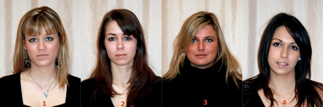

图 5-1。四个源肖像

图 5-2。经过光照修正后的效果

## 从不同肖像中提取特征

所有特征中，女孩的头发是最难复制的。没有任何选择工具可以精确地捕捉到它，而用快速蒙版工具修正它又既繁琐又极为困难。因此，最佳的解决方案是将其他特征复制到你想要的头发上（例如，肖像 2）。合成女孩将穿上这张肖像中的黑色衬衫，但因为所有女孩都是穿黑色衣服，所以衬衫并不重要。

要创建新的合成肖像，只需从图层对话框中点击并拖动肖像 2 的图层到工具箱中。立刻保存这个图像（），并不时重新保存（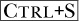），这样可以避免丢失所有工作。

接下来，从其他肖像中复制特征。你可以通过两种方式进行操作：

+   在源图像中选择特征，复制它，将其粘贴到目标图像中，并用结果的浮动选择创建一个新图层（）。

+   使用克隆工具从源图像复制到目标图像，最好是复制到一个新的透明图层中。

每种技术都有其优缺点，所以我们展示了两种方法，让你自行决定哪一种最适合你。为每个新特征创建一个新图层非常重要，因为它允许你更改一个特征而不必重建整个肖像。将特征包含在不同的图层中，也让你能够对其中一个特征的颜色、方向或大小进行调整，而不影响其他部分的肖像。

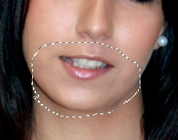

图 5-3. 选择嘴巴和下巴

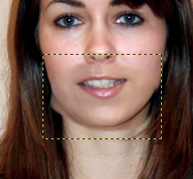

图 5-4. 粘贴嘴巴和下巴

一旦你对复制的特征的位置、大小和颜色感到满意，可以将图像合并并进行一些细微的修饰，以更好地将新特征融入脸部。

将初始人像和新的肖像放大到相同的缩放比例，例如 50%。确保肖像 4 是活动图层。选择“自由选择工具”（）。勾选“羽化边缘”框，并选择一个半径为 10 的值。围绕肖像 4 的嘴巴和下巴创建一个紧密的选择区域，如图 5-3 所示。如果复制的区域过大，可能会导致肤色差异。

复制肖像 4 中的选区，并将其粘贴到合成图像中。按下创建一个带有浮动选区的新图层。复制图像出现在图像中心；使用移动工具将复制图像移到正确的位置。由于肖像 4 中的女孩歪了头，因此新粘贴的嘴巴和下巴有些歪。为纠正此问题，通过**图像：图层 > 变换 > 水平翻转**来水平翻转新图层，然后旋转它 () 到合适的位置。嘴巴和下巴现在对齐了，但颜色不均匀，如图 5-4 所示。稍后我们会纠正这个问题。双击图层对话框中的新图层并将其名称更改为`mouth`。

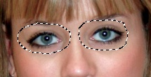

图 5-5. 选择眼睛

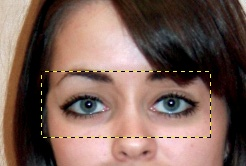

图 5-6. 粘贴眼睛之后

确保肖像 1 可见并处于活动状态，然后再次使用自由选择工具复制眼睛。为了避免选择到眉毛和鼻梁，将选区分成两部分。首先，围绕一个眼睛绘制一个圆圈，按住键，再围绕另一个眼睛绘制第二个圆圈。参见图 5-5。你也可以通过更改工具选项中的模式，而不是按下键来进行选择。

再次复制选区，将其粘贴到合成图像中，并从浮动选区创建一个新图层。将此图层命名为`eyes`。将图层移动到合适的位置，并稍微旋转它 ()。结果，如图 5-6 所示，效果不错，尽管你可以改进肤色过渡。

对于鼻子，使用克隆工具 ()。创建一个新的透明图层并命名为`nose`。选择克隆工具，并选择`Hardness 075`画笔。将克隆工具的大小选项设置为 20，并选择 ALIGNED 作为对齐选项。如果你有平板手写笔，可以使用它；如果没有，则使用鼠标，单击肖像 3 中的鼻尖，然后在合成图像上开始从鼻尖处涂抹。结果图像有两个主要问题：首先，肤色不一致；其次，鼻子的倾斜角度不对。可以通过稍微旋转新图层来修正鼻子的倾斜。一个可能的结果如图 5-7 所示。

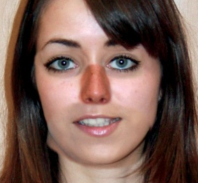

图 5-7. 复制鼻子

## 平滑过渡

接下来，平滑面部特征，以创建更具连贯性的合成肖像。这里，我们展示了几种实现此目标的方法。

对于嘴巴和下巴，使用“色阶”工具。选择它，并在嘴巴图层激活的状态下，轻微调整三个颜色通道中的右三角和中三角。你应该得到一个接近原始肖像的肤色。然而，下巴下方的区域仍然太暗。因为下巴在一个单独的图层中，你可以直接擦除不需要的部分。选择橡皮擦工具 ()，然后选择你在使用克隆工具时使用的画笔和大小。放大以更精确地操作，如果你有数位板，使用它会更方便。你仍然会看到下巴和脖子之间的色调差异，但不必太担心。

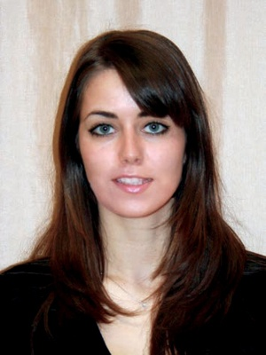

图 5-8. 最终合成图

现在主要的问题是鼻子的颜色。使用色阶工具来调整它。将“值”通道中的中三角形大幅度向左移动，尝试调到 1.8 附近。

现在，你已经完成了多层图像的所有操作。为了完成合成肖像，你需要将图像合并。为了预防，保存多层图像并将其复制 (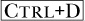)，然后在副本上进行操作。合并所有图层（**图层：右键点击 > 合并图像**），这样你就可以对整个图像使用涂抹、加深/减淡或克隆工具。

合成肖像的几个部分需要精细的修整。使用涂抹工具 () 来平滑最终肖像中各个组成部分之间的过渡，特别是在鼻子周围和从肖像 4 中复制过来的嘴巴和下巴上部碎片部分。你还可以使用修复工具 (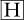) 来修正鼻梁或颧骨上的轻微不规则。

最后，选择整个面部，但不包括头发，并应用一个半径为 1 或 2 像素的非常轻微的高斯模糊。这会使面部更加平滑，并有助于隐藏面部特征与面部之间可能残留的可见边界。图 5-8 显示了最终结果。

# 5.2 选择、叠加与混合模式

本章重点讲解如何使用来自不同照片的元素构建合成图像。这个过程的三个主要工具是选择、叠加和混合模式。

## 蒙版与选择

正如前面的教程所演示的，制作选区是照片处理中最重要且最棘手的任务之一。所以我们将花些时间澄清 GIMP 中可用的选区工具的功能。

当你使用矩形选择工具建立选区时，你会得到一个由简单几何形状所界定的区域。这种简单性使得你可以轻松判断像素是否在选区内。然而，如果你选择羽化选区的边缘，边界就不那么清晰了：有些像素显然不在选区内，有些像素则深深位于选区内，但那些位于羽化边缘的像素呢？

当你使用模糊选择工具或按颜色选择工具时，情况会更加复杂。这些工具所建立的选区通常没有明确简单的轮廓。这一缺点在你启用快速蒙版时尤为明显，快速蒙版会将未选择的像素显示为红色（默认情况下）。如果选区是羽化的，你会看到一些像素完全是红色的（未选择）；一些像素根本不是红色的（已选择）；而另一些像素则是，嗯，有点红色。图 5-9 展示了使用按颜色选择工具制作的羽化选区，而图 5-10 则展示了启用快速蒙版工具后的同一选区。这两幅图像的显示倍数为 800%。

图 5-9. 使用按颜色选择工具制作的羽化选区

图 5-10. 作为快速蒙版的选区

如你所猜测的那样，这些带有红色的像素是部分选中的。选区和蒙版实际上是相同的东西。它们都是灰度图像，用来指定每个像素被选中的程度。如果蒙版的像素值为 0（即黑色），则图像中的相应像素完全没有被选中。如果这个值是 255（即白色），则相应的像素完全被选中。部分选中的像素的值介于 0 和 255 之间。

图 5-11. 在通道对话框中保存的选区

在选区的羽化边缘，像素是部分选中的。对选区所做的所有操作都会以较小的程度影响这些部分选中的像素：绘画时是半透明的；加深时是部分的；裁切时留下部分像素；等等。部分选区是使选区在照片处理中非常有用的原因。它们使你能够构建看起来不像笨拙拼贴画的合成图像。

由于选区和蒙版是相同的，而且蒙版是灰度图像，你可以使用与图像相同的工具来操作它。你可以使用第三章中演示的绘画工具在其上绘制。你可以选择和编辑特定区域。你还可以保存并稍后使用**图像：选择 > 保存到通道**。蒙版会作为额外的通道出现在“通道”对话框中，如图 5-11 所示。在此图中，通道被选中（其线条被强调），所以如果你现在在图像上绘制，你是在绘制蒙版。要在图像本身上绘制，请切换到“图层”标签，选择你想修改的图层，然后开始绘制。

你还可以使用此属性以与使用快速蒙版工具相同的方式更改蒙版。为此，打开“通道”对话框，然后单击蒙版左侧的框，使眼睛图标可见。现在，蒙版会出现在图像上（默认是灰色）。你可以通过选择**通道：右键单击 > 编辑通道属性**来更改蒙版的显示颜色，这会打开图 5-12 所示的对话框。你可以更改通道的名称和透明度，以及蒙版的颜色。单击右侧的大按钮打开颜色选择器，在这里你可以选择任何你喜欢的颜色。但请记住，通常选择与图像对比的颜色效果最佳。

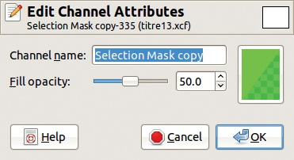

图 5-12. 编辑通道属性对话框

当选区（蒙版）保存在通道中时，你可以通过简单地单击“通道”对话框底部的红色方框按钮来再次使用它。如果你将鼠标指针悬停在按钮上，你会看到标准的键盘快捷键组合允许你激活不同的选区模式。你可以在“通道”对话框中保存无限数量的选区作为蒙版。

用于确定图层中像素透明度的蒙版被称为*图层蒙版*。图层蒙版是特定图层的一部分，其像素指定该图层中相应像素的透明度。如果蒙版像素是白色的，则对应的图层像素是完全不透明的，因此如果没有被位于上层的其他像素遮挡，它将在图像中可见。如果蒙版像素是黑色的，则对应的图层像素是透明的，因此不可见。蒙版像素的中间值会产生图层像素的中间透明度级别。然而，请注意，图层本身并不会改变。

你可以通过**图像：图层 > 蒙版**菜单中的“添加图层蒙版”来添加图层蒙版。添加后，你可以通过相同的菜单访问其选项。你还可以通过右键单击图层对话框中的图层来添加或编辑图层蒙版。当你向图层添加蒙版时，可以选择几种选项：完全白色或完全黑色的蒙版、当前选择、指定的通道等。一旦建立了蒙版，你可以通过涂抹来改变它，例如使用快速蒙版。你还可以改变其显示属性，例如它在图像中的显示方式。最后，你可以将其应用到图层上，使其效果最终确定。

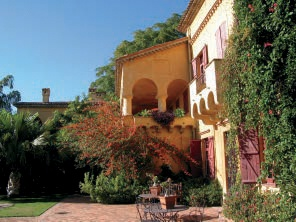

图 5-13. 第一张照片

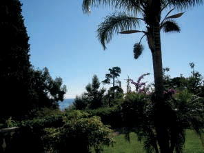

图 5-14. 第二张照片

我们在之前的章节中已经展示了一些这些选项，稍后在本章中我们会再次提到它们。

## 图像叠加

单纯叠加不透明的图像并不有趣。修改顶部图层的不透明度有时会产生令人满意的结果，但这样做并不能给我们太多的控制。可是，一旦你建立了选择，就可以创造出自己独特且富有想象力的图像。

例如，取图 5-13 和图 5-14 中的照片。打开第一张照片，并将第二张作为一个图层添加（）。然后，使用模糊选择和按颜色选择工具，选择顶部图层中的天空，这需要在天空的多个区域点击约十几次。记住，按下可以将区域添加到选择中，而按下则可以从选择中减去。完成的选择将作为快速蒙版显示在图 5-15 中。

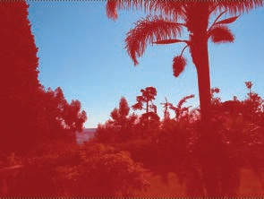

图 5-15. 选择天空

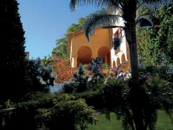

图 5-16. 最终结果

我们的目标是让天空变得透明，以便从另一张照片中的建筑物能通过热带植物显示出来。然而，如果我们仅仅裁剪选择，天空会被不透明的白色替代，因为图层本身没有透明度（由粗体图层名称表示），因此任何裁剪的像素都会被背景颜色替换。为了添加透明度，可以将 Alpha 通道添加到顶部图层：**图层：右键 > 添加 Alpha 通道**。现在如果你裁剪选择，你将得到图 5-16。

你还可以使用选择工具将一张照片中的某个部分复制并粘贴到另一张照片中。你在本章开头创建合成肖像时，就已经在较小的范围内做过这件事。将较大的物体从一张照片移动到另一张照片会带来一些挑战，正如你将很快看到的那样。

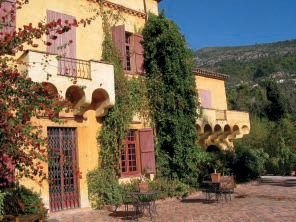

图 5-17. 第一张照片

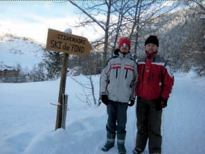

版权归属：Vincent Lecarme

图 5-18. 第二张照片

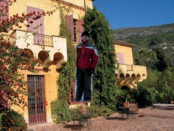

图 5-19. 粘贴人物

正如你之前所见，新粘贴的对象作为*浮动选择*被添加到图像中。它们出现在图层对话框中（你应该始终将其保持可见），并且表现得有点像堆叠最上层的图层。但是，只要浮动选择存在，你就无法更改图像中的其他内容。其他图层将被禁用，就像图像中未选中的区域在存在选择时处于非活动状态一样。

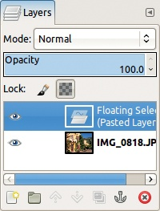

图 5-20. 新图层作为浮动选择

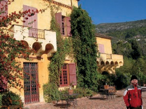

图 5-21. 最终结果

使用浮动选择，你可以执行以下操作：

+   创建一个新图层，用来包含你刚刚粘贴的对象。

+   将粘贴的内容*锚定*到你创建浮动选择之前处于激活状态的任何内容。这个图层可能是激活的图层（在图层对话框中高亮显示）或激活的图层蒙版（见前一节），但不能是激活的通道。

假设你想要将图 5-17 和图 5-18 中的元素结合起来。你决定将一位穿着过于华丽的男士放在法国里维埃拉的阳光明媚的别墅前。选择右侧的那位男士，如图 5-18 所示。使用自由选择工具进行选择，并通过快速蒙版完成。选择他的腿时要非常小心，因为它们将不可见。

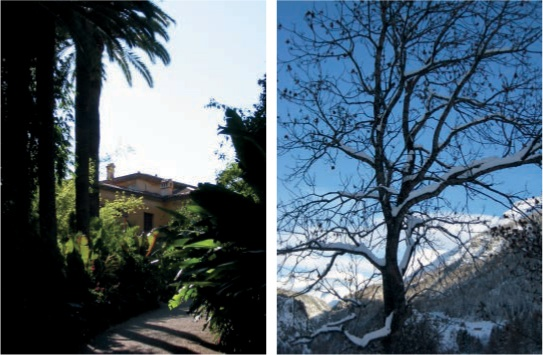

图 5-22. 上层和下层

复制图 5-18 中的选择区域，并将其粘贴到图 5-17 中的图像上。人物出现在图像的中央，如图 5-19 所示，作为一个浮动选择（见图 5-20）。

为这个浮动选择创建一个新图层，并将人物移动到阳光场景的右下角。他的颜色比周围环境更暗，因此选择“色阶”工具，增加一些亮度和对比度。同时，应用**图像：图层 > 变换 > 水平翻转**来翻转人物。你可以在图 5-21 中查看效果。

## 使用混合模式

GIMP 提供了 21 种混合模式，你可以从图层对话框中选择。MODE 选项包含一个下拉菜单，列出了将作用于活动图层的混合模式。每种混合模式使用不同的数学模型来计算来自活动图层和下层的新像素值。虽然我们不会深入讲解混合模式的数学原理，但我们会介绍一些最常用于图像叠加的模式。

从图 5-22 中的照片开始。将它们合并为一张图像，第一张作为上层。混合模式按逻辑顺序排列，详见第十二章。在接下来的列表中，我们将按不同顺序简要介绍这些模式，以便快速浏览。

+   如果模式设置为“正常”，上层完全覆盖下层，除非其不透明度低于 100%。图 5-23（左图）显示了一个上层不透明度为 50%的图像。每个新像素包含上层像素和下层像素各一半。

+   溶解模式与正常模式看起来相同，直到你减少上层的透明度。当你降低上层的透明度时，图层通过*抖动*混合，生成的像素是上层和下层像素的随机混合。透明度对应于新像素值从上层获取的可能性。图 5-23（中图）显示了溶解模式在上层透明度为 50%时的效果。

+   在 Multiply 模式下，像素的值被相乘然后*标准化*。结果的像素比初始层的像素更暗。图 5-23（右侧）展示了 Multiply 模式的结果：当其中一个像素为黑色时，结果为黑色像素，而只有当两个像素都为亮色时，结果才为亮色像素。

+   Divide 模式对像素值进行除法和标准化。结果主要取决于上层像素。如果上层像素为黑色，结果几乎是白色，如图 5-24（左侧）所示。

    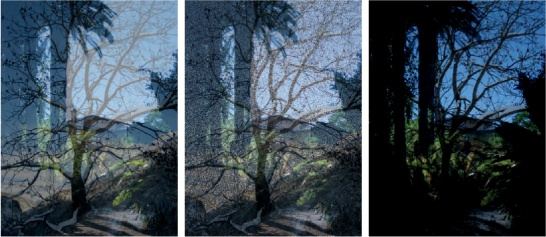

    图 5-23. Normal 模式和 Dissolve 模式，50%透明度；Multiply 模式

    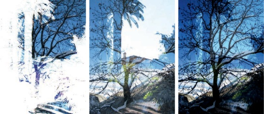

    图 5-24. Divide 模式，Screen 模式和 Overlay 模式

+   Screen 模式的数学原理更加复杂。如图 5-24（中间）所示，上层中的暗区域比亮区域更透明。如果你想了解更多关于 Screen 模式的内容，请翻到第十二章。

+   Overlay 模式结合了 Multiply 和 Screen 模式，导致上层变得褪色。如图 5-24（右侧）所示，上层在图像中几乎像幽灵一样。

+   Dodge 和 Burn 是传统的模拟照片冲洗技术，用于使照片中的某些区域变得更亮或更暗。如图 5-25（左侧和中间）所示，这些模式按照相同的原理操作：上层用于遮挡或加深下层，操作的强度与上层的数值相对应。

+   Hard 光和 Soft 光是 Multiply 模式和 Screen 模式的类似组合。如图 5-25（右侧）所示，在此示例中，Hard 光模式并不是很有用，因为上层几乎完全隐藏了下层。如图 5-26（左侧）所示，Soft 光模式产生了更有趣的结果，尽管在这个例子中，结果与 Overlay 模式非常相似（见图 5-24，右侧）。

    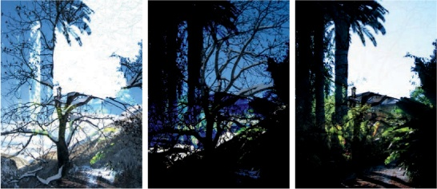

    图 5-25。减淡模式、加深模式和硬光模式

    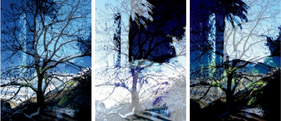

    图 5-26。柔光模式、颗粒提取模式和颗粒合并模式

+   颗粒提取和颗粒合并是另一对兄弟模式。颗粒提取类似于差值模式，而颗粒合并类似于加法模式（我们将在后面解释）。这些模式本应模拟电影颗粒，但有时相似性并不明显。图 5-26（中）展示了颗粒提取如何利用上层的亮区来夸大下层的亮区。图 5-26（右）展示了颗粒合并的更微妙效果，它利用上层的纹理来改变下层的效果。

+   差值、加法和减法也是兄弟模式。差值模式，如图 5-27（左）所示，从上层像素中减去下层像素，并使用结果的绝对值。生成的图像难以预测。加法模式，如图 5-27（中）所示，将像素值相加，超过 255 的值显示为白色。生成的图像会变得更亮。减法模式，如图 5-27（右）所示，将像素值相减，负值显示为黑色。

    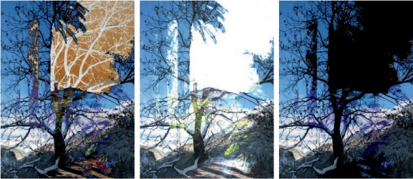

    图 5-27。差值模式、加法模式和减法模式

    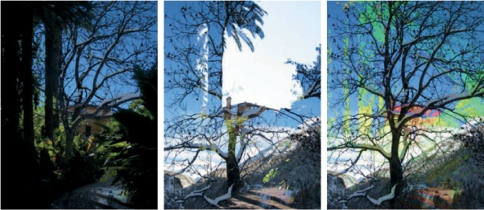

    图 5-28。仅暗化模式、仅亮化模式和色相模式

+   仅暗化和仅亮化，如图 5-28（左和中）所示，正如它们的名称所暗示的：从两层中选择最暗或最亮的像素。

+   最后四种模式是相关的：新像素从初始图层中获取一些 HSV 组件的组合。在色相模式（图 5-28，右侧），上层给下层着色。饱和度模式（图 5-29，左侧）从下层获取色相和值组件。色彩模式（图 5-29，中间）只从下层获取值。值模式（图 5-29，右侧）则完全相反：它只从上层获取值。

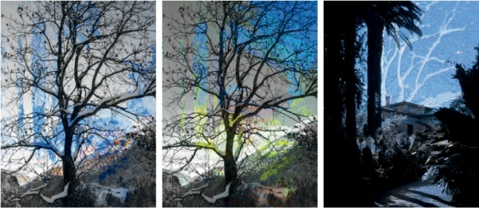

图 5-29. 饱和度模式、色彩模式和值模式

# 5.3 构建全景

使用数码相机，你可以轻松拍摄多张相同主题的照片，并从多个角度捕捉画面。你还可以制作*全景图像*（即比你一次能看到的更大范围的宽幅照片）。

专门用于构建全景的软件工具是可以找到的。其中一个是 Hugin（请参见* [`hugin.sourceforge.net/`](http://hugin.sourceforge.net/)*），它是免费的，支持 GNU/Linux、Mac OS X 和 Windows。它使用了一种强大的算法，名为*SIFT*，该算法由不列颠哥伦比亚大学开发。它以完全自动化的方式构建全景图像。该算法会在不同的照片中找到一组*控制点*。最终效果非常壮观，但该算法对处理器的要求很高，特别是当全景图像由大量大尺寸照片构建时。

在本节的最后，我们还使用了由 Akkana Peck 开发的 GIMP 插件 Pandora。安装后，Pandora 可以通过**图像：滤镜 > 合并**访问。

## 拍摄照片

一些数码相机提供了全景模式，旨在确保图像足够重叠。如果你的相机没有这个功能，不用担心；用普通设置拍摄你需要的照片来制作全景图像其实很简单。只需遵循以下建议：

+   拍摄时，双脚稳稳站好。旋转身体的上半部分来拍摄每一张连续的照片，但尽量保持相机的高度一致，以便每张照片的天空部分都差不多。过多的垂直移动会让你的最终全景变得非常狭窄。如果可能，使用三脚架以提高稳定性。

+   在移动时不要改变曝光：所有照片的设置必须相同，即使光照条件不同。选择目标全景的一部分（例如中心）的最佳设置，固定它们，然后拍摄所有照片。如果您不确定如何操作，请参考相机的手册。

+   拍摄比必要的更多照片。要构建全景图，您需要大量重叠。相机的光学系统通常会扭曲每张图像的角落，有时甚至是边缘。只有图像的中心部分不会以任何可察觉的方式发生失真。这就是为什么在构建全景图时，主要使用每张照片的中心部分。

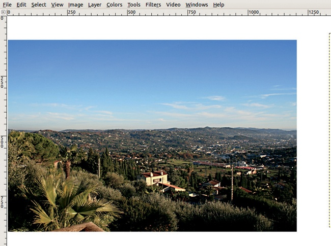

图 5-30. 添加第一张照片

也许您的相机可以拍摄非常高像素的照片。例如，奥利维耶的相机最大图像尺寸为 3888 × 2592。当在 GIMP 中加载时，大小为 90.9MB。如果加载六张照片，可能是构建全景图所需的最少数量，它们的总大小为 545.4MB，这对大多数电脑来说太大了。而且，一旦您开始处理图像，其大小会增加，因为存储的信息允许您撤销操作。基本上，除非您的电脑是一个拥有大量内存的强大机器，否则构建一个巨大的全景图会导致电脑崩溃。

通常来说，真正巨大的全景图其实并不实用。用于网页的全景图宽度不应该超过 1000 像素。如果您想打印图像，4000 像素的宽度在以 300 ppi 打印时，打印尺寸为 13.3 英寸或 33.9 厘米。

您可以使用相机的最高设置拍摄全景照片，然后将其缩小到可用的尺寸。然而，要小心不要缩小得太多，否则您将失去精度和清晰度。

## 将照片叠加

奥利维耶拍摄了八张来自他阳台的照片，按照上一节的建议进行拍摄。图像尺寸为 3888 × 2592，但我们将它们缩小为 1200 × 800。在缩放图像时，选择 Sinc（Lanczos）算法，虽然处理器占用较大，但它能达到最好的效果。缩小后，我们使用**图像：滤镜 > 增强 > 锐化蒙版**滤镜并应用默认参数，以补偿因缩放导致的清晰度损失。

由于这些照片重叠较多，正如应该的那样，完整的全景图宽度不会超过 2800 像素。由于保持相机在所有拍摄中精确高度比较困难，我们创建了一张 2800 × 1000 的图像，恰好给我们留出了些许空间。这张图像并不算特别大，但它将不得不为网页进行缩小处理。另一方面，这张图像对于打印来说相当小。下面是我们构建全景图的方法。

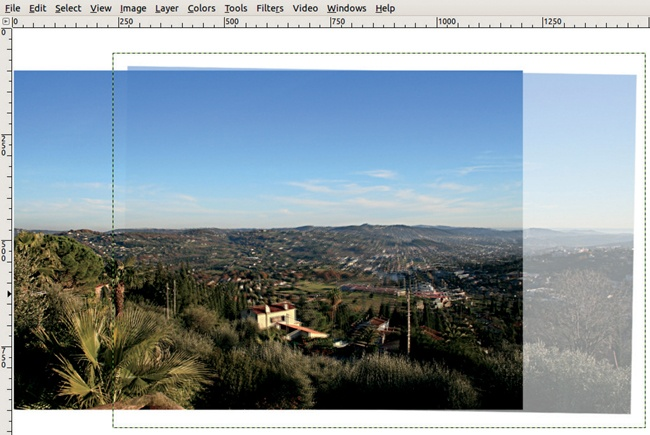

图 5-31. 加载第二张照片

1.  使用 将第一张照片加载到这个新图像中。新图层出现在图像的中心；将其完全移到左侧，如图 5-30 所示。

1.  将第二张照片作为新图层加载，并将其透明度调整为 50%，以便检查其是否正确定位。将其移动，使得两张照片重叠的区域对齐。重点是将中间的房子重叠，使其尽可能清晰。使用箭头键轻轻调整位置。如图 5-31 所示，由于镜头畸变，完美重叠是不可能的。在这里，我们能够使房子聚焦清晰，但周围的山丘模糊，左边的电线杆出现了双影。从地平线可以看出，拍摄第二张照片时，相机略微倾斜。

1.  为了改善从一张照片到另一张照片的过渡，在顶层添加一个白色图层蒙版。选择混合工具，并选择从黑色到白色的线性渐变，且不要重复。你希望顶层从左侧透明渐变到右侧不透明。为了创建一个完全水平的渐变，在拖动时按住 ，从左到右拖动，起始位置稍微偏右于左边缘，结束于房子的位置。

1.  一旦渐变建立完成，点击图层缩略图以选择该图层本身。将该图层的透明度恢复到 100%，然后稍微移动它（使用箭头键），使得房子尽可能清晰。你还需要稍微旋转顶层，以补偿相机的倾斜。这个过程很棘手，因为在使用旋转工具时，部分透明度会消失。图 5-32 展示了到目前为止的结果以及图层对话框。

## 修整全景图

对剩余的照片重复此过程：加载照片，将透明度设置为 50%，定位照片，去除透明度，添加图层蒙版，在该蒙版上绘制渐变，并完成照片的定位。为了避免在景物中产生奇怪的伪影，务必小心不要将渐变做得太宽，并避免将其放置在细节较多的区域。随着图层的添加，图像的大小会增加，在此情况下，当我们添加完所有八张照片后，图像大小为 123.4MB。

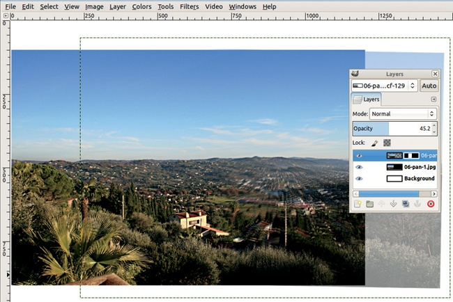

图 5-32. 定位第二张照片

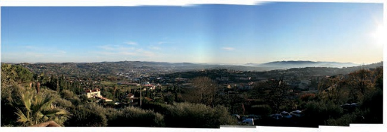

图 5-33. 所有照片已经定位。

有时，如果下层的某个细节看起来不合适，改变渐变设置会有帮助。你可以通过在图层蒙版上绘制来调整渐变，或者可以在问题区域上方再添加一个渐变，叠加在现有渐变之上。将第二个渐变设置为“叠加”模式（在工具选项对话框中的模式菜单中）。要查看图层蒙版本身，右键点击其缩略图或在图层对话框中右键点击。

当前的结果出现在图 5-33 中。天空的颜色在几张照片的接缝处不均匀。由于天空中有云层和极右侧的轻微雾霾，完全用两种不同蓝色渐变来替换会削弱图像的效果。我们倾向于保持全景图不变，尽管通过使用减淡/加深工具（在减淡模式下）或克隆工具进行一些细致（且繁琐）的修正，可能会改善效果。

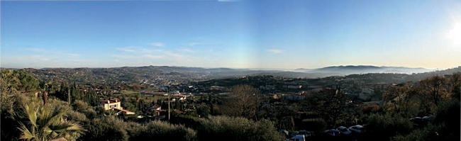

图 5-34. 最终全景图

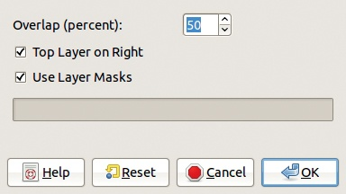

图 5-35. Pandora 滤镜对话框

当所有图片都放置好后，剩下的就是裁剪并将图像合并。我们的最终全景图呈现在图 5-34 中。

## Pandora 插件

开头提到的 Pandora 插件也可以用来构建全景图。下面是如何使用它的方法：

1.  将所有照片作为图层加载到一个新图像中。可以通过使用快速完成此操作。

1.  选择**图像：滤镜 > 合并 > 展开图层**滤镜。在出现的对话框中（图 5-35），选择图像之间的重叠量（在这种情况下，80 比 50 好），并决定顶部图层是在左侧还是右侧。请注意，最后加载的图像会成为顶部图层。

    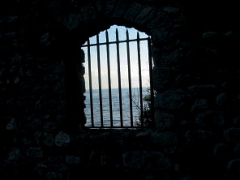

    图 5-36. 原始图像

1.  最后的细节处理由你来完成。移动图层并微调图层蒙版，直到得到一个平滑的全景图。

# 5.4 图像叠加

在上一节中，我们讨论了图像叠加的一个非常具体的应用。现在，我们将向你展示一些更通用的技术。

## 数字拼贴

从图 5-36 中展示的照片开始。我们希望用图 5-37 替换窗户外的海景。为此，你需要将海景部分设置为透明。你可以尝试使用“按颜色选择工具”或“模糊选择工具”，但这次不妨尝试一种全新的方法。

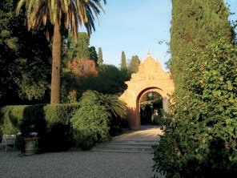

图 5-37. 新背景

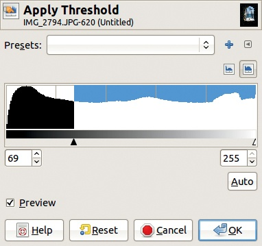

图 5-38. 应用阈值对话框

复制该图层，选择**图像：颜色 > 阈值**工具，打开图 5-38 中显示的对话框。将黑色三角形向左移动，直到只看到窗户的轮廓。使用**图像：颜色 > 反转**将其反转，得到图 5-39 中的结果。将此作为蒙版，使窗户完全透明。

现在做以下操作：

1.  选择顶部图层并复制它。

1.  打开图 5-37 中显示的图像，作为新图层选择**图像：文件 > 以图层打开**或按下 。

1.  复制底部图层，并将其移动到图层堆栈的顶部。

1.  为其添加一个图层蒙版（**图层：右键点击 > 添加图层蒙版**）。

1.  粘贴先前复制的内容，并将其固定到图层蒙版上（ 和 ）。

1.  按照图 5-40 中的方式排列图层。

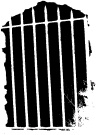

图 5-39. 反转后的阈值结果

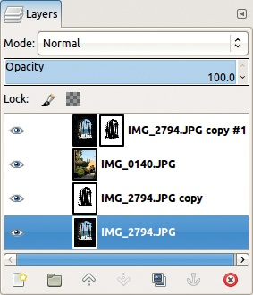

图 5-40. 图 5-41 的图层对话框

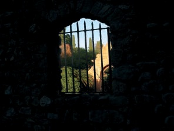

图 5-41. 添加新背景后

最终的图像显示在图 5-41 中。你可以在此停止。但墙壁非常黑，石块几乎看不见。幸运的是，你可以在不改变窗外景色的情况下调整这一点：在图层对话框中，点击顶部图层的缩略图以选择该图层，而不是图层蒙版。使用“色阶”工具（**图像：颜色 > 色阶**）调整伽马三角形，直到你满意为止。只会影响该图层，而不会影响图层蒙版或堆栈中的其他图层。另一方面，如果你想调整图层蒙版，你可以选择其缩略图，然后使用画笔工具来添加或删除蒙版中的内容。

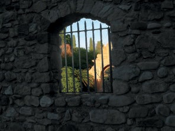

图 5-42. 最终结果

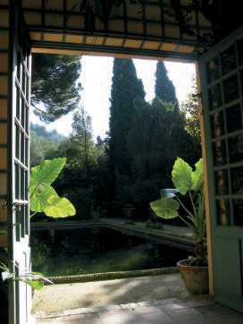

图 5-43. 框架

最终图像显示在图 5-42 中。注意，最初的图像仍然存在，并且未改变，位于底部图层。

接下来，使用相同的原则构建一个稍微复杂的图像。图 5-43 中显示的照片将作为图 5-44 中显示的肖像的框架。你希望肖像出现在打开的法式窗户中，比实际尺寸大，但背景中的景观仍然可见。首先，你需要去除当前在人物背后的米色背景，这个很容易做到。然而，完成这一步后，你不能直接复制肖像并粘贴，因为她的肩膀会超出窗框。

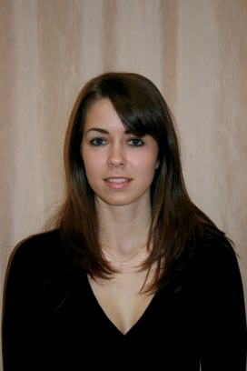

图 5-44. 肖像

要正确地将肖像放置在其非传统的框架中，请按照以下步骤操作：

1.  打开图 5-43 中显示的图像。添加 Alpha 通道（**图像：图层 > 透明度 > 添加 Alpha 通道**或**图层：右键点击 > 添加 Alpha 通道**）。

1.  使用自由选择工具，通过点击法式窗户的四个角来进行选择。

1.  选择完成后，剪切该区域，然后将其作为浮动选择粘贴回图像。通过浮动选择创建一个新图层（点击图层对话框底部最左侧的按钮或按下）。将新图层移动到图层堆栈的底部。图像看起来一样，但它已分为两个不同的图层。

1.  打开图 5-44 中显示的照片作为新的图层。给这个图层添加 Alpha 通道。选择模糊选择工具并选择米色背景。降低工具选项中的阈值，并像往常一样，按下来增加选择，或按来移除选择。选择人物头发周围的区域时要小心。完成后，剪切选择区域（）并丢弃它（）。

    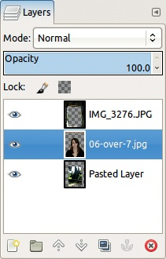

    图 5-45. 图 5-46 的图层对话框

    

    图 5-46. 最终效果

1.  选择缩放工具（），在指南选项中选择“行数”，然后点击人物肖像图层。放大肖像，并将其移动到窗口打开处。

    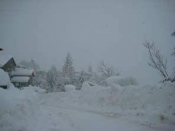

    图片来源：Vincent Lecarme

    图 5-47. 初始照片

    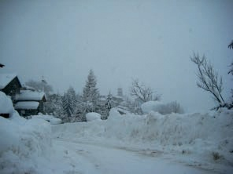

    图 5-48. 硬光模式下的自我合成

    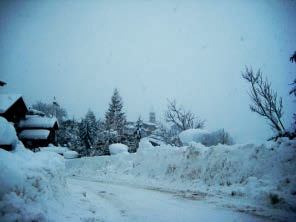

    图 5-49. 再次复制顶部图层两次

1.  最后，将图层排列，使得法式窗户位于最上层，肖像图层位于中间，剪裁的风景位于底部，如图 5-45 所示。

最终结果应该类似于图 5-46。

## 自我合成

在这里，首先使用图 5-47 显示的冬季场景照片，该照片几乎均匀灰暗且平坦。要将此图片转化为图 5-48 所示的图像，只需复制图层并将顶部图层的模式更改为硬光模式。通过重复此过程，您可以进一步增加对比度，但这会使图像呈现出强烈的蓝色调，如图 5-49 所示。使用“色阶”工具修正此效果。

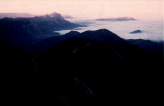

图 5-50. 初始照片

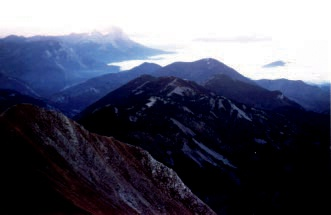

图 5-51. 屏幕模式中的自我合成

在图 5-50（从飞机上拍摄）中显示的照片过于昏暗。为了使其变亮，首先像在前面的示例中那样复制图层，但这次使用“屏幕”模式。

图 5-51 展示了经过两次复制后的结果。现在前景的颜色和细节清晰可见，但背景中较亮区域的一些细节丧失了。

要恢复一些背景细节，使用模糊选择工具选择图像中的亮区（即天空和云朵），但这次，忘记按下  或 。相反，点击天空中的某个位置，然后将光标向下或向右拖动。这样做时，工具的阈值增加，选择区域也会增大。如果将光标向上或向左拖动，选择区域会减小。结果如图 5-52 所示。

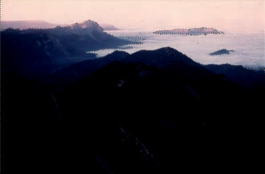

图 5-52. 选择亮区

图 5-53. 添加图层蒙版以保护亮部

反选区域 ()，给顶层添加图层蒙版，在弹出的对话框中选择从当前选择创建蒙版。请注意，只对顶层进行此操作，以避免对山脉的亮区产生不自然的效果。图 5-53 显示了结果。通过调整色阶工具中的伽玛指针，并去除照片中的一些轻微的、因时间导致的瑕疵，图像可以进一步改善，正如你在第二章中所看到的。

自我合成的照片也可以用来创建一些艺术性的、滤镜般的效果。打开图 5-54 中显示的照片并复制图层。如果将顶层的模式设置为差异模式，最终图像将完全变黑，因为两个相等数量之间的差异始终为零。但如果你使用移动工具将顶层图像向上和向左移动几个像素，你将得到如图 5-55 所示的图像，这样看起来更有趣。

图 5-54. 初始照片

图 5-55. 使用差异模式

图 5-56. 使用颗粒提取模式

图 5-57. 使用差异模式

图 5-58. 初始照片

将顶层图像的模式更改为“颗粒提取”模式，以获得图 5-56。然后将其更改为“除法”模式，以获得图 5-57。你可以通过改变偏移量的大小和方向、调整顶层图像的透明度或添加不同模式的新图层来创建这些效果的变化，等等。

## 合成摄影项目

图 5-58 中显示的这张照片拍摄于清晨，当时云层部分填满了奥利维耶房子前面的山谷。他计划将这张图像用于合成摄影项目，但由于匆忙拍摄，这张照片并没有完全捕捉到他所看到的景象。

图 5-59. 蓝色通道的直方图

图 5-60. 扩展等级后的结果

如果你调用“等级”工具并查看颜色直方图，你会看到绿色和蓝色通道在右侧被截断。蓝色通道，如图 5-59 中所示，是最严重的。简单地点击“自动”按钮就能修正这一点，结果如图 5-60 所示。现在这张风景图像非常接近奥利维耶的记忆，因此他决定在接下来的创意项目中使用它，如图 5-61 所示。

以下是创建此图像的步骤：

1.  将图 5-36 中的图像作为新图层添加到奥利维耶的风景中。

1.  将此图层缩放至与底层图像相同的宽度（**图像：图层 > 缩放图层**）。

1.  将顶层图像设置为“仅暗化”模式。

1.  裁剪图像。

图 5-61. 在“仅暗化”模式下与另一张图片合成

图 5-62. 要合成的另一张图像

图 5-63. 在“烧伤”模式下与另一张图片合成

同样，将图 5-62 中显示的照片作为另一个图层添加到图像中，并选择“烧伤”模式。你将得到图 5-63 所示的图像。

在以下示例中，我们复制了一个图像图层，然后将不同的混合模式与我们应用于顶部图层的半径为 10 的高斯模糊结合使用。图 5-64 展示了当顶部图层设置为“除法”模式时的结果。

图 5-64. 在“除法”模式下的模糊图层

图 5-65. 在“差异”模式下的模糊图层

图 5-66. 在“加深”模式下的顶部图层

为了创建图 5-65，我们选择了“差异”模式，并且通过将伽马三角形向左移动来调整了色阶。

在图 5-66 中，我们移除了高斯模糊并将图层设置为“加深”模式。注意这如何增强了前景中的云层。

你可以通过将顶部图层向上和向左移动 10 像素来增加深度。图 5-67 和图 5-68 中的偏移图像已被裁剪，以说明效果。

图 5-67. 在“除法”模式下的偏移图层

图 5-68. 在“差异”模式下的偏移图层

# 5.5 练习

**练习 5.1.** 找到一组可以准确演示所有混合模式的单一图像是一项困难的任务。在使用混合模式中的选择并不理想。找到一组更好的图像来进行这个演示。

**练习 5.2.** 创建均匀的天空通常是全景构建中最困难的部分。探索解决图 5-34 中看到的问题。在合并图层之前调整图层蒙版，或者使用涂抹工具修整最终结果。

**练习 5.3.** 在图 5-43 中显示的照片包含了两盆大叶植物，这些植物可能会更适合放在主题的前面，而不是在她的背后。设计一种方法来实现这一点。

**练习 5.4.** 使用自我合成中演示的概念，用你自己的数码照片创作一件独特的艺术作品。
