# 第六章 动画

虽然 GIMP 并非专为构建动画而设计，但它确实具备一些视频编辑功能，可以用来为标志制作动画，或者装饰网页。在本章中，我们首先介绍一些简单的动画，然后在本章的后续部分以及第十八章中，演示更复杂的动画，并展示如何在 GIMP 中操作现有的视频序列。

# 6.1 教程：动画文本

假设为了本教程的目的，你的名字是 Carol，这是一个受尊敬的、不具性别特征的名字。假设你，Carol，想用你的名字做一个动画标志来装饰一个在线相册。你的名字字母将逐渐出现，然后移动到指定位置。一旦你的整个名字都出现了，动画就停止了。

在第四章中，你学会了如何构建一个复杂的标志。由于本教程的重点是动画，因此标志会非常简单。如果你愿意，你可以将这些动画技巧与更高级的标志设计相结合，但请注意，这种组合通常会导致尴尬的混乱。

正如你将在 18.1 动画原理中看到的，动画是由连续的图像帧组成的。创建动画的一种方法是构建一个多层图像，其中每一层都是一帧。

## 方法一：逐帧制作

创建每一帧最简单的方法是手动逐帧构建。当然，这种方法也是最繁琐的，只适用于非常简单的动画。

在本教程中，我们使用背景图层作为动画背景，并仅在连续的图像层中移动名字的字母。

首先，创建一个新的 600 × 400 像素的图像（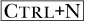）。用你选择的颜色填充背景。为此，点击工具箱中的颜色选择器（见图 3-3），选择你的颜色，然后按下 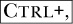 用前景色填充图层。或者，你可以选择油漆桶填充工具（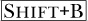），点击填充该区域。

现在选择文本工具（）。选择一个粗体字体（在我们的案例中，选择了`DejaVu Sans Bold Semicondensed`），并将大小设置为 100。选择一种在背景色上清晰显示的文本颜色。

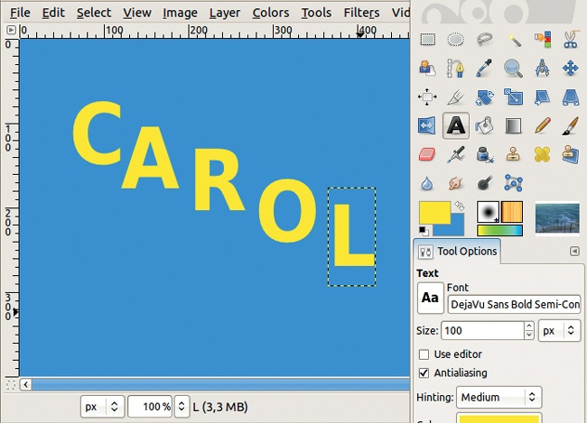

图 6-1. 输入字母

第一次点击对应的是包含第一个字母的框的左上角。如果在输入第一个字母后点击图像的其他地方，系统会自动为下一个字母创建新图层，这正是你所需要的。添加所有字母后，你的图像应该看起来像图 6-1。我们为 logo 选择的颜色是 HTML 表示法中的`2f91dc`和`f6ee11`。

这张图已经是一个简单的动画。要测试它，选择**图像：滤镜 > 动画 > 播放**。在打开的窗口中，点击播放按钮，你就可以看到动画播放。

为什么它有效？当你点击播放时，GIMP 会逐一显示图层，因为文本图层有透明背景，所以字母出现时不会覆盖背景或 logo 的其余部分。

为完成这个 logo，按下 (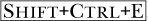) 并将其导出为 GIF 图像。在弹出的对话框中，勾选保存为动画，并取消勾选“循环播放”。

如输出格式中所述，这会生成一个可以在浏览器中显示的文件。在将 logo 导出为 GIF 后，你可以将其用作网页顶部的内容，例如。

在浏览器中打开动画进行测试，通常选择**文件 > 打开**或按下 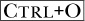。你也可以将动画嵌入到 HTML 页面中，使用``标签。

## 方法二：过滤所有图层

之前的动画很简单。假设你需要更复杂的内容。手动构建所有帧会非常耗时且枯燥——特别是如果你想创建一个流畅的动画，那就需要许多帧。为了更实际地制作这种动画，你需要一个可以从初始图像自动生成帧的程序。GIMP 动画包（GAP）正是做到了这一点。你需要单独安装它，但过程很简单（安装 GAP 的帮助请参见附录 E）。

安装 GAP 后，图像窗口中会出现一个名为 VIDEO 的菜单，并且在 FILTERS 菜单中会出现两个额外的选项：FILTER ALL LAYERS 和 FILTERMACRO。与 GAP 一起安装的另一个工具是**图像：滤镜 > 动画 > 选择为动画图像**，它类似于“过滤所有图层”。

创建一个新图像，大小和背景颜色与上一个练习中使用的相同。像以前一样，使用文本工具创建相同颜色、大小和字体的 logo，但这次将名称作为单一图层输入。我们的结果如图 6-2 所示。

图 6-2。初始 logo

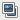

图 6-3。重复图层按钮

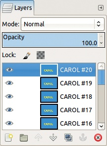

图 6-4. 图层对话框

对于这个动画，文本图层必须是不透明的。通过选择**图像：图层 > 合并下层**，或右击图层对话框中的文本图层并选择“合并下层”来将文本图层与背景合并。

动画有 20 个图层，它们最初是初始 logo 图像的相同副本。在你将文本与背景合并后，通过双击图层名称，修改图层的名称，例如，改为`CAROL #1`。然后，在图层对话框中点击“复制图层”按钮 19 次 (图 6-3)（见图 6-4）。

现在选择**图像：滤镜 > 所有图层滤镜**。此工具将滤镜应用于图像的所有图层。你为第一层和最后一层选择滤镜的参数，工具会插值计算中间图层的参数。

图 6-5. 第一个图层的参数

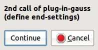

图 6-6. 中间步骤

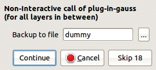

图 6-7. 最终对话框

对于我们的 logo，我们应用一个模糊滤镜。在搜索字段中输入`blur`并点击“按模糊搜索”。

选择`plug-in-gauss`，然后点击“应用”。数字字段和位于“应用”旁的小曲线允许你更改渐变速度：可以是均匀的，或一开始较慢，最后较快（例如，选择 4），反之亦然（负数将反转速度）。当下一个对话框出现时，将模糊半径设置为较大值，例如 50 像素，如图 6-5 所示。

点击“继续”。出现图 6-6 所示的对话框。再次点击“继续”，然后会出现一个与图 6-5 类似的对话框。这时，将模糊设置为 0，适用于最终帧。点击“确定”。现在，出现图 6-7 所示的对话框。

接下来，你需要为临时文件命名，以便保存动画。选择一个目录，输入`caroltemp.xcf`（或任何你喜欢的名称），然后再次点击“继续”。由于 GIMP 正在对 20 个图层应用高斯模糊滤镜，因此该过程需要一些时间。

一旦这个过程完成，动画就准备好了。通过选择**图像：滤镜 > 动画 > 播放**来测试它。当动画播放结束时，它会返回到起始位置。

你可以通过多种方式来更改这一点：

+   将动画导出为 GIF 图像，并取消勾选“循环播放”选项。

+   更改最后一帧的持续时间（即最上面的图层）；为此，双击图层对话框中的图层名称，并在名称后输入`(1000ms)`。确保括号和名称与持续时间之间有一个空格。现在，最后一帧将显示整整一秒钟，而其他帧则只显示 100 毫秒。

+   根据需要多次复制顶层图层。

## 方法三：沿路径移动

使用 FILTER ALL LAYERS 时，你只能控制第一个和最后一帧的操作。此外，由于帧是通过图层表示的，所以无法拥有多层帧。GAP 提供了可以用来创建动画并进行更精细控制的工具。

在安装 GAP 插件时添加的**图像：视频**菜单中，你将找到用于创建将帧作为单独图像文件存储的动画的工具。

这些图像文件的名称必须是*namexxxx*`.xcf`的形式，其中*name*是你给动画命名的部分，*xxxx*是一个从*0001*开始的数字，并按顺序递增，直到最后一帧。数字的位数可以根据动画的长度有所不同。

图 6-8. 预期动画的模型

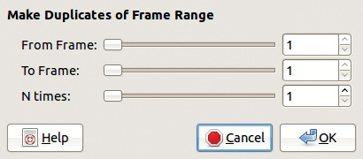

图 6-9. 图像：视频 > 复制帧对话框

一个非常短的动画的第一帧可能命名为*01*。较长的动画可能会有 6 位，甚至 10 位数字。

在这个例子中，假设你想创建一个新的动画，类似于之前的两个，但稍微复杂一些。这一次，`CAROL`的名字将逐渐变大并变得越来越不透明。同时，一个矩形框架将增长并变得不透明，然后从垂直位置（垂直于文本）旋转到水平位置，整齐地框住文本。

首先，为动画创建一个模型，这是一个三层图像。创建一个新的 300*×*150 的图像（），并使用相同的蓝色背景色。再一次，添加文本图层并命名为`CAROL`。最后，创建一个与文本相同颜色的框架：

+   创建一个新的透明图层。

+   使用矩形选择工具，选择文本图层的框架。

+   对这个选择应用**图像：选择 > 边框**，并选择 5 像素的边框宽度。

+   用前景色填充选择区域（例如，），然后取消选择（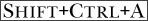）。

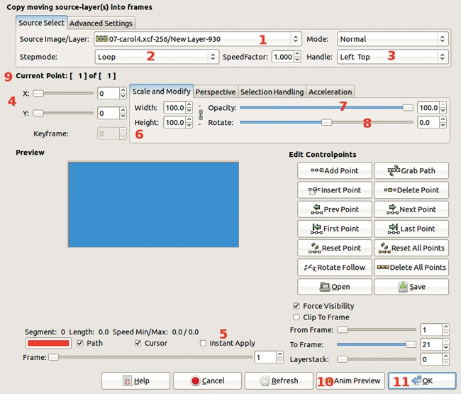

图 6-10. 移动路径对话框

结果如图 6-8 所示。保持这个图像在 GIMP 中打开。

为了更好地组织工作空间，请在你用于存储图像的目录中创建一个名为`Carol`的新文件夹。你将把所有动画帧存储在该文件夹中。

通过从图层对话框中点击并拖动模型图像的背景图层缩略图到工具箱来创建第一个帧。将此图像（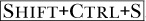）保存在新文件夹中，并命名为`carol-0001.xcf`。这是第一个帧的背景。

接下来，复制这个帧。最简单的方法是使用**图像：视频 > 复制帧**。如图 6-9 所示，出现的对话框中，将 N TIMES 滑块移到 20，并点击确定。GIMP 完成工作后，似乎什么也没发生，但如果你检查，你会看到新的帧已经在`Carol`文件夹中。我们只会处理第一个帧，所以现在忽略这些新帧。

GAP 插件中最有用的工具之一是**图像：视频 > 移动路径**。打开第一个帧`carol-0001.xcf`，然后调用移动路径工具。如图 6-10 所示，出现的对话框非常大，但不要慌张——在本教程中，我们只关注其部分功能。

使用 MOVE PATH 工具将图层（我们这里是从打开的模型图像中获取的图层）添加到动画帧中。移动是沿着通过各个点定义的路径进行的。在每个点上，你可以应用变换，例如混合模式、缩放、不透明度、旋转和透视等。若同时添加多个图层，你可以选择从模型图像中获取图层的方式。

我们在图 6-10 中添加了数字，这些数字与文本中的数字相对应，帮助你完成接下来的步骤。从当前打开的图像中，在 SOURCE IMAGE/LAYER 菜单中选择图层（1）。首先，选择框架图层。因为只有一个图层，所以从 STEPMODE 菜单（2）中选择 NONE。

路径点的坐标是根据在 HANDLE 菜单中选择的原点来确定的。选择 CENTER（3），然后将 X 和 Y 坐标（4）分别设置为 150 和 75。背景框中会出现一个红色的十字准线。要查看这个框，请勾选对话框底部的 INSTANT APPLY 框（5）。

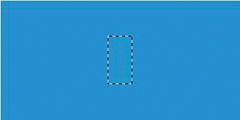

图 6-11. 添加矩形到第一个帧后

原始框架图层的特征为缩放（6）为 20.0%，不透明度（7）为 20.0%，旋转（8）为-90°。

现在你已经设置了第一个点，该点适用于第一个帧。通过点击“添加点”按钮，添加另一个点。注意，点的编号已更改（9）。对于这个点，它将成为最后一帧，图层的位置和不透明度发生变化，但点的坐标应该保持不变。将宽度（WIDTH）、高度（HEIGHT）和不透明度（OPACITY）设置为 100%，将旋转（ROTATE）设置为 0.0。动画的第一个图层现在已完成。

点击“确定”，GIMP 将处理各个帧。这个过程可能会花一些时间，具体取决于帧的大小和数量。当 GIMP 完成时，你将看到第一个帧，并且会有一个额外的图层：Logo 的矩形框处于其初始位置，见于图 6-11。

要添加第二个图层（文本），请再次使用“移动路径”工具。这次，选择模型图像中的文本图层。选择与前一个图层相同的 STEPMODE、HANDLE、X 和 Y 坐标、宽度（WIDTH）、高度（HEIGHT）和不透明度（OPACITY）值。勾选“即时应用”（INSTANT APPLY）以查看效果。

添加一个新点，并将宽度（WIDTH）、高度（HEIGHT）和不透明度（OPACITY）设置为 100%，但不要更改坐标。动画完成了！在保存之前，点击“动画预览”（ANIM PREVIEW）（10）。如图 6-12 所示的对话框将会出现。点击“确定”。GIMP 会生成一个缩略版本的动画，作为多图层图像，并且回放窗口已打开。虽然预览新动画很激动人心，但这不仅会花费一些时间，还会生成一个不必要的图像， clutter 你的工作空间。我们建议跳过此功能，直接点击“确定”（11）在“移动路径”对话框中。

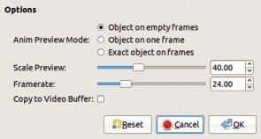

图 6-12. 动画预览对话框

一旦 GIMP 完成处理，所有动画帧都包含与模型图像相同的三个图层，但帧和文本图层逐渐发生变化。你可以通过选择 **图像: 视频 > VCR 导航器** 并点击“回放”按钮来查看这个动画。

假设你想将这个视频导出为 GIF 动画。为此，你需要将这个多图像动画转换为多图层动画，并合并每个帧中的图层。你可以使用 **图像: 视频 > 帧到图像** 来自动完成此操作，这会弹出图 6-13 所示的对话框。保持所有设置不变，点击“确定”。再次，GIMP 将进行一段时间的处理，最终创建一个新的多图层图像。通过在图层名称后输入 `(1000ms)` 来将最后一帧（最顶层图层）的持续时间设置为 1000 毫秒。然后，你可以通过 **图像: 滤镜 > 动画 > 回放** 来查看动画，或将其导出为 GIF 文件。

# 6.2 手动创建动画 GIF

在本章开始时，我们逐帧构建了一个动画，将每一帧作为图层放入一张图像中。以下是构建类似动画时可以作为指南的一般步骤列表：

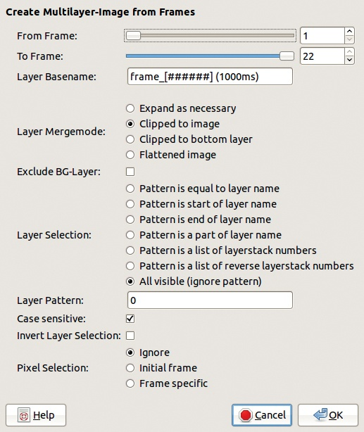

图 6-13. Frames to Image 对话框

1.  为动画创建一个静止的背景。

1.  创建另一个包含要移动的对象的图层；它可以从照片中剪切，使用绘画工具绘制，或输入为文本。

1.  对于对象的每个新位置，复制前一个图层并对新图层应用一些变换：移动、旋转、变形、放大或缩小，等等。进行这些操作时要小心，否则动画会显得卡顿。

1.  由于每个新图层必须替换前一个图层，因此每创建一个对象图层，都需要复制背景图层一次，并将这些副本插入到对象图层之间，然后将每个对象图层与背景图层合并。

1.  动画完成了！

你刚刚创建了一个简单的动画，其中一个对象沿着固定的背景移动。虽然你可以使用这种技术来动画化多个对象，但这个过程是笨拙和重复的。请记住，如果你在计算机上做重复的任务，那说明你没有以聪明的方式使用计算机。

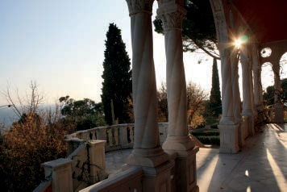

图 6-14. 背景图像

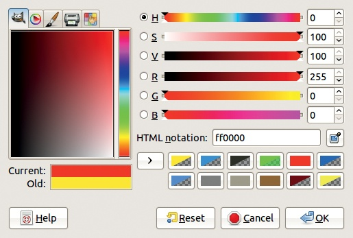

图 6-15. 第一个颜色的参数

在下一节中，我们展示了一些其他创建简单动画的方法。

## 绘制彩虹雏菊

第一个例子非常简单，因此不需要复制背景：图层逐步添加，以绘制雏菊的花瓣。

从图 6-14 所示的背景图像开始。

然后，我们用画笔工具手工绘制花瓣。我们每次绘制一个花瓣，且每个花瓣使用不同的颜色。为了更改颜色，我们只在花瓣之间按一定的幅度改变色相。背景相对较暗，因此我们选择一个明亮、饱和的颜色，从色相范围的一端开始，如图 6-15 所示。

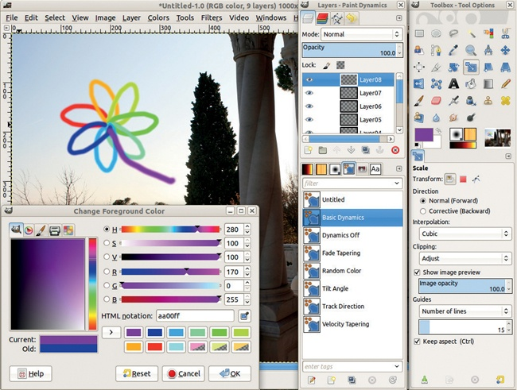

图 6-16. 添加花瓣后的工作空间

每个花瓣都有一个独立的图层。首先创建一个新图层。在弹出的对话框中，为图层名称添加一个编号。使用`Hardness 100`的画笔设置为小尺寸，在图像的左上角绘制第一个花瓣。

对于第二片花瓣，选择与第一片花瓣相同饱和度和明度的颜色，但色调不同。要改变色调，在右侧的 H 字段中设置新的值。色调值范围从 0 到 360。由于雏菊有七片花瓣，加上它的茎部，我们需要八种不同的色调。所以每增加一片新的花瓣，我们在前一个色调值的基础上加 40，创建新的图层，命名它，并在正确的位置绘制花瓣，直到整个雏菊完成。

当雏菊完成时，我们有九个图层，动画几乎完成。如果动画在开始和结束时暂停，效果会更好，因此在第一个和最后一个图层的名称后添加显式持续时间`(1000ms)`。

要测试动画，转到**图像：滤镜 > 动画 > 播放**。图 6-16 显示了带有图层对话框的最终图像。

请注意，播放窗口始终以图像的实际大小显示图像——如果你创建的动画包含一个比屏幕更大的图像，这可能会成为问题。当动画占据大部分屏幕时，点击窗口顶部左侧第四个按钮，将其从播放窗口中分离出来。

当你对动画满意时，可以将其导出为动画 GIF，参考方法一：逐帧动画。

## 朝向观察者缩放

第二个动画稍微复杂一些。这次，我们想让一个单词朝向观察者缩放。

我们从一张新的背景图像开始。选择文本工具，选择你喜欢的字体，设置较大的字号和亮眼的颜色，在图像上写上“Hello！”图 6-17 显示了结果，使用的是`FreeSans Bold`字体，字号为 140，颜色为亮红色。

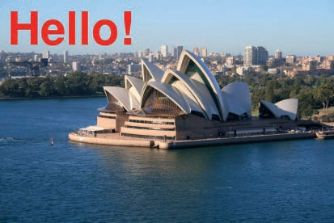

图 6-17. 向图像添加文本

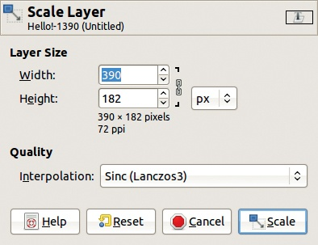

图 6-18. 缩放图层

接下来，我们构建该图层的多个副本，每个副本都有更小的缩放因子和更强的模糊效果。我们按相反的顺序构建图层，因此最后构建的图层是第一个显示的图层。为了构建平滑的动画，我们每次都按相同的幅度改变图层的高度，并使用相同的模糊系数。

复制文本图层，并处理下面的副本。使用**图像：图层 > 缩放图层**，将图层高度减少 20 像素（参见图 6-18）。然后选择**图像：滤镜 > 模糊 > 高斯模糊**，应用默认参数的模糊效果。如果你不确定参数是否已设置为默认值，可以通过**图像：滤镜 > 重置所有滤镜**来重置所有滤镜。

再重复这个过程四次，每次都在下方的文本层上工作（即刚刚被转换的那个层）。你可以通过按 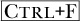 来加速过程，重复上次使用的滤镜。

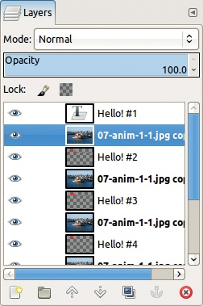

图 6-19. 带有文本和背景层的图层对话框

最终，你应该会有六个文本层。然而，目前你不能将这个图像用作动画，因为所有层都是可见的。解决方案是复制背景层，使每个文本层都有一个背景层。通过交替点击“DUPLICATE”按钮和“RAISE”按钮，在图层对话框底部，你可以快速创建出图 6-19 中所示的图层序列。

然后，通过选择**图层：右键点击 > 向下合并**，将每个文本层与下方的背景层合并。保持背景的一个版本位于图层堆栈的底部，以便动画从原始背景开始。最终的图层序列如图 6-20 所示。

我们的动画几乎准备好了。由于我们复制了背景层很多次，文件达到了 12MB，比较大。但实际上，很多背景内容是相同的，造成了冗余，因此我们可以在不丢失有价值信息的情况下减小文件大小。

GIMP 提供了一种减小文件大小的方法：应用**图像：滤镜 > 动画 > 优化（针对 GIF）**。该滤镜没有对话框，立即完成操作。它会生成另一个更小的图像文件：在我们的案例中，文件大小为 362KB。该滤镜将图像中不会变化的部分替换为透明，正如图 6-21 所示。由于动画中的文字没有在背景上移动，大部分背景保持不变，因此文件大小大大减少。

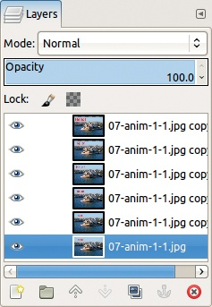

图 6-20. 合并文本和背景层后的图层对话框

图 6-21. GIF 优化后的第一层

优化工具还将图层替换模式`(combine)`添加到除了底部层之外的每一层。因此，新的图层不会替换原有图层，而是与之*合并*。在之前的动画中，我们使用了`(replace)`组合模式，这是默认设置。

在动画完成之前，我们还需要做两件事。首先，我们需要更改第一个和最后一个帧（底部和顶部图层）的时序，以使动画更流畅。由于优化过程自动添加了 100 毫秒的持续时间，我们必须通过为这两个图层的持续时间添加一个零，将其更改为`(1000ms)`。

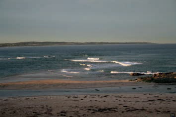

图 6-22。初始图像

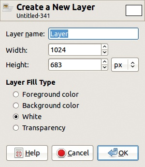

图 6-23。构建图层

最后，将完成的动画导出为 GIF 格式。

## 向景观中添加雨滴

这个动画很容易构建，且不到 10 分钟就能完成。如果你有一些编程知识，甚至可以通过创建脚本来自动化这个过程。

作为背景，我们使用图 6-22 中的照片，它是一张拍摄自澳大利亚新南威尔士北海岸的沙滩照片。我们想在这个景观上添加一些雨滴。

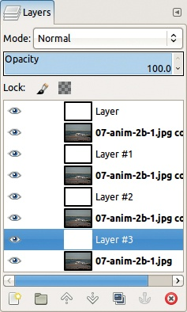

图 6-24。生成的图层对话框

将背景图像复制三次。现在你有四个图层。接下来，在每个背景图层上方添加一个新的白色图层（参见图 6-23）。生成的图层对话框如图 6-24 所示。

使用白色图层来制作雨滴。首先，使用**图像：滤镜 > 噪声 > RGB 噪声**，按照图 6-25 中的参数将噪声添加到白色图层。对每个白色图层执行此操作，选择该图层并按下。然后，应用**图像：滤镜 > 模糊 > 运动模糊**，使用图 6-26 中的参数将噪声转换为雨滴。对每个白色图层重复此过程。

动画几乎完成了。以下是剩余的步骤：

1.  将每个雨层的混合模式更改为“正片叠底”；请注意，其他混合模式也适用，例如“滤色”或甚至“颗粒合并”。

1.  将每个雨层与底层背景层合并（使用**图层：右键点击 > 合并向下**）。

    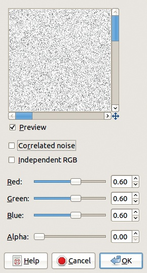

    图 6-25。创建雨滴：添加噪声

    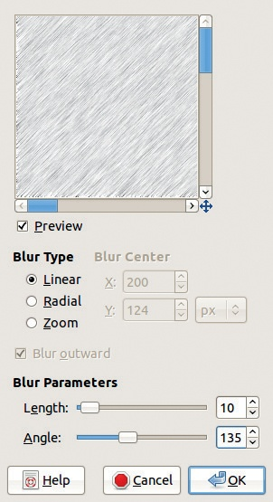

    图 6-26。创建雨滴：添加运动模糊

1.  使用**图像：滤镜 > 动画 > 播放**来测试动画。

1.  为 GIF 优化动画，并将其导出为动画 GIF。

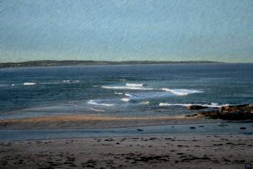

图 6-27。最终图像

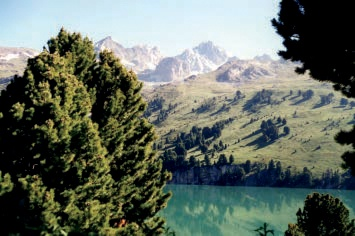

图 6-28。初始图像

最终结果出现在图 6-27 中。当然，实际的动画比显示的静态图像要有趣得多。要查看它，请访问本书的官方网站（*[`the-book-ofgimp.blogspot.com`](http://the-book-ofgimp.blogspot.com)*）。

## 向景观中添加雪

你可以使用类似的过程向图片中添加雪。为了展示更多可用工具，在这个示例中，我们应用了一些替代方法来获得结果。在 GIMP 中，你通常会发现许多不同的方法来完成给定的任务。

我们从图 6-28 所示的图像开始，这是一张在法国北阿尔卑斯山拍摄的照片。我们通过再次应用**图像：滤镜 > 噪声 > RGB 噪声**来制造雪，但这次是在一个新的透明图层上。为了将噪声应用到透明图层，请确保取消勾选“相关噪声”，然后将 ALPHA 游标移动到 100。

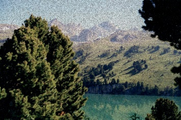

图 6-29。应用噪声滤镜

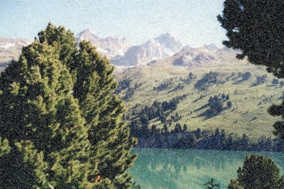

图 6-30。反转图层

雪是黑色的，如图 6-29 所示。在前面的示例中，我们在将混合模式更改为“正片叠底”时调整了雨的颜色。这次，我们使用**图像：颜色 > 反转**将雪变成白色，如它应有的样子（参见图 6-30）。

现在，我们想让雪在景观上缓慢下落。首先，复制雪层，然后应用偏移工具：选择**图像：图层 > 变换 > 偏移**，或者按 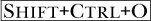。设置一个小的正 Y 偏移量——大约 10。勾选“环绕”框，否则雪会从图像顶部消失（参见图 6-31）。

复制这个偏移副本，再次对副本进行偏移工具操作。重复这个过程几次。

如方法二：过滤所有图层所示，复制背景，将副本添加到每个雪层下方，并将每个雪层与下面的背景副本合并。结果是一个可用的动画。

图 6-31。偏移对话框

为了让雪花优雅地飘落，我们必须生成许多图层，并且我们需要对前一层的雪花应用相同的 Y 偏移量。一部顺畅的动画至少需要 30 帧。在为静态图像添加动画和 18.4 移动路径工具中，我们向您展示了两种自动生成这些图层的方法，节省了大量时间。

# 6.3 使用动画工具

GIMP 提供了许多工具和滤镜来创建动画。在本节中，我们将向您展示其中的一些工具。

## 交互式变形

使用这个工具和稍微的努力，您可以创造出令人印象深刻，或者至少是有趣的动画。

基本上，我们将扭曲一张现有的图片，然后自动生成动画的中间层。为此，我们需要引入之前用来扭曲静态图像的工具的额外功能。

我们从一张相当严肃的女孩的照片开始，见图 5-1 中的第一张。我们的动画将让她以一种傻乎乎、夸张的方式微笑。首先，使用模糊选择工具选择面部。

选择 IWarp 工具：**图像：滤镜 > 扭曲 > IWarp**。如图 6-32 所示，弹出对话框。选择移动变形模式，并选择一个小的变形半径，例如 10 像素。使用鼠标指针，或者如果有的话，使用手写板笔，轻轻地向上和向外拖动嘴巴两侧。增大变形半径，然后稍微向下移动下唇，稍微向上移动上唇。您还可以稍微向下移动下眼睑，并轻轻拉伸眼角。这款工具没有真正的撤销功能，但如果您犯了错误，可以使用移除变形模式来纠正您刚刚做的修改。

我们可以使用此工具来更改静态图像。不过，如果我们点击 ANIMATE 标签，我们可以自动生成动画。将帧数设置为 20，并勾选 PING PONG 框。动画的额外层将在您点击 OK 后由 GIMP 生成。

与之前的动画一样，调整图层的时序，优化图像以适应 GIF 格式，然后将图像导出为 GIF。

## 为静态图像添加动画

在本章前面，我们使用了“过滤所有图层”工具从一个多图层图像制作动画（见方法二：过滤所有图层）。过滤所有图层也可以用于对现有动画的所有帧应用系统性的更改。该工具通过对所有图层应用过滤器来工作。您可以设置过滤器参数的初始值和最终值，如果这两个值不同，工具会通过逐步变化参数从起始值过渡到最终值，从而过滤每一层。

GIMP 中大多数可用的滤镜可以逐步应用到图像的各个图层上。你甚至可以连续使用多个不同的滤镜，依次应用“滤镜所有图层”工具。

为了演示，我们将对图 6-33 中显示的 Olivier 的暹罗猫图像进行动画处理。因为她的名字是 Aria，所以将第一个图层的名称更改为`Aria #1`。将图层复制 39 次，后续的图层会自动命名并编号，从 1 到 40。

图 6-32. IWarp 对话框

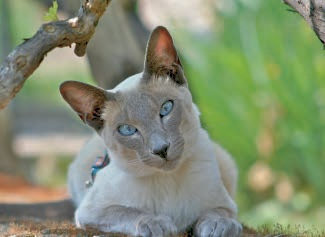

图 6-33. 初始图像

要在“滤镜所有图层”工具中选择映射滤镜，请在搜索框中输入`map`，然后点击“按名称搜索”。选择`plug-in-map-object`滤镜，然后点击“应用”。

将图像映射到平面上，然后在`Orientation`选项卡中修改 Y 值。我们希望图像围绕垂直轴旋转并完成 360 度的旋转，因此将 Y 值更改为–180，如图 6-34 所示（此时是点击了“预览”后拍摄的！）。点击“确定”，第一次图层转换后，会弹出一个小对话框。

点击“继续”。如图 6-35 所示，将 Y 旋转更改为+180°。点击“确定”，在继续对话框中输入文件名，然后点击“继续”。由于图层数量较多，整个过程需要较长时间才能完成。在生成的动画中，Aria 围绕垂直轴旋转，如图 6-36 所示。

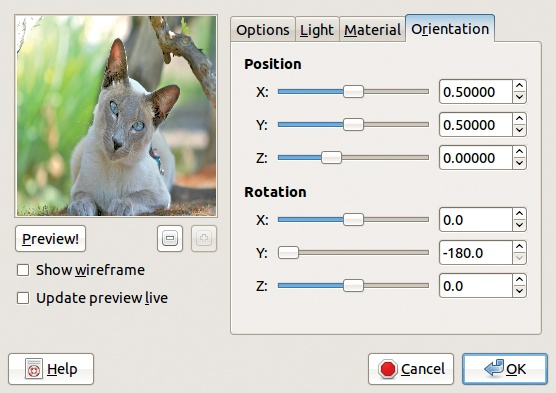

图 6-34. 第一个滤镜的参数

现在我们想对所有图层应用第二个滤镜。我们使用相同的参数对每个图层应用滤镜 PLUG-INAPPLYLENS。通过“滤镜所有图层”应用滤镜，并点击“应用”按钮，得到图 6-37。保持参数不变，点击“确定”。与之前显示的对话框相同，这次保持参数不变。结果显示在图 6-38 中。

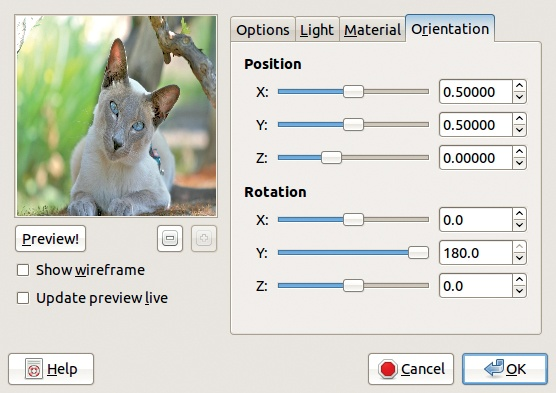

图 6-35. 第二个滤镜的参数

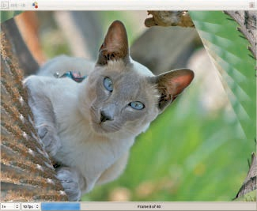

图 6-36. 第一个动画

你可以使用“滤镜所有图层”工具搭配超过一百个滤镜。但该工具也有一些限制：

+   尽管工具界面列出了所有滤镜，但我们偶尔会遇到某些滤镜无法正常工作。如果滤镜不起作用，你不会看到通常会出现的连续对话框。这种差异发生的原因是每个滤镜必须由程序员进行调整，才能与“滤镜所有图层”配合使用，而有时滤镜会在没有必要调整的情况下发布。如果遇到这个问题，你只能耐心等待更新。与此同时，你可能能找到其他类似的滤镜，它能够与该工具正常配合使用。

+   尽管“滤镜所有图层”可以与多种滤镜一起使用，但该工具本身相当简单，只执行一个基本功能：它在初始图像和经过滤镜变换后的图像之间生成平滑过渡。

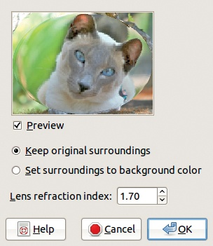

图 6-37。第二个全局滤镜的参数

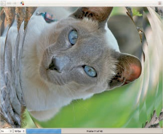

图 6-38。最终动画

## 变形

下一个工具使用起来很简单，但如果参数设置正确，会产生非常有趣的效果。Morphing 工具位于 **图像：视频 > 变形 > 变形** 菜单中，主要功能是将给定图像逐渐转换为另一幅图像。通常，当两幅图像有相似之处时，这个效果最佳。请注意，这个工具也是 GAP 的一部分，因此你需要安装这套插件才能使用它。

为了演示这个工具，我们将把一张肖像变形为另一张肖像。这两张肖像是在同一天、相同条件下拍摄的。如 图 6-39 和 图 6-40 所示，这两位女孩的年龄相同，都是金发碧眼，穿着黑色衣服，拍摄时背景也相同。但她们的面部、发型、穿着风格以及头部倾斜角度都不同。

图 6-39。第一张肖像

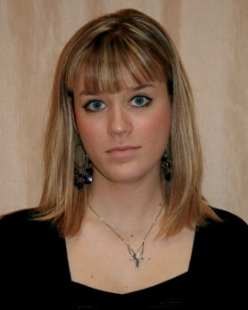

图 6-40。第二张肖像

将两幅图像作为图层打开到一个新图像中，例如，通过将其中一张肖像的缩略图拖到工具箱中创建一个新图像，然后将第二张肖像的缩略图拖入刚创建的新图像中。通过调整不透明度将顶部图层设为半透明，然后稍微移动它，确保两位女孩的肩膀和面部对齐。裁剪图层，使它们的大小相同。图 6-41 显示了结果，顶部图层仍然是半透明的。

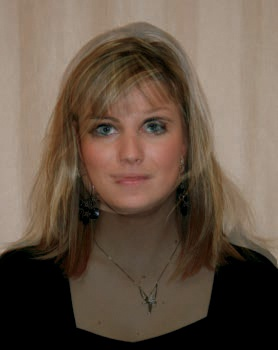

图 6-41。肖像作为图层

在使用形变工具之前，两个图层*必须*具有 Alpha 通道：**图层：右键点击 > 添加 Alpha 通道**。添加 Alpha 通道后，图层名称在图层对话框中不再是粗体显示。

现在选择形变工具。它的对话框很大，包含许多组件，但你只需要使用其中的几个。形变工具的目的是逐步将源图像（显示在对话框的左侧）转换为目标图像（显示在对话框的右侧）。这里，较低层作为源图像，但如果你愿意，可以更改此设置。选择适当大小的图像，以便它们在预览窗口中按正确的比例显示。

形变过程使用放置在源图像上的点和放置在目标图像上的相应点。通过动画，源图像中的每个点及其相邻像素被移动到相应点的位置。

首先，在两张图像的边界周围放置*形状点*，以防止图像框架出现奇怪的变形。保持默认的数量 64 不变，然后点击“形状”按钮。现在，图像的轮廓已对应。

接下来，我们将形状点添加到源图像上，并移动目标图像上的相应点。点击第一张图像中的某个特征，出现一个黄色点，目标图像上也会出现一个相应的黄色点。我们在鼻尖、眼角、嘴巴周围、下巴和头发等位置添加点。你可以在添加形状点时尝试不同的编辑模式。例如，你可以移动现有的形状点，删除它们，或者放大或缩小以放置难以放置的形状点。

添加形状点后，我们唯一更改的参数是步骤数。这个值表示将在源图像和目标图像之间构建的中间图层数量。我们建议至少设置 20 步——如果两个图像差异很大，可以增加步骤数。

最后，点击确定。大对话框消失，GIMP 开始创建新的图层。根据图像的大小和步骤数，这个过程可能需要一些时间。当 GIMP 完成时，图像已经准备好进行测试，方法是使用**图像：滤镜 > 动画 > 播放**。我们建议你增加第一帧和最后一帧的持续时间。

最好的效果是图像相似度较高且形状点已仔细放置时获得的。图 6-42 和图 6-43 分别展示了我们 22 帧动画中的第 7 帧和第 14 帧。由于头发和服装风格不同，这些特征的形变看起来不自然，但面部形变平滑。

为了完成动画，请优化为 GIF 格式，然后将图像导出为动画 GIF。

# 6.4 使用 GAP

在方法二：过滤所有图层和方法三：沿路径移动中演示的两个简单的 GAP 示例只是对这个复杂且强大的插件的简要介绍。实际上，GAP 根本不是一个插件，而是一个包含多种动画相关插件的集合。大多数插件（但不是全部）可以在**图像：视频**菜单中找到。

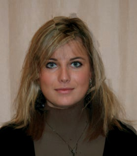

图 6-42. 动画的第 7 帧

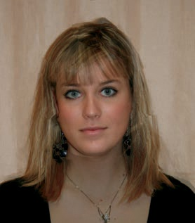

图 6-43. 动画的第 14 帧

在本节中，我们只考虑菜单中找到的插件。这些插件（除了形态子菜单中的插件）都处理多图像动画，而不是我们在之前的所有示例中创建的多层动画（请参见方法三：沿路径移动）。

多图像格式非常适合构建和操作大型复杂动画。它允许您转换为和从流行的视频格式（如 MPEG）进行转换。必要时，GAP 还可以在多图像和多层动画格式之间进行转换。所有这些优点使得这一套插件在很大程度上成为了一个完整的视频处理工具，嵌入在 GIMP 中。

## 移动路径工具

“移动路径”工具（**图像：视频 > 移动路径**）是 GAP 的主要界面。如您在方法三：沿路径移动中所学，您首先需要按照以下步骤操作：

1.  在 GIMP 中至少打开一个多层或多图像的动画。该图像将作为您添加到动画中的图层源；您可以选择打开多个图像。

1.  创建一个新文件夹来存放新的动画。

1.  在此文件夹中为新动画放置一个背景图像。可以将其命名为*name*`-00001.xcf`。

1.  在 GIMP 中打开这个背景图像，并使用**图像：视频 > 复制帧**进行复制。复制的数量应等于所需的帧数。

1.  打开源文件和背景文件后，从动画的源图像中选择“移动路径”工具。

如果在打开“移动路径”工具之前没有正确设置环境，工具会报错并拒绝工作。请注意，您可以使用现有的多图像动画作为背景，而不是像我们一样创建一个。在这种情况下，只需打开源动画（步骤 1），然后打开背景动画，之后就可以打开“移动路径”工具了。

“移动路径”工具将源图像中的图层添加到目标动画的一系列帧中。通过修改多个参数，你可以定义图层如何添加到帧中。基本上，你需要在目标动画中定义*位置*（即相对位置）；对于每个位置，定义以下参数的值：

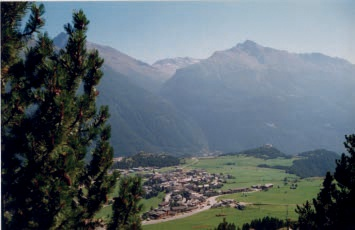

图 6-44. 初始景观

+   位置

+   方向

+   X 和 Y 轴缩放

+   不透明度

+   透视

然而，如果源图像有一个活动选择区域，你也可以选择只将选择区域添加到新动画中。

你可以使用“移动路径”工具通过为连续帧中的图层构建复杂的路径来制作多个场景的动画，并仅对与特定场景对应的帧进行更改。

最后，这一点很重要，若要向目标帧添加多个图层，请多次使用“移动路径”工具——每个图层一次。

我们将通过两个新的示例，演示这个工具可以实现的一些巧妙功能。

## 双筒望远镜动画

首先，我们制作一个模拟某人通过双筒望远镜观察场景并移动望远镜寻找目标的动画。场景是一个被山脉环绕的村庄，如图 6-44 所示。

我们添加了双筒望远镜作为一个新图层，除了两个重叠的透明圆圈外，整个图层是完全黑色的。以下是创建双筒望远镜的步骤：

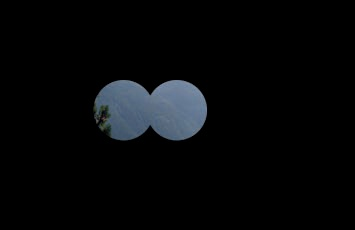

图 6-45. 添加双筒望远镜

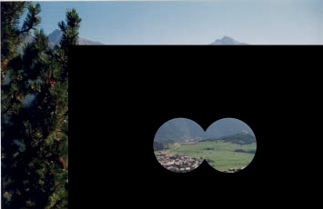

图 6-46. 移动双筒望远镜

1.  创建一个新的透明图层。

1.  构建一个圆形选择区域。

1.  将其保存为通道（**图像：选择 > 保存到通道**），然后再次选择该图层。

1.  将选择区域水平移动一个大约是其直径三分之二的距离。

1.  在通道对话框中，将保存的通道添加到当前选择中。

1.  将新的双筒望远镜选择保存为通道。

1.  选择图层选项卡上的顶层，反转选择，并填充为黑色。

结果应该类似于图 6-45。

在我们的动画中，我们让双筒望远镜在景观中移动。但目前两个图层的大小相同，所以当望远镜移动时，黑色区域不会完全覆盖背景，造成类似于图 6-46 的效果。为了避免这种情况，我们需要放大顶层以覆盖整个景观。

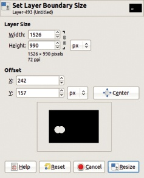

图 6-47. 放大上层

选择**图像: 图层 > 图层边界大小**，在两个方向上增大大小，并将画布居中于放大的图层，如图 6-47 所示。然后将整个图层变为黑色，除了双筒望远镜窗口之外。由于该图层现在比画布大，因此这个步骤有点棘手。这里有一种方法：

1.  如果还没有，将双筒望远镜的选择保存到通道中，然后返回到图层并取消选择。

1.  选择**图像: 图像 > 适应画布到图层**。

1.  使用前景色填充图层 ()。

1.  恢复保存在通道中的选择，返回到图层，并清除选择内容 (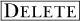)。

1.  取消选择。

因为我们放大了图像，所以在处理结束时需要裁剪它。

现在为动画创建一个新文件夹，命名为`Binoculars`。将图层对话框中的背景图层缩略图拖到工具箱中，并将图像保存为`bin-0001.xcf`，保存在新建的`Binoculars`文件夹中。

使用**图像: 视频 > 复制帧**，将该帧复制 59 次。动画现在有 60 帧。我们使用路径将双筒望远镜在景观中移动。在工具箱中选择路径工具 ()，然后点击添加点到你刚刚保存的背景图像中，如图 6-48 所示。

图 6-48. 穿越景观的双筒望远镜路径

图 6-49. 将路径作为控制点序列导入

选择移动路径工具 (**图像: 视频 > 移动路径. . .** )。在对话框中，检查所选图层是源图像的顶部图层，缩略图中大部分为黑色。对于 STEPMODE 选择“无”（None），对于 HANDLE 选择“居中”（Center）。

点击对话框中“编辑控制点”（EDIT CONTROLPOINTS）区域的“抓取路径”按钮，将我们刚刚构建的路径导入为控制点序列，这些控制点在 60 帧中均匀分布。然后，对话框应该类似于图 6-49。

GAP 插件没有撤销功能，因此请通过点击“动画预览”（ANIM PREVIEW）检查你刚刚构建的动画。如果一切正确，点击“确定”生成最终的动画。丢弃为预览创建的多图层图像。

## 改善双筒望远镜动画

虽然这确实作为了一个使用“移动路径”工具的路径基础介绍，但我们刚刚创建的动画并不非常真实。如果你通过望远镜观看，移动的应该是横向图像，而不是你。

如果你关闭了它，打开你刚刚制作的望远镜动画。为下一个版本的动画创建一个新文件夹，然后创建一个比源图像中的横向图像小得多的新空白图像。对于这个示例，我们创建了一个 521 × 338 的图像，而我们的横向图像是 1042×676。将此图像保存到新文件夹中，命名为`bin-0001.xcf`，并使用**图像：视频 > 重复帧**将其复制 59 次。

打开“移动路径”工具对话框（**图像：视频 > 移动路径**）。选择前一个动画的横向层作为源层（对话框的左上角），将 STEPMODE 设置为 None（在 SOURCE IMAGE/LAYER 下方），将 HANDLE 设置为 Center（在 STEPMODE 右侧），并勾选对话框底部的 INSTANT APPLY。接下来，让我们通过点击预览区添加点来在“移动路径”工具对话框中构建路径。点击“添加点”，然后点击预览区以添加新点。如果你点击现有点附近，你会移动那个点，而不是添加新点，所以点击最后一个点并拖动它来添加新的点。注意，随着你放置点，源图像会发生移动。我们的结果显示在图 6-50 中。

在最终确定此动画之前，勾选“CLIP TO FRAME”复选框，然后点击“确定”。GIMP 会处理一段时间，构建动画的第一部分，横向图像在较小的图像中移动。你可以通过选择**图像：视频 > 播放回放**来测试结果。

图 6-50. 手动创建路径

图 6-51. 放置第二层

现在将望远镜放置在这些横向帧的上方。使用图层蒙版。使用“移动路径”工具再次将蒙版作为新图层添加到所有帧中。图 6-51 显示了我们使用的设置。选择望远镜层作为源层并将其放置在图像的中央。

只需点击“确定”即可获得新动画。每一帧包含三个图层——从上到下分别是：望远镜图像、横向图像和白色背景。我们想要将最上层与背景合并，并使用合并后的图层作为横向图层的蒙版。这不仅减少了图层数量，同时也演示了**图像：视频 > 帧修改**工具的使用。

图 6-52. 降低最上层

图 6-53. 合并两个底部图层

“修改帧”工具非常方便，用于修改多图层动画中所有帧的图层。对话框如图 Figure 6-52 所示，显示了我们的第一次选择。点击对话框顶部的 FUNCTION 菜单，选择 LAYER STACKPOSITION >LOWER LAYER(S)。保持勾选“PATTERN IS A LIST OF LAYER STACK NUMBERS”，并为 LAYER PATTERN 输入 0。点击 OK。

图 6-54. 使用底部图层作为图层蒙版

接下来我们合并两个底部图层。再次选择“修改帧”工具，这次选择图 Figure 6-53 中显示的设置。因为图层是从上到下按 0 开始编号的，所以图层顺序是“1 2”。合成后的图层命名为 `Background`。

最后一步如图 Figure 6-54 所示。底部图层作为景观图层的蒙版。

# 6.5 练习

**练习 6.1.** 你知道那些在某些网页上不断闪现让人恼火的广告吗？制作一个广告，其中的标志会逐渐消失和出现。完全手动制作。

**练习 6.2.** 制作与前一个练习相同的闪烁标志，但这次使用“过滤所有图层”工具。

**练习 6.3.** 如果你有两个具有相同背景的多层动画，创建一个合并这些图层的动画很简单。使用这个思路制作一个动画，其中标志首先逐渐从背景中显现出来，然后在前景中闪烁。你可以手动制作或使用“过滤所有图层”工具。

**练习 6.4.** 使用 IWarp 工具制作一个摄影肖像的动画。你可以获得一个美学效果，但更可能的是你会得到一个有趣的效果。所以，使用这个工具在你非常熟悉的某个人的肖像上制作，比如你自己。

**练习 6.5.** 使用 Morphing 工具制作一个动画，其中一个标志逐渐变换成另一个标志。两个标志应该是相同大小的。

**练习 6.6.** 使用移动路径工具制作一个动画，其中一个标志在背景上水平移动。

**练习 6.7.** 你可以使用移动路径工具将多层动画中的连续图层添加到你正在制作的动画中，实际上是通过使用 LOOP 作为 Stepmode 来合并两个不同动画的内容。用这个思路创建一个标志，标志在水平方向移动，同时闪烁。

**练习 6.8.** 重新创建本章第三个练习中的动画，方法三：沿路径移动，但这次使用在**图像：视频**菜单中找到的工具。首先，你必须使用“过滤所有图层”工具构建两个多层动画，然后将这些动画从多层转换为多图像。编辑它们以生成最终的动画。
