# 第七章 图像预处理

图像预处理在科学成像中最常用于在分析有意义内容之前去除图像中的噪声和失真。例如，科学家们在使用卫星图像进行研究之前，会对图像进行预处理，以去除大气杂物和云层等干扰。即使你不是科学家，你也可能想要预处理你的图像，因为这些技术可以帮助你修正失真、改善色彩平衡并增强可见度。

# 7.1 教程：从图像中提取信息

那么，如何从图像中分离噪声和有意义的元素呢？一种方法是通过直方图收集图像的信息，以查看各个通道是否存在失真。我们将在本教程中使用的图像并不特别有趣，但它代表了在处理拍摄质量差的照片时可能遇到的问题。如图 7-1 所示，这张照片的质量非常差。该照片是通过一个关闭的窗户拍摄的，光线较差，并且使用了相机的自动设置。

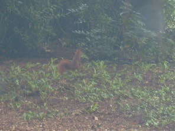

图 7-1. 初始照片

## 动态范围扩展

首先，收集图像动态范围的信息，例如不同通道中最小值和最大值之间的比率。图 7-2 中显示的合并直方图是可视化图像动态范围的一种方式。通过**图像：颜色 > 信息 > 直方图**打开它们，并将 CHANNEL 改为 RGB。三个通道——红色、绿色和蓝色——以各自的颜色显示在同一图表中。在直方图重叠的区域中，颜色是相加的。水平轴上的位置代表 0 到 255 之间的一个特定值。直方图的高度（纵轴）表示具有该值的像素数量。

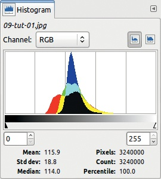

图 7-2. 初始照片的直方图

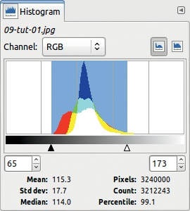

图 7-3. 直方图中的有意义部分

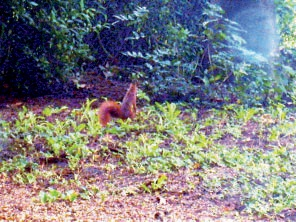

图 7-4. 均衡化后

将小三角形移动到水平灰度条下方，框定有意义的数值区间。图 7-3 显示，几乎没有像素值小于 65 或大于 173。实际上，99.1% 的像素都在框定的区间内，这也解释了为什么图像看起来昏暗且模糊。

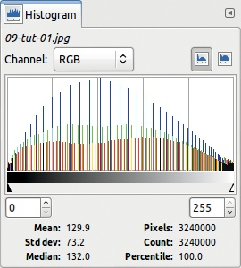

图 7-5. 归一化后的直方图

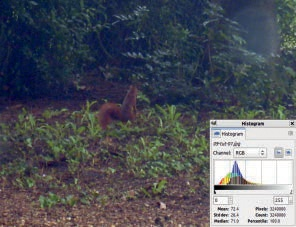

图 7-6. 拉伸对比度后的图像

扩展动态范围在 GIMP 中是相当简单的。最简单的工具是**图像：颜色 > 自动 > 归一化**，它会自动将每个通道的动态范围拉伸到整个可用范围。图 7-4 展示了结果，图 7-5 展示了相应的直方图。因为图像中只有略多于一百个不同的值，而范围有 255 个值，将现有值拉伸到整个范围会留下很多未被表示的值，这解释了奇怪的“梳子”形状。

在生成的图像中（图 7-4），你可以看到松鼠更加明显，但图像中的颜色失真被夸大了。

同一个菜单中包含其他自动化工具。例如，图 7-6 展示了使用**图像：颜色 > 自动 > 拉伸对比度**后的图像及其直方图。你也可以尝试**图像：颜色 > 自动 > 归一化**，它会给出类似的结果。

图 7-7. 使用“自动”功能后的图像

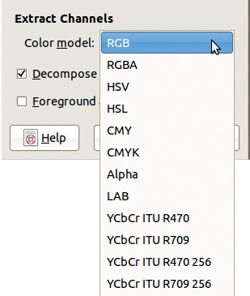

图 7-8. 提取 RGB 通道

在“等级”工具中按下 AUTO 按钮，会得到图 7-7 中显示的图像。你也可以通过使用**图像：颜色 > 曲线**来操作每个颜色通道的曲线，抑制照片中不存在的高低值，从而获得类似的效果。

## 直方图修改

前面提到的直方图不太有用，因为它们被挤在一个窗口中，而且它们在图像中的意义并不明显。更好的方式是使用**图像：颜色 > 组件 > 分解**来可视化三个通道。在图 7-8 中显示的对话框中，选择 RGB 将图像分解为三个 RGB 通道。创建一个新的图像，其中有三个灰度层，每个通道对应一个层。在直方图窗口中，选择“值”通道，这会自动完成，因为图像没有颜色或透明度。

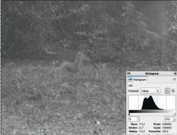

图 7-9. 红色通道

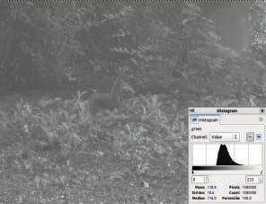

图 7-10. 绿色通道

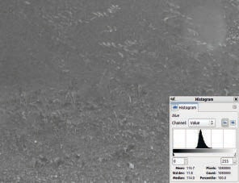

图 7-11. 蓝色通道

图 7-9 到图 7-11 显示了三个通道及其各自的直方图。显然，蓝色通道对图像的贡献远远小于其他两个通道。我们来看一下，如果你拉伸蓝色通道的直方图，而保持其他通道不变，会发生什么。

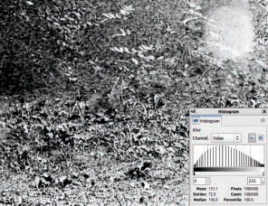

图 7-12. 拉伸蓝色图层的动态

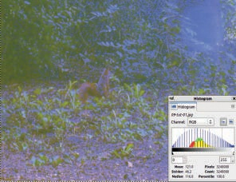

图 7-13. 重新组合后的图像

在“图层”对话框中选择蓝色图层，然后应用**图像：颜色 > 自动 > 均衡化**。结果是，如果你隐藏其他两个图层，效果如图 7-12 所示。接下来，应用**图像：颜色 > 组件 > 重新组合**。结果如图 7-13 所示，比原始图像更差。此图像演示了，适当的预处理需要对图像动态有更深的理解，而不仅仅是会使用自动工具。

## 噪声减少

噪声是一种围绕图像某一区域平均强度值的小幅波动。如你在本章稍后看到的，噪声减少在许多情况下是有用的。但在目前的情况下，图像主要是噪声，任何噪声减少过程都无法真正改善它。唯一稍微有用的工具是**图像：滤镜 > 增强 > 锐化掩模**，它会弹出如图 7-14 所示的对话框。

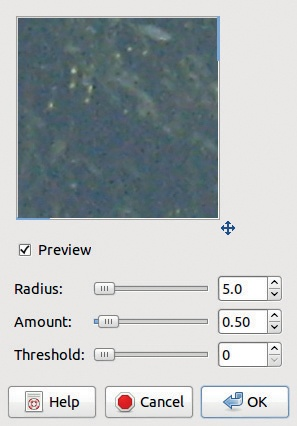

图 7-14. 锐化掩模对话框

图 7-15. 使用“锐化掩模”后的效果

如果你将半径（RADIUS）增加到 40 以上，图像会稍微有所改善，如图 7-15 所示。松鼠更加明显，立体感增强，但背景中的大部分植物依然很难辨认。

## 边缘检测

通常，边缘检测增强了照片中物体的可见性。但是当我们将**图像：滤镜 > 边缘检测**菜单中的各种滤镜应用到最初的松鼠照片时，并没有看到任何改善。通过依次应用几种不同的工具，你可以获得更好的效果。

例如，首先选择“Levels”工具，然后点击“AUTO”。接下来，应用“Unsharp Mask”滤镜。最后，选择**图像: 滤镜 > 边缘检测 > 边缘**滤镜。使用图 7-16 中显示的设置，您将得到图 7-17 中所示的结果。诚然，如果您的目标是创建一张反映松鼠栖息环境的真实图像，那么这个版本并没有真正的改善。您可以尝试将最后一个滤镜应用到图层的副本上，然后调整混合模式，以获得更自然的效果。

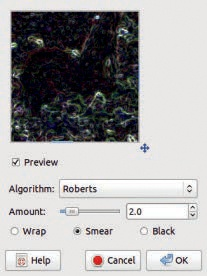

图 7-16. 边缘滤镜对话框

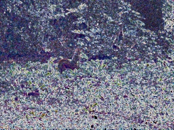

图 7-17. 使用 Roberts 边缘检测滤镜后的效果

# 7.2 预处理的原理

在本节中，我们将向您介绍预处理的一般原理。

## 预处理的主观方面

图像预处理增强了我们在图像中感兴趣元素的可见性。换句话说，目标是尽可能忠实地恢复原始信息。一般来说，预处理方法使得同一区域的像素更加相似，或者增加不同区域间像素的差异。但要准确定义“区域”到底由什么构成是困难的。

如本章开头所述，预处理在科学成像应用中的使用比在创建装饰性图像或娱乐照片时更为常见。如果一位摄影师想要修饰他为演员拍摄的人像，他可能会使用第二章和第五章中的技术，而不是本章中的技术。擦除皱纹或瑕疵不需要太多信息，只需要稳健的手法和一点时间。

相反，生物学家通常希望从*显微照片*（通过显微镜拍摄的照片）中提取尽可能多的信息。如果他们想要增强图像质量，他们不能使用会降低图像信息的技术。这对于通过卫星拍摄照片的情报人员或通过望远镜拍摄照片的天文学家也是一样的。

本章中使用的技术改变了图像的外观，使得您可以更轻松地从中提取信息。它们移除无用和有害的信息（即噪声），以增强有意义的信息。

改善图像的想法是一个高度主观的过程。但人眼对高对比度特别敏感，因此我们在此介绍的技术通常旨在提高图像的对比度，因为这是改善场景可视性的最佳方法。

尽管本章的吸引力比前几章要狭窄，但我们认为这里介绍的技巧对几乎所有使用 GIMP 处理照片的人都有帮助。特别是噪声减少和边缘检测技术具有广泛的应用。此外，这些信息将帮助你更全面地理解 GIMP 的功能，这在你最不期望的时候可能会派上用场。

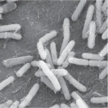

图 7-18. 细菌显微照片

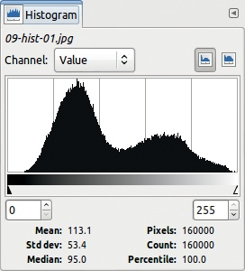

图 7-19. 图 7-18 的直方图

## 直方图和通道分解

图像预处理的主要目的是获取有助于使图像更易读的信息。当你使用图像直方图进行调整时，你实际上是在改变单个像素的强度。这种转换不会改变区域的形状，但可以改变它们的纹理、颜色、亮度或与周围环境的对比度。

图 7-18 是一张用显微镜拍摄的细菌灰度照片。图 7-19 显示了其对应的直方图。在这张图片的 160,000 个像素中，有 1684 个像素的值为 77，位于 0 到 255 的区间内。

选择“Levels”（等级）工具，并调整图像的唯一等级，如 图 7-20 所示。结果显示在 图 7-21 中，带有直方图。此时直方图跨越了整个范围，但并不是所有的值都被表示出来，因为离散颜色的总数少于区间 [0:255] 的长度。对比度得到了提高， resulting 图像更易读。

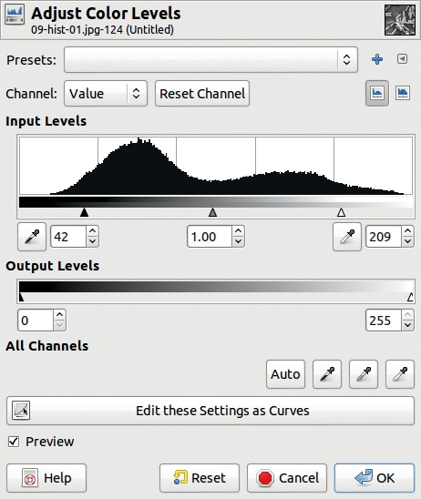

图 7-20. 改善值动态

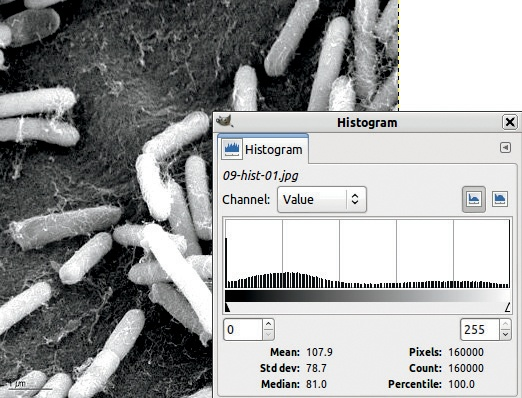

图 7-21. 改进后的效果

图 7-22 显示的是一张彩色的人类血液显微照片。图 7-23 显示了这张图像的组合直方图。你可以看到这些直方图每个都有两个不同高度和位置的峰值，具体取决于所选的通道。红色通道比其他两个通道的高值范围更广，但没有一个通道能完全达到 255。

你可以通过使用**图像: 颜色 > 组件 > 分解**将图像分解为三个通道，从而获取更多信息。从出现的对话框中（图 7-24），选择第一个颜色模型——RGB。保持选中“分解为图层”选项，然后点击确认。一个新的图像将被创建，每个通道对应一个图层。每个图层都是相应通道的灰度表示。例如，图 7-25 展示了红色通道图层。

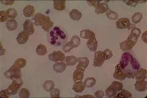

图 7-22. 人类血液的显微照片

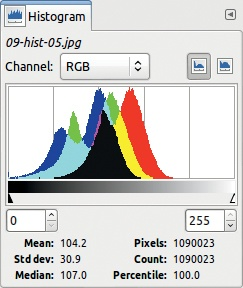

图 7-23. 图 7-22 的合并直方图

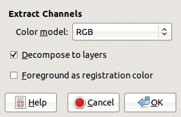

图 7-24. 分解工具对话框

改善这些通道的一个有用工具是**图像: 颜色 > 曲线**。当你将其应用到对应红色通道的图层时，你将看到图 7-26。点击曲线右上方的小按钮，打开对数直方图。在这个直方图中，垂直条形的高度与像素数量无关：高度与数量之间的比例会随着高度增加而减少。在许多情况下，这种类型的直方图更容易阅读。

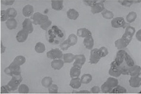

图 7-25. 图 7-22 的红色通道

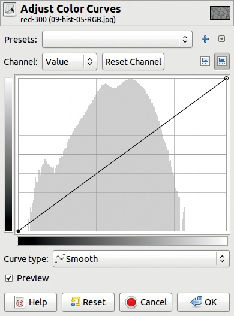

图 7-26. 调整红色通道

按照图 7-27 中所示的方式调整曲线，仅保留直方图中有趣的部分。图 7-28 展示了调整后的结果，并显示了相应的修改后的直方图。注意那些对应于未表示值的白色垂直条形。

对其他两个通道做同样的操作：选择相应的图层，选择曲线工具并调整曲线。完成这三个图层的调整后，选择**图像: 颜色 > 组件 > 重新组合**，该操作将使用分解图层中的三个通道的值重新构建原始图像。结果如图 7-29 所示，图像的 RGB 直方图已合并。图像变得更易读，生物学家现在可以看到并解读一些之前无法观察到的细节。

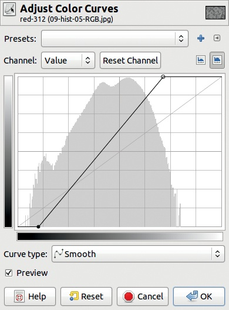

图 7-27。改变曲线

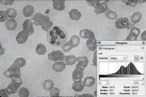

图 7-28。结果中的红色通道

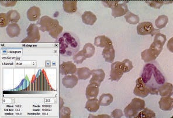

图 7-29。调整三个通道后

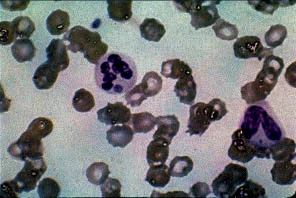

图 7-30。图像处理后：颜色 > 自动 > 均衡

图 7-31。图像处理后：颜色 > 自动 > 白平衡

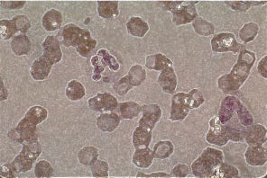

图 7-32。图像处理后：颜色 > 自动 > 色彩增强

## 通过动态扩展提取信息

在之前的教程中，我们使用了一些自动工具来扩展图像的动态范围，但效果并不理想。虽然在某些情况下它们可能有用，但显然你不应该依赖自动工具来调整图像的动态范围。在本节中，我们将在细菌的显微图像上使用几种自动工具，并得到一些有趣的结果。

图 7-30 到 图 7-35 展示了使用 **图像：颜色 > 自动** 菜单中的六个选项后的结果。在这种情况下，最佳选择不是个人喜好的问题，而是实用性的考量。将解读这张图片的生物学家会选择提供最多关键信息的变换。

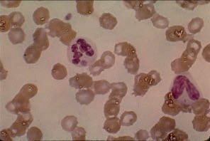

图 7-33。图像处理后：颜色 > 自动 > 归一化

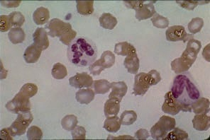

图 7-34。图像处理后：颜色 > 自动 > 拉伸对比度

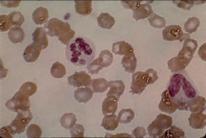

图 7-35。图像处理后：颜色 > 自动 > 拉伸 HSV

变换是全局的，无法进行参数化。它们对所有通道的作用相同，尽管拉伸 HSV 变换是在 HSV 模型上操作，而不是 RGB 模型。为了进行比较，图 7-36 展示了使用 Levels 工具中的 AUTO 按钮后的效果。该变换会分别作用于每个通道，移除直方图中的最低值，因此它会去除一些背景噪声，但也可能删除有意义的信息。

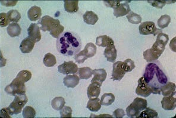

图 7-36。使用 Levels 工具中的 Auto 后

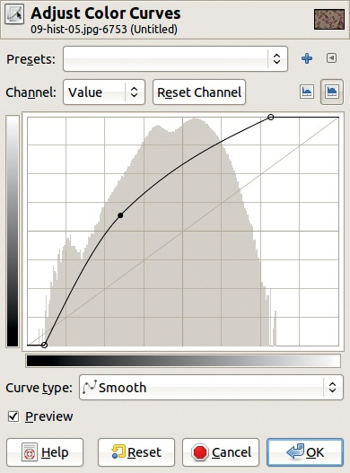

图 7-37. 增加灰度像素值（变暗）

接下来，尝试使用“Curves”工具进行一些更复杂的操作。只处理“值”（Value）通道（即灰度值），尽管您也可以分别处理三个颜色通道。在每个情况下，首先应用图 7-27 中显示的曲线修改，以去除未表示的极端值。

在从图 7-37 到图 7-44 的一系列图像中，您可以看到对每个曲线的修改、其效果（在每个图注中说明）以及结果图像。这些结果相当多样化，其中一些可能并不太有用。在这些最后的示例中，图像中通道之间的相关性以及整体色调得以保持。请注意，如果您在“Levels”工具中使用“自动”（AUTO）按钮，相关性将不会被保持。对于大多数用户来说，这没有区别。

图 7-38. 增加像素值的结果

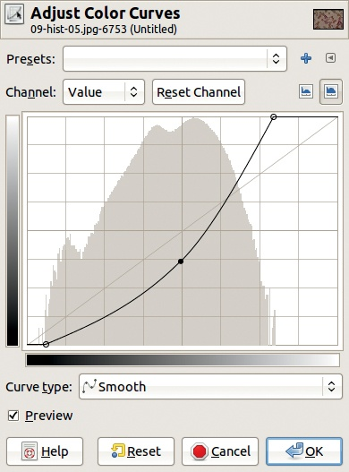

图 7-39. 减少灰度像素值（变亮）

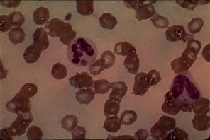

图 7-40. 减少像素值的结果

使用“Curves”工具可以进行多种操作。改变曲线的形状可以得到有趣的结果——但更常见的是得到奇怪且无用的结果。例如，图 7-45 显示了应用于红色通道的奇异曲线。将相似的曲线应用于其他两个通道后，得到了图 7-46，这可能对生物学家没有提供任何额外的有用信息。

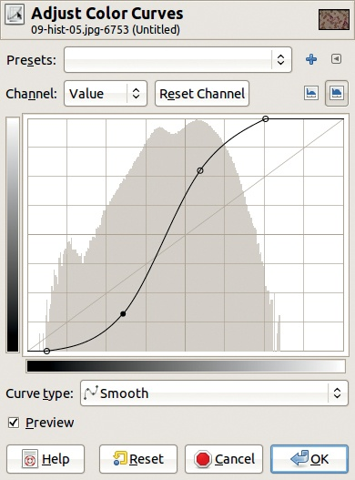

图 7-41. 均化灰度像素值

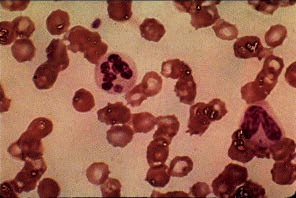

图 7-42. 均化像素值的结果

图 7-43. 多样化像素值

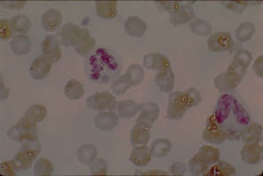

图 7-44. 多样化像素值的结果

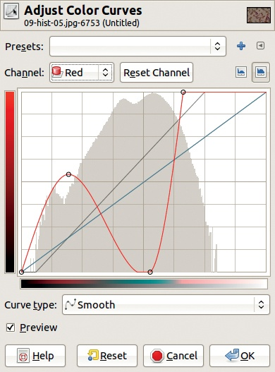

图 7-45. 一种奇异的曲线

# 7.3 滤波

滤波可以去除图像中的噪声。在本节中，我们将介绍滤波的基本概念，并展示一些常见的技术。

## 滤波原理

图像中噪声产生的原因有几个：

+   照片是在恶劣条件下拍摄的，光线不足，如图 7-47 所示，或者是摄影师移动了，如图 7-48 所示。

    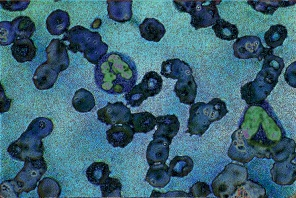

    图 7-46. 对所有通道应用奇异曲线后的结果

    

    图 7-47. 由于恶劣条件造成的噪声

    

    图 7-48. 由于摄影师移动产生的噪声

+   相机是一个非常低成本的型号，CCD 传感器太少，产生了强烈的 RGB 噪声，如图 7-49 所示。

+   采样频率过低，如图 7-50 所示。这种噪声通常出现在手机拍摄的照片中。

+   打印出来的照片已被划伤或以其他方式损坏，如图 7-51 所示。

图 7-49. 由于图像传感器太少造成的噪声

图 7-50. 由于低采样频率造成的噪声

减少图像噪声最常见的方法是使用*滤波*。这个方法的核心思想是减少应该保持一致的区域中的扰动幅度，比如墙壁或物体表面，同时保留过渡区域，也就是物体与其周围环境之间的边界。如果可能的话，这些过渡区域应该被突出强调。

## 特征矩阵

滤波会根据邻近像素的值更改每个像素的值。滤波器是通过一个公式或数学机制定义的，该机制计算出这个新的像素值。

图 7-51. 由于照片划痕产生的噪声

图 7-52. 卷积矩阵滤波器对话框

我们将仅考虑 GIMP 中最简单和最常用的滤波器。在**图像：滤镜**菜单中可以找到噪声减少滤波器。最通用的滤波器是**图像：滤镜 > 通用 > 卷积矩阵**，它会弹出图 7-52 所示的对话框。

矩阵是一个由五行五列数字组成的数组。最初，只有中心点的值与零不同，在这个例子中为 1。这意味着每个像素都被自身替代（即没有变化）。

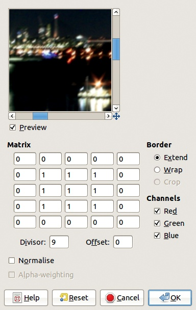

图 7-53. 噪声衰减矩阵

您可以修改矩阵条目以创建各种效果。如果您更改了某个条目，按下  键将带您到下一个条目，并且其内容会被选中。如果您输入新的值，它将替换掉之前的值。在图 7-53 中，我们将围绕中心条目的八个条目设置为 1，这意味着新像素的计算值是它自己和它的八个邻近像素之和。要计算这九个值的平均像素值，请将除数设置为 9。

如预览所示，这个滤波器减少了噪声并平滑了图像。图 7-54 展示了应用滤波后的图 7-49 效果。卷积矩阵滤波器易于使用，但要注意：结果图像会变得模糊。由于矩阵包含五行五列，您可以通过在矩阵四个边中添加中间的四个点来定义一个更大的滤波器。此时，除数（DIVISOR）将变为 13。滤波器使用的邻近像素应均匀分布在中心目标像素周围。

您可以在矩阵中使用不同的值来应用相同的滤波器。例如，图 7-55 展示了高斯模糊的值，其中离中心像素更近的像素权重更大。当然，除数（DIVISOR）必须适当调整。这个滤波器会比前一个滤波器更强烈地模糊图像。

图 7-54. 在图 7-49 上应用均值滤波后

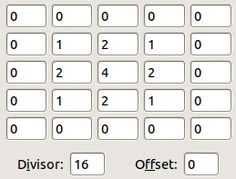

图 7-55. 高斯滤波矩阵

## 比较内置滤波器

在**图像：滤镜**菜单中的许多滤镜中，有一些是纯粹的预处理滤镜。例如，看看**图像：滤镜 > 模糊**菜单。模糊条目不太有用，因为你无法改变设置。焦点模糊和运动模糊用于特效处理。对于预处理来说，最有用的条目是两个高斯滤镜。图 7-56 和图 7-58 展示了这些滤镜在图 7-49 图像上的不同效果。如你所见，选择性高斯模糊滤镜对该图像效果最佳。

另一个有用的滤镜是**图像：滤镜 > 增强 > 去噪**。去噪滤镜被称为*中值滤镜*。它不像卷积矩阵那样使用相同的方法，尽管它也依赖于矩阵。图 7-59 显示了它的对话框，图 7-60 展示了将去噪滤镜应用于图 7-51 中的图像的结果。你可以通过调整参数来隐藏剩余的刮痕。事实上，简单地勾选递归（RECURSIVE）复选框，它会重复滤镜的最后操作，便能起效，但这样做也会增加模糊效果。不过，从美学角度来看，结果可能会被认为是比初始照片更有改善的效果。

图 7-56. 在图 7-49 上应用半径为 5 的 IIE 高斯模糊滤镜后的效果

图 7-57. 在图 7-49 上应用半径为 8 的 RLE 高斯模糊滤镜后的效果

到目前为止，我们尝试过的所有预处理滤镜都有一个共同的缺点：它们在一定程度上模糊了图像。模糊是因为这些滤镜通过平均邻近像素的值，在图像强烈过渡的地方降低了图像质量，这些过渡标定了图像的不同区域。而锐化则是加强这些过渡。

图 7-58. 对图 7-49 使用半径为 8 的选择性高斯模糊滤镜后的效果

图 7-59. 去斑滤镜对话框

锐化可以通过构建一个比之前使用的更复杂的卷积矩阵来完成。你也可以应用**图像：滤镜 > 增强 > NL 滤镜**，但选择正确的参数非常具有挑战性。到目前为止，最好的锐化滤镜是那个名字带有悖论的熟悉滤镜：**图像：滤镜 > 增强 > 非锐化掩模**。其对话框如图 7-61 所示。

图 7-60. 对图 7-51 使用去斑滤镜后的效果

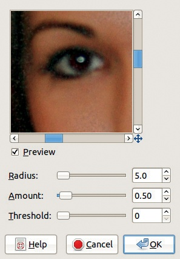

图 7-61. 非锐化掩模滤镜对话框

RADIUS 设置图像边缘的厚度。AMOUNT 设置掩模的效果强度。通常保持 AMOUNT 值较低（0.25 到 0.5）最好。如有需要，可以重复操作两次或更多次。这就是我们在图 7-48 中所做的，以得到图 7-62 所示的效果。

图 7-62. 将非锐化掩模应用于图 7-48 两次后的结果

图 7-63. 原始照片

# 7.4 边缘检测

在大多数情况下，图像中强烈的强度变化对应于物体的边缘。你通常可以通过一种称为*分割*的过程来检测这些变化，从而提取图像中的物体。在 GIMP 中，你可以使用*边缘检测*工具来实现这一点。

## 边缘检测原理

从技术上讲，图像中的边缘是强烈局部变化的强度区域。边缘检测是图像预处理过程中提取信息的一个基本部分。通常，发现的边缘会被送入形状识别系统。形状识别在机器人技术、医学图像分析、视频监控等领域有广泛的应用。

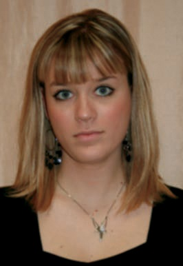

图 7-64. 经过强烈的高斯模糊

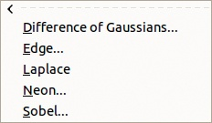

图 7-65. 边缘检测菜单

我们不会深入讨论各种边缘检测方法的数学细节。相反，我们将展示几种方法应用在一张图片上——图 7-63 中的照片。为了使这张图片适合进行边缘检测，我们首先通过应用**图像：滤镜 > 模糊 > 高斯模糊**来进行强烈的模糊处理。结果显示在图 7-64 中。

## 边缘检测方法

GIMP 中的边缘检测滤镜都可以在**图像：滤镜 > 边缘检测**菜单中找到（参见图 7-65）。在这里，我们将探索该菜单中的各种选项。

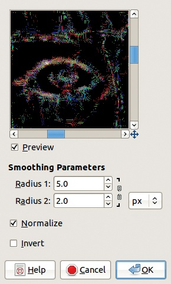

图 7-66. 高斯差异对话框

图 7-67. 高斯差异边缘检测后的结果

选择**图像：滤镜 > 边缘检测 > 高斯差异**会弹出图 7-66 中所示的对话框。在这里，我们调整了半径，并建议你也这么做。我们还取消了选中“反转”框。图 7-67 显示了结果。使用高斯差异滤镜的边缘检测效果相当差，至少在这张图片上是这样。

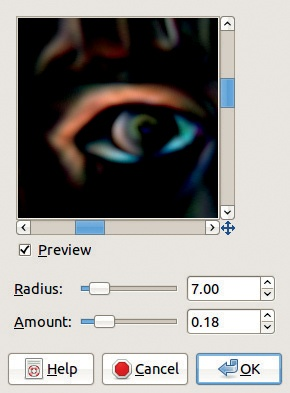

图 7-68. 霓虹对话框

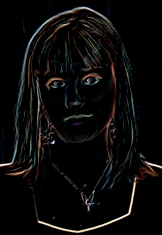

图 7-69. 经过霓虹边缘检测后的效果

**图像：滤镜 > 边缘检测 > 霓虹**对这张图片效果更好。图 7-68 显示了我们使用的设置下该滤镜的对话框。参见图 7-69 中的结果。请注意，与之前的滤镜相比，图片的关键特征更加明显。

**图像：滤镜 > 边缘检测 > 拉普拉斯**滤镜有点让人困惑：当你应用它到这张图片时，什么对话框都不会弹出，结果是完全黑色的。但在应用**图像：颜色 > 自动 > 拉伸对比度**之后，你可以得到图 7-70 中的结果。效果不算好，但总比没有好。

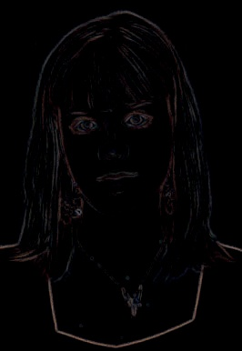

图 7-70. 拉普拉斯边缘检测后并应用拉伸对比度

图 7-71. 边缘对话框

最方便的工具是 **图像：滤镜 > 边缘检测 > 边缘**，它包含六种不同的滤镜（算法）。该对话框如 图 7-71 所示，操作简单。唯一的设置项是 AMOUNT。较低的 AMOUNT 值会导致黑色图像和细边缘；较高的 AMOUNT 值会产生较粗的边缘和多色的暗区。

图 7-72. 索贝尔边缘检测后

图 7-73. 预维特指南针边缘检测后

图 7-72 显示了使用索贝尔边缘检测，AMOUNT 设置为 6.5 的结果。图 7-73 显示了使用预维特指南针边缘检测，AMOUNT 设置为 10 的结果。图 7-74 显示了使用梯度边缘检测，AMOUNT 设置相同的结果。

对经过边缘检测处理的图像进行对比度拉伸可能是有用的。例如，我们通过使用差分边缘检测，AMOUNT 设置为 2.5，并应用 **图像：颜色 > 自动 > 拉伸对比度**，得到如 图 7-75 所示的图像。

图 7-74. 梯度边缘检测后

图 7-75. 差分边缘检测后并应用拉伸对比度

你可以使用边缘检测滤镜将图像分解成更易读的对象。我们将在两个不同的示例中展示这一点。

图 7-76. 边缘检测与原始图像结合（图 7-63）

要从 图 7-63 创建 图 7-76，请执行以下操作：

1.  复制图层。

1.  给顶层图层添加 Alpha 通道 (**图层：右键点击 > 添加 Alpha 通道**)。

1.  对该图层应用边缘检测滤镜（在此案例中，**图像：滤镜 > 边缘检测 > 边缘 > Sobel**）。

1.  选择颜色选择工具 () 并点击图像中的黑色区域。

1.  剪切选择区域 ()。

1.  隐藏选择区域 ()。

边缘检测的另一种可能用途在 图 7-77 中有所展示。从 图 7-22 开始，复制图层并应用边缘检测算子 Sobel，就像我们在前面的例子中做的那样。最后，我们在图层窗口中尝试各种合并模式，找到最适合我们需求的那个。我们选择屏幕模式。

图 7-77. 将边缘检测与原始图像合并 (图 7-22)

# 7.5 练习

对于这些练习，可以随意使用本书网站上的图像 (*[`the-book-ofgimp.blogspot.com`](http://the-book-ofgimp.blogspot.com)*)。

**练习 7.1.** 在本章中我们没有使用的一个简单工具是 **图像：颜色 > 阈值**。尝试在一张低质量的图像上使用它。实验光标的位置，尝试去除噪点并突出图像中的重要部分。

**练习 7.2.** 由于阈值工具生成的是黑白图像，将其结果与初始图像放在不同的图层中合并。尝试各种合并模式，直到你觉得已经增加了研究人员从图像中提取信息的量。

**练习 7.3.** 尝试使用阈值工具生成的图像填充添加到原始图像中的图层蒙版。再做一次，但这次反转阈值图像。

**练习 7.4.** 找到一张难以解读的图像，可以是我们提供的图像，也可以是你自己的图像。尝试使用不同的方法来改善边缘，使图像信息更易于读取。使用边缘检测工具、图层合并模式以及本章中演示的其他工具的组合。
