# 第八章. 网站设计

GIMP 包含许多设计网站时非常有用的工具，包括指南、网格和图层。指南和网格对齐使设计过程更加精确，而图层则允许你尝试不同的想法并快速切换，以查看哪个效果最佳。

# 8.1 教程：网站布局

如果你计划建立一个网站或为别人设计一个网站，你需要决定图形如何布局。有时候，直到你实际看到它之前，很难知道什么样的布局看起来好。在本教程中，我们创建一个关于健康饮食的网站原型。该网站将提供关于不同食品的信息以及帮助人们规划饮食、跟踪进展等服务。

## 规划

在创建图形或选择颜色之前，先为网站做一个计划。开始时，写下网站应为访客提供的内容。

访客可以分为两种主要类型：首次访问和回访。首次访问的用户应该能够轻松导航网站，并快速找到他们需要的内容。回访的用户应该能找到定期访问的理由，他们应该能够轻松查看新内容并使用网站服务。

下一步是布局将构成网站的模块。你应该有一个模块用于展示新内容，并放在显眼的位置，让所有访客都能看到。首次访问的访客，或者尚未注册的回访访客，也会看到一些初学者模块，帮助他们决定该读什么。注册用户则会看到会员模块，展示他们的个人目标和进展。

现在安排模块。你可能想先在纸上画一个草图，让你的想法成型，或者你也可以使用 GIMP 数字化地绘制草图。在本教程中，我们使用 960 网格系统来帮助我们计算宽度为 960 像素的页面上各个模块的尺寸。960 网格系统 (*http://960.gs/*) 提供了一系列原型资源：12 列、16 列和 24 列的模板，包括带有预设指南的 GIMP 模板；像图 8-1 中的草图纸；CSS 文件；以及示例 HTML 文件。如果你更喜欢其他页面布局，也可以创建自定义的 GIMP 模板 (**图片：文件 > 创建模板**).

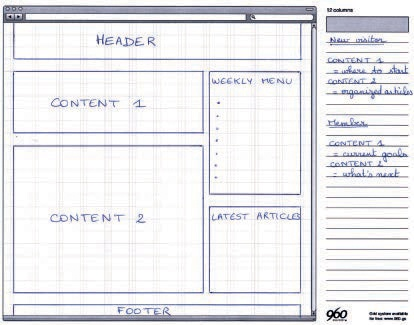

图 8-1. 纸上草图：布局模块

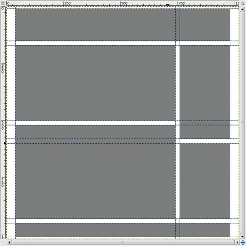

图 8-2. 使用指南

## 布局

如果你决定使用 960 网格系统来构建这个设计，你可以将你的草图纸转换为提供的 GIMP 模板，如图 8-2 所示。如果没有，你可以使用你自定义的模板，并将指南放置在你喜欢的位置。然而，你需要定义自己的 CSS 文件，无法借助 960 网格系统的文件。

从图像标尺拖动指南线，标出区块的边界。选择 960 像素作为页面的总宽度，并 delineate 一个宽度为 220 像素的右侧列；在设计周围添加 20 像素的边距，区块之间添加 10 像素的边距。确保选中**图像：视图 > 吸附到指南**选项，这样你就可以使用矩形选择工具来选择一个区块并填充它。使用中等灰色（#808080）来填充区块。图 8-2 展示了结果。

能够通过点击一次来改变区块的颜色，使得颜色原型设计变得更快。要实现这一点，首先围绕每个区块构建一个矩形轮廓：

+   创建一个新的透明图层，并将其放置在图层堆叠的顶部。它将包含所有区块的轮廓。

+   选择矩形选择工具，并使用指南线绘制矩形。

+   选择**图像：编辑 > 描边选择区域**。在弹出的对话框中，选择用纯色绘制一条宽度为 2 像素的线条。选择一种与设计对比的颜色。

+   对每个六个区块重复这些步骤。

## 添加颜色

要为区块着色，请在你创建的透明图层中使用油漆桶填充工具。在油漆桶选项中，选择填充相似颜色，并取消勾选“合并样本”。当你点击一个区块内部时，只有该区块被填充，因为油漆桶工具只会填充相同颜色的连续区域，而区块周围的轮廓是不同的颜色。然后，你可以构建具有不同颜色的新图层，并隐藏不同的图层以显示不同的选项。如果你点击任何区块外部，颜色将填充布局的边距，这被视为你正在构建页面的背景。

始终注意边距、页眉和页脚的高度，以及列宽。任何这些的变化都可能会大幅改变设计的感觉。

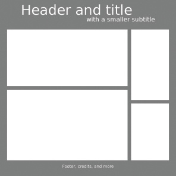

图 8-3. 单色测试

## 选择颜色调色板

接下来，为网站选择一个颜色调色板。你可以通过几种方式选择调色板：使用颜色选择器选择颜色，使用吸管从将包含在设计中的照片或插图中挑选颜色，或者浏览其他人设计的调色板集合。在 GNU/Linux 系统中，你可以使用`Agave`颜色方案生成器。

对于这个网站，我们希望使用包含红色、橙色、黄色、绿色和棕色的调色板。这些颜色看起来明亮而充满活力，这正是我们网站所希望传达的感觉。选择至少一种深色和一种柔和色，以增加设计的对比度。或者，先从单色调色板开始，当设计在黑白状态下看起来不错时，再添加不同的色调。

对于我们的网站，我们首先尝试用一个中暗色的背景和明亮的块状元素，如图 8-3 所示。页眉和页脚与背景融为一体，因此我们需要亮色的文字来确保其可读性。我们添加了占位符标题，以查看文字在这个设计中的效果。我们使用了一种中性字体（`Sans`），主标题的字号为 80 像素，副标题为 36 像素。

在最终的网站中，页眉标题可以是文本或图像。文本更好，因为读者（以及搜索引擎）可以与之互动，但你需要选择一种适合网页的安全字体，因此选择有限。请注意，你需要通过在 HTML 文件中添加适当的标签，使标题对于视力障碍的用户也能阅读。

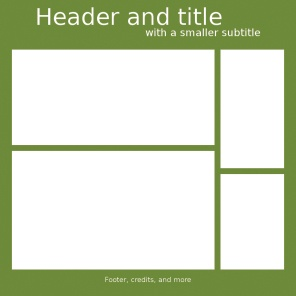

图 8-4. 一种颜色添加

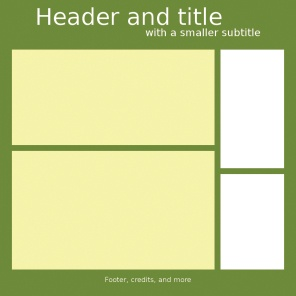

图 8-5. 两种颜色添加

现在添加颜色：我们在背景中加入了一种深绿色，提醒观众联想到蔬菜和大自然（传达“健康”感觉）。请参见图 8-4 中的效果。然后，我们用中性浅黄色填充内容块，这种颜色与绿色搭配得很好，但不会过于分散注意力。效果如图 8-5 所示。为了让侧边菜单更加多彩，我们使用橙色来搭配绿色和黄色，如图 8-6 所示。

这个设计有足够的对比度，但缺乏活力。我们需要更多的亮色。我们可以给页眉、装饰页面的插图，或者像“立即购买”或“注册”这样的操作按钮添加颜色。我们决定将页眉的颜色改为非常亮的橙色，如图 8-7 所示。

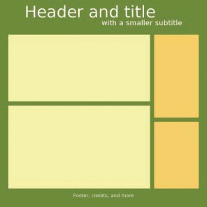

图 8-6. 三种颜色添加

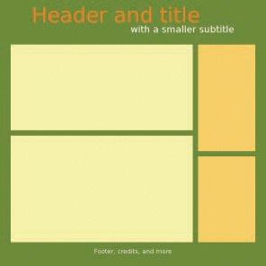

图 8-7. 四种颜色添加

接下来，我们再添加一种亮色。亮黄色是一个不错的选择，但亮酸橙绿色更好，因为它与背景中的深绿色搭配得很好。这个网站没有大的操作按钮，但我们希望新用户能够注意到描述网站亮点和服务的块状元素。我们将这个块涂上亮酸橙绿色，使其突出。效果见图 8-8，我们的调色板见图 8-9。

此调色板是通过颜色选择器构建的：第一个颜色（绿色）的 HSV 值为（75，100，50）；第二个颜色（橙色）的 HSV 值为（30，100，100）；第三个颜色（较深的黄色）的 HSV 值为（44，62，100）；第四个颜色（较浅的黄色）的 HSV 值为（60，30，100）；第五个颜色（黄绿色）的 HSV 值为（75，50，100）。H 通道（第一个数字）决定了整体色调；S 通道（第二个数字）决定颜色是饱和色还是粉彩色；V 通道（最后一个数字）决定颜色是浅色还是深色。

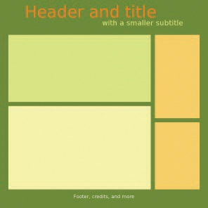

图 8-8. 添加的五种颜色

图 8-9. 网站的最终调色板

在调色板可停靠对话框中保存此调色板（**图像：Windows > 可停靠对话框**）。通过点击底部行第二个按钮创建一个新调色板。在调色板编辑器中，您可以从当前的前景色或背景色中添加颜色到调色板，编辑颜色或删除颜色。

要使用新的调色板，请在调色板编辑器中点击所需的颜色以设置前景色，或者点击右键设置背景色。

我们通过将插图作为新图层添加并使用透明背景来使页面更生动。结果如图 8-10 所示。

现在我们进行一些微调。我们调整字体以使标题更加吸引人，并缩小页脚，因为它占用了太多空间。图 8-11 显示了新的布局。

这些块看起来有点拥挤，因此我们在它们周围添加了白色边距，如图 8-12 所示。为了创建边距，在块下方添加一个图层，围绕块创建一个矩形选择区域，将其增加 10 像素（**图像：选择 > 增大**），然后用白色填充。

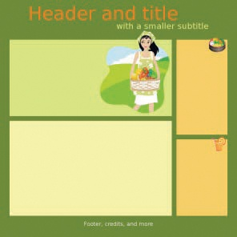

图 8-10. 添加插图

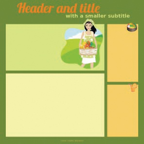

图 8-11. 带有新字体和更小的页脚

块周围的边距几乎不可见，因此我们将它们从 10 像素扩展到 20 像素，如图 8-13 所示。这次我们要缩小这些块，并将参考线向每个块的中心移动 10 像素。我们通过参考线创建一个从块当前边缘向内 10 像素的选择区域，反转选择以仅选择块的外部 10 像素，然后剪切选择区域，以揭示更多的白色边框。

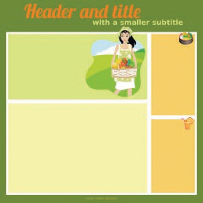

图 8-12. 带有白色边距

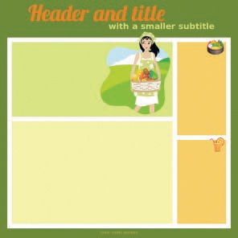

图 8-13. 更大的边距

# 8.2 固定宽度与可变宽度设计

在创建网站时，你可以决定浏览器窗口的大小是否影响页面的大小。*固定宽度设计*在浏览器宽度变化时始终保持不变（以像素为单位）。如果浏览器窗口比页面宽度大，边框会出现。固定宽度设计通常是居中的，因此设计的左侧和右侧会出现边框。如果浏览器窗口比页面宽度小，页面只会显示部分内容，并且会出现水平滚动条。

*可变宽度设计*（也称为*流式设计*）随着浏览器宽度的变化而改变宽度，并且至少设计的一个部分（通常是主要内容块）会随浏览器窗口一起调整大小。创建一个能够在任何浏览器宽度下都能良好显示的设计是很困难的，尤其是现在浏览器可能非常小（适用于手持设备）或非常大（适用于巨大的电影屏幕）。

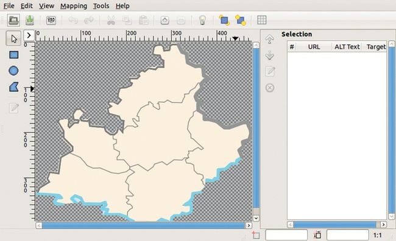

图 8-14. 图像映射对话框

可变宽度设计可以填充各种屏幕，而不像固定宽度设计那样留下空白区域或添加滚动条。固定宽度设计提供更好的可读性，而可变宽度设计的内容可能被挤压成一个狭窄的列，或者扩展成难以阅读的长行。另一方面，固定宽度设计还可以让你对布局、图像位置和列宽度有更多的控制。

若要用 GIMP 原型设计固定宽度页面，请创建一个新图像并设置所选的宽度。其高度可以设置为最小的浏览器高度，或者如果用户需要向下滚动才能看到页脚，也可以设置为更大。如果你在制作可变宽度的网页原型，你可以选择任何宽度和高度。如果页面上的某些元素会随之变化大小，而其他元素保持固定，你可能需要创建几个不同宽度的原型，看看元素如何在页面调整大小时一起呈现。

# 8.3 网站设计工具

尽管 GIMP 并非专为网页开发或设计而设计，但它确实包含一些有用的工具，用于准备适合网页的图像，其中包括在**图像：滤镜 > 网页**菜单下找到的两个工具，它们可以让你在图像中限定区域，以便在用户点击或悬停在这些区域时触发相应的操作。该菜单还包含一个用于处理 GIF 图像的工具。

## 图像映射

**图像：滤镜 > 网页 > 图像映射**使用一张图像构建一个可点击的地图，你可以将其集成到网页中。该地图被划分为不重叠的区域，每个区域都附加了一个链接。当用户点击某个区域时，他们将被带到相应的链接。

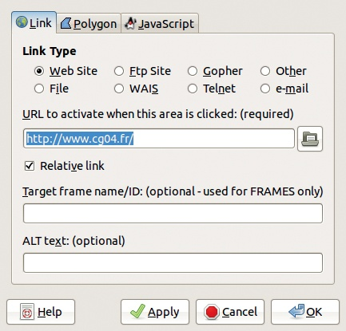

图 8-15. 区域设置对话框，链接标签

如图 8-14 所示，图像映射对话框有两个主要区域：左侧显示图像映射的来源，右侧显示与图像区域相关联的 URL。该对话框顶部有一排按钮用于编辑已定义的区域，图像预览的两侧还分别有一列按钮。左侧列包含用于选择和定义区域以及编辑与区域相关的信息的按钮。右侧列包含用于移动、编辑或删除与区域相关联的信息的按钮。要创建图像映射，请点击三个蓝色按钮之一，定义几何形状，在图像上绘制该形状，然后将 URL 附加到它。

要绘制矩形或圆形，请点击并拖动以创建形状，然后再点击一次以完成形状。要绘制多边形，请在每个顶点点击，并双击最后一个点以完成形状。一旦形状完成，将出现一个类似图 8-15 所示的对话框。选择链接类型，然后输入或粘贴链接地址。你可以使用以 `http://` 开头的绝对地址，或者使用作为网站内部链接的相对地址。你还可以输入 ALT 文本，在鼠标悬停在链接上时显示，或在链接失效时显示该文本。

区域设置对话框的第二个标签根据地图的形状而有所不同。在这里，你可以手动更改一些坐标。图 8-16 显示了多边形的对话框。第三个标签（未显示）可以用来定义 JavaScript 序列并将其链接到特定事件。

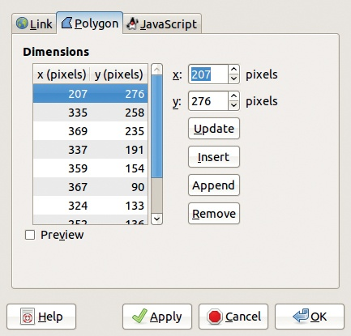

图 8-16. 区域设置对话框，多边形标签

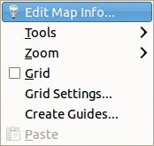

图 8-17. 通过右键点击图像映射对话框访问一个工具菜单。

### 图像映射工具

通过点击左上角的三角按钮可以访问一个工具菜单，另一个工具菜单则通过在图像映射对话框中右键点击并且指针处于活动状态时访问（图 8-17）。虽然这些菜单名称相同，但它们包含不同的条目。第一个工具菜单用于处理网格和指南，而第二个工具菜单包含四个工具，这些工具也出现在图像映射对话框的左侧列和菜单栏的映射菜单中。

箭头工具，显示为对话框左侧的箭头，允许你选择已定义的区域并移动或调整其大小。编辑工具允许你更改与所选区域相关联的参数。你还可以从对话框右侧的列表中选择链接，以选择相应的区域。

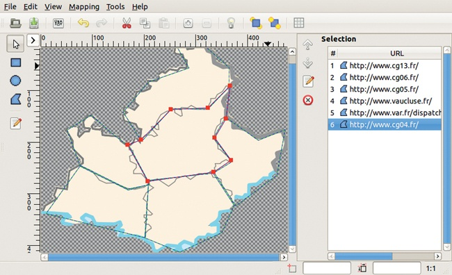

图 8-18. 已定义六个区域。

图 8-18 显示了普罗旺斯-阿尔卑斯-蓝色海岸地区的地图，其中六个区域对应法国的*省*，并与适当的 URL 相关联。如果你在指针工具激活时点击某个形状，该形状将被选中，你可以更改其顶点。你可以通过双击右列中的 URL 或点击任一列中的编辑按钮来编辑与形状关联的信息。

### 有用的图片映射对话框

选择**编辑 > 偏好设置**会打开图 8-19 所示的对话框，该对话框有三个标签。在这里，你可以设置调整滤镜界面或你正在构建的 HTML 页面的一些参数。在菜单标签下，你可以更改撤销级别的数量或更改工具对话框中使用的颜色等。

网格可以通过**工具 > 网格**切换显示与隐藏，选择**工具 > 网格设置**会打开图 8-20 所示的对话框，在这里你可以设置网格的特性。图片映射网格与第十章中讨论的图像窗口使用的网格类似。

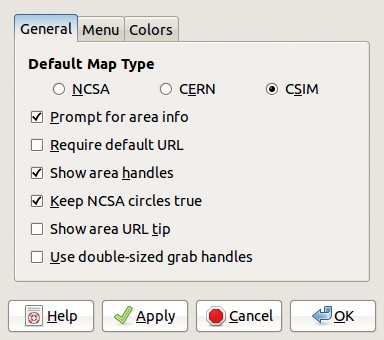

图 8-19. 图片映射偏好设置

选择**工具 > 创建引导线**会打开图 8-21 所示的对话框。引导线限定了可以关联链接的预定义数量的矩形。这些引导线帮助你快速绘制简单的地图。注意，默认的矩形数量是零，如果不更改该数字，工具将没有效果。

选择**工具 > 使用 GIMP 引导线**会产生与稍后讨论的切片滤镜相似的效果。

当你保存图片映射（通过选择**文件 > 保存**，按下，或点击“保存”按钮）时，滤镜会生成一个`.map`后缀的文件。这个 HTML 文件包含用于加载图像的``标签以及相应的`<map>`标签，其中定义了所有`<area>`标签。请注意，生成的文件不一定包含它所引用的图像文件的名称。

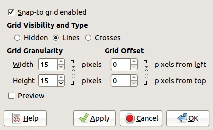

图 8-20. 网格设置对话框

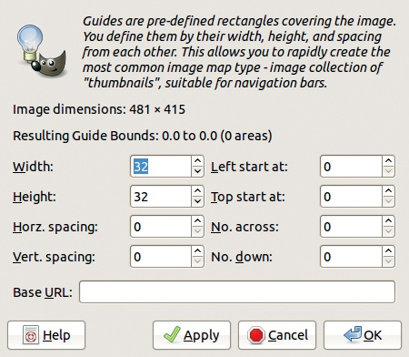

图 8-21. 创建参考线对话框

## 半透明处理

**图像：过滤器 > 网页 > 半透明处理**没有对话框。它模拟在网页上显示的 GIF 图像中的抗锯齿效果。

抗锯齿通过使对象边界处的像素半透明来平滑边缘，如图 8-22 所示。由于 GIF 编码只能表示 0%透明度或 100%透明度，因此不能使用抗锯齿。你可以选择使用 PNG 代替 GIF，但某些浏览器不能正确处理 PNG 编码。作为模拟半透明的方式，半透明处理滤镜通过在图像的边缘创建包含前景色和背景色混合的像素来实现。要使用半透明处理，请将背景色设置为网页背景色。图 8-23 显示了当背景色为深粉色时的效果。

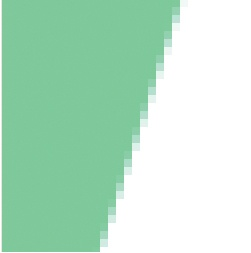

图 8-22. 初始图像

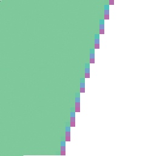

图 8-23. 半透明处理后的效果

## 切片

**图像：过滤器 > 网页 > 切片**是另一种工具，允许你将图像分割成多个部分。假设你想在网页上展示一张大的矩形图像，图像将沿着网格切成更小的矩形碎片。切片工具让你选择仅展示这些碎片中的一部分，或者当鼠标悬停在碎片上时改变它们的外观。切片还允许你设置碎片，在点击时触发某些特定的动作。

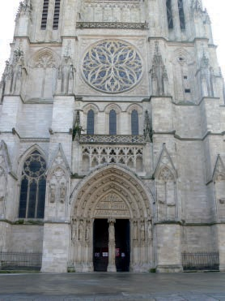

图 8-24. 将要切割成小块的图像

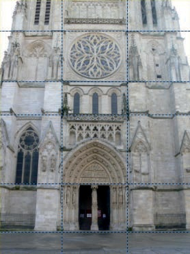

图 8-25. 切片的参考线

例如，假设我们想用图 8-24 中显示的图像作为 HTML 表格的背景。我们定义与表格中的方格相对应的区域，使用一个覆盖整个图像的网格。

从图像的边缘拖动新的参考线到你希望进行切片的位置。结果如图 8-25 所示。

点击**图像：过滤器 > 网页 > 切片**来完成操作。图像被切割成多个小块，并创建了一个以`.html`为后缀的文件，文件中包含 HTML 表格的代码。你可以将此文件的内容添加到你的网页代码中。你还需要将图像碎片与网页的图像文件一起存放。

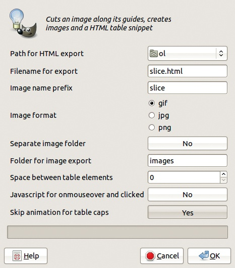

图 8-26. 切片生成文件的选项

出现的选项对话框，如图 8-26 所示，让你选择生成文件以及由初始图像中的切片构建的图像的各种参数。你可以命名 HTML 文件，选择存储位置，并为单独的单元文件输入前缀和格式，以及它们将存储的位置。如果图像之间有空隙，网页背景会显示出来。当鼠标停留在某个单元格上时，可以调用一个 JavaScript 代码片段，但你可以选择冻结边框单元格，使它们无法被选择或更改。

# 8.4 优化网页图像

最适合网页的三种格式是 JPEG、PNG 和 GIF。这些文件格式可以被所有主流浏览器处理，但在 Internet Explorer 中可能会有一些限制。这些格式使用压缩算法来减小文件大小，从而提高页面的下载速度。即使高速互联网连接已经很普遍，但仍然使用慢速连接的用户会对任何减少图像文件大小的尝试表示赞赏。

在这里，我们总结了这三种格式最重要的方面，并在第二十章中详细介绍了更多内容。

## JPEG

JPEG 格式最适合用于照片，因为它具有 24 位色深，可以呈现大量颜色。JPEG 还适合渲染渐变，而 GIF 格式在渲染渐变时常常效果较差。JPEG 压缩算法减少了图像大小，并导致细节和颜色的轻微损失。这个损失是累积的，因此图像压缩得越多，效果越差。

当将文件导出为 JPEG 格式时，你可以选择一个质量等级。质量越高，文件越大。如果勾选“在图像窗口中显示预览”，该质量设置的图像预览会作为一个新图层出现。在“高级选项”下，“优化”选项允许你添加额外的压缩。扩展的 JPEG 导出对话框如图 8-27 所示。

## GIF

GIF 是最古老且最受限的文件格式。GIF 只能表示最多 256 种颜色，因此最适合用于颜色较少的简单图像。GIF 通常用于（并且非常适合）小型动画，如第十八章中所述。

优化 GIF 格式图像的一种方法是减少调色板中的颜色数量。可以从 8 种颜色开始，然后将此数字翻倍，直到你对结果满意。如果达到 256 种颜色仍然不满意，可以尝试使用其他格式。抖动可以平滑图像，但也会增加图像的大小。

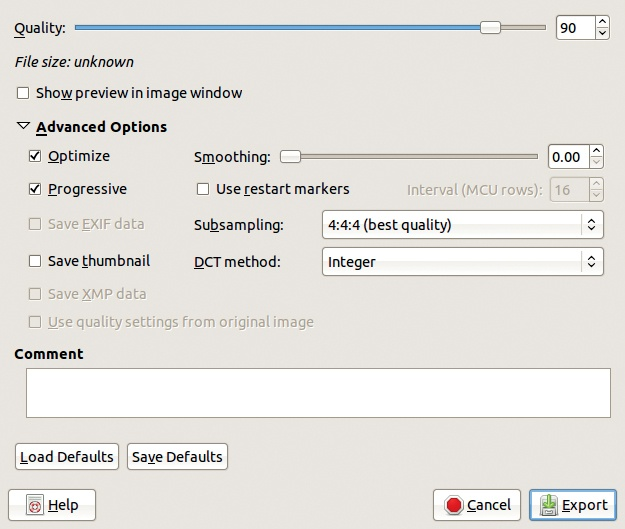

图 8-27. 导出图像为 JPEG 对话框

## PNG

理论上，PNG 是一种多功能的格式，具有用于照片的 24 位模式和用于颜色较少图像的 8 位模式。在实际应用中，24 位模式会导致文件过大，不适合网络使用，因此 JPEG 是更好的选择。8 位模式在文件大小方面优于 GIF，但 PNG 并不被 Internet Explorer 很好地支持。

你可以使用与 GIF 相同的方法优化 8 位 PNG 文件：限制颜色并避免使用抖动。

## 透明度

透明度在构建网站时非常有用，因为它允许你轻松地将任何形状的图形放置在背景上。但没有一种文件格式能完美地处理透明度。GIF 格式使用 1 位表示透明度，因此像素要么完全不透明，要么完全透明。PNG 格式可以使用 1 到 8 位表示透明度。尽管所有现代浏览器都支持 PNG 的 8 位透明度，但仍有许多人使用不支持 8 位透明度的过时版本的 Internet Explorer。JPEG 格式根本无法表示透明度。

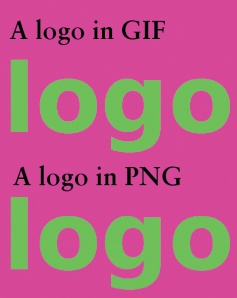

图 8-28. 网页上的两个 logo

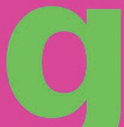

图 8-29. 放大的 PNG logo

如果你想使用一个圆形的 logo，并且使用 1 位透明度使背景透明，那么圆形边缘的像素将是完全不透明或完全透明，因此轮廓会显得锯齿状且像素化。如果你将 logo 背景填充为网页的背景色，然后平滑边缘，边缘将是 logo 颜色和背景颜色的混合，这看起来更好，但会使更改网页背景颜色变得更加困难。如果你使用 8 位透明度，边缘会平滑，而且可以轻松更改背景颜色。

图 8-28 显示了网页上的两个 logo。在这个放大倍率下，差异不太明显。图 8-29 和 图 8-30 更清楚地展示了差异。

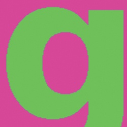

图 8-30. 放大的 GIF logo

# 8.5 练习

**练习 8.1.** 从 960 Grid System 网站下载所有文件（*http://960.gs/*）。将它们解压到一个文件夹中。从 `sketch_sheets` 子文件夹中，选择并打印你喜欢的草图纸。使用这张草图纸，设计一个符合你个人风格的网站布局，创造出与教程建议不同的东西。然后在 GIMP 中打开正确的模板，模板位于 `templates/gimp` 子文件夹中，并用方块填充，使用你的草图纸作为模型，并使用模板指南正确地放置这些方块。

**练习 8.2.** 在书籍的网站上，在本章的文件中，你会找到一个名为`tutorial.xcf`的文件。这个文件用于构建在图 8-3 到图 8-13 之间显示的示例网页。用 GIMP 打开这个文件，并尝试使用不同的颜色、图片和字体来定制设计。

**练习 8.3.** 从你自己的图片创建一张地图。将 URL 链接到不同的区域，并添加文字，当访问者将鼠标悬停在某个区域时，他们将看到这些文字。

**练习 8.4.** 使用 8.4 优化图像以适应网页中描述的优化技术，将你的其中一张图片导出为 JPEG、GIF 和 PNG 格式。每次都尽量将文件大小缩小到最小，同时保持可接受的质量水平。比较结果。
