# 第九章. GIMP 界面

在 第一章中，我们介绍了 GIMP 界面的基础知识。在本章中，我们将更详细地讲解。GIMP 是一个功能强大、灵活的应用程序。普通用户可以在不学习太多 GIMP 知识的情况下编辑图像，但通过深入了解，你可以更好地控制图像，并且更快速高效地工作。

如果你是图像编辑的新手，本章将教你如何更有效地处理图像。如果你正在从其他图像编辑应用程序切换过来，本章将教你 GIMP 的新术语。从 2.8 版本开始，GIMP 界面发生了显著变化，所以即使你已经熟悉 2.4 或 2.6 版本，仍然需要仔细阅读本章，了解新版本的不同之处。

# 9.1 主窗口

一旦 GIMP 安装在你的计算机上，你可以像启动其他应用程序一样通过快捷方式或菜单打开它。当你启动 GIMP 时，首先看到的是启动窗口，然后是主窗口：*图像窗口*、*工具箱窗口* 和 *多对话框窗口*。

*启动窗口* 是 GIMP 加载时显示的图像。它会随 GIMP 的版本变化而变化，是快速检查当前计算机上安装的 GIMP 版本的好方法。启动窗口还会显示加载过程的更新。当启动窗口消失时，GIMP 的三个主窗口会出现。默认情况下，这些窗口会如 图 9-1 所示。如果你的屏幕小于 1440 × 900 像素，两个垂直窗口会变得较短。如果你的屏幕显著更大，你会看到三个窗口之间的空白更多。因为这三个是独立的窗口，你还会看到桌面背景。

## 多窗口模式

对于某些用户来说，*多窗口模式* 是一个惊喜。大多数 Windows 和 Mac OS 应用程序，甚至许多 GNU/Linux 应用程序（如 GNU Paint、Blender、Inkscape 或 OpenOffice Draw）都使用 *单窗口模式*。多窗口模式在 Windows 环境中效果不好，这也是 GIMP 在 Windows 用户中被抱怨的原因之一。GIMP 2.8 还提供了单窗口模式，我们将在 单窗口模式 中进行描述。现在，让我们专注于经典的多窗口模式。不过，接下来的大部分解释同样适用于单窗口模式。

GIMP 的屏幕布局是完全可定制的——你可以移动窗口或更改两个垂直窗口的高度和宽度，当你退出 GIMP 时，所做的更改会被保存。图 9-2 显示了一个自定义的屏幕布局，其中两个垂直窗口被放置在屏幕的右侧。`工具箱 - 工具选项`窗口（也称为工具箱对话框）位于最右侧，我们稍微增加了它的宽度，因此顶部的每一行包含六个图标，而不是五个。它的左边是多对话框窗口，里面包含几个对话框，分成两组标签。

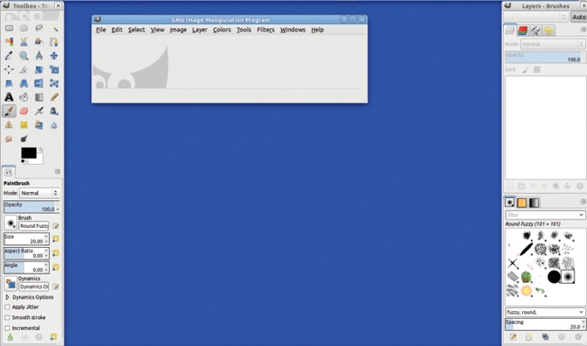

图 9-1. GIMP 初始窗口以多窗口模式显示

另一个 GIMP 窗口 `Levels` 也显示在这里，还有一个文本编辑程序窗口（里面是本书第一章的早期草稿）和一个终端窗口。正如你所看到的，多个窗口模式允许你并排使用 GIMP 和其他应用程序。

图 9-2 中的最后一个窗口是图像窗口（显示在左上角）。当你在 GIMP 中打开一张图像时，它就会出现，并标有图像的名称和其他基本信息。这个窗口还包含菜单栏（除非你使用的是 Ubuntu 的 Unity 界面或 Mac OS X）。

当 GIMP 打开时，图像窗口是空的，如图 9-3 所示。在左下角是 Wilber 的头部。Wilber 是 GIMP 的吉祥物，所以你会在 GIMP 的各个地方看到它。在图像窗口的顶部包含一个菜单栏，有 11 或 12 个条目，具体取决于你是否安装了 GAP 插件。如果你将鼠标指针停留在这个窗口中（或者停留在工具箱顶部的 Wilber 条带上），你会看到一条消息，写着“将图像文件拖到此处以打开它们。”

你可以通过图像窗口顶部的菜单访问 GIMP 的功能，但使用键盘快捷键或工具箱图标通常更加方便。工具箱和可停靠对话框也可以让你指定工具选项和参数。

如果你同时处理多张图像，可能会迅速打开十几个窗口。虽然这可能会让人感到困惑，但它的好处是，GIMP 允许你同时做许多事情，而不是让你在尝试另一个操作之前取消当前操作。

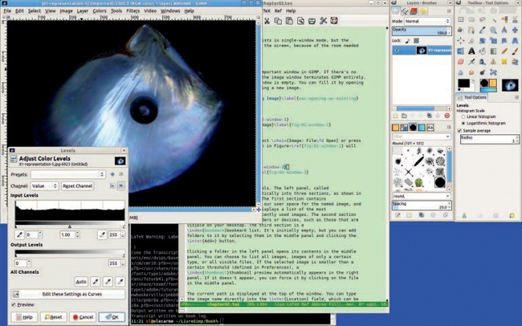

图 9-2. 自定义屏幕布局

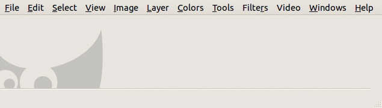

图 9-3. 空的图像窗口

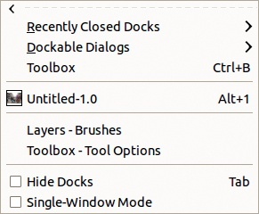

图 9-4. 图像：Windows 菜单

你可以通过按下来隐藏除图像窗口之外的所有窗口。再次按下可以恢复这些窗口。默认情况下，除图像窗口外的所有窗口都被认为是*工具窗口*。你可以通过首选项对话框来更改这一设置（参见第二十二章）。工具窗口无法最小化或最大化，每当你激活图像窗口时，它们会出现在其他打开窗口的上方。

## 单窗口模式

从版本 2.8 开始，你可以在多窗口模式和单窗口模式之间进行选择。如图 9-4 所示，**图像：窗口**菜单包含一个单窗口模式的复选框。如果勾选它，所有现有的 GIMP 窗口将合并成一个窗口，填满屏幕。图 9-5 展示了这个窗口的初始配置，左侧是工具箱，缩小至三个工具的宽度，右侧是多对话框窗口。

你可以更改初始布局。在图 9-6 中，我们加宽了工具箱，并同时打开了两幅图像。第二幅图像只显示为当前图像顶部的一个标签，因此我们不能同时查看两幅图像。我们还打开了一个新的对话框——文档历史，它位于左下角，位于工具选项对话框的下方。我们可以通过点击并拖动该对话框的标题到现有停靠栏的标题栏，将其移动并使其成为一个标签，正如在多窗口模式下那样。唯一无法移动的对话框是工具箱，但你可以临时切换到多窗口模式来实现此操作。

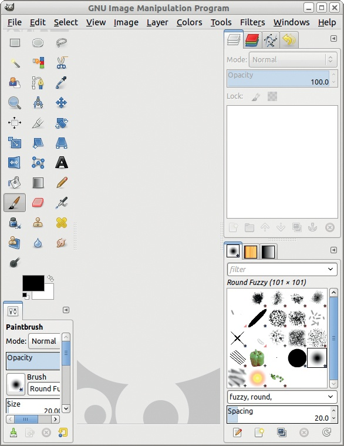

图 9-5。初始配置下的单窗口模式

如同在多窗口模式中，按下或勾选**图像：窗口**菜单中的复选框可以隐藏所有停靠栏。图 9-7 展示了这一效果。再次按下可以恢复停靠栏。

如果你在单窗口模式下工作，你可以缩小当前窗口，这样可以看到其他正在运行的程序，例如，如果你想从浏览器或文件夹中点击并拖动一个图像缩略图到 GIMP 中。但是在单窗口模式下，除非你有一个非常大的屏幕或双屏配置，否则这样做会非常困难。

有时，当你在单窗口模式下打开一个新的可停靠对话框时，它会被分离出来（成为一个独立的窗口），这与单窗口模式的概念相悖。

如果你在可停靠对话框的配置菜单中选择“添加标签”选项，新的对话框将作为新标签添加到当前的停靠区，因此你仍然只有一个窗口。如果你选择**图像：窗口 > 可停靠对话框**菜单，新的对话框将作为独立窗口创建。

你可以将一个独立的对话框拖动到停靠区，正如在停靠窗口和可停靠对话框中所解释的那样。你可以使用其配置菜单中的 DETACH TAB 选项将停靠的对话框分离出来（即使在单窗口模式下）。

单窗口模式的主要限制是，即使你使用**图像：视图 > 新视图**，也无法同时查看多个图像。你可以处理多个图像，但必须通过标签切换它们。你可以点击标签，或者按下或来在图像之间切换。

许多人声称，单窗口模式是 GIMP 中最缺少的重要功能，但仍有许多长期使用 GIMP 的用户更喜欢多窗口模式。你可以尝试两者，看看哪种最适合你。这将取决于你使用的操作系统、屏幕的大小以及你是否经常同时处理多个图像。

## 停靠窗口和可停靠对话框

工具箱窗口和多对话框窗口是*停靠窗口*，简称*停靠区*。它们可以包含多个对话框，你可以将一个对话框从一个窗口移到另一个窗口，隐藏它，放置到任何停靠区外，或将其停靠到另一个停靠窗口中。

默认情况下，工具箱窗口包含一个特殊的对话框，它停靠在底部，即工具选项对话框，根据当前选择的工具自动变化。在图 9-1 中，当前工具是画笔，底部对话框显示的是画笔选项。多对话框窗口最初包含七个对话框。四个对话框停靠在窗口的顶部部分，你可以通过带有图标的标签在它们之间切换。窗口的下半部分包含另外三个对话框。这七个对话框是 GIMP 的默认设置，因为它们通常最有用，但你可以删除任何不使用的对话框，或者添加图 9-8 中显示的任何*可停靠对话框*。

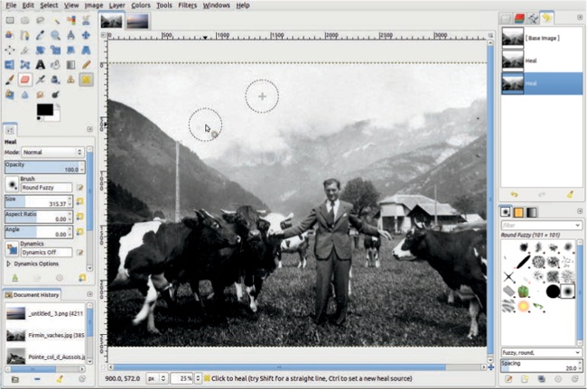

图 9-6. 打开两个图像的单窗口模式

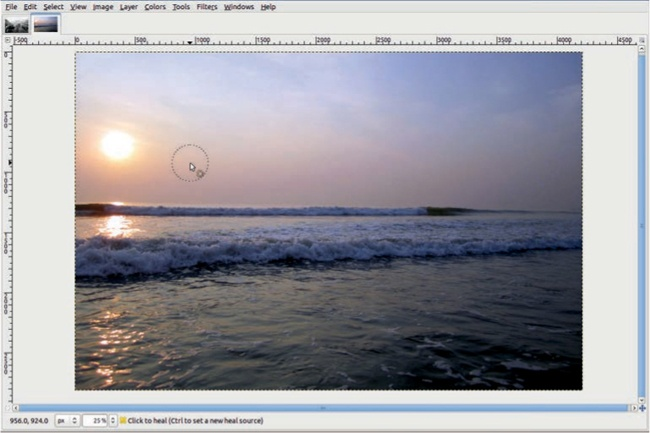

图 9-7。没有任何停靠窗格的单窗口模式

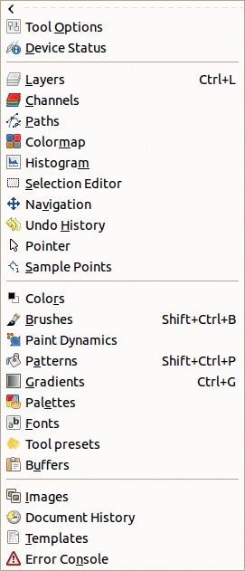

图 9-8。可停靠对话框菜单

图 9-9 显示了标签按钮在可停靠对话框顶部的位置，位于标签行旁边。按钮上标有一个小三角形，点击它后，会打开一个标签配置菜单，如图 9-10 所示。该菜单是针对每个对话框的，在本例中是画笔对话框。

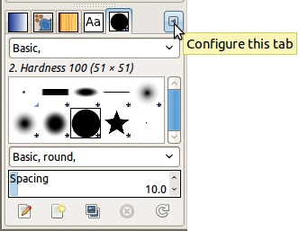

图 9-9。标签按钮

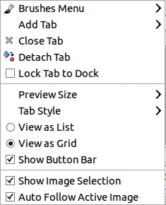

图 9-10。标签配置菜单

如果你关闭了一个停靠窗格，可以通过**图像：窗口 > 最近关闭的停靠窗格**重新打开它。你可以通过两种方式重建工具选项对话框：通过**图像：窗口 > 可停靠对话框 > 工具选项**，或者简单地通过双击工具箱中的当前工具。然后会创建一个新窗口，如图 9-11 所示。这个窗口是一个新的停靠窗格，因此你可以将任何可停靠的对话框停靠到它的四个侧面之一。

要将可停靠对话框移入停靠窗格，抓住它的图标或标题并将其拖到停靠窗格的一侧，如图 9-11 所示。在这种情况下，两个对话框将并排显示。你也可以将对话框停靠在左侧或底部。例如，在图 9-12 中，工具选项对话框被停靠在工具箱的底部。请注意，当你将对话框拖到接收停靠窗格附近时，将强调它将停靠的位置。

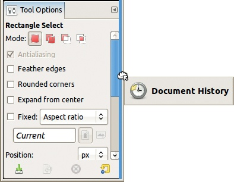

图 9-11。将可停靠对话框添加到停靠窗格

图 9-12。将工具选项对话框移回工具箱窗口

你可以通过标签配置菜单关闭可停靠对话框，或者通过**图像：窗口 > 可停靠对话框**打开它们。如果你将一个对话框拖到现有停靠窗格的一侧，停靠窗格会在该侧放大。如果你将一个对话框拖到停靠窗格的顶部，并将其放置在现有标签旁边，该对话框会作为新标签添加，而不会放大停靠窗格。你甚至可以通过将标签的标题或图标拖出停靠窗格，使标签成为一个独立的停靠窗格。

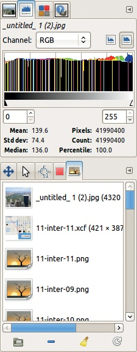

图 9-13。一个具有两个部分和九个标签的新停靠窗格

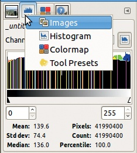

图 9-14. 选择选项卡以使其激活

你还可以关闭所有的停靠区，但更好的方法可能是暂时将它们隐藏起来，使用。你可以创建一个具有三层选项卡的停靠区，将所有可停靠的对话框作为选项卡放入一个单一的停靠区，等等。例如，图 9-13 展示了一个包含两个部分和九个选项卡的停靠区，默认情况下没有任何选项卡是打开的。

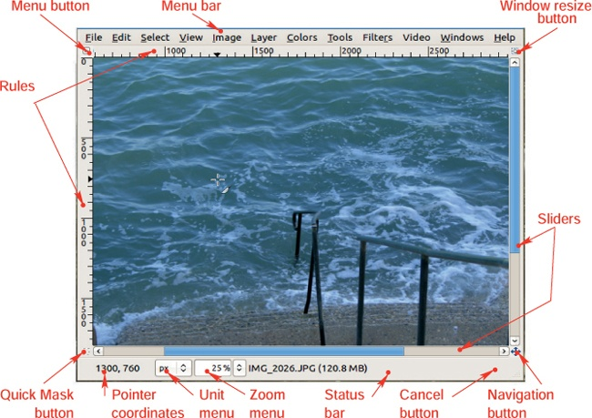

图 9-15. 图像窗口及其组件

与许多其他图形应用程序相比，GIMP 界面具有惊人的可定制性。GIMP 提供了多种方式来完成相同的操作，因此你可以选择你偏好的方法。例如，除了点击和拖动外，你还可以使用选项卡配置菜单来移动可停靠的对话框。在图 9-10 中，你可以看到一个用于分离选项卡的条目，以及另一个菜单条目用于在与当前选项卡相同的停靠区中添加选项卡。相应的子菜单列出了所有可停靠的对话框。你甚至可以在多个不同的位置打开相同的可停靠对话框。

在大多数可停靠的对话框中，右键点击对话框会打开一个特定于该对话框的菜单，这也是选项卡配置菜单的第一个条目。如果选中选项卡配置菜单中的“将选项卡锁定到停靠区”条目，它会防止你将对话框从当前的停靠区拖出，但不会阻止你关闭它。

你可以将任何选项卡拖动到选项卡列表中的新位置。要激活一个选项卡，点击它，或者右键点击选项卡列表中的某个地方并选择其图标，如图 9-14 所示。

## 图像窗口

因为图像窗口是 GIMP 界面的核心，所以我们要确保熟悉它的所有功能。图 1-15 展示了图像窗口及其主要组件，我在这里附上一个版本供参考(图 9-15)。

在 GIMP 中打开时，图像会被放置在一个*画布*上。图像窗口显示的是画布的一部分，你可以使用垂直和水平滑块在窗口内移动画布。如果画布小于窗口，未使用的区域会填充为中性色灰色。你还可以通过三种其他方式在窗口内移动画布：

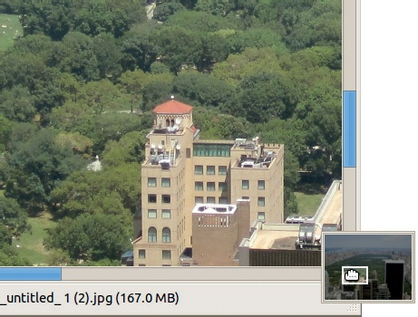

图 9-16. 使用导航按钮

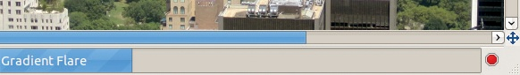

图 9-17. 状态栏和取消按钮

+   使用窗口右下角的*导航按钮*，如图 9-16 所示

+   按住  键同时移动鼠标（但不点击）

+   使用鼠标滚轮向上或向下滚动（按住  键并滚动可以将画布向左或向右移动）

窗口底部的状态栏显示各种信息：当前图层的名称和大小（以内存为单位），解释如何使用当前工具的消息，或者如果 GIMP 正在应用滤镜，则显示进度条和取消按钮（图 9-17）。请注意，从 2.8 版本开始，变换工具将其状态显示在画布上，而不是在状态栏上。

位于窗口左下角的指针坐标显示鼠标指针的准确位置（如果它在窗口内）。你可以使用右侧的下拉菜单更改这些坐标的单位。在图 9-18 中，坐标以毫米为单位显示。请注意，坐标是相对于图像的，与屏幕坐标无关。有关详细信息，请参见第十章。

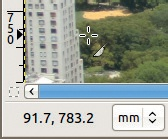

图 9-18. 指针坐标（以毫米为单位）

我们将在后面讨论图像窗口的其他组件：在第十章中讨论标尺和缩放菜单，在第十三章中讨论快速蒙版按钮。

# 9.2 基本的 GIMP 命令

新的 GIMP 用户有时会被多个单独的窗口所困扰，并且多年来一直抱怨这个问题。我们的建议是先试试。多窗口模式让你可以同时查看两个图像。它还允许你更好地控制各个窗口的大小和对话框的位置。如果你仍然不喜欢多个窗口，可以切换到单窗口模式。

## 关闭窗口和退出 GIMP

很多人习惯在不需要窗口时立即关闭它们，即使他们计划很快重新打开。用户通常也只是关闭对话框，而不是按取消或否定按钮，尤其是在改变主意时。这种操作在具有*阻塞界面*的应用程序中是必要的。而 GIMP 的界面是*非阻塞*的：你可以同时开始做几件事，改变主意，暂时不回答问题而无需取消对话框等等。能够同时进行多项操作在需要在最终设置之前获取一些信息时尤为方便。

如果关闭其中一个 GIMP 窗口，会发生什么？这取决于窗口本身。关闭图像窗口有两种不同的效果，具体取决于其内容。如果图像窗口为空，关闭它会退出 GIMP，相当于选择**图像：文件 > 退出**或按下。

图 9-19 显示了图像窗口为空时的**图像：文件**菜单。许多条目被灰显，意味着在没有当前图像的情况下这些选项无效。退出 GIMP 的快捷键 () 也显示在菜单中。

如果图像窗口包含图像，关闭窗口相当于选择**图像：文件 > 关闭**或按下。如果图像已被更改但尚未保存，GIMP 会询问你是否要保存图像或丢弃更改，如图 9-20 所示。即使你刚刚导出了图像，GIMP 也会询问是否要保存它（作为 XCF 格式）。如果决定不关闭图像，你可以取消操作。

图像窗口是唯一在关闭时会退出 GIMP 的窗口。工具箱窗口和多对话框窗口只是辅助窗口。你可以打开、关闭或隐藏它们，并在需要时召回它们 ()。

在 GIMP 的早期版本中，工具箱是主窗口。它包含一个与图像窗口菜单栏不同的菜单栏，关闭工具箱会退出 GIMP。

在当前版本的 GIMP 中，你可以在没有工具箱的情况下工作，因为工具箱的存在仅仅是一个便利。你可以通过**图像：工具**菜单访问它包含的所有工具，而且这个菜单实际上包含的工具比默认的工具箱窗口还要多。其他对话框更有用，因为你无法通过其他方式访问它们提供的功能。这些包括工具选项对话框、图层对话框和通道对话框。

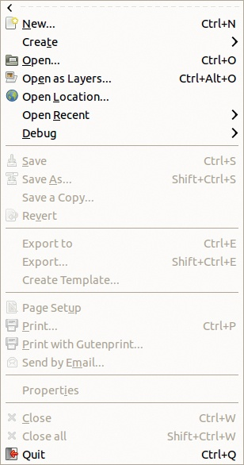

图 9-19. 没有打开图像时的图像：文件菜单

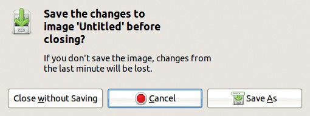

图 9-20. 尝试关闭已更改的图像

## 处理多个图像

到目前为止，我们一直将图像窗口视为只有一个。但如果同时打开多个图像，您可以拥有多个图像窗口。如果使用 关闭其中一个窗口，选择**图像：文件 > 关闭**，或点击窗口顶部的按钮，则仅关闭该窗口，其他窗口保持打开。当你关闭最后一个打开的图像时，你将看到 GIMP 启动时看到的空白图像窗口。您也可以通过按下 或选择**图像：文件 > 关闭全部**来关闭所有打开的图像而不退出 GIMP。

当你打开多个图像时，需要知道哪个图像是活动图像。如果你在图像窗口中使用菜单，它会对该窗口中的图像进行操作。然而，如果你在工具箱中使用工具，活动图像则不太明显。事实上，点击工具箱中的工具图标选择了工具，但并不会激活它。要激活它，你需要点击图像窗口。

尽管点击通常有效，但如果你的窗口管理器允许，可以设置 GIMP，使得只需将鼠标指针悬停在窗口上即可激活窗口，而无需点击。在 GNOME 2 桌面环境中，检查通过**系统 > 首选项 > 窗口**打开的窗口中的第一个按钮。在 GNOME 3 中，安装并调用`gconf-editor`，然后将**apps: metacity > general > focus-mode**更改为`mouse`。在 Ubuntu Unity 中，这是默认行为。在 Windows 中，进入控制面板并找到“更改鼠标的工作方式”。在 Mac OS X 中，使用 TinkerTool。

这种设置使得在 GIMP 中工作更加容易。例如，假设你选择了矩形选择工具，这是工具箱中的第一个工具。点击图标并将鼠标指针移动到你想要工作的图像窗口，你可以立即开始绘制矩形选择。如果你需要先点击窗口使其成为活动窗口，如果不小心，可能会意外创建一个微小且几乎不可见的选择。要使用键盘快捷键（在这种情况下），你必须在输入快捷键前点击图像窗口——而不会不小心使用当前工具编辑图像。将鼠标指针移动到图像上并输入快捷键则更加安全和简便。

多对话框窗口中的对话框也仅对其中一个图像窗口进行操作。默认情况下，图像菜单出现在多对话框窗口的顶部，显示当前活动的图像（图 9-14）。当你按下 AUTO 时，按钮会变为灰色，当前图像会在选择图像窗口时自动切换（通过点击或移动鼠标指针，具体取决于设置）。如果你不按下它，按钮会变为白色，你必须在菜单中显式地更改当前图像。

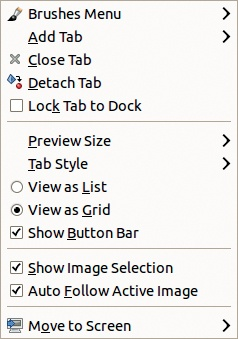

图 9-21. Tab 按钮菜单中的选项

如图 9-21 所示，对于普通的可停靠对话框，其 Tab 按钮菜单中有两个图像选择选项：

+   **SHOW IMAGE SELECTION**指定图像菜单是否出现在停靠栏顶部。

+   **AUTO FOLLOW ACTIVE IMAGE**指定选择另一个图像窗口时是否会更改活动图像。此选项与可停靠对话框顶部的**AUTO**选项相同。

尽管这些选项出现在特定对话框的 Tab 按钮菜单中，但它们适用于整个停靠栏。

查看哪个图像在可停靠对话框中是活动图像的另一种方法是将该图像的缩略图添加到工具箱中，如图 9-22 所示。要添加它（或任何信息缩略图），请选择**图像: 编辑 > 偏好设置**。在打开的对话框中（详细介绍见第二十二章），选择**工具箱**并勾选**外观**下的三个按钮，如图 9-23 所示。

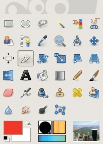

图 9-22. 工具箱中的信息缩略图

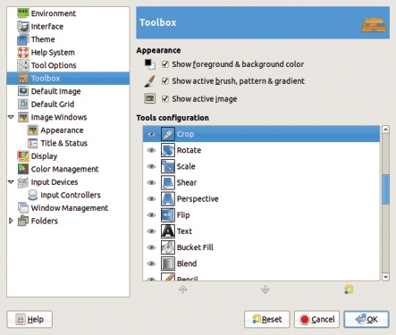

图 9-23. 偏好设置对话框，工具箱条目

## 常见的 Tab 菜单选项

我们已经考虑了**Tab 菜单**中的几个选项，该菜单在点击可停靠对话框右上角的小三角按钮时弹出（图 9-21）。接下来，我们将查看这个菜单中间出现的其他一些选项。对于某些对话框，某些选项可能会变灰或被省略。

**PREVIEW SIZE**打开的菜单如图 9-24 所示。许多可停靠对话框显示图像、画笔、图案、渐变或字体的缩略图。您可以以八种不同的大小显示这些缩略图。图 9-25 展示了选择了小尺寸缩略图的画笔对话框。对于屏幕很小的用户，最小尺寸非常有用，而最大的尺寸则适合视力受损的用户。

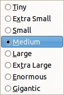

图 9-24. 预览大小子菜单

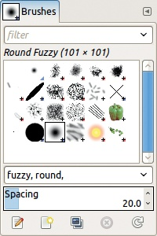

图 9-25. 带有小缩略图的画笔对话框

TAB STYLE 打开图 9-26 中显示的菜单，用于更改标签的外观。ICON 仅使用描述性图标。CURRENT STATUS 显示当前选择的画笔、图案、字体、渐变等的缩略图。TEXT 显示对话框名称。你还可以选择同时显示名称和图标或状态。图 9-27 显示了带有图标和文本的标签。AUTOMATIC 根据停靠区可用的空间选择样式：当只有一个标签可见时，使用 ICON & TEXT 样式；如果多个标签可见，则使用 ICON 或 CURRENT STATUS 样式。

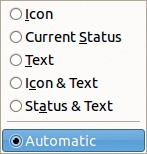

图 9-26. 标签样式子菜单

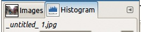

图 9-27. 更改标签样式

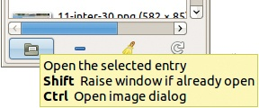

图 9-28. 对话框按钮工具提示

VIEW AS LIST 和 VIEW AS GRID 是单选按钮，因此一次只能选择一个。VIEW AS LIST 每行显示一个项目，而 VIEW AS GRID 尽可能每行显示多个项目。

SHOW BUTTON BAR 指定是否显示对话框底部的按钮栏。按钮栏中的按钮因对话框而异。有些对话框有多达八个按钮（例如路径对话框），而有些则只有三个按钮（例如图案对话框）。当你将鼠标指针悬停在按钮上时，按钮的功能会显示在工具提示信息中，如图 9-28 所示。如果屏幕空间紧张，可以隐藏按钮栏；相应的操作仍然可以通过右键菜单和标签菜单中的第一个条目访问。

# 9.3 使用 GIMP 界面

在本节中，我们讨论与 GIMP 交互的三种主要方式：打开菜单、使用键盘命令和使用鼠标点击并拖动一个组件从一个对话框到另一个对话框。

## 菜单

你可以通过三种方式从图像窗口打开菜单：

+   点击菜单栏中的菜单名称，如图 9-29（顶部）所示。

+   使用图像窗口左上角的图像菜单按钮，如图 9-29（中间）所示。

+   右键点击图像窗口，如图 9-29（底部）所示。

从图像菜单按钮或右键点击图像窗口打开的菜单会在顶部显示一条虚线。如果你点击虚线，菜单会变成一个独立的窗口，如图 9-30 所示。如果你需要多次使用某个菜单，这种方式非常方便。如果你想关闭独立菜单，只需再次点击虚线即可。（不能将从图像窗口菜单栏打开的菜单独立出来。）

如果你关闭了图像窗口，而该窗口中的菜单已经独立出来，为避免混淆，你也应该关闭该独立菜单。

任何图像菜单都可以独立出来，只要它是通过右键点击或按下菜单按钮打开的。其他菜单，比如从可停靠对话框中打开的菜单，是无法独立出来的。

## 键盘快捷键

正如你现在一定已经看到的，GIMP 提供了多种方式来完成同一任务。键盘快捷键是访问 GIMP 功能和工具的另一种方式。它们提供了访问菜单项或切换设置的替代方式。例如，当你在图像窗口中使用鼠标滚轮时，如果按下  或 ，你可以放大或缩小，或在画布上水平移动图像。

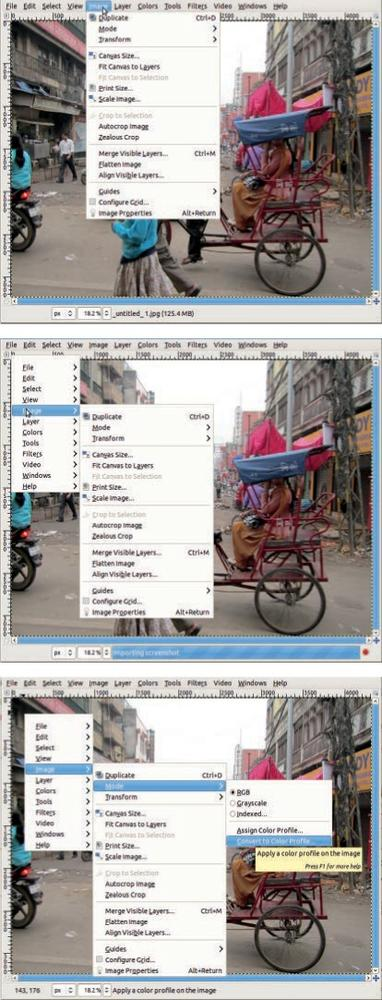

图 9-29. 打开菜单

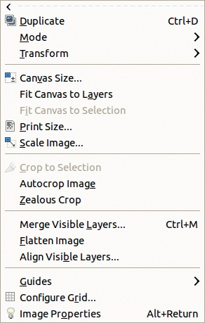

图 9-30. 独立菜单

和许多其他应用程序一样，你可以使用  键代替鼠标来打开菜单。前提是图像窗口处于活动状态，你会看到在图像窗口菜单中的某些条目名称的字母下方有下划线。按住  键并按下相应的键，即可打开对应的菜单。例如，在 `文件` 中，字母 `F` 下划线，如 图 9-31 所示，按下  即可打开文件菜单。该菜单中的下划线字母可以用来访问子菜单，但你无需按下  键。例如，`打开` 中的字母 `O` 在文件菜单中有下划线。如果你松开  键并按下 ，则会弹出 **图像：文件 > 打开** 对话框。如果弹出的对话框包含带下划线字母的菜单选项，你需要按下  键来选择相应的条目。例如，如果你输入 ，则会打开 Levels 工具，选择 AUTO，然后应用该工具。此技术同样适用于其他图像窗口菜单，但在某些情况下，菜单中没有字母下划线，意味着该菜单中的条目无法使用键盘选择。

图 9-31 还显示了右侧某些菜单项的键盘快捷键。许多常用的 GIMP 命令已经与键盘快捷键关联，你也可以定义自己的快捷键或更改现有的快捷键，具体操作请参见 第二十二章。

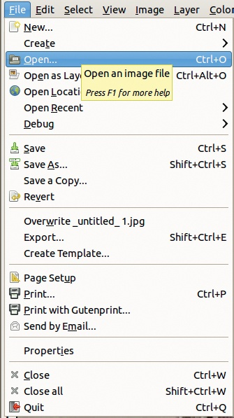

图 9-31. 图像：文件菜单

## 键盘提示

当你想更改选项字段中的数值时，如在创建新图像对话框中的大小字段（参见 创建新图像），你可以输入一个表达式而不是一个数字。例如，如果字段中最初包含 640，输入 *2 将得到 1280，或者输入 +30 将得到 670。你还可以输入 3000/7 得到 429。你可以将百分比应用于先前的值，或在表达式中使用不同的单位，如 30in+40px 或 4*5.4in。要检查计算结果，使用 。要应用结果，使用 。

如前所述，按住  键，然后用鼠标点击并拖动，是移动图像窗口中的图像的便捷方法。

你可以通过按下 、 或  来切换多个工具的选项。例如， Dodge/Burn 工具在按下  时在 Dodge 和 Burn 之间切换。

一些键盘快捷键对应的是按钮，而不是菜单项。例如， 会将前景色和背景色恢复为默认值， 会交换它们。 会在可停靠对话框中按列表样式搜索条目。

一些键盘快捷键比较隐蔽，但记住它们非常有用。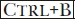 打开并激活工具箱。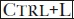 对图层可停靠对话框做相同的操作。按下  会将视图缩放到 100%， 为 200%，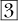 为 400%，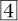 为 800%，而 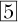 为 1600%。

对于选择工具（第十三章），按下  和/或  *在* 开始选择之前会切换可用的选择模式。对于矩形和椭圆选择工具，如果你在开始选择之后按下 ，选择框将会以起始点为中心。按下  或  在开始选择之后会切换不同的选项。

使用绘图工具时，按下  会减小不透明度， 会增加不透明度。按下  会减小当前画笔的大小， 会增大它， 会将画笔大小重置为初始值。

按下  通常会取消一个命令，相当于按下对话框中的“取消”按钮。按下  会打开 GIMP 的帮助文档，按下  会进入互动帮助模式。光标会变成一个问号，你可以点击需要帮助的菜单或窗口。按下  可以编辑名称，相当于双击名称。按下  会在全屏模式和普通模式之间切换。

## 点击并拖动

使用 GIMP 的另一种方式是通过点击和拖动。我们在本章的前面已经看到过，当我们拖动并释放可停靠的对话框时，可以将其添加到停靠区或从停靠区移除。下面是一些其他的点击和拖动快捷方式。

将图像缩略图拖动到工具箱或空白的图像窗口中，会打开相应的文件，只要该文件能够被 GIMP 读取。拖动操作适用于存储在计算机上的文件缩略图，或来自浏览器搜索、图层对话框、通道对话框，甚至工具箱本身的图像缩略图。将图像缩略图拖动到已占用的图像窗口中，会将其作为新图层添加到图像中。

将工具箱中的图像缩略图拖动到 XDS 兼容的文件管理器中，会将图像保存为 XCF 文件。

将画笔图标从画笔对话框拖动到工具箱中，会在新图像窗口中打开它，你可以编辑该画笔并将其保存为新的画笔。如果将画笔拖动到已占用的图像窗口中，该画笔会作为新图层应用到图像中。你也可以对图案执行相同的操作，但如果图案拖动到已占用的图像窗口中，它会填充当前图层中的当前选择区域。

你可以在图层对话框中点击并拖动图层，向上或向下调整位置，这同样适用于通道和路径。

在所有包含删除图标的对话框中，将项目拖动到该图标上会删除该项目。删除拖动操作适用于图层、通道和路径对话框；调色板编辑器对话框；以及绘画动态、图案和渐变对话框，只要这些动态、画笔、调色板或渐变是用户自定义的。

将颜色样本拖动到已占用的图像窗口中，会用该颜色填充当前选择区域。拖动操作适用于工具箱中的前景色和背景色，以及调色板编辑器对话框中的组件。将颜色样本拖动到渐变编辑器中，会将该颜色插入到渐变中，位置取决于放置的位置。

你可以通过简单的点击和拖动执行更多操作——这些操作通常非常直观。

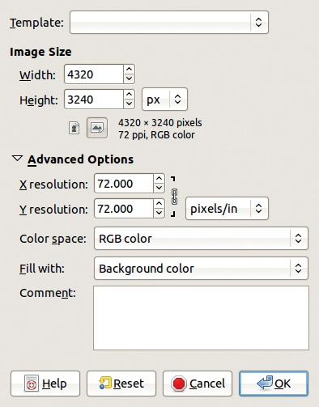

图 9-32. 创建新图像对话框

# 9.4 创建、加载、保存和导出文件

加载到 GIMP 中的图像存储在你计算机的主内存中，但当你保存图像时，它将作为一个文件存储。在本节中，我们讨论如何从文件中加载图像并将图像保存或导出为文件。

## 创建新图像

**图像：文件**菜单的第一部分（见图 9-31）处理的是创建或打开图像。在本节中，我们将介绍前两个选项，它们让你创建新图像。

当你选择**图像：文件 > 新建**或按下 时，会出现图 9-32 所示的对话框。点击“高级选项”以展开对话框，如图所示。建议的图像大小是当前图像的大小（如果有的话），或者是创建新图像时使用的最后一个大小。图 9-33 中显示了模板下拉菜单，其中提供了几个预定义的大小和分辨率。如果你选择一个模板，HEIGHT 下方的两个按钮可以让你交换宽度和高度。

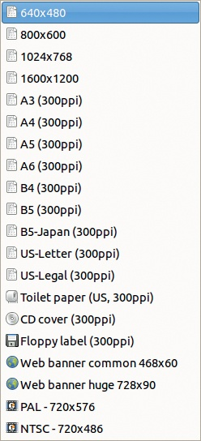

图 9-33. 预定义模板

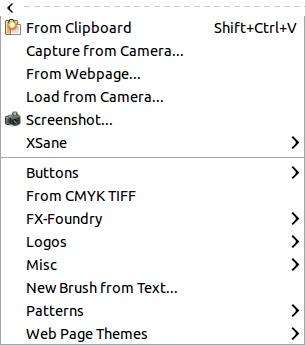

图 9-34. 图像：文件 > 创建菜单

在**高级选项**下，你可以选择 X 和 Y 分辨率。默认值是 72，但可以将其更改为屏幕分辨率或预期的打印分辨率。你还可以选择 RGB 颜色或灰度模式。最初，图像必须填充某些内容，你可以选择背景颜色、前景颜色、白色或透明。最后，如果需要，你可以添加评论。当你点击“确定”时，新的图像将被创建。

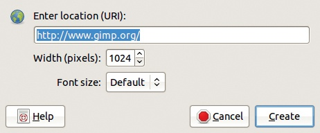

图 9-35. 来自网页创建对话框

**图像：文件 > 创建**打开图 9-34 所示的菜单。第一个选项在第十三章中有讨论，接下来的五个选项在第十九章中有介绍，除了下面描述的 FROM WEBPAGE 选项。如果你安装了 XSane 插件，其中一些选项才会出现。该菜单下半部分的选项会打开一些工具，这些工具会自动创建新图像，设计用于按钮、徽标、画笔等。我们将在第二十一章中简要介绍这些工具。

## 加载网页为图像

**图像：文件 > 创建 > 从网页创建（From Webpage）** 打开图 9-35 中显示的对话框。输入你想下载的页面的 URL（默认输入的是 GIMP 官方网站）。你可以输入要构建图像的宽度（单位为像素），例如浏览器窗口的宽度。在字体大小（FONT SIZE）方面，你可以在五种预定义的大小（从 TINY 到 HUGE）中选择，这将同时改变图像的大小。

当你按下“创建（CREATE）”时，页面将被下载、渲染成图像，并在 GIMP 中打开。例如，如果你保持所有参数为默认值，你将得到一个大小为 1024 × 4066 像素的 GIMP 首页图像。将网页作为图像打开是控制打印效果的好方法，因为你可以在 GIMP 中调整其大小。

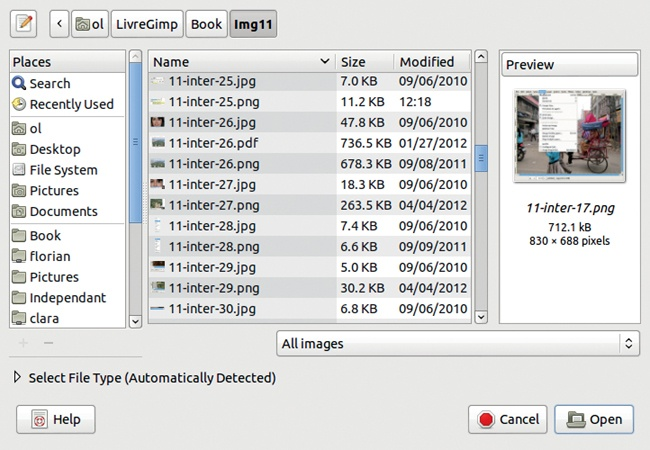

图 9-36. 打开图片对话框

## 从文件加载图像

**图像：文件**菜单中的下四个选项（见图 9-31）涉及打开现有文件。选择**图像：文件 > 打开**或按下 会打开图 9-36 中显示的对话框。由于我们在第一章和本章前面部分已经讨论过此对话框，因此此处仅展示我们之前未涉及的部分。PLACES 面板的下半部分包含*书签*，即保存的路径。例如，你可以为通常存放照片的文件夹添加书签。你可以通过点击“添加（ADD）”和“删除（REMOVE）”按钮来添加或移除书签。要添加书签，选择中间面板中的目录，然后点击“添加（ADD）”。要删除书签，选择左侧面板中的书签并点击“删除（REMOVE）”。如果你使用的是具有 GNOME 桌面环境的 GNU/Linux 平台，你也可以在 GIMP 外部管理书签。

右侧面板下方的按钮会打开图 9-37 中所示的菜单，列出所有 GIMP 可以打开的图像格式或文件类型。你可以选择只查找某些类型的图像。

如果你点击“选择文件类型（SELECT FILE TYPE）”，你将看到所有可用的文件格式及其对应的扩展名。让 GIMP 自动检测文件类型，因为 GIMP 知道如何可靠地根据文件的内部特征来进行识别。文件类型的确定**不是**由扩展名决定的。

**图像：文件 > 作为图层打开（Open as Layers）** () 打开相同的对话框，但你选择的文件将作为新图层插入当前图像（如果你打开的是多层图像，则会插入多个图层）。

**图像：文件 > 打开位置**打开一个对话框，显示在图 9-38 中。你可以将文件路径粘贴到该字段中，但通常点击并拖动图像从浏览器到工具箱（以将其作为新图像打开）或拖动到当前图像（以将其作为新图层打开）会更简单。

**图像：文件 > 最近打开**打开一个类似于图 9-39 的菜单。你最近打开的 10 个图像会列在其中，你也可以使用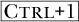，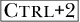等等来打开这些图像。

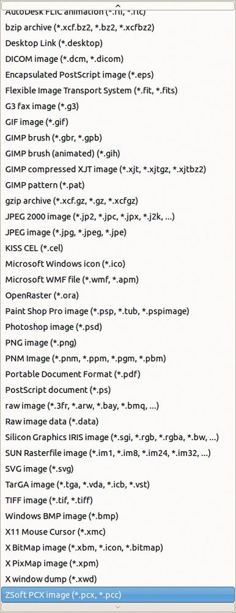

图 9-37. 可用的文件类型

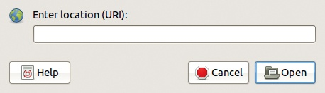

图 9-38. 打开位置对话框

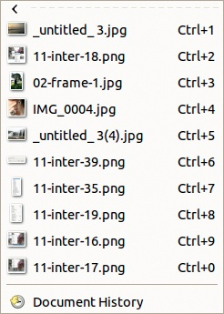

图 9-39. 最近打开菜单

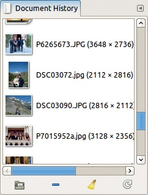

图 9-40. 文档历史对话框

“最近打开”菜单中的最后一个条目会打开图 9-40 所示的可停靠对话框，允许你浏览最近打开的图像列表。该列表可以包含数百个图像，但历史记录中不会有任何图像出现两次。如果你重新打开一个之前打开过的图像，其条目会被移动到列表的顶部。

你可以使用按名称在列表中搜索图像。列表底部会打开一个小输入框，你输入时，GIMP 会显示第一个与你输入的字符串匹配的名称。

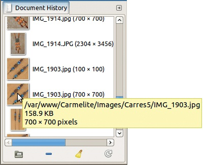

图 9-41. 悬停在缩略图上

如果你将鼠标悬停在缩略图上，会弹出一条消息，显示该图像的一些基本特征（见图 9-41）。

右键点击缩略图会打开图 9-42 所示的菜单，列出了常见的操作。你可以将图像作为新图像打开，如果该图像已经打开但被其他窗口遮挡，则可以将其置顶，打开“文件打开”对话框并预先选择该文件，复制图像的位置到剪贴板，从历史记录中删除该缩略图，清除全部历史记录，刷新该缩略图，刷新所有缩略图，清除*悬挂条目*的历史记录，悬挂条目是指对应已不存在文件的条目。

文档历史对话框底部的四个按钮允许你执行以下操作：

+   打开图片（最左侧的按钮）。如果图片已经打开，按下  和此按钮可以将其置于最前面。你也可以按下  和此按钮打开文件打开对话框。

+   移除选中的条目（第二个从左侧的按钮）。

+   清除整个文档历史记录（第二个从右侧的按钮）。

    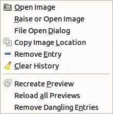

    图 9-42. 历史菜单

+   刷新缩略图（最右侧的按钮）。按下  和此按钮刷新所有缩略图，或者按下  和此按钮移除悬挂的条目。

如果图片名称旁没有缩略图，点击以查看缩略图，或者双击以打开相应的图片。

## 保存图像

**图像：文件**菜单的第二部分（见图 9-31）让你可以保存图像。如果自上次保存以来图像发生了变化，标题栏中的图像名称前会出现一个星号。如果你尝试在没有保存更改的情况下关闭图像，会出现我们在图 9-20 中看到的对话框。你可以选择在关闭之前保存文件、取消关闭，或者丢弃更改。如果你丢弃了更改，就无法找回它们。

在 2.6 及之前的版本中，你可以将图像保存为任何可用的输出格式。如果该格式无法表示图像中的所有信息，则会丢弃这些信息。如果图像包含图层且所选格式无法表示图层，则会显示警告信息，但之后图像仍会保存，没有图层。在 2.8 版本中，你只能保存为 XCF 格式，这是 GIMP 的原生格式，可以表示图像中的所有信息，包括路径、图层和图层组。你可以将图像导出为多种格式，但除非保存为 XCF，否则一些信息将会丢失，GIMP 在关闭图像之前会提醒你。例如，如果你为照片添加了图例，保存为 XCF 格式将保存新添加的文本图层。这样，你可以稍后更改图例的文本或呈现方式，而在 JPEG 图像中，由于文本图层会与照片合并，这将变得不可能。

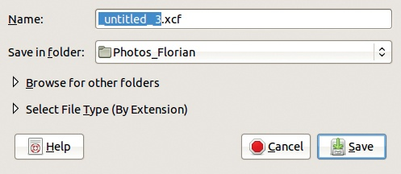

图 9-43. 保存图片对话框（简洁版）

图 9-44. 尝试保存为非 XCF 格式

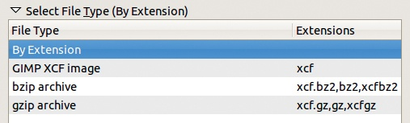

图 9-45. 可用的保存文件类型

“另存为”或  打开一个对话框，显示在图 9-43 中。你可以更改文件名和路径。你可以选择任何文件夹，或者从你已书签的文件夹中选择。文件类型会自动设置为 XCF，因为你是在保存而非导出。如果你尝试更改文件类型，你会看到在图 9-44 中显示的消息。如果你展开“选择文件类型（按扩展名）”，你将只看到图 9-45 中显示的选项，它们允许你在保存时压缩文件。

点击“浏览其他文件夹”会展开“保存图像”对话框，允许你浏览现有文件夹或创建新文件夹。如果你选择的文件名已存在，GIMP 会提醒你，可以更改文件名或替换现有文件。

图 9-46. 还原图像

图 9-47. 文件菜单上的导出选项，第一版

“保存副本”与“保存”类似，不同之处在于，GIMP 会要求你输入文件名（和位置），而当前图像不会被更改或视为已保存。如果你计划进行一些无法轻易撤销的操作，保存副本是个不错的主意。

“还原”是一个相对危险的命令，因为它无法撤销。基本上，它会丢弃自上次保存以来对图像所做的所有更改。会出现一条警告信息，如图 9-46 中所示，提醒你所有更改和撤销信息将会丢失。

## 导出图像

**图像 > 文件**菜单的下一个部分涵盖了导出选项。在导出任何图像时，某些信息会丢失。如果当前没有可用图像或图像是 XCF 格式，第一项会变为灰色。如果当前图像已经被导出，第一项（导出到）会被“覆盖”替代（见图 9-47 和图 9-48），并且在其窗口标题中会显示词语“(已导出)”。

导出 () 总是可用的。此命令打开一个对话框，类似于图 9-36 中显示的打开图像对话框。

图 9-48. 文件菜单中的导出选项，第二版

图 9-49. 导出为 PNG

你可以通过在文件名中添加适当的扩展名来指定文件类型，或者通过 SELECT FILE TYPE 条目选择类型。所有主要的文件类型都可以选择，GIMP 甚至能够导出为 Photoshop 格式。虽然你不能从 Photoshop 导出为 XCF，但 GIMP 可以读取 PSD 格式。除了 JPEG、GIF 和 PNG，GIMP 还可以导出为 PDF、Encapsulated PostScript（EPS）、TIFF 和许多其他格式。

如果文件名已存在，将会出现警告消息，你可以选择取消或覆盖文件。根据输出格式，会出现不同的对话框。例如，图 9-49 显示导出为 PNG 的对话框，图 9-50 显示导出为 Encapsulated PostScript 的对话框。

EXPORT TO () 使用与上次导出的相同名称和文件类型，因此不会弹出对话框。如果你想更新已经导出的图像，这是一个有用的选项。如果你正在处理一个不使用 XCF 格式的图像，定期保存并导出图像时，可以使用  和  这两个快捷键，它们在你保存并导出图像后会静默工作（即，不会打开任何对话框）。

图 9-50. 导出为 Encapsulated PostScript

图 9-51. 将图像保存为新模板

OVERWRITE 在图像从非 XCF 格式导入时可用。它会导出为与导入文件相同名称和文件类型的文件。如果需要，你还可以将文件导出为不同的文件类型。

CREATE TEMPLATE 打开对话框，如图 9-51 所示，允许你创建一个新模板。保存的模板可以从图 9-32 中显示的对话框中选择。模板是根据当前图像的尺寸、分辨率和色彩空间创建的。

使用模板可停靠对话框管理现有模板，如图 9-52 所示（**图像：Windows > 可停靠对话框 > 模板**）。底部行的五个按钮让你执行以下操作：

+   从选定的模板创建新图像。

+   创建一个新模板。点击这个按钮会打开图 9-53（扩展了高级选项）所示的对话框。你可以选择新模板的名称、大小、分辨率、色彩空间、填充颜色，甚至是图标。如果你点击图标按钮，将显示 GIMP 中所有可用图标的列表。图 9-54 展示了这个列表的一部分。底部行的按钮可以进行放大或缩小，并允许你选择如何展示列表。

    

    图 9-52. 模板对话框

+   复制选中的模板，这会打开图 9-53 所示的对话框，并带有与选中模板相同的参数。

+   编辑选中的模板，这也会打开图 9-53 所示的对话框，但这个选项允许你更改现有模板的参数。

+   删除选中的模板。

你也可以通过右键点击模板列表来访问这些选项。

# 9.5 撤销

GIMP 允许你撤销多个步骤，这使得撤销成为一个有用且强大的功能。这个能力意味着 GIMP 必须存储你正在处理的图像的多个连续状态，因此你可以撤销的步骤数量是有限制的。我们将在第二十二章中展示如何调整这个限制。

图 9-53. 新建模板对话框

图 9-54. 可用图标

图 9-55 展示了**图像：编辑**菜单中的撤销操作项。我们最近使用了 IWarp 和 Blend 工具，但我们选择撤销 Blend。因此，菜单显示撤销 IWarp 滤镜或重做 Blend 的选项。如果在 IWarp 之前做了其他操作，我们也可以撤销这些操作，如果我们在 Blend 之后做了其他操作，也可以在重做 Blend 后重做这些操作。

图 9-55. 编辑菜单中的撤销项

菜单中的前两项文本取决于你对图像做了什么。  是撤销的快捷方式， 是重做的快捷方式。即使一个变换或滤镜处理过程繁重，撤销和重做也不会受到影响。

但是计算机的存储空间有限，因此 GIMP 存在一些限制：

+   如果你撤销了某个操作并且随后更改了图像，则无法重做该操作。撤销历史就像是每次更改图像时会分叉的路径。如果你折返并返回（使用撤销），然后再做更改，就会走上一条新的分支，之前路径上的步骤将丢失。

+   一些操作是无法撤销的，尤其是与保存和加载图像相关的操作。如果你保存了图像、关闭它然后重新加载，撤销历史将丢失。还原图像会关闭图像并重新加载，因此还原操作不能撤销。

+   一些复杂的选择工具，如剪刀选择工具或自由选择工具，在构建选择时不允许撤销。完成选择后你可以撤销，但无法在构建过程中撤销某个步骤。

+   大多数滤镜和插件都具备完全的撤销功能，但一些外部插件可能无法正常工作，甚至可能损坏撤销历史。在插件运行时取消操作也可能损坏撤销历史。

图 9-56. Fade 对话框

编辑菜单中的 FADE 条目通常是灰色的。只有在你刚使用了油漆桶工具、混合工具或某些滤镜之后，Fade 才可用。其对话框显示在图 9-56 中。Fade 修改最后操作的混合模式和不透明度。例如，在正常模式下用油漆桶工具填充并设置完全不透明后，你可以通过 Fade 将模式改为“屏幕”并降低不透明度。由于渐变是对操作的修改，Fade 不会在撤销历史中增加一个步骤。与 GIMP 中的大多数操作不同，Fade 是阻塞的：一旦开始，你必须选择渐变或取消，无法先做别的再返回到 Fade 对话框。

如图 9-57 所示，所有的图层混合模式都可用，另外还有仅适用于绘画工具的 BEHIND 和 COLOR ERASE 模式，以及 REPLACE、ERASE 和 ANTI ERASE 模式。模式和不透明度的效果可以立即看到，但效果只有在点击 FADE 按钮时才会成为永久性改变。

图 9-55 中的最后一项打开撤销历史可停靠对话框，显示在图 9-58 中。此对话框最初出现在多对话框窗口中，显示所有可以撤销的操作。图像的初始状态位于列表顶部，最后一个可恢复的状态位于底部。如果你点击某个状态，它将成为当前状态。

底部一排的三个按钮，从左到右，分别用于撤销、重做或清除撤销历史。除非你非常需要内存空间，否则不建议清除历史记录。

图 9-57. 渐变模式

# 9.6 GIMP 帮助系统

GIMP 帮助系统菜单如图 9-59 所示。您可以随时按下获取帮助。此命令打开帮助系统，显示完整帮助的目录。帮助系统将在 GIMP 浏览器或您首选的浏览器中启动，具体取决于帮助系统中描述的设置。

图 9-58. 撤销历史对话框

图 9-59. 图像：帮助菜单

如果按下或使用**图像：帮助**菜单中的相应条目，鼠标指针下会出现一个问号，您可以点击它来获得 GIMP 界面中的任何帮助；例如，您可以获得有关切换快速蒙版按钮或涂抹工具的帮助。

今日提示的示例见于图 9-60。在 GIMP 的早期版本中，启动时默认会显示此提示。现在，您必须显式地打开它。这些提示对于新手很有帮助，但对于老手来说，它们很少有用。

关于条目打开一个信息窗口，明确列出当前版本号、GIMP 开发团队成员，并提供访问 GIMP 网站或阅读致谢列表和许可证的按钮或链接。

图 9-60. 今日提示

图 9-61. GIMP 在线菜单

图 9-62. 用户手册菜单

插件浏览器和过程浏览器条目对于编写插件的人非常有用，插件内容将在第二十一章中讨论。

GIMP 在线条目打开了图 9-61 中所示的菜单，其中包含指向四个官方 GIMP 网站的书签。这些网站将在首选项对话框中指定的 Web 浏览器中打开。

+   开发者网站顾名思义，主要面向 GIMP 开发者。

+   主要网站是任何 GIMP 用户必备的。它发布新版本，包含大多数操作系统的下载部分，并指向以下两个网站等。

+   插件注册表使您可以访问约 400 个由不同人编写的插件。该网站提供多种方式来搜索插件，并有评论和论坛。

+   用户手册网站与您通过点击  获取的内容相同，只是它在您选择的浏览器中显示，而不是在 GIMP 浏览器中显示。当您首次打开该网站时，它会打开一个页面，您可以在其中选择首选语言。

用户手册条目打开的是 图 9-62 所示的菜单。此菜单为您提供了另一种查看用户手册的方式，列出了其主要章节。它使用的是在“首选项”对话框中指定的帮助浏览器以及默认语言。
