# 第十章. 显示

本章主要介绍图像的显示方式，更深入地探讨图像窗口的属性。请注意，本章介绍的工具并不会改变图像本身，只会改变图像的显示方式。

# 10.1 标尺和单位

一旦图像在图像窗口中打开，就会出现两个*标尺*，如图 10-1 所示。水平标尺位于菜单栏下方，垂直标尺位于左侧。在此图中，鼠标指针位于坐标（1356，1128），这一信息显示在状态栏的左侧。坐标单位显示在这些数字的右侧，为像素。由于图像的缩放比例为 25%，如状态栏所示，屏幕上的一个像素实际上对应一个 4 × 4 像素的方块。标尺上的小黑三角形显示了鼠标指针当前的水平和垂直坐标。

这是默认设置，适用于 GIMP 中的大多数操作。提供的信息可以让你精确地放置鼠标指针，尤其是在你将缩放比例设置为 100% 或更高时，正如你将在本章后面看到的那样。

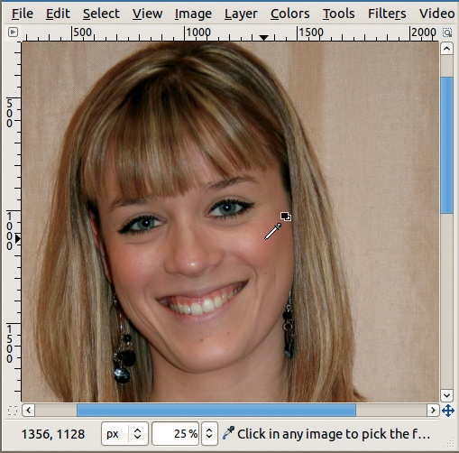

图 10-1. 像素测量标尺

图 10-2 看起来与图 10-1 非常相似。但细心的读者会注意到标尺上的数字，以及左下角的数字已经发生了变化。我们将单位从像素改为了毫米。但这些毫米到底代表什么呢？由于缩放比例为 25%，这些毫米并不等同于图像中的毫米，而是相当于四分之一毫米。如果我们将缩放比例调整到 100%（例如，通过使用状态栏中间的菜单），并将屏幕上的标尺与实际标尺进行比较，会发现它们并不匹配。

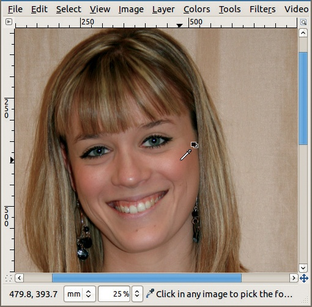

图 10-2. 毫米测量标尺

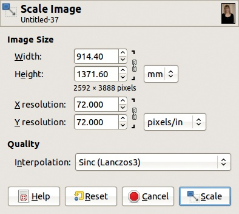

图 10-3. 缩放图像对话框

问题在于图像的大小是通过其*分辨率*计算的。如果我们选择**图像：图像 > 缩放图像**，我们会看到图 10-3 中显示的对话框，它告诉我们当前的分辨率在两个方向上都是 72 ppi。这个默认分辨率其实没有什么特别的理由；现在大多数屏幕使用 LCD 技术，分辨率接近 100 ppi。如果我们将图像的分辨率更改为 100 ppi，我们会看到它在缩放图像对话框中的尺寸发生了变化。现在图像的尺寸是 658.37 × 987.55 毫米。当我们应用更改时，屏幕上的图像大小不会变化，但标尺上的数字会发生变化（除非单位设置为像素）。

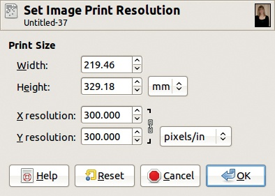

图 10-4. 设置图像打印分辨率对话框

调整分辨率仅仅告诉我们，给定其选择的分辨率时，这张图像会以何种尺寸打印。由于分辨率对打印来说才真正重要，我们建议通过**图像：图像 > 打印尺寸**来进行更改。在图 10-4 中，我们将分辨率设置为 300 ppi，这是打印的标准分辨率，并且我们看到打印图像的尺寸将是 219.46 × 329.18 毫米，比标准信纸稍长，略大于 A4 纸张。当我们在此对话框中点击 OK 时，标尺刻度再次发生变化，现在我们可以得到图像中的坐标，这些坐标将是图像打印时实际的值。

但是，如果你再次用真实的标尺测量，你会发现屏幕上的标尺仍然没有显示实际的毫米数。我们可以通过做最后一次调整来解决这个问题。**图像：视图 > 点对点**框仍然被勾选，这意味着在 100% 缩放因子下，图像中的每个像素都与屏幕上的每个像素完全对应。如果我们取消勾选该框，将图像分辨率设置为与屏幕分辨率相同，并将缩放因子设置为 100%，标尺就会显示实际的毫米数。

如果我们想要创建在打印时必须具有特定尺寸的图像，使用实际的毫米可能会很方便；例如，名片或标签。当然，使用英寸也可以进行相同的操作。

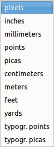

图 10-5. 可用单位

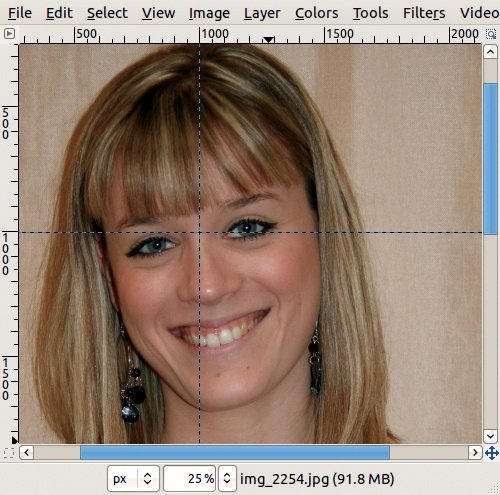

图 10-6. 图像中的两个指南

可用单位如图 10-5 所示。像素是唯一的精确度量，代表图像的大小特征。所有其他度量都是相对于图像分辨率的。

一英寸等于 25.4 毫米。厘米、米、英尺和码的定义是以毫米或英寸为倍数的单位。点和派卡是印刷术中的单位，其定义并不十分明确，因为美国派卡是 4.2175 毫米，法国派卡是 4.512 毫米，计算机派卡是 4.233 毫米。如果可能，最好避免使用这些单位。

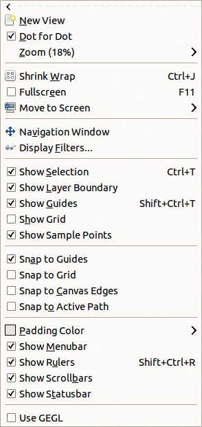

图 10-7. 图片：查看菜单

如果标尺对您造成困扰，可以通过取消勾选框（**图像：查看 > 显示标尺**）或按 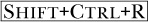 来隐藏它们。

# 10.2 引导

如果我们点击并拖动一个标尺朝图像中心移动，会出现一个蓝色和黑色的可移动虚线。这条线称为*引导*。图 10-6 展示了一个垂直引导和一个水平引导，它们交叉在(1000, 1000)坐标处。

引导菜单有许多实用选项。图 10-7 展示了**图像：查看**菜单，您可以通过它访问其中的一些选项。如果勾选了 SNAP TO GUIDES 框，鼠标指针将“自动吸附”到最接近的引导上（当其距离小于设定的阈值时，阈值调整请参阅第二十二章）。图 10-8 展示了如何利用引导确保裁剪区域的左上角位于原始图像的(1000,1000)位置。

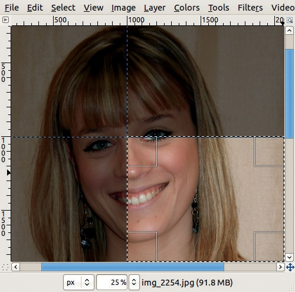

图 10-8. 使用引导进行精确裁剪

图 10-9. 图片：图像 > 引导菜单

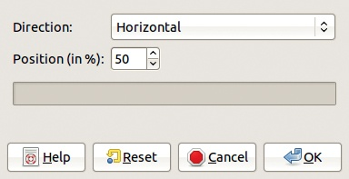

图 10-10. 创建新引导

SHOW GUIDES 选项也可以在查看菜单中找到。当勾选此选项时，引导将显示；当取消勾选时，引导将隐藏。您还可以使用  在这些选项之间切换。

我们可以向图像添加任意数量的引导。图 10-9 展示的**图像：图像 > 引导**菜单包含多个选项，第一个选项会弹出图 10-10 所示的对话框。在对话框中，我们可以选择水平或垂直引导，并设置其位置为窗口的百分比（而非图像）。第二个选项会弹出一个非常相似的对话框，但这时我们设置引导位置时使用的是像素值。

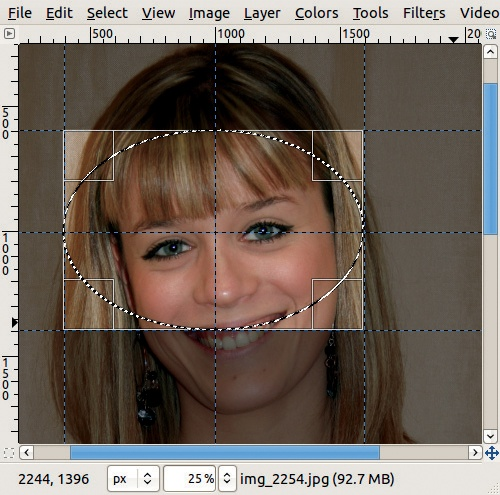

图 10-11. 从当前选择放置新参考线

第三个选项允许我们在当前选择周围放置新参考线。例如，要创建一个以现有参考线交点为中心的椭圆形选择框，如图 10-11 所示，选择椭圆选择工具()，点击参考线的交点（启用"对齐参考线"），按下键从中心扩展选择框，并移动鼠标指针以扩展选择框。然后选择**图像：图像 > 参考线 > 从选择创建新参考线**以获得所示结果。

有两种方法可以删除参考线：我们可以点击并拖动它回到相应的标尺，或者使用**图像：图像 > 参考线 > 删除所有参考线**一次性删除所有参考线。

如图 10-7 所示，视图菜单包含三个与对齐相关的按钮：

+   "对齐网格"将在下一节中讨论。

+   "对齐画布边缘"，该选项将画布的边缘当作参考线。将鼠标指针移到边缘非常接近时，它会精确地定位到该边缘。

+   "对齐活动路径"，该选项对活动路径执行相同操作。请参见 13.3 路径工具。

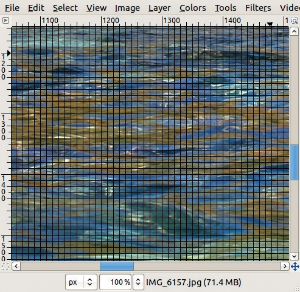

图 10-12. 显示网格

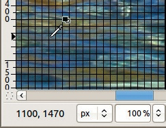

图 10-13. 将鼠标指针对齐到网格

# 10.3 网格

参考线可以帮助我们在图像中定位对象。网格是另一种可视化布局的方法。事实上，图像总是有一个网格，但默认情况下它是隐藏的。你可以按照第二十二章中描述的方法永久更改此设置。你可以使用**图像：视图 > 显示网格**来使网格可见。图 10-12 显示了结果。请注意，这张图像的显示缩放比例为 100%。

此网格的网格大小为 10 × 10 像素。当勾选**图像：视图 > 对齐网格**时，鼠标指针总是对齐到两条线的交点，即使它看起来位于网格内部，如图 10-13 所示。你可以看到，状态栏中显示的坐标都是 10 的倍数。

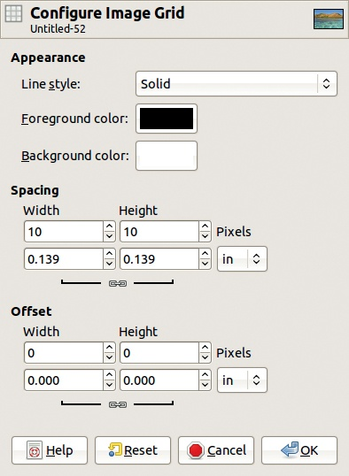

图 10-14. 配置图像网格对话框

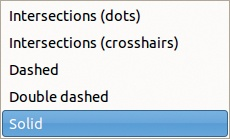

图 10-15. 可用的网格线样式

我们可以通过选择**图像：图像 > 配置网格**来配置网格。如图 10-14 所示，弹出对话框。我们可以更改多个参数，接下来将依次考虑这些参数。

网格的外观由三个参数控制：线条样式、前景色和背景色。您可以选择五种线条样式，如图 10-15 所示：

+   交叉点（点）样式显示在图 10-16 中。点的宽度为一个像素，无论图像的缩放因子如何。它们可能不太容易看到。

+   交叉线（准线）样式显示在图 10-17 中。交叉点比点更为明显，但它们可能会分散注意力。

+   虚线样式显示在图 10-18 中。我们增加了缩放因子，以使细节更加明显。此线条样式强调的是网格中的线条，而不是交叉点。

    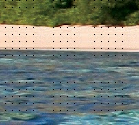

    图 10-16. 交叉点（点）线样式

    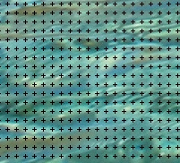

    图 10-17. 交叉线（准线）样式

    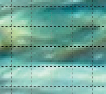

    图 10-18. 虚线样式

+   双虚线样式显示在图 10-19 中。在这里，我们再次增加了缩放因子，因此线条更加明显。

+   实线样式显示在图 10-20 中。实线是默认样式，在此处以中等缩放因子显示。

前景色是点、交叉准线或线条的颜色。在图 10-20 中，我们将其改为绿色。

背景色仅与双虚线一起使用，如图 10-19 所示，其中背景色为青色。

网格的间距决定了网格单元的大小。可以选择像素或您偏好的任何单位。大小取决于图像分辨率，如本章前面讨论的那样。要创建矩形网格，请在输入新大小之前打破下方的链条。

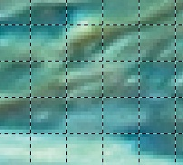

图 10-19. 双虚线样式

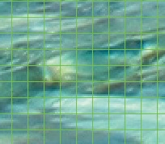

图 10-20. 实线样式

网格的 OFFSET 指定了第一个坐标的位置。最初，第一个坐标是 (0, 0)（即位于画布的左上角）。

# 10.4 缩放

你可能想要更改图像的缩放因子——无论是查看完整图像，还是专注于某个具体细节。你可以通过多种方式调整缩放；你可以直接从图像窗口访问几种方法。

图像窗口底部栏的缩放菜单允许你从几个预定义的缩放因子中选择。你也可以直接输入所需的因子。

**图像：视图 > 缩放** 会弹出另一个缩放菜单，见 图 10-21。在这里，你可以选择相同的预定义缩放因子，另外还可以选择两个更多的选项。请注意常用缩放因子的键盘快捷键。如果你最近使用过一个非预定义的缩放因子，它会出现在菜单的末尾。

你还可以使用“放大”或“缩小”项逐步调整此比例。请注意，键盘快捷键 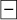 和 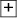 也能执行此操作。使用“恢复缩放”或 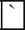 键（反引号）可以返回到前一个缩放因子。

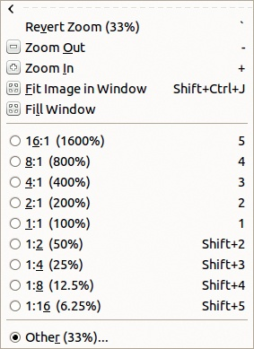

图 10-21. 图像：视图 > 缩放菜单

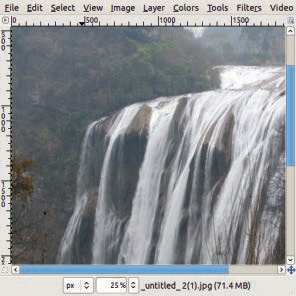

图 10-22. 从 50% 缩放因子开始

剩下的两个选项最好通过示例来解释。图 10-22 显示了一个缩放因子为 50% 的窗口。如果我们选择 **图像：视图 > 缩放 > 填充窗口**，我们会得到 图 10-23。缩放因子已经改变，以便图像填充窗口的尺寸。如果我们选择 **图像：视图 > 缩放 > 适合图像于窗口**（或 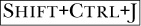），我们会得到 图 10-24。在这种情况下，所选的缩放因子给出了最接近的缩放，同时仍保持图像的完整性在窗口内可见。

请注意，所有这些缩放更改不会改变窗口的大小。另一方面，命令**图像：视图 > 缩小包装**，或者 ，会在不改变图像缩放因子的情况下更改窗口大小，适用于单窗口模式和多窗口模式。

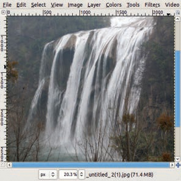

图 10-23. 填充窗口后

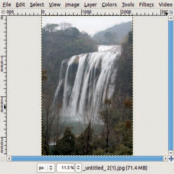

图 10-24. 图像适合窗口后

图 10-25. 缩放工具图标

按下  键时，你可以使用鼠标滚轮通过标准的缩放比例进行放大或缩小。

如果图像窗口右上角的小窗口调整按钮已勾选，那么更改窗口大小时会更改缩放比例。根据情况，这可能是有用的，也可能是令人烦恼的。

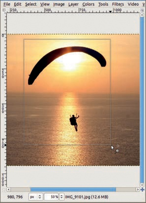

图 10-26. 使用缩放工具放大

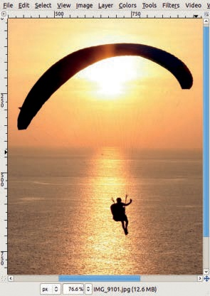

图 10-27. 放大后的效果

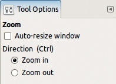

图 10-28. 缩放工具选项

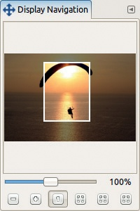

图 10-29. 导航对话框

还有另一个工具可用于调整缩放比例：恰如其分命名的缩放工具，可以通过工具箱访问（图 10-25）或按下  来启用。图 10-26 显示了这个工具的放大模式（鼠标指针旁边的 + 号表示）。要放大，点击并拖动矩形框选图像中你希望填充窗口的部分。图 10-27 显示了结果。

这个工具也可以用来缩小。你画出的矩形显示了图像缩小后的新比例。此外，简单地用缩放工具点击图像可以沿着缩放比例放大或缩小。

缩放工具有一些选项，显示在 图 10-28 中。你可以放大或缩小，或者按下  键切换这个参数。如果勾选了“自动调整窗口”复选框，窗口的大小会发生变化，以包含图像中的相同部分。

如果你仍然没有找到完美的缩放工具，下面有另一个工具：**图像：视图 > 导航窗口**。选择此工具后，图 10-29 中的小型可停靠对话框会弹出。底部的六个按钮提供以下功能：

+   缩小。

+   放大。

+   放大到 100%。

    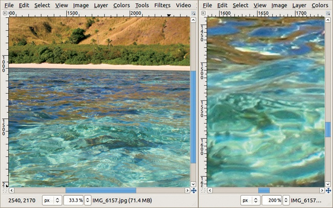

    图 10-30. 同一图像的两种视图

+   调整缩放比例，使图像完全可见，而不改变图像窗口的大小；这相当于 。

+   调整缩放比例，使整个窗口都能显示图像；这相当于 **图像：视图 > 缩放 > 填充窗口**。

+   将图像窗口缩小到与图像显示大小相同；这相当于 。

滑块允许我们选择从 0.39% 到 25600% 的任意缩放因子。最后，图像预览在当前显示在图像窗口中的部分周围显示一个框架。你可以用鼠标指针移动它。

# 10.5 使用多个视图

如你刚刚看到的，你可以以不同的大小和缩放因子查看图像。但有时，你可能需要同时打开几个不同的视图。例如，假设我们正在仔细修饰一张照片。我们需要查看正在修饰的细节的特写视图。同时，我们还希望看到修饰工作对照片的效果，以便它将在打印时的大小。

要打开图像的多个视图，选择**图像：视图 > 新视图**。打开的新图像窗口是相同图像的另一个视图，而不是它的新副本。例如，在图 10-30 的左侧，你看到一张海滨风景照片，缩放因子为 33.3%，而右侧则看到照片前景中小波浪的涟漪，使用了 200% 的缩放因子。当我们对右侧的图像进行操作时，效果会立即在左侧的窗口中显示出来。请注意，在单窗口模式下，这个功能的用处不大，因为在单窗口模式下，即使两者都在 GIMP 中打开，你也无法同时查看两幅不同的图像。你只能从一个视图切换到另一个，然后再返回。

有时，你可能希望将图像窗口放大至全屏。最好的方法不是使用窗口栏上的按钮，而是通过选择**图像：视图 > 全屏**，或者按下 ，这是一个切换按钮。结果如图 10-31 所示。在设置一般参数时（见第二十二章），你还可以选择最小化屏幕上的显示内容，为图像提供更多空间。你可以隐藏标尺、滚动条、状态栏，甚至菜单栏，如本示例所示。需要时，你可以通过图像窗口左上角的菜单按钮（如果显示标尺）或右键点击图像来恢复它们。

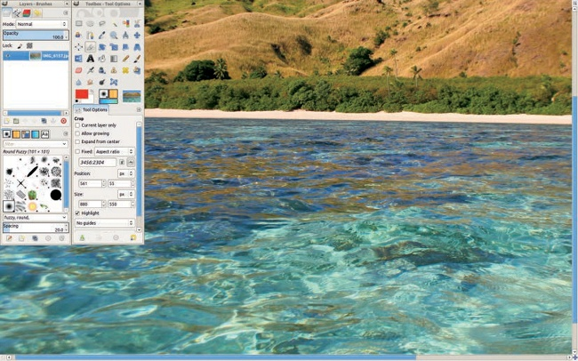

图 10-31. 将图像窗口放大至全屏
