# 第十一章. 图层

图层在 GIMP 中至关重要，如果没有图层，这个强大的应用程序几乎没有什么用处。我们只能使用 GIMP 进行简单的绘图或小规模的照片修饰。GIMP 所有更强大、更灵活的功能都依赖于图层。

当图像有多个图层时，GIMP 工作区表现得像一叠透明胶片。你可以在这些透明胶片上绘制或涂鸦，或者将现有图像的部分内容安排到不同的图层上。设置图层的可见性，调整它们的透明度，或调整它们与其他图层的混合方式。你可以在画布上移动它们，并控制它们在图层堆栈中的顺序。在修改图层之前，复制一层，以便如果出现错误或需要将该图层用于其他目的时，可以保留一个完整的副本。图层使得许多事情成为可能，本章仅涵盖基本概念，后续章节会将这些概念与 GIMP 提供的工具和功能结合起来。在本章中，我们将探讨层对话框、层菜单以及**图像：图层**菜单。

# 11.1 层对话框

图 11-1 显示了 第三章 中绘制的图像的层对话框示例。这个对话框可能是所有 GIMP 对话框中最重要的，包括工具箱，因为后者可以通过**图像：工具**菜单（或键盘快捷键）替代。默认情况下，层对话框是多对话框窗口的一个组件，你很可能会希望保持它打开。如果你关闭了它，可以通过选择**图像：窗口 > 可停靠对话框 > 层**，或者按下  来重新打开它。即使该对话框被  命令隐藏，键盘快捷键仍会将其置于最前面。

## 层对话框的组成部分

让我们来看看层对话框的组成部分。下面的数字指的是 图 11-1。

1.  图像名称实际上不是对话框的一部分，而是多对话框窗口的一部分。如果你选择了不同的标签（例如，通道对话框），图像名称仍然会保持可见。你可以在配置菜单中更改图像名称是否可见（该菜单通过标有 4 的按钮打开）。要显示图像名称，请勾选“显示图像选择”。在同时处理多个图像时，显示图像名称非常有用。

    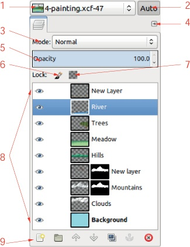

    图 11-1. 层对话框

    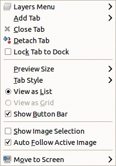

    图 11-2. 配置菜单

1.  这个按钮切换多对话框窗口是否始终反映当前图像。

1.  MODE 下拉菜单设置当前图层的混合模式。有关 21 种可用混合模式的描述，请参见 12.2 混合模式。

1.  此按钮打开配置菜单，该菜单出现在所有可停靠的对话框中，并显示在 图 11-2 中。第一个条目打开图层菜单，稍后将在本章讨论。配置菜单还允许你添加、关闭或分离多对话框菜单中的标签；更改预览大小和标签样式；以及显示或隐藏对话框中的元素。最后一个条目允许你在多个显示器之间切换，如果你正在使用多个显示器的话。

1.  不透明度滑块允许你设置当前图层的不透明度。这与透明度独立，因此没有 Alpha 通道的图层也可以通过不透明度滑块变得半透明。图层不透明度与图层混合模式结合，决定当前图层的像素与下层图层像素之间的交互。例如，溶解模式与正常模式的不同之处仅在于图层不透明度低于 100% 时才有效。

1.  画笔图标是一个切换按钮。按下时，图层像素被锁定，意味着它们不能被更改。这在你想要保护图层不受意外修改时非常有用。在锁定像素的图层上绘画与在“Behind”模式下绘画非常相似：当像素被锁定时，绘画工具仍然可以在透明区域工作。

1.  方形图标是另一个切换按钮，如果图层有 Alpha 通道，它将锁定该通道。如果 Alpha 通道被锁定，绘画工具无法在当前图层的透明区域工作，但可以在不透明区域工作，只要像素没有被锁定。如果两个锁（像素和 Alpha 通道）都被选中，则图层无法更改。这些按钮在构建徽标时非常有用，如 第四章 中所示。如果你想模糊徽标以增加其立体感，Alpha 通道必须解锁。如果你想绘制徽标，Alpha 通道必须锁定。

1.  图层对话框的主要部分包含与图像中图层数量相同的条目。当前图层通过突出显示相应的条目（在 图 11-1 中为蓝色，当前图层命名为 `River`）来标记。

    

    图 11-3. 图层对话框中的示例图层

    始终注意哪个图层是当前图层，因为对图像所做的任何操作都会应用到该图层，而该图层可能是不可见的，或者被另一个图层隐藏。当当前图层被隐藏时，变化看起来没有效果，但当前图层在图层堆栈中的某个位置仍然受到影响。有时没有图层是当前图层，例如当通道处于活动状态时。在这种情况下，应用变化到图像时，活动通道会受到影响。

1.  图层对话框的底部显示一排七个按钮，它们是图层或**图像：图层**菜单项的快捷方式。从左到右，这些按钮允许您执行以下操作：

    +   创建一个新图层。按住可以使用上次的参数。否则，会弹出一个对话框以设置这些参数。

    +   创建一个新的图层组。

    +   在图层堆栈中提升当前图层。按下将其移动到顶部。

    +   降低图层堆栈中的当前图层。按下将其移到底部。

    +   复制当前图层。

    +   锚定浮动图层。

    +   删除当前图层。

## 图层对话框中的图层条目

图 11-3 展示了图层对话框中可能显示的所有图层组件。按从左到右的顺序，具体如下：

+   眼睛图标表示该图层是可见的（如果没有上层图层隐藏它的话）。点击它可以切换可见性。一个不可见的图层不会对可见图像产生贡献，但这并不妨碍对它进行修改。

+   链接图标表示该图层已与其他对象链接。只有当多个对象被激活时，这才有意义。我们可以将多个图层链接在一起，或者通过各自的对话框将通道和路径链接起来。有关通道的详细信息，请参见第十四章，有关路径的详细信息，请参见 13.3 路径工具。当多个对象被链接时，移动工具和变换工具（见第十六章）会作用于整个链接对象集。然而，每个图像仅限于一个链接对象集。点击链条图标可以打开或关闭该图层的链接。

+   缩略图提供了图层内容的缩小视图。如果其框架为白色，则该图层为当前图层，任何修改都会影响它。否则，框架为黑色。点击缩略图会使该图层处于活动状态。如果点击并按住，缩略图会弹出一个较大的版本。将缩略图点击并拖动到工具箱中，可以从该图层创建一个新图像。将它拖入另一个图像中，会将该图层作为新图层复制到该图像中。

+   如果图层有图层蒙版（参见 14.2 图层蒙版），其缩略图会显示在右侧，并且具有与图层缩略图相同的属性。如果蒙版框为白色，表示蒙版是激活的，所做的任何修改将应用到蒙版上。如果蒙版框为红色，表示图层蒙版处于非激活状态。当图层蒙版被选中时，图像窗口中的虚线轮廓会从黄黑色变为绿黑色。-点击缩略图可以切换图层蒙版的激活状态，-点击则切换图层蒙版的可见性。

    将图层蒙版缩略图拖到另一个图像中，作为图层添加，或者拖到工具箱中创建一个新图像的副本。

+   图层条目的最后一项是图层名称。如果图层没有 Alpha 通道，名称会以粗体显示。图层在创建时会被分配一个名称，但可以更改。双击它，按下，或选择**图层：右键 > 编辑图层属性**来更改名称。

    如果该图层用于作为动画帧（参见第十八章），其名称后可以附加文本来改变帧的行为：以毫秒为单位的持续时间，如`(200ms)`，以及帧的组合模式——可以是`(combine)`或`(replace)`。

## 图层对话框中的快捷键

当图层对话框处于活动状态时，可以使用一些实用的快捷键。

+   上箭头键选择当前图层上方的图层作为新的当前图层，下箭头键选择下方的图层。

+   键将栈中的顶部图层设置为当前图层，键将底部图层设置为当前图层。

+   水平箭头键在当前图层的四个（或五个）组件之间切换：可见性、链接、图层缩略图、图层蒙版缩略图和图层名称。

+   和键切换所选图层的组件（可见性、链接、图层或其图层蒙版的活动状态、以及图层名称），即使其图层不是活动的。

+   按下并配合上下箭头键可以在图层之间切换，而不改变当前图层。你可以将其与水平箭头键或或键结合使用。

+   键会擦除当前图层的内容（或该图层中的选区）。

## 图层对话框的用途

总结来说，图层对话框允许你执行以下操作：

+   通过点击右上角按钮打开配置菜单。该菜单中的第一个条目打开图层菜单（将在本章后面详细介绍）。

+   更改图层的混合模式。有关混合模式的示例和完整描述，请参阅 12.2 混合模式。

+   设置图层的不透明度。

+   锁定像素或 Alpha 通道。

+   通过点击眼睛图标设置图层的可见性。请注意，这与图层的活动状态是独立的。不可见的图层仍然可以被修改。

+   通过点击图层缩略图设置图层的活动状态。请注意，这不会改变图层的可见性。

+   通过点击、点击或点击其缩略图来设置图层蒙版的活动状态。

+   通过双击图层名称来更改图层的名称。

+   通过点击并拖动图层缩略图或名称上下移动图层堆叠中的图层。此方法也可用于将图层移入或移出图层组。

+   通过右键点击图层条目的任意位置打开图层菜单。

+   使用底部行中的七个按钮执行常见的图层相关任务。

# 11.2 图层菜单

图层菜单（图 11-4）可以通过右键点击图层对话框中的任何图层项，或通过选择图层对话框中“配置”菜单的第一个条目来选择。如果当前图层是文本图层，该菜单会包含五个额外的条目，具体描述见 15.8 文本工具。在本节中，我们将逐一检查图层菜单中的每个条目。

“编辑图层属性”将打开如图 11-5 所示的对话框。唯一可以更改的属性是图层名称。

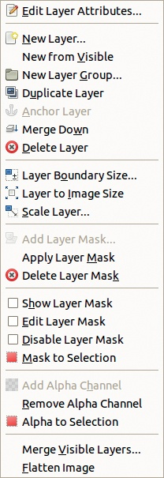

图 11-4. 图层菜单

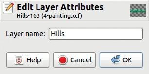

图 11-5. 编辑图层属性对话框

NEW LAYER（新建图层）打开图 11-6 所示的对话框。一个描述性的图层名称可以帮助你快速识别图像的各个组件。如果没有输入名称，将自动生成一个名称，如`Layer #1`。宽度和高度初始值与画布相同，但你可以输入不同的值。如果新图层比画布大，超出画布范围的部分将不可见。新图层的尺寸可以设置为画布尺寸的百分比、像素或其他单位。请注意，以英寸、毫米或其他标准单位的度量值是根据当前分辨率计算的（参见 10.1 尺规和单位）。最后，四个单选按钮允许你选择图层的初始填充方式。图层可以用前景色、背景色、白色或透明填充。除非选择透明填充，否则新图层没有 Alpha 通道。

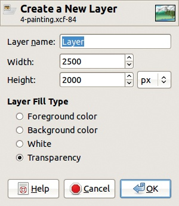

图 11-6. 创建新图层对话框

NEW FROM VISIBLE（从可见图层创建新图层）创建一个新图层，初始名称为`Visible`，并填充当前图像的内容。该新图层会被放置在当前图层的上方。贡献此新图层的图层会在创建前进行合并，因此即使多个图层是可见的，也只会创建一个新图层。

NEW LAYER GROUP（新建图层组）创建一个新的空图层组，初始名称为`Layer Group`。此概念在 11.3 图层组中讨论。

DUPLICATE LAYER（复制图层）会创建当前图层（或图层组）的副本，将其放置在当前图层的上方，并命名为当前图层名称加上“`copy`”一词。副本继承原图层的所有特性，包括混合模式、不透明度和锁定。

ANCHOR LAYER（锚定图层）仅在存在浮动选择时有效。请参见 13.4 使用选择。浮动选择将被锚定到最后的当前图层。

图 11-7. 图层合并选项对话框

MERGE DOWN（向下合并）将当前图层与下方的图层合并。如果当前图层不可见，它将像可见图层一样合并。然而，如果下方的图层不可见，并且下方没有可见的图层，则 MERGE DOWN 不可用。当当前图层下方的图层形成图层组时，MERGE DOWN 也不可用。

MERGE LAYER GROUP（合并图层组）仅在当前图层是图层组时出现在菜单中。此组将被替换为一个单一图层，包含该组的所有图层。

DELETE LAYER（删除图层）删除当前激活的图层或图层组。与其他图层菜单操作一样，此操作可以撤销。

图层菜单中的接下来的四个条目也可以在**图像：图层**菜单中找到，并在 11.4 图像：图层菜单中讨论。因此，我们跳过图层菜单中的最后两个条目。

合并可见图层（MERGE VISIBLE LAYERS）仅作用于勾选了眼睛图标的图层，并根据各自的不透明度和混合模式将其合并。对话框显示在图 11-7 中。新图层可以调整为与最大图层、画布或底层匹配。如果勾选了“丢弃不可见图层”（DISCARD INVISIBLE LAYERS）框，则不可见图层会被删除。否则，它们仍然保留在图像中。请注意，此操作会删除图像中的可见图层，不同于“从可见图层新建”（NEW FROM VISIBLE），后者通常是更好的选择。如果你确实选择使用“合并可见图层”，我们强烈建议你首先使用**图像：文件 > 保存副本**保存图像副本。

扁平化图像（FLATTEN IMAGE）将所有图层替换为图像的单一图层表示。这是一个破坏性操作，应仅在保存了包含图层的图像副本后使用。

# 11.3 图层组

图层组是 GIMP 2.8 中的一个新特性，概念仍在不断发展。

要创建一个新的图层组，请点击图层对话框底部的相应按钮，或使用**图像：图层 > 新建图层组**或**图层：右键点击 > 新建图层组**。

图层组出现在当前图层之上，最初为空。一个好主意是立即为其起个有意义的名称。要将图层添加到图层组中，点击并拖动它到图层堆叠中的图层组。移出图层组或在堆叠中移动整个图层组时，也可使用相同方法。你还可以通过图层对话框中的相应按钮或图层菜单中的条目，将新图层添加到图层组中。点击小三角形可以显示(图 11-8)或隐藏(图 11-9)图层组的内容。图层组可以放入另一个图层组中。

图层组是组织复杂图像中图层的一种有用方式。可以对图层组执行以下操作：

+   锁定像素

+   改变图层组的不透明度

+   使用眼睛图标切换可见性

+   使用链条图标切换图层链接

+   在图层堆叠中移动图层组

+   使用移动工具移动图层

+   对所有图层应用变换（请参见第十六章）

+   复制图层组及其内容

+   通过点击并拖动图层组及其内容，或通过复制并粘贴它，将图层组及其内容复制到另一个图像

    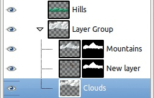

    图 11-8. 这个图层组包含三个图层

    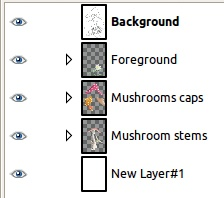

    图 11-9. 三个最小化的图层组

+   删除图层组及其内容

+   将图层混合模式应用于图层组，这只会影响图层组中的图层

我们将使用第三章教程的结果来演示图层组的属性。这张图包含 20 个图层，我们在构建图像时对其进行了组织。每个蘑菇帽由两个图层组成，其中一个图层包含图层蒙版。蘑菇的茎由六个图层组成。前景中的花朵和石头由四个图层组成。最后，整张图像有一个白色背景，堆叠在最上面的是一个名为`背景`的图层，该图层采用叠加混合模式并包含原始绘图。可以将这些图层直观地组织成三个图层组：`蘑菇茎`、`蘑菇帽`和`前景`。为了在不改变图层顺序的情况下完成此操作，在将来组的最上层图层激活时，点击新建图层组按钮，然后通过点击并拖动图层到上层或空图层组中将图层移动到组内。图 11-9 展示了将这三个图层组最小化后的效果。

图 11-10. 移动蘑菇帽图层组

图 11-11. 将图层组的不透明度降低到 50%

你可以通过点击图层组的眼睛图标来隐藏图层组，或者使用移动工具一次性移动所有图层（参见图 11-10）。如果图层组被隐藏，图层组中的图层将不可见，并且它们的眼睛图标将被划掉。你还可以改变整个图层组的不透明度（参见图 11-11)。

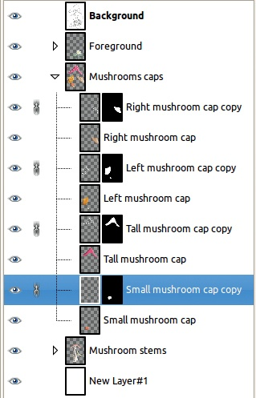

图 11-12. 链接非连续图层

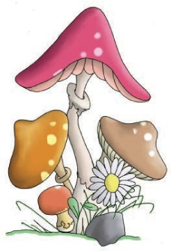

图 11-13. 仅移动蘑菇帽的区域

层组中的所有图层必须在图层堆栈中是连续的。但链接图层则不必如此。例如，我们可以将所有蘑菇帽的第二层链在一起，这一层包含图层蒙版，并用于绘制帽上的斑点（见图 11-12）。现在，我们可以将链接的图层一起移动，但与图层组分开，如图 11-13 所示（与图 11-10 比较）。这些链接的图层甚至可以位于不同的图层组中。

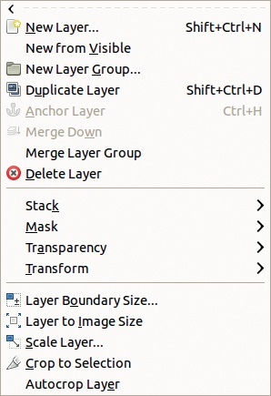

图 11-14. 图像：图层菜单

图层组会保存在 XCF 文件中，独立于单个图层。在 GIMP 2.8 中，可以旋转或缩放一个图层组，而不旋转或缩放组内的单个图层组件。当图层组被旋转或缩放时，会创建一个浮动选择，包含转换后的结果，原始图层组会被合并并替换为变换后的组件。然而，单个图层保持不变。

# 11.4 图像：图层菜单

**图像：图层**菜单如图 11-14 所示。某些菜单项也可以在**图层：右键 > 图层**菜单中找到，但也有许多新项。

前八个条目（如果没有现有的图层组则是七个）也可以在**图层：右键 > 图层**菜单中找到，但在**图像：图层**菜单中，这些条目有三个配有快捷键：

+    打开新的图层对话框。

+    复制当前图层。

+    锚定浮动选择。

图 11-15. 图层堆栈菜单

这个菜单和这些快捷键允许我们对图层堆栈进行重大修改，而无需查看它，这通常是不建议的。看不清自己在做什么时，犯错误的可能性更大。最好在图层对话框中调整图层，尽可能避免直接修改。

如果当前图层是文本图层，图层菜单还会包含四个专门针对文本的条目，详见 15.8 文本工具。接下来是接下来讨论的四个菜单。

## 图层堆栈菜单

图层堆栈菜单如图 11-15 所示。菜单中有四个命令，在处理有很多图层的图像时特别有用：

+   选择上一个图层 () 相当于点击图层对话框中的上一个图层，唯一的例外是：如果当前图层位于图层组内，则此命令不适用于组外的图层。

+   选择下一个图层 () 选择下一个图层，与上述的例外相同。

+   选择顶部图层 () 选择堆栈中的最上层图层或组中的最上层图层。

+   选择底部图层 () 选择堆栈中的最底层图层或组中的最底层图层。

请注意，键盘上的箭头键可以用来选择上一个或下一个图层，但仅在图层对话框处于激活状态时有效。有关此对话框中可用的其他键盘快捷键，请参见图层对话框中的键盘快捷键。

接下来的四个命令用于移动当前图层在图层堆栈中的位置：

+   提升图层将图层向上移动到堆栈中。它不能提升组外的图层。要将图层移出其组，点击并拖动它。

+   降低图层将图层向下移动到堆栈中。

+   LAYER TO TOP 将当前图层移至堆栈的最顶层，或如果它属于图层组，则移至图层组的最顶层。

+   LAYER TO BOTTOM 将图层移至堆栈或组的最底部。

最后，REVERSE LAYER ORDER 只能从此菜单中调用。图层组视为一个单独的图层，且无法在图层组内反转图层顺序。

## 遮罩、透明度和变换菜单

遮罩菜单处理图层遮罩，详见 14.2 图层遮罩。它提供的选项稍多于**图层：右键 > 图层**菜单中的选项。

透明度菜单在透明度与 Alpha 通道中进行了讨论。它的三个条目也出现在**图层：右键 > 图层**菜单中。

使用变换菜单是翻转或旋转当前图层的最简单方法。你也可以使用翻转工具 () 或任意旋转，这也可以通过旋转工具访问 ()。有关变换菜单的更多信息，请参见变换图层。

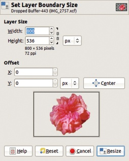

图 11-16。设置图层边界大小对话框

## 最后五个条目

图像：图层菜单中的其余五个条目提供了唯一的访问其各自操作的方式：

+   LAYER BOUNDARY SIZE 打开如图 11-16 所示的对话框，该对话框与**图像：图像 > 画布大小**的对话框非常相似，后者在调整图像大小中有描述。您可以选择图层的确切尺寸，以及其内容在新尺寸内的位置。通过设置*X*和*Y*字段，拖动窗口中的图层预览，或使用 CENTER 按钮来调整位置。如果您缩小图层的大小，被剪裁的内容会被删除，但如果将图层扩大到超出图像边界，图像边界之外的内容会被保留，尽管它不可见。此工具也适用于图层组。

+   LAYER TO IMAGE SIZE 将图层设置为图像大小，不会弹出对话框，也不会移动图层内容。任何超出画布范围的图层部分都会被删除。此工具也适用于图层组。

+   SCALE LAYER 打开如图 11-17 所示的对话框，该对话框与**图像：图像 > 缩放图像**对话框相同，后者在 10.1 尺寸标尺和单位和调整图像大小中有描述。唯一的区别是您不能更改图层的分辨率，因为图层分辨率由图像分辨率固定。此工具也适用于图层组。

    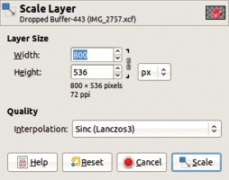

    图 11-17. 缩放图层对话框

    

    图 11-18. 自动裁剪图层组

+   CROP TO SELECTION 仅在当前有选择区域时才会启用。图层的尺寸将设置为包含选择区域的最小矩形。

+   AUTOCROP LAYER 将图层裁剪到包含与图层边框颜色不同的颜色数据的最小矩形。这类似于**图像：图像 > 自动裁剪图像**，在裁剪图像中有描述。此工具也适用于图层组，如图 11-18 所示，其中当前图层是整个`蘑菇帽`图层组。
